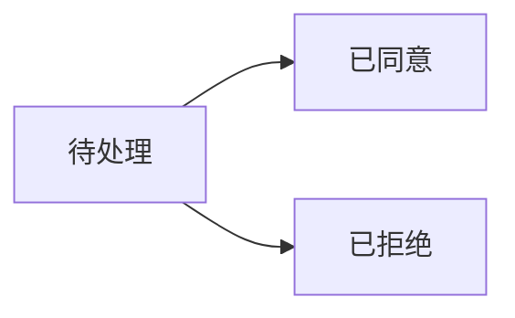

# 售后管理API

<cite>
**本文引用的文件**
- [AfterSaleController.java](file://mall-server/src/main/java/com/rabbiter/em/controller/AfterSaleController.java)
- [AfterSaleService.java](file://mall-server/src/main/java/com/rabbiter/em/service/AfterSaleService.java)
- [AfterSale.java](file://mall-server/src/main/java/com/rabbiter/em/entity/AfterSale.java)
</cite>

## 目录
1. [简介](#简介)
2. [API接口列表](#api接口列表)
3. [详细接口说明](#详细接口说明)
4. [数据模型](#数据模型)
5. [权限控制](#权限控制)
6. [错误码](#错误码)
7. [使用示例](#使用示例)

## 简介

售后管理模块提供用户售后申请和管理员处理售后请求的功能。支持退款和售后两种类型，包含申请、查询、处理等完整流程。

## API接口列表

| 接口 | 方法 | 路径 | 权限 | 说明 |
|------|------|------|------|------|
| 创建售后申请 | POST | /api/afterSale | requireLogin | 用户创建售后申请 |
| 查询我的售后 | GET | /api/afterSale/mine/page | requireLogin | 查询当前用户的售后列表 |
| 查询所有售后 | GET | /api/afterSale/page | requireAuthority | 管理员查询所有售后 |
| 查询售后详情 | GET | /api/afterSale/{id} | requireLogin | 查询售后申请详情 |
| 处理售后申请 | PUT | /api/afterSale/handle | requireAuthority | 管理员处理售后申请 |

## 详细接口说明

### 1. 创建售后申请

用户提交售后申请，包括退款或售后两种类型。

**请求**
- 方法：`POST`
- 路径：`/api/afterSale`
- 权限：requireLogin
- Content-Type：`application/json`

**请求体**
```json
{
  "orderNo": "202512010001",
  "type": "退款",
  "reason": "商品质量问题，申请退款"
}
```

**参数说明**
| 参数 | 类型 | 必填 | 说明 |
|------|------|------|------|
| orderNo | String | 是 | 订单编号 |
| type | String | 是 | 类型（退款/售后） |
| reason | String | 是 | 申请原因 |

**成功响应**
```json
{
  "code": "200",
  "msg": null,
  "data": null
}
```

**错误响应**
```json
{
  "code": "500",
  "msg": "系统错误",
  "data": null
}
```

**业务逻辑**
1. 验证用户登录状态
2. 获取当前用户ID
3. 创建售后申请记录
4. 设置状态为"待处理"
5. 保存到数据库

### 2. 查询我的售后

查询当前登录用户的售后申请列表（分页）。

**请求**
- 方法：`GET`
- 路径：`/api/afterSale/mine/page?pageNum=1&pageSize=10`
- 权限：requireLogin

**查询参数**
| 参数 | 类型 | 必填 | 说明 |
|------|------|------|------|
| pageNum | int | 是 | 页码 |
| pageSize | int | 是 | 每页数量 |

**成功响应**
```json
{
  "code": "200",
  "msg": null,
  "data": {
    "records": [
      {
        "id": 1,
        "orderNo": "202512010001",
        "userId": 1001,
        "type": "退款",
        "status": "待处理",
        "reason": "商品质量问题",
        "createTime": "2025-12-01 10:00:00",
        "handleTime": null
      }
    ],
    "total": 1
  }
}
```

### 3. 查询所有售后（管理员）

管理员查询所有用户的售后申请，支持条件筛选。

**请求**
- 方法：`GET`
- 路径：`/api/afterSale/page?pageNum=1&pageSize=10&status=&type=&orderNo=`
- 权限：requireAuthority

**查询参数**
| 参数 | 类型 | 必填 | 说明 |
|------|------|------|------|
| pageNum | int | 是 | 页码 |
| pageSize | int | 是 | 每页数量 |
| status | String | 否 | 状态筛选（待处理/已同意/已拒绝） |
| type | String | 否 | 类型筛选（退款/售后） |
| orderNo | String | 否 | 订单编号筛选 |

**成功响应**
```json
{
  "code": "200",
  "msg": null,
  "data": {
    "records": [...],
    "total": 100
  }
}
```

### 4. 查询售后详情

查询指定售后申请的详细信息。

**请求**
- 方法：`GET`
- 路径：`/api/afterSale/{id}`
- 权限：requireLogin

**路径参数**
| 参数 | 类型 | 必填 | 说明 |
|------|------|------|------|
| id | Long | 是 | 售后申请ID |

**成功响应**
```json
{
  "code": "200",
  "msg": null,
  "data": {
    "id": 1,
    "orderNo": "202512010001",
    "userId": 1001,
    "type": "退款",
    "status": "待处理",
    "reason": "商品有质量问题，申请退款",
    "createTime": "2025-12-01 10:00:00",
    "handleTime": null
  }
}
```

**错误响应**
```json
{
  "code": "404",
  "msg": "未找到申请",
  "data": null
}
```

或

```json
{
  "code": "403",
  "msg": "无权限",
  "data": null
}
```

### 5. 处理售后申请（管理员）

管理员处理用户的售后申请，可以同意或拒绝。

**请求**
- 方法：`PUT`
- 路径：`/api/afterSale/handle`
- 权限：requireAuthority
- Content-Type：`application/json`

**请求体**
```json
{
  "id": 1,
  "status": "已同意"
}
```

**参数说明**
| 参数 | 类型 | 必填 | 说明 |
|------|------|------|------|
| id | Long | 是 | 售后申请ID |
| status | String | 是 | 处理状态（已同意/已拒绝） |

**成功响应**
```json
{
  "code": "200",
  "msg": null,
  "data": null
}
```

**业务逻辑**
1. 验证管理员权限
2. 查找售后申请
3. 更新状态
4. 设置处理时间
5. 保存到数据库

## 数据模型

### AfterSale实体

```java
public class AfterSale {
    private Long id;
    private String orderNo;      // 订单编号
    private Long userId;         // 用户ID
    private String type;         // 类型（退款/售后）
    private String status;       // 状态（待处理/已同意/已拒绝）
    private String reason;       // 申请原因
    private String createTime;   // 申请时间
    private String handleTime;   // 处理时间
}
```

**字段说明**
| 字段 | 类型 | 必填 | 说明 |
|------|------|------|------|
| id | Long | 是 | 售后申请ID |
| orderNo | String | 是 | 订单编号 |
| userId | Long | 是 | 用户ID |
| type | String | 是 | 类型（退款/售后） |
| status | String | 是 | 状态（待处理/已同意/已拒绝） |
| reason | String | 是 | 申请原因 |
| createTime | String | 是 | 申请时间 |
| handleTime | String | 否 | 处理时间 |

## 权限控制

| 接口 | 权限级别 | 说明 |
|------|---------|------|
| 创建售后申请 | requireLogin | 登录用户可创建 |
| 查询我的售后 | requireLogin | 只能查看自己的售后 |
| 查询所有售后 | requireAuthority | 仅管理员可访问 |
| 查询售后详情 | requireLogin | 只能查看自己的，管理员可查看所有 |
| 处理售后申请 | requireAuthority | 仅管理员可处理 |

## 错误码

| 错误码 | 说明 | 触发场景 |
|--------|------|---------|
| 200 | 成功 | 操作成功 |
| 401 | 未授权 | 未登录或token无效 |
| 403 | 无权限 | 查看他人售后或普通用户调用管理接口 |
| 404 | 未找到 | 售后申请不存在 |
| 500 | 系统错误 | 服务器内部错误 |

## 使用示例

### 前端Vue 3调用示例

```vue
<script setup>
import { ref, onMounted } from 'vue'
import { ElMessage } from 'element-plus'
import request from '@/utils/request'

const tableData = ref([])
const pageNum = ref(1)
const pageSize = ref(10)
const total = ref(0)

// 创建售后申请
const createAfterSale = async (formData) => {
  try {
    const res = await request.post('/api/afterSale', formData)
    if (res.code === '200') {
      ElMessage.success('申请提交成功')
      load()
    } else {
      ElMessage.error(res.msg || '申请失败')
    }
  } catch (err) {
    console.error('创建售后申请失败:', err)
    ElMessage.error('申请失败，请重试')
  }
}

// 查询我的售后
const loadMine = async () => {
  try {
    const res = await request.get('/api/afterSale/mine/page', {
      params: {
        pageNum: pageNum.value,
        pageSize: pageSize.value
      }
    })
    if (res.code === '200') {
      tableData.value = res.data.records || []
      total.value = res.data.total || 0
    }
  } catch (err) {
    console.error('加载售后列表失败:', err)
    ElMessage.error('加载失败，请重试')
  }
}

// 处理售后申请（管理员）
const handleAfterSale = async (id, status) => {
  try {
    const res = await request.put('/api/afterSale/handle', {
      id,
      status
    })
    if (res.code === '200') {
      ElMessage.success('处理成功')
      load()
    } else {
      ElMessage.error(res.msg || '处理失败')
    }
  } catch (err) {
    console.error('处理售后失败:', err)
    ElMessage.error('处理失败，请重试')
  }
}

onMounted(() => {
  loadMine()
})
</script>
```

## 附录

### 相关文件

- 控制器：[AfterSaleController.java](file://mall-server/src/main/java/com/rabbiter/em/controller/AfterSaleController.java)
- 服务层：[AfterSaleService.java](file://mall-server/src/main/java/com/rabbiter/em/service/AfterSaleService.java)
- 实体类：[AfterSale.java](file://mall-server/src/main/java/com/rabbiter/em/entity/AfterSale.java)
- 前端页面：[AfterSale.vue](file://mall-web/src/views/front/AfterSale.vue)
- 管理页面：[AfterSale.vue](file://mall-web/src/views/manage/AfterSale.vue)

### 售后状态流转


