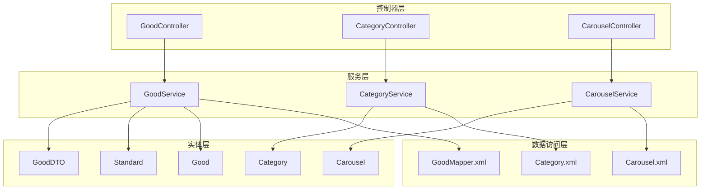
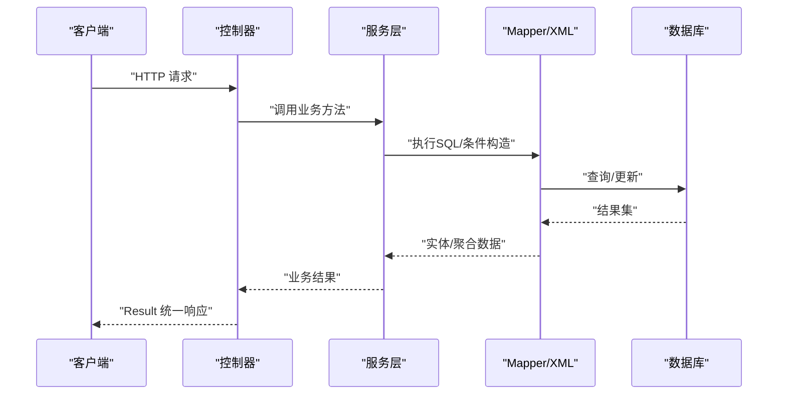
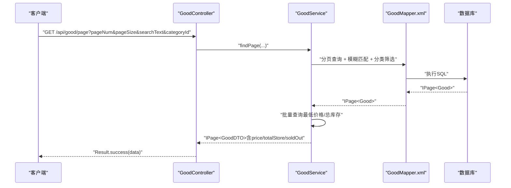
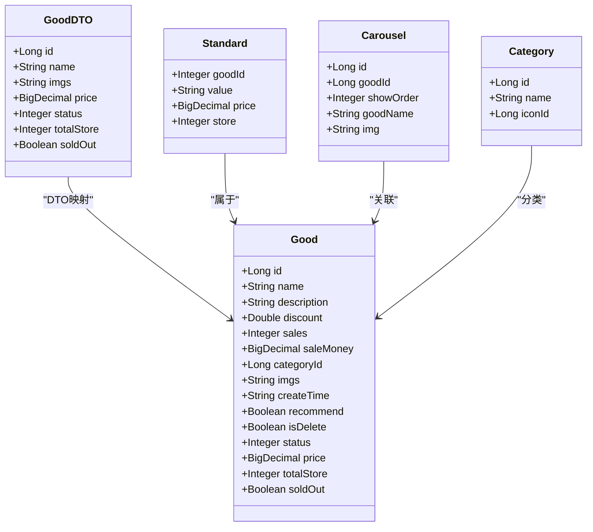
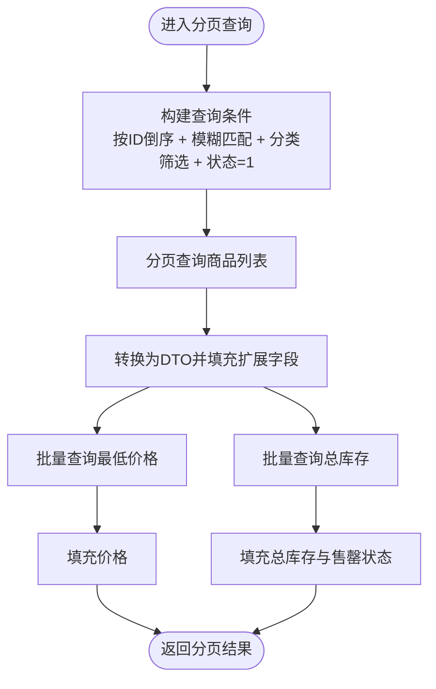
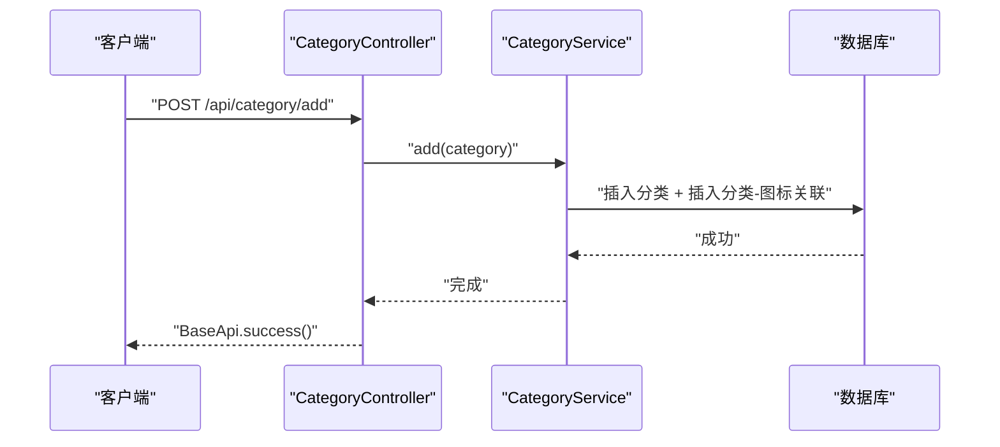
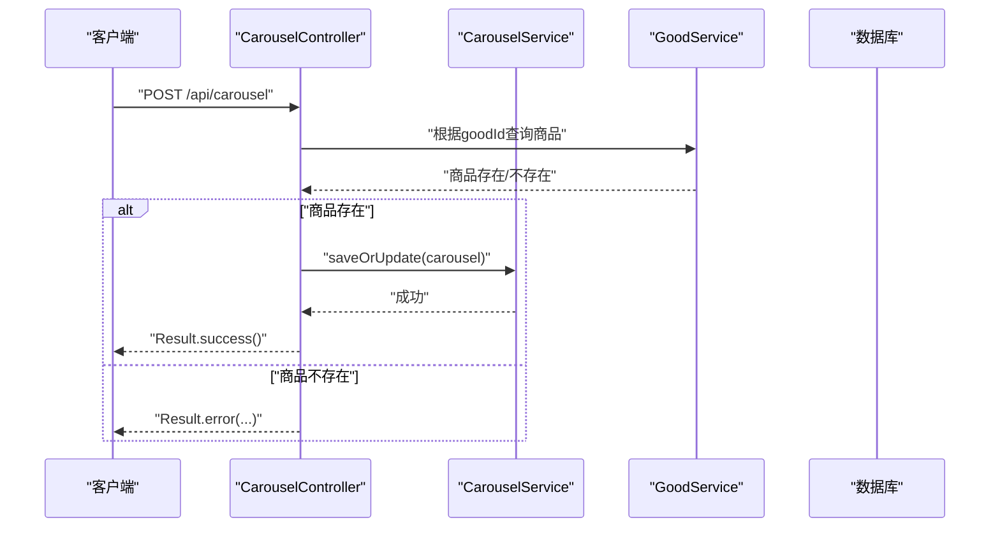
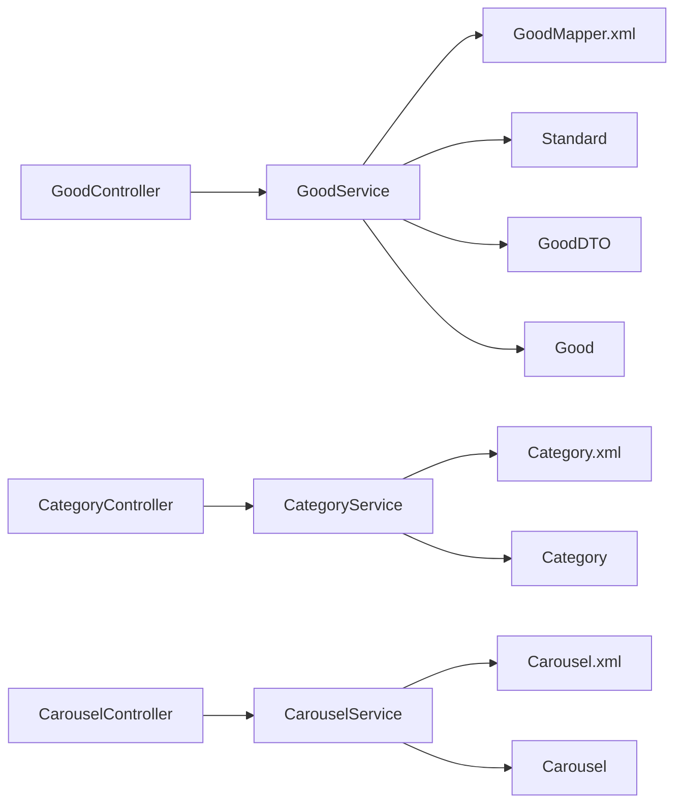

# 商品管理API

<cite>
**本文引用的文件**
- [GoodController.java](file://mall-server/src/main/java/com/rabbiter/em/controller/GoodController.java)
- [CategoryController.java](file://mall-server/src/main/java/com/rabbiter/em/controller/CategoryController.java)
- [CarouselController.java](file://mall-server/src/main/java/com/rabbiter/em/controller/CarouselController.java)
- [GoodService.java](file://mall-server/src/main/java/com/rabbiter/em/service/GoodService.java)
- [CategoryService.java](file://mall-server/src/main/java/com/rabbiter/em/service/CategoryService.java)
- [CarouselService.java](file://mall-server/src/main/java/com/rabbiter/em/service/CarouselService.java)
- [Good.java](file://mall-server/src/main/java/com/rabbiter/em/entity/Good.java)
- [Category.java](file://mall-server/src/main/java/com/rabbiter/em/entity/Category.java)
- [Carousel.java](file://mall-server/src/main/java/com/rabbiter/em/entity/Carousel.java)
- [Standard.java](file://mall-server/src/main/java/com/rabbiter/em/entity/Standard.java)
- [GoodDTO.java](file://mall-server/src/main/java/com/rabbiter/em/entity/dto/GoodDTO.java)
- [GoodMapper.xml](file://mall-server/src/main/resources/mapper/GoodMapper.xml)
- [Category.xml](file://mall-server/src/main/resources/mapper/Category.xml)
- [Carousel.xml](file://mall-server/src/main/resources/mapper/Carousel.xml)
- [Constants.java](file://mall-server/src/main/java/com/rabbiter/em/constants/Constants.java)
- [Result.java](file://mall-server/src/main/java/com/rabbiter/em/common/Result.java)
</cite>

## 目录
1. [简介](#简介)
2. [项目结构](#项目结构)
3. [核心组件](#核心组件)
4. [架构总览](#架构总览)
5. [详细组件分析](#详细组件分析)
6. [依赖分析](#依赖分析)
7. [性能考虑](#性能考虑)
8. [故障排查指南](#故障排查指南)
9. [结论](#结论)
10. [附录](#附录)

## 简介
本文件面向商品管理API的使用者与维护者，系统性梳理商品信息管理、分类管理、轮播图配置等能力。重点覆盖：
- 商品的增删改查、分页查询、搜索过滤、排序、推荐状态管理、销量排行、规格管理
- 商品图片上传与管理机制
- 商品分类的层级结构与管理接口
- 轮播图的配置与展示接口
- 商品数据模型与字段说明
- 商品状态管理与库存处理逻辑
- 实际API调用示例与最佳实践

## 项目结构
后端采用Spring Boot + MyBatis-Plus架构，控制器层负责HTTP请求映射，服务层封装业务逻辑，Mapper层负责SQL执行。商品相关模块主要分布在以下包与文件：
- 控制器：/controller 下 GoodController、CategoryController、CarouselController
- 服务：/service 下 GoodService、CategoryService、CarouselService
- 实体：/entity 下 Good、Category、Carousel、Standard 及 DTO GoodDTO
- 映射：/resources/mapper 下 GoodMapper.xml、Category.xml、Carousel.xml
- 常量与统一响应：/constants、/common

**图表来源**
- [GoodController.java:16-209](file://mall-server/src/main/java/com/rabbiter/em/controller/GoodController.java#L16-L209)
- [CategoryController.java:15-82](file://mall-server/src/main/java/com/rabbiter/em/controller/CategoryController.java#L15-L82)
- [CarouselController.java:20-93](file://mall-server/src/main/java/com/rabbiter/em/controller/CarouselController.java#L20-L93)
- [GoodService.java:37-281](file://mall-server/src/main/java/com/rabbiter/em/service/GoodService.java#L37-L281)
- [CategoryService.java:15-52](file://mall-server/src/main/java/com/rabbiter/em/service/CategoryService.java#L15-L52)
- [CarouselService.java:11-21](file://mall-server/src/main/java/com/rabbiter/em/service/CarouselService.java#L11-L21)
- [GoodMapper.xml:1-33](file://mall-server/src/main/resources/mapper/GoodMapper.xml#L1-L33)
- [Category.xml:1-6](file://mall-server/src/main/resources/mapper/Category.xml#L1-L6)
- [Carousel.xml:1-9](file://mall-server/src/main/resources/mapper/Carousel.xml#L1-L9)
- [Good.java:11-232](file://mall-server/src/main/java/com/rabbiter/em/entity/Good.java#L11-L232)
- [Standard.java:8-72](file://mall-server/src/main/java/com/rabbiter/em/entity/Standard.java#L8-L72)
- [Category.java:9-57](file://mall-server/src/main/java/com/rabbiter/em/entity/Category.java#L9-L57)
- [Carousel.java:9-83](file://mall-server/src/main/java/com/rabbiter/em/entity/Carousel.java#L9-L83)
- [GoodDTO.java:5-83](file://mall-server/src/main/java/com/rabbiter/em/entity/dto/GoodDTO.java#L5-L83)

**章节来源**
- [GoodController.java:16-209](file://mall-server/src/main/java/com/rabbiter/em/controller/GoodController.java#L16-L209)
- [CategoryController.java:15-82](file://mall-server/src/main/java/com/rabbiter/em/controller/CategoryController.java#L15-L82)
- [CarouselController.java:20-93](file://mall-server/src/main/java/com/rabbiter/em/controller/CarouselController.java#L20-L93)

## 核心组件
- 商品控制器 GoodController：提供商品增删改查、分页查询、搜索过滤、排序、推荐状态、销量排行、规格管理、推荐商品等接口。
- 分类控制器 CategoryController：提供分类的增删改查、新增下级分类与关联、删除分类等接口。
- 轮播控制器 CarouselController：提供轮播图的增删改查、展示接口，并校验商品有效性。
- 商品服务 GoodService：实现商品缓存、分页查询、推荐商品、销量排行、规格查询、库存与价格聚合等业务逻辑。
- 分类服务 CategoryService：实现分类新增下级与关联、删除分类等业务逻辑。
- 轮播服务 CarouselService：实现轮播图全量查询等业务逻辑。
- 实体与DTO：Good、Category、Carousel、Standard、GoodDTO 描述商品、分类、轮播与规格的数据结构。

**章节来源**
- [GoodController.java:16-209](file://mall-server/src/main/java/com/rabbiter/em/controller/GoodController.java#L16-L209)
- [CategoryController.java:15-82](file://mall-server/src/main/java/com/rabbiter/em/controller/CategoryController.java#L15-L82)
- [CarouselController.java:20-93](file://mall-server/src/main/java/com/rabbiter/em/controller/CarouselController.java#L20-L93)
- [GoodService.java:37-281](file://mall-server/src/main/java/com/rabbiter/em/service/GoodService.java#L37-L281)
- [CategoryService.java:15-52](file://mall-server/src/main/java/com/rabbiter/em/service/CategoryService.java#L15-L52)
- [CarouselService.java:11-21](file://mall-server/src/main/java/com/rabbiter/em/service/CarouselService.java#L11-L21)
- [Good.java:11-232](file://mall-server/src/main/java/com/rabbiter/em/entity/Good.java#L11-L232)
- [Category.java:9-57](file://mall-server/src/main/java/com/rabbiter/em/entity/Category.java#L9-L57)
- [Carousel.java:9-83](file://mall-server/src/main/java/com/rabbiter/em/entity/Carousel.java#L9-L83)
- [Standard.java:8-72](file://mall-server/src/main/java/com/rabbiter/em/entity/Standard.java#L8-L72)
- [GoodDTO.java:5-83](file://mall-server/src/main/java/com/rabbiter/em/entity/dto/GoodDTO.java#L5-L83)

## 架构总览
商品管理API遵循经典的MVC分层架构，控制器负责参数接收与响应封装，服务层承载业务规则，Mapper层负责SQL执行。统一响应封装在 Result 中，常量定义在 Constants 中。

**图表来源**
- [GoodController.java:16-209](file://mall-server/src/main/java/com/rabbiter/em/controller/GoodController.java#L16-L209)
- [GoodService.java:37-281](file://mall-server/src/main/java/com/rabbiter/em/service/GoodService.java#L37-L281)
- [GoodMapper.xml:1-33](file://mall-server/src/main/resources/mapper/GoodMapper.xml#L1-L33)
- [Result.java:5-66](file://mall-server/src/main/java/com/rabbiter/em/common/Result.java#L5-L66)
- [Constants.java:5-16](file://mall-server/src/main/java/com/rabbiter/em/constants/Constants.java#L5-L16)

## 详细组件分析

### 商品管理接口
- 基础操作
  - 新增商品：POST /api/good（需要管理员权限）
  - 更新商品：PUT /api/good（需要管理员权限）
  - 删除商品：DELETE /api/good/delete/{id}（需要管理员权限）
  - 获取单个商品详情：GET /api/good/detail/{id}
  - 获取商品规格：GET /api/good/standard/{id}
  - 保存/更新规格：POST /api/good/standard?goodId=...
  - 删除规格：DELETE /api/good/standard（Body传入规格对象）
  - 设置推荐状态：GET /api/good/recommend?id=&isRecommend=
  - 获取销量排行：GET /api/good/rank?num=
  - 获取推荐商品：GET /api/good/recommend/{userId}
  - 分页查询（简版）：GET /api/good/page?pageNum=&pageSize=&searchText=&categoryId=
  - 分页查询（完整版）：GET /api/good/fullPage?pageNum=&pageSize=&searchText=&categoryId=
  - 查询所有前台展示商品：GET /api/good

- 参数与行为要点
  - 分页查询支持按名称/描述模糊匹配与按分类ID筛选；默认按ID倒序。
  - 完整版分页直接返回实体列表，简版分页转换为DTO并补充最低价格、总库存与售罄状态。
  - 推荐状态通过布尔值控制；销量排行返回前N条商品。
  - 规格保存会先清空旧记录再批量插入，确保一致性。

**图表来源**
- [GoodController.java:178-207](file://mall-server/src/main/java/com/rabbiter/em/controller/GoodController.java#L178-L207)
- [GoodService.java:177-255](file://mall-server/src/main/java/com/rabbiter/em/service/GoodService.java#L177-L255)
- [GoodMapper.xml:1-33](file://mall-server/src/main/resources/mapper/GoodMapper.xml#L1-L33)

**章节来源**
- [GoodController.java:39-207](file://mall-server/src/main/java/com/rabbiter/em/controller/GoodController.java#L39-L207)
- [GoodService.java:177-255](file://mall-server/src/main/java/com/rabbiter/em/service/GoodService.java#L177-L255)
- [GoodMapper.xml:1-33](file://mall-server/src/main/resources/mapper/GoodMapper.xml#L1-L33)

### 商品数据模型与字段说明
- Good 实体
  - 字段概览：主键、名称、描述、折扣、销量、销售额、分类ID、图片、创建时间、是否推荐、是否删除、状态、价格（DTO扩展）、总库存（DTO扩展）、售罄（DTO扩展）
  - 关键逻辑：状态=1表示上架；推荐=1表示前台展示；图片字段存储多图链接；销量与销售额用于排行与统计。
- GoodDTO
  - 扩展字段：价格、状态、总库存、售罄，用于前端展示与交互。
- Standard 实体
  - 字段概览：商品ID、规格值、单价、库存，用于多规格商品的价格与库存管理。
- Carousel 实体
  - 字段概览：主键、对应商品ID、展示顺序、商品名（DTO扩展）、图片（DTO扩展），用于首页轮播展示。
- Category 实体
  - 字段概览：主键、名称、图标ID（DTO扩展），用于分类管理。

**图表来源**
- [Good.java:11-232](file://mall-server/src/main/java/com/rabbiter/em/entity/Good.java#L11-L232)
- [GoodDTO.java:5-83](file://mall-server/src/main/java/com/rabbiter/em/entity/dto/GoodDTO.java#L5-L83)
- [Standard.java:8-72](file://mall-server/src/main/java/com/rabbiter/em/entity/Standard.java#L8-L72)
- [Carousel.java:9-83](file://mall-server/src/main/java/com/rabbiter/em/entity/Carousel.java#L9-L83)
- [Category.java:9-57](file://mall-server/src/main/java/com/rabbiter/em/entity/Category.java#L9-L57)

**章节来源**
- [Good.java:11-232](file://mall-server/src/main/java/com/rabbiter/em/entity/Good.java#L11-L232)
- [GoodDTO.java:5-83](file://mall-server/src/main/java/com/rabbiter/em/entity/dto/GoodDTO.java#L5-L83)
- [Standard.java:8-72](file://mall-server/src/main/java/com/rabbiter/em/entity/Standard.java#L8-L72)
- [Carousel.java:9-83](file://mall-server/src/main/java/com/rabbiter/em/entity/Carousel.java#L9-L83)
- [Category.java:9-57](file://mall-server/src/main/java/com/rabbiter/em/entity/Category.java#L9-L57)

### 商品状态管理与库存处理逻辑
- 状态管理
  - 状态=1表示上架，仅上架商品参与前台分页查询与推荐展示。
  - 推荐状态=1表示前台推荐，配合销量排行与首页推荐使用。
- 库存处理
  - 总库存由规格表中的库存求和得到；当总库存为0时，DTO中标记售罄。
  - 最低价格由规格表中的最小价格乘以折扣计算得到。
- 缓存策略
  - 商品详情优先从Redis读取，未命中则查询数据库并回填缓存；更新或删除商品时清理对应缓存键。

**图表来源**
- [GoodService.java:177-255](file://mall-server/src/main/java/com/rabbiter/em/service/GoodService.java#L177-L255)
- [GoodMapper.xml:16-31](file://mall-server/src/main/resources/mapper/GoodMapper.xml#L16-L31)

**章节来源**
- [GoodService.java:177-255](file://mall-server/src/main/java/com/rabbiter/em/service/GoodService.java#L177-L255)
- [GoodMapper.xml:16-31](file://mall-server/src/main/resources/mapper/GoodMapper.xml#L16-L31)

### 商品图片上传与管理机制
- 图片存储路径
  - 文件存储根目录由常量定义，包含通用文件与头像目录路径。
- 使用建议
  - 前端上传图片后，将返回的相对路径或URL写入商品的图片字段；展示时拼接完整URL。
  - 上传接口与文件管理可参考后端其他控制器（如 FileController、AvatarController）的实现模式。

**章节来源**
- [Constants.java:12-14](file://mall-server/src/main/java/com/rabbiter/em/constants/Constants.java#L12-L14)

### 分类管理接口
- 接口清单
  - 获取单个分类：GET /api/category/{id}
  - 获取所有分类：GET /api/category
  - 新增分类：POST /api/category（需要管理员权限）
  - 新增下级分类并建立关联：POST /api/category/add
  - 更新分类：PUT /api/category（需要管理员权限）
  - 删除分类：GET /api/category/delete?id=（同时清理关联）

**图表来源**
- [CategoryController.java:51-54](file://mall-server/src/main/java/com/rabbiter/em/controller/CategoryController.java#L51-L54)
- [CategoryService.java:28-34](file://mall-server/src/main/java/com/rabbiter/em/service/CategoryService.java#L28-L34)

**章节来源**
- [CategoryController.java:24-75](file://mall-server/src/main/java/com/rabbiter/em/controller/CategoryController.java#L24-L75)
- [CategoryService.java:28-50](file://mall-server/src/main/java/com/rabbiter/em/service/CategoryService.java#L28-L50)
- [Category.xml:1-6](file://mall-server/src/main/resources/mapper/Category.xml#L1-L6)

### 轮播图配置与展示接口
- 接口清单
  - 获取单个轮播：GET /api/carousel/{id}
  - 获取所有轮播：GET /api/carousel
  - 新增轮播：POST /api/carousel（需要管理员权限）
  - 更新轮播：PUT /api/carousel（需要管理员权限）
  - 删除轮播：DELETE /api/carousel/{id}（需要管理员权限）
- 校验逻辑
  - 新增/更新时校验商品是否存在，避免悬挂引用。
- 展示逻辑
  - 全量查询时通过SQL联表查询商品名称与图片，按展示顺序升序排列。

**图表来源**
- [CarouselController.java:57-76](file://mall-server/src/main/java/com/rabbiter/em/controller/CarouselController.java#L57-L76)
- [CarouselService.java:11-21](file://mall-server/src/main/java/com/rabbiter/em/service/CarouselService.java#L11-L21)
- [Carousel.xml:5-7](file://mall-server/src/main/resources/mapper/Carousel.xml#L5-L7)

**章节来源**
- [CarouselController.java:41-86](file://mall-server/src/main/java/com/rabbiter/em/controller/CarouselController.java#L41-L86)
- [CarouselService.java:17-19](file://mall-server/src/main/java/com/rabbiter/em/service/CarouselService.java#L17-L19)
- [Carousel.xml:5-7](file://mall-server/src/main/resources/mapper/Carousel.xml#L5-L7)

### 统一响应与权限控制
- 统一响应
  - 成功/失败封装在 Result 中，包含code、msg、data三要素。
- 权限注解
  - 控制器方法使用自定义注解标注是否需要管理员权限，部分接口无需登录即可访问。

**章节来源**
- [Result.java:5-66](file://mall-server/src/main/java/com/rabbiter/em/common/Result.java#L5-L66)
- [GoodController.java:3-37](file://mall-server/src/main/java/com/rabbiter/em/controller/GoodController.java#L3-L37)
- [CategoryController.java:3-43](file://mall-server/src/main/java/com/rabbiter/em/controller/CategoryController.java#L3-L43)
- [CarouselController.java:3-66](file://mall-server/src/main/java/com/rabbiter/em/controller/CarouselController.java#L3-L66)

## 依赖分析
- 控制器依赖服务：GoodController 依赖 GoodService、StandardService、RecommendationService；CategoryController 依赖 CategoryService；CarouselController 依赖 CarouselService、GoodService。
- 服务依赖Mapper：GoodService 依赖 GoodMapper.xml；CarouselService 依赖 Carousel.xml；CategoryService 依赖 Category.xml。
- 实体间关系：Good 与 Standard 一对多；Good 与 Carousel 通过goodId关联；Category 与 Good 多对一。

**图表来源**
- [GoodController.java:16-27](file://mall-server/src/main/java/com/rabbiter/em/controller/GoodController.java#L16-L27)
- [CategoryController.java:15-20](file://mall-server/src/main/java/com/rabbiter/em/controller/CategoryController.java#L15-L20)
- [CarouselController.java:20-31](file://mall-server/src/main/java/com/rabbiter/em/controller/CarouselController.java#L20-L31)
- [GoodService.java:37-43](file://mall-server/src/main/java/com/rabbiter/em/service/GoodService.java#L37-L43)
- [CategoryService.java:15-21](file://mall-server/src/main/java/com/rabbiter/em/service/CategoryService.java#L15-L21)
- [CarouselService.java:11-19](file://mall-server/src/main/java/com/rabbiter/em/service/CarouselService.java#L11-L19)

**章节来源**
- [GoodController.java:16-27](file://mall-server/src/main/java/com/rabbiter/em/controller/GoodController.java#L16-L27)
- [CategoryController.java:15-20](file://mall-server/src/main/java/com/rabbiter/em/controller/CategoryController.java#L15-L20)
- [CarouselController.java:20-31](file://mall-server/src/main/java/com/rabbiter/em/controller/CarouselController.java#L20-L31)
- [GoodService.java:37-43](file://mall-server/src/main/java/com/rabbiter/em/service/GoodService.java#L37-L43)
- [CategoryService.java:15-21](file://mall-server/src/main/java/com/rabbiter/em/service/CategoryService.java#L15-L21)
- [CarouselService.java:11-19](file://mall-server/src/main/java/com/rabbiter/em/service/CarouselService.java#L11-L19)

## 性能考虑
- 分页查询优化
  - 使用条件构造器与模糊匹配，避免全表扫描；按ID倒序提升稳定性。
  - 批量查询最低价格与总库存，减少多次往返数据库。
- 缓存策略
  - 商品详情缓存提升热点读取性能；更新/删除时主动失效缓存。
- SQL优化
  - 聚合查询（最低价格、总库存）通过IN子句批量处理，减少循环查询。
- 前台展示
  - 推荐商品按价格升序展示，利于前端分页与懒加载。

[本节为通用性能建议，不涉及具体文件分析]

## 故障排查指南
- 无结果错误
  - 当商品详情或规格为空时，服务层抛出“无结果”异常；检查商品ID与状态。
- 权限不足
  - 管理员接口需携带有效管理员权限；检查请求头与权限注解。
- 商品ID错误
  - 轮播新增/更新时若商品不存在，返回错误提示；请确认goodId正确。
- 统一响应
  - 所有接口返回统一Result结构；根据code与msg判断问题类型。

**章节来源**
- [GoodService.java:73-87](file://mall-server/src/main/java/com/rabbiter/em/service/GoodService.java#L73-L87)
- [Constants.java:6-12](file://mall-server/src/main/java/com/rabbiter/em/constants/Constants.java#L6-L12)
- [CarouselController.java:60-73](file://mall-server/src/main/java/com/rabbiter/em/controller/CarouselController.java#L60-L73)
- [Result.java:11-23](file://mall-server/src/main/java/com/rabbiter/em/common/Result.java#L11-L23)

## 结论
本商品管理API围绕商品、分类、轮播三大模块构建，具备完善的增删改查、分页检索、推荐与排行、规格与库存聚合、缓存与权限控制能力。通过清晰的分层设计与统一响应机制，既满足前端展示需求，又便于后续扩展与维护。

[本节为总结性内容，不涉及具体文件分析]

## 附录

### API调用示例与最佳实践
- 示例场景
  - 分页查询商品：GET /api/good/page?pageNum=1&pageSize=10&searchText=&categoryId=
  - 设置推荐状态：GET /api/good/recommend?id=1&isRecommend=true
  - 新增轮播：POST /api/carousel（Body包含goodId、showOrder等）
- 最佳实践
  - 前台展示统一使用简版分页接口，自动填充价格与库存信息。
  - 管理端操作务必携带管理员权限令牌。
  - 规格管理采用批量替换策略，保证数据一致性。
  - 图片上传后写入商品图片字段，注意路径拼接与CDN配置。

[本节为概念性内容，不涉及具体文件分析]