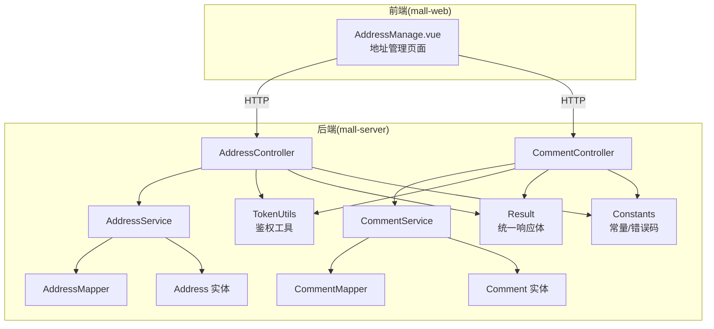
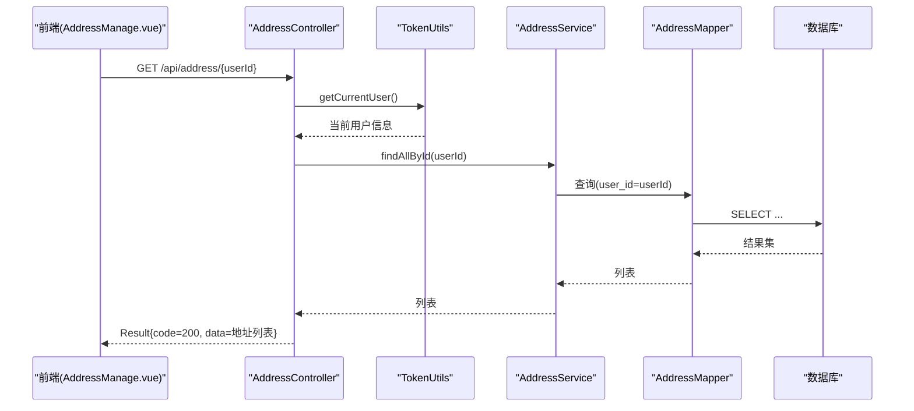
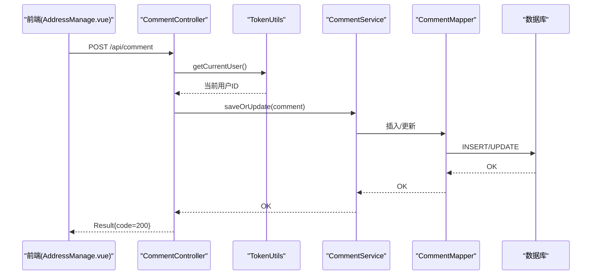
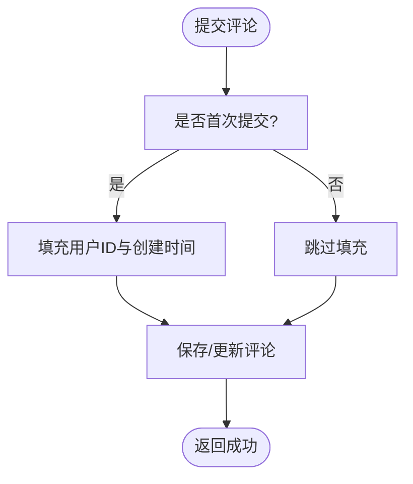
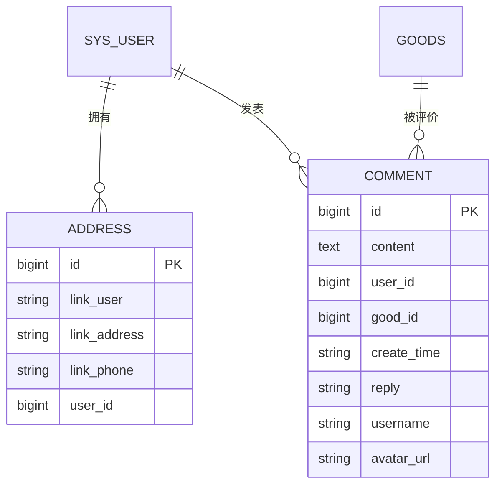
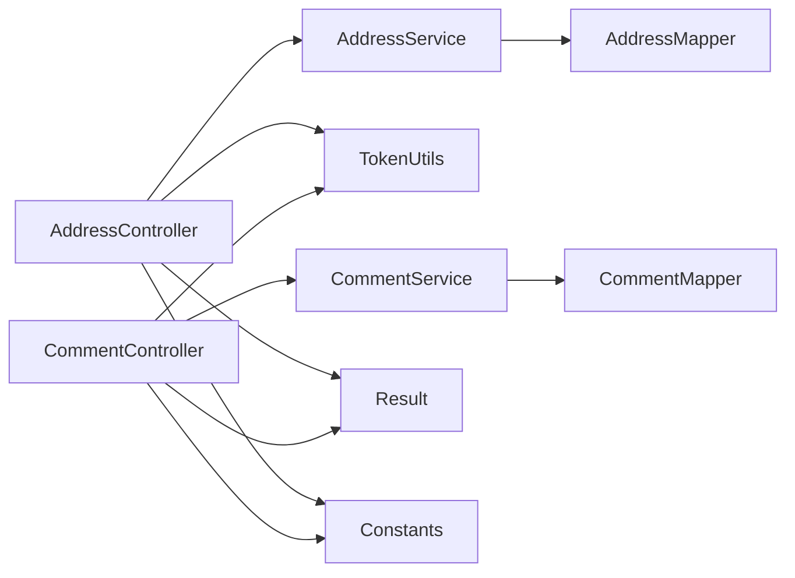

# 地址与评论API

<cite>
**本文引用的文件**
- [AddressController.java](file://mall-server/src/main/java/com/rabbiter/em/controller/AddressController.java)
- [CommentController.java](file://mall-server/src/main/java/com/rabbiter/em/controller/CommentController.java)
- [AddressService.java](file://mall-server/src/main/java/com/rabbiter/em/service/AddressService.java)
- [CommentService.java](file://mall-server/src/main/java/com/rabbiter/em/service/CommentService.java)
- [AddressMapper.java](file://mall-server/src/main/java/com/rabbiter/em/mapper/AddressMapper.java)
- [CommentMapper.java](file://mall-server/src/main/java/com/rabbiter/em/mapper/CommentMapper.java)
- [Address.java](file://mall-server/src/main/java/com/rabbiter/em/entity/Address.java)
- [Comment.java](file://mall-server/src/main/java/com/rabbiter/em/entity/Comment.java)
- [Result.java](file://mall-server/src/main/java/com/rabbiter/em/common/Result.java)
- [Constants.java](file://mall-server/src/main/java/com/rabbiter/em/constants/Constants.java)
- [TokenUtils.java](file://mall-server/src/main/java/com/rabbiter/em/utils/TokenUtils.java)
- [Authority.java](file://mall-server/src/main/java/com/rabbiter/em/annotation/Authority.java)
- [AuthorityType.java](file://mall-server/src/main/java/com/rabbiter/em/entity/AuthorityType.java)
- [AddressManage.vue](file://mall-web/src/views/front/AddressManage.vue)
</cite>

## 目录
1. [简介](#简介)
2. [项目结构](#项目结构)
3. [核心组件](#核心组件)
4. [架构总览](#架构总览)
5. [详细组件分析](#详细组件分析)
6. [依赖分析](#依赖分析)
7. [性能考虑](#性能考虑)
8. [故障排查指南](#故障排查指南)
9. [结论](#结论)
10. [附录](#附录)

## 简介
本文件面向“地址管理”与“评论系统”的API使用与集成，覆盖以下能力：
- 地址管理：查询（按用户）、新增、修改、删除；支持管理员全量查询；内置手机号格式校验；默认地址设置与常用地址管理建议。
- 评论系统：按商品查询评论、提交评论、删除评论；评论回复字段存在；当前未实现点赞、举报等社交功能。
- 数据模型：地址与评论实体字段定义及关联关系。
- 安全与合规：基于Token的登录态校验、权限注解、统一返回体与错误码约定。

## 项目结构
后端采用Spring Boot + MyBatis-Plus分层架构，前端Vue通过HTTP请求对接后端API。

图表来源
- [AddressController.java:17-86](file://mall-server/src/main/java/com/rabbiter/em/controller/AddressController.java#L17-L86)
- [CommentController.java:15-43](file://mall-server/src/main/java/com/rabbiter/em/controller/CommentController.java#L15-L43)
- [AddressService.java:12-23](file://mall-server/src/main/java/com/rabbiter/em/service/AddressService.java#L12-L23)
- [CommentService.java:11-20](file://mall-server/src/main/java/com/rabbiter/em/service/CommentService.java#L11-L20)
- [AddressMapper.java:1-9](file://mall-server/src/main/java/com/rabbiter/em/mapper/AddressMapper.java#L1-L9)
- [CommentMapper.java:1-13](file://mall-server/src/main/java/com/rabbiter/em/mapper/CommentMapper.java#L1-L13)
- [Address.java:1-86](file://mall-server/src/main/java/com/rabbiter/em/entity/Address.java#L1-L86)
- [Comment.java:1-94](file://mall-server/src/main/java/com/rabbiter/em/entity/Comment.java#L1-L94)
- [TokenUtils.java:42-77](file://mall-server/src/main/java/com/rabbiter/em/utils/TokenUtils.java#L42-L77)
- [Result.java:5-66](file://mall-server/src/main/java/com/rabbiter/em/common/Result.java#L5-L66)
- [Constants.java:5-16](file://mall-server/src/main/java/com/rabbiter/em/constants/Constants.java#L5-L16)

章节来源
- [AddressController.java:17-86](file://mall-server/src/main/java/com/rabbiter/em/controller/AddressController.java#L17-L86)
- [CommentController.java:15-43](file://mall-server/src/main/java/com/rabbiter/em/controller/CommentController.java#L15-L43)

## 核心组件
- 控制器层
  - 地址控制器：提供按用户查询、管理员全量查询、新增、修改、删除接口。
  - 评论控制器：提供按商品查询、提交、删除接口。
- 服务层
  - 地址服务：封装按用户ID查询逻辑。
  - 评论服务：封装按商品查询逻辑。
- 数据访问层
  - 地址映射：继承MyBatis-Plus基础方法。
  - 评论映射：自定义SQL按商品查询并联表显示用户昵称与头像。
- 实体模型
  - 地址实体：包含联系人、地址、电话、所属用户ID。
  - 评论实体：包含内容、用户ID、商品ID、创建时间、回复字段，以及用于展示的用户名与头像字段。
- 工具与常量
  - 统一响应体Result与错误码Constants。
  - 鉴权工具TokenUtils：解析当前用户、校验登录与权限。
  - 权限注解Authority与权限类型AuthorityType。

章节来源
- [AddressController.java:17-86](file://mall-server/src/main/java/com/rabbiter/em/controller/AddressController.java#L17-L86)
- [CommentController.java:15-43](file://mall-server/src/main/java/com/rabbiter/em/controller/CommentController.java#L15-L43)
- [AddressService.java:12-23](file://mall-server/src/main/java/com/rabbiter/em/service/AddressService.java#L12-L23)
- [CommentService.java:11-20](file://mall-server/src/main/java/com/rabbiter/em/service/CommentService.java#L11-L20)
- [AddressMapper.java:1-9](file://mall-server/src/main/java/com/rabbiter/em/mapper/AddressMapper.java#L1-L9)
- [CommentMapper.java:9-12](file://mall-server/src/main/java/com/rabbiter/em/mapper/CommentMapper.java#L9-L12)
- [Address.java:8-86](file://mall-server/src/main/java/com/rabbiter/em/entity/Address.java#L8-L86)
- [Comment.java:9-94](file://mall-server/src/main/java/com/rabbiter/em/entity/Comment.java#L9-L94)
- [Result.java:5-66](file://mall-server/src/main/java/com/rabbiter/em/common/Result.java#L5-L66)
- [Constants.java:5-16](file://mall-server/src/main/java/com/rabbiter/em/constants/Constants.java#L5-L16)
- [TokenUtils.java:42-77](file://mall-server/src/main/java/com/rabbiter/em/utils/TokenUtils.java#L42-L77)
- [Authority.java:10-12](file://mall-server/src/main/java/com/rabbiter/em/annotation/Authority.java#L10-L12)
- [AuthorityType.java:3-7](file://mall-server/src/main/java/com/rabbiter/em/entity/AuthorityType.java#L3-L7)

## 架构总览
下图展示了从前端到后端的典型调用链路与鉴权流程。

图表来源
- [AddressController.java:29-36](file://mall-server/src/main/java/com/rabbiter/em/controller/AddressController.java#L29-L36)
- [AddressService.java:18-22](file://mall-server/src/main/java/com/rabbiter/em/service/AddressService.java#L18-L22)
- [AddressMapper.java:1-9](file://mall-server/src/main/java/com/rabbiter/em/mapper/AddressMapper.java#L1-L9)
- [TokenUtils.java:42-48](file://mall-server/src/main/java/com/rabbiter/em/utils/TokenUtils.java#L42-L48)

## 详细组件分析

### 地址管理API
- 接口概览
  - GET /api/address/{userId}
    - 功能：按用户ID查询其全部收货地址。
    - 权限：requireLogin；仅本人或管理员可访问。
    - 返回：Result{code=200, data=地址列表}。
  - GET /api/address
    - 功能：管理员全量查询所有地址。
    - 权限：requireAuthority。
    - 返回：Result{code=200, data=地址列表}。
  - POST /api/address
    - 功能：新增或更新地址。
    - 校验：手机号必须为11位数字；自动填充当前用户ID。
    - 返回：成功Result或错误Result。
  - PUT /api/address
    - 功能：更新地址。
    - 校验：手机号格式；仅地址归属者或管理员可更新。
    - 返回：成功Result。
  - DELETE /api/address/{id}
    - 功能：删除地址。
    - 校验：仅地址归属者或管理员可删除。
    - 返回：成功Result。
- 默认地址与常用地址
  - 后端未提供默认地址字段与常用地址排序逻辑；可在实体与映射中扩展字段以支持。
- 批量操作
  - 当前未提供批量导入/导出/删除接口；如需可基于现有服务层扩展。

图表来源
- [CommentController.java:28-36](file://mall-server/src/main/java/com/rabbiter/em/controller/CommentController.java#L28-L36)
- [CommentService.java:11-20](file://mall-server/src/main/java/com/rabbiter/em/service/CommentService.java#L11-L20)
- [CommentMapper.java:9-12](file://mall-server/src/main/java/com/rabbiter/em/mapper/CommentMapper.java#L9-L12)
- [TokenUtils.java:42-48](file://mall-server/src/main/java/com/rabbiter/em/utils/TokenUtils.java#L42-L48)

章节来源
- [AddressController.java:29-85](file://mall-server/src/main/java/com/rabbiter/em/controller/AddressController.java#L29-L85)
- [AddressService.java:18-22](file://mall-server/src/main/java/com/rabbiter/em/service/AddressService.java#L18-L22)
- [Address.java:8-86](file://mall-server/src/main/java/com/rabbiter/em/entity/Address.java#L8-L86)

### 评论系统API
- 接口概览
  - GET /api/comment/good/{goodId}
    - 功能：按商品ID查询评论列表。
    - 权限：noRequire。
    - 返回：Result{code=200, data=评论列表(含用户名与头像)}。
  - POST /api/comment
    - 功能：提交或更新评论。
    - 校验：首次提交自动填充当前用户ID与创建时间。
    - 返回：成功Result。
  - DELETE /api/comment/{id}
    - 功能：删除评论。
    - 权限：无特殊限制（当前未做归属校验）。
    - 返回：成功Result。
- 回复机制
  - 评论实体包含回复字段；前端可直接展示管理员回复。
- 社交功能
  - 当前未实现点赞、举报接口；可在实体与控制器中扩展。

图表来源
- [CommentController.java:28-36](file://mall-server/src/main/java/com/rabbiter/em/controller/CommentController.java#L28-L36)
- [Comment.java:10-94](file://mall-server/src/main/java/com/rabbiter/em/entity/Comment.java#L10-L94)

章节来源
- [CommentController.java:22-42](file://mall-server/src/main/java/com/rabbiter/em/controller/CommentController.java#L22-L42)
- [CommentService.java:17-19](file://mall-server/src/main/java/com/rabbiter/em/service/CommentService.java#L17-L19)
- [CommentMapper.java:10-11](file://mall-server/src/main/java/com/rabbiter/em/mapper/CommentMapper.java#L10-L11)
- [Comment.java:10-94](file://mall-server/src/main/java/com/rabbiter/em/entity/Comment.java#L10-L94)

### 数据模型说明
- 地址(Address)
  - 字段：主键、联系人、联系地址、联系电话、所属用户ID。
  - 关系：一对多（用户—地址）。
- 评论(Comment)
  - 字段：主键、内容、用户ID、商品ID、创建时间、回复；展示字段：用户名、头像URL。
  - 关系：多对一（用户—评论）、多对一（商品—评论）。
- 映射与查询
  - 地址：基于MyBatis-Plus按user_id查询。
  - 评论：自定义SQL联表查询，按创建时间倒序。

图表来源
- [Address.java:8-86](file://mall-server/src/main/java/com/rabbiter/em/entity/Address.java#L8-L86)
- [Comment.java:9-94](file://mall-server/src/main/java/com/rabbiter/em/entity/Comment.java#L9-L94)
- [CommentMapper.java:10-11](file://mall-server/src/main/java/com/rabbiter/em/mapper/CommentMapper.java#L10-L11)

章节来源
- [Address.java:8-86](file://mall-server/src/main/java/com/rabbiter/em/entity/Address.java#L8-L86)
- [Comment.java:9-94](file://mall-server/src/main/java/com/rabbiter/em/entity/Comment.java#L9-L94)
- [CommentMapper.java:10-11](file://mall-server/src/main/java/com/rabbiter/em/mapper/CommentMapper.java#L10-L11)

## 依赖分析
- 控制器依赖
  - AddressController依赖AddressService与TokenUtils进行鉴权与业务处理。
  - CommentController依赖CommentService与TokenUtils进行鉴权与业务处理。
- 服务与映射
  - AddressService与CommentService分别依赖对应Mapper，Mapper继承MyBatis-Plus基础接口。
- 响应与常量
  - 控制器统一返回Result对象，错误码来自Constants。

图表来源
- [AddressController.java:17-86](file://mall-server/src/main/java/com/rabbiter/em/controller/AddressController.java#L17-L86)
- [CommentController.java:15-43](file://mall-server/src/main/java/com/rabbiter/em/controller/CommentController.java#L15-L43)
- [AddressService.java:12-23](file://mall-server/src/main/java/com/rabbiter/em/service/AddressService.java#L12-L23)
- [CommentService.java:11-20](file://mall-server/src/main/java/com/rabbiter/em/service/CommentService.java#L11-L20)
- [AddressMapper.java:1-9](file://mall-server/src/main/java/com/rabbiter/em/mapper/AddressMapper.java#L1-L9)
- [CommentMapper.java:1-13](file://mall-server/src/main/java/com/rabbiter/em/mapper/CommentMapper.java#L1-L13)
- [Result.java:5-66](file://mall-server/src/main/java/com/rabbiter/em/common/Result.java#L5-L66)
- [Constants.java:5-16](file://mall-server/src/main/java/com/rabbiter/em/constants/Constants.java#L5-L16)

章节来源
- [AddressController.java:17-86](file://mall-server/src/main/java/com/rabbiter/em/controller/AddressController.java#L17-L86)
- [CommentController.java:15-43](file://mall-server/src/main/java/com/rabbiter/em/controller/CommentController.java#L15-L43)

## 性能考虑
- 查询优化
  - 地址按user_id查询已具备条件过滤，建议在数据库层面为user_id建立索引。
  - 评论按good_id查询已具备条件过滤，建议在good_id上建立索引。
- 分页建议
  - 当前查询未分页；建议在CommentController与CommentService增加分页参数，避免一次性返回大量数据。
- 缓存策略
  - 商品详情页评论可引入Redis缓存，降低数据库压力。
- 序列化
  - 评论联表查询返回用户名与头像，建议在服务层聚合后再返回，减少重复字段传输。

## 故障排查指南
- 常见错误码
  - 200：成功
  - 500：系统错误/参数校验失败
  - 403：无权限/越权访问
  - 401：登录状态失效
- 典型问题定位
  - 地址新增失败：检查手机号格式是否为11位数字；确认Token有效。
  - 修改/删除被拒：确认当前用户是否为地址归属者或管理员。
  - 评论提交失败：确认登录态有效；检查必填字段。
- 统一响应
  - 所有接口返回Result对象，前端可根据code与msg进行提示。

章节来源
- [Constants.java:6-11](file://mall-server/src/main/java/com/rabbiter/em/constants/Constants.java#L6-L11)
- [Result.java:11-27](file://mall-server/src/main/java/com/rabbiter/em/common/Result.java#L11-L27)
- [AddressController.java:47-56](file://mall-server/src/main/java/com/rabbiter/em/controller/AddressController.java#L47-L56)
- [AddressController.java:64-68](file://mall-server/src/main/java/com/rabbiter/em/controller/AddressController.java#L64-L68)
- [AddressController.java:77-81](file://mall-server/src/main/java/com/rabbiter/em/controller/AddressController.java#L77-L81)
- [CommentController.java:28-36](file://mall-server/src/main/java/com/rabbiter/em/controller/CommentController.java#L28-L36)

## 结论
- 地址管理与评论系统已具备基础的CRUD能力与鉴权控制。
- 建议后续增强：默认地址字段、常用地址排序、批量操作、评论分页、点赞/举报、审核与内容安全策略。
- 前端可通过AddressManage.vue与后端API完成地址的增删改查闭环。

## 附录

### API调用示例（路径与要点）
- 获取某用户的地址列表
  - 方法：GET
  - 路径：/api/address/{userId}
  - 头部：携带Token
  - 返回：Result{code=200, data=地址数组}
- 新增或更新地址
  - 方法：POST
  - 路径：/api/address
  - 请求体：Address对象（手机号11位）
  - 返回：Result{code=200} 或 Result{code=500}
- 更新地址
  - 方法：PUT
  - 路径：/api/address
  - 请求体：Address对象（含id时为更新）
  - 返回：Result{code=200}
- 删除地址
  - 方法：DELETE
  - 路径：/api/address/{id}
  - 返回：Result{code=200}
- 按商品查询评论
  - 方法：GET
  - 路径：/api/comment/good/{goodId}
  - 返回：Result{code=200, data=评论数组（含用户名与头像）}
- 提交评论
  - 方法：POST
  - 路径：/api/comment
  - 请求体：Comment对象（首次提交自动填充用户ID与创建时间）
  - 返回：Result{code=200}
- 删除评论
  - 方法：DELETE
  - 路径：/api/comment/{id}
  - 返回：Result{code=200}

章节来源
- [AddressController.java:29-85](file://mall-server/src/main/java/com/rabbiter/em/controller/AddressController.java#L29-L85)
- [CommentController.java:22-42](file://mall-server/src/main/java/com/rabbiter/em/controller/CommentController.java#L22-L42)
- [AddressManage.vue:143-159](file://mall-web/src/views/front/AddressManage.vue#L143-L159)

### 数据隐私与内容合规建议
- 输入校验
  - 地址：手机号11位数字；建议对敏感字段进行长度与字符集限制。
- 内容安全
  - 评论内容建议接入敏感词过滤与审核流程；管理员可回复评论。
- 隐私保护
  - 不在评论中泄露用户完整隐私信息；必要时脱敏显示。
- 日志与审计
  - 对地址与评论的关键操作（新增/修改/删除）记录日志，便于追溯。