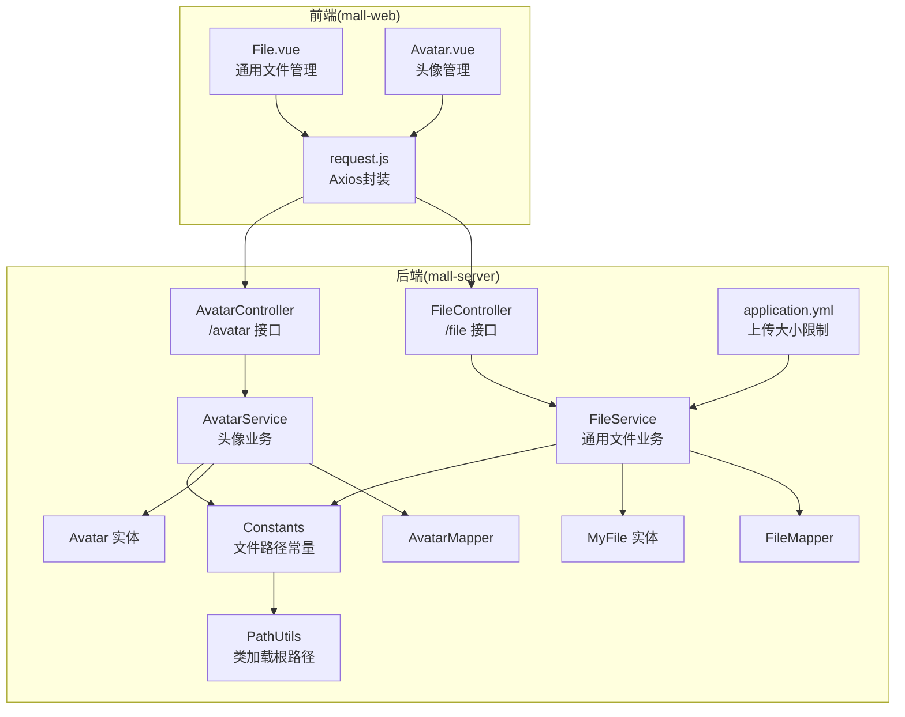
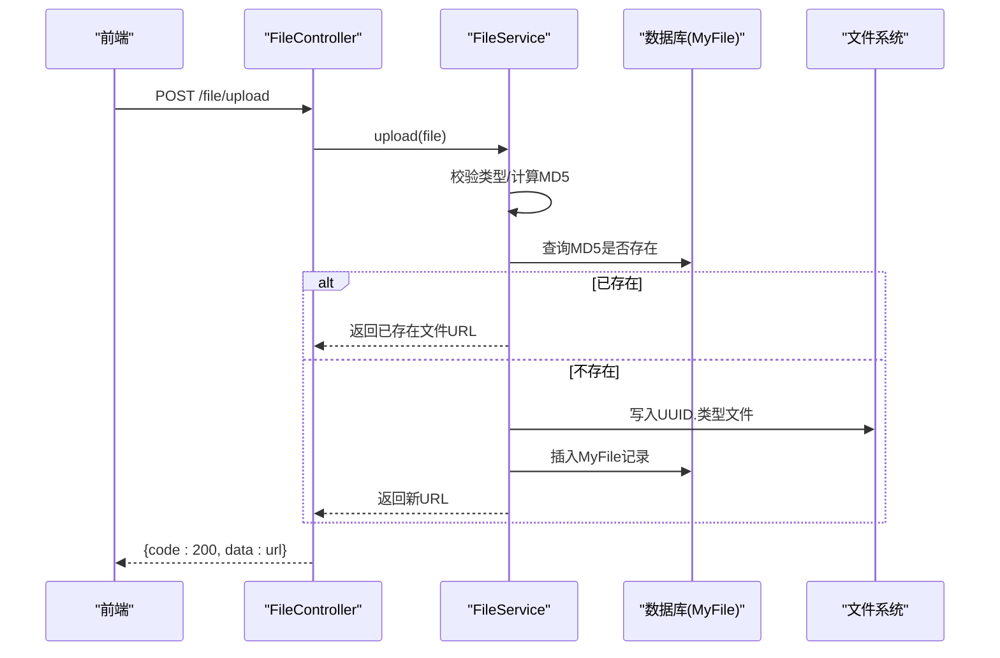
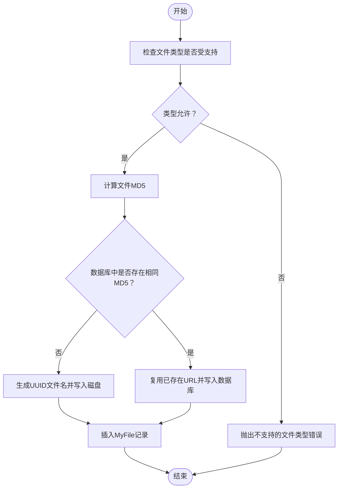
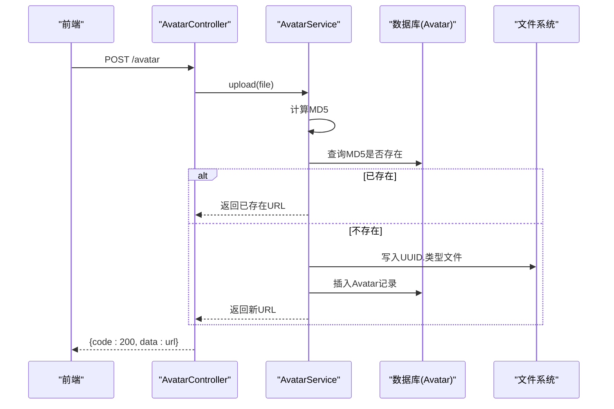
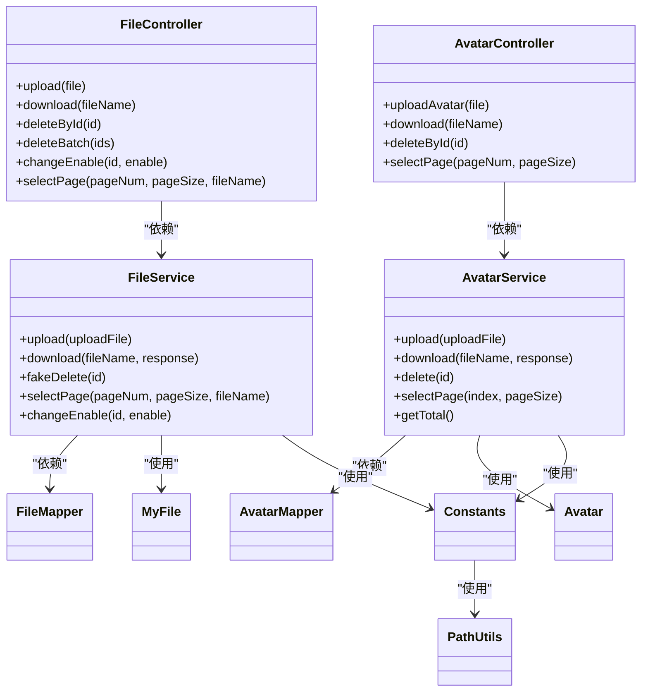
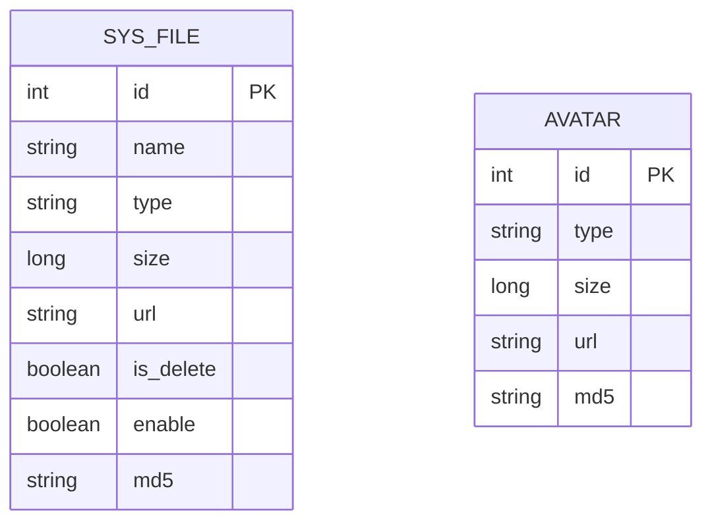

# 文件上传API

<cite>
**本文引用的文件**
- [FileController.java](file://mall-server/src/main/java/com/rabbiter/em/controller/FileController.java)
- [AvatarController.java](file://mall-server/src/main/java/com/rabbiter/em/controller/AvatarController.java)
- [FileService.java](file://mall-server/src/main/java/com/rabbiter/em/service/FileService.java)
- [AvatarService.java](file://mall-server/src/main/java/com/rabbiter/em/service/AvatarService.java)
- [MyFile.java](file://mall-server/src/main/java/com/rabbiter/em/entity/MyFile.java)
- [Avatar.java](file://mall-server/src/main/java/com/rabbiter/em/entity/Avatar.java)
- [Constants.java](file://mall-server/src/main/java/com/rabbiter/em/constants/Constants.java)
- [FileMapper.java](file://mall-server/src/main/java/com/rabbiter/em/mapper/FileMapper.java)
- [AvatarMapper.java](file://mall-server/src/main/java/com/rabbiter/em/mapper/AvatarMapper.java)
- [application.yml](file://mall-server/src/main/resources/application.yml)
- [PathUtils.java](file://mall-server/src/main/java/com/rabbiter/em/utils/PathUtils.java)
- [File.vue](file://mall-web/src/views/manage/file/File.vue)
- [Avatar.vue](file://mall-web/src/views/manage/file/Avatar.vue)
- [request.js](file://mall-web/src/utils/request.js)
</cite>

## 目录
1. [简介](#简介)
2. [项目结构](#项目结构)
3. [核心组件](#核心组件)
4. [架构总览](#架构总览)
5. [详细组件分析](#详细组件分析)
6. [依赖分析](#依赖分析)
7. [性能考量](#性能考量)
8. [故障排查指南](#故障排查指南)
9. [结论](#结论)
10. [附录](#附录)

## 简介
本文件上传API提供两类上传能力：通用文件上传与头像上传。通用文件上传支持多种文件类型，具备重复文件去重（基于MD5）、分页查询、启用/禁用控制、软删除与批量删除等管理能力；头像上传针对头像场景进行简化处理，同样支持MD5去重与下载删除等操作。接口覆盖上传、下载、删除、分页查询、启用/禁用控制等完整生命周期管理。

## 项目结构
后端采用Spring Boot + MyBatis-Plus架构，控制器层负责HTTP接口定义，服务层封装业务逻辑，实体与映射层负责数据模型与持久化。前端Vue页面通过Axios调用后端接口，完成文件上传、列表展示与下载操作。

图表来源
- [FileController.java:17-79](file://mall-server/src/main/java/com/rabbiter/em/controller/FileController.java#L17-L79)
- [AvatarController.java:17-57](file://mall-server/src/main/java/com/rabbiter/em/controller/AvatarController.java#L17-L57)
- [FileService.java:34-140](file://mall-server/src/main/java/com/rabbiter/em/service/FileService.java#L34-L140)
- [AvatarService.java:26-109](file://mall-server/src/main/java/com/rabbiter/em/service/AvatarService.java#L26-L109)
- [MyFile.java:8-112](file://mall-server/src/main/java/com/rabbiter/em/entity/MyFile.java#L8-L112)
- [Avatar.java:6-74](file://mall-server/src/main/java/com/rabbiter/em/entity/Avatar.java#L6-L74)
- [Constants.java:5-15](file://mall-server/src/main/java/com/rabbiter/em/constants/Constants.java#L5-L15)
- [application.yml:20-21](file://mall-server/src/main/resources/application.yml#L20-L21)
- [PathUtils.java:6-28](file://mall-server/src/main/java/com/rabbiter/em/utils/PathUtils.java#L6-L28)

章节来源
- [FileController.java:17-79](file://mall-server/src/main/java/com/rabbiter/em/controller/FileController.java#L17-L79)
- [AvatarController.java:17-57](file://mall-server/src/main/java/com/rabbiter/em/controller/AvatarController.java#L17-L57)
- [application.yml:1-42](file://mall-server/src/main/resources/application.yml#L1-L42)

## 核心组件
- 控制器
  - 通用文件控制器：提供上传、下载、按ID删除、批量删除、启用/禁用切换、分页查询等功能。
  - 头像控制器：提供上传、下载、按ID删除、分页查询等功能。
- 服务层
  - 通用文件服务：校验文件类型、计算MD5、去重、落盘、入库、下载、软删除、分页查询、启用/禁用。
  - 头像服务：校验MD5、落盘、入库、下载、删除（同时删除磁盘文件）、分页查询。
- 实体与映射
  - 通用文件实体：包含名称、类型、大小、URL、是否删除、启用状态、MD5等字段。
  - 头像实体：包含类型、大小、URL、MD5等字段。
  - 映射接口：通用文件Mapper继承MyBatis-Plus基础接口；头像Mapper自定义SQL。
- 配置
  - 常量：定义文件与头像存储目录路径（基于类加载根路径）。
  - 应用配置：设置最大单文件大小为30MB。

章节来源
- [FileController.java:25-78](file://mall-server/src/main/java/com/rabbiter/em/controller/FileController.java#L25-L78)
- [AvatarController.java:24-56](file://mall-server/src/main/java/com/rabbiter/em/controller/AvatarController.java#L24-L56)
- [FileService.java:41-98](file://mall-server/src/main/java/com/rabbiter/em/service/FileService.java#L41-L98)
- [AvatarService.java:33-70](file://mall-server/src/main/java/com/rabbiter/em/service/AvatarService.java#L33-L70)
- [MyFile.java:8-112](file://mall-server/src/main/java/com/rabbiter/em/entity/MyFile.java#L8-L112)
- [Avatar.java:6-74](file://mall-server/src/main/java/com/rabbiter/em/entity/Avatar.java#L6-L74)
- [Constants.java:12-14](file://mall-server/src/main/java/com/rabbiter/em/constants/Constants.java#L12-L14)
- [application.yml:20-21](file://mall-server/src/main/resources/application.yml#L20-L21)

## 架构总览
文件上传流程分为“通用文件上传”和“头像上传”两条主线，二者共享相同的MD5去重与落盘策略，差异在于存储目录、实体字段与部分管理接口。

图表来源
- [FileController.java:25-29](file://mall-server/src/main/java/com/rabbiter/em/controller/FileController.java#L25-L29)
- [FileService.java:47-98](file://mall-server/src/main/java/com/rabbiter/em/service/FileService.java#L47-L98)

章节来源
- [FileController.java:25-29](file://mall-server/src/main/java/com/rabbiter/em/controller/FileController.java#L25-L29)
- [FileService.java:47-98](file://mall-server/src/main/java/com/rabbiter/em/service/FileService.java#L47-L98)

## 详细组件分析

### 通用文件上传与管理
- 接口规范
  - 上传：POST /file/upload，表单字段file，返回URL。
  - 下载：GET /file/{fileName}，直接输出文件字节流。
  - 删除：DELETE /file/{id}，软删除（标记is_delete）。
  - 批量删除：POST /file/del/batch，传入ID数组。
  - 启用/禁用：GET /file/enable?id=&enable=。
  - 分页查询：GET /file/page?pageNum=&pageSize=&fileName=（可选）。
- 支持的文件类型
  - 图片：jpg、jpeg、png、gif、bmp、webp、ico
  - 文档：pdf、doc、docx、xls、xlsx、ppt、pptx
  - 文本：txt、csv
  - 压缩包：zip、rar
- 大小限制
  - 单文件最大30MB（由应用配置限制）。
- 存储策略
  - 存储目录：基于类加载根路径下的/file/目录。
  - 命名规则：UUID.原扩展名，URL为/file/{文件名}。
  - 去重策略：按MD5判断，若已存在则复用URL，避免重复存储。
- 元数据管理
  - 数据库表：sys_file（MyFile），字段包含id、name、type、size、url、is_delete、enable、md5。
  - 管理接口：分页查询、启用/禁用切换、软删除、批量删除。
- 下载与访问
  - 下载：根据URL从磁盘读取并输出字节流，设置下载响应头。
  - 访问：前端通过baseApi拼接URL即可访问。
- 错误处理
  - 不支持的类型：抛出业务异常。
  - 文件不存在：下载时抛出业务异常。
  - IO异常：记录日志并抛出业务异常。

图表来源
- [FileService.java:41-98](file://mall-server/src/main/java/com/rabbiter/em/service/FileService.java#L41-L98)

章节来源
- [FileController.java:25-78](file://mall-server/src/main/java/com/rabbiter/em/controller/FileController.java#L25-L78)
- [FileService.java:41-139](file://mall-server/src/main/java/com/rabbiter/em/service/FileService.java#L41-L139)
- [MyFile.java:8-112](file://mall-server/src/main/java/com/rabbiter/em/entity/MyFile.java#L8-L112)
- [FileMapper.java:8-9](file://mall-server/src/main/java/com/rabbiter/em/mapper/FileMapper.java#L8-L9)
- [Constants.java:12-14](file://mall-server/src/main/java/com/rabbiter/em/constants/Constants.java#L12-L14)
- [application.yml:20-21](file://mall-server/src/main/resources/application.yml#L20-L21)

### 头像上传与管理
- 接口规范
  - 上传：POST /avatar，表单字段file，返回URL。
  - 下载：GET /avatar/{fileName}，直接输出文件字节流。
  - 删除：DELETE /avatar/{id}，同时删除磁盘文件。
  - 分页查询：GET /avatar/page?pageNum=&pageSize=。
- 存储策略
  - 存储目录：基于类加载根路径下的/avatar/目录。
  - 命名规则：UUID.原扩展名，URL为/avatar/{文件名}。
  - 去重策略：按MD5判断，若已存在则复用URL，避免重复存储。
- 元数据管理
  - 数据库表：avatar，字段包含id、type、size、url、md5。
  - 管理接口：分页查询、删除（含磁盘清理）。
- 下载与访问
  - 下载：根据URL从磁盘读取并输出字节流，设置下载响应头。
  - 访问：前端通过baseApi拼接URL即可访问。
- 错误处理
  - 文件不存在：下载时抛出业务异常。
  - IO异常：记录日志并抛出业务异常。

图表来源
- [AvatarController.java:24-28](file://mall-server/src/main/java/com/rabbiter/em/controller/AvatarController.java#L24-L28)
- [AvatarService.java:33-70](file://mall-server/src/main/java/com/rabbiter/em/service/AvatarService.java#L33-L70)

章节来源
- [AvatarController.java:24-56](file://mall-server/src/main/java/com/rabbiter/em/controller/AvatarController.java#L24-L56)
- [AvatarService.java:33-100](file://mall-server/src/main/java/com/rabbiter/em/service/AvatarService.java#L33-L100)
- [Avatar.java:6-74](file://mall-server/src/main/java/com/rabbiter/em/entity/Avatar.java#L6-L74)
- [AvatarMapper.java:12-28](file://mall-server/src/main/java/com/rabbiter/em/mapper/AvatarMapper.java#L12-L28)
- [Constants.java](file://mall-server/src/main/java/com/rabbiter/em/constants/Constants.java#L14)

### 前端集成与使用
- 通用文件管理页面
  - 上传：绑定ElUpload至/file/upload，成功回调刷新列表。
  - 下载：通过baseApi + url拼接下载链接。
  - 删除：单个或批量删除，删除后刷新列表。
  - 分页与筛选：pageNum、pageSize、fileName参数传递给后端。
- 头像管理页面
  - 列表展示头像缩略图、类型、大小。
  - 下载与删除：同通用文件管理。
- 请求封装
  - Axios实例统一设置超时、默认headers与token注入。
  - 对401进行拦截并跳转登录。

章节来源
- [File.vue:18-201](file://mall-web/src/views/manage/file/File.vue#L18-L201)
- [Avatar.vue:4-141](file://mall-web/src/views/manage/file/Avatar.vue#L4-L141)
- [request.js:5-54](file://mall-web/src/utils/request.js#L5-L54)

## 依赖分析
- 组件耦合
  - 控制器仅依赖对应服务，职责清晰。
  - 服务层依赖Mapper与常量配置，实现业务逻辑。
  - 实体与映射分离，遵循分层设计。
- 外部依赖
  - Spring MVC：提供REST接口能力。
  - MyBatis-Plus：简化分页与条件构造。
  - Hutool：提供MD5与IO工具。
  - 前端Element Plus与Axios：提供UI与HTTP请求能力。

图表来源
- [FileController.java:17-79](file://mall-server/src/main/java/com/rabbiter/em/controller/FileController.java#L17-L79)
- [AvatarController.java:17-57](file://mall-server/src/main/java/com/rabbiter/em/controller/AvatarController.java#L17-L57)
- [FileService.java:34-140](file://mall-server/src/main/java/com/rabbiter/em/service/FileService.java#L34-L140)
- [AvatarService.java:26-109](file://mall-server/src/main/java/com/rabbiter/em/service/AvatarService.java#L26-L109)
- [MyFile.java:8-112](file://mall-server/src/main/java/com/rabbiter/em/entity/MyFile.java#L8-L112)
- [Avatar.java:6-74](file://mall-server/src/main/java/com/rabbiter/em/entity/Avatar.java#L6-L74)
- [FileMapper.java:8-9](file://mall-server/src/main/java/com/rabbiter/em/mapper/FileMapper.java#L8-L9)
- [AvatarMapper.java:12-28](file://mall-server/src/main/java/com/rabbiter/em/mapper/AvatarMapper.java#L12-L28)
- [Constants.java:12-14](file://mall-server/src/main/java/com/rabbiter/em/constants/Constants.java#L12-L14)
- [PathUtils.java:6-28](file://mall-server/src/main/java/com/rabbiter/em/utils/PathUtils.java#L6-L28)

章节来源
- [FileController.java:17-79](file://mall-server/src/main/java/com/rabbiter/em/controller/FileController.java#L17-L79)
- [AvatarController.java:17-57](file://mall-server/src/main/java/com/rabbiter/em/controller/AvatarController.java#L17-L57)
- [FileService.java:34-140](file://mall-server/src/main/java/com/rabbiter/em/service/FileService.java#L34-L140)
- [AvatarService.java:26-109](file://mall-server/src/main/java/com/rabbiter/em/service/AvatarService.java#L26-L109)

## 性能考量
- 上传性能
  - 使用transferTo进行零拷贝落盘，减少内存占用。
  - MD5去重避免重复存储，显著降低磁盘与带宽消耗。
- 并发与线程
  - 服务层为无状态Bean，适合高并发上传。
- 存储与IO
  - 建议将存储目录挂载到高性能磁盘，避免网络共享存储。
  - 对大文件上传建议结合断点续传（当前实现未包含）。
- 数据库
  - sys_file与avatar表建议建立索引：md5、id、enable等常用查询字段。
- 前端
  - 上传进度可通过第三方组件实现（当前示例未展示），建议结合NProgress提升用户体验。

[本节为通用性能建议，无需特定文件引用]

## 故障排查指南
- 常见错误与定位
  - 不支持的文件类型：检查服务端类型白名单与前端选择器。
  - 文件过大：检查application.yml中的max-file-size配置。
  - 文件不存在：检查URL是否正确、文件是否被删除或磁盘路径变更。
  - IO异常：查看服务端日志，确认磁盘权限与存储目录可用性。
- 调试步骤
  - 前端：确认baseApi与请求头token正确。
  - 后端：开启相应日志级别，定位异常堆栈。
  - 存储：确认类加载根路径与/file、/avatar目录存在且可写。

章节来源
- [FileService.java:50-52](file://mall-server/src/main/java/com/rabbiter/em/service/FileService.java#L50-L52)
- [FileService.java:103-105](file://mall-server/src/main/java/com/rabbiter/em/service/FileService.java#L103-L105)
- [AvatarService.java:74-76](file://mall-server/src/main/java/com/rabbiter/em/service/AvatarService.java#L74-L76)
- [application.yml:20-21](file://mall-server/src/main/resources/application.yml#L20-L21)

## 结论
本文件上传API提供了通用文件与头像两类上传能力，具备完善的类型校验、MD5去重、分页管理与下载删除等能力。通过明确的接口规范与清晰的分层设计，满足日常业务需求。建议后续引入断点续传、CDN分发与定期清理策略以进一步提升性能与稳定性。

[本节为总结性内容，无需特定文件引用]

## 附录

### 接口一览（通用文件）
- 上传
  - 方法：POST
  - 路径：/file/upload
  - 参数：multipart file
  - 返回：URL字符串
- 下载
  - 方法：GET
  - 路径：/file/{fileName}
  - 返回：二进制文件流
- 删除
  - 方法：DELETE
  - 路径：/file/{id}
  - 返回：操作结果
- 批量删除
  - 方法：POST
  - 路径：/file/del/batch
  - 参数：JSON数组[id,...]
  - 返回：操作结果
- 启用/禁用
  - 方法：GET
  - 路径：/file/enable
  - 参数：id, enable
  - 返回：操作结果
- 分页查询
  - 方法：GET
  - 路径：/file/page
  - 参数：pageNum, pageSize, fileName(可选)
  - 返回：分页数据

章节来源
- [FileController.java:25-78](file://mall-server/src/main/java/com/rabbiter/em/controller/FileController.java#L25-L78)

### 接口一览（头像）
- 上传
  - 方法：POST
  - 路径：/avatar
  - 参数：multipart file
  - 返回：URL字符串
- 下载
  - 方法：GET
  - 路径：/avatar/{fileName}
  - 返回：二进制文件流
- 删除
  - 方法：DELETE
  - 路径：/avatar/{id}
  - 返回：操作结果
- 分页查询
  - 方法：GET
  - 路径：/avatar/page
  - 参数：pageNum, pageSize
  - 返回：分页数据

章节来源
- [AvatarController.java:24-56](file://mall-server/src/main/java/com/rabbiter/em/controller/AvatarController.java#L24-L56)

### 存储与安全
- 存储路径
  - 通用文件：/file/
  - 头像：/avatar/
  - 路径来源：类加载根路径，便于部署一致性。
- 安全建议
  - 仅允许受信类型，避免恶意文件。
  - 对外暴露URL需谨慎，必要时增加鉴权或签名。
  - 定期清理过期或无用文件，释放磁盘空间。

章节来源
- [Constants.java:12-14](file://mall-server/src/main/java/com/rabbiter/em/constants/Constants.java#L12-L14)
- [PathUtils.java:6-28](file://mall-server/src/main/java/com/rabbiter/em/utils/PathUtils.java#L6-L28)

### 数据模型

图表来源
- [MyFile.java:8-112](file://mall-server/src/main/java/com/rabbiter/em/entity/MyFile.java#L8-L112)
- [Avatar.java:6-74](file://mall-server/src/main/java/com/rabbiter/em/entity/Avatar.java#L6-L74)