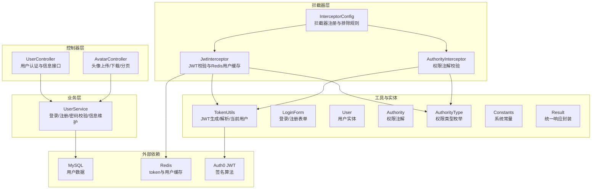
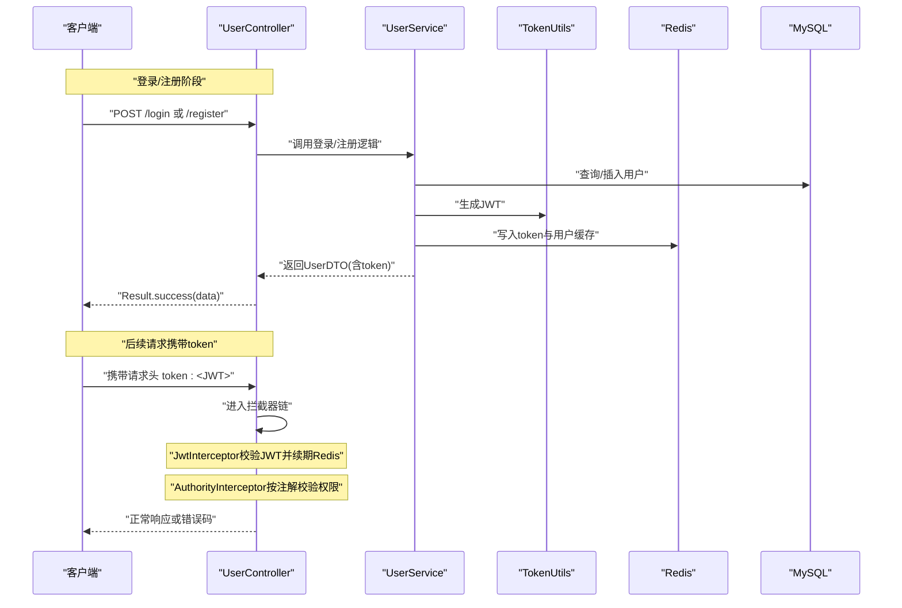
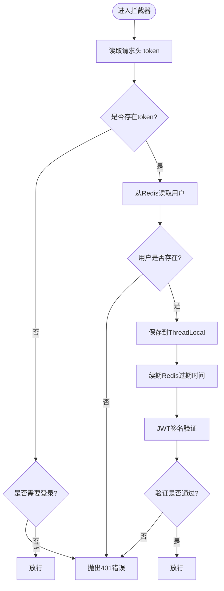
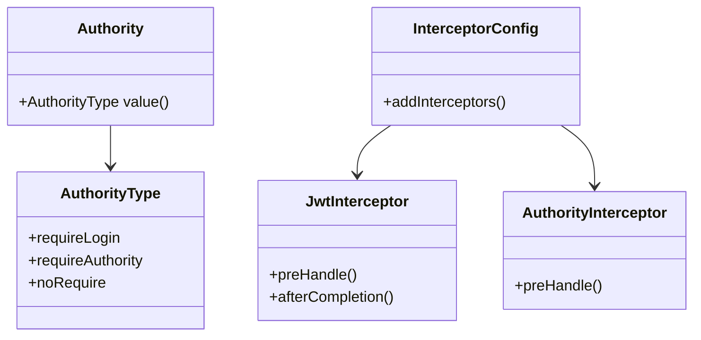
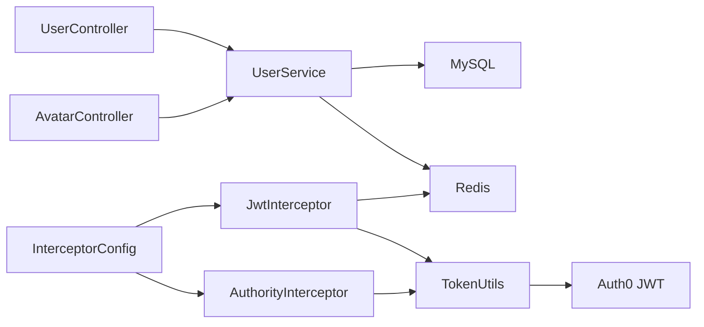

# 用户认证API

<cite>
**本文引用的文件**
- [UserController.java](file://mall-server/src/main/java/com/rabbiter/em/controller/UserController.java)
- [AvatarController.java](file://mall-server/src/main/java/com/rabbiter/em/controller/AvatarController.java)
- [UserService.java](file://mall-server/src/main/java/com/rabbiter/em/service/UserService.java)
- [JwtInterceptor.java](file://mall-server/src/main/java/com/rabbiter/em/interceptor/JwtInterceptor.java)
- [AuthorityInterceptor.java](file://mall-server/src/main/java/com/rabbiter/em/interceptor/AuthorityInterceptor.java)
- [InterceptorConfig.java](file://mall-server/src/main/java/com/rabbiter/em/config/InterceptorConfig.java)
- [TokenUtils.java](file://mall-server/src/main/java/com/rabbiter/em/utils/TokenUtils.java)
- [LoginForm.java](file://mall-server/src/main/java/com/rabbiter/em/entity/LoginForm.java)
- [User.java](file://mall-server/src/main/java/com/rabbiter/em/entity/User.java)
- [Authority.java](file://mall-server/src/main/java/com/rabbiter/em/annotation/Authority.java)
- [AuthorityType.java](file://mall-server/src/main/java/com/rabbiter/em/entity/AuthorityType.java)
- [Constants.java](file://mall-server/src/main/java/com/rabbiter/em/constants/Constants.java)
- [Result.java](file://mall-server/src/main/java/com/rabbiter/em/common/Result.java)
- [application.yml](file://mall-server/src/main/resources/application.yml)
</cite>

## 目录
1. [简介](#简介)
2. [项目结构](#项目结构)
3. [核心组件](#核心组件)
4. [架构总览](#架构总览)
5. [详细组件分析](#详细组件分析)
6. [依赖分析](#依赖分析)
7. [性能考量](#性能考量)
8. [故障排查指南](#故障排查指南)
9. [结论](#结论)
10. [附录](#附录)

## 简介
本文件面向cosplay商城后端的用户认证API，涵盖用户注册、登录、个人信息管理与头像上传等能力。文档详细说明各接口的HTTP方法、URL路径、请求参数与响应格式；解释基于JWT的认证机制（token获取、验证与续期）；阐述权限控制与拦截器工作原理；并给出密码加密策略与安全建议、常见错误及解决方案。

## 项目结构
后端采用Spring Boot + MyBatis Plus架构，认证相关代码集中在以下模块：
- 控制器层：UserController、AvatarController
- 业务层：UserService
- 拦截器层：JwtInterceptor、AuthorityInterceptor
- 工具与常量：TokenUtils、Constants、Result
- 实体与注解：LoginForm、User、Authority、AuthorityType
- 配置：application.yml、InterceptorConfig

图表来源
- [UserController.java:28-178](file://mall-server/src/main/java/com/rabbiter/em/controller/UserController.java#L28-L178)
- [AvatarController.java:17-57](file://mall-server/src/main/java/com/rabbiter/em/controller/AvatarController.java#L17-L57)
- [UserService.java:27-154](file://mall-server/src/main/java/com/rabbiter/em/service/UserService.java#L27-L154)
- [JwtInterceptor.java:34-99](file://mall-server/src/main/java/com/rabbiter/em/interceptor/JwtInterceptor.java#L34-L99)
- [AuthorityInterceptor.java:15-53](file://mall-server/src/main/java/com/rabbiter/em/interceptor/AuthorityInterceptor.java#L15-L53)
- [InterceptorConfig.java:11-36](file://mall-server/src/main/java/com/rabbiter/em/config/InterceptorConfig.java#L11-L36)
- [TokenUtils.java:18-77](file://mall-server/src/main/java/com/rabbiter/em/utils/TokenUtils.java#L18-L77)
- [LoginForm.java:3-48](file://mall-server/src/main/java/com/rabbiter/em/entity/LoginForm.java#L3-L48)
- [User.java:9-122](file://mall-server/src/main/java/com/rabbiter/em/entity/User.java#L9-L122)
- [Authority.java:7-12](file://mall-server/src/main/java/com/rabbiter/em/annotation/Authority.java#L7-L12)
- [AuthorityType.java:3-7](file://mall-server/src/main/java/com/rabbiter/em/entity/AuthorityType.java#L3-L7)
- [Constants.java:5-15](file://mall-server/src/main/java/com/rabbiter/em/constants/Constants.java#L5-L15)
- [Result.java:5-65](file://mall-server/src/main/java/com/rabbiter/em/common/Result.java#L5-L65)

章节来源
- [application.yml:1-42](file://mall-server/src/main/resources/application.yml#L1-L42)

## 核心组件
- 用户控制器（UserController）
  - 提供登录、注册、获取用户信息、当前用户ID、用户列表、保存/更新/删除、分页查询、重置密码等接口。
- 头像控制器（AvatarController）
  - 提供头像上传、下载、删除、分页查询。
- 用户服务（UserService）
  - 实现登录/注册、密码校验与迁移、BCrypt加密、Redis缓存token与用户、信息维护。
- 拦截器（JwtInterceptor、AuthorityInterceptor）
  - 第一层：从请求头读取token，校验JWT签名，从Redis加载用户到ThreadLocal，续期token。
  - 第二层：根据@Authority注解判断是否需要登录或管理员权限。
- 工具与常量（TokenUtils、Constants、Result）
  - JWT生成与解析、当前用户获取、登录/权限校验、统一响应封装、系统常量定义。

章节来源
- [UserController.java:28-178](file://mall-server/src/main/java/com/rabbiter/em/controller/UserController.java#L28-L178)
- [AvatarController.java:17-57](file://mall-server/src/main/java/com/rabbiter/em/controller/AvatarController.java#L17-L57)
- [UserService.java:27-154](file://mall-server/src/main/java/com/rabbiter/em/service/UserService.java#L27-L154)
- [JwtInterceptor.java:34-99](file://mall-server/src/main/java/com/rabbiter/em/interceptor/JwtInterceptor.java#L34-L99)
- [AuthorityInterceptor.java:15-53](file://mall-server/src/main/java/com/rabbiter/em/interceptor/AuthorityInterceptor.java#L15-L53)
- [TokenUtils.java:18-77](file://mall-server/src/main/java/com/rabbiter/em/utils/TokenUtils.java#L18-L77)
- [Constants.java:5-15](file://mall-server/src/main/java/com/rabbiter/em/constants/Constants.java#L5-L15)
- [Result.java:5-65](file://mall-server/src/main/java/com/rabbiter/em/common/Result.java#L5-L65)

## 架构总览
认证与权限控制的整体流程如下：

图表来源
- [UserController.java:37-57](file://mall-server/src/main/java/com/rabbiter/em/controller/UserController.java#L37-L57)
- [UserService.java:44-75](file://mall-server/src/main/java/com/rabbiter/em/service/UserService.java#L44-L75)
- [TokenUtils.java:31-40](file://mall-server/src/main/java/com/rabbiter/em/utils/TokenUtils.java#L31-L40)
- [JwtInterceptor.java:39-91](file://mall-server/src/main/java/com/rabbiter/em/interceptor/JwtInterceptor.java#L39-L91)
- [AuthorityInterceptor.java:17-47](file://mall-server/src/main/java/com/rabbiter/em/interceptor/AuthorityInterceptor.java#L17-L47)

## 详细组件分析

### 接口定义与使用说明

- 登录接口
  - 方法与路径：POST /login
  - 请求体：LoginForm（字段见LoginForm实体）
  - 成功响应：Result.success(UserDTO)，包含token与用户信息
  - 失败响应：Result.error(code, msg)，如用户名或密码错误
  - 安全要点：密码支持BCrypt与旧MD5兼容，登录成功后生成JWT并写入Redis缓存

- 注册接口
  - 方法与路径：POST /register
  - 请求体：LoginForm（用户名、密码、手机号）
  - 成功响应：Result.success(UserDTO)，返回新用户基本信息
  - 失败响应：Result.error(code, msg)，如用户名已存在、密码不合规
  - 安全要点：密码强制6-12位且包含字母、数字与特殊字符；注册时BCrypt加密

- 获取用户信息
  - 方法与路径：GET /userinfo/{username}
  - 路径参数：username
  - 成功响应：Result.success(User)

- 当前用户ID
  - 方法与路径：GET /userid
  - 返回：long型用户ID（来自当前登录上下文）

- 管理员接口（用户列表、保存/删除/批量删除、分页、重置密码）
  - GET /user/（需管理员）
  - POST /user（保存或更新）
  - DELETE /user/{id}（需管理员）
  - POST /user/del/batch（需管理员）
  - GET /user/page（需管理员）
  - POST /user/resetPassword（需管理员）

- 头像上传/下载/删除/分页
  - POST /avatar（上传头像，multipart/form-data）
  - GET /avatar/{fileName}（下载）
  - DELETE /avatar/{id}（需管理员）
  - GET /avatar/page?pageNum=&pageSize=

章节来源
- [UserController.java:37-177](file://mall-server/src/main/java/com/rabbiter/em/controller/UserController.java#L37-L177)
- [AvatarController.java:24-56](file://mall-server/src/main/java/com/rabbiter/em/controller/AvatarController.java#L24-L56)
- [LoginForm.java:3-48](file://mall-server/src/main/java/com/rabbiter/em/entity/LoginForm.java#L3-L48)
- [User.java:9-122](file://mall-server/src/main/java/com/rabbiter/em/entity/User.java#L9-L122)

### JWT认证机制
- token生成
  - 使用HMAC256算法，签名为“audience”为用户ID的JWT字符串
  - 生成密钥来源于配置文件中的jwt.secret
- token验证
  - 从请求头读取token，若缺失则抛出401错误
  - 从Redis中取出用户并放入ThreadLocal，同时续期token过期时间
  - 使用相同密钥对JWT进行签名验证，失败则抛出401错误
- token续期
  - 每次有效请求都会延长Redis中token的TTL

图表来源
- [JwtInterceptor.java:39-91](file://mall-server/src/main/java/com/rabbiter/em/interceptor/JwtInterceptor.java#L39-L91)
- [TokenUtils.java:31-40](file://mall-server/src/main/java/com/rabbiter/em/utils/TokenUtils.java#L31-L40)
- [application.yml:35-36](file://mall-server/src/main/resources/application.yml#L35-L36)

章节来源
- [JwtInterceptor.java:39-91](file://mall-server/src/main/java/com/rabbiter/em/interceptor/JwtInterceptor.java#L39-L91)
- [TokenUtils.java:31-40](file://mall-server/src/main/java/com/rabbiter/em/utils/TokenUtils.java#L31-L40)
- [application.yml:35-36](file://mall-server/src/main/resources/application.yml#L35-L36)

### 权限控制与拦截器
- 注解驱动
  - @Authority可标注在类或方法上，默认requireLogin
  - 支持三种权限类型：requireLogin、requireAuthority、noRequire
- 两层拦截器
  - JwtInterceptor：全局生效，除/login、/register、/avatar/**外的所有路径均受保护
  - AuthorityInterceptor：根据注解决定是否需要登录或管理员权限
- 权限判定
  - requireLogin：要求token存在且有效
  - requireAuthority：要求当前用户角色为admin

图表来源
- [Authority.java:7-12](file://mall-server/src/main/java/com/rabbiter/em/annotation/Authority.java#L7-L12)
- [AuthorityType.java:3-7](file://mall-server/src/main/java/com/rabbiter/em/entity/AuthorityType.java#L3-L7)
- [JwtInterceptor.java:34-99](file://mall-server/src/main/java/com/rabbiter/em/interceptor/JwtInterceptor.java#L34-L99)
- [AuthorityInterceptor.java:15-53](file://mall-server/src/main/java/com/rabbiter/em/interceptor/AuthorityInterceptor.java#L15-L53)
- [InterceptorConfig.java:11-36](file://mall-server/src/main/java/com/rabbiter/em/config/InterceptorConfig.java#L11-L36)

章节来源
- [Authority.java:7-12](file://mall-server/src/main/java/com/rabbiter/em/annotation/Authority.java#L7-L12)
- [AuthorityType.java:3-7](file://mall-server/src/main/java/com/rabbiter/em/entity/AuthorityType.java#L3-L7)
- [JwtInterceptor.java:39-91](file://mall-server/src/main/java/com/rabbiter/em/interceptor/JwtInterceptor.java#L39-L91)
- [AuthorityInterceptor.java:17-47](file://mall-server/src/main/java/com/rabbiter/em/interceptor/AuthorityInterceptor.java#L17-L47)
- [InterceptorConfig.java:17-30](file://mall-server/src/main/java/com/rabbiter/em/config/InterceptorConfig.java#L17-L30)

### 密码加密与安全考虑
- 密码强度
  - 注册时强制6-12位，且必须包含字母、数字与特殊字符
- 存储策略
  - 新注册用户使用BCrypt加密存储
  - 兼容旧MD5格式：登录时若匹配则透明迁移到BCrypt
- 传输安全
  - 建议在生产环境启用HTTPS
- 密钥管理
  - jwt.secret应由环境变量注入，避免硬编码
- Redis安全
  - 合理设置TTL与访问控制，防止敏感数据泄露

章节来源
- [UserService.java:30-38](file://mall-server/src/main/java/com/rabbiter/em/service/UserService.java#L30-L38)
- [UserService.java:54-65](file://mall-server/src/main/java/com/rabbiter/em/service/UserService.java#L54-L65)
- [application.yml:35-36](file://mall-server/src/main/resources/application.yml#L35-L36)

### 统一响应与错误码
- 成功：code=200，msg可为空，data为具体结果
- 失败：code=500，msg为错误描述
- 认证相关错误：
  - 401：TOKEN_ERROR，token失效或未登录
  - 403：拒绝执行，如无权限访问管理员接口
- 未找到：NO_RESULT=510

章节来源
- [Result.java:11-23](file://mall-server/src/main/java/com/rabbiter/em/common/Result.java#L11-L23)
- [Constants.java:5-15](file://mall-server/src/main/java/com/rabbiter/em/constants/Constants.java#L5-L15)

## 依赖分析
- 控制器依赖业务层，业务层依赖数据库与Redis
- 拦截器依赖TokenUtils与RedisTemplate
- TokenUtils依赖JWT库与配置文件中的密钥
- 统一响应Result被控制器广泛使用

图表来源
- [UserController.java:28-178](file://mall-server/src/main/java/com/rabbiter/em/controller/UserController.java#L28-L178)
- [AvatarController.java:17-57](file://mall-server/src/main/java/com/rabbiter/em/controller/AvatarController.java#L17-L57)
- [UserService.java:27-154](file://mall-server/src/main/java/com/rabbiter/em/service/UserService.java#L27-L154)
- [JwtInterceptor.java:34-99](file://mall-server/src/main/java/com/rabbiter/em/interceptor/JwtInterceptor.java#L34-L99)
- [AuthorityInterceptor.java:15-53](file://mall-server/src/main/java/com/rabbiter/em/interceptor/AuthorityInterceptor.java#L15-L53)
- [TokenUtils.java:18-77](file://mall-server/src/main/java/com/rabbiter/em/utils/TokenUtils.java#L18-L77)
- [InterceptorConfig.java:11-36](file://mall-server/src/main/java/com/rabbiter/em/config/InterceptorConfig.java#L11-L36)

## 性能考量
- Redis缓存
  - 将token与用户对象缓存于Redis，减少数据库压力，提高鉴权效率
  - 合理设置TTL，避免内存泄漏
- 分页查询
  - 用户分页接口支持模糊查询字段，注意索引优化
- 文件上传
  - 单文件最大30MB，建议对大文件做压缩与格式限制

章节来源
- [UserService.java:69-71](file://mall-server/src/main/java/com/rabbiter/em/service/UserService.java#L69-L71)
- [application.yml:20-21](file://mall-server/src/main/resources/application.yml#L20-L21)
- [UserController.java:144-162](file://mall-server/src/main/java/com/rabbiter/em/controller/UserController.java#L144-L162)

## 故障排查指南
- 登录失败
  - 用户名或密码错误：检查用户名是否存在、密码是否匹配（含旧MD5迁移）
  - 密码不合规：确认长度与字符组成满足要求
- token相关错误
  - 401 token失效：确认请求头是否携带token、token是否过期、Redis中是否还存在对应用户
  - 403 无权限：确认当前用户角色是否为admin（仅管理员接口）
- 头像上传失败
  - 确认multipart/form-data格式正确、文件大小未超过限制
- 统一响应
  - 成功：code=200；失败：code=500；未找到：code=510

章节来源
- [UserService.java:48-68](file://mall-server/src/main/java/com/rabbiter/em/service/UserService.java#L48-L68)
- [JwtInterceptor.java:61-91](file://mall-server/src/main/java/com/rabbiter/em/interceptor/JwtInterceptor.java#L61-L91)
- [Constants.java:5-15](file://mall-server/src/main/java/com/rabbiter/em/constants/Constants.java#L5-L15)
- [Result.java:11-23](file://mall-server/src/main/java/com/rabbiter/em/common/Result.java#L11-L23)

## 结论
本认证体系以JWT为核心，结合Redis缓存与两级拦截器实现高效、可控的认证与授权。通过注解驱动的权限控制与严格的密码策略，保障了系统的安全性与可维护性。建议在生产环境中强化HTTPS、密钥管理与Redis访问控制，并持续监控拦截器与缓存命中率。

## 附录

### 接口一览与示例

- 登录
  - 请求：POST /login
  - 请求体：LoginForm（username, password, phone）
  - 成功响应：{
      "code": "200",
      "msg": null,
      "data": {
        "id": 1,
        "username": "string",
        "nickname": "string",
        "role": "user",
        "token": "JWT字符串"
      }
    }
  - 失败响应：{
      "code": "403",
      "msg": "用户名或密码错误",
      "data": null
    }

- 注册
  - 请求：POST /register
  - 请求体：LoginForm（username, password, phone）
  - 成功响应：{
      "code": "200",
      "msg": null,
      "data": {
        "id": 2,
        "username": "string",
        "nickname": "新用户",
        "role": "user"
      }
    }

- 获取用户信息
  - 请求：GET /userinfo/{username}
  - 成功响应：{
      "code": "200",
      "msg": null,
      "data": {
        "id": 1,
        "username": "string",
        "nickname": "string",
        "email": "string",
        "phone": "string",
        "address": "string",
        "avatarUrl": "string",
        "role": "user"
      }
    }

- 当前用户ID
  - 请求：GET /userid
  - 成功响应：1

- 头像上传
  - 请求：POST /avatar
  - 表单字段：file（MultipartFile）
  - 成功响应：{
      "code": "200",
      "msg": null,
      "data": "头像URL"
    }

- 管理员接口（示例：分页查询）
  - 请求：GET /user/page?pageNum=1&pageSize=10&id=&username=&nickname=
  - 成功响应：{
      "code": "200",
      "msg": null,
      "data": {
        "records": [...],
        "total": 100
      }
    }

章节来源
- [UserController.java:37-177](file://mall-server/src/main/java/com/rabbiter/em/controller/UserController.java#L37-L177)
- [AvatarController.java:24-56](file://mall-server/src/main/java/com/rabbiter/em/controller/AvatarController.java#L24-L56)
- [LoginForm.java:3-48](file://mall-server/src/main/java/com/rabbiter/em/entity/LoginForm.java#L3-L48)
- [User.java:9-122](file://mall-server/src/main/java/com/rabbiter/em/entity/User.java#L9-L122)