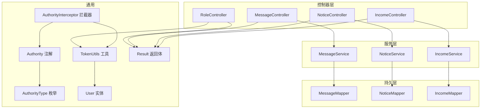
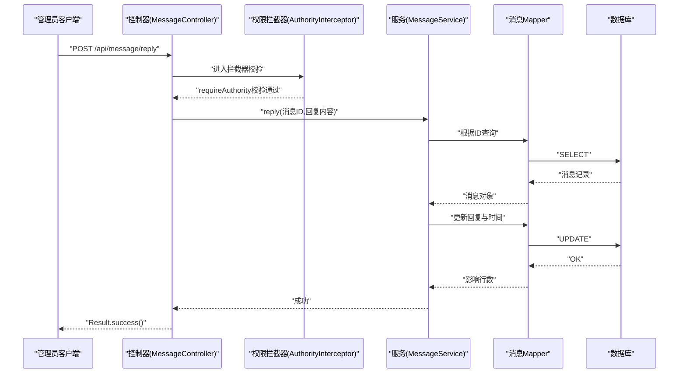
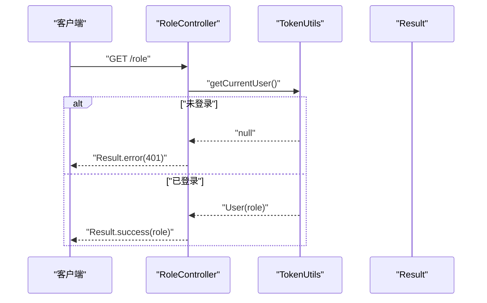
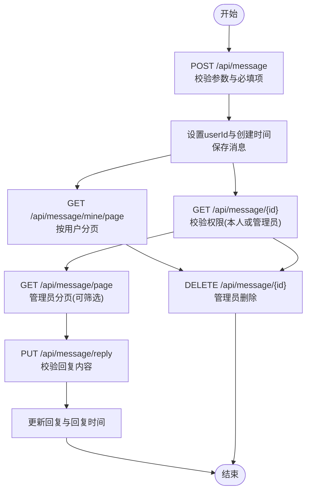
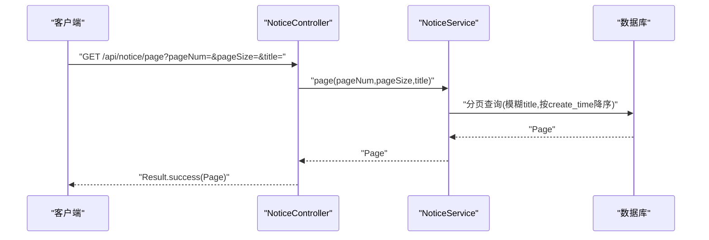
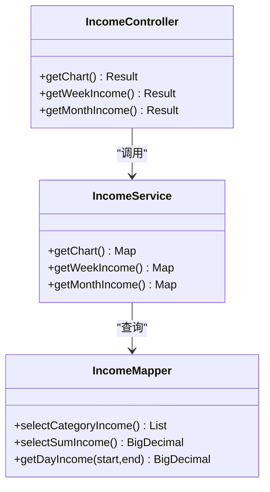
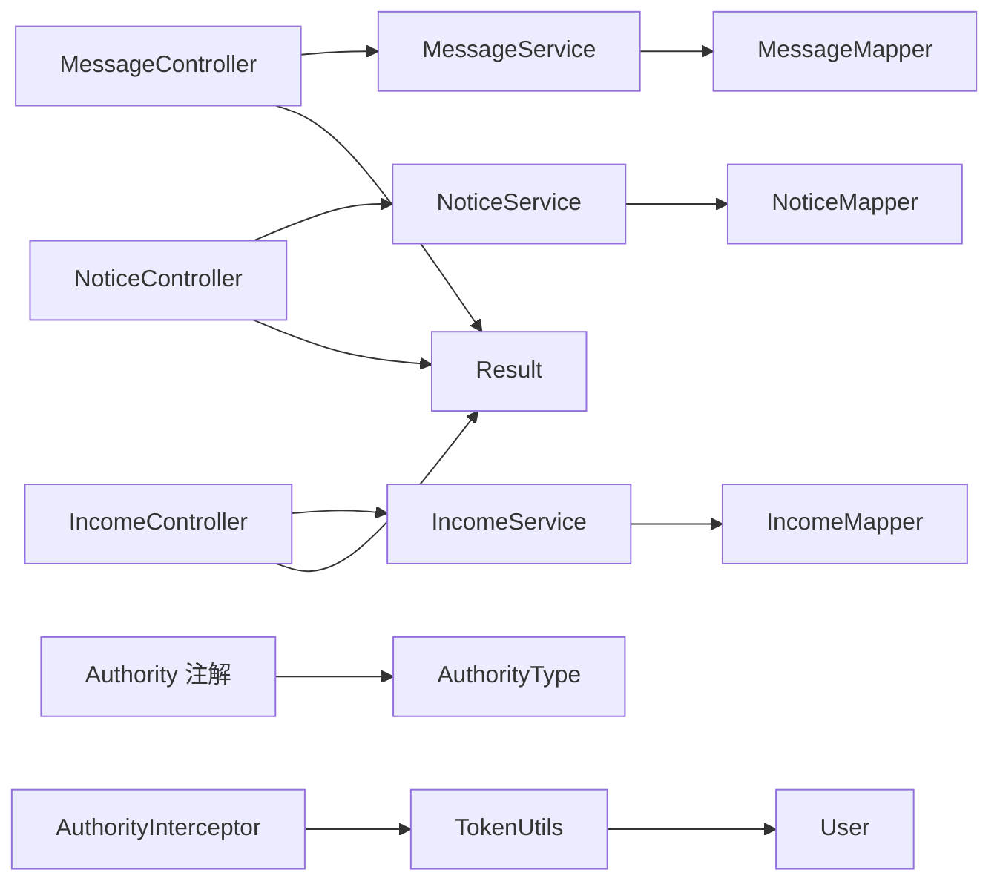

# 系统管理API

<cite>
**本文引用的文件**
- [RoleController.java](file://mall-server/src/main/java/com/rabbiter/em/controller/RoleController.java)
- [MessageController.java](file://mall-server/src/main/java/com/rabbiter/em/controller/MessageController.java)
- [NoticeController.java](file://mall-server/src/main/java/com/rabbiter/em/controller/NoticeController.java)
- [IncomeController.java](file://mall-server/src/main/java/com/rabbiter/em/controller/IncomeController.java)
- [MessageService.java](file://mall-server/src/main/java/com/rabbiter/em/service/MessageService.java)
- [NoticeService.java](file://mall-server/src/main/java/com/rabbiter/em/service/NoticeService.java)
- [IncomeService.java](file://mall-server/src/main/java/com/rabbiter/em/service/IncomeService.java)
- [Authority.java](file://mall-server/src/main/java/com/rabbiter/em/annotation/Authority.java)
- [AuthorityType.java](file://mall-server/src/main/java/com/rabbiter/em/entity/AuthorityType.java)
- [AuthorityInterceptor.java](file://mall-server/src/main/java/com/rabbiter/em/interceptor/AuthorityInterceptor.java)
- [TokenUtils.java](file://mall-server/src/main/java/com/rabbiter/em/utils/TokenUtils.java)
- [Result.java](file://mall-server/src/main/java/com/rabbiter/em/common/Result.java)
- [User.java](file://mall-server/src/main/java/com/rabbiter/em/entity/User.java)
- [application.yml](file://mall-server/src/main/resources/application.yml)
- [IncomeMapper.xml](file://mall-server/src/main/resources/mapper/Income.xml)
- [IncomeMapper.java](file://mall-server/src/main/java/com/rabbiter/em/mapper/IncomeMapper.java)
- [MessageMapper.java](file://mall-server/src/main/java/com/rabbiter/em/mapper/MessageMapper.java)
- [NoticeMapper.java](file://mall-server/src/main/java/com/rabbiter/em/mapper/NoticeMapper.java)
</cite>

## 目录
1. [简介](#简介)
2. [项目结构](#项目结构)
3. [核心组件](#核心组件)
4. [架构总览](#架构总览)
5. [详细组件分析](#详细组件分析)
6. [依赖分析](#依赖分析)
7. [性能考虑](#性能考虑)
8. [故障排查指南](#故障排查指南)
9. [结论](#结论)
10. [附录](#附录)

## 简介
本文件面向系统管理API，聚焦以下能力：
- 角色管理与权限控制：基于注解与拦截器的登录态校验与管理员权限校验。
- 消息通知：用户留言提交、查看与分页；管理员侧查看、回复、删除。
- 公告管理：公告列表、分页、新增/编辑、删除；前台可公开访问。
- 收入统计：图表数据、周度、月度收入查询。
- 后台管理界面数据接口规范：统一返回体、鉴权策略、分页参数约定。
- 数据导出与批量操作：当前仓库未提供具体实现，建议在控制器层扩展。
- 系统监控与日志查询：当前仓库未提供具体实现，建议通过Spring Boot Actuator或自定义端点扩展。
- 系统维护与备份恢复：当前仓库未提供具体实现，建议通过数据库层面或外部工具实现。

## 项目结构
后端采用Spring Boot + MyBatis-Plus，控制器位于controller包，服务层位于service包，实体类位于entity包，通用返回体位于common包，鉴权注解与拦截器位于annotation与interceptor包，工具类位于utils包，配置位于resources/application.yml。

**图示来源**
- [RoleController.java:1-22](file://mall-server/src/main/java/com/rabbiter/em/controller/RoleController.java#L1-L22)
- [MessageController.java:1-112](file://mall-server/src/main/java/com/rabbiter/em/controller/MessageController.java#L1-L112)
- [NoticeController.java:1-54](file://mall-server/src/main/java/com/rabbiter/em/controller/NoticeController.java#L1-L54)
- [IncomeController.java:1-37](file://mall-server/src/main/java/com/rabbiter/em/controller/IncomeController.java#L1-L37)
- [MessageService.java:1-36](file://mall-server/src/main/java/com/rabbiter/em/service/MessageService.java#L1-L36)
- [NoticeService.java:1-11](file://mall-server/src/main/java/com/rabbiter/em/service/NoticeService.java#L1-L11)
- [IncomeService.java:1-76](file://mall-server/src/main/java/com/rabbiter/em/service/IncomeService.java#L1-L76)
- [Authority.java:1-13](file://mall-server/src/main/java/com/rabbiter/em/annotation/Authority.java#L1-L13)
- [AuthorityType.java:1-8](file://mall-server/src/main/java/com/rabbiter/em/entity/AuthorityType.java#L1-L8)
- [AuthorityInterceptor.java:1-54](file://mall-server/src/main/java/com/rabbiter/em/interceptor/AuthorityInterceptor.java#L1-L54)
- [TokenUtils.java:1-78](file://mall-server/src/main/java/com/rabbiter/em/utils/TokenUtils.java#L1-L78)
- [Result.java:1-66](file://mall-server/src/main/java/com/rabbiter/em/common/Result.java#L1-L66)
- [User.java:1-123](file://mall-server/src/main/java/com/rabbiter/em/entity/User.java#L1-L123)

**章节来源**
- [application.yml:1-42](file://mall-server/src/main/resources/application.yml#L1-L42)

## 核心组件
- 权限注解与拦截器：通过@Authority与AuthorityInterceptor实现登录态与管理员权限校验。
- 统一返回体：Result封装code/msg/data，控制器统一返回。
- 用户实体：User包含role字段，用于权限判断。
- 工具类：TokenUtils负责生成token、校验登录与管理员权限、获取当前用户。

**章节来源**
- [Authority.java:1-13](file://mall-server/src/main/java/com/rabbiter/em/annotation/Authority.java#L1-L13)
- [AuthorityType.java:1-8](file://mall-server/src/main/java/com/rabbiter/em/entity/AuthorityType.java#L1-L8)
- [AuthorityInterceptor.java:1-54](file://mall-server/src/main/java/com/rabbiter/em/interceptor/AuthorityInterceptor.java#L1-L54)
- [TokenUtils.java:1-78](file://mall-server/src/main/java/com/rabbiter/em/utils/TokenUtils.java#L1-L78)
- [Result.java:1-66](file://mall-server/src/main/java/com/rabbiter/em/common/Result.java#L1-L66)
- [User.java:1-123](file://mall-server/src/main/java/com/rabbiter/em/entity/User.java#L1-L123)

## 架构总览
系统管理API遵循“控制器-服务-持久层”分层，配合全局拦截器进行权限控制，使用JWT进行身份验证。

**图示来源**
- [MessageController.java:83-100](file://mall-server/src/main/java/com/rabbiter/em/controller/MessageController.java#L83-L100)
- [AuthorityInterceptor.java:36-43](file://mall-server/src/main/java/com/rabbiter/em/interceptor/AuthorityInterceptor.java#L36-L43)
- [MessageService.java:1-36](file://mall-server/src/main/java/com/rabbiter/em/service/MessageService.java#L1-L36)

## 详细组件分析

### 角色管理与权限控制
- 登录态校验：@Authority(requireLogin)，拦截器通过TokenUtils.validateLogin校验请求头token是否存在。
- 管理员权限校验：@Authority(requireAuthority)，拦截器通过TokenUtils.validateAuthority校验当前用户role是否为admin。
- 获取当前用户角色：/role接口读取TokenUtils.getCurrentUser()并返回其role。

**图示来源**
- [RoleController.java:12-20](file://mall-server/src/main/java/com/rabbiter/em/controller/RoleController.java#L12-L20)
- [TokenUtils.java:42-48](file://mall-server/src/main/java/com/rabbiter/em/utils/TokenUtils.java#L42-L48)

**章节来源**
- [Authority.java:1-13](file://mall-server/src/main/java/com/rabbiter/em/annotation/Authority.java#L1-L13)
- [AuthorityType.java:1-8](file://mall-server/src/main/java/com/rabbiter/em/entity/AuthorityType.java#L1-L8)
- [AuthorityInterceptor.java:17-47](file://mall-server/src/main/java/com/rabbiter/em/interceptor/AuthorityInterceptor.java#L17-L47)
- [TokenUtils.java:50-75](file://mall-server/src/main/java/com/rabbiter/em/utils/TokenUtils.java#L50-L75)
- [RoleController.java:1-22](file://mall-server/src/main/java/com/rabbiter/em/controller/RoleController.java#L1-L22)

### 消息通知（留言）管理
- 用户提交留言：POST /api/message，校验标题、内容、联系方式非空，设置userId、创建时间，保存。
- 查看我的留言：GET /api/message/mine/page?pageNum=&pageSize=，按用户分页查询。
- 查看留言详情：GET /api/message/{id}，非管理员仅能查看自己的留言。
- 管理员分页查看：GET /api/message/page?pageNum=&pageSize=&customIntent=&searchText=
- 管理员回复：PUT /api/message/reply，校验回复内容非空，更新回复与回复时间。
- 管理员删除：DELETE /api/message/{id}

**图示来源**
- [MessageController.java:27-110](file://mall-server/src/main/java/com/rabbiter/em/controller/MessageController.java#L27-L110)
- [MessageService.java:15-34](file://mall-server/src/main/java/com/rabbiter/em/service/MessageService.java#L15-L34)

**章节来源**
- [MessageController.java:1-112](file://mall-server/src/main/java/com/rabbiter/em/controller/MessageController.java#L1-L112)
- [MessageService.java:1-36](file://mall-server/src/main/java/com/rabbiter/em/service/MessageService.java#L1-L36)

### 公告管理
- 公告列表：GET /api/notice，按创建时间倒序。
- 公告分页：GET /api/notice/page?pageNum=&pageSize=&title=
- 新增/编辑：POST /api/notice，首次创建写入创建时间。
- 删除：DELETE /api/notice/{id}

**图示来源**
- [NoticeController.java:22-37](file://mall-server/src/main/java/com/rabbiter/em/controller/NoticeController.java#L22-L37)
- [NoticeService.java:1-11](file://mall-server/src/main/java/com/rabbiter/em/service/NoticeService.java#L1-L11)

**章节来源**
- [NoticeController.java:1-54](file://mall-server/src/main/java/com/rabbiter/em/controller/NoticeController.java#L1-L54)
- [NoticeService.java:1-11](file://mall-server/src/main/java/com/rabbiter/em/service/NoticeService.java#L1-L11)

### 收入统计
- 图表数据：GET /api/income/chart，返回分类收入与总收入。
- 周度收入：GET /api/income/week，返回近7天日期与对应收入。
- 月度收入：GET /api/income/month，返回近30天日期与对应收入。

**图示来源**
- [IncomeController.java:15-36](file://mall-server/src/main/java/com/rabbiter/em/controller/IncomeController.java#L15-L36)
- [IncomeService.java:20-74](file://mall-server/src/main/java/com/rabbiter/em/service/IncomeService.java#L20-L74)
- [IncomeMapper.java](file://mall-server/src/main/java/com/rabbiter/em/mapper/IncomeMapper.java)
- [IncomeMapper.xml](file://mall-server/src/main/resources/mapper/Income.xml)

**章节来源**
- [IncomeController.java:1-37](file://mall-server/src/main/java/com/rabbiter/em/controller/IncomeController.java#L1-L37)
- [IncomeService.java:1-76](file://mall-server/src/main/java/com/rabbiter/em/service/IncomeService.java#L1-L76)

### 后台管理界面数据接口规范
- 统一响应体：Result，包含code、msg、data。
- 鉴权策略：
  - requireLogin：需要登录态（携带token）。
  - requireAuthority：需要管理员权限（role=admin）。
  - noRequire：无需鉴权。
- 分页参数：pageNum、pageSize（整型），部分接口支持额外筛选参数。
- 请求头：token（Bearer方式由前端自行拼接）。

**章节来源**
- [Result.java:1-66](file://mall-server/src/main/java/com/rabbiter/em/common/Result.java#L1-L66)
- [Authority.java:1-13](file://mall-server/src/main/java/com/rabbiter/em/annotation/Authority.java#L1-L13)
- [AuthorityType.java:1-8](file://mall-server/src/main/java/com/rabbiter/em/entity/AuthorityType.java#L1-L8)
- [AuthorityInterceptor.java:1-54](file://mall-server/src/main/java/com/rabbiter/em/interceptor/AuthorityInterceptor.java#L1-L54)
- [TokenUtils.java:1-78](file://mall-server/src/main/java/com/rabbiter/em/utils/TokenUtils.java#L1-L78)

## 依赖分析
- 控制器依赖服务层，服务层依赖Mapper，Mapper依赖数据库。
- 权限控制通过注解与拦截器实现，拦截器依赖TokenUtils与User。
- 统一返回体Result贯穿所有控制器。

**图示来源**
- [MessageController.java:1-112](file://mall-server/src/main/java/com/rabbiter/em/controller/MessageController.java#L1-L112)
- [NoticeController.java:1-54](file://mall-server/src/main/java/com/rabbiter/em/controller/NoticeController.java#L1-L54)
- [IncomeController.java:1-37](file://mall-server/src/main/java/com/rabbiter/em/controller/IncomeController.java#L1-L37)
- [MessageService.java:1-36](file://mall-server/src/main/java/com/rabbiter/em/service/MessageService.java#L1-L36)
- [NoticeService.java:1-11](file://mall-server/src/main/java/com/rabbiter/em/service/NoticeService.java#L1-L11)
- [IncomeService.java:1-76](file://mall-server/src/main/java/com/rabbiter/em/service/IncomeService.java#L1-L76)
- [Authority.java:1-13](file://mall-server/src/main/java/com/rabbiter/em/annotation/Authority.java#L1-L13)
- [AuthorityType.java:1-8](file://mall-server/src/main/java/com/rabbiter/em/entity/AuthorityType.java#L1-L8)
- [AuthorityInterceptor.java:1-54](file://mall-server/src/main/java/com/rabbiter/em/interceptor/AuthorityInterceptor.java#L1-L54)
- [TokenUtils.java:1-78](file://mall-server/src/main/java/com/rabbiter/em/utils/TokenUtils.java#L1-L78)
- [Result.java:1-66](file://mall-server/src/main/java/com/rabbiter/em/common/Result.java#L1-L66)

## 性能考虑
- 分页查询：消息与公告均使用MyBatis-Plus分页，建议合理设置pageNum与pageSize，避免超大页码与过大单页。
- 缓存：可结合Redis缓存热点公告与统计结果，降低数据库压力。
- 接口幂等：消息回复与删除建议增加幂等键与重复提交防护。
- 数据库索引：对消息的user_id、create_time，公告的title、create_time建立合适索引。

## 故障排查指南
- 登录态失效：拦截器validateLogin抛出401，检查token是否正确传递。
- 无权限：validateAuthority抛出403，确认当前用户role是否为admin。
- 参数错误：消息创建与回复接口对必填项进行校验，检查请求体格式与字段。
- 未找到资源：消息详情与回复时若ID不存在，返回未找到提示。

**章节来源**
- [AuthorityInterceptor.java:36-43](file://mall-server/src/main/java/com/rabbiter/em/interceptor/AuthorityInterceptor.java#L36-L43)
- [TokenUtils.java:50-75](file://mall-server/src/main/java/com/rabbiter/em/utils/TokenUtils.java#L50-L75)
- [MessageController.java:28-51](file://mall-server/src/main/java/com/rabbiter/em/controller/MessageController.java#L28-L51)
- [MessageController.java:83-99](file://mall-server/src/main/java/com/rabbiter/em/controller/MessageController.java#L83-L99)

## 结论
本系统管理API以注解与拦截器实现清晰的权限控制，统一的返回体便于前后端对接。消息通知、公告管理与收入统计三大模块覆盖后台运营核心场景。建议后续补充数据导出、批量操作、系统监控与日志查询、维护与备份恢复等能力，并完善接口文档与测试用例。

## 附录

### API一览与规范
- 角色与权限
  - GET /role：获取当前用户角色（requireLogin）
- 消息通知
  - POST /api/message：提交留言（requireLogin）
  - GET /api/message/mine/page?pageNum=&pageSize=：查看我的留言（requireLogin）
  - GET /api/message/{id}：查看留言详情（requireLogin；本人或管理员）
  - GET /api/message/page?pageNum=&pageSize=&customIntent=&searchText=：管理员分页（requireAuthority）
  - PUT /api/message/reply：管理员回复（requireAuthority）
  - DELETE /api/message/{id}：管理员删除（requireAuthority）
- 公告管理
  - GET /api/notice：公告列表（noRequire）
  - GET /api/notice/page?pageNum=&pageSize=&title=：公告分页（noRequire）
  - POST /api/notice：新增/编辑（noRequire）
  - DELETE /api/notice/{id}：删除（noRequire）
- 收入统计
  - GET /api/income/chart：图表数据（requireAuthority）
  - GET /api/income/week：周度收入（requireAuthority）
  - GET /api/income/month：月度收入（requireAuthority）

**章节来源**
- [RoleController.java:12-20](file://mall-server/src/main/java/com/rabbiter/em/controller/RoleController.java#L12-L20)
- [MessageController.java:27-110](file://mall-server/src/main/java/com/rabbiter/em/controller/MessageController.java#L27-L110)
- [NoticeController.java:22-52](file://mall-server/src/main/java/com/rabbiter/em/controller/NoticeController.java#L22-L52)
- [IncomeController.java:23-35](file://mall-server/src/main/java/com/rabbiter/em/controller/IncomeController.java#L23-L35)

### 配置参考
- JWT密钥：application.yml中的jwt.secret用于签名与校验。
- 数据源与Redis：application.yml中配置了MySQL与Redis连接信息。

**章节来源**
- [application.yml:35-36](file://mall-server/src/main/resources/application.yml#L35-L36)
- [application.yml:9-26](file://mall-server/src/main/resources/application.yml#L9-L26)