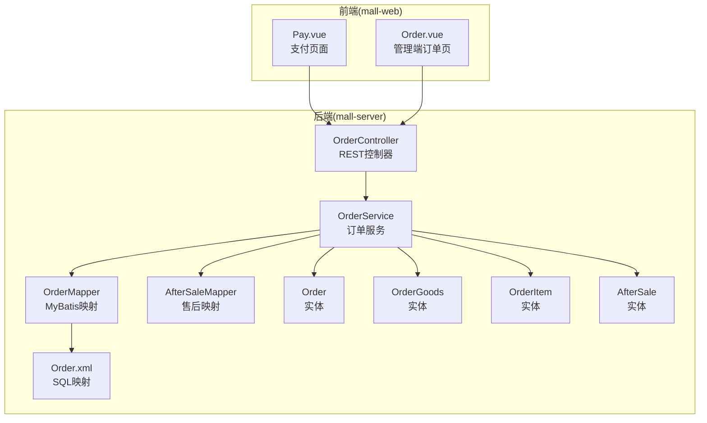
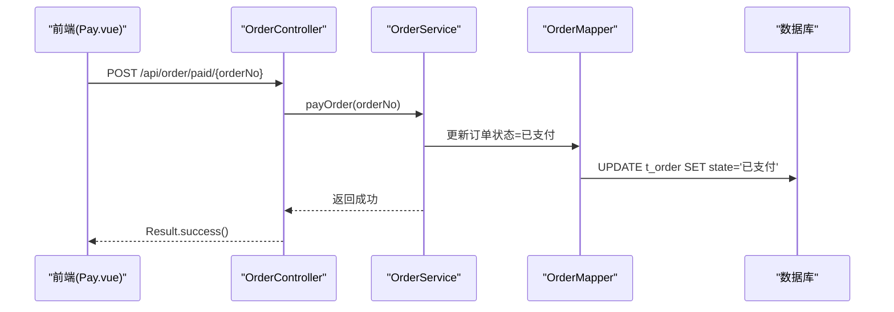
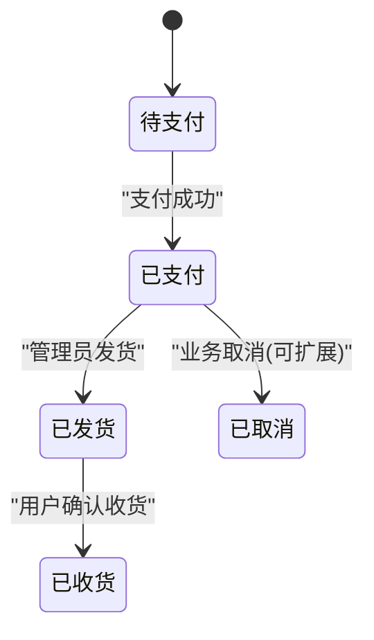
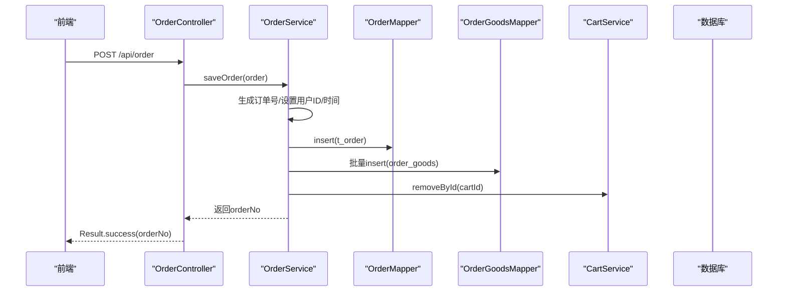
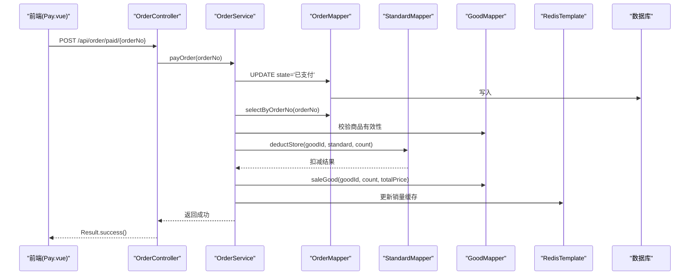
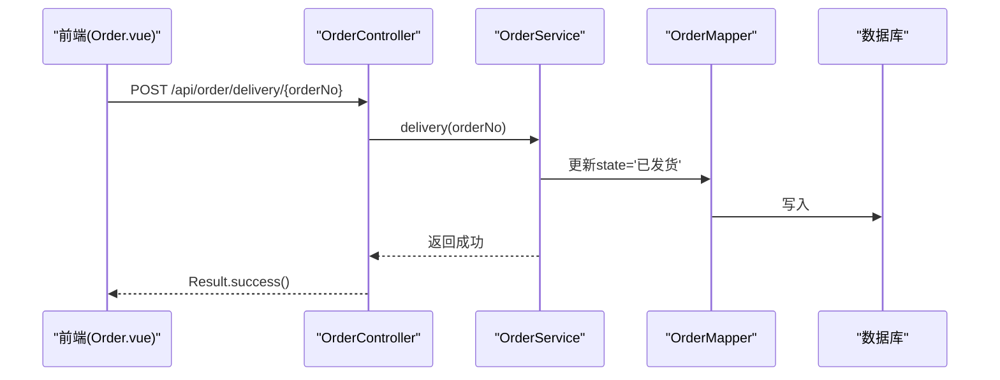
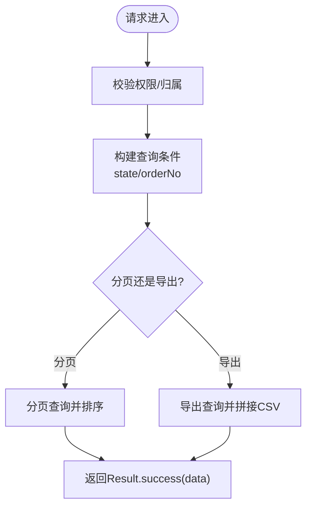
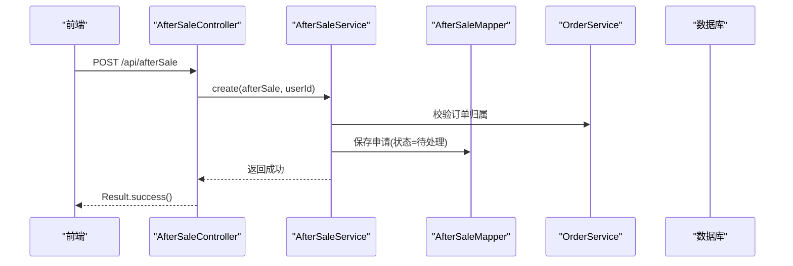
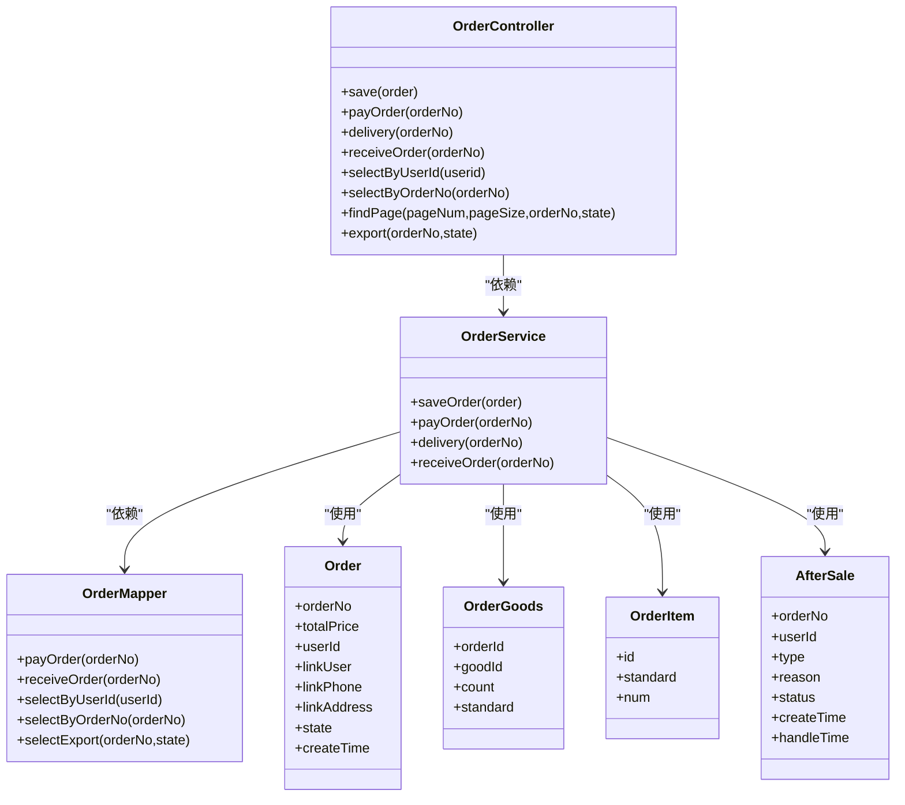

# 订单管理API

<cite>
**本文引用的文件**
- [OrderController.java](file://mall-server/src/main/java/com/rabbiter/em/controller/OrderController.java)
- [OrderService.java](file://mall-server/src/main/java/com/rabbiter/em/service/OrderService.java)
- [OrderMapper.java](file://mall-server/src/main/java/com/rabbiter/em/mapper/OrderMapper.java)
- [Order.java](file://mall-server/src/main/java/com/rabbiter/em/entity/Order.java)
- [OrderGoods.java](file://mall-server/src/main/java/com/rabbiter/em/entity/OrderGoods.java)
- [OrderItem.java](file://mall-server/src/main/java/com/rabbiter/em/entity/OrderItem.java)
- [Order.xml](file://mall-server/src/main/resources/mapper/Order.xml)
- [AfterSaleController.java](file://mall-server/src/main/java/com/rabbiter/em/controller/AfterSaleController.java)
- [AfterSaleService.java](file://mall-server/src/main/java/com/rabbiter/em/service/AfterSaleService.java)
- [AfterSale.java](file://mall-server/src/main/java/com/rabbiter/em/entity/AfterSale.java)
- [AfterSaleMapper.java](file://mall-server/src/main/java/com/rabbiter/em/mapper/AfterSaleMapper.java)
- [Constants.java](file://mall-server/src/main/java/com/rabbiter/em/constants/Constants.java)
- [Pay.vue](file://mall-web/src/views/front/order/Pay.vue)
- [Order.vue](file://mall-web/src/views/manage/Order.vue)
- [OrderServiceTest.java](file://mall-server/src/test/java/com/rabbiter/em/service/OrderServiceTest.java)
</cite>

## 目录
1. [简介](#简介)
2. [项目结构](#项目结构)
3. [核心组件](#核心组件)
4. [架构总览](#架构总览)
5. [详细组件分析](#详细组件分析)
6. [依赖关系分析](#依赖关系分析)
7. [性能考虑](#性能考虑)
8. [故障排查指南](#故障排查指南)
9. [结论](#结论)
10. [附录](#附录)

## 简介
本文件面向订单管理API的使用者与维护者，系统化梳理订单生命周期、状态管理、商品关联与价格计算、收货地址管理、查询与导出、售后处理、支付流程与第三方集成、状态通知以及数据安全与完整性保障。文档基于实际代码实现进行说明，确保技术细节与接口行为一致。

## 项目结构
后端采用Spring Boot + MyBatis-Plus架构，订单模块位于mall-server工程中，前端页面位于mall-web工程中。订单相关的核心文件分布如下：
- 控制器层：OrderController、AfterSaleController
- 服务层：OrderService、AfterSaleService
- 数据访问层：OrderMapper、AfterSaleMapper（XML映射）
- 实体模型：Order、OrderGoods、OrderItem、AfterSale
- 前端页面：Pay.vue（支付）、Order.vue（管理端订单列表）

图表来源
- [OrderController.java:27-195](file://mall-server/src/main/java/com/rabbiter/em/controller/OrderController.java#L27-L195)
- [OrderService.java:34-183](file://mall-server/src/main/java/com/rabbiter/em/service/OrderService.java#L34-L183)
- [OrderMapper.java:12-25](file://mall-server/src/main/java/com/rabbiter/em/mapper/OrderMapper.java#L12-L25)
- [Order.xml:3-48](file://mall-server/src/main/resources/mapper/Order.xml#L3-L48)
- [Order.java:11-171](file://mall-server/src/main/java/com/rabbiter/em/entity/Order.java#L11-L171)
- [OrderGoods.java:8-86](file://mall-server/src/main/java/com/rabbiter/em/entity/OrderGoods.java#L8-L86)
- [OrderItem.java:6-53](file://mall-server/src/main/java/com/rabbiter/em/entity/OrderItem.java#L6-L53)
- [AfterSale.java:7-89](file://mall-server/src/main/java/com/rabbiter/em/entity/AfterSale.java#L7-L89)
- [Pay.vue:1-325](file://mall-web/src/views/front/order/Pay.vue#L1-L325)
- [Order.vue:160-298](file://mall-web/src/views/manage/Order.vue#L160-L298)

章节来源
- [OrderController.java:27-195](file://mall-server/src/main/java/com/rabbiter/em/controller/OrderController.java#L27-L195)
- [OrderService.java:34-183](file://mall-server/src/main/java/com/rabbiter/em/service/OrderService.java#L34-L183)
- [OrderMapper.java:12-25](file://mall-server/src/main/java/com/rabbiter/em/mapper/OrderMapper.java#L12-L25)
- [Order.xml:3-48](file://mall-server/src/main/resources/mapper/Order.xml#L3-L48)
- [Order.java:11-171](file://mall-server/src/main/java/com/rabbiter/em/entity/Order.java#L11-L171)
- [OrderGoods.java:8-86](file://mall-server/src/main/java/com/rabbiter/em/entity/OrderGoods.java#L8-L86)
- [OrderItem.java:6-53](file://mall-server/src/main/java/com/rabbiter/em/entity/OrderItem.java#L6-L53)
- [AfterSale.java:7-89](file://mall-server/src/main/java/com/rabbiter/em/entity/AfterSale.java#L7-L89)
- [Pay.vue:1-325](file://mall-web/src/views/front/order/Pay.vue#L1-L325)
- [Order.vue:160-298](file://mall-web/src/views/manage/Order.vue#L160-L298)

## 核心组件
- 订单控制器：提供订单创建、支付、发货、收货、查询、分页、导出、删除等接口；内置权限控制与订单归属校验。
- 订单服务：封装订单业务逻辑，包括订单号生成、订单持久化、支付处理（库存扣减、销量与销售额更新、Redis缓存同步）、发货与收货状态变更。
- 订单映射：定义订单状态更新SQL与多表查询SQL，支持按用户、订单号、导出统计等场景。
- 实体模型：Order（订单主表）、OrderGoods（订单商品关联表）、OrderItem（前端下单时的商品集合载体）、AfterSale（售后申请）。
- 前端页面：支付页面展示支付方式并调用后端支付接口；管理端订单页支持分页、筛选、发货操作。

章节来源
- [OrderController.java:27-195](file://mall-server/src/main/java/com/rabbiter/em/controller/OrderController.java#L27-L195)
- [OrderService.java:34-183](file://mall-server/src/main/java/com/rabbiter/em/service/OrderService.java#L34-L183)
- [OrderMapper.java:12-25](file://mall-server/src/main/java/com/rabbiter/em/mapper/OrderMapper.java#L12-L25)
- [Order.java:11-171](file://mall-server/src/main/java/com/rabbiter/em/entity/Order.java#L11-L171)
- [OrderGoods.java:8-86](file://mall-server/src/main/java/com/rabbiter/em/entity/OrderGoods.java#L8-L86)
- [OrderItem.java:6-53](file://mall-server/src/main/java/com/rabbiter/em/entity/OrderItem.java#L6-L53)
- [AfterSale.java:7-89](file://mall-server/src/main/java/com/rabbiter/em/entity/AfterSale.java#L7-L89)
- [Pay.vue:1-325](file://mall-web/src/views/front/order/Pay.vue#L1-L325)
- [Order.vue:160-298](file://mall-web/src/views/manage/Order.vue#L160-L298)

## 架构总览
订单管理API遵循经典的分层架构：
- 表现层：OrderController暴露REST接口，统一返回Result包装。
- 领域层：OrderService编排业务，事务边界明确。
- 数据访问层：OrderMapper/AfterSaleMapper通过XML映射SQL，实现复杂查询与状态更新。
- 模型层：Order、OrderGoods、OrderItem、AfterSale实体映射数据库表。
- 前端交互：Pay.vue负责支付流程触发；Order.vue负责后台订单管理与发货。

图表来源
- [OrderController.java:146-151](file://mall-server/src/main/java/com/rabbiter/em/controller/OrderController.java#L146-L151)
- [OrderService.java:96-149](file://mall-server/src/main/java/com/rabbiter/em/service/OrderService.java#L96-L149)
- [OrderMapper.java:13-14](file://mall-server/src/main/java/com/rabbiter/em/mapper/OrderMapper.java#L13-L14)

## 详细组件分析

### 订单生命周期与状态管理
- 待支付：创建订单后默认状态为待支付（由前端下单流程决定，数据库字段初始值由业务逻辑设置）。
- 已支付：调用支付接口后，订单状态更新为“已支付”，同时进行库存扣减、销量与销售额更新、Redis缓存同步。
- 已发货：管理员在后台调用发货接口，订单状态更新为“已发货”。
- 已收货：用户确认收货接口调用后，订单状态更新为“已收货”。
- 已取消：当前代码未提供显式的“取消”接口；可通过删除订单或扩展业务逻辑实现。

图表来源
- [OrderService.java:176-181](file://mall-server/src/main/java/com/rabbiter/em/service/OrderService.java#L176-L181)
- [OrderMapper.java:19-20](file://mall-server/src/main/java/com/rabbiter/em/mapper/OrderMapper.java#L19-L20)

章节来源
- [OrderService.java:96-149](file://mall-server/src/main/java/com/rabbiter/em/service/OrderService.java#L96-L149)
- [OrderMapper.java:13-20](file://mall-server/src/main/java/com/rabbiter/em/mapper/OrderMapper.java#L13-L20)

### 订单创建与商品关联
- 订单创建接口接收Order对象，其中包含商品集合JSON字符串（OrderItem数组）与购物车ID。
- 服务层生成唯一订单号（时间戳+6位随机数），设置下单用户ID与创建时间，插入订单主表。
- 解析goods JSON，逐条写入订单商品关联表（order_goods），并根据购物车ID清理对应购物车项。
- 订单金额由前端计算后传入，服务层不做二次计算。

图表来源
- [OrderController.java:134-139](file://mall-server/src/main/java/com/rabbiter/em/controller/OrderController.java#L134-L139)
- [OrderService.java:58-88](file://mall-server/src/main/java/com/rabbiter/em/service/OrderService.java#L58-L88)

章节来源
- [OrderController.java:134-139](file://mall-server/src/main/java/com/rabbiter/em/controller/OrderController.java#L134-L139)
- [OrderService.java:58-88](file://mall-server/src/main/java/com/rabbiter/em/service/OrderService.java#L58-L88)
- [Order.java:11-171](file://mall-server/src/main/java/com/rabbiter/em/entity/Order.java#L11-L171)
- [OrderGoods.java:8-86](file://mall-server/src/main/java/com/rabbiter/em/entity/OrderGoods.java#L8-L86)
- [OrderItem.java:6-53](file://mall-server/src/main/java/com/rabbiter/em/entity/OrderItem.java#L6-L53)

### 支付处理与第三方集成
- 支付接口：POST /api/order/paid/{orderNo}，仅订单归属者或管理员可调用。
- 服务层执行以下步骤：
  1) 将订单状态更新为“已支付”；
  2) 查询订单详情（含商品ID、规格、数量）；
  3) 校验商品有效性（存在且未下架）；
  4) 扣减对应规格库存；
  5) 增加商品销量与销售额；
  6) 同步更新Redis缓存中的销量。
- 第三方支付：前端页面提供“微信支付”“支付宝”两种支付方式选择，但具体支付回调与资金结算逻辑未在后端体现，需在生产环境补充支付回调与对账。

图表来源
- [OrderController.java:146-151](file://mall-server/src/main/java/com/rabbiter/em/controller/OrderController.java#L146-L151)
- [OrderService.java:96-149](file://mall-server/src/main/java/com/rabbiter/em/service/OrderService.java#L96-L149)
- [OrderMapper.java:13-14](file://mall-server/src/main/java/com/rabbiter/em/mapper/OrderMapper.java#L13-L14)
- [Order.xml:19-24](file://mall-server/src/main/resources/mapper/Order.xml#L19-L24)

章节来源
- [OrderController.java:146-151](file://mall-server/src/main/java/com/rabbiter/em/controller/OrderController.java#L146-L151)
- [OrderService.java:96-149](file://mall-server/src/main/java/com/rabbiter/em/service/OrderService.java#L96-L149)
- [OrderMapper.java:13-14](file://mall-server/src/main/java/com/rabbiter/em/mapper/OrderMapper.java#L13-L14)
- [Order.xml:19-24](file://mall-server/src/main/resources/mapper/Order.xml#L19-L24)
- [Pay.vue:32-42](file://mall-web/src/views/front/order/Pay.vue#L32-L42)

### 发货与收货
- 发货：管理员调用POST /api/order/delivery/{orderNo}，服务层将状态更新为“已发货”。
- 收货：用户调用POST /api/order/received/{orderNo}，服务层将状态更新为“已收货”。

图表来源
- [OrderController.java:159-164](file://mall-server/src/main/java/com/rabbiter/em/controller/OrderController.java#L159-L164)
- [OrderService.java:176-181](file://mall-server/src/main/java/com/rabbiter/em/service/OrderService.java#L176-L181)

章节来源
- [OrderController.java:159-164](file://mall-server/src/main/java/com/rabbiter/em/controller/OrderController.java#L159-L164)
- [OrderService.java:168-181](file://mall-server/src/main/java/com/rabbiter/em/service/OrderService.java#L168-L181)

### 订单查询与导出
- 用户维度查询：GET /api/order/userid/{userid}，仅本人或管理员可访问。
- 订单号查询：GET /api/order/orderNo/{orderNo}，进行订单归属校验。
- 管理员分页查询：GET /api/order/page?pageNum=&pageSize=&orderNo=&state=，过滤“待付款”状态，默认按创建时间倒序。
- 导出CSV：GET /api/order/export?orderNo=&state=，生成包含订单编号、用户名、商品名称、规格、金额、状态、创建时间的表格。

图表来源
- [OrderController.java:50-89](file://mall-server/src/main/java/com/rabbiter/em/controller/OrderController.java#L50-L89)
- [OrderController.java:91-117](file://mall-server/src/main/java/com/rabbiter/em/controller/OrderController.java#L91-L117)
- [Order.xml:26-47](file://mall-server/src/main/resources/mapper/Order.xml#L26-L47)

章节来源
- [OrderController.java:50-89](file://mall-server/src/main/java/com/rabbiter/em/controller/OrderController.java#L50-L89)
- [OrderController.java:91-117](file://mall-server/src/main/java/com/rabbiter/em/controller/OrderController.java#L91-L117)
- [Order.xml:26-47](file://mall-server/src/main/resources/mapper/Order.xml#L26-L47)

### 收货地址管理与选择机制
- 订单实体包含联系人、电话、地址字段，下单时由前端传入。
- 地址选择机制：前端页面提供地址管理与选择能力，下单时将选中地址写入订单实体提交至后端。

章节来源
- [Order.java:34-47](file://mall-server/src/main/java/com/rabbiter/em/entity/Order.java#L34-L47)
- [Pay.vue:1-325](file://mall-web/src/views/front/order/Pay.vue#L1-L325)

### 售后处理接口
- 申请售后：POST /api/afterSale，需登录用户，校验订单归属与重复申请。
- 我的售后分页：GET /api/afterSale/mine/page?pageNum=&pageSize=。
- 管理员售后分页：GET /api/afterSale/page?pageNum=&pageSize=&status=&type=&orderNo=。
- 售后详情：GET /api/afterSale/{id}，校验权限。
- 处理售后：PUT /api/afterSale/handle，更新状态与处理时间。

图表来源
- [AfterSaleController.java:23-28](file://mall-server/src/main/java/com/rabbiter/em/controller/AfterSaleController.java#L23-L28)
- [AfterSaleService.java:25-65](file://mall-server/src/main/java/com/rabbiter/em/service/AfterSaleService.java#L25-L65)

章节来源
- [AfterSaleController.java:15-66](file://mall-server/src/main/java/com/rabbiter/em/controller/AfterSaleController.java#L15-L66)
- [AfterSaleService.java:19-106](file://mall-server/src/main/java/com/rabbiter/em/service/AfterSaleService.java#L19-L106)
- [AfterSale.java:7-89](file://mall-server/src/main/java/com/rabbiter/em/entity/AfterSale.java#L7-L89)

### 订单状态变更通知机制
- 当前代码未实现专门的状态变更通知（如站内信、短信、邮件）。可在OrderService的状态变更点（支付、发货、收货）扩展消息队列或事件发布机制，以异步通知用户。

章节来源
- [OrderService.java:96-149](file://mall-server/src/main/java/com/rabbiter/em/service/OrderService.java#L96-L149)
- [OrderService.java:176-181](file://mall-server/src/main/java/com/rabbiter/em/service/OrderService.java#L176-L181)

### 数据安全性与完整性保障
- 权限控制：所有接口通过注解进行权限校验，订单归属校验防止越权访问。
- 异常处理：统一常量定义错误码，服务层抛出业务异常，控制器捕获并返回Result.error。
- 事务一致性：订单创建与支付流程使用@Transactional，确保数据库一致性。
- 参数校验：服务层对订单号、商品ID、规格、数量等进行严格校验，避免脏数据入库。

章节来源
- [OrderController.java:34-48](file://mall-server/src/main/java/com/rabbiter/em/controller/OrderController.java#L34-L48)
- [OrderController.java:50-57](file://mall-server/src/main/java/com/rabbiter/em/controller/OrderController.java#L50-L57)
- [OrderService.java:58-88](file://mall-server/src/main/java/com/rabbiter/em/service/OrderService.java#L58-L88)
- [OrderService.java:96-149](file://mall-server/src/main/java/com/rabbiter/em/service/OrderService.java#L96-L149)
- [Constants.java:5-15](file://mall-server/src/main/java/com/rabbiter/em/constants/Constants.java#L5-L15)

## 依赖关系分析

图表来源
- [OrderController.java:27-195](file://mall-server/src/main/java/com/rabbiter/em/controller/OrderController.java#L27-L195)
- [OrderService.java:34-183](file://mall-server/src/main/java/com/rabbiter/em/service/OrderService.java#L34-L183)
- [OrderMapper.java:12-25](file://mall-server/src/main/java/com/rabbiter/em/mapper/OrderMapper.java#L12-L25)
- [Order.java:11-171](file://mall-server/src/main/java/com/rabbiter/em/entity/Order.java#L11-L171)
- [OrderGoods.java:8-86](file://mall-server/src/main/java/com/rabbiter/em/entity/OrderGoods.java#L8-L86)
- [OrderItem.java:6-53](file://mall-server/src/main/java/com/rabbiter/em/entity/OrderItem.java#L6-L53)
- [AfterSale.java:7-89](file://mall-server/src/main/java/com/rabbiter/em/entity/AfterSale.java#L7-L89)

章节来源
- [OrderController.java:27-195](file://mall-server/src/main/java/com/rabbiter/em/controller/OrderController.java#L27-L195)
- [OrderService.java:34-183](file://mall-server/src/main/java/com/rabbiter/em/service/OrderService.java#L34-L183)
- [OrderMapper.java:12-25](file://mall-server/src/main/java/com/rabbiter/em/mapper/OrderMapper.java#L12-L25)
- [Order.java:11-171](file://mall-server/src/main/java/com/rabbiter/em/entity/Order.java#L11-L171)
- [OrderGoods.java:8-86](file://mall-server/src/main/java/com/rabbiter/em/entity/OrderGoods.java#L8-L86)
- [OrderItem.java:6-53](file://mall-server/src/main/java/com/rabbiter/em/entity/OrderItem.java#L6-L53)
- [AfterSale.java:7-89](file://mall-server/src/main/java/com/rabbiter/em/entity/AfterSale.java#L7-L89)

## 性能考虑
- 分页查询：管理端分页接口默认按创建时间倒序，建议在state与order_no上建立索引以提升筛选性能。
- 导出性能：导出SQL涉及多表连接，建议在t_order.state与t_order.order_no建立合适索引，并限制导出范围。
- 缓存策略：支付成功后同步更新Redis销量缓存，建议结合热点商品做更细粒度的缓存失效策略。
- 事务边界：支付流程使用@Transactional，注意长事务可能带来的锁竞争，建议优化库存扣减与销量更新的原子性。

## 故障排查指南
- 无权访问订单：检查Token与订单归属校验逻辑，确保仅本人或管理员可访问。
- 支付失败：核对库存扣减、商品有效性校验与Redis缓存更新是否成功。
- 导出为空：确认state与orderNo筛选条件是否正确，以及数据库中是否存在非“待付款”的订单。
- 售后申请重复：系统会阻止同一订单同一用户存在“待处理”状态的申请，请引导用户先处理旧申请。

章节来源
- [OrderController.java:34-48](file://mall-server/src/main/java/com/rabbiter/em/controller/OrderController.java#L34-L48)
- [OrderService.java:96-149](file://mall-server/src/main/java/com/rabbiter/em/service/OrderService.java#L96-L149)
- [AfterSaleService.java:50-57](file://mall-server/src/main/java/com/rabbiter/em/service/AfterSaleService.java#L50-L57)
- [Order.xml:26-47](file://mall-server/src/main/resources/mapper/Order.xml#L26-L47)

## 结论
订单管理API提供了完整的订单生命周期管理能力，覆盖创建、支付、发货、收货、查询与导出，并通过权限校验与事务保证数据一致性。支付流程与第三方集成在前端完成，后端负责状态更新与库存、销量、缓存同步。建议后续增强状态通知机制与订单取消流程，并完善支付回调与对账逻辑以满足生产需求。

## 附录
- 接口清单与示例路径参考：
  - 创建订单：[OrderController.java:134-139](file://mall-server/src/main/java/com/rabbiter/em/controller/OrderController.java#L134-L139)
  - 支付订单：[OrderController.java:146-151](file://mall-server/src/main/java/com/rabbiter/em/controller/OrderController.java#L146-L151)
  - 发货订单：[OrderController.java:159-164](file://mall-server/src/main/java/com/rabbiter/em/controller/OrderController.java#L159-L164)
  - 确认收货：[OrderController.java:166-175](file://mall-server/src/main/java/com/rabbiter/em/controller/OrderController.java#L166-L175)
  - 分页查询：[OrderController.java:72-89](file://mall-server/src/main/java/com/rabbiter/em/controller/OrderController.java#L72-L89)
  - 导出CSV：[OrderController.java:91-117](file://mall-server/src/main/java/com/rabbiter/em/controller/OrderController.java#L91-L117)
  - 售后申请：[AfterSaleController.java:23-28](file://mall-server/src/main/java/com/rabbiter/em/controller/AfterSaleController.java#L23-L28)
  - 售后处理：[AfterSaleController.java:61-65](file://mall-server/src/main/java/com/rabbiter/em/controller/AfterSaleController.java#L61-L65)

章节来源
- [OrderController.java:134-175](file://mall-server/src/main/java/com/rabbiter/em/controller/OrderController.java#L134-L175)
- [OrderController.java:72-117](file://mall-server/src/main/java/com/rabbiter/em/controller/OrderController.java#L72-L117)
- [AfterSaleController.java:23-65](file://mall-server/src/main/java/com/rabbiter/em/controller/AfterSaleController.java#L23-L65)