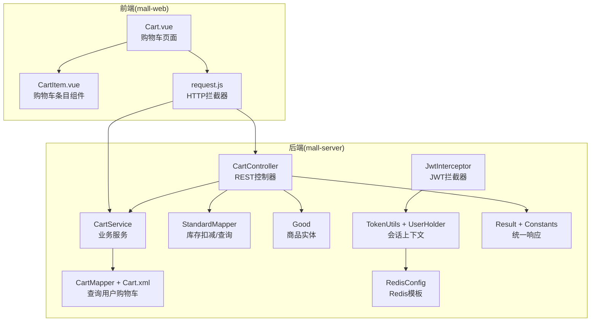
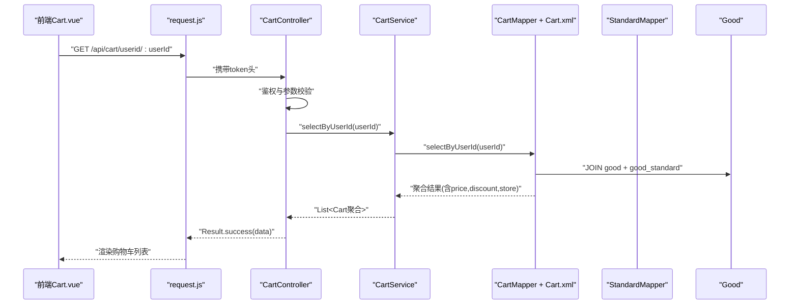
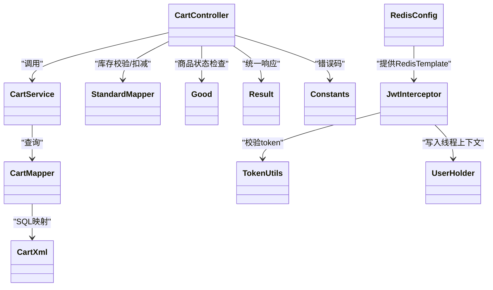

# 购物车API

<cite>
**本文引用的文件**
- [CartController.java](file://mall-server/src/main/java/com/rabbiter/em/controller/CartController.java)
- [CartService.java](file://mall-server/src/main/java/com/rabbiter/em/service/CartService.java)
- [CartMapper.java](file://mall-server/src/main/java/com/rabbiter/em/mapper/CartMapper.java)
- [Cart.xml](file://mall-server/src/main/resources/mapper/Cart.xml)
- [Cart.java](file://mall-server/src/main/java/com/rabbiter/em/entity/Cart.java)
- [StandardMapper.java](file://mall-server/src/main/java/com/rabbiter/em/mapper/StandardMapper.java)
- [Good.java](file://mall-server/src/main/java/com/rabbiter/em/entity/Good.java)
- [JwtInterceptor.java](file://mall-server/src/main/java/com/rabbiter/em/interceptor/JwtInterceptor.java)
- [TokenUtils.java](file://mall-server/src/main/java/com/rabbiter/em/utils/TokenUtils.java)
- [UserHolder.java](file://mall-server/src/main/java/com/rabbiter/em/utils/UserHolder.java)
- [RedisConfig.java](file://mall-server/src/main/java/com/rabbiter/em/config/RedisConfig.java)
- [Result.java](file://mall-server/src/main/java/com/rabbiter/em/common/Result.java)
- [Constants.java](file://mall-server/src/main/java/com/rabbiter/em/constants/Constants.java)
- [Cart.vue](file://mall-web/src/views/front/good/Cart.vue)
- [CartItem.vue](file://mall-web/src/components/CartItem.vue)
- [request.js](file://mall-web/src/utils/request.js)
- [OrderService.java](file://mall-server/src/main/java/com/rabbiter/em/service/OrderService.java)
</cite>

## 目录
1. [简介](#简介)
2. [项目结构](#项目结构)
3. [核心组件](#核心组件)
4. [架构总览](#架构总览)
5. [详细组件分析](#详细组件分析)
6. [依赖分析](#依赖分析)
7. [性能考虑](#性能考虑)
8. [故障排查指南](#故障排查指南)
9. [结论](#结论)
10. [附录](#附录)

## 简介
本文件面向购物车API的使用与维护，覆盖以下主题：
- 购物车的增删改查接口与业务规则
- 购物车数据的持久化与缓存策略
- 购物车与用户会话的关联机制
- 购物车商品的计算逻辑（单价、折扣、小计）
- 购物车清理与过期处理机制
- 完整的API调用示例（含边界与错误场景）
- 购物车同步与并发控制策略

## 项目结构
后端采用Spring Boot + MyBatis-Plus，购物车模块位于mall-server中；前端Vue应用位于mall-web中。

图表来源
- [CartController.java:1-110](file://mall-server/src/main/java/com/rabbiter/em/controller/CartController.java#L1-L110)
- [CartService.java:1-22](file://mall-server/src/main/java/com/rabbiter/em/service/CartService.java#L1-L22)
- [CartMapper.java:1-15](file://mall-server/src/main/java/com/rabbiter/em/mapper/CartMapper.java#L1-L15)
- [Cart.xml:1-27](file://mall-server/src/main/resources/mapper/Cart.xml#L1-L27)
- [StandardMapper.java:1-16](file://mall-server/src/main/java/com/rabbiter/em/mapper/StandardMapper.java#L1-L16)
- [Good.java:1-232](file://mall-server/src/main/java/com/rabbiter/em/entity/Good.java#L1-L232)
- [JwtInterceptor.java:1-100](file://mall-server/src/main/java/com/rabbiter/em/interceptor/JwtInterceptor.java#L1-L100)
- [TokenUtils.java:1-78](file://mall-server/src/main/java/com/rabbiter/em/utils/TokenUtils.java#L1-L78)
- [UserHolder.java:1-20](file://mall-server/src/main/java/com/rabbiter/em/utils/UserHolder.java#L1-L20)
- [RedisConfig.java:1-38](file://mall-server/src/main/java/com/rabbiter/em/config/RedisConfig.java#L1-L38)
- [Result.java:1-66](file://mall-server/src/main/java/com/rabbiter/em/common/Result.java#L1-L66)
- [Constants.java:1-16](file://mall-server/src/main/java/com/rabbiter/em/constants/Constants.java#L1-L16)
- [Cart.vue:1-165](file://mall-web/src/views/front/good/Cart.vue#L1-L165)
- [CartItem.vue:1-329](file://mall-web/src/components/CartItem.vue#L1-L329)
- [request.js:1-55](file://mall-web/src/utils/request.js#L1-L55)

章节来源
- [CartController.java:1-110](file://mall-server/src/main/java/com/rabbiter/em/controller/CartController.java#L1-L110)
- [CartService.java:1-22](file://mall-server/src/main/java/com/rabbiter/em/service/CartService.java#L1-L22)
- [CartMapper.java:1-15](file://mall-server/src/main/java/com/rabbiter/em/mapper/CartMapper.java#L1-L15)
- [Cart.xml:1-27](file://mall-server/src/main/resources/mapper/Cart.xml#L1-L27)
- [StandardMapper.java:1-16](file://mall-server/src/main/java/com/rabbiter/em/mapper/StandardMapper.java#L1-L16)
- [Good.java:1-232](file://mall-server/src/main/java/com/rabbiter/em/entity/Good.java#L1-L232)
- [JwtInterceptor.java:1-100](file://mall-server/src/main/java/com/rabbiter/em/interceptor/JwtInterceptor.java#L1-L100)
- [TokenUtils.java:1-78](file://mall-server/src/main/java/com/rabbiter/em/utils/TokenUtils.java#L1-L78)
- [UserHolder.java:1-20](file://mall-server/src/main/java/com/rabbiter/em/utils/UserHolder.java#L1-L20)
- [RedisConfig.java:1-38](file://mall-server/src/main/java/com/rabbiter/em/config/RedisConfig.java#L1-L38)
- [Result.java:1-66](file://mall-server/src/main/java/com/rabbiter/em/common/Result.java#L1-L66)
- [Constants.java:1-16](file://mall-server/src/main/java/com/rabbiter/em/constants/Constants.java#L1-L16)
- [Cart.vue:1-165](file://mall-web/src/views/front/good/Cart.vue#L1-L165)
- [CartItem.vue:1-329](file://mall-web/src/components/CartItem.vue#L1-L329)
- [request.js:1-55](file://mall-web/src/utils/request.js#L1-L55)

## 核心组件
- 控制器层：CartController 提供REST接口，负责鉴权、参数校验、调用服务层与返回统一响应。
- 服务层：CartService 继承MyBatis-Plus通用实现，封装按用户查询等业务。
- 数据访问层：CartMapper + Cart.xml 实现按用户聚合查询购物车明细（含价格、折扣、库存）。
- 实体模型：Cart 表示购物车项；Good 表示商品（含折扣、状态等）。
- 库存管理：StandardMapper 提供库存扣减与查询。
- 会话与拦截：JwtInterceptor + TokenUtils + UserHolder 将用户注入线程上下文；RedisConfig 提供Redis模板。
- 前端交互：Cart.vue 展示购物车列表；CartItem.vue 展示单个条目并计算小计；request.js 统一设置token头。

章节来源
- [CartController.java:1-110](file://mall-server/src/main/java/com/rabbiter/em/controller/CartController.java#L1-L110)
- [CartService.java:1-22](file://mall-server/src/main/java/com/rabbiter/em/service/CartService.java#L1-L22)
- [CartMapper.java:1-15](file://mall-server/src/main/java/com/rabbiter/em/mapper/CartMapper.java#L1-L15)
- [Cart.xml:1-27](file://mall-server/src/main/resources/mapper/Cart.xml#L1-L27)
- [Cart.java:1-97](file://mall-server/src/main/java/com/rabbiter/em/entity/Cart.java#L1-L97)
- [Good.java:1-232](file://mall-server/src/main/java/com/rabbiter/em/entity/Good.java#L1-L232)
- [StandardMapper.java:1-16](file://mall-server/src/main/java/com/rabbiter/em/mapper/StandardMapper.java#L1-L16)
- [JwtInterceptor.java:1-100](file://mall-server/src/main/java/com/rabbiter/em/interceptor/JwtInterceptor.java#L1-L100)
- [TokenUtils.java:1-78](file://mall-server/src/main/java/com/rabbiter/em/utils/TokenUtils.java#L1-L78)
- [UserHolder.java:1-20](file://mall-server/src/main/java/com/rabbiter/em/utils/UserHolder.java#L1-L20)
- [RedisConfig.java:1-38](file://mall-server/src/main/java/com/rabbiter/em/config/RedisConfig.java#L1-L38)
- [Result.java:1-66](file://mall-server/src/main/java/com/rabbiter/em/common/Result.java#L1-L66)

## 架构总览
购物车API遵循“控制器-服务-数据访问-实体”的分层设计，结合JWT拦截器完成用户会话绑定与权限控制。

图表来源
- [CartController.java:59-66](file://mall-server/src/main/java/com/rabbiter/em/controller/CartController.java#L59-L66)
- [CartService.java:18-20](file://mall-server/src/main/java/com/rabbiter/em/service/CartService.java#L18-L20)
- [CartMapper.java:12-13](file://mall-server/src/main/java/com/rabbiter/em/mapper/CartMapper.java#L12-L13)
- [Cart.xml:18-25](file://mall-server/src/main/resources/mapper/Cart.xml#L18-L25)
- [StandardMapper.java:13-14](file://mall-server/src/main/java/com/rabbiter/em/mapper/StandardMapper.java#L13-L14)
- [Good.java:1-232](file://mall-server/src/main/java/com/rabbiter/em/entity/Good.java#L1-L232)
- [Cart.vue:49-60](file://mall-web/src/views/front/good/Cart.vue#L49-L60)
- [request.js:13-22](file://mall-web/src/utils/request.js#L13-L22)

## 详细组件分析

### 控制器层：CartController
- 接口职责
  - 查询单个购物车项：需校验归属权（非管理员必须为本人）。
  - 查询全部购物车：管理员权限。
  - 按用户查询购物车：支持跨用户查询但需权限校验。
  - 新增购物车项：自动绑定当前用户，校验商品存在性、状态、规格与库存。
  - 更新购物车项：自动绑定当前用户，支持仅更新数量等字段。
  - 删除购物车项：需校验归属权。
- 权限与会话
  - 使用注解与拦截器确保登录态与权限。
  - 通过TokenUtils.getCurrentUser()获取当前用户，结合UserHolder在线程内传递。
- 统一响应
  - 返回Result.success()/error()，由前端request.js统一处理401等异常。

章节来源
- [CartController.java:20-110](file://mall-server/src/main/java/com/rabbiter/em/controller/CartController.java#L20-L110)
- [JwtInterceptor.java:40-93](file://mall-server/src/main/java/com/rabbiter/em/interceptor/JwtInterceptor.java#L40-L93)
- [TokenUtils.java:42-48](file://mall-server/src/main/java/com/rabbiter/em/utils/TokenUtils.java#L42-L48)
- [UserHolder.java:5-19](file://mall-server/src/main/java/com/rabbiter/em/utils/UserHolder.java#L5-L19)
- [Result.java:11-23](file://mall-server/src/main/java/com/rabbiter/em/common/Result.java#L11-L23)
- [Constants.java:5-11](file://mall-server/src/main/java/com/rabbiter/em/constants/Constants.java#L5-L11)

### 服务层：CartService
- 提供按用户ID查询购物车明细的方法，内部委托CartMapper执行SQL聚合查询。

章节来源
- [CartService.java:12-21](file://mall-server/src/main/java/com/rabbiter/em/service/CartService.java#L12-L21)

### 数据访问层：CartMapper + Cart.xml
- 聚合查询：按用户ID联表查询购物车明细，返回包含商品名称、图片、价格、折扣、库存与创建时间等字段。
- 结果映射：通过resultMap将列名映射到Map键，便于前端消费。

章节来源
- [CartMapper.java:10-14](file://mall-server/src/main/java/com/rabbiter/em/mapper/CartMapper.java#L10-L14)
- [Cart.xml:4-26](file://mall-server/src/main/resources/mapper/Cart.xml#L4-L26)

### 实体模型：Cart 与 Good
- Cart：购物车项，包含数量、规格、用户ID、商品ID、创建时间等。
- Good：商品实体，包含折扣、状态、图片、销量、销售额等。

章节来源
- [Cart.java:1-97](file://mall-server/src/main/java/com/rabbiter/em/entity/Cart.java#L1-L97)
- [Good.java:1-232](file://mall-server/src/main/java/com/rabbiter/em/entity/Good.java#L1-L232)

### 库存与价格：StandardMapper 与 Good
- 库存扣减：在下单成功后执行，确保并发安全。
- 价格与折扣：前端CartItem.vue基于后端返回的price与discount计算realPrice与小计。

章节来源
- [StandardMapper.java:10-14](file://mall-server/src/main/java/com/rabbiter/em/mapper/StandardMapper.java#L10-L14)
- [CartItem.vue:117-124](file://mall-web/src/components/CartItem.vue#L117-L124)

### 会话与拦截：JwtInterceptor + TokenUtils + UserHolder
- 登录态验证：拦截器从请求头读取token，校验有效性并将用户写入ThreadLocal。
- 过期续期：刷新token对应的Redis键TTL。
- 权限判定：TokenUtils.validateAuthority区分管理员权限。

章节来源
- [JwtInterceptor.java:40-93](file://mall-server/src/main/java/com/rabbiter/em/interceptor/JwtInterceptor.java#L40-L93)
- [TokenUtils.java:42-75](file://mall-server/src/main/java/com/rabbiter/em/utils/TokenUtils.java#L42-L75)
- [UserHolder.java:5-19](file://mall-server/src/main/java/com/rabbiter/em/utils/UserHolder.java#L5-L19)

### 前端交互：Cart.vue 与 CartItem.vue
- Cart.vue：进入页面即拉取当前用户ID并查询购物车列表。
- CartItem.vue：展示单价、数量、小计；支持数量编辑与删除；点击支付跳转预订单页。

章节来源
- [Cart.vue:49-60](file://mall-web/src/views/front/good/Cart.vue#L49-L60)
- [CartItem.vue:117-139](file://mall-web/src/components/CartItem.vue#L117-L139)
- [request.js:13-22](file://mall-web/src/utils/request.js#L13-L22)

## 依赖分析
- 控制器依赖服务与工具类，服务依赖Mapper，Mapper依赖XML定义的SQL。
- 前端通过request.js统一设置token头，后端通过拦截器解析并校验。
- RedisConfig提供RedisTemplate，用于会话与缓存场景（本模块主要体现于会话绑定）。

图表来源
- [CartController.java:1-110](file://mall-server/src/main/java/com/rabbiter/em/controller/CartController.java#L1-L110)
- [CartService.java:1-22](file://mall-server/src/main/java/com/rabbiter/em/service/CartService.java#L1-L22)
- [CartMapper.java:1-15](file://mall-server/src/main/java/com/rabbiter/em/mapper/CartMapper.java#L1-L15)
- [Cart.xml:1-27](file://mall-server/src/main/resources/mapper/Cart.xml#L1-L27)
- [StandardMapper.java:1-16](file://mall-server/src/main/java/com/rabbiter/em/mapper/StandardMapper.java#L1-L16)
- [Good.java:1-232](file://mall-server/src/main/java/com/rabbiter/em/entity/Good.java#L1-L232)
- [JwtInterceptor.java:1-100](file://mall-server/src/main/java/com/rabbiter/em/interceptor/JwtInterceptor.java#L1-L100)
- [TokenUtils.java:1-78](file://mall-server/src/main/java/com/rabbiter/em/utils/TokenUtils.java#L1-L78)
- [UserHolder.java:1-20](file://mall-server/src/main/java/com/rabbiter/em/utils/UserHolder.java#L1-L20)
- [RedisConfig.java:1-38](file://mall-server/src/main/java/com/rabbiter/em/config/RedisConfig.java#L1-L38)
- [Result.java:1-66](file://mall-server/src/main/java/com/rabbiter/em/common/Result.java#L1-L66)
- [Constants.java:1-16](file://mall-server/src/main/java/com/rabbiter/em/constants/Constants.java#L1-L16)

## 性能考虑
- SQL聚合：Cart.xml通过一次联表查询返回购物车明细，减少多次往返。
- 字段选择：仅返回前端所需字段，避免冗余数据传输。
- 缓存策略：当前模块主要通过Redis进行会话绑定与续期，未见针对购物车的专用缓存实现；可考虑在高频读场景引入Redis缓存用户购物车集合，注意与下单流程的缓存一致性。
- 并发控制：库存扣减通过数据库层面的条件更新实现，具备原子性；建议在高并发下单时配合分布式锁或队列削峰。

## 故障排查指南
- 401 令牌失效
  - 现象：前端收到401，弹窗提示重新登录。
  - 处理：检查本地token是否存在且未过期；确认拦截器是否正确设置Redis中的用户信息。
- 403 无权限
  - 场景：访问他人购物车或非管理员访问管理接口。
  - 处理：确认当前用户身份与目标资源归属。
- 500 商品已下架/库存不足
  - 场景：新增或更新购物车时触发。
  - 处理：检查商品状态与规格库存；前端限制最大购买数不超过库存。
- 统一响应
  - Result.success/error提供标准返回结构，便于前端统一处理。

章节来源
- [request.js:38-44](file://mall-web/src/utils/request.js#L38-L44)
- [CartController.java:38-44](file://mall-server/src/main/java/com/rabbiter/em/controller/CartController.java#L38-L44)
- [CartController.java:80-87](file://mall-server/src/main/java/com/rabbiter/em/controller/CartController.java#L80-L87)
- [Result.java:11-23](file://mall-server/src/main/java/com/rabbiter/em/common/Result.java#L11-L23)
- [Constants.java:5-11](file://mall-server/src/main/java/com/rabbiter/em/constants/Constants.java#L5-L11)

## 结论
购物车API围绕“登录+权限+参数校验+聚合查询+库存校验”构建，前后端协作清晰。建议后续增强点：
- 引入Redis缓存用户购物车集合，提升读性能并完善一致性策略。
- 在下单流程中完善购物车项清理与库存扣减的事务一致性。
- 前端增加批量操作入口与更完善的错误提示。

## 附录

### API定义与调用示例

- 获取购物车列表（按用户）
  - 方法与路径：GET /api/cart/userid/{userId}
  - 请求头：token
  - 权限：登录用户；管理员可查询任意用户
  - 响应：Result.success(聚合后的购物车列表)
  - 示例：前端进入页面后自动拉取
    - [Cart.vue:50-58](file://mall-web/src/views/front/good/Cart.vue#L50-L58)
    - [request.js:13-22](file://mall-web/src/utils/request.js#L13-L22)

- 新增购物车项
  - 方法与路径：POST /api/cart
  - 请求体：Cart（包含goodId、count、standard），后端自动绑定userId
  - 校验：商品存在、状态有效、规格存在、库存充足
  - 响应：Result.success
  - 示例：添加商品至购物车
    - [CartController.java:68-91](file://mall-server/src/main/java/com/rabbiter/em/controller/CartController.java#L68-L91)
    - [StandardMapper.java:13-14](file://mall-server/src/main/java/com/rabbiter/em/mapper/StandardMapper.java#L13-L14)

- 更新购物车项
  - 方法与路径：PUT /api/cart
  - 请求体：Cart（包含id与待更新字段），后端自动绑定userId
  - 校验：若提供id则校验归属权
  - 响应：Result.success
  - 示例：修改数量
    - [CartController.java:93-101](file://mall-server/src/main/java/com/rabbiter/em/controller/CartController.java#L93-L101)

- 删除购物车项
  - 方法与路径：DELETE /api/cart/{id}
  - 校验：归属权校验（管理员例外）
  - 响应：Result.success
  - 示例：移除条目
    - [CartController.java:103-108](file://mall-server/src/main/java/com/rabbiter/em/controller/CartController.java#L103-L108)

- 查询单个购物车项
  - 方法与路径：GET /api/cart/{id}
  - 校验：归属权校验
  - 响应：Result.success(Cart)
  - 示例：调试或定位
    - [CartController.java:46-50](file://mall-server/src/main/java/com/rabbiter/em/controller/CartController.java#L46-L50)

- 管理员查询全部购物车
  - 方法与路径：GET /api/cart
  - 权限：管理员
  - 响应：Result.success(List<Cart>)
  - 示例：后台统计
    - [CartController.java:52-57](file://mall-server/src/main/java/com/rabbiter/em/controller/CartController.java#L52-L57)

### 购物车计算逻辑
- 单价：price（来自聚合查询）
- 折扣：discount（来自聚合查询）
- 实际单价：realPrice = price × discount
- 小计：totalPrice = realPrice × 数量
- 前端计算位置参考
  - [CartItem.vue:117-124](file://mall-web/src/components/CartItem.vue#L117-L124)

### 购物车清理与过期处理
- 清理机制：下单成功后，服务端清理对应购物车项
  - [OrderService.java:85-87](file://mall-server/src/main/java/com/rabbiter/em/service/OrderService.java#L85-L87)
- 过期处理：当前模块未实现购物车项过期清理；可在Redis中为用户购物车集合设置TTL并在读取时重建，或在定时任务中清理长时间未更新的购物车项。

### 并发控制策略
- 库存扣减：使用数据库条件更新，保证store ≥ num时才扣减
  - [StandardMapper.java:10](file://mall-server/src/main/java/com/rabbiter/em/mapper/StandardMapper.java#L10)
- 下单事务：下单流程在事务中执行，确保库存、销量、销售额与缓存的一致性
  - [OrderService.java:96-149](file://mall-server/src/main/java/com/rabbiter/em/service/OrderService.java#L96-L149)

### 数据持久化与缓存策略
- 持久化：购物车数据存储于MySQL cart表；聚合查询通过Cart.xml联表返回。
  - [Cart.xml:18-25](file://mall-server/src/main/resources/mapper/Cart.xml#L18-L25)
- 缓存：当前模块通过Redis进行会话绑定与续期；建议引入用户购物车集合缓存并配合失效策略。
  - [RedisConfig.java:14-35](file://mall-server/src/main/java/com/rabbiter/em/config/RedisConfig.java#L14-L35)
  - [JwtInterceptor.java:69-80](file://mall-server/src/main/java/com/rabbiter/em/interceptor/JwtInterceptor.java#L69-L80)