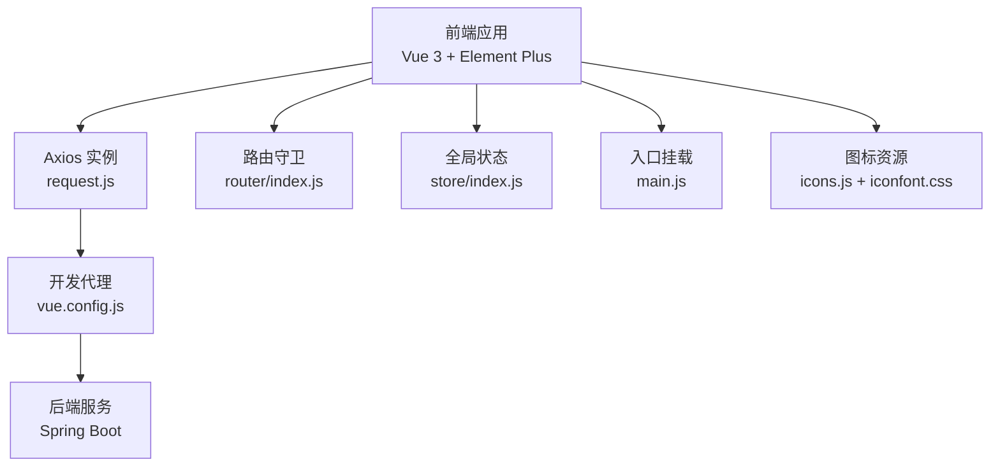
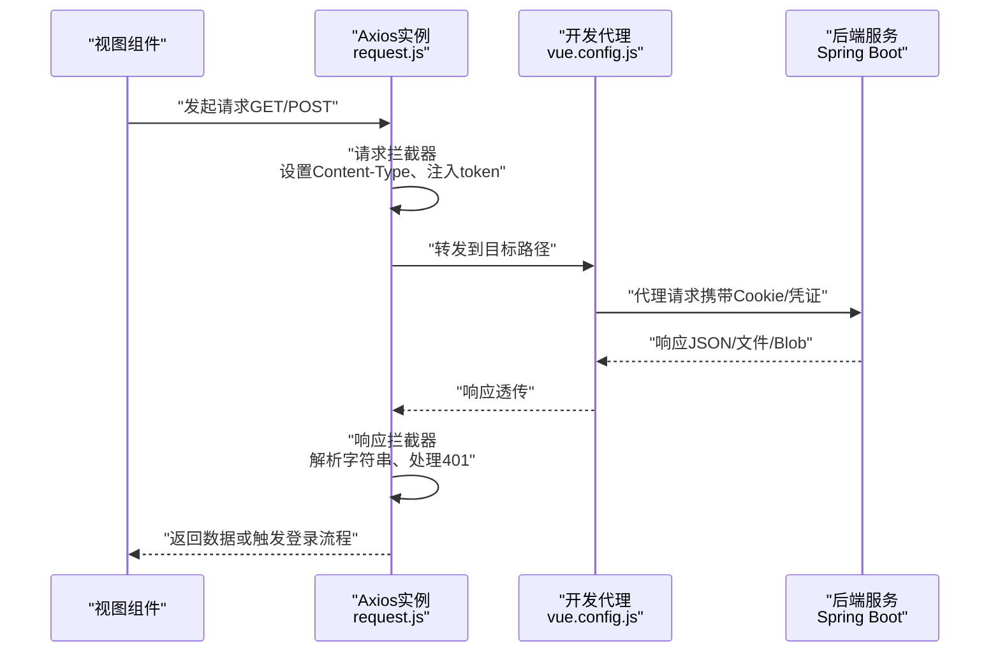
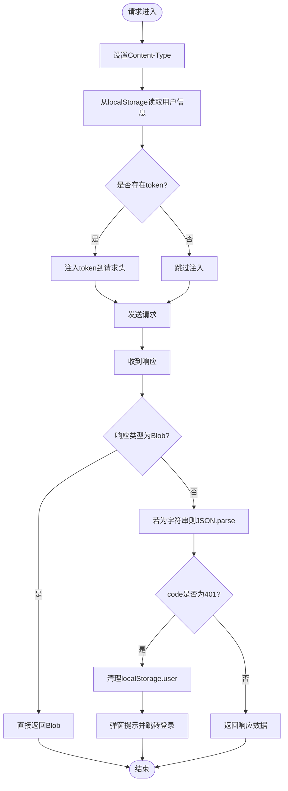
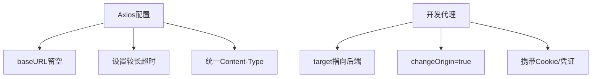
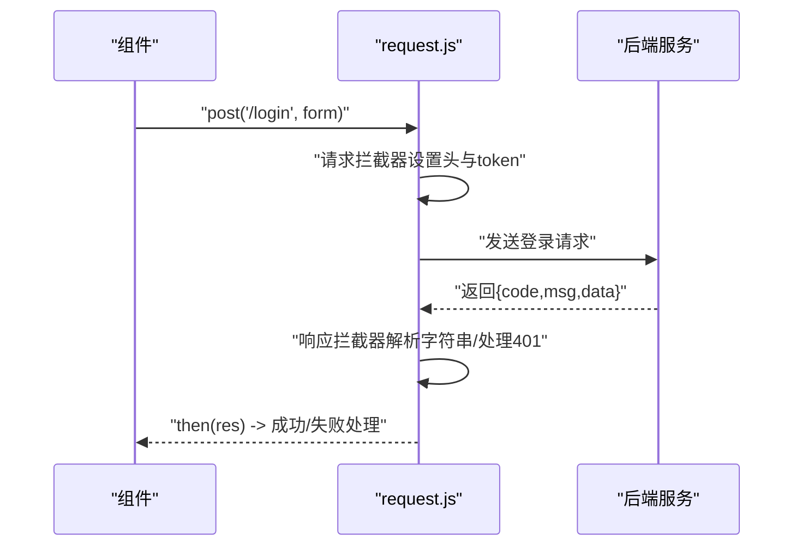
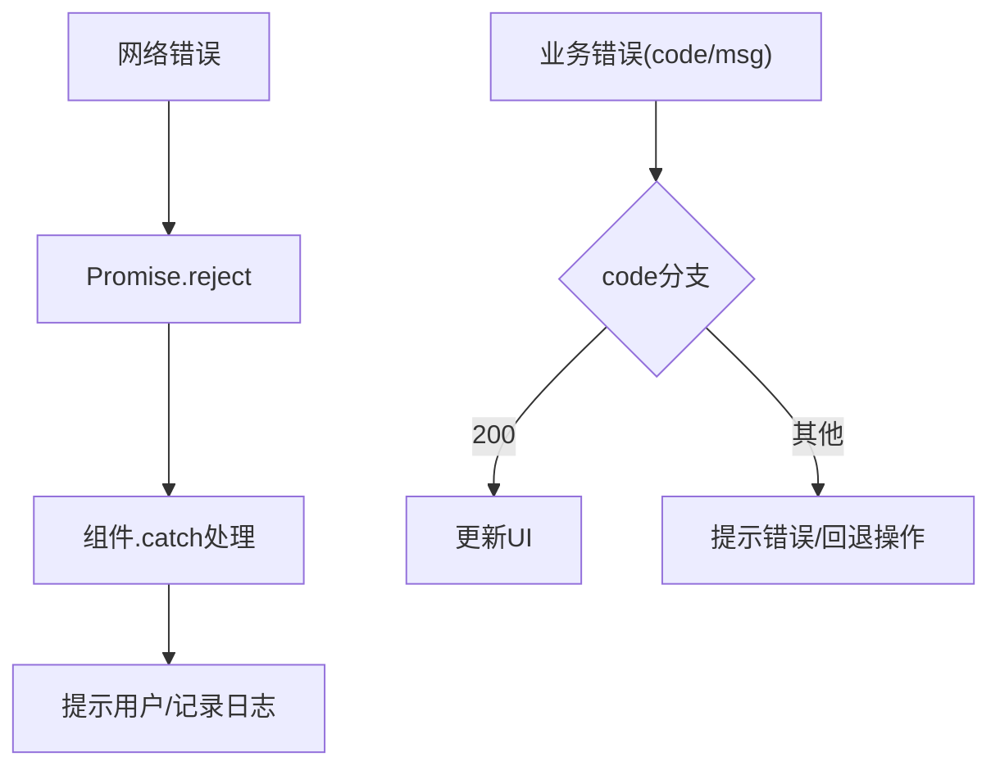
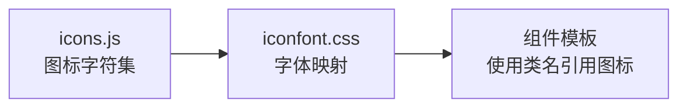
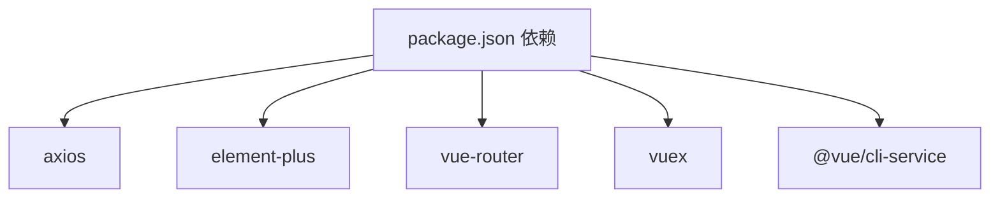

# API集成与数据处理

<cite>
**本文引用的文件**
- [mall-web/src/utils/request.js](file://mall-web/src/utils/request.js)
- [mall-web/src/main.js](file://mall-web/src/main.js)
- [mall-web/vue.config.js](file://mall-web/vue.config.js)
- [mall-web/src/router/index.js](file://mall-web/src/router/index.js)
- [mall-web/src/store/index.js](file://mall-web/src/store/index.js)
- [mall-web/package.json](file://mall-web/package.json)
- [mall-web/public/index.template.html](file://mall-web/public/index.template.html)
- [mall-web/src/views/Login.vue](file://mall-web/src/views/Login.vue)
- [mall-web/src/views/front/good/Cart.vue](file://mall-web/src/views/front/good/Cart.vue)
- [mall-web/src/utils/icons.js](file://mall-web/src/utils/icons.js)
- [mall-web/src/resource/icon_store/iconfont.css](file://mall-web/src/resource/icon_store/iconfont.css)
- [mall-server/src/main/resources/application.yml](file://mall-server/src/main/resources/application.yml)
- [mall-server/src/main/java/com/rabbiter/em/config/CorsConfig.java](file://mall-server/src/main/java/com/rabbiter/em/config/CorsConfig.java)
- [mall-server/src/main/java/com/rabbiter/em/config/GlobalExceptionHandler.java](file://mall-server/src/main/java/com/rabbiter/em/config/GlobalExceptionHandler.java)
</cite>

## 目录
1. [引言](#引言)
2. [项目结构](#项目结构)
3. [核心组件](#核心组件)
4. [架构总览](#架构总览)
5. [详细组件分析](#详细组件分析)
6. [依赖分析](#依赖分析)
7. [性能考量](#性能考量)
8. [故障排查指南](#故障排查指南)
9. [结论](#结论)
10. [附录](#附录)

## 引言
本文件聚焦于前端侧的API集成与数据处理，围绕以下主题展开：Axios封装与拦截器、HTTP客户端统一配置（基础URL、超时、请求头）、API调用最佳实践（参数传递、数据格式转换、响应处理）、错误处理策略（网络错误、业务错误、用户提示）、数据缓存与本地存储、API版本管理与Mock、测试策略、安全考虑（CSRF防护、数据校验）、以及图标资源管理与使用。

## 项目结构
前端采用Vue 3 + Vue Router + Vuex + Axios，后端采用Spring Boot。开发期通过Vue CLI的devServer代理将前端请求转发至后端，避免跨域问题；生产构建产物由Nginx或其他静态服务器托管。

**图表来源**
- [mall-web/src/utils/request.js:1-55](file://mall-web/src/utils/request.js#L1-L55)
- [mall-web/vue.config.js:4-16](file://mall-web/vue.config.js#L4-L16)
- [mall-web/src/router/index.js:84-150](file://mall-web/src/router/index.js#L84-L150)
- [mall-web/src/store/index.js:8-21](file://mall-web/src/store/index.js#L8-L21)
- [mall-web/src/main.js:1-18](file://mall-web/src/main.js#L1-L18)
- [mall-web/src/utils/icons.js:1-565](file://mall-web/src/utils/icons.js#L1-L565)
- [mall-web/src/resource/icon_store/iconfont.css:1-200](file://mall-web/src/resource/icon_store/iconfont.css#L1-L200)

**章节来源**
- [mall-web/src/main.js:1-18](file://mall-web/src/main.js#L1-L18)
- [mall-web/vue.config.js:1-26](file://mall-web/vue.config.js#L1-L26)
- [mall-web/public/index.template.html:1-24](file://mall-web/public/index.template.html#L1-L24)

## 核心组件
- Axios封装与拦截器：统一设置Content-Type、从localStorage读取token并注入请求头；统一处理响应体（兼容字符串与Blob）；对特定业务错误（如401）进行统一处理并引导登录。
- HTTP客户端统一配置：baseURL留空，交由开发代理完成跨域；timeout设置为较长值；请求头统一为JSON编码。
- 路由守卫与鉴权：在进入受保护路由前，先检查本地token，再向后端查询角色并控制访问。
- 图标资源：提供图标集合与字体样式，支持多套图标库CSS。

**章节来源**
- [mall-web/src/utils/request.js:5-50](file://mall-web/src/utils/request.js#L5-L50)
- [mall-web/src/router/index.js:84-150](file://mall-web/src/router/index.js#L84-L150)
- [mall-web/src/utils/icons.js:1-565](file://mall-web/src/utils/icons.js#L1-L565)
- [mall-web/src/resource/icon_store/iconfont.css:1-200](file://mall-web/src/resource/icon_store/iconfont.css#L1-L200)

## 架构总览
前端通过Axios实例发起HTTP请求，开发阶段由Vue CLI devServer代理到后端；后端通过CORS配置允许跨域，并通过全局异常处理器统一返回业务错误。路由守卫负责登录态与权限校验。

**图表来源**
- [mall-web/src/utils/request.js:13-50](file://mall-web/src/utils/request.js#L13-L50)
- [mall-web/vue.config.js:6-15](file://mall-web/vue.config.js#L6-L15)
- [mall-server/src/main/java/com/rabbiter/em/config/CorsConfig.java:18-25](file://mall-server/src/main/java/com/rabbiter/em/config/CorsConfig.java#L18-L25)

## 详细组件分析

### Axios封装与拦截器
- 请求拦截器
  - 统一设置Content-Type为application/json;charset=utf-8。
  - 从localStorage读取用户信息，若存在则将token写入请求头，用于后端鉴权。
- 响应拦截器
  - 对Blob类型响应直接透传（用于文件下载）。
  - 对字符串类型的响应尝试JSON.parse，避免后端返回字符串导致解析异常。
  - 当响应code为401时，清理本地用户信息，弹出提示框，并跳转登录页。
  - 其他错误在拦截器中抛出Promise拒绝，便于上层统一处理。
- 错误处理机制
  - 拦截器内对网络错误进行Promise.reject，避免静默失败。
  - 视图层在调用API时使用.then/.catch捕获错误，结合Element Plus消息提示给用户反馈。

**图表来源**
- [mall-web/src/utils/request.js:13-50](file://mall-web/src/utils/request.js#L13-L50)

**章节来源**
- [mall-web/src/utils/request.js:5-50](file://mall-web/src/utils/request.js#L5-L50)

### HTTP客户端统一配置
- baseURL：留空，开发阶段由devServer代理到后端地址，避免硬编码影响部署灵活性。
- timeout：设置为较长超时时间，适合文件上传/下载或长任务。
- 开发代理：将所有请求代理到后端服务，开启跨域与Cookie携带，确保鉴权与会话正常工作。
- 请求头：统一Content-Type，保证后端接收JSON。

**图表来源**
- [mall-web/src/utils/request.js:5-8](file://mall-web/src/utils/request.js#L5-L8)
- [mall-web/vue.config.js:6-15](file://mall-web/vue.config.js#L6-L15)

**章节来源**
- [mall-web/src/utils/request.js:5-8](file://mall-web/src/utils/request.js#L5-L8)
- [mall-web/vue.config.js:4-16](file://mall-web/vue.config.js#L4-L16)

### API调用最佳实践
- 参数传递
  - 使用对象形式传递请求体，必要时对敏感字段（如密码）进行预处理（例如前端MD5加密）后再提交。
  - 对必填字段进行前端校验，减少无效请求。
- 数据格式转换
  - 后端返回字符串时，拦截器自动解析为JSON；文件类响应保持Blob透传。
- 响应处理
  - 统一读取响应中的code与msg，按业务逻辑分支处理；成功时提取data并更新UI。
  - 对401等鉴权失败场景，统一清理本地状态并重定向登录。

**图表来源**
- [mall-web/src/views/Login.vue:77-120](file://mall-web/src/views/Login.vue#L77-L120)
- [mall-web/src/utils/request.js:13-50](file://mall-web/src/utils/request.js#L13-L50)

**章节来源**
- [mall-web/src/views/Login.vue:67-120](file://mall-web/src/views/Login.vue#L67-L120)
- [mall-web/src/utils/request.js:13-50](file://mall-web/src/utils/request.js#L13-L50)

### 错误处理策略
- 网络错误
  - 拦截器对error进行Promise.reject，上层.catch可统一提示。
- 业务错误
  - 依据响应中的code与msg进行分支处理；对常见错误（如密码不合规）在前端即时提示。
- 用户友好提示
  - 使用Element Plus的消息提示组件展示错误信息，避免直接暴露技术细节。
- 鉴权失效
  - 401时清理本地用户信息并跳转登录，防止页面处于半登录状态。

**图表来源**
- [mall-web/src/utils/request.js:47-50](file://mall-web/src/utils/request.js#L47-L50)
- [mall-web/src/views/Login.vue:98-119](file://mall-web/src/views/Login.vue#L98-L119)

**章节来源**
- [mall-web/src/utils/request.js:26-50](file://mall-web/src/utils/request.js#L26-L50)
- [mall-web/src/views/Login.vue:67-120](file://mall-web/src/views/Login.vue#L67-L120)

### 数据缓存与本地存储
- 本地存储
  - 登录成功后将用户信息（含token）写入localStorage；路由守卫在进入受保护路由前读取并校验。
  - 在响应拦截器遇到401时同步清理localStorage.user，确保状态一致。
- 缓存建议
  - 对于不频繁变化的数据（如商品分类、轮播图），可在组件内维护内存缓存并在路由离开时持久化到localStorage，以提升体验并降低重复请求。
  - 对大文件下载使用Blob响应透传，避免额外序列化开销。

**章节来源**
- [mall-web/src/router/index.js:88-134](file://mall-web/src/router/index.js#L88-L134)
- [mall-web/src/utils/request.js:38-44](file://mall-web/src/utils/request.js#L38-L44)
- [mall-web/src/views/front/good/Cart.vue:49-60](file://mall-web/src/views/front/good/Cart.vue#L49-L60)

### API版本管理、Mock与测试策略
- 版本管理
  - 建议在Axios实例中增加API前缀（如/api/v1），通过统一入口切换版本，便于灰度与迁移。
- Mock
  - 开发阶段可通过devServer的before或自定义中间件模拟后端接口，隔离前后端联调风险。
- 测试
  - 单元测试：针对API封装与工具函数编写测试，覆盖请求头注入、响应解析、错误分支。
  - 集成测试：通过Mock后端验证路由守卫、鉴权流程与页面渲染一致性。

[本节为通用实践建议，不直接分析具体文件，故无“章节来源”]

### 安全考虑
- CSRF防护
  - 后端已启用CORS并允许携带Cookie，前端需确保代理与后端同源或正确配置allowedOriginPatterns，避免跨站请求被拦截。
- 数据验证
  - 前端对输入进行基础校验（如密码强度），后端通过全局异常处理器统一处理数据库/Redis连接异常等系统级错误。
- 传输安全
  - 生产环境建议启用HTTPS，配合JWT密钥管理与过期策略，避免明文传输敏感信息。

**章节来源**
- [mall-server/src/main/java/com/rabbiter/em/config/CorsConfig.java:18-25](file://mall-server/src/main/java/com/rabbiter/em/config/CorsConfig.java#L18-L25)
- [mall-server/src/main/resources/application.yml:35-36](file://mall-server/src/main/resources/application.yml#L35-L36)
- [mall-server/src/main/java/com/rabbiter/em/config/GlobalExceptionHandler.java:16-43](file://mall-server/src/main/java/com/rabbiter/em/config/GlobalExceptionHandler.java#L16-L43)

### 图标资源管理与使用
- 图标集合
  - 提供大量图标字符码，可用于自定义渲染或与字体图标结合。
- 字体图标
  - 通过引入iconfont.css声明字体族与类名映射，使用时以类名方式引用对应图标。
- 多套图标库
  - 项目包含两套图标库CSS，可根据设计需求选择使用。

**图表来源**
- [mall-web/src/utils/icons.js:1-565](file://mall-web/src/utils/icons.js#L1-L565)
- [mall-web/src/resource/icon_store/iconfont.css:1-200](file://mall-web/src/resource/icon_store/iconfont.css#L1-L200)

**章节来源**
- [mall-web/src/utils/icons.js:1-565](file://mall-web/src/utils/icons.js#L1-L565)
- [mall-web/src/resource/icon_store/iconfont.css:1-200](file://mall-web/src/resource/icon_store/iconfont.css#L1-L200)

## 依赖分析
- 前端依赖
  - axios：HTTP客户端封装与拦截器。
  - element-plus：UI组件与消息提示。
  - vue、vue-router、vuex：前端框架与状态管理。
- 开发依赖
  - @vue/cli-service：构建与开发服务器。
- 后端依赖
  - Spring Boot：Web与异常处理。
  - CORS配置：跨域与Cookie支持。
  - 全局异常处理器：统一业务错误返回。

**图表来源**
- [mall-web/package.json:10-25](file://mall-web/package.json#L10-L25)

**章节来源**
- [mall-web/package.json:1-32](file://mall-web/package.json#L1-L32)

## 性能考量
- 请求超时与并发
  - 合理设置timeout，避免长时间阻塞；对批量请求进行合并或节流，减少不必要的网络往返。
- 响应解析
  - Blob透传避免额外解析成本；对非Blob响应尽量一次性解析，避免重复JSON.parse。
- 缓存策略
  - 对只读数据建立内存缓存与localStorage双层缓存，结合失效策略降低后端压力。
- 图标加载
  - 字体图标按需加载，避免一次性引入过多CSS造成首屏抖动。

[本节为通用指导，不直接分析具体文件，故无“章节来源”]

## 故障排查指南
- 登录后仍提示未登录
  - 检查localStorage中是否存在user；确认请求拦截器是否正确注入token；核对后端JWT密钥与签名。
- 401错误频繁出现
  - 检查响应拦截器是否清理了localStorage.user；确认后端JWT过期策略与前端刷新逻辑。
- 文件下载失败
  - 确认响应类型为blob；检查后端是否正确设置Content-Disposition与MIME类型。
- 跨域与Cookie丢失
  - 检查CORS配置与devServer代理headers；确保changeOrigin与credentials设置正确。
- 密码校验失败
  - 核对前端密码规则与后端期望；确认MD5加密是否一致。

**章节来源**
- [mall-web/src/utils/request.js:38-44](file://mall-web/src/utils/request.js#L38-L44)
- [mall-web/src/router/index.js:88-134](file://mall-web/src/router/index.js#L88-L134)
- [mall-server/src/main/java/com/rabbiter/em/config/CorsConfig.java:18-25](file://mall-server/src/main/java/com/rabbiter/em/config/CorsConfig.java#L18-L25)

## 结论
本文档系统梳理了前端API集成与数据处理的关键点：Axios封装、统一配置、路由鉴权、错误处理、缓存与本地存储、图标资源管理，并结合后端CORS与异常处理给出整体架构视图。建议在生产环境中进一步完善版本前缀、Mock与测试体系，强化CSRF与数据校验，确保系统稳定与安全。

## 附录
- 入口挂载与全局属性
  - 在main.js中将request挂载为全局属性，便于组件直接使用。
- 页面模板
  - index.template.html为构建产物模板，确保标题与基础资源正确注入。

**章节来源**
- [mall-web/src/main.js:16-16](file://mall-web/src/main.js#L16-L16)
- [mall-web/public/index.template.html:14-14](file://mall-web/public/index.template.html#L14-L14)