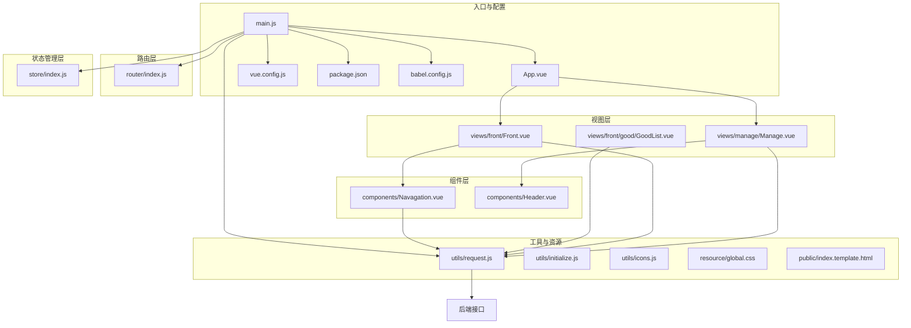
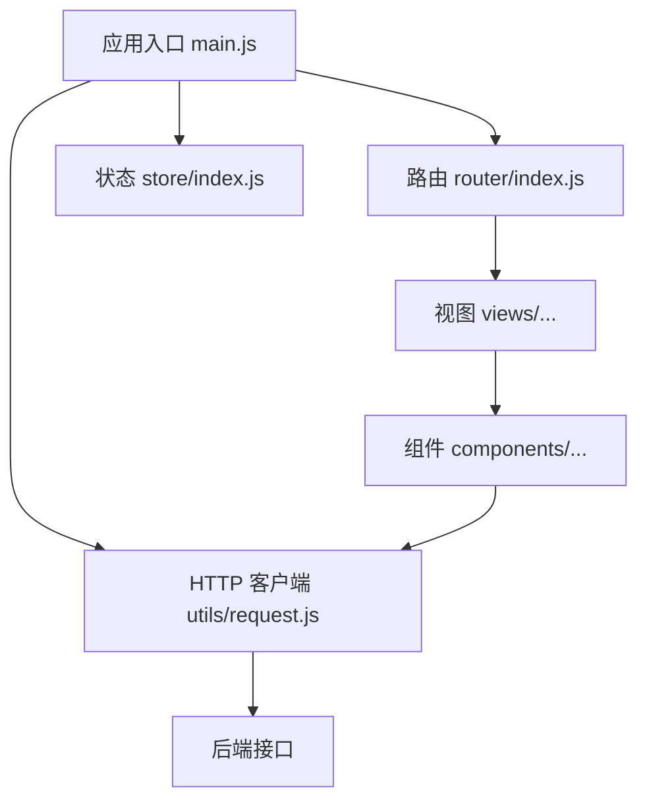
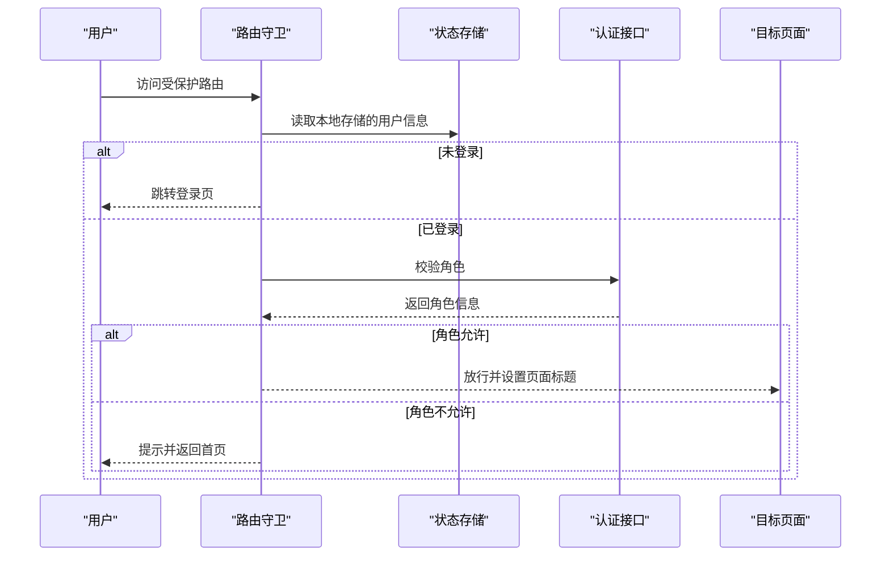
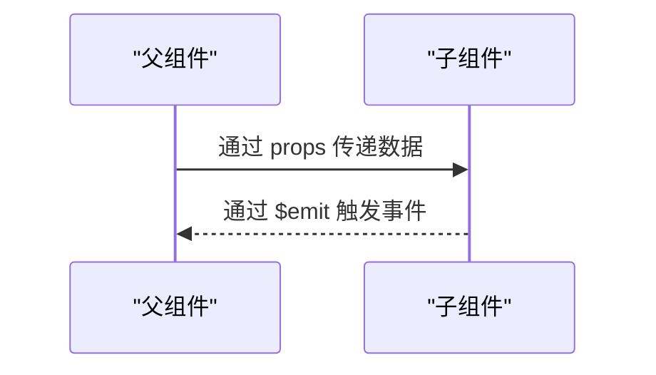
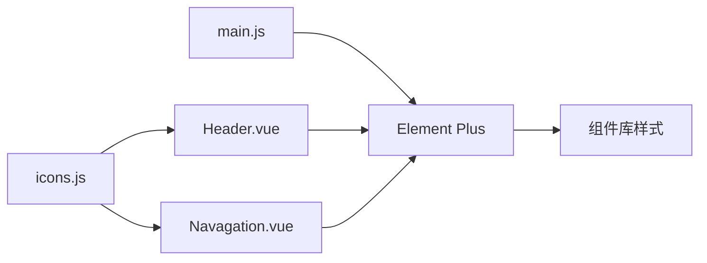
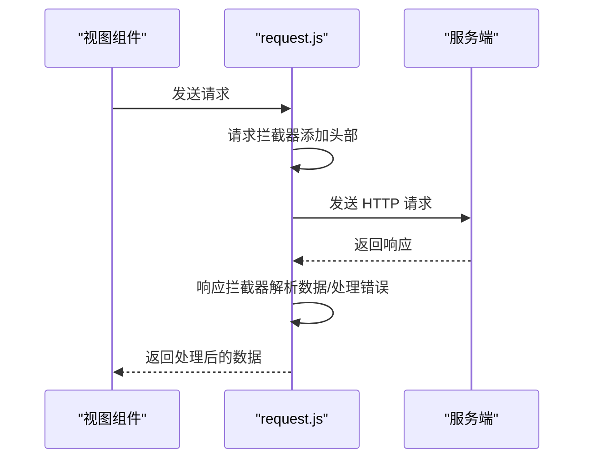
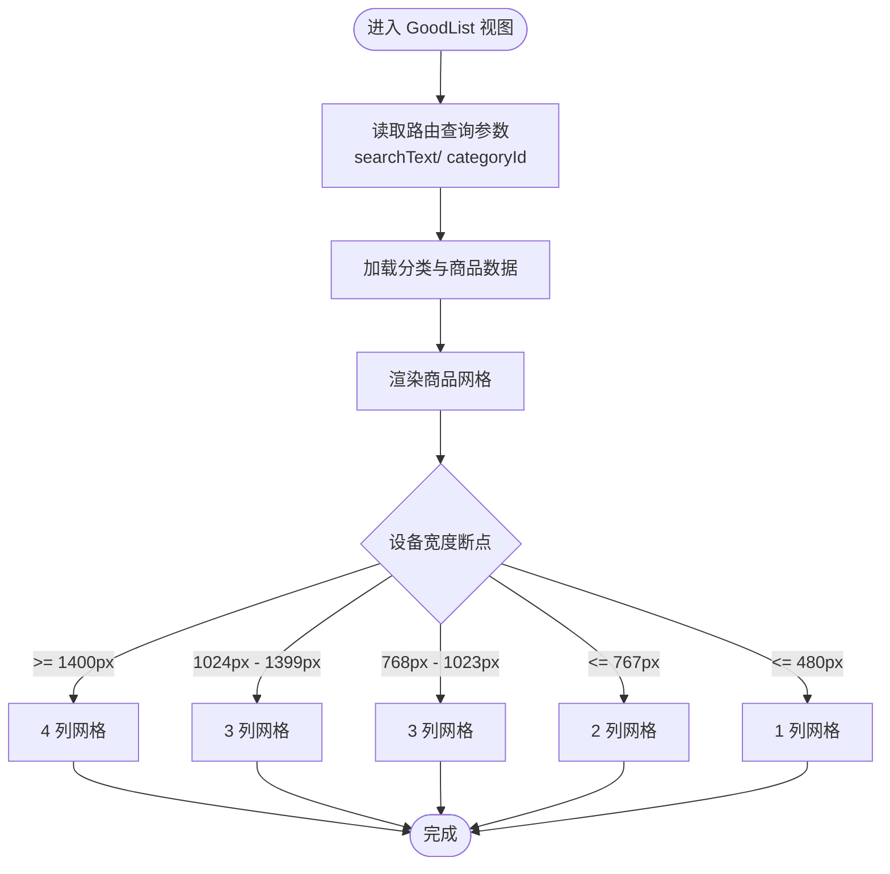
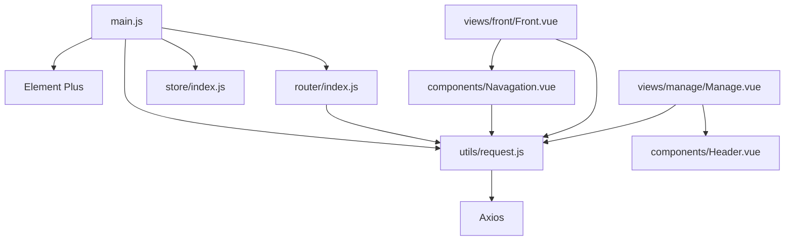

# 前端系统设计

<cite>
**本文档引用的文件**
- [package.json](file://mall-web/package.json)
- [main.js](file://mall-web/src/main.js)
- [App.vue](file://mall-web/src/App.vue)
- [vue.config.js](file://mall-web/vue.config.js)
- [index.js](file://mall-web/src/router/index.js)
- [index.js](file://mall-web/src/store/index.js)
- [request.js](file://mall-web/src/utils/request.js)
- [initialize.js](file://mall-web/src/utils/initialize.js)
- [Header.vue](file://mall-web/src/components/Header.vue)
- [Navagation.vue](file://mall-web/src/components/Navagation.vue)
- [Front.vue](file://mall-web/src/views/front/Front.vue)
- [GoodList.vue](file://mall-web/src/views/front/good/GoodList.vue)
- [Manage.vue](file://mall-web/src/views/manage/Manage.vue)
- [icons.js](file://mall-web/src/utils/icons.js)
- [global.css](file://mall-web/src/resource/global.css)
- [index.template.html](file://mall-web/public/index.template.html)
- [babel.config.js](file://mall-web/babel.config.js)
</cite>

## 目录
1. [引言](#引言)
2. [项目结构](#项目结构)
3. [核心组件](#核心组件)
4. [架构总览](#架构总览)
5. [详细组件分析](#详细组件分析)
6. [依赖关系分析](#依赖关系分析)
7. [性能考虑](#性能考虑)
8. [故障排除指南](#故障排除指南)
9. [结论](#结论)
10. [附录](#附录)

## 引言
本文件面向基于 Vue.js 的前端系统设计，围绕整体架构、组件化与单文件组件结构、模块化组织方式、Element Plus 组件库集成与样式管理、Vue Router 路由系统、Vuex 状态管理、组件通信机制、Axios 封装与 API 集成策略、响应式与移动端适配、以及构建与部署优化进行系统性说明。文档旨在帮助开发者快速理解并高效扩展该前端系统。

## 项目结构
前端工程采用 Vue CLI 生成的标准目录结构，结合 Element Plus 进行界面开发，配合 Vuex 实现状态管理，Vue Router 提供路由能力，Axios 封装统一处理 HTTP 请求与响应。

**图表来源**
- [main.js:1-18](file://mall-web/src/main.js#L1-L18)
- [App.vue:1-21](file://mall-web/src/App.vue#L1-L21)
- [vue.config.js:1-26](file://mall-web/vue.config.js#L1-L26)
- [package.json:1-32](file://mall-web/package.json#L1-L32)
- [babel.config.js:1-6](file://mall-web/babel.config.js#L1-L6)
- [router/index.js:1-161](file://mall-web/src/router/index.js#L1-L161)
- [store/index.js:1-21](file://mall-web/src/store/index.js#L1-L21)
- [utils/request.js:1-55](file://mall-web/src/utils/request.js#L1-L55)
- [utils/initialize.js:1-217](file://mall-web/src/utils/initialize.js#L1-L217)
- [components/Navagation.vue:1-171](file://mall-web/src/components/Navagation.vue#L1-L171)
- [components/Header.vue:1-93](file://mall-web/src/components/Header.vue#L1-L93)
- [views/front/Front.vue:1-79](file://mall-web/src/views/front/Front.vue#L1-L79)
- [views/manage/Manage.vue:1-111](file://mall-web/src/views/manage/Manage.vue#L1-L111)
- [views/front/good/GoodList.vue:1-485](file://mall-web/src/views/front/good/GoodList.vue#L1-L485)
- [utils/icons.js:1-565](file://mall-web/src/utils/icons.js#L1-L565)
- [resource/global.css:1-8](file://mall-web/src/resource/global.css#L1-L8)
- [public/index.template.html:1-24](file://mall-web/public/index.template.html#L1-L24)

**章节来源**
- [main.js:1-18](file://mall-web/src/main.js#L1-L18)
- [App.vue:1-21](file://mall-web/src/App.vue#L1-L21)
- [vue.config.js:1-26](file://mall-web/vue.config.js#L1-L26)
- [package.json:1-32](file://mall-web/package.json#L1-L32)
- [babel.config.js:1-6](file://mall-web/babel.config.js#L1-L6)

## 核心组件
- 应用入口与全局配置：在入口文件中完成应用初始化、Element Plus 注册、路由与状态管理挂载、全局 HTTP 客户端注入等。
- 路由系统：定义前台与后台两套路由体系，支持嵌套路由、动态导入、导航守卫与标题设置。
- 状态管理：当前 Store 仅定义基础状态，后续可按模块拆分。
- 组件层：提供通用头部、导航、侧边栏等复用组件。
- 视图层：前台与后台分别承载业务页面，采用组合式 API 与选项式 API 混合开发。
- 工具层：Axios 封装统一处理请求/响应、拦截器与错误处理；图标资源集中管理；初始化脚本负责页面元素与样式的动态处理。

**章节来源**
- [main.js:1-18](file://mall-web/src/main.js#L1-L18)
- [router/index.js:1-161](file://mall-web/src/router/index.js#L1-L161)
- [store/index.js:1-21](file://mall-web/src/store/index.js#L1-L21)
- [utils/request.js:1-55](file://mall-web/src/utils/request.js#L1-L55)
- [utils/initialize.js:1-217](file://mall-web/src/utils/initialize.js#L1-L217)

## 架构总览
前端系统采用“入口配置 → 路由 → 视图/组件 → 工具”的分层架构。Element Plus 提供 UI 能力，Axios 封装统一处理网络请求，Vuex 作为轻量状态容器，Vue Router 负责页面导航与权限控制。

**图表来源**
- [main.js:1-18](file://mall-web/src/main.js#L1-L18)
- [router/index.js:1-161](file://mall-web/src/router/index.js#L1-L161)
- [store/index.js:1-21](file://mall-web/src/store/index.js#L1-L21)
- [utils/request.js:1-55](file://mall-web/src/utils/request.js#L1-L55)

## 详细组件分析

### 路由系统设计（Vue Router）
- 路由配置：前台与后台双轨制，前台路由用于普通用户浏览，后台路由用于管理员管理功能。
- 嵌套路由：前台与后台均采用嵌套路由，便于子页面共享布局。
- 导航守卫：在进入路由前进行登录态与角色校验，未登录或权限不足时跳转登录页或提示。
- 页面标题：根据路由 meta.title 动态设置页面标题，提升用户体验。
- 路由跳转：支持编程式导航与面包屑路径展示。

**图表来源**
- [router/index.js:84-150](file://mall-web/src/router/index.js#L84-L150)

**章节来源**
- [router/index.js:1-161](file://mall-web/src/router/index.js#L1-L161)

### 状态管理设计（Vuex）
- 当前状态：仅定义基础状态（如 baseApi），未拆分子模块。
- 建议：按领域拆分模块（如用户、商品、订单），并在模块内定义 state、mutations、actions、getters，提升可维护性与可测试性。

**章节来源**
- [store/index.js:1-21](file://mall-web/src/store/index.js#L1-L21)

### 组件通信机制
- Props 传递：父组件向子组件传递用户信息、登录状态、角色等属性。
- 事件触发：子组件通过 $emit 向父组件传递事件（如折叠侧边栏）。
- provide/inject：当前项目未使用，可在跨层级组件间传递依赖时引入。

**图表来源**
- [components/Header.vue:42-80](file://mall-web/src/components/Header.vue#L42-L80)
- [components/Navagation.vue:118-141](file://mall-web/src/components/Navagation.vue#L118-L141)

**章节来源**
- [components/Header.vue:1-93](file://mall-web/src/components/Header.vue#L1-L93)
- [components/Navagation.vue:1-171](file://mall-web/src/components/Navagation.vue#L1-L171)

### Element Plus 组件库集成与样式管理
- 全局注册：在入口文件中注册 Element Plus 并引入默认样式。
- 主题定制：可通过变量覆盖或自定义样式文件实现主题定制（建议在全局样式中集中管理）。
- 组件封装：将常用交互封装为组件（如 Header、Navagation），提升复用性。
- 图标管理：通过图标资源文件集中管理图标集，减少重复引入。

**图表来源**
- [main.js:5-16](file://mall-web/src/main.js#L5-L16)
- [components/Header.vue:10-35](file://mall-web/src/components/Header.vue#L10-L35)
- [components/Navagation.vue:11-43](file://mall-web/src/components/Navagation.vue#L11-L43)
- [utils/icons.js:1-565](file://mall-web/src/utils/icons.js#L1-L565)

**章节来源**
- [main.js:1-18](file://mall-web/src/main.js#L1-L18)
- [components/Header.vue:1-93](file://mall-web/src/components/Header.vue#L1-L93)
- [components/Navagation.vue:1-171](file://mall-web/src/components/Navagation.vue#L1-L171)
- [utils/icons.js:1-565](file://mall-web/src/utils/icons.js#L1-L565)

### Axios 封装与 API 集成策略
- 基础配置：统一 baseURL（通过开发服务器代理）、超时时间等。
- 请求拦截器：自动添加 Content-Type 与 token 头部。
- 响应拦截器：统一处理返回数据类型、文件下载、错误码（如 401）与弹窗提示、跳转登录。
- 错误处理：捕获网络异常并拒绝 Promise，避免未处理异常导致崩溃。
- API 集成：视图组件通过 this.$parent.request 或全局注入的 request 使用统一客户端。

**图表来源**
- [utils/request.js:10-50](file://mall-web/src/utils/request.js#L10-L50)

**章节来源**
- [utils/request.js:1-55](file://mall-web/src/utils/request.js#L1-L55)

### 响应式设计与移动端适配
- 视图层：商品列表采用 CSS Grid 布局，配合媒体查询在不同屏幕尺寸下调整列数与间距。
- 组件层：导航与头部组件通过内联样式与 Element Plus 组件实现自适应。
- 全局样式：通过全局样式文件统一高度与布局基线。

**图表来源**
- [views/front/good/GoodList.vue:449-483](file://mall-web/src/views/front/good/GoodList.vue#L449-L483)

**章节来源**
- [views/front/good/GoodList.vue:1-485](file://mall-web/src/views/front/good/GoodList.vue#L1-L485)
- [resource/global.css:1-8](file://mall-web/src/resource/global.css#L1-L8)

### 构建配置与部署优化
- 开发服务器：配置端口、代理规则，将前端请求转发至后端服务，解决跨域问题。
- 页面配置：通过 vue.config.js 的 pages 字段配置入口、模板与标题。
- 依赖与脚本：通过 package.json 管理依赖与构建脚本（dev、serve、build）。
- Babel 预设：使用官方 Babel 预设保证兼容性。

**章节来源**
- [vue.config.js:1-26](file://mall-web/vue.config.js#L1-L26)
- [package.json:1-32](file://mall-web/package.json#L1-L32)
- [babel.config.js:1-6](file://mall-web/babel.config.js#L1-L6)

## 依赖关系分析
- 入口依赖：main.js 依赖 Element Plus、路由、状态管理、HTTP 客户端与全局样式。
- 路由依赖：router/index.js 依赖 utils/request.js 与 Element Plus 的路由能力。
- 视图依赖：视图组件依赖 Element Plus 组件、工具层 HTTP 客户端与全局样式。
- 工具依赖：utils/request.js 依赖 axios 与 Element Plus 的消息提示组件。

**图表来源**
- [main.js:1-18](file://mall-web/src/main.js#L1-L18)
- [router/index.js:1-161](file://mall-web/src/router/index.js#L1-L161)
- [store/index.js:1-21](file://mall-web/src/store/index.js#L1-L21)
- [utils/request.js:1-55](file://mall-web/src/utils/request.js#L1-L55)
- [components/Navagation.vue:1-171](file://mall-web/src/components/Navagation.vue#L1-L171)
- [components/Header.vue:1-93](file://mall-web/src/components/Header.vue#L1-L93)
- [views/front/Front.vue:1-79](file://mall-web/src/views/front/Front.vue#L1-L79)
- [views/manage/Manage.vue:1-111](file://mall-web/src/views/manage/Manage.vue#L1-L111)

**章节来源**
- [main.js:1-18](file://mall-web/src/main.js#L1-L18)
- [router/index.js:1-161](file://mall-web/src/router/index.js#L1-L161)
- [utils/request.js:1-55](file://mall-web/src/utils/request.js#L1-L55)

## 性能考虑
- 代码分割：路由采用异步组件导入，减小首屏体积。
- 资源懒加载：图片与组件按需加载，降低初始渲染压力。
- 缓存策略：合理利用浏览器缓存与 CDN，减少重复请求。
- 代理优化：开发环境通过代理避免跨域，提高调试效率。
- 组件复用：通过公共组件减少重复渲染与逻辑重复。

## 故障排除指南
- 登录态失效：响应拦截器检测 401 错误并清除本地存储，弹窗提示后跳转登录页。
- 角色校验失败：导航守卫在角色验证失败时清理本地存储并跳转登录。
- 网络异常：请求拦截器捕获异常并拒绝 Promise，避免未处理异常。
- 样式冲突：通过全局样式与组件作用域样式隔离，必要时引入更精确的选择器。

**章节来源**
- [utils/request.js:24-50](file://mall-web/src/utils/request.js#L24-L50)
- [router/index.js:84-150](file://mall-web/src/router/index.js#L84-L150)

## 结论
该前端系统以 Vue 3 + Element Plus 为基础，结合 Vue Router 与 Vuex 实现了清晰的分层架构与良好的可扩展性。通过 Axios 封装统一处理网络请求，配合路由守卫与状态管理，实现了较为完善的权限控制与数据流管理。响应式设计与构建配置进一步提升了用户体验与开发效率。建议后续在状态管理模块化、组件抽象与样式主题化方面持续优化。

## 附录
- 初始化脚本：通过动态注入样式与图标，增强页面视觉一致性与可维护性。
- 图标资源：集中管理图标集，便于统一替换与扩展。

**章节来源**
- [utils/initialize.js:1-217](file://mall-web/src/utils/initialize.js#L1-L217)
- [utils/icons.js:1-565](file://mall-web/src/utils/icons.js#L1-L565)