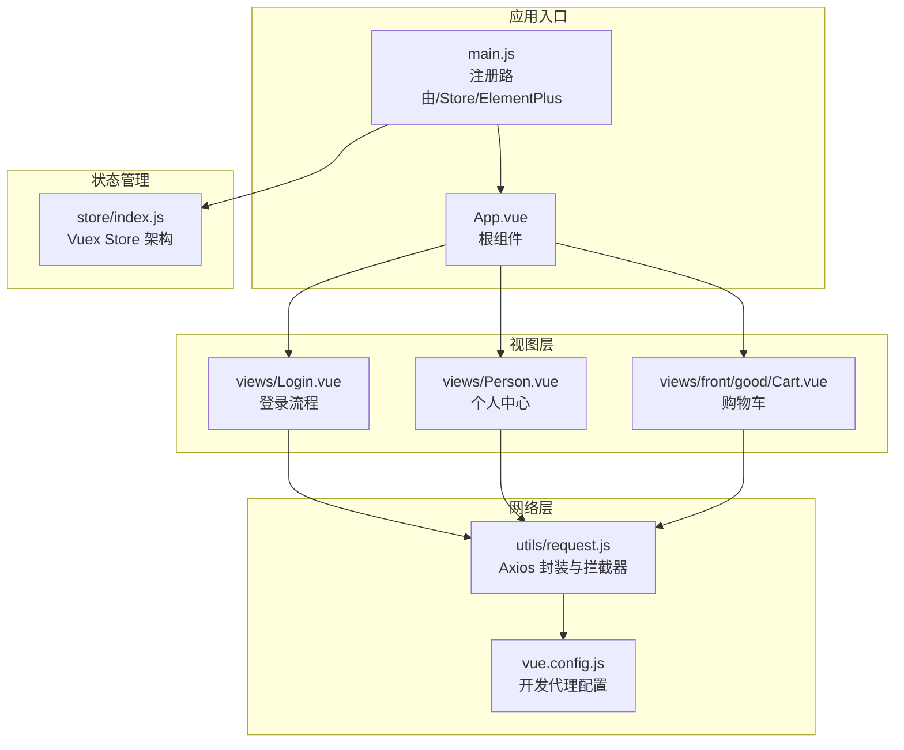
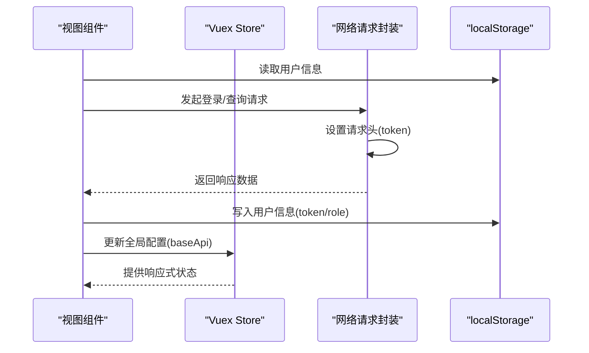
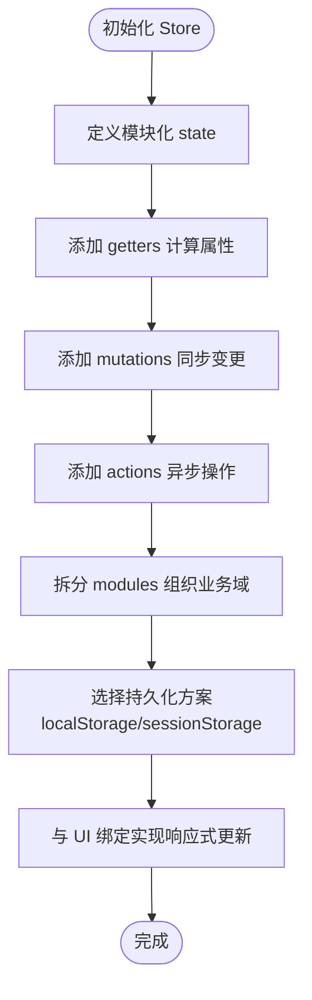
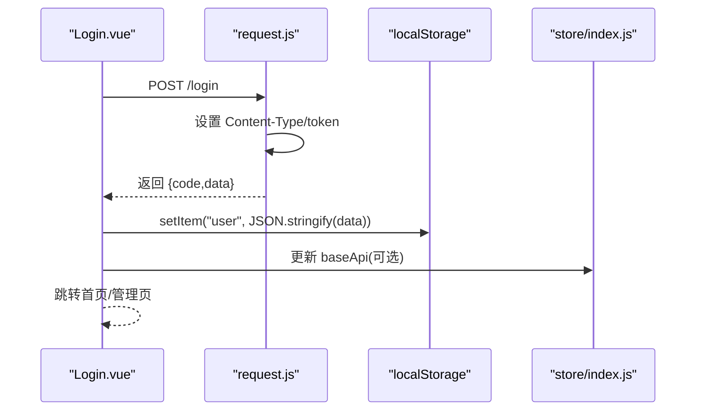
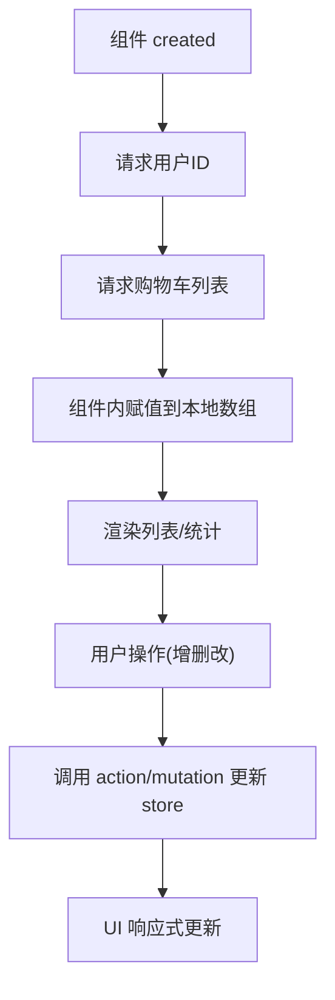
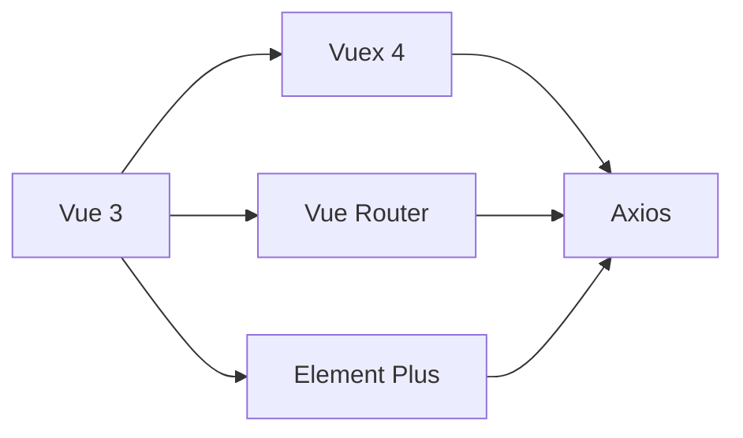

# 状态管理设计

<cite>
**本文引用的文件**
- [mall-web/src/store/index.js](file://mall-web/src/store/index.js)
- [mall-web/src/main.js](file://mall-web/src/main.js)
- [mall-web/package.json](file://mall-web/package.json)
- [mall-web/vue.config.js](file://mall-web/vue.config.js)
- [mall-web/src/utils/request.js](file://mall-web/src/utils/request.js)
- [mall-web/src/views/Login.vue](file://mall-web/src/views/Login.vue)
- [mall-web/src/views/Person.vue](file://mall-web/src/views/Person.vue)
- [mall-web/src/views/front/good/Cart.vue](file://mall-web/src/views/front/good/Cart.vue)
</cite>

## 目录
1. [简介](#简介)
2. [项目结构](#项目结构)
3. [核心组件](#核心组件)
4. [架构总览](#架构总览)
5. [详细组件分析](#详细组件分析)
6. [依赖分析](#依赖分析)
7. [性能考虑](#性能考虑)
8. [故障排查指南](#故障排查指南)
9. [结论](#结论)
10. [附录](#附录)

## 简介
本文件系统性梳理前端状态管理设计，聚焦于 Vuex 在本项目中的实现与应用。当前仓库中 Vuex Store 仍处于最小骨架形态：仅定义了基础的 state、getters、mutations、actions 和 modules 结构，尚未填充具体业务逻辑。本文将基于现有代码，结合实际业务场景（用户认证、购物车、全局配置等），给出状态管理的完整设计方案、数据流图、调试与最佳实践建议，并明确后续扩展方向。

## 项目结构
前端采用 Vue 3 + Vuex 4 + Vue Router + Element Plus 技术栈，状态管理入口位于 store/index.js；应用通过 main.js 完成插件注册与挂载；网络层通过 utils/request.js 封装 axios 并集成拦截器；开发服务器通过 vue.config.js 配置代理与页面入口。

**图表来源**
- [mall-web/src/main.js:1-18](file://mall-web/src/main.js#L1-L18)
- [mall-web/src/store/index.js:1-21](file://mall-web/src/store/index.js#L1-L21)
- [mall-web/src/utils/request.js:1-55](file://mall-web/src/utils/request.js#L1-L55)
- [mall-web/vue.config.js:1-26](file://mall-web/vue.config.js#L1-L26)
- [mall-web/src/views/Login.vue:1-153](file://mall-web/src/views/Login.vue#L1-L153)
- [mall-web/src/views/Person.vue:1-203](file://mall-web/src/views/Person.vue#L1-L203)
- [mall-web/src/views/front/good/Cart.vue:1-165](file://mall-web/src/views/front/good/Cart.vue#L1-L165)

**章节来源**
- [mall-web/src/main.js:1-18](file://mall-web/src/main.js#L1-L18)
- [mall-web/src/store/index.js:1-21](file://mall-web/src/store/index.js#L1-L21)
- [mall-web/package.json:1-32](file://mall-web/package.json#L1-L32)
- [mall-web/vue.config.js:1-26](file://mall-web/vue.config.js#L1-L26)

## 核心组件
- 应用入口与插件注册：在 main.js 中完成路由、状态管理、UI 组件库的安装与挂载。
- 网络层封装：request.js 对 axios 进行二次封装，统一设置请求头、携带 token、处理响应与错误。
- 视图组件：Login.vue、Person.vue、Cart.vue 分别体现认证、个人信息与购物车的典型交互。
- Vuex Store：当前为最小骨架，包含 state/baseApi、getters、mutations、actions、modules 字段，尚未填充业务逻辑。

**章节来源**
- [mall-web/src/main.js:1-18](file://mall-web/src/main.js#L1-L18)
- [mall-web/src/utils/request.js:1-55](file://mall-web/src/utils/request.js#L1-L55)
- [mall-web/src/views/Login.vue:1-153](file://mall-web/src/views/Login.vue#L1-L153)
- [mall-web/src/views/Person.vue:1-203](file://mall-web/src/views/Person.vue#L1-L203)
- [mall-web/src/views/front/good/Cart.vue:1-165](file://mall-web/src/views/front/good/Cart.vue#L1-L165)
- [mall-web/src/store/index.js:1-21](file://mall-web/src/store/index.js#L1-L21)

## 架构总览
下图展示从视图到状态管理与网络层的整体调用链路，以及本地存储在认证流程中的作用。

**图表来源**
- [mall-web/src/views/Login.vue:84-97](file://mall-web/src/views/Login.vue#L84-L97)
- [mall-web/src/utils/request.js:13-22](file://mall-web/src/utils/request.js#L13-L22)
- [mall-web/src/store/index.js:9-11](file://mall-web/src/store/index.js#L9-L11)

## 详细组件分析

### Vuex Store 设计与扩展
- 当前结构：state/baseApi、getters、mutations、actions、modules 为空白占位，便于后续按模块扩展。
- 扩展建议：
  - 用户模块：集中管理用户信息、登录态、权限等。
  - 购物车模块：维护购物车列表、数量、选中状态、价格汇总等。
  - 全局配置模块：baseApi、主题、语言、分页参数等。
  - 订单模块：订单列表、状态筛选、详情等。
- 命名规范：模块名使用小驼峰；mutation 使用常量+大写；action 语义化动词；getter 以名词或派生属性命名。
- 数据持久化：可结合浏览器的 localStorage/sessionStorage 实现轻量持久化，注意敏感信息不建议明文存储。

**图表来源**
- [mall-web/src/store/index.js:8-20](file://mall-web/src/store/index.js#L8-L20)

**章节来源**
- [mall-web/src/store/index.js:1-21](file://mall-web/src/store/index.js#L1-L21)

### 认证流程与状态绑定
- 登录流程：Login.vue 通过 request.js 发起登录请求，成功后将用户信息写入 localStorage，并依据角色决定跳转路径。
- 请求拦截：request.js 在请求头中注入 token，确保后端鉴权。
- 响应处理：当后端返回 401 时，清理本地用户信息并引导至登录页。
- UI 绑定：Person.vue 从 store.state.baseApi 读取全局 API 前缀，用于资源访问。

**图表来源**
- [mall-web/src/views/Login.vue:81-97](file://mall-web/src/views/Login.vue#L81-L97)
- [mall-web/src/utils/request.js:13-22](file://mall-web/src/utils/request.js#L13-L22)
- [mall-web/src/store/index.js:9-11](file://mall-web/src/store/index.js#L9-L11)

**章节来源**
- [mall-web/src/views/Login.vue:1-153](file://mall-web/src/views/Login.vue#L1-L153)
- [mall-web/src/utils/request.js:1-55](file://mall-web/src/utils/request.js#L1-L55)
- [mall-web/src/views/Person.vue:74-84](file://mall-web/src/views/Person.vue#L74-L84)

### 购物车状态管理
- 当前实现：Cart.vue 在 created 生命周期中拉取用户 ID 与购物车数据，直接在组件内维护本地数组。
- 推荐改造：将购物车数据纳入 Vuex 模块，统一管理列表、数量、价格、选中状态；组件通过 mapState/mapGetters/mapActions 与 store 绑定，实现响应式更新与跨组件共享。

**图表来源**
- [mall-web/src/views/front/good/Cart.vue:49-65](file://mall-web/src/views/front/good/Cart.vue#L49-L65)

**章节来源**
- [mall-web/src/views/front/good/Cart.vue:1-165](file://mall-web/src/views/front/good/Cart.vue#L1-L165)

### 全局配置与持久化
- baseApi：Person.vue 从 store.state.baseApi 读取，用于拼接资源访问地址。
- 持久化策略：
  - localStorage：适合存放用户 token、偏好设置、购物车草稿等。
  - sessionStorage：适合短期会话数据，如临时表单缓存。
  - 注意：避免在 localStorage 明文存储敏感字段；必要时进行加密或服务端签名校验。

**章节来源**
- [mall-web/src/views/Person.vue:74-84](file://mall-web/src/views/Person.vue#L74-L84)
- [mall-web/src/store/index.js:9-11](file://mall-web/src/store/index.js#L9-L11)

### 开发环境与调试
- 开发服务器：vue.config.js 配置了代理，将请求转发到后端服务，便于前后端联调。
- 调试工具：可在浏览器控制台使用 Vue DevTools 查看组件层级与状态树；结合 Vuex Devtools 追踪 mutation/action 流程。
- 环境变量：可通过 .env 文件区分开发/生产环境的 API 地址与功能开关。

**章节来源**
- [mall-web/vue.config.js:1-26](file://mall-web/vue.config.js#L1-L26)
- [mall-web/package.json:1-32](file://mall-web/package.json#L1-L32)

## 依赖分析
- Vue 3：提供组合式 API 与响应式系统。
- Vuex 4：提供集中式状态管理。
- Vue Router：负责页面路由与导航。
- Element Plus：UI 组件库，配合消息提示与弹窗。
- Axios：HTTP 客户端，配合 request.js 封装统一处理。

**图表来源**
- [mall-web/package.json:10-25](file://mall-web/package.json#L10-L25)

**章节来源**
- [mall-web/package.json:1-32](file://mall-web/package.json#L1-L32)

## 性能考虑
- 模块拆分：按业务域拆分 modules，避免单一模块过大导致不必要的响应式追踪开销。
- 计算属性：使用 getters 缓存派生数据，减少重复计算。
- 异步优化：在 actions 中合并多次 mutation，降低 UI 重渲染次数。
- 持久化粒度：仅持久化必要字段，避免一次性持久化整个 state 导致体积膨胀。
- 请求拦截：统一设置超时与重试策略，避免阻塞主线程。

## 故障排查指南
- 登录失败或频繁跳转登录页：
  - 检查 request.js 是否正确注入 token。
  - 确认后端返回的 code 与前端判断一致。
  - 清理 localStorage 中的 user 信息后重试。
- 购物车数据未更新：
  - 确认是否已迁移到 Vuex 模块并触发相应 action/mutation。
  - 检查组件是否通过 mapState/mapGetters 正确绑定 store。
- 开发环境无法访问后端：
  - 检查 vue.config.js 的代理配置与后端端口是否一致。

**章节来源**
- [mall-web/src/utils/request.js:26-44](file://mall-web/src/utils/request.js#L26-L44)
- [mall-web/vue.config.js:4-16](file://mall-web/vue.config.js#L4-L16)

## 结论
当前项目已具备完整的状态管理基础设施（Vuex Store 架构、网络层封装、路由与 UI 插件）。建议尽快落地模块化设计，将用户认证、购物车、全局配置等业务纳入统一的状态管理，结合 localStorage 实现轻量持久化，并通过 DevTools 与日志体系完善调试能力。后续可引入持久化中间件、规范化命名与类型约束，持续提升可维护性与性能。

## 附录
- 最佳实践清单
  - 命名规范：模块小驼峰；mutation 常量大写；action 动词；getter 名词。
  - 模块拆分：按领域划分，避免交叉耦合。
  - 数据持久化：仅持久化必要字段，敏感信息加密或服务端校验。
  - 响应式绑定：优先使用 mapState/mapGetters/mapActions，减少手动订阅。
  - 调试工具：启用 Vuex Devtools，记录关键 mutation/action 时间线。
  - 性能优化：拆分大对象、使用 getters 缓存、合并异步请求。