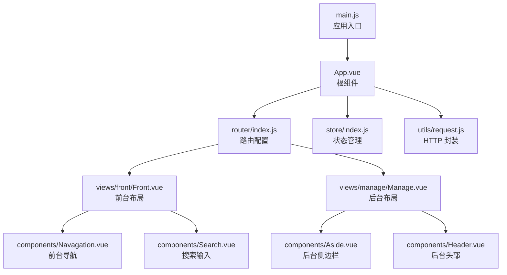
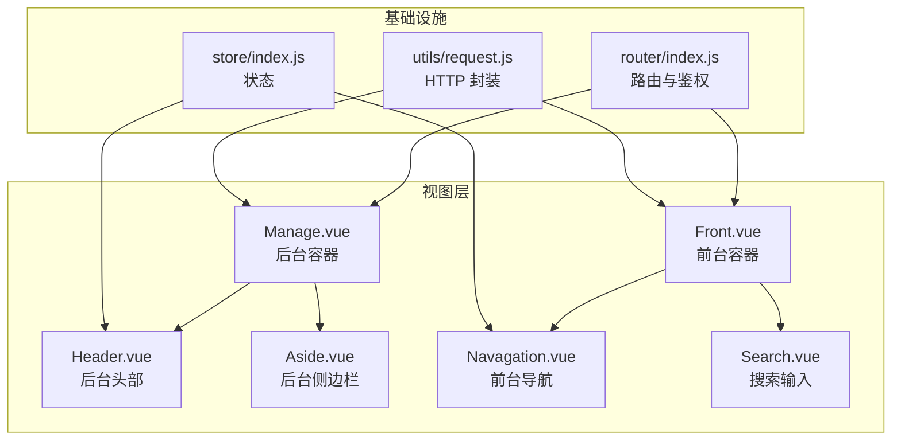
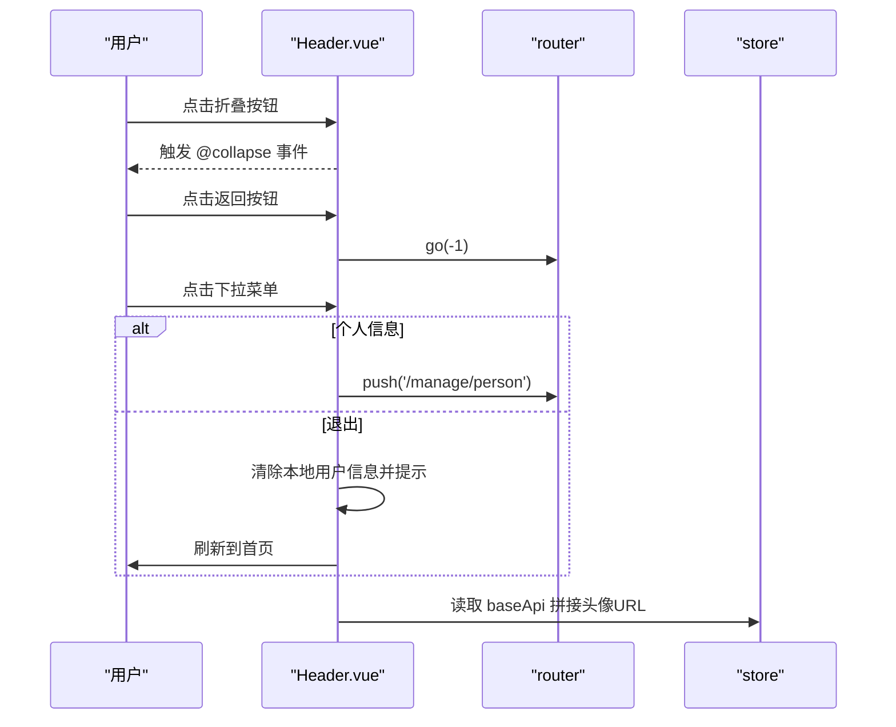
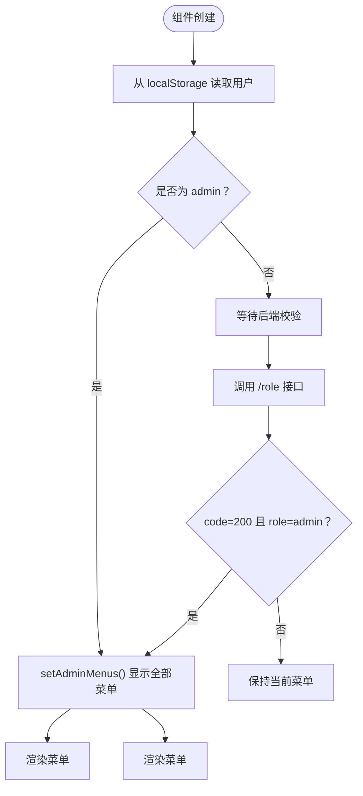
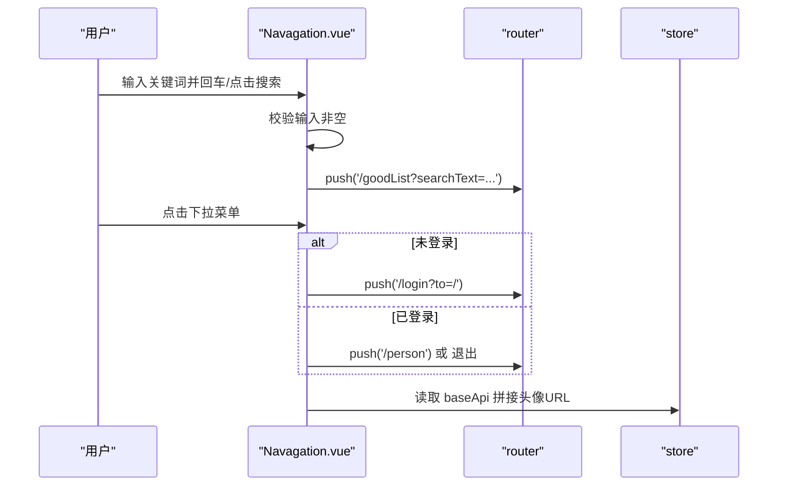
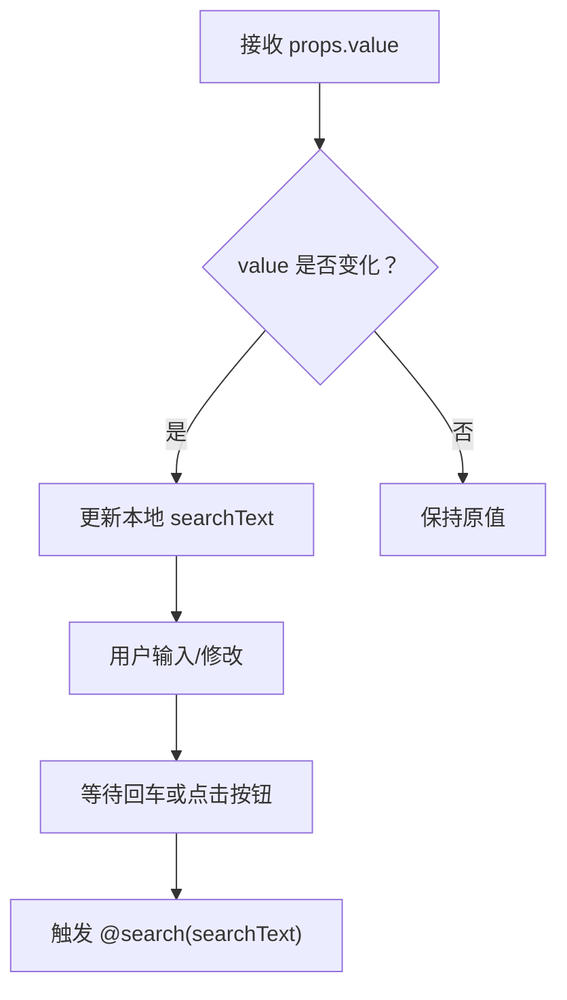
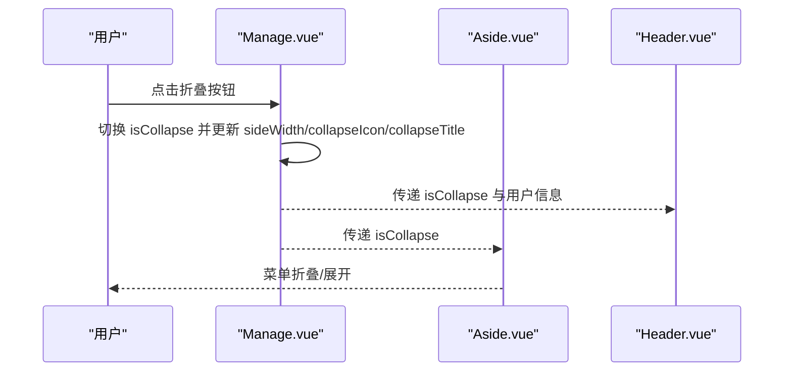
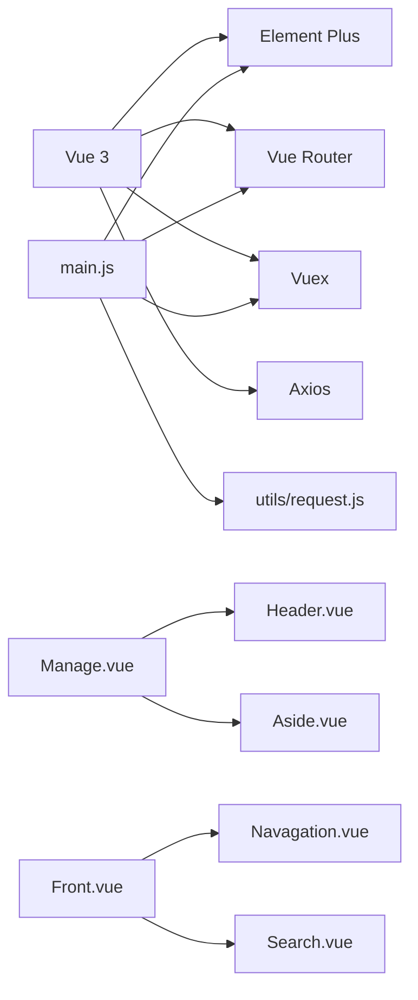

# 组件系统设计

<cite>
**本文引用的文件**
- [Header.vue](file://mall-web/src/components/Header.vue)
- [Aside.vue](file://mall-web/src/components/Aside.vue)
- [Navagation.vue](file://mall-web/src/components/Navagation.vue)
- [Search.vue](file://mall-web/src/components/Search.vue)
- [Front.vue](file://mall-web/src/views/front/Front.vue)
- [Manage.vue](file://mall-web/src/views/manage/Manage.vue)
- [App.vue](file://mall-web/src/App.vue)
- [main.js](file://mall-web/src/main.js)
- [router/index.js](file://mall-web/src/router/index.js)
- [store/index.js](file://mall-web/src/store/index.js)
- [utils/request.js](file://mall-web/src/utils/request.js)
- [vue.config.js](file://mall-web/vue.config.js)
- [package.json](file://mall-web/package.json)
</cite>

## 目录
1. [简介](#简介)
2. [项目结构](#项目结构)
3. [核心组件](#核心组件)
4. [架构总览](#架构总览)
5. [详细组件分析](#详细组件分析)
6. [依赖关系分析](#依赖关系分析)
7. [性能考虑](#性能考虑)
8. [故障排查指南](#故障排查指南)
9. [结论](#结论)
10. [附录](#附录)

## 简介
本文件系统化梳理了基于 Vue 3 + Element Plus 的组件化前端架构，重点覆盖以下方面：
- 单文件组件（.vue）结构与编写规范
- 公共组件设计：Header、Aside、Navagation、Search 的职责、参数与行为
- 组件间通信机制：props、事件发射、插槽、provide/inject 的使用场景
- 生命周期与状态管理：路由守卫、Vuex 状态、全局属性注入
- 可复用性与参数化：通过 props、计算属性、条件渲染提升通用性
- 样式封装与主题定制：scoped 样式、CSS 变量、第三方样式覆盖
- 开发规范与最佳实践：命名约定、代码风格、文档注释

## 项目结构
前端采用 Vue CLI 生成的目录结构，核心入口为 main.js，应用挂载于 App.vue；页面由 Vue Router 管理，状态由 Vuex 管理，网络请求通过 axios 封装。

**图表来源**
- [main.js:1-18](file://mall-web/src/main.js#L1-L18)
- [App.vue:1-21](file://mall-web/src/App.vue#L1-L21)
- [router/index.js:1-161](file://mall-web/src/router/index.js#L1-L161)
- [store/index.js:1-21](file://mall-web/src/store/index.js#L1-L21)
- [utils/request.js:1-55](file://mall-web/src/utils/request.js#L1-L55)
- [Front.vue:1-79](file://mall-web/src/views/front/Front.vue#L1-L79)
- [Manage.vue:1-111](file://mall-web/src/views/manage/Manage.vue#L1-L111)
- [Navagation.vue:1-171](file://mall-web/src/components/Navagation.vue#L1-L171)
- [Search.vue:1-46](file://mall-web/src/components/Search.vue#L1-L46)
- [Aside.vue:1-203](file://mall-web/src/components/Aside.vue#L1-L203)
- [Header.vue:1-93](file://mall-web/src/components/Header.vue#L1-L93)

**章节来源**
- [main.js:1-18](file://mall-web/src/main.js#L1-L18)
- [App.vue:1-21](file://mall-web/src/App.vue#L1-L21)
- [router/index.js:1-161](file://mall-web/src/router/index.js#L1-L161)
- [store/index.js:1-21](file://mall-web/src/store/index.js#L1-L21)
- [utils/request.js:1-55](file://mall-web/src/utils/request.js#L1-L55)

## 核心组件
- Header（后台头部）
  - 职责：展示面包屑、用户下拉菜单、折叠侧边栏触发
  - 关键 props：collapseIcon、collapseTitle、user
  - 关键事件：@collapse
  - 关键逻辑：监听路由 meta.path 更新面包屑；读取 store.baseApi 拼接头像地址
- Aside（后台侧边栏）
  - 职责：按角色动态渲染菜单项与分组
  - 关键 props：isCollapse
  - 关键逻辑：优先从 localStorage 读取角色快速渲染，再异步校验后端 /role
  - 权限控制：通过 menuFlags 控制各菜单显隐
- Navagation（前台导航）
  - 职责：前台主导航、搜索、用户下拉
  - 关键 props：user、loginStatus、role
  - 关键事件：搜索回车或点击按钮触发路由跳转
  - 关键逻辑：根据登录状态与角色控制菜单项显隐
- Search（搜索输入）
  - 职责：输入关键词并通过事件向上抛出
  - 关键 props：value（双向绑定兼容）
  - 关键逻辑：watch 同步父组件传入的初始值

**章节来源**
- [Header.vue:1-93](file://mall-web/src/components/Header.vue#L1-L93)
- [Aside.vue:1-203](file://mall-web/src/components/Aside.vue#L1-L203)
- [Navagation.vue:1-171](file://mall-web/src/components/Navagation.vue#L1-L171)
- [Search.vue:1-46](file://mall-web/src/components/Search.vue#L1-L46)

## 架构总览
前端采用“布局组件 + 页面视图”的分层设计：
- 布局组件：Manage.vue（后台容器）、Front.vue（前台容器）
- 功能组件：Header、Aside、Navagation、Search
- 路由与鉴权：router/index.js 在进入路由前进行权限校验
- 状态与网络：store/index.js 提供基础 API 地址；utils/request.js 注入 token 并统一封装响应

**图表来源**
- [Manage.vue:1-111](file://mall-web/src/views/manage/Manage.vue#L1-L111)
- [Front.vue:1-79](file://mall-web/src/views/front/Front.vue#L1-L79)
- [router/index.js:1-161](file://mall-web/src/router/index.js#L1-L161)
- [store/index.js:1-21](file://mall-web/src/store/index.js#L1-L21)
- [utils/request.js:1-55](file://mall-web/src/utils/request.js#L1-L55)

## 详细组件分析

### Header 组件
- 结构与职责
  - 模板：左侧折叠按钮、返回按钮、面包屑；右侧用户下拉菜单
  - 交互：点击折叠按钮触发 @collapse；点击下拉菜单项跳转或退出
- 参数与事件
  - props：collapseIcon、collapseTitle、user
  - emits：collapse
- 生命周期与数据
  - created 初始化面包屑路径；watch 监听路由变化更新
  - data 中读取 store.state.baseApi 用于拼接头像地址
- 样式与主题
  - scoped 样式定义头像尺寸与位置
- 可复用性
  - 通过 props 传入图标、标题、用户信息，适配不同布局

**图表来源**
- [Header.vue:1-93](file://mall-web/src/components/Header.vue#L1-L93)
- [store/index.js:1-21](file://mall-web/src/store/index.js#L1-L21)

**章节来源**
- [Header.vue:1-93](file://mall-web/src/components/Header.vue#L1-L93)
- [store/index.js:1-21](file://mall-web/src/store/index.js#L1-L21)

### Aside 组件
- 结构与职责
  - 使用 el-menu 渲染多级菜单，支持折叠与路由跳转
  - 通过 v-if 控制菜单分组与条目显隐
- 权限与角色
  - created 阶段优先从 localStorage 读取用户并设置 admin 菜单
  - 再调用 /role 接口二次确认角色，确保安全
- 计算属性
  - fileGroup、incomeGroup 用于合并子菜单显示逻辑
- 样式与主题
  - gradient-menu 自定义渐变背景与 hover/active 效果，使用深度选择器覆盖 Element Plus 默认样式

**图表来源**
- [Aside.vue:1-203](file://mall-web/src/components/Aside.vue#L1-L203)

**章节来源**
- [Aside.vue:1-203](file://mall-web/src/components/Aside.vue#L1-L203)

### Navagation 组件
- 结构与职责
  - 顶部横向导航、搜索框、用户下拉菜单
  - 根据登录状态与角色控制菜单项显隐
- 交互与事件
  - 输入框支持回车触发搜索；点击按钮触发搜索
  - 登录/退出跳转
- 参数与状态
  - props：user、loginStatus、role
  - 使用 ref 与 useStore/useRouter 管理状态与导航

**图表来源**
- [Navagation.vue:1-171](file://mall-web/src/components/Navagation.vue#L1-L171)
- [store/index.js:1-21](file://mall-web/src/store/index.js#L1-L21)

**章节来源**
- [Navagation.vue:1-171](file://mall-web/src/components/Navagation.vue#L1-L171)
- [store/index.js:1-21](file://mall-web/src/store/index.js#L1-L21)

### Search 组件
- 结构与职责
  - 简洁的输入框与按钮，支持回车触发搜索
- 参数与事件
  - props：value（默认空串）
  - emits：search（携带当前文本）
- 双向绑定与同步
  - data 中维护本地 searchText，并通过 watch 同步父组件传入的 value

**图表来源**
- [Search.vue:1-46](file://mall-web/src/components/Search.vue#L1-L46)

**章节来源**
- [Search.vue:1-46](file://mall-web/src/components/Search.vue#L1-L46)

### 布局容器组件
- Manage.vue（后台容器）
  - 承载 Aside 与 Header，控制侧边栏折叠与宽度
  - 通过 @collapse 事件切换 isCollapse，并动态调整 sideWidth 与图标/标题
- Front.vue（前台容器）
  - 承载 Navagation 与内容区，负责用户信息与角色状态初始化
  - 通过 getUser 从后端刷新用户信息

**图表来源**
- [Manage.vue:1-111](file://mall-web/src/views/manage/Manage.vue#L1-L111)
- [Aside.vue:1-203](file://mall-web/src/components/Aside.vue#L1-L203)
- [Header.vue:1-93](file://mall-web/src/components/Header.vue#L1-L93)

**章节来源**
- [Manage.vue:1-111](file://mall-web/src/views/manage/Manage.vue#L1-L111)
- [Front.vue:1-79](file://mall-web/src/views/front/Front.vue#L1-L79)

## 依赖关系分析
- 组件依赖
  - Manage.vue 依赖 Header、Aside
  - Front.vue 依赖 Navagation、Search
- 外部依赖
  - Element Plus（UI 组件库）
  - Vue Router（路由）
  - Vuex（状态）
  - Axios（HTTP）
- 运行时注入
  - main.js 中 app.config.globalProperties.request = request，使组件可通过 this.request 调用

**图表来源**
- [main.js:1-18](file://mall-web/src/main.js#L1-L18)
- [package.json:1-32](file://mall-web/package.json#L1-L32)
- [Manage.vue:1-111](file://mall-web/src/views/manage/Manage.vue#L1-L111)
- [Front.vue:1-79](file://mall-web/src/views/front/Front.vue#L1-L79)

**章节来源**
- [main.js:1-18](file://mall-web/src/main.js#L1-L18)
- [package.json:1-32](file://mall-web/package.json#L1-L32)

## 性能考虑
- 路由懒加载：路由配置中使用动态导入，减少首屏体积
- 组件懒加载：视图组件按需加载，降低初始渲染压力
- 本地角色缓存：Aside 与 Front 优先从 localStorage 读取角色，避免闪烁与重复请求
- 请求拦截：统一注入 token，减少重复代码与错误处理成本
- 样式作用域：使用 scoped 避免全局污染，同时通过深度选择器可控覆盖第三方样式

[本节为通用建议，无需特定文件引用]

## 故障排查指南
- 登录状态失效
  - 现象：接口返回 401，弹窗提示并跳转登录
  - 定位：utils/request.js 响应拦截器对 401 的处理
  - 处理：清除本地用户信息，刷新页面
- 路由权限不足
  - 现象：访问后台路由被拦截，提示无权限或跳转首页
  - 定位：router/index.js beforeEach 对 requireAuth 的校验
  - 处理：确认本地 token 有效，后端 /role 返回正确角色
- 头像地址为空
  - 现象：头像显示异常
  - 定位：Header 与 Navagation 读取 store.state.baseApi 拼接地址
  - 处理：确保 store 中 baseApi 已设置，或后端返回完整 URL

**章节来源**
- [utils/request.js:1-55](file://mall-web/src/utils/request.js#L1-L55)
- [router/index.js:1-161](file://mall-web/src/router/index.js#L1-L161)
- [store/index.js:1-21](file://mall-web/src/store/index.js#L1-L21)

## 结论
该组件系统以布局组件为核心，结合功能组件与路由/状态/网络三层基础设施，实现了清晰的职责分离与良好的可复用性。通过 props、事件、插槽与路由守卫等机制，组件间通信与权限控制得到统一规范。建议后续在以下方面持续优化：
- 将 store 中的 baseApi 通过 action 注入或环境变量配置，避免硬编码
- 为 Header、Navagation、Search 组件补充 TypeScript 类型定义
- 抽离通用的权限指令与混入，进一步减少重复逻辑
- 增加单元测试与组件文档，提升可维护性

[本节为总结性内容，无需特定文件引用]

## 附录

### 单文件组件（.vue）结构与编写规范
- 模板（template）
  - 使用 Element Plus 组件，遵循语义化标签与可访问性
  - 事件绑定使用小驼峰命名，避免内联复杂逻辑
- 脚本（script）
  - Vue 3 Composition API：优先使用 <script setup> 与组合式函数
  - 明确 props 类型与默认值，使用 defineProps/defineEmits
  - 使用 ref/reactive 管理响应式数据，computed/computed 管理派生状态
- 样式（style）
  - 优先使用 scoped，必要时使用深度选择器覆盖第三方样式
  - 避免在组件内部写全局样式，统一放置于全局 CSS 或主题变量

[本节为通用规范，无需特定文件引用]

### 组件间通信机制
- Props 传递
  - Header/Aside/Navagation/Search 均通过 props 接收外部数据，保证可复用性
- 事件发射
  - Header 发射 collapse；Search 发射 search；Navagation 发射登录/退出行为
- 插槽（slot）
  - 当前组件未使用具名/作用域插槽，若需扩展可引入
- Provide/Inject
  - 当前未使用，可在跨层级共享配置时引入

[本节为通用说明，无需特定文件引用]

### 生命周期与状态管理
- 生命周期
  - Header：created 初始化面包屑；watch 监听路由变化
  - Aside：created 读取本地角色并设置菜单；mounted 空置
  - Navagation：onMounted 初始化用户与角色；通过 getUser 刷新用户信息
- 状态管理
  - store/index.js 提供 baseApi；main.js 注入全局 request
  - router/index.js 管理鉴权与页面标题

**章节来源**
- [Header.vue:1-93](file://mall-web/src/components/Header.vue#L1-L93)
- [Aside.vue:1-203](file://mall-web/src/components/Aside.vue#L1-L203)
- [Navagation.vue:1-171](file://mall-web/src/components/Navagation.vue#L1-L171)
- [store/index.js:1-21](file://mall-web/src/store/index.js#L1-L21)
- [main.js:1-18](file://mall-web/src/main.js#L1-L18)
- [router/index.js:1-161](file://mall-web/src/router/index.js#L1-L161)

### 可复用性设计与参数化配置
- 参数化
  - 通过 props 传入图标、标题、用户信息、登录状态、角色等
- 条件渲染
  - v-if 控制菜单与按钮显隐，减少不必要的 DOM
- 计算属性
  - fileGroup、incomeGroup 合并子菜单显示逻辑，提升可维护性

**章节来源**
- [Aside.vue:1-203](file://mall-web/src/components/Aside.vue#L1-L203)
- [Navagation.vue:1-171](file://mall-web/src/components/Navagation.vue#L1-L171)

### 样式封装与主题定制
- scoped 样式：避免全局污染
- 深度选择器：覆盖 Element Plus 默认样式，实现渐变菜单与 hover/active 效果
- 全局样式：通过 main.js 引入全局 CSS 与字体图标

**章节来源**
- [Aside.vue:1-203](file://mall-web/src/components/Aside.vue#L1-L203)
- [main.js:1-18](file://mall-web/src/main.js#L1-L18)

### 组件开发规范与最佳实践
- 命名约定
  - 组件文件名使用 PascalCase；模板根节点使用语义化标签
- 代码风格
  - 使用 Composition API；避免在模板中写复杂表达式
- 文档注释
  - 为 props、events、methods 添加简要注释，便于协作与维护
- 安全与健壮性
  - 对外链地址进行空值判断；对用户输入进行 trim 与长度校验
- 性能
  - 合理使用 v-if/v-show；避免在渲染函数中进行重型计算

[本节为通用规范，无需特定文件引用]