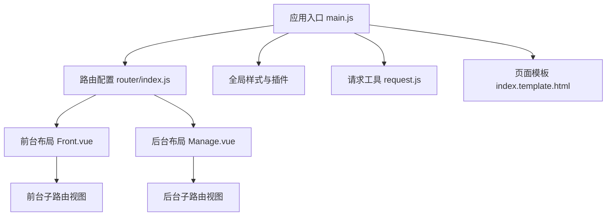
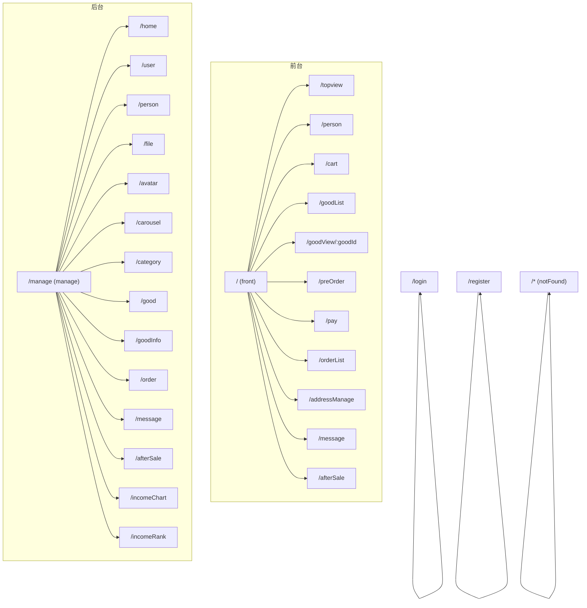
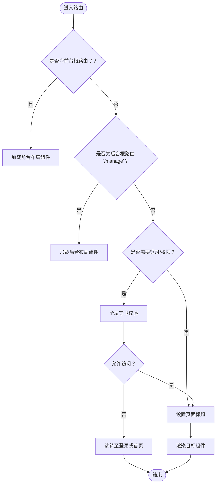
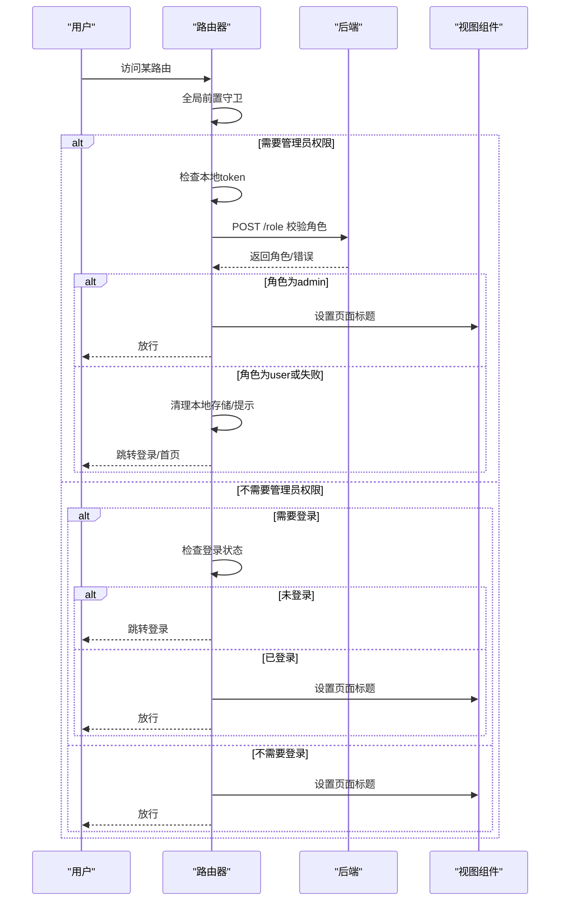
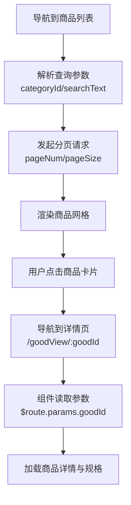
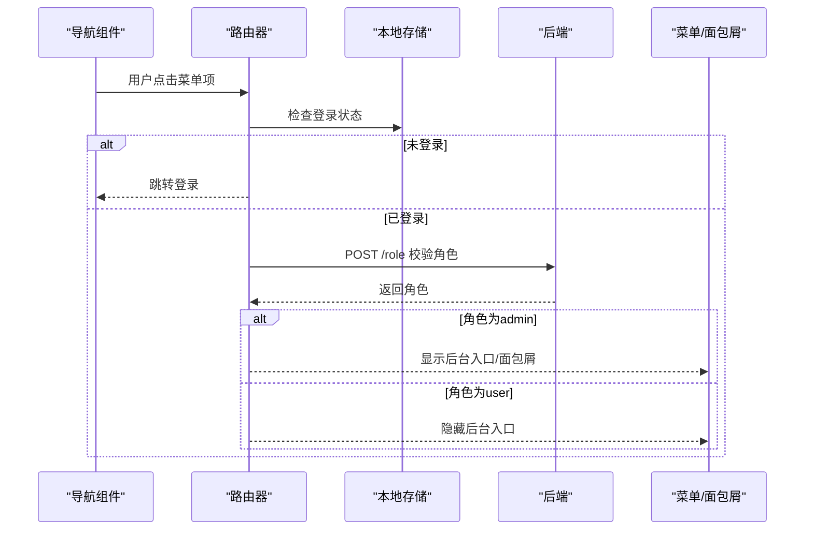
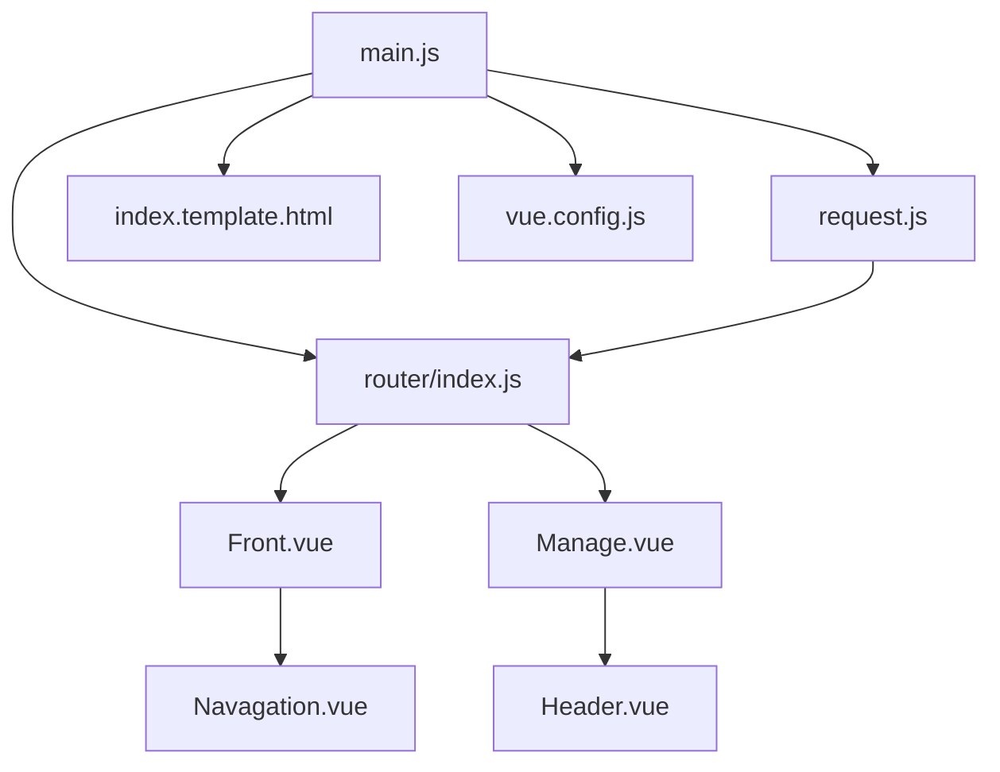

# 路由系统设计

<cite>
**本文档引用的文件**
- [router/index.js](file://mall-web/src/router/index.js)
- [main.js](file://mall-web/src/main.js)
- [package.json](file://mall-web/package.json)
- [vue.config.js](file://mall-web/vue.config.js)
- [Front.vue](file://mall-web/src/views/front/Front.vue)
- [Manage.vue](file://mall-web/src/views/manage/Manage.vue)
- [request.js](file://mall-web/src/utils/request.js)
- [index.template.html](file://mall-web/public/index.template.html)
- [GoodView.vue](file://mall-web/src/views/front/good/GoodView.vue)
- [GoodList.vue](file://mall-web/src/views/front/good/GoodList.vue)
- [Navagation.vue](file://mall-web/src/components/Navagation.vue)
- [Header.vue](file://mall-web/src/components/Header.vue)
- [App.vue](file://mall-web/src/App.vue)
- [store/index.js](file://mall-web/src/store/index.js)
</cite>

## 目录
1. [简介](#简介)
2. [项目结构](#项目结构)
3. [核心组件](#核心组件)
4. [架构总览](#架构总览)
5. [详细组件分析](#详细组件分析)
6. [依赖关系分析](#依赖关系分析)
7. [性能考虑](#性能考虑)
8. [故障排查指南](#故障排查指南)
9. [结论](#结论)
10. [附录](#附录)

## 简介
本文件系统性梳理并阐述该电商项目的前端路由体系，覆盖路由表定义、嵌套路由设计、导航守卫机制、懒加载与性能优化、参数传递与元信息使用、动态配置与权限控制、面包屑与页面标题动态设置、SEO优化方案以及开发最佳实践。目标是帮助开发者快速理解并高效维护路由系统。

## 项目结构
- 路由入口与配置位于 [router/index.js](file://mall-web/src/router/index.js)，采用 Vue Router 4.x 的历史模式与按需加载。
- 应用挂载于 [main.js](file://mall-web/src/main.js)，引入 Element Plus、Vuex Store，并注入全局请求工具。
- 构建与开发服务器配置见 [vue.config.js](file://mall-web/vue.config.js)，包含代理与页面标题模板。
- 页面级视图组件分别位于 [Front.vue](file://mall-web/src/views/front/Front.vue) 和 [Manage.vue](file://mall-web/src/views/manage/Manage.vue)，均通过 `<router-view>` 承载子路由内容。
- 全局网络请求封装在 [request.js](file://mall-web/src/utils/request.js)，统一处理 token 注入与 401 错误跳转。
- 页面模板与标题由 [index.template.html](file://mall-web/public/index.template.html) 提供。

**图表来源**
- [main.js:1-18](file://mall-web/src/main.js#L1-L18)
- [router/index.js:1-161](file://mall-web/src/router/index.js#L1-L161)
- [Front.vue:1-79](file://mall-web/src/views/front/Front.vue#L1-L79)
- [Manage.vue:1-111](file://mall-web/src/views/manage/Manage.vue#L1-L111)
- [request.js:1-55](file://mall-web/src/utils/request.js#L1-L55)
- [index.template.html:1-24](file://mall-web/public/index.template.html#L1-L24)

**章节来源**
- [main.js:1-18](file://mall-web/src/main.js#L1-L18)
- [router/index.js:1-161](file://mall-web/src/router/index.js#L1-L161)
- [vue.config.js:1-26](file://mall-web/vue.config.js#L1-L26)

## 核心组件
- 路由表与导航守卫：集中于 [router/index.js](file://mall-web/src/router/index.js)，定义了前台/后台两级嵌套路由、登录/注册/404 等页面路由，并实现全局前置守卫进行权限校验与页面标题设置。
- 前台布局与导航：[Front.vue](file://mall-web/src/views/front/Front.vue) 作为前台根布局，承载前台子路由；导航组件 [Navagation.vue](file://mall-web/src/components/Navagation.vue) 提供搜索与菜单跳转。
- 后台布局与面包屑：[Manage.vue](file://mall-web/src/views/manage/Manage.vue) 作为后台根布局；面包屑组件 [Header.vue](file://mall-web/src/components/Header.vue) 展示路径层级。
- 参数传递与查询处理：商品详情 [GoodView.vue](file://mall-web/src/views/front/good/GoodView.vue) 使用路由参数 goodId；商品列表 [GoodList.vue](file://mall-web/src/views/front/good/GoodList.vue) 使用查询参数 categoryId/searchText 并监听路由变化。
- 全局请求与鉴权：[request.js](file://mall-web/src/utils/request.js) 在请求头注入 token，并在 401 时统一跳转登录。
- 页面标题与 SEO：全局守卫设置 document.title；页面模板 [index.template.html](file://mall-web/public/index.template.html) 提供基础模板；构建配置 [vue.config.js](file://mall-web/vue.config.js) 定义页面标题。

**章节来源**
- [router/index.js:4-77](file://mall-web/src/router/index.js#L4-L77)
- [router/index.js:84-150](file://mall-web/src/router/index.js#L84-L150)
- [Front.vue:1-79](file://mall-web/src/views/front/Front.vue#L1-L79)
- [Manage.vue:1-111](file://mall-web/src/views/manage/Manage.vue#L1-L111)
- [Navagation.vue:1-171](file://mall-web/src/components/Navagation.vue#L1-L171)
- [Header.vue:1-32](file://mall-web/src/components/Header.vue#L1-L32)
- [GoodView.vue:199-208](file://mall-web/src/views/front/good/GoodView.vue#L199-L208)
- [GoodList.vue:123-142](file://mall-web/src/views/front/good/GoodList.vue#L123-L142)
- [request.js:13-50](file://mall-web/src/utils/request.js#L13-L50)
- [index.template.html:8-14](file://mall-web/public/index.template.html#L8-L14)
- [vue.config.js:17-24](file://mall-web/vue.config.js#L17-L24)

## 架构总览
路由系统采用“根路由 + 子路由”的分层设计，前台与后台分别以独立根路由承载，子路由通过懒加载按需加载，减少首屏体积。全局守卫负责权限校验与标题设置，配合请求拦截器实现统一鉴权与错误处理。

**图表来源**
- [router/index.js:4-77](file://mall-web/src/router/index.js#L4-L77)

## 详细组件分析

### 路由表与嵌套路由设计
- 根路由划分：前台根路由 `/` 与后台根路由 `/manage`，分别对应前台布局与后台布局组件。
- 子路由组织：前台与后台均通过 children 定义子路由，形成清晰的层级关系；部分页面如登录/注册/404 为独立页面，不参与嵌套。
- 懒加载策略：子路由组件均采用动态导入，结合 webpackChunkName 实现按需打包与命名，便于调试与性能分析。

**图表来源**
- [router/index.js:84-150](file://mall-web/src/router/index.js#L84-L150)

**章节来源**
- [router/index.js:4-77](file://mall-web/src/router/index.js#L4-L77)

### 导航守卫机制
- 全局前置守卫：在 [router/index.js](file://mall-web/src/router/index.js) 中实现，依据 meta.requireAuth 与 meta.requireLogin 判断是否需要登录或管理员权限；若需要登录但未登录则跳转登录页；若需要管理员权限则调用后端 /role 接口校验角色，失败则清理本地存储并提示重新登录；最后根据 meta.title 动态设置页面标题。
- 组件内守卫：当前项目未使用组件内的 beforeRouteEnter/beforeRouteUpdate/beforeRouteLeave，主要依赖全局守卫完成权限控制。
- 路由独享守卫：当前项目未使用 beforeEach/beforeResolve/afterEach 等路由级守卫，权限控制集中在全局守卫中。

**图表来源**
- [router/index.js:84-150](file://mall-web/src/router/index.js#L84-L150)

**章节来源**
- [router/index.js:84-150](file://mall-web/src/router/index.js#L84-L150)

### 路由懒加载与性能优化
- 懒加载实现：子路由组件均使用动态导入，结合 webpackChunkName 进行命名，例如登录/注册/404 页面的注释块用于生成独立 chunk。
- 性能建议：
  - 保持路由分层清晰，避免过深嵌套导致初始加载压力。
  - 对大组件继续拆分，利用路由级别的代码分割。
  - 结合浏览器缓存策略与 CDN，提升二次加载速度。
  - 使用路由元信息控制预加载策略（如仅在需要时加载）。

**章节来源**
- [router/index.js:10-11](file://mall-web/src/router/index.js#L10-L11)
- [router/index.js:59](file://mall-web/src/router/index.js#L59)
- [router/index.js:67](file://mall-web/src/router/index.js#L67)
- [router/index.js:75](file://mall-web/src/router/index.js#L75)

### 路由参数传递、查询参数与元信息
- 路由参数：商品详情页通过路径参数传递 id，如 `/goodView/:goodId`，组件内通过 `$route.params.goodId` 获取。
- 查询参数：商品列表页通过查询参数传递筛选条件，如 `?categoryId=...&searchText=...`，组件内通过 `$route.query` 获取并监听路由变化以刷新数据。
- 元信息：各路由 meta 中包含 title、requireAuth、requireLogin、path 等字段，用于全局守卫与页面标题设置。

**图表来源**
- [GoodList.vue:123-142](file://mall-web/src/views/front/good/GoodList.vue#L123-L142)
- [GoodView.vue:248-251](file://mall-web/src/views/front/good/GoodView.vue#L248-L251)

**章节来源**
- [GoodList.vue:123-142](file://mall-web/src/views/front/good/GoodList.vue#L123-L142)
- [GoodView.vue:199-208](file://mall-web/src/views/front/good/GoodView.vue#L199-L208)
- [router/index.js:11-11](file://mall-web/src/router/index.js#L11-L11)
- [router/index.js:33-33](file://mall-web/src/router/index.js#L33-L33)

### 动态配置与权限控制集成
- 权限控制：全局守卫根据 meta.requireAuth 与本地 token 决定是否放行；管理员权限通过后端 /role 接口二次校验；登录状态失效时统一清理本地存储并跳转登录。
- 动态菜单：前台导航组件根据登录状态与角色动态显示后台管理入口；后台面包屑根据当前路由路径展示层级。
- 请求拦截：请求拦截器自动注入 token，响应拦截器在 401 时统一处理并跳转登录，确保前后端一致的鉴权体验。

**图表来源**
- [Navagation.vue:37-42](file://mall-web/src/components/Navagation.vue#L37-L42)
- [Header.vue:10-13](file://mall-web/src/components/Header.vue#L10-L13)
- [router/index.js:88-127](file://mall-web/src/router/index.js#L88-L127)
- [request.js:38-44](file://mall-web/src/utils/request.js#L38-L44)

**章节来源**
- [Navagation.vue:37-42](file://mall-web/src/components/Navagation.vue#L37-L42)
- [Header.vue:10-13](file://mall-web/src/components/Header.vue#L10-L13)
- [router/index.js:88-127](file://mall-web/src/router/index.js#L88-L127)
- [request.js:38-44](file://mall-web/src/utils/request.js#L38-L44)

### 面包屑导航与页面标题动态设置
- 面包屑：后台头部组件 [Header.vue](file://mall-web/src/components/Header.vue) 使用 Element UI 的面包屑组件，固定首页与当前路由路径，实现层级导航。
- 页面标题：全局守卫在进入路由时根据 meta.title 设置 document.title，确保浏览器标签页与页面内容一致。

**章节来源**
- [Header.vue:10-13](file://mall-web/src/components/Header.vue#L10-L13)
- [router/index.js:121-125](file://mall-web/src/router/index.js#L121-L125)

### SEO 优化方案
- 页面标题：通过全局守卫与模板 [index.template.html](file://mall-web/public/index.template.html) 的 title 字段，确保每个页面具有明确的标题。
- 构建配置：在 [vue.config.js](file://mall-web/vue.config.js) 中定义页面标题，开发与生产环境可统一管理。
- 建议扩展：可结合路由元信息中的 path 字段生成面包屑结构化数据，或在服务端渲染场景下配合预取数据以提升 SEO 表现。

**章节来源**
- [index.template.html:12-14](file://mall-web/public/index.template.html#L12-L14)
- [vue.config.js:17-24](file://mall-web/vue.config.js#L17-L24)
- [router/index.js:11-11](file://mall-web/src/router/index.js#L11-L11)

## 依赖关系分析
- 路由依赖：应用入口依赖路由模块；前台/后台布局依赖路由视图；导航与面包屑组件依赖路由实例与全局状态。
- 请求依赖：全局请求工具依赖路由实例以便在 401 时跳转登录；路由守卫依赖请求工具进行角色校验。
- 构建依赖：开发服务器代理配置与页面标题模板影响运行时行为。

**图表来源**
- [main.js:1-18](file://mall-web/src/main.js#L1-L18)
- [router/index.js:1-161](file://mall-web/src/router/index.js#L1-L161)
- [Front.vue:1-79](file://mall-web/src/views/front/Front.vue#L1-L79)
- [Manage.vue:1-111](file://mall-web/src/views/manage/Manage.vue#L1-L111)
- [Navagation.vue:1-171](file://mall-web/src/components/Navagation.vue#L1-L171)
- [Header.vue:1-32](file://mall-web/src/components/Header.vue#L1-L32)
- [request.js:1-55](file://mall-web/src/utils/request.js#L1-L55)
- [index.template.html:1-24](file://mall-web/public/index.template.html#L1-L24)
- [vue.config.js:1-26](file://mall-web/vue.config.js#L1-L26)

**章节来源**
- [main.js:1-18](file://mall-web/src/main.js#L1-L18)
- [router/index.js:1-161](file://mall-web/src/router/index.js#L1-L161)

## 性能考虑
- 代码分割：使用动态导入与命名 chunk，降低首屏加载体积。
- 路由懒加载：仅在访问时加载对应组件，提升交互流畅度。
- 缓存策略：结合浏览器缓存与 CDN，减少重复资源加载。
- 请求拦截：统一对 401 错误处理，避免重复鉴权开销。

[本节为通用指导，无需特定文件引用]

## 故障排查指南
- 登录状态异常：检查本地存储中的用户信息与 token 是否存在；若后端返回 401，请求拦截器会清理本地存储并弹窗提示。
- 权限不足：全局守卫会在角色校验失败时清理本地存储并跳转登录；确认 /role 接口返回值与前端逻辑一致。
- 页面标题未更新：确认路由 meta.title 是否正确设置；全局守卫应在进入路由时设置 document.title。
- 路由参数丢失：检查导航时是否正确传递 params/query；组件内通过 $route.params/$route.query 读取。

**章节来源**
- [request.js:38-44](file://mall-web/src/utils/request.js#L38-L44)
- [router/index.js:111-117](file://mall-web/src/router/index.js#L111-L117)
- [router/index.js:142-146](file://mall-web/src/router/index.js#L142-L146)

## 结论
该路由系统通过清晰的分层设计、完善的全局守卫与懒加载策略，实现了良好的权限控制、用户体验与性能表现。建议在后续迭代中补充组件内守卫与路由级守卫的使用场景，进一步细化参数校验与错误处理策略，并探索更多 SEO 优化手段。

[本节为总结性内容，无需特定文件引用]

## 附录

### 最佳实践清单
- 命名规范：路由名称采用语义化命名，如商品详情使用单数形式，列表使用复数形式；嵌套路由使用层级命名（如 manage.user）。
- 参数校验：在组件内对路由参数进行类型与范围校验，必要时回退到兜底路由。
- 错误处理：统一在全局守卫与请求拦截器中处理 401/403/404 等错误，提供友好提示并引导用户回到安全路径。
- SEO 优化：为每个路由设置 meta.title 与可选的 meta.description；在服务端渲染场景下预取数据。
- 性能优化：保持路由分层合理，避免深层嵌套；对大组件继续拆分；结合缓存与 CDN 提升加载速度。

[本节为通用指导，无需特定文件引用]