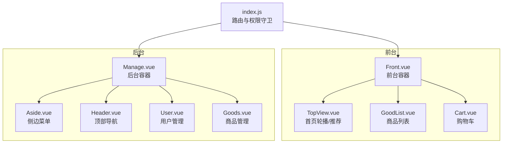
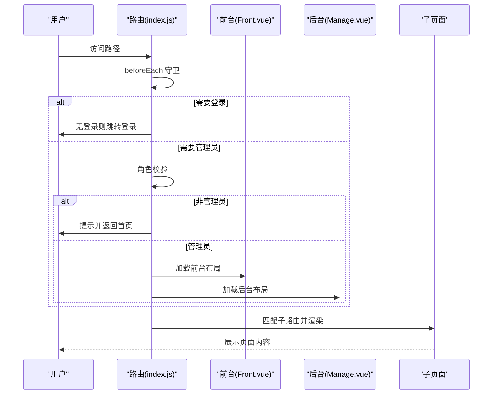
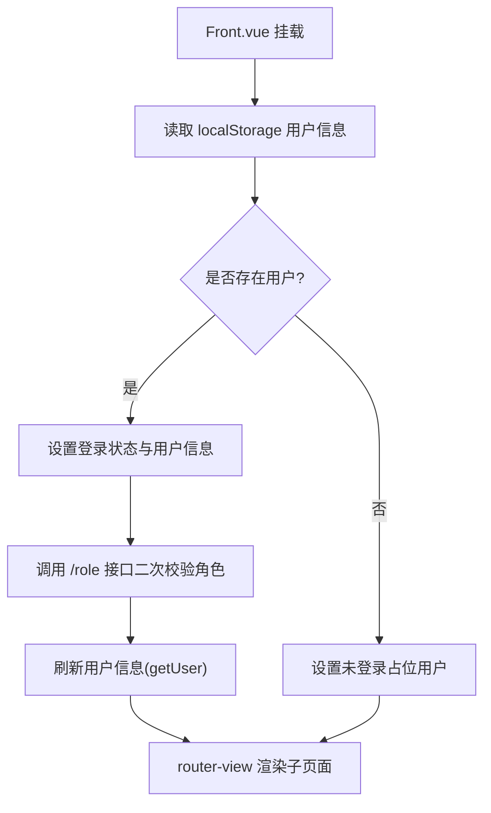
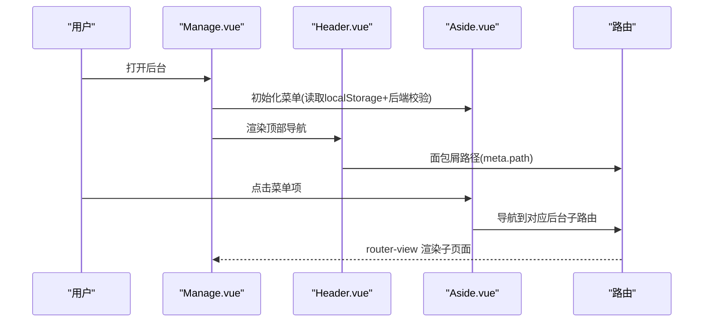
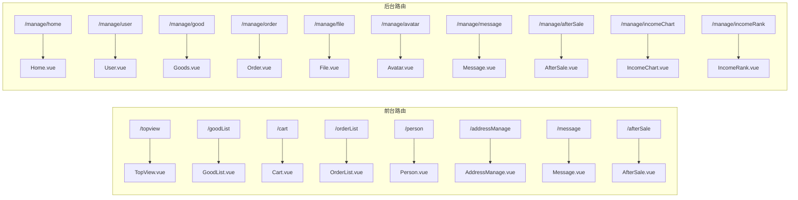
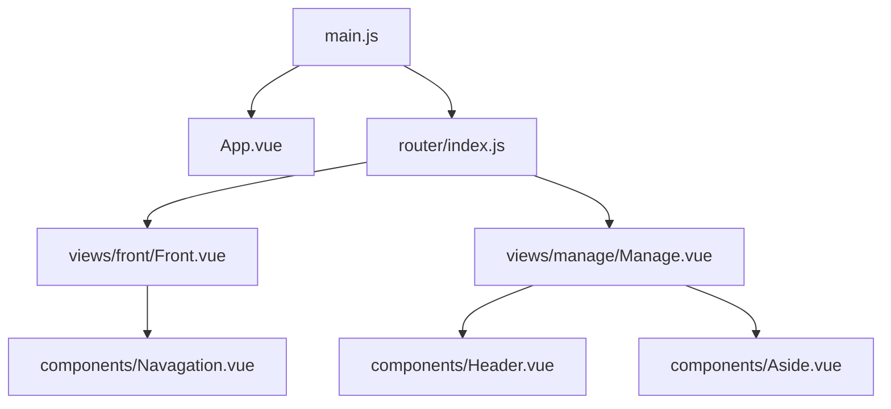

# 页面设计与布局

<cite>
**本文引用的文件**
- [Front.vue](file://mall-web/src/views/front/Front.vue)
- [Manage.vue](file://mall-web/src/views/manage/Manage.vue)
- [Navagation.vue](file://mall-web/src/components/Navagation.vue)
- [Aside.vue](file://mall-web/src/components/Aside.vue)
- [Header.vue](file://mall-web/src/components/Header.vue)
- [index.js](file://mall-web/src/router/index.js)
- [App.vue](file://mall-web/src/App.vue)
- [main.js](file://mall-web/src/main.js)
- [404NotFound.vue](file://mall-web/src/views/404NotFound.vue)
- [TopView.vue](file://mall-web/src/views/front/TopView.vue)
- [GoodList.vue](file://mall-web/src/views/front/good/GoodList.vue)
- [Cart.vue](file://mall-web/src/views/front/good/Cart.vue)
- [Goods.vue](file://mall-web/src/views/manage/good/Goods.vue)
- [User.vue](file://mall-web/src/views/manage/User.vue)
- [vue.config.js](file://mall-web/vue.config.js)
</cite>

## 目录
1. [引言](#引言)
2. [项目结构](#项目结构)
3. [核心组件](#核心组件)
4. [架构总览](#架构总览)
5. [详细组件分析](#详细组件分析)
6. [依赖分析](#依赖分析)
7. [性能考虑](#性能考虑)
8. [故障排查指南](#故障排查指南)
9. [结论](#结论)
10. [附录](#附录)

## 引言
本文件聚焦于前台与后台页面的设计与布局，围绕主布局组件 Front.vue 与 Manage.vue 的结构与职责进行深入解析，并结合路由配置说明页面间导航关系与权限控制。文档还覆盖 404 页面处理、错误页面设计、响应式布局与移动端适配、页面加载状态与用户体验优化策略，以及页面开发最佳实践与组件复用模式。

## 项目结构
- 前台页面位于 front 目录，包含商品浏览、购物车、订单流程、个人中心、留言与售后等页面。
- 后台页面位于 manage 目录，包含商品管理、用户管理、订单管理、文件管理、数据报表等页面。
- 主布局组件 Front.vue 与 Manage.vue 分别承载前台与后台的容器结构与导航。
- 路由通过 index.js 统一配置，支持权限拦截与动态标题设置。

**图表来源**
- [Front.vue:1-79](file://mall-web/src/views/front/Front.vue#L1-L79)
- [Manage.vue:1-111](file://mall-web/src/views/manage/Manage.vue#L1-L111)
- [TopView.vue:1-359](file://mall-web/src/views/front/TopView.vue#L1-L359)
- [GoodList.vue:1-485](file://mall-web/src/views/front/good/GoodList.vue#L1-L485)
- [Cart.vue:1-165](file://mall-web/src/views/front/good/Cart.vue#L1-L165)
- [index.js:1-161](file://mall-web/src/router/index.js#L1-L161)

**章节来源**
- [index.js:1-161](file://mall-web/src/router/index.js#L1-L161)
- [App.vue:1-21](file://mall-web/src/App.vue#L1-L21)
- [main.js:1-18](file://mall-web/src/main.js#L1-L18)

## 核心组件
- Front.vue：前台主布局，负责顶部导航、主内容区与用户状态初始化，使用 Element Plus 容器布局，内部通过 router-view 嵌套路由。
- Manage.vue：后台主布局，包含侧边栏与顶部导航，支持菜单折叠与面包屑路径展示，内部通过 router-view 嵌套后台子路由。
- Navagation.vue：前台顶部导航组件，包含主导航菜单、搜索框、用户下拉菜单与登录/退出逻辑。
- Aside.vue：后台侧边菜单组件，根据角色动态显示菜单项，支持分组与折叠。
- Header.vue：后台顶部导航组件，包含折叠按钮、面包屑与用户下拉菜单。

**章节来源**
- [Front.vue:1-79](file://mall-web/src/views/front/Front.vue#L1-L79)
- [Manage.vue:1-111](file://mall-web/src/views/manage/Manage.vue#L1-L111)
- [Navagation.vue:1-171](file://mall-web/src/components/Navagation.vue#L1-L171)
- [Aside.vue:1-203](file://mall-web/src/components/Aside.vue#L1-L203)
- [Header.vue:1-93](file://mall-web/src/components/Header.vue#L1-L93)

## 架构总览
前台与后台采用“主布局 + 子页面”的嵌套路由结构，Front.vue 与 Manage.vue 分别作为前台与后台的根视图，内部通过 router-view 动态渲染子路由页面。路由守卫统一处理登录态与角色权限，动态设置页面标题。

**图表来源**
- [index.js:84-150](file://mall-web/src/router/index.js#L84-L150)
- [Front.vue:1-79](file://mall-web/src/views/front/Front.vue#L1-L79)
- [Manage.vue:1-111](file://mall-web/src/views/manage/Manage.vue#L1-L111)

**章节来源**
- [index.js:1-161](file://mall-web/src/router/index.js#L1-L161)

## 详细组件分析

### 前台布局与导航：Front.vue 与 Navagation.vue
- Front.vue
  - 使用 Element Plus 容器布局，头部放置 Navagation，主体区域通过 router-view 渲染当前子路由。
  - 在挂载阶段从 localStorage 读取用户信息，初始化用户、角色与登录状态，并异步二次校验角色。
- Navagation.vue
  - 提供主导航菜单（首页、商品、购物车、我的订单、地址管理、在线留言、售后申请、后台管理），搜索框支持回车与按钮触发跳转至商品列表。
  - 根据登录状态与角色显示/隐藏相关菜单项，下拉菜单提供登录/个人信息/退出功能。

**图表来源**
- [Front.vue:40-69](file://mall-web/src/views/front/Front.vue#L40-L69)

**章节来源**
- [Front.vue:1-79](file://mall-web/src/views/front/Front.vue#L1-L79)
- [Navagation.vue:1-171](file://mall-web/src/components/Navagation.vue#L1-L171)

### 后台布局与导航：Manage.vue、Header.vue 与 Aside.vue
- Manage.vue
  - 左侧 Aside 为后台菜单，右侧 Header 为顶部操作区，中部 router-view 渲染后台子页面。
  - 支持菜单折叠切换，动态调整宽度与图标，面包屑路径来自路由 meta.path。
- Header.vue
  - 提供折叠按钮、返回按钮与面包屑，右侧用户下拉菜单支持个人信息与退出。
- Aside.vue
  - 根据角色动态显示菜单项，支持文件管理、商品管理、订单管理、数据报表等分组菜单。

**图表来源**
- [Manage.vue:1-111](file://mall-web/src/views/manage/Manage.vue#L1-L111)
- [Header.vue:1-93](file://mall-web/src/components/Header.vue#L1-L93)
- [Aside.vue:1-203](file://mall-web/src/components/Aside.vue#L1-L203)
- [index.js:27-51](file://mall-web/src/router/index.js#L27-L51)

**章节来源**
- [Manage.vue:1-111](file://mall-web/src/views/manage/Manage.vue#L1-L111)
- [Header.vue:1-93](file://mall-web/src/components/Header.vue#L1-L93)
- [Aside.vue:1-203](file://mall-web/src/components/Aside.vue#L1-L203)

### 页面功能划分与导航关系
- 前台页面
  - 首页轮播与推荐：TopView.vue
  - 商品浏览：GoodList.vue（支持分类筛选、搜索、分页）
  - 购物车：Cart.vue（列表、空状态、跳转购买）
  - 订单流程：PreOrder.vue、Pay.vue、OrderList.vue
  - 个人中心：Person.vue
  - 地址管理：AddressManage.vue
  - 在线留言：Message.vue
  - 售后申请：AfterSale.vue
- 后台页面
  - 主页：Home.vue
  - 用户管理：User.vue（支持搜索、新增、编辑、删除、批量删除）
  - 商品管理：Goods.vue（列表、状态切换、推荐开关、分页、弹窗新增/编辑、上传图片）
  - 订单管理：Order.vue
  - 文件管理：File.vue、Avatar.vue
  - 留言管理：Message.vue
  - 售后管理：AfterSale.vue
  - 数据报表：IncomeChart.vue、IncomeRank.vue

**图表来源**
- [index.js:4-51](file://mall-web/src/router/index.js#L4-L51)

**章节来源**
- [index.js:1-161](file://mall-web/src/router/index.js#L1-L161)

### 404 页面与错误处理
- 404 页面：通配符路由指向 404NotFound.vue，用于兜底未匹配路径。
- 错误处理策略：
  - 路由守卫中对角色校验失败时清理本地存储并跳转登录。
  - 页面内请求异常统一通过消息提示与错误弹窗处理，避免白屏。

**章节来源**
- [index.js:69-76](file://mall-web/src/router/index.js#L69-L76)
- [404NotFound.vue:1-10](file://mall-web/src/views/404NotFound.vue#L1-L10)

### 响应式布局与移动端适配
- 前台首页 TopView.vue
  - 使用 CSS Grid 实现商品网格自适应，配合媒体查询在不同屏幕尺寸下调整列数与间距。
- 商品列表 GoodList.vue
  - 响应式网格在大屏、平板与手机端分别设置不同的列数，保证可读性与交互体验。
- 购物车 Cart.vue
  - 在小屏设备下调整内边距与字号，提升移动端阅读体验。
- 后台菜单 Aside.vue
  - 支持折叠，侧边宽度动态切换，适配窄屏设备。

**章节来源**
- [TopView.vue:330-357](file://mall-web/src/views/front/TopView.vue#L330-L357)
- [GoodList.vue:449-483](file://mall-web/src/views/front/good/GoodList.vue#L449-L483)
- [Cart.vue:150-163](file://mall-web/src/views/front/good/Cart.vue#L150-L163)
- [Aside.vue:78-82](file://mall-web/src/components/Aside.vue#L78-L82)

### 页面加载状态、骨架屏与用户体验优化
- 页面加载状态
  - 列表类页面（如 GoodList、Goods、User）在请求过程中通过表格与分页组件呈现加载状态，避免空白。
- 错误提示
  - 统一使用消息提示组件反馈操作结果，异常场景提供明确错误信息与持续提示。
- 用户体验优化
  - 导航组件根据登录状态与角色动态显示菜单项，减少无效点击。
  - 面包屑路径帮助用户定位当前位置，返回按钮便于快速回到上一页。
  - 后台菜单支持折叠，减少空间占用，提升操作效率。

**章节来源**
- [GoodList.vue:176-192](file://mall-web/src/views/front/good/GoodList.vue#L176-L192)
- [Goods.vue:201-213](file://mall-web/src/views/manage/good/Goods.vue#L201-L213)
- [User.vue:218-236](file://mall-web/src/views/manage/User.vue#L218-L236)
- [Header.vue:10-14](file://mall-web/src/components/Header.vue#L10-L14)

### 页面开发最佳实践与组件复用模式
- 组件复用
  - 将导航、侧边栏、头部等通用 UI 抽象为独立组件（Navagation、Aside、Header），在多个页面中复用，降低重复代码。
- 路由与权限
  - 在路由 meta 中声明 requireAuth、requireLogin、title 等元信息，集中处理权限与标题设置，保持一致性。
- 数据与状态
  - 使用全局请求工具封装 API 调用，避免在组件内分散处理网络层细节。
- 响应式与样式
  - 优先使用 CSS Grid 与媒体查询实现响应式布局，确保在桌面与移动设备上的良好体验。
- 错误与提示
  - 统一的消息提示与错误弹窗，提升用户感知与可操作性。

**章节来源**
- [Navagation.vue:1-171](file://mall-web/src/components/Navagation.vue#L1-L171)
- [Aside.vue:1-203](file://mall-web/src/components/Aside.vue#L1-L203)
- [Header.vue:1-93](file://mall-web/src/components/Header.vue#L1-L93)
- [index.js:84-150](file://mall-web/src/router/index.js#L84-L150)

## 依赖分析
- 应用入口
  - main.js 注入 Element Plus、路由、Vuex、全局请求工具与全局样式，挂载应用。
- 路由依赖
  - index.js 定义前台与后台路由树，配置通配符 404 路由与 beforeEach 权限守卫。
- 组件依赖
  - Front.vue 依赖 Navagation；Manage.vue 依赖 Header 与 Aside；各子页面依赖通用组件与请求工具。

**图表来源**
- [main.js:1-18](file://mall-web/src/main.js#L1-L18)
- [App.vue:1-21](file://mall-web/src/App.vue#L1-L21)
- [index.js:1-161](file://mall-web/src/router/index.js#L1-L161)
- [Front.vue:1-79](file://mall-web/src/views/front/Front.vue#L1-L79)
- [Manage.vue:1-111](file://mall-web/src/views/manage/Manage.vue#L1-L111)

**章节来源**
- [main.js:1-18](file://mall-web/src/main.js#L1-L18)
- [index.js:1-161](file://mall-web/src/router/index.js#L1-L161)

## 性能考虑
- 路由懒加载：路由组件采用动态导入，按需加载，减少首屏体积。
- 图片与资源：通过基础 API 动态拼接图片地址，避免硬编码路径，便于 CDN 与缓存优化。
- 服务代理：开发环境通过代理将前端请求转发至后端，避免跨域问题，提升开发效率。

**章节来源**
- [index.js:1-161](file://mall-web/src/router/index.js#L1-L161)
- [vue.config.js:1-26](file://mall-web/vue.config.js#L1-L26)

## 故障排查指南
- 登录态失效
  - 现象：访问后台被重定向至登录页或出现权限提示。
  - 处理：路由守卫会清理本地存储并跳转登录；检查本地存储中的用户信息与 token 是否有效。
- 角色校验失败
  - 现象：非管理员访问后台路由被拒绝。
  - 处理：确认后端 /role 返回值与前端角色判断逻辑一致。
- 页面空白或 404
  - 现象：访问不存在路径显示 404 页面。
  - 处理：确认路由配置是否正确，检查通配符路由是否生效。
- 移动端显示异常
  - 现象：商品网格或导航拥挤。
  - 处理：检查媒体查询断点与 CSS Grid 列数设置，确保在目标设备上生效。

**章节来源**
- [index.js:84-150](file://mall-web/src/router/index.js#L84-L150)
- [404NotFound.vue:1-10](file://mall-web/src/views/404NotFound.vue#L1-L10)

## 结论
本项目从前台到后台采用清晰的主布局与子页面分离结构，配合统一的路由与权限守卫，实现了良好的导航与权限控制。通过组件化与响应式设计，兼顾了桌面与移动端体验。建议在后续迭代中进一步完善骨架屏与错误边界组件，以提升弱网与异常场景下的用户体验。

## 附录
- 开发服务器与代理配置参考：vue.config.js
- 全局样式与图标资源引入：main.js、App.vue

**章节来源**
- [vue.config.js:1-26](file://mall-web/vue.config.js#L1-L26)
- [main.js:1-18](file://mall-web/src/main.js#L1-L18)
- [App.vue:1-21](file://mall-web/src/App.vue#L1-L21)