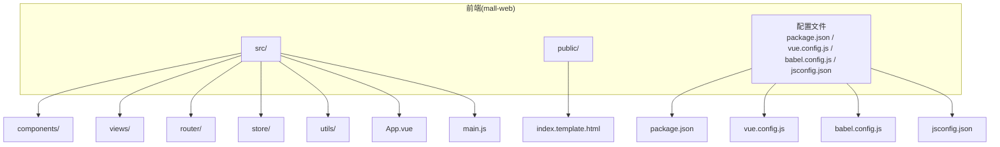
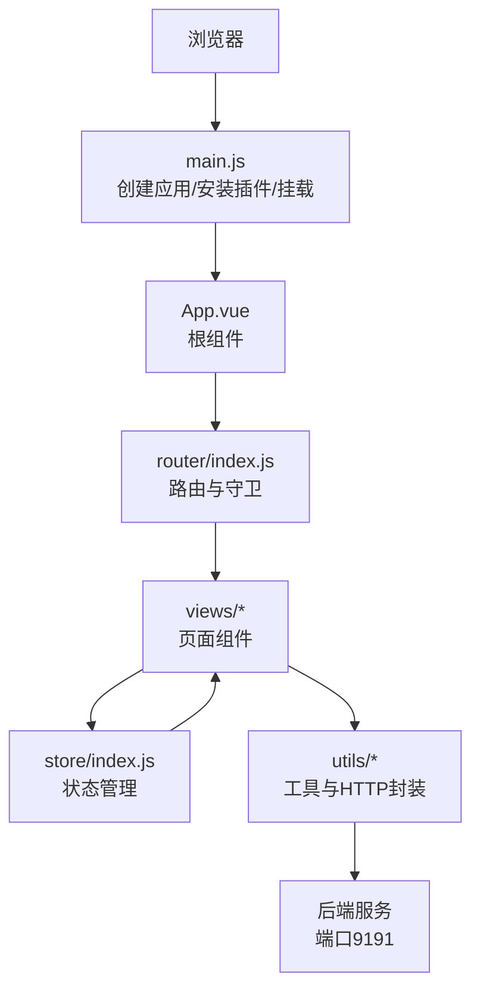
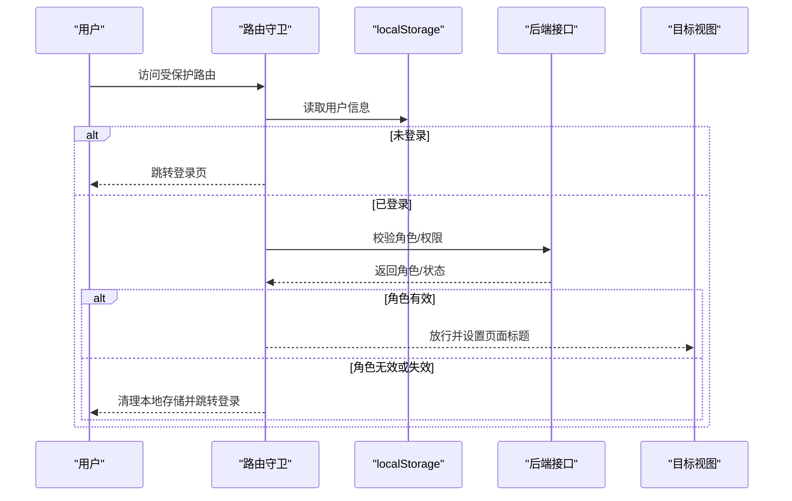
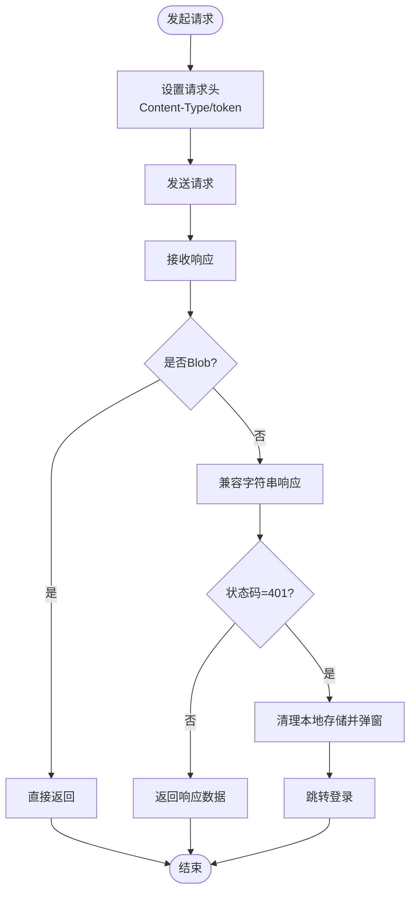
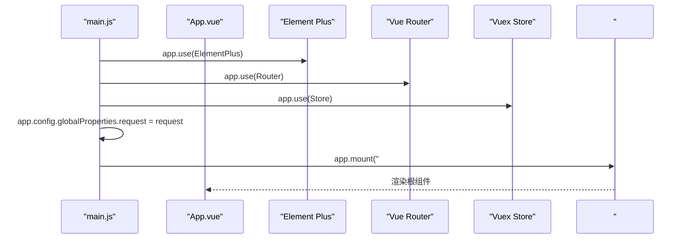
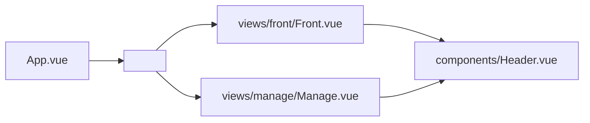
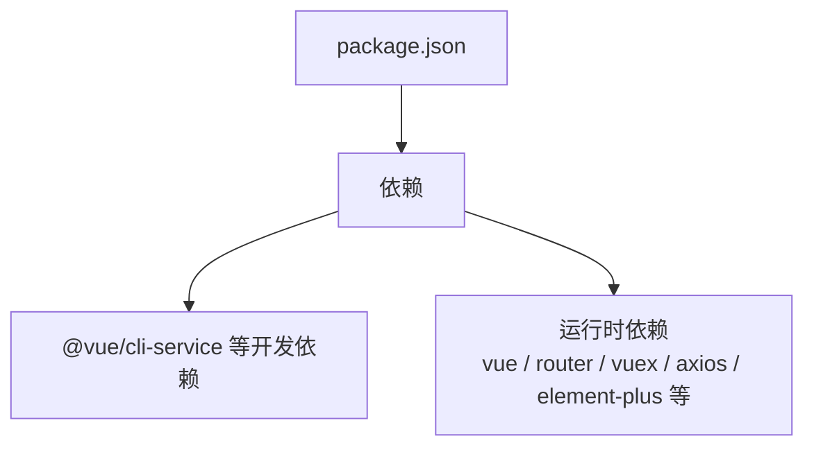

# 项目结构与配置

<cite>
**本文档引用的文件**
- [package.json](file://mall-web/package.json)
- [vue.config.js](file://mall-web/vue.config.js)
- [babel.config.js](file://mall-web/babel.config.js)
- [jsconfig.json](file://mall-web/jsconfig.json)
- [main.js](file://mall-web/src/main.js)
- [index.js](file://mall-web/src/router/index.js)
- [index.js](file://mall-web/src/store/index.js)
- [request.js](file://mall-web/src/utils/request.js)
- [index.template.html](file://mall-web/public/index.template.html)
- [App.vue](file://mall-web/src/App.vue)
- [Front.vue](file://mall-web/src/views/front/Front.vue)
- [Manage.vue](file://mall-web/src/views/manage/Manage.vue)
- [Header.vue](file://mall-web/src/components/Header.vue)
- [initialize.js](file://mall-web/src/utils/initialize.js)
- [icons.js](file://mall-web/src/utils/icons.js)
</cite>

## 目录
1. [引言](#引言)
2. [项目结构](#项目结构)
3. [核心组件](#核心组件)
4. [架构总览](#架构总览)
5. [详细组件分析](#详细组件分析)
6. [依赖关系分析](#依赖关系分析)
7. [性能考虑](#性能考虑)
8. [故障排除指南](#故障排除指南)
9. [结论](#结论)
10. [附录](#附录)

## 引言
本文件面向Vue.js前端项目的开发者与运维人员，系统性梳理项目结构与配置，覆盖src目录下components、views、router、store、utils等核心模块的职责与组织方式；详解main.js入口文件的初始化流程（含Element Plus引入、全局属性设置与应用挂载）；解析package.json中的依赖与脚本配置；阐述vue.config.js的构建配置（代理、路径别名、打包优化）；说明babel.config.js的转译策略与ESLint规则现状；并提供开发与生产环境的启动、构建与部署步骤及差异说明。

## 项目结构
项目采用典型的Vue CLI单页应用（SPA）结构，前端代码位于mall-web目录中，核心目录与职责如下：
- src：源代码根目录
  - components：可复用UI组件（如导航、侧边栏、头部等）
  - views：页面级视图组件（前台与后台两套路由体系）
  - router：路由定义与鉴权逻辑
  - store：状态管理（当前为空仓库，预留扩展）
  - utils：工具方法与HTTP请求封装
  - App.vue：根组件
  - main.js：应用入口
- public：静态资源与模板
- 配置文件：package.json、vue.config.js、babel.config.js、jsconfig.json

**图表来源**
- [main.js:1-18](file://mall-web/src/main.js#L1-L18)
- [App.vue:1-21](file://mall-web/src/App.vue#L1-L21)
- [index.js:1-161](file://mall-web/src/router/index.js#L1-L161)
- [index.js:1-21](file://mall-web/src/store/index.js#L1-L21)
- [request.js:1-55](file://mall-web/src/utils/request.js#L1-L55)
- [index.template.html:1-24](file://mall-web/public/index.template.html#L1-L24)
- [package.json:1-32](file://mall-web/package.json#L1-L32)
- [vue.config.js:1-26](file://mall-web/vue.config.js#L1-L26)
- [babel.config.js:1-6](file://mall-web/babel.config.js#L1-L6)
- [jsconfig.json:1-20](file://mall-web/jsconfig.json#L1-L20)

**章节来源**
- [main.js:1-18](file://mall-web/src/main.js#L1-L18)
- [App.vue:1-21](file://mall-web/src/App.vue#L1-L21)
- [index.js:1-161](file://mall-web/src/router/index.js#L1-L161)
- [index.js:1-21](file://mall-web/src/store/index.js#L1-L21)
- [request.js:1-55](file://mall-web/src/utils/request.js#L1-L55)
- [index.template.html:1-24](file://mall-web/public/index.template.html#L1-L24)
- [package.json:1-32](file://mall-web/package.json#L1-L32)
- [vue.config.js:1-26](file://mall-web/vue.config.js#L1-L26)
- [babel.config.js:1-6](file://mall-web/babel.config.js#L1-L6)
- [jsconfig.json:1-20](file://mall-web/jsconfig.json#L1-L20)

## 核心组件
- 组件(components)：提供可复用UI元素，如Header、Aside、Navagation等，承担导航、头部展示与用户交互。
- 视图(views)：按前台与后台划分，包含页面级组件（如Front、Manage、Login、Register等），承载业务页面与路由出口。
- 路由(router)：集中定义路由表与鉴权守卫，实现登录态校验、权限控制与页面标题动态设置。
- 状态管理(store)：当前为空仓库，建议后续按模块拆分与命名空间化，统一管理全局状态。
- 工具(utils)：封装HTTP请求（request）、图标库（icons）、初始化脚本（initialize）等通用能力。
- 根组件(App.vue)：提供router-view占位，承载全局样式与布局容器。
- 入口(main.js)：创建应用实例、安装插件、注入全局属性、挂载应用。

**章节来源**
- [Header.vue:1-93](file://mall-web/src/components/Header.vue#L1-L93)
- [Front.vue:1-79](file://mall-web/src/views/front/Front.vue#L1-L79)
- [Manage.vue:1-111](file://mall-web/src/views/manage/Manage.vue#L1-L111)
- [index.js:1-161](file://mall-web/src/router/index.js#L1-L161)
- [index.js:1-21](file://mall-web/src/store/index.js#L1-L21)
- [request.js:1-55](file://mall-web/src/utils/request.js#L1-L55)
- [icons.js:1-565](file://mall-web/src/utils/icons.js#L1-L565)
- [initialize.js:1-217](file://mall-web/src/utils/initialize.js#L1-L217)
- [App.vue:1-21](file://mall-web/src/App.vue#L1-L21)
- [main.js:1-18](file://mall-web/src/main.js#L1-L18)

## 架构总览
前端采用Vue 3 + Vue Router + Vuex + Element Plus技术栈，结合Vue CLI进行构建与开发。核心交互流程为：用户访问页面 → 路由守卫进行鉴权 → 加载对应视图组件 → 通过request封装的HTTP客户端与后端交互 → 展示数据或触发状态变更。

**图表来源**
- [main.js:1-18](file://mall-web/src/main.js#L1-L18)
- [App.vue:1-21](file://mall-web/src/App.vue#L1-L21)
- [index.js:1-161](file://mall-web/src/router/index.js#L1-L161)
- [index.js:1-21](file://mall-web/src/store/index.js#L1-L21)
- [request.js:1-55](file://mall-web/src/utils/request.js#L1-L55)

## 详细组件分析

### 路由与鉴权（router/index.js）
- 路由结构：前台与后台双路由体系，支持嵌套路由与懒加载。
- 鉴权机制：在beforeEach中根据meta字段与localStorage中的用户信息进行登录态与角色校验；对需要管理员权限的路由进一步校验角色。
- 页面标题：根据路由meta.title动态设置document.title。
- 登录态处理：若无token或角色校验失败，重定向至登录页并清理本地存储。

**图表来源**
- [index.js:84-160](file://mall-web/src/router/index.js#L84-L160)

**章节来源**
- [index.js:1-161](file://mall-web/src/router/index.js#L1-L161)

### HTTP请求封装（utils/request.js）
- 基础配置：baseURL留空，通过vue.config.js的devServer.proxy代理到后端9191端口；设置超时时间。
- 请求拦截：统一设置Content-Type与token头。
- 响应拦截：处理blob文件、字符串响应；对401错误统一弹窗提示并跳转登录。
- 与路由配合：在路由守卫中调用后端接口校验角色。

**图表来源**
- [request.js:1-55](file://mall-web/src/utils/request.js#L1-L55)

**章节来源**
- [request.js:1-55](file://mall-web/src/utils/request.js#L1-L55)
- [index.js:84-160](file://mall-web/src/router/index.js#L84-L160)

### 应用入口（main.js）
- 创建应用实例并安装Element Plus、Vue Router、Vuex。
- 注入全局属性request，便于组件内直接使用。
- 引入全局样式与图标样式，挂载到DOM节点。

**图表来源**
- [main.js:1-18](file://mall-web/src/main.js#L1-L18)

**章节来源**
- [main.js:1-18](file://mall-web/src/main.js#L1-L18)

### 根组件与页面布局（App.vue、views）
- App.vue：提供router-view占位，引入全局样式。
- views/front/Front.vue：前台布局容器，集成导航与主内容区，维护用户信息与登录状态。
- views/manage/Manage.vue：后台布局容器，集成侧边栏与头部，支持折叠切换与面包屑路径显示。

**图表来源**
- [App.vue:1-21](file://mall-web/src/App.vue#L1-L21)
- [Front.vue:1-79](file://mall-web/src/views/front/Front.vue#L1-L79)
- [Manage.vue:1-111](file://mall-web/src/views/manage/Manage.vue#L1-L111)
- [Header.vue:1-93](file://mall-web/src/components/Header.vue#L1-L93)

**章节来源**
- [App.vue:1-21](file://mall-web/src/App.vue#L1-L21)
- [Front.vue:1-79](file://mall-web/src/views/front/Front.vue#L1-L79)
- [Manage.vue:1-111](file://mall-web/src/views/manage/Manage.vue#L1-L111)
- [Header.vue:1-93](file://mall-web/src/components/Header.vue#L1-L93)

### 工具与初始化（utils）
- utils/request.js：统一HTTP请求与响应处理。
- utils/icons.js：提供图标字符集，供组件使用。
- utils/initialize.js：包含复杂的初始化逻辑与编码解码工具，用于运行时动态注入样式与图标。

**章节来源**
- [request.js:1-55](file://mall-web/src/utils/request.js#L1-L55)
- [icons.js:1-565](file://mall-web/src/utils/icons.js#L1-L565)
- [initialize.js:1-217](file://mall-web/src/utils/initialize.js#L1-L217)

## 依赖关系分析
- 运行时依赖：vue、vue-router、vuex、axios、element-plus、echarts、js-md5等。
- 开发依赖：@vue/cli-service及相关插件，用于构建与开发服务器。
- 浏览器兼容：browserslist指定主流浏览器版本。

**图表来源**
- [package.json:1-32](file://mall-web/package.json#L1-L32)

**章节来源**
- [package.json:1-32](file://mall-web/package.json#L1-L32)

## 性能考虑
- 路由懒加载：通过动态导入减少首屏包体。
- 图标与样式：通过公共CSS与图标库按需引入，避免重复加载。
- 请求拦截：统一对401错误处理，减少无效重试与错误传播。
- 构建优化：可通过vue.config.js进一步开启压缩、分包与缓存策略（当前配置以代理与页面入口为主）。

[本节为通用指导，无需特定文件引用]

## 故障排除指南
- 登录态失效：当响应拦截器检测到401时，会清理本地存储并弹窗提示，随后跳转登录页。请检查后端token有效性与过期策略。
- 路由跳转异常：若路由守卫中角色校验失败，将自动清理本地存储并跳转登录。请确认后端角色接口返回与前端校验逻辑一致。
- 代理问题：开发环境下通过devServer.proxy将请求转发至后端9191端口，请确保后端服务已启动且端口正确。
- 样式冲突：Element Plus样式与自定义样式叠加时，注意选择器优先级与作用域scoped的使用。

**章节来源**
- [request.js:26-50](file://mall-web/src/utils/request.js#L26-L50)
- [index.js:84-160](file://mall-web/src/router/index.js#L84-L160)
- [vue.config.js:4-16](file://mall-web/vue.config.js#L4-L16)

## 结论
本项目采用清晰的目录结构与模块化设计，结合Element Plus与Vue Router/Vuex形成完整的前端框架。通过main.js统一初始化、utils封装HTTP请求、router实现鉴权与页面标题管理，能够满足前台与后台的业务需求。建议后续完善store模块化、ESLint规则与构建优化配置，以提升可维护性与性能表现。

[本节为总结，无需特定文件引用]

## 附录

### 启动、构建与部署步骤
- 开发环境
  - 安装依赖：npm install
  - 启动开发服务器：npm run serve 或 npm run dev
  - 默认端口：前端9192，后端9191（通过代理）
- 生产环境
  - 构建产物：npm run build
  - 输出目录：dist（由vue.config.js的pages配置生成index.html）
- 部署
  - 将dist目录部署至静态服务器或CDN
  - 确保代理配置与后端域名一致（当前为本地9191）

**章节来源**
- [package.json:5-8](file://mall-web/package.json#L5-L8)
- [vue.config.js:17-24](file://mall-web/vue.config.js#L17-L24)

### 开发与生产环境差异
- 代理：开发环境启用devServer.proxy，生产环境通常由Nginx或CDN处理跨域与静态资源。
- 构建输出：生产环境启用压缩与分包，开发环境偏向可调试性。
- 路径别名：jsconfig.json提供@/*别名，便于模块导入与IDE识别。

**章节来源**
- [vue.config.js:4-16](file://mall-web/vue.config.js#L4-L16)
- [jsconfig.json:7-11](file://mall-web/jsconfig.json#L7-L11)