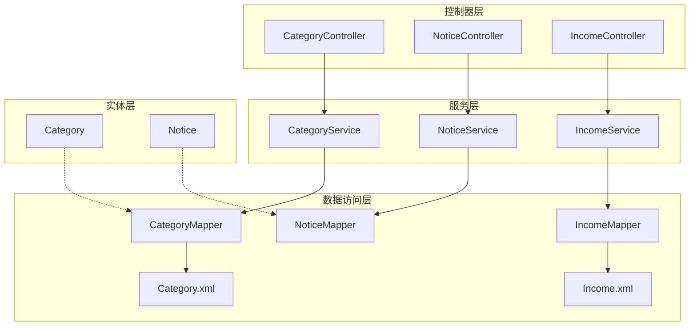
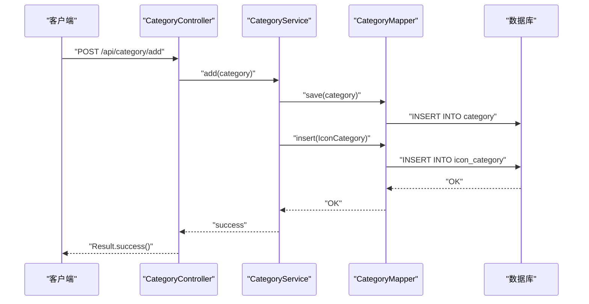
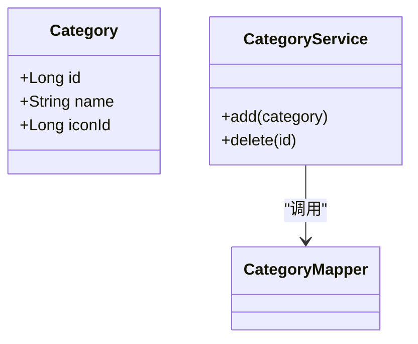
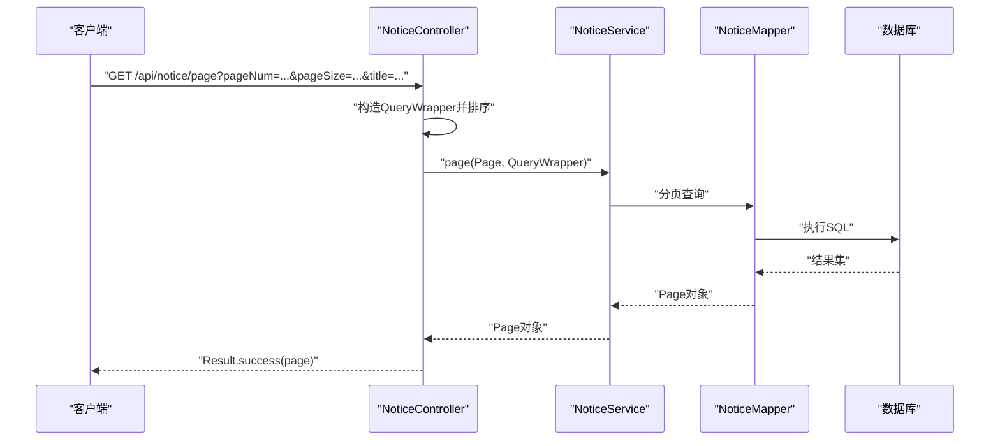
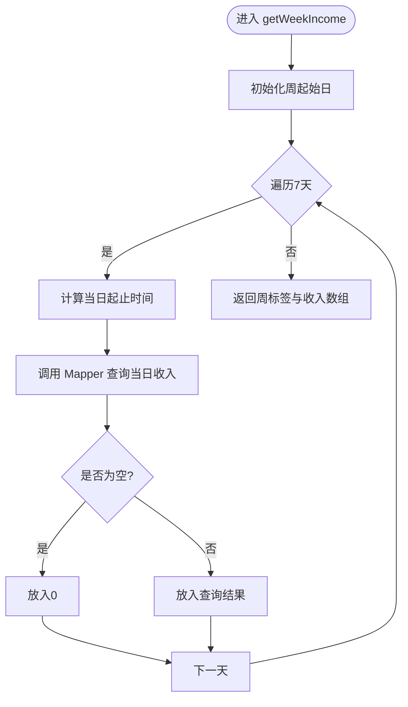
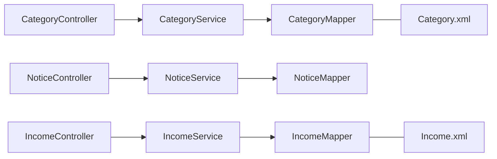

# 分类、公告、收入统计模块

<cite>
**本文引用的文件**
- [CategoryController.java](file://mall-server/src/main/java/com/rabbiter/em/controller/CategoryController.java)
- [CategoryService.java](file://mall-server/src/main/java/com/rabbiter/em/service/CategoryService.java)
- [Category.java](file://mall-server/src/main/java/com/rabbiter/em/entity/Category.java)
- [CategoryMapper.java](file://mall-server/src/main/java/com/rabbiter/em/mapper/CategoryMapper.java)
- [Category.xml](file://mall-server/src/main/resources/mapper/Category.xml)
- [NoticeController.java](file://mall-server/src/main/java/com/rabbiter/em/controller/NoticeController.java)
- [NoticeService.java](file://mall-server/src/main/java/com/rabbiter/em/service/NoticeService.java)
- [Notice.java](file://mall-server/src/main/java/com/rabbiter/em/entity/Notice.java)
- [NoticeMapper.java](file://mall-server/src/main/java/com/rabbiter/em/mapper/NoticeMapper.java)
- [IncomeController.java](file://mall-server/src/main/java/com/rabbiter/em/controller/IncomeController.java)
- [IncomeService.java](file://mall-server/src/main/java/com/rabbiter/em/service/IncomeService.java)
- [IncomeMapper.java](file://mall-server/src/main/java/com/rabbiter/em/mapper/IncomeMapper.java)
- [Income.xml](file://mall-server/src/main/resources/mapper/Income.xml)
</cite>

## 目录
1. [简介](#简介)
2. [项目结构](#项目结构)
3. [核心组件](#核心组件)
4. [架构总览](#架构总览)
5. [详细组件分析](#详细组件分析)
6. [依赖分析](#依赖分析)
7. [性能考虑](#性能考虑)
8. [故障排查指南](#故障排查指南)
9. [结论](#结论)
10. [附录](#附录)

## 简介
本文件聚焦于分类、公告与收入统计三大模块的技术实现，覆盖以下方面：
- 商品分类管理：分类层级结构、查询与删除流程、分类与图标关联。
- 公告发布与管理：公告内容管理、分页检索、发布时间控制与前端展示逻辑。
- 收入统计：分类维度收入、周/月收入趋势、图表数据组装与报表生成。
- 服务层与数据访问层：MyBatis-Plus 与自定义 Mapper 的协作方式。
- 控制器 RESTful 设计与数据处理。
- 数据模型设计与查询优化策略。
- 业务规则校验与数据准确性保障。

## 项目结构
后端采用 Spring Boot + MyBatis-Plus 架构，按职责划分为：
- 控制器层（Controller）：暴露 RESTful 接口，负责请求参数接收与响应封装。
- 服务层（Service）：封装业务逻辑，协调 Mapper 完成数据操作。
- 数据访问层（Mapper/Xml）：基于 MyBatis-Plus 或原生 XML 映射 SQL。
- 实体层（Entity）：映射数据库表结构，标注主键与字段。

**图示来源**
- [CategoryController.java:15-81](file://mall-server/src/main/java/com/rabbiter/em/controller/CategoryController.java#L15-L81)
- [NoticeController.java:15-53](file://mall-server/src/main/java/com/rabbiter/em/controller/NoticeController.java#L15-L53)
- [IncomeController.java:15-36](file://mall-server/src/main/java/com/rabbiter/em/controller/IncomeController.java#L15-L36)
- [CategoryService.java:15-51](file://mall-server/src/main/java/com/rabbiter/em/service/CategoryService.java#L15-L51)
- [NoticeService.java:8-10](file://mall-server/src/main/java/com/rabbiter/em/service/NoticeService.java#L8-L10)
- [IncomeService.java:15-75](file://mall-server/src/main/java/com/rabbiter/em/service/IncomeService.java#L15-L75)
- [CategoryMapper.java:1-8](file://mall-server/src/main/java/com/rabbiter/em/mapper/CategoryMapper.java#L1-L8)
- [NoticeMapper.java:1-7](file://mall-server/src/main/java/com/rabbiter/em/mapper/NoticeMapper.java#L1-L7)
- [IncomeMapper.java:1-17](file://mall-server/src/main/java/com/rabbiter/em/mapper/IncomeMapper.java#L1-L17)
- [Category.xml:1-6](file://mall-server/src/main/resources/mapper/Category.xml#L1-L6)
- [Income.xml:1-19](file://mall-server/src/main/resources/mapper/Income.xml#L1-L19)

**章节来源**
- [CategoryController.java:15-81](file://mall-server/src/main/java/com/rabbiter/em/controller/CategoryController.java#L15-L81)
- [NoticeController.java:15-53](file://mall-server/src/main/java/com/rabbiter/em/controller/NoticeController.java#L15-L53)
- [IncomeController.java:15-36](file://mall-server/src/main/java/com/rabbiter/em/controller/IncomeController.java#L15-L36)

## 核心组件
- 分类模块：提供分类的新增、查询、更新、删除；新增时自动建立分类与图标关联。
- 公告模块：支持公告列表、分页查询、标题过滤、创建时间排序；支持新增与删除。
- 收入统计模块：提供分类收入汇总、总销售额、周/月每日收入趋势。

**章节来源**
- [CategoryService.java:23-50](file://mall-server/src/main/java/com/rabbiter/em/service/CategoryService.java#L23-L50)
- [NoticeController.java:22-46](file://mall-server/src/main/java/com/rabbiter/em/controller/NoticeController.java#L22-L46)
- [IncomeService.java:20-74](file://mall-server/src/main/java/com/rabbiter/em/service/IncomeService.java#L20-L74)

## 架构总览
三层架构在各模块内保持一致：Controller 负责接口与参数处理，Service 执行业务逻辑，Mapper 负责数据持久化。分类模块使用 MyBatis-Plus 的通用 Service 实现，公告模块同样继承通用 Service，收入模块通过自定义 Mapper 执行聚合查询。

**图示来源**
- [CategoryController.java:51-54](file://mall-server/src/main/java/com/rabbiter/em/controller/CategoryController.java#L51-L54)
- [CategoryService.java:28-34](file://mall-server/src/main/java/com/rabbiter/em/service/CategoryService.java#L28-L34)
- [CategoryMapper.java:1-8](file://mall-server/src/main/java/com/rabbiter/em/mapper/CategoryMapper.java#L1-L8)

## 详细组件分析

### 分类模块（Category）
- 功能点
  - 单个查询、全量查询、保存、新增下级分类、更新、删除。
  - 新增下级分类时，同时写入分类与图标关联表。
  - 删除分类时，先清理关联再删除分类本身。
- 关键实现
  - 控制器暴露 RESTful 接口，使用注解进行权限控制与路径绑定。
  - 服务层在新增时构建关联记录并插入。
  - Mapper 继承 MyBatis-Plus 基类，XML 可扩展复杂查询。
- 数据模型
  - 分类实体包含主键、名称、图标 ID 字段；图标 ID 为非持久化字段，用于业务交互。

**图示来源**
- [Category.java:9-56](file://mall-server/src/main/java/com/rabbiter/em/entity/Category.java#L9-L56)
- [CategoryMapper.java:1-8](file://mall-server/src/main/java/com/rabbiter/em/mapper/CategoryMapper.java#L1-L8)
- [CategoryService.java:15-51](file://mall-server/src/main/java/com/rabbiter/em/service/CategoryService.java#L15-L51)

**章节来源**
- [CategoryController.java:21-75](file://mall-server/src/main/java/com/rabbiter/em/controller/CategoryController.java#L21-L75)
- [CategoryService.java:23-50](file://mall-server/src/main/java/com/rabbiter/em/service/CategoryService.java#L23-L50)
- [Category.java:9-56](file://mall-server/src/main/java/com/rabbiter/em/entity/Category.java#L9-L56)
- [CategoryMapper.java:1-8](file://mall-server/src/main/java/com/rabbiter/em/mapper/CategoryMapper.java#L1-L8)
- [Category.xml:1-6](file://mall-server/src/main/resources/mapper/Category.xml#L1-L6)

### 公告模块（Notice）
- 功能点
  - 列表查询按创建时间倒序。
  - 分页查询支持标题模糊匹配与时间倒序。
  - 新增时自动设置创建时间；删除按 ID。
- 关键实现
  - 控制器对查询接口开放访问，新增/删除受权限控制。
  - 服务层直接继承通用 Service，简化 CRUD。
  - 实体包含标题、内容、创建时间等字段。

**图示来源**
- [NoticeController.java:28-36](file://mall-server/src/main/java/com/rabbiter/em/controller/NoticeController.java#L28-L36)
- [NoticeService.java:8-10](file://mall-server/src/main/java/com/rabbiter/em/service/NoticeService.java#L8-L10)
- [NoticeMapper.java:1-7](file://mall-server/src/main/java/com/rabbiter/em/mapper/NoticeMapper.java#L1-L7)

**章节来源**
- [NoticeController.java:22-52](file://mall-server/src/main/java/com/rabbiter/em/controller/NoticeController.java#L22-L52)
- [NoticeService.java:8-10](file://mall-server/src/main/java/com/rabbiter/em/service/NoticeService.java#L8-L10)
- [Notice.java:7-49](file://mall-server/src/main/java/com/rabbiter/em/entity/Notice.java#L7-L49)

### 收入统计模块（Income）
- 功能点
  - 分类维度收入与总销售额。
  - 周/月每日收入趋势（前 7 天/30 天）。
- 关键实现
  - 服务层通过自定义 Mapper 执行聚合查询。
  - 使用日期工具生成时间区间，逐日查询订单金额并填充空值为零。
  - 返回结构包含标签数组与数值数组，便于前端渲染。

**图示来源**
- [IncomeService.java:32-51](file://mall-server/src/main/java/com/rabbiter/em/service/IncomeService.java#L32-L51)
- [IncomeMapper.java:10-17](file://mall-server/src/main/java/com/rabbiter/em/mapper/IncomeMapper.java#L10-L17)
- [Income.xml:16-18](file://mall-server/src/main/resources/mapper/Income.xml#L16-L18)

**章节来源**
- [IncomeController.java:23-35](file://mall-server/src/main/java/com/rabbiter/em/controller/IncomeController.java#L23-L35)
- [IncomeService.java:20-74](file://mall-server/src/main/java/com/rabbiter/em/service/IncomeService.java#L20-L74)
- [IncomeMapper.java:10-17](file://mall-server/src/main/java/com/rabbiter/em/mapper/IncomeMapper.java#L10-L17)
- [Income.xml:9-18](file://mall-server/src/main/resources/mapper/Income.xml#L9-L18)

## 依赖分析
- 分类模块
  - CategoryController 依赖 CategoryService。
  - CategoryService 依赖 CategoryMapper 与 IconCategoryMapper（通过关联表维护图标与分类关系）。
- 公告模块
  - NoticeController 依赖 NoticeService。
  - NoticeService 依赖 NoticeMapper。
- 收入模块
  - IncomeController 依赖 IncomeService。
  - IncomeService 依赖 IncomeMapper，后者在 XML 中定义了分类收入、总销售额与日收入查询。

**图示来源**
- [CategoryController.java:15-81](file://mall-server/src/main/java/com/rabbiter/em/controller/CategoryController.java#L15-L81)
- [NoticeController.java:15-53](file://mall-server/src/main/java/com/rabbiter/em/controller/NoticeController.java#L15-L53)
- [IncomeController.java:15-36](file://mall-server/src/main/java/com/rabbiter/em/controller/IncomeController.java#L15-L36)
- [CategoryService.java:15-51](file://mall-server/src/main/java/com/rabbiter/em/service/CategoryService.java#L15-L51)
- [NoticeService.java:8-10](file://mall-server/src/main/java/com/rabbiter/em/service/NoticeService.java#L8-L10)
- [IncomeService.java:15-75](file://mall-server/src/main/java/com/rabbiter/em/service/IncomeService.java#L15-L75)
- [Category.xml:1-6](file://mall-server/src/main/resources/mapper/Category.xml#L1-L6)
- [Income.xml:1-19](file://mall-server/src/main/resources/mapper/Income.xml#L1-L19)

**章节来源**
- [CategoryController.java:15-81](file://mall-server/src/main/java/com/rabbiter/em/controller/CategoryController.java#L15-L81)
- [NoticeController.java:15-53](file://mall-server/src/main/java/com/rabbiter/em/controller/NoticeController.java#L15-L53)
- [IncomeController.java:15-36](file://mall-server/src/main/java/com/rabbiter/em/controller/IncomeController.java#L15-L36)

## 性能考虑
- 分类模块
  - 新增下级分类与关联写入为两次独立写入，建议在事务边界内合并以确保一致性（当前实现未显式声明事务，可评估添加）。
  - 查询全量分类与单个查询均为轻量级操作，适合高频访问。
- 公告模块
  - 分页查询使用条件过滤与排序，建议在标题字段建立索引以提升模糊查询性能。
- 收入模块
  - 周/月趋势循环查询 7 次或 30 次，建议：
    - 在订单表的创建时间与状态字段建立复合索引，优化范围查询。
    - 将每日查询结果缓存至 Redis，减少重复计算与数据库压力。
    - 对分类收入与总销售额采用定时任务预计算并落库，前端直接读取预计算结果。

[本节为通用性能建议，不直接分析具体文件，故无“章节来源”]

## 故障排查指南
- 分类删除失败或关联未清理
  - 检查删除流程是否正确执行关联表清理与分类删除。
  - 确认数据库外键约束与事务隔离级别设置。
- 公告分页查询异常
  - 核对分页参数与标题过滤条件是否正确传入。
  - 检查 NoticeMapper 对应 XML 是否存在或命名空间是否匹配。
- 收入统计为空或为零
  - 确认订单状态与创建时间范围是否符合查询条件。
  - 检查日期格式与边界值处理（如小于等于关系）。
- 权限控制问题
  - 收入统计接口需管理员权限，确认鉴权拦截器与 Token 校验逻辑正常。

**章节来源**
- [CategoryService.java:42-50](file://mall-server/src/main/java/com/rabbiter/em/service/CategoryService.java#L42-L50)
- [IncomeController.java:15-36](file://mall-server/src/main/java/com/rabbiter/em/controller/IncomeController.java#L15-L36)

## 结论
- 分类模块通过通用 Service 与关联表实现图标与分类的绑定，删除流程完整清理关联。
- 公告模块提供基础的列表、分页与新增删除能力，具备良好的扩展性。
- 收入统计模块通过自定义聚合查询提供多维报表数据，建议结合缓存与索引优化以提升性能。
- 各模块均遵循清晰的分层设计，控制器仅承担接口职责，服务层承载业务逻辑，数据访问层专注持久化。

[本节为总结性内容，不直接分析具体文件，故无“章节来源”]

## 附录

### RESTful API 规范（节选）
- 分类
  - GET /api/category/{id}：按 ID 查询
  - GET /api/category：查询全部
  - POST /api/category：保存（受权限控制）
  - POST /api/category/add：新增下级分类并建立关联
  - PUT /api/category：更新（受权限控制）
  - GET /api/category/delete?id={id}：删除（受权限控制）
- 公告
  - GET /api/notice：查询全部（按创建时间倒序）
  - GET /api/notice/page?pageNum=&pageSize=&title=：分页查询（标题模糊匹配）
  - POST /api/notice：新增（自动设置创建时间）
  - DELETE /api/notice/{id}：删除
- 收入
  - GET /api/income/chart：分类收入与总销售额
  - GET /api/income/week：周收入趋势
  - GET /api/income/month：月收入趋势

**章节来源**
- [CategoryController.java:24-75](file://mall-server/src/main/java/com/rabbiter/em/controller/CategoryController.java#L24-L75)
- [NoticeController.java:22-52](file://mall-server/src/main/java/com/rabbiter/em/controller/NoticeController.java#L22-L52)
- [IncomeController.java:23-35](file://mall-server/src/main/java/com/rabbiter/em/controller/IncomeController.java#L23-L35)

### 数据模型与查询优化要点
- 分类（category）
  - 主键：id
  - 字段：name, iconId（业务字段，非持久化）
  - 建议：iconId 作为业务标识，若需强约束可引入图标表并建立外键。
- 公告（notice）
  - 主键：id
  - 字段：title, content, createTime
  - 建议：为 title 建立索引，优化分页与模糊查询。
- 订单（t_order）
  - 字段：state, create_time, total_price
  - 建议：在 (state, create_time) 建立复合索引，提升收入统计查询效率。

**章节来源**
- [Category.java:9-56](file://mall-server/src/main/java/com/rabbiter/em/entity/Category.java#L9-L56)
- [Notice.java:7-49](file://mall-server/src/main/java/com/rabbiter/em/entity/Notice.java#L7-L49)
- [Income.xml:16-18](file://mall-server/src/main/resources/mapper/Income.xml#L16-L18)