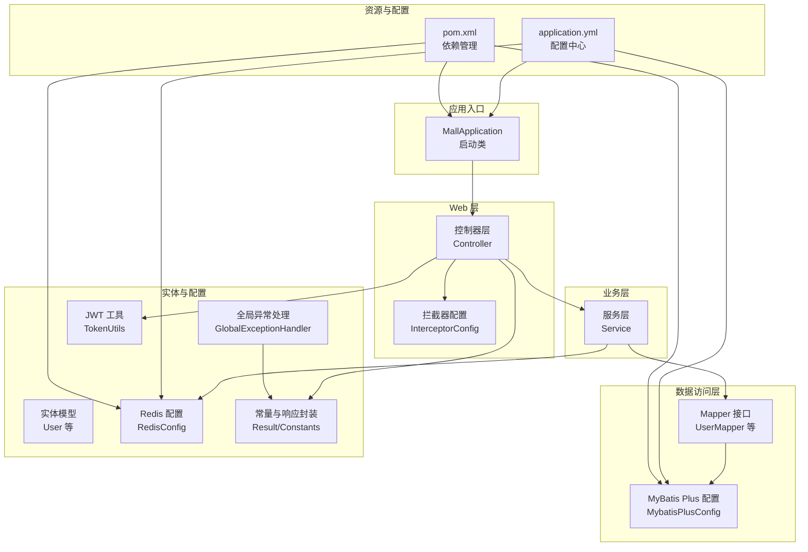
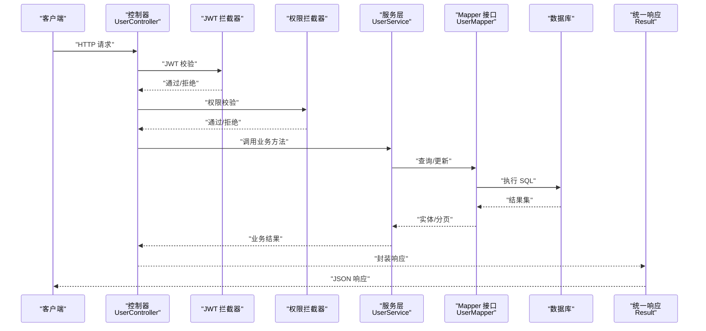
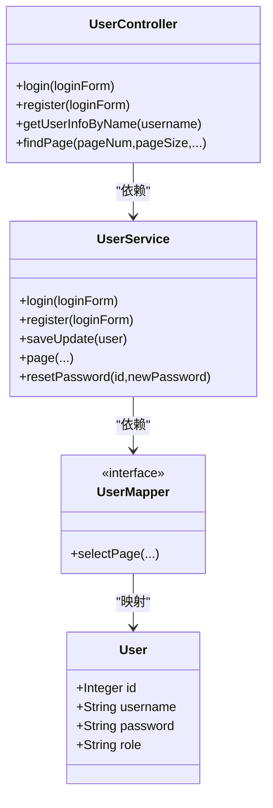
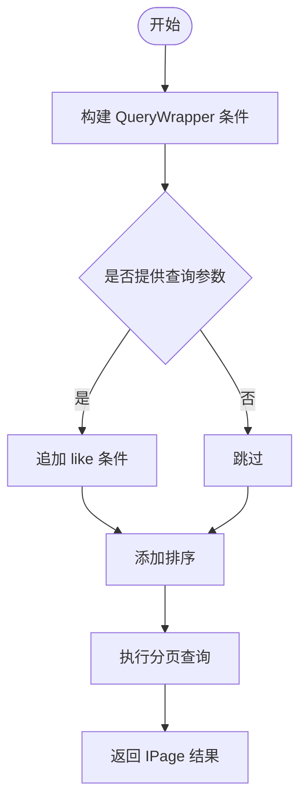
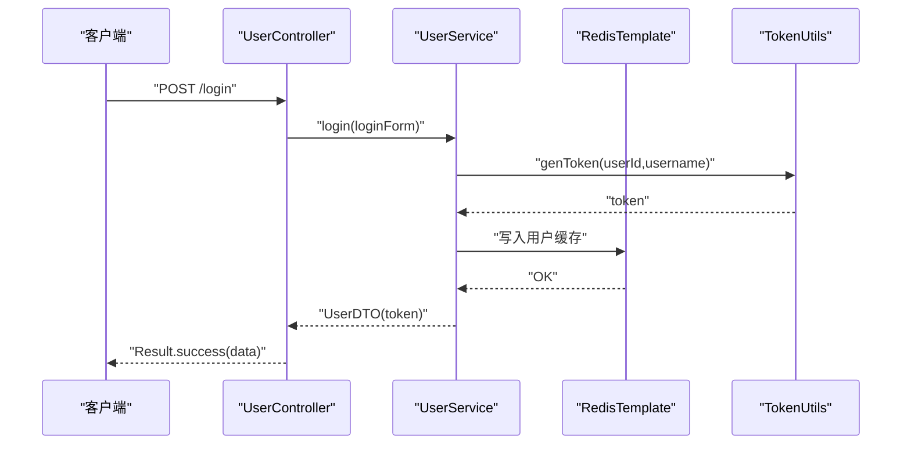
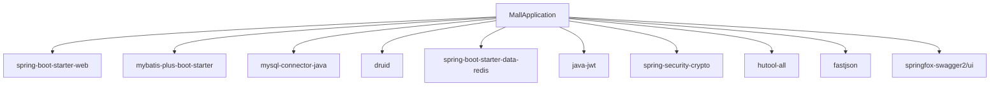

# 后端系统设计

<cite>
**本文引用的文件**
- [MallApplication.java](file://mall-server/src/main/java/com/rabbiter/em/MallApplication.java)
- [application.yml](file://mall-server/src/main/resources/application.yml)
- [pom.xml](file://mall-server/pom.xml)
- [Result.java](file://mall-server/src/main/java/com/rabbiter/em/common/Result.java)
- [ServiceException.java](file://mall-server/src/main/java/com/rabbiter/em/exception/ServiceException.java)
- [GlobalExceptionHandler.java](file://mall-server/src/main/java/com/rabbiter/em/config/GlobalExceptionHandler.java)
- [MybatisPlusConfig.java](file://mall-server/src/main/java/com/rabbiter/em/config/MybatisPlusConfig.java)
- [RedisConfig.java](file://mall-server/src/main/java/com/rabbiter/em/config/RedisConfig.java)
- [InterceptorConfig.java](file://mall-server/src/main/java/com/rabbiter/em/config/InterceptorConfig.java)
- [Constants.java](file://mall-server/src/main/java/com/rabbiter/em/constants/Constants.java)
- [UserController.java](file://mall-server/src/main/java/com/rabbiter/em/controller/UserController.java)
- [UserService.java](file://mall-server/src/main/java/com/rabbiter/em/service/UserService.java)
- [UserMapper.java](file://mall-server/src/main/java/com/rabbiter/em/mapper/UserMapper.java)
- [User.java](file://mall-server/src/main/java/com/rabbiter/em/entity/User.java)
- [TokenUtils.java](file://mall-server/src/main/java/com/rabbiter/em/utils/TokenUtils.java)
</cite>

## 目录
1. [引言](#引言)
2. [项目结构](#项目结构)
3. [核心组件](#核心组件)
4. [架构总览](#架构总览)
5. [详细组件分析](#详细组件分析)
6. [依赖分析](#依赖分析)
7. [性能考虑](#性能考虑)
8. [故障排查指南](#故障排查指南)
9. [结论](#结论)
10. [附录](#附录)

## 引言
本文件面向后端系统设计与实现，围绕基于 Spring Boot 的电商后台系统进行全面解析。重点涵盖 MVC 设计模式在项目中的落地、MyBatis Plus 的集成与使用、RESTful API 设计与实现、认证授权与权限拦截、全局异常处理与错误码规范、配置管理策略、性能优化与缓存、以及日志与监控集成建议。文档力求以循序渐进的方式呈现，既适合技术读者深入理解实现细节，也便于非技术读者把握整体架构。

## 项目结构
后端采用标准的 Spring Boot 工程目录，按功能模块化组织，主要层次如下：
- 应用入口与扫描：启动类负责包扫描与应用启动
- 控制器层：对外暴露 REST 接口，处理请求与响应
- 服务层：封装业务逻辑，协调数据访问与外部依赖
- 数据访问层：基于 MyBatis Plus 的 Mapper 接口与 XML 映射
- 实体模型：MyBatis Plus 注解映射数据库表
- 配置层：拦截器、MyBatis Plus 分页插件、Redis 序列化、全局异常处理等
- 工具与常量：统一响应包装、错误码、JWT 工具、路径工具等
- 资源文件：Spring Boot 配置、MyBatis Mapper XML

图表来源
- [MallApplication.java:1-17](file://mall-server/src/main/java/com/rabbiter/em/MallApplication.java#L1-L17)
- [application.yml:1-42](file://mall-server/src/main/resources/application.yml#L1-L42)
- [pom.xml:1-185](file://mall-server/pom.xml#L1-L185)
- [MybatisPlusConfig.java:1-21](file://mall-server/src/main/java/com/rabbiter/em/config/MybatisPlusConfig.java#L1-L21)
- [RedisConfig.java:1-38](file://mall-server/src/main/java/com/rabbiter/em/config/RedisConfig.java#L1-L38)
- [GlobalExceptionHandler.java:1-45](file://mall-server/src/main/java/com/rabbiter/em/config/GlobalExceptionHandler.java#L1-L45)
- [Result.java:1-66](file://mall-server/src/main/java/com/rabbiter/em/common/Result.java#L1-L66)
- [Constants.java:1-16](file://mall-server/src/main/java/com/rabbiter/em/constants/Constants.java#L1-L16)
- [TokenUtils.java:1-78](file://mall-server/src/main/java/com/rabbiter/em/utils/TokenUtils.java#L1-L78)

章节来源
- [MallApplication.java:1-17](file://mall-server/src/main/java/com/rabbiter/em/MallApplication.java#L1-L17)
- [application.yml:1-42](file://mall-server/src/main/resources/application.yml#L1-L42)
- [pom.xml:1-185](file://mall-server/pom.xml#L1-L185)

## 核心组件
- 统一响应包装：Result 提供 success/error 静态方法与链式构建，统一输出 code/msg/data 结构
- 错误码与常量：Constants 定义标准 HTTP 语义错误码与文件存储路径常量
- 自定义异常：ServiceException 封装业务异常，携带业务 code 与消息
- 全局异常处理：GlobalExceptionHandler 捕获 ServiceException 与通用异常，返回标准化响应
- JWT 工具：TokenUtils 生成与校验令牌，提取当前用户，提供登录与权限校验辅助
- Redis 配置：RedisConfig 定义 JSON 序列化模板，支持用户对象缓存
- MyBatis Plus 配置：MybatisPlusConfig 注册分页插件，限制最大每页条数
- 拦截器配置：InterceptorConfig 注册 JWT 与权限拦截器，设置放行路径与顺序

章节来源
- [Result.java:1-66](file://mall-server/src/main/java/com/rabbiter/em/common/Result.java#L1-L66)
- [Constants.java:1-16](file://mall-server/src/main/java/com/rabbiter/em/constants/Constants.java#L1-L16)
- [ServiceException.java:1-18](file://mall-server/src/main/java/com/rabbiter/em/exception/ServiceException.java#L1-L18)
- [GlobalExceptionHandler.java:1-45](file://mall-server/src/main/java/com/rabbiter/em/config/GlobalExceptionHandler.java#L1-L45)
- [TokenUtils.java:1-78](file://mall-server/src/main/java/com/rabbiter/em/utils/TokenUtils.java#L1-L78)
- [RedisConfig.java:1-38](file://mall-server/src/main/java/com/rabbiter/em/config/RedisConfig.java#L1-L38)
- [MybatisPlusConfig.java:1-21](file://mall-server/src/main/java/com/rabbiter/em/config/MybatisPlusConfig.java#L1-L21)
- [InterceptorConfig.java:1-37](file://mall-server/src/main/java/com/rabbiter/em/config/InterceptorConfig.java#L1-L37)

## 架构总览
系统遵循经典的三层架构（表现层/业务层/数据层）与 Spring MVC 的典型分层实践。请求从控制器进入，经由拦截器进行鉴权与权限校验，随后调用服务层完成业务处理，服务层通过 Mapper 访问数据库，最终以统一响应返回给客户端。MyBatis Plus 提供通用 Mapper 与分页能力；Redis 用于会话与缓存；全局异常处理器保证错误的统一反馈。

图表来源
- [UserController.java:1-179](file://mall-server/src/main/java/com/rabbiter/em/controller/UserController.java#L1-L179)
- [UserService.java:1-155](file://mall-server/src/main/java/com/rabbiter/em/service/UserService.java#L1-L155)
- [UserMapper.java:1-28](file://mall-server/src/main/java/com/rabbiter/em/mapper/UserMapper.java#L1-L28)
- [TokenUtils.java:1-78](file://mall-server/src/main/java/com/rabbiter/em/utils/TokenUtils.java#L1-L78)
- [Result.java:1-66](file://mall-server/src/main/java/com/rabbiter/em/common/Result.java#L1-L66)

## 详细组件分析

### MVC 设计模式与职责划分
- 控制器层（Controller）
  - 负责接收 HTTP 请求、参数绑定、调用服务层、组装统一响应
  - 示例：UserController 提供登录、注册、用户查询、分页、批量删除等接口
- 服务层（Service）
  - 负责业务编排、参数校验、调用数据访问层、事务边界控制
  - 示例：UserService 实现登录校验、密码加密、用户注册、分页查询、重置密码
- 数据访问层（Mapper/Entity）
  - 使用 MyBatis Plus 的 BaseMapper 提供通用 CRUD，结合 XML 实现复杂查询
  - 示例：UserMapper 继承 BaseMapper，User 实体映射 sys_user 表

图表来源
- [UserController.java:1-179](file://mall-server/src/main/java/com/rabbiter/em/controller/UserController.java#L1-L179)
- [UserService.java:1-155](file://mall-server/src/main/java/com/rabbiter/em/service/UserService.java#L1-L155)
- [UserMapper.java:1-28](file://mall-server/src/main/java/com/rabbiter/em/mapper/UserMapper.java#L1-L28)
- [User.java:1-123](file://mall-server/src/main/java/com/rabbiter/em/entity/User.java#L1-L123)

章节来源
- [UserController.java:1-179](file://mall-server/src/main/java/com/rabbiter/em/controller/UserController.java#L1-L179)
- [UserService.java:1-155](file://mall-server/src/main/java/com/rabbiter/em/service/UserService.java#L1-L155)
- [UserMapper.java:1-28](file://mall-server/src/main/java/com/rabbiter/em/mapper/UserMapper.java#L1-L28)
- [User.java:1-123](file://mall-server/src/main/java/com/rabbiter/em/entity/User.java#L1-L123)

### MyBatis Plus 集成与使用
- 通用 Mapper 接口
  - UserMapper 继承 BaseMapper，自动获得常用 CRUD 方法
- 分页查询
  - MybatisPlusConfig 注册分页插件，限制最大每页条数，配合 IPage 返回分页结果
- 动态 SQL
  - 在 UserController 中使用 QueryWrapper 构建条件查询，支持多字段模糊匹配与排序
- XML 映射
  - resources/mapper 下提供各实体对应的 XML 文件，可扩展复杂 SQL

图表来源
- [MybatisPlusConfig.java:1-21](file://mall-server/src/main/java/com/rabbiter/em/config/MybatisPlusConfig.java#L1-L21)
- [UserController.java:144-163](file://mall-server/src/main/java/com/rabbiter/em/controller/UserController.java#L144-L163)

章节来源
- [MybatisPlusConfig.java:1-21](file://mall-server/src/main/java/com/rabbiter/em/config/MybatisPlusConfig.java#L1-L21)
- [UserMapper.java:1-28](file://mall-server/src/main/java/com/rabbiter/em/mapper/UserMapper.java#L1-L28)
- [UserController.java:144-163](file://mall-server/src/main/java/com/rabbiter/em/controller/UserController.java#L144-L163)

### RESTful API 设计与实现
- URL 设计
  - 采用名词化资源路径，如 /login、/register、/user、/user/page
- HTTP 方法
  - GET：查询、分页、获取当前用户 ID
  - POST：登录、注册、保存/更新、批量删除、重置密码
  - DELETE：按 ID 删除
- 状态码与响应格式
  - 成功：200；业务错误：403；未授权：401；系统错误：500
  - 响应体：统一为 Result{code,msg,data} 结构
- 参数传递
  - 路径参数：@PathVariable；查询参数：@RequestParam；请求体：@RequestBody

章节来源
- [UserController.java:37-178](file://mall-server/src/main/java/com/rabbiter/em/controller/UserController.java#L37-L178)
- [Result.java:1-66](file://mall-server/src/main/java/com/rabbiter/em/common/Result.java#L1-L66)
- [Constants.java:1-16](file://mall-server/src/main/java/com/rabbiter/em/constants/Constants.java#L1-L16)

### 认证授权机制与拦截器
- JWT 令牌生成与校验
  - TokenUtils 使用 HMAC256 签发与验证令牌，提供当前用户提取与登录状态校验
- 登录流程
  - UserController.login -> UserService.login -> 生成令牌 -> 写入 Redis 缓存
- 权限拦截
  - InterceptorConfig 注册两个拦截器：JWT 拦截器优先于权限拦截器
  - 放行路径：/login、/register、/avatar/**
  - 权限校验：TokenUtils.validateAuthority 判断角色 admin
- 当前用户持有
  - TokenUtils.getCurrentCurrentUser 通过线程上下文获取当前用户

图表来源
- [UserController.java:37-41](file://mall-server/src/main/java/com/rabbiter/em/controller/UserController.java#L37-L41)
- [UserService.java:44-75](file://mall-server/src/main/java/com/rabbiter/em/service/UserService.java#L44-L75)
- [TokenUtils.java:31-36](file://mall-server/src/main/java/com/rabbiter/em/utils/TokenUtils.java#L31-L36)
- [RedisConfig.java:25-35](file://mall-server/src/main/java/com/rabbiter/em/config/RedisConfig.java#L25-L35)

章节来源
- [TokenUtils.java:1-78](file://mall-server/src/main/java/com/rabbiter/em/utils/TokenUtils.java#L1-L78)
- [InterceptorConfig.java:1-37](file://mall-server/src/main/java/com/rabbiter/em/config/InterceptorConfig.java#L1-L37)
- [UserService.java:44-75](file://mall-server/src/main/java/com/rabbiter/em/service/UserService.java#L44-L75)

### 全局异常处理与错误码规范
- ServiceException
  - 业务异常，携带业务 code 与消息
- GlobalExceptionHandler
  - 捕获 ServiceException 并返回 Result.error(code,msg)
  - 捕获通用异常，根据异常消息特征识别数据库/Redis 连接问题并返回友好提示
- 错误码
  - 200 成功、500 系统错误、510 未找到结果、401 未授权、403 拒绝执行

章节来源
- [ServiceException.java:1-18](file://mall-server/src/main/java/com/rabbiter/em/exception/ServiceException.java#L1-L18)
- [GlobalExceptionHandler.java:1-45](file://mall-server/src/main/java/com/rabbiter/em/config/GlobalExceptionHandler.java#L1-L45)
- [Constants.java:1-16](file://mall-server/src/main/java/com/rabbiter/em/constants/Constants.java#L1-L16)
- [Result.java:1-66](file://mall-server/src/main/java/com/rabbiter/em/common/Result.java#L1-L66)

### 配置管理策略
- application.yml
  - 服务器端口、字符编码、文件上传大小限制
  - 数据源：MySQL 驱动、URL、账号密码（支持环境变量占位符）
  - Redis：主机、端口、密码、连接池、超时
  - JWT：签名密钥（支持环境变量）
  - MyBatis：XML 映射路径、驼峰命名映射
- pom.xml
  - Spring Boot、MyBatis、MySQL、Druid、MyBatis Plus、Swagger、JWT、Hutool、FastJSON、Redis、BCrypt 等依赖
  - Maven 插件：Spring Boot、Surefire、Jacoco

章节来源
- [application.yml:1-42](file://mall-server/src/main/resources/application.yml#L1-L42)
- [pom.xml:1-185](file://mall-server/pom.xml#L1-L185)

### 性能优化与缓存策略
- Redis 缓存
  - RedisConfig 定义 JSON 序列化模板，UserService 登录后将用户对象写入 Redis，键带前缀，设置 TTL
  - 优势：减少数据库压力、提升登录与用户信息读取性能
- 分页限制
  - MybatisPlusConfig 设置最大每页条数，防止超大分页导致性能问题
- 连接池与序列化
  - Druid 连接池、Redis 连接池参数合理配置，避免阻塞
- 建议
  - 对热点数据增加二级缓存（如本地缓存 + Redis）
  - 对复杂查询增加索引与 SQL 优化
  - 对大文件上传与下载使用 CDN 或对象存储

章节来源
- [RedisConfig.java:1-38](file://mall-server/src/main/java/com/rabbiter/em/config/RedisConfig.java#L1-L38)
- [UserService.java:69-71](file://mall-server/src/main/java/com/rabbiter/em/service/UserService.java#L69-L71)
- [MybatisPlusConfig.java:15-17](file://mall-server/src/main/java/com/rabbiter/em/config/MybatisPlusConfig.java#L15-L17)

### 日志记录与监控集成
- 日志
  - 全局异常处理器记录异常日志，便于定位数据库/Redis 连接问题
- 监控
  - 可选集成 Actuator、Micrometer、Prometheus/Grafana 监控指标
  - 建议埋点：接口耗时、异常率、缓存命中率、数据库慢查询
  - 建议链路追踪：OpenTelemetry/Sleuth

章节来源
- [GlobalExceptionHandler.java:24-43](file://mall-server/src/main/java/com/rabbiter/em/config/GlobalExceptionHandler.java#L24-L43)

## 依赖分析
系统依赖以 Spring Boot 为中心，MyBatis Plus 提供 ORM 能力，Redis 提供缓存，JWT 实现鉴权，Hutool/FastJSON 提供工具与序列化，Druid 提供数据库连接池。

图表来源
- [pom.xml:19-100](file://mall-server/pom.xml#L19-L100)
- [MallApplication.java:1-17](file://mall-server/src/main/java/com/rabbiter/em/MallApplication.java#L1-L17)

章节来源
- [pom.xml:1-185](file://mall-server/pom.xml#L1-L185)

## 性能考虑
- 数据库层面
  - 合理索引：对高频查询字段建立索引
  - SQL 优化：避免 N+1 查询，使用预加载或联表查询
  - 连接池：调整 Druid 最大活跃、空闲、等待时间
- 缓存层面
  - Redis：合理设置 TTL，区分热数据与冷数据
  - 读写一致性：写后失效或延时双删策略
- 接口层面
  - 分页限制：防止超大页码与页大小
  - 响应压缩：开启 Gzip 压缩
- 安全与稳定性
  - 限流与熔断：网关或服务端限流
  - 超时与重试：合理设置超时与幂等

## 故障排查指南
- 数据库连接失败
  - 检查 DB_HOST/DB_PORT/DB_NAME/DB_USER/DB_PASS 环境变量
  - 查看全局异常处理器对“Failed to obtain JDBC Connection”的提示
- Redis 连接失败
  - 检查 REDIS_HOST/REDIS_PORT/REDIS_PASS 环境变量
  - 查看全局异常处理器对“edis”关键字的提示
- 登录失败
  - 用户名不存在或密码错误：查看 ServiceException 抛出的业务错误码
  - 令牌无效：检查 JWT 密钥与前端 token 传递
- 分页异常
  - 检查分页参数与最大限制，确认 QueryWrapper 条件拼接

章节来源
- [GlobalExceptionHandler.java:28-42](file://mall-server/src/main/java/com/rabbiter/em/config/GlobalExceptionHandler.java#L28-L42)
- [application.yml:9-13](file://mall-server/src/main/resources/application.yml#L9-L13)
- [application.yml:22-33](file://mall-server/src/main/resources/application.yml#L22-L33)
- [TokenUtils.java:50-75](file://mall-server/src/main/java/com/rabbiter/em/utils/TokenUtils.java#L50-L75)

## 结论
本系统以 Spring Boot 为基础，结合 MyBatis Plus、Redis、JWT 等技术栈，实现了清晰的 MVC 分层、标准化的 RESTful 接口、完善的认证授权与权限拦截、统一的异常处理与响应封装。通过合理的配置与缓存策略，系统具备良好的可维护性与扩展性。后续可在监控、链路追踪、缓存策略与数据库优化方面进一步完善。

## 附录
- 关键实现参考路径
  - [MallApplication.java:1-17](file://mall-server/src/main/java/com/rabbiter/em/MallApplication.java#L1-L17)
  - [application.yml:1-42](file://mall-server/src/main/resources/application.yml#L1-L42)
  - [pom.xml:1-185](file://mall-server/pom.xml#L1-L185)
  - [Result.java:1-66](file://mall-server/src/main/java/com/rabbiter/em/common/Result.java#L1-L66)
  - [ServiceException.java:1-18](file://mall-server/src/main/java/com/rabbiter/em/exception/ServiceException.java#L1-L18)
  - [GlobalExceptionHandler.java:1-45](file://mall-server/src/main/java/com/rabbiter/em/config/GlobalExceptionHandler.java#L1-L45)
  - [MybatisPlusConfig.java:1-21](file://mall-server/src/main/java/com/rabbiter/em/config/MybatisPlusConfig.java#L1-L21)
  - [RedisConfig.java:1-38](file://mall-server/src/main/java/com/rabbiter/em/config/RedisConfig.java#L1-L38)
  - [InterceptorConfig.java:1-37](file://mall-server/src/main/java/com/rabbiter/em/config/InterceptorConfig.java#L1-L37)
  - [Constants.java:1-16](file://mall-server/src/main/java/com/rabbiter/em/constants/Constants.java#L1-L16)
  - [UserController.java:1-179](file://mall-server/src/main/java/com/rabbiter/em/controller/UserController.java#L1-L179)
  - [UserService.java:1-155](file://mall-server/src/main/java/com/rabbiter/em/service/UserService.java#L1-L155)
  - [UserMapper.java:1-28](file://mall-server/src/main/java/com/rabbiter/em/mapper/UserMapper.java#L1-L28)
  - [User.java:1-123](file://mall-server/src/main/java/com/rabbiter/em/entity/User.java#L1-L123)
  - [TokenUtils.java:1-78](file://mall-server/src/main/java/com/rabbiter/em/utils/TokenUtils.java#L1-L78)