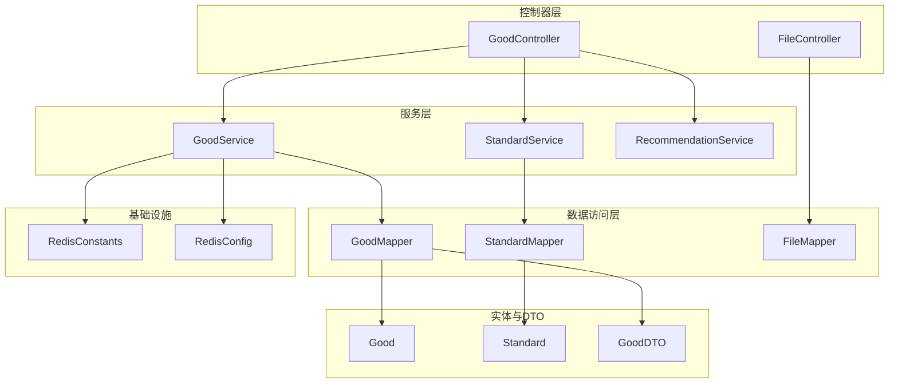
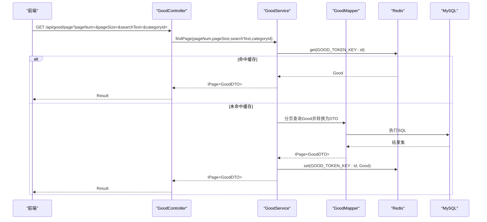
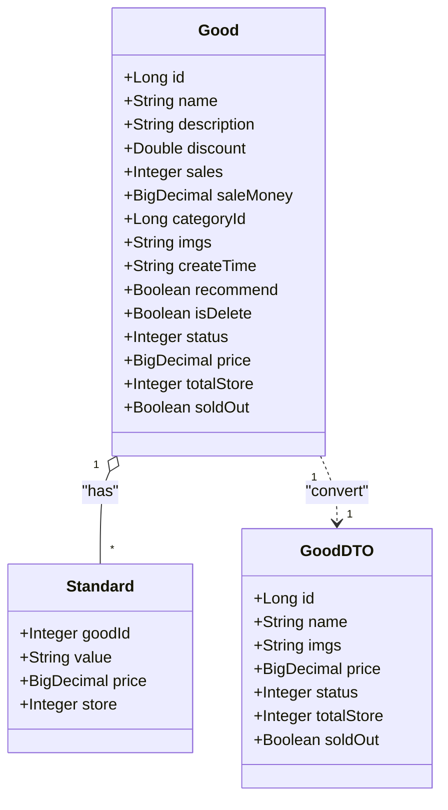
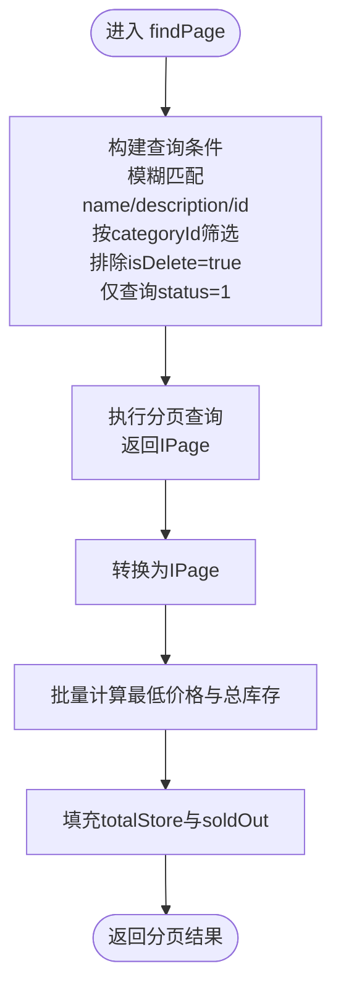
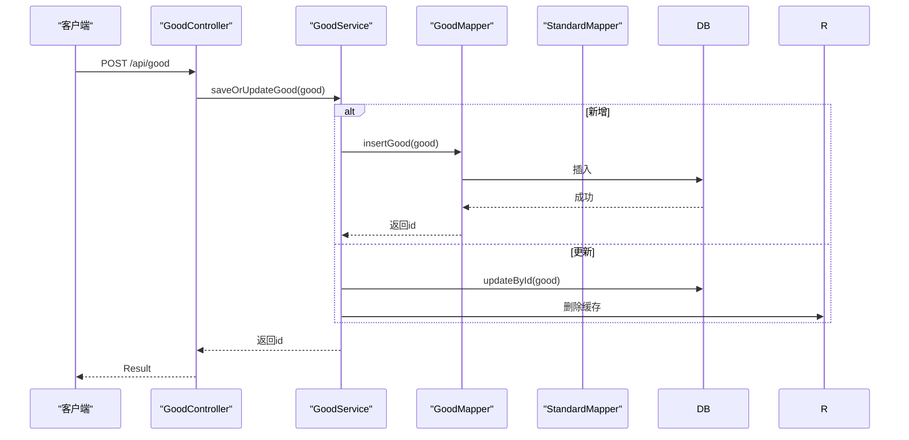
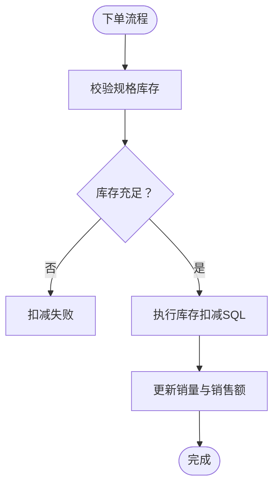
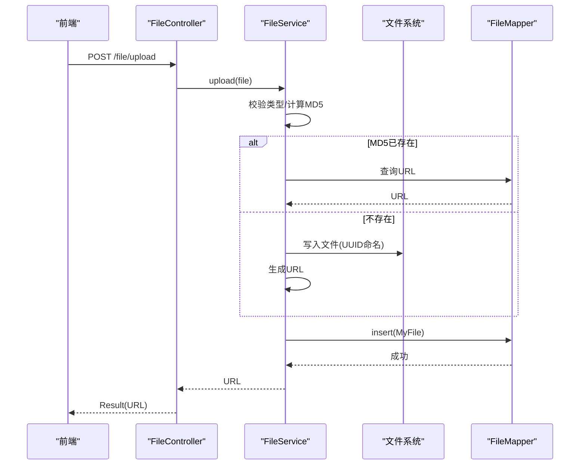
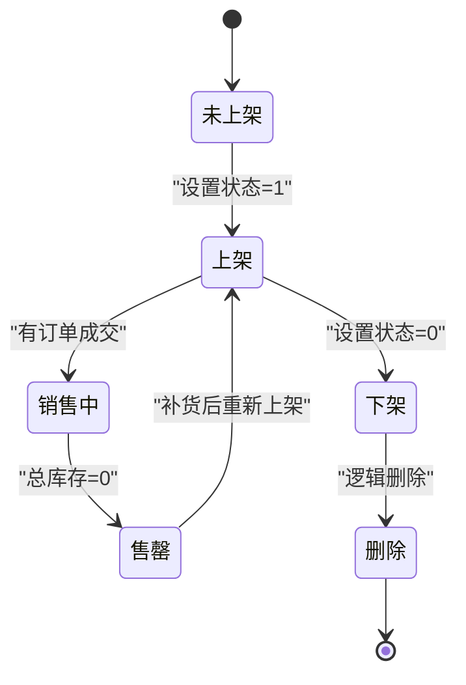
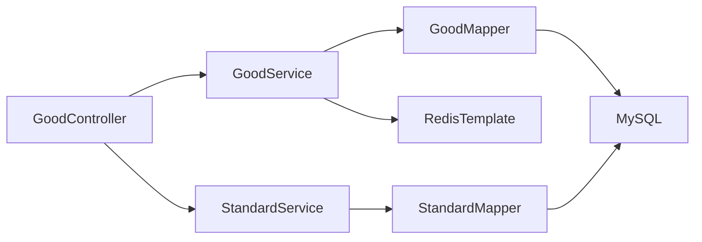

# 商品管理模块

<cite>
**本文引用的文件**
- [Good.java](file://mall-server/src/main/java/com/rabbiter/em/entity/Good.java)
- [GoodDTO.java](file://mall-server/src/main/java/com/rabbiter/em/entity/dto/GoodDTO.java)
- [GoodController.java](file://mall-server/src/main/java/com/rabbiter/em/controller/GoodController.java)
- [GoodService.java](file://mall-server/src/main/java/com/rabbiter/em/service/GoodService.java)
- [GoodMapper.java](file://mall-server/src/main/java/com/rabbiter/em/mapper/GoodMapper.java)
- [GoodMapper.xml](file://mall-server/src/main/resources/mapper/GoodMapper.xml)
- [Standard.java](file://mall-server/src/main/java/com/rabbiter/em/entity/Standard.java)
- [StandardService.java](file://mall-server/src/main/java/com/rabbiter/em/service/StandardService.java)
- [StandardMapper.java](file://mall-server/src/main/java/com/rabbiter/em/mapper/StandardMapper.java)
- [RedisConstants.java](file://mall-server/src/main/java/com/rabbiter/em/constants/RedisConstants.java)
- [RedisConfig.java](file://mall-server/src/main/java/com/rabbiter/em/config/RedisConfig.java)
- [FileController.java](file://mall-server/src/main/java/com/rabbiter/em/controller/FileController.java)
- [FileService.java](file://mall-server/src/main/java/com/rabbiter/em/service/FileService.java)
- [DATABASE_DESIGN.md](file://DATABASE_DESIGN.md)
- [GoodControllerTest.java](file://mall-server/src/test/java/com/rabbiter/em/controller/GoodControllerTest.java)
</cite>

## 目录
1. [简介](#简介)
2. [项目结构](#项目结构)
3. [核心组件](#核心组件)
4. [架构总览](#架构总览)
5. [详细组件分析](#详细组件分析)
6. [依赖分析](#依赖分析)
7. [性能考虑](#性能考虑)
8. [故障排查指南](#故障排查指南)
9. [结论](#结论)
10. [附录](#附录)

## 简介
本技术文档围绕商品管理模块展开，系统性阐述商品信息管理的完整实现，涵盖商品增删改查、库存与价格管理、状态控制、规格体系、前端展示与分页查询、以及图片与文件上传处理。重点解析 Good 实体与 GoodDTO 的设计思路与数据传输对象的优势；梳理服务层核心业务逻辑（查询、分类筛选、价格计算、库存扣减）；详解 GoodController 的 RESTful API 设计（分页、条件搜索、排序与过滤）；并提供商品管理流程图与业务规则说明，最后给出性能优化与缓存策略建议。

## 项目结构
商品管理模块位于 mall-server 工程中，采用典型的分层架构：控制器层（Controller）、服务层（Service）、数据访问层（Mapper/Xml）、实体与 DTO、Redis 缓存配置与常量定义，以及文件上传模块协同工作。

**图表来源**
- [GoodController.java:16-209](file://mall-server/src/main/java/com/rabbiter/em/controller/GoodController.java#L16-L209)
- [GoodService.java:37-281](file://mall-server/src/main/java/com/rabbiter/em/service/GoodService.java#L37-L281)
- [GoodMapper.java:15-42](file://mall-server/src/main/java/com/rabbiter/em/mapper/GoodMapper.java#L15-L42)
- [GoodMapper.xml:3-32](file://mall-server/src/main/resources/mapper/GoodMapper.xml#L3-L32)
- [StandardService.java:11-31](file://mall-server/src/main/java/com/rabbiter/em/service/StandardService.java#L11-L31)
- [StandardMapper.java:9-15](file://mall-server/src/main/java/com/rabbiter/em/mapper/StandardMapper.java#L9-L15)
- [RedisConstants.java:3-9](file://mall-server/src/main/java/com/rabbiter/em/constants/RedisConstants.java#L3-L9)
- [RedisConfig.java:11-38](file://mall-server/src/main/java/com/rabbiter/em/config/RedisConfig.java#L11-L38)
- [FileController.java:17-80](file://mall-server/src/main/java/com/rabbiter/em/controller/FileController.java#L17-L80)
- [FileService.java:33-141](file://mall-server/src/main/java/com/rabbiter/em/service/FileService.java#L33-L141)

**章节来源**
- [GoodController.java:16-209](file://mall-server/src/main/java/com/rabbiter/em/controller/GoodController.java#L16-L209)
- [GoodService.java:37-281](file://mall-server/src/main/java/com/rabbiter/em/service/GoodService.java#L37-L281)
- [GoodMapper.java:15-42](file://mall-server/src/main/java/com/rabbiter/em/mapper/GoodMapper.java#L15-L42)
- [GoodMapper.xml:3-32](file://mall-server/src/main/resources/mapper/GoodMapper.xml#L3-L32)
- [StandardService.java:11-31](file://mall-server/src/main/java/com/rabbiter/em/service/StandardService.java#L11-L31)
- [StandardMapper.java:9-15](file://mall-server/src/main/java/com/rabbiter/em/mapper/StandardMapper.java#L9-L15)
- [RedisConstants.java:3-9](file://mall-server/src/main/java/com/rabbiter/em/constants/RedisConstants.java#L3-L9)
- [RedisConfig.java:11-38](file://mall-server/src/main/java/com/rabbiter/em/config/RedisConfig.java#L11-L38)
- [FileController.java:17-80](file://mall-server/src/main/java/com/rabbiter/em/controller/FileController.java#L17-L80)
- [FileService.java:33-141](file://mall-server/src/main/java/com/rabbiter/em/service/FileService.java#L33-L141)

## 核心组件
- 实体与DTO
  - Good：商品主表实体，包含基础信息、折扣、销量、销售额、分类、图片、创建时间、推荐标志、逻辑删除、上下架状态，以及与规格相关的扩展字段（价格、总库存、是否售罄）。
  - GoodDTO：面向前端展示的数据传输对象，包含商品标识、名称、图片、价格、状态、总库存、是否售罄，用于分页查询与前端渲染。
  - Standard：商品规格实体，包含规格值、单价与库存，与 Good 通过 good_id 关联。
- 控制器
  - GoodController：提供商品的增删改查、分页查询、推荐状态设置、销量排行、规格管理、详情查询等 RESTful 接口。
- 服务层
  - GoodService：封装商品查询、缓存读写、价格与库存批量计算、分页转换、推荐状态设置、逻辑删除等核心业务。
  - StandardService：规格的增删改查与批量清理。
- 数据访问层
  - GoodMapper/GoodMapper.xml：提供商品查询、推荐商品、销量排行、最低价格与总库存聚合、插入与逻辑删除等 SQL。
  - StandardMapper：提供规格库存扣减与查询。
- 缓存与配置
  - RedisConstants：定义商品缓存键前缀与过期时间。
  - RedisConfig：统一的 RedisTemplate 序列化配置。

**章节来源**
- [Good.java:11-232](file://mall-server/src/main/java/com/rabbiter/em/entity/Good.java#L11-L232)
- [GoodDTO.java:5-83](file://mall-server/src/main/java/com/rabbiter/em/entity/dto/GoodDTO.java#L5-L83)
- [Standard.java:8-72](file://mall-server/src/main/java/com/rabbiter/em/entity/Standard.java#L8-L72)
- [GoodController.java:16-209](file://mall-server/src/main/java/com/rabbiter/em/controller/GoodController.java#L16-L209)
- [GoodService.java:37-281](file://mall-server/src/main/java/com/rabbiter/em/service/GoodService.java#L37-L281)
- [StandardService.java:11-31](file://mall-server/src/main/java/com/rabbiter/em/service/StandardService.java#L11-L31)
- [GoodMapper.java:15-42](file://mall-server/src/main/java/com/rabbiter/em/mapper/GoodMapper.java#L15-L42)
- [GoodMapper.xml:3-32](file://mall-server/src/main/resources/mapper/GoodMapper.xml#L3-L32)
- [StandardMapper.java:9-15](file://mall-server/src/main/java/com/rabbiter/em/mapper/StandardMapper.java#L9-L15)
- [RedisConstants.java:3-9](file://mall-server/src/main/java/com/rabbiter/em/constants/RedisConstants.java#L3-L9)
- [RedisConfig.java:11-38](file://mall-server/src/main/java/com/rabbiter/em/config/RedisConfig.java#L11-L38)

## 架构总览
商品管理模块遵循“控制器-服务-数据访问-实体”的分层设计，配合 Redis 缓存与 MyBatis Plus 实现高性能与可维护性。前端通过 GoodController 的 RESTful 接口获取商品信息，服务层在 GoodService 中完成查询、价格与库存聚合、缓存读写与分页转换，数据访问层通过 GoodMapper/GoodMapper.xml 与 StandardMapper 提供 SQL 能力。

**图表来源**
- [GoodController.java:179-188](file://mall-server/src/main/java/com/rabbiter/em/controller/GoodController.java#L179-L188)
- [GoodService.java:177-224](file://mall-server/src/main/java/com/rabbiter/em/service/GoodService.java#L177-L224)
- [GoodMapper.xml:3-32](file://mall-server/src/main/resources/mapper/GoodMapper.xml#L3-L32)
- [RedisConstants.java:7-8](file://mall-server/src/main/java/com/rabbiter/em/constants/RedisConstants.java#L7-L8)

## 详细组件分析

### 实体与DTO设计
- Good 实体
  - 字段覆盖商品基础信息、折扣、销量、销售额、分类、图片、创建时间、推荐标志、逻辑删除、上下架状态，以及与规格相关的扩展字段（价格、总库存、是否售罄），便于在服务层一次性聚合计算后返回给前端。
- GoodDTO
  - 仅暴露前端所需字段，避免泄露内部实现细节；在分页查询时由 GoodService 转换，减少不必要的字段传输。
- Standard 实体
  - 规格值、单价与库存，与 Good 通过 good_id 关联，支撑多规格商品的价格与库存管理。

**图表来源**
- [Good.java:11-232](file://mall-server/src/main/java/com/rabbiter/em/entity/Good.java#L11-L232)
- [GoodDTO.java:5-83](file://mall-server/src/main/java/com/rabbiter/em/entity/dto/GoodDTO.java#L5-L83)
- [Standard.java:8-72](file://mall-server/src/main/java/com/rabbiter/em/entity/Standard.java#L8-L72)

**章节来源**
- [Good.java:11-232](file://mall-server/src/main/java/com/rabbiter/em/entity/Good.java#L11-L232)
- [GoodDTO.java:5-83](file://mall-server/src/main/java/com/rabbiter/em/entity/dto/GoodDTO.java#L5-L83)
- [Standard.java:8-72](file://mall-server/src/main/java/com/rabbiter/em/entity/Standard.java#L8-L72)

### 服务层核心业务逻辑
- 商品查询与分页
  - 支持按名称/描述模糊查询（不区分大小写）与按分类 ID 筛选，自动排除逻辑删除与下架商品。
  - 分页完成后将 Good 转换为 GoodDTO，并批量计算最低价格与总库存，填充是否售罄状态。
- 价格与库存聚合
  - 通过 GoodMapper.xml 的聚合查询一次性获取多商品的最低价格与总库存，避免 N+1 查询。
- 缓存策略
  - 使用 Redis 缓存商品详情，键前缀与 TTL 定义于 RedisConstants；命中则延长过期时间，未命中则查询数据库并写入缓存。
- 推荐状态与销量排行
  - 提供推荐状态设置接口与销量排行查询接口，服务于首页推荐与榜单展示。
- 逻辑删除与更新
  - 逻辑删除会清理对应 Redis 缓存；更新后清理缓存以保证一致性。

**图表来源**
- [GoodService.java:177-224](file://mall-server/src/main/java/com/rabbiter/em/service/GoodService.java#L177-L224)
- [GoodMapper.xml:16-31](file://mall-server/src/main/resources/mapper/GoodMapper.xml#L16-L31)

**章节来源**
- [GoodService.java:177-255](file://mall-server/src/main/java/com/rabbiter/em/service/GoodService.java#L177-L255)
- [GoodMapper.xml:12-31](file://mall-server/src/main/resources/mapper/GoodMapper.xml#L12-L31)

### 控制器层 RESTful API 设计
- 商品管理
  - 新增/更新：POST/PUT /api/good（需管理员权限）
  - 删除：DELETE /api/good/delete/{id}（需管理员权限）
  - 详情：GET /api/good/detail/{id}
  - 分页查询：GET /api/good/page?pageNum=&pageSize=&searchText=&categoryId=
  - 完整分页：GET /api/good/fullPage?pageNum=&pageSize=&searchText=&categoryId=
- 规格管理
  - 保存规格：POST /api/good/standard（需管理员权限）
  - 删除规格：DELETE /api/good/standard（需管理员权限）
  - 获取规格：GET /api/good/standard/{id}
- 推荐与排行
  - 推荐商品：GET /api/good/recommend/{userId}
  - 设置推荐：GET /api/good/recommend?id=&isRecommend=
  - 销量排行：GET /api/good/rank?num=
- 权限注解
  - 使用自定义注解 Authority 控制接口访问权限，部分接口无需登录即可访问。

**图表来源**
- [GoodController.java:45-62](file://mall-server/src/main/java/com/rabbiter/em/controller/GoodController.java#L45-L62)
- [GoodService.java:133-143](file://mall-server/src/main/java/com/rabbiter/em/service/GoodService.java#L133-L143)
- [GoodMapper.xml:4-6](file://mall-server/src/main/resources/mapper/GoodMapper.xml#L4-L6)

**章节来源**
- [GoodController.java:28-208](file://mall-server/src/main/java/com/rabbiter/em/controller/GoodController.java#L28-L208)

### 库存扣减与价格计算
- 价格计算
  - 商品最低价格 = 规格最小价格 × 折扣，通过 GoodMapper.xml 的聚合查询一次性返回。
- 库存扣减
  - 通过 StandardMapper 的 SQL 在数据库层完成库存扣减与并发保护（要求库存充足且原子性更新）。
- 销售统计
  - GoodMapper.xml 提供销售量与销售额的更新 SQL，用于订单完成后更新商品销量与销售额。

**图表来源**
- [StandardMapper.java:10-11](file://mall-server/src/main/java/com/rabbiter/em/mapper/StandardMapper.java#L10-L11)
- [GoodMapper.xml:7-9](file://mall-server/src/main/resources/mapper/GoodMapper.xml#L7-L9)

**章节来源**
- [StandardMapper.java:10-11](file://mall-server/src/main/java/com/rabbiter/em/mapper/StandardMapper.java#L10-L11)
- [GoodMapper.xml:7-9](file://mall-server/src/main/resources/mapper/GoodMapper.xml#L7-L9)

### 商品图片处理与文件上传
- 文件上传
  - FileController 提供 /file/upload 接口，接收 MultipartFile 并调用 FileService 进行处理。
  - FileService 校验文件类型、计算 MD5、去重存储、生成唯一文件名与 URL、持久化元数据。
- 文件下载与管理
  - 提供下载、批量删除、启用/禁用、分页查询等能力，支持按文件名模糊查询。
- 商品图片引用
  - Good 实体中的 imgs 字段用于存储商品图片 URL，可在商品详情与列表中直接展示。

**图表来源**
- [FileController.java:25-29](file://mall-server/src/main/java/com/rabbiter/em/controller/FileController.java#L25-L29)
- [FileService.java:47-98](file://mall-server/src/main/java/com/rabbiter/em/service/FileService.java#L47-L98)

**章节来源**
- [FileController.java:25-78](file://mall-server/src/main/java/com/rabbiter/em/controller/FileController.java#L25-L78)
- [FileService.java:47-139](file://mall-server/src/main/java/com/rabbiter/em/service/FileService.java#L47-L139)

### 商品管理流程图与业务规则
- 商品生命周期
  - 新增：填写基础信息与图片，设置折扣与分类，初始状态为下架。
  - 上架：设置状态为上架，参与前台展示与分页查询。
  - 推荐：设置推荐标志，参与首页推荐。
  - 销售：订单完成后更新销量与销售额。
  - 售罄：当总库存为 0 时标记售罄。
  - 下架/删除：下架或逻辑删除，不再参与前台展示。
- 规格管理
  - 保存规格前先清空旧规格，确保规格数据一致性。
  - 库存扣减在下单时执行，要求库存充足。

**图表来源**
- [Good.java:74-76](file://mall-server/src/main/java/com/rabbiter/em/entity/Good.java#L74-L76)
- [GoodService.java:151-156](file://mall-server/src/main/java/com/rabbiter/em/service/GoodService.java#L151-L156)
- [GoodMapper.xml:36-37](file://mall-server/src/main/resources/mapper/GoodMapper.xml#L36-L37)

**章节来源**
- [Good.java:74-76](file://mall-server/src/main/java/com/rabbiter/em/entity/Good.java#L74-L76)
- [GoodService.java:151-156](file://mall-server/src/main/java/com/rabbiter/em/service/GoodService.java#L151-L156)

## 依赖分析
- 组件耦合
  - GoodController 依赖 GoodService、StandardService 与 RecommendationService；GoodService 依赖 GoodMapper 与 RedisTemplate；StandardService 依赖 StandardMapper。
- 外部依赖
  - MyBatis Plus 提供分页与条件构造器；Redis 提供缓存；Hutool 提供工具方法；FastJSON 用于序列化。
- 潜在循环依赖
  - 当前模块未发现循环依赖；各层职责清晰，接口边界明确。

**图表来源**
- [GoodController.java:19-26](file://mall-server/src/main/java/com/rabbiter/em/controller/GoodController.java#L19-L26)
- [GoodService.java:40-43](file://mall-server/src/main/java/com/rabbiter/em/service/GoodService.java#L40-L43)
- [StandardService.java:14-15](file://mall-server/src/main/java/com/rabbiter/em/service/StandardService.java#L14-L15)

**章节来源**
- [GoodController.java:19-26](file://mall-server/src/main/java/com/rabbiter/em/controller/GoodController.java#L19-L26)
- [GoodService.java:40-43](file://mall-server/src/main/java/com/rabbiter/em/service/GoodService.java#L40-L43)
- [StandardService.java:14-15](file://mall-server/src/main/java/com/rabbiter/em/service/StandardService.java#L14-L15)

## 性能考虑
- 缓存策略
  - 使用 Redis 缓存商品详情，键前缀与 TTL 定义于 RedisConstants；命中后延长过期时间，未命中则写入缓存，显著降低数据库压力。
- 批量聚合查询
  - 通过 GoodMapper.xml 的聚合查询一次性获取多商品的最低价格与总库存，避免 N+1 查询。
- 分页与排序
  - 分页查询默认按 id 倒序，结合索引可提升排序性能；模糊查询使用 LOWER 函数，建议在 name 与 description 上建立合适索引。
- 库存扣减
  - 在数据库层执行库存扣减与并发保护，避免超卖风险；建议为 good_id 与 value 建立复合索引。
- 文件上传
  - 通过 MD5 去重避免重复存储，节省磁盘空间与 IO；UUID 命名避免冲突。

**章节来源**
- [RedisConstants.java:7-8](file://mall-server/src/main/java/com/rabbiter/em/constants/RedisConstants.java#L7-L8)
- [GoodService.java:257-279](file://mall-server/src/main/java/com/rabbiter/em/service/GoodService.java#L257-L279)
- [GoodMapper.xml:16-31](file://mall-server/src/main/resources/mapper/GoodMapper.xml#L16-L31)
- [StandardMapper.java:10-11](file://mall-server/src/main/java/com/rabbiter/em/mapper/StandardMapper.java#L10-L11)
- [FileService.java:47-98](file://mall-server/src/main/java/com/rabbiter/em/service/FileService.java#L47-L98)

## 故障排查指南
- 商品查询无结果
  - 检查 is_delete 与 status 条件是否正确；确认商品是否已下架或被逻辑删除。
- 价格与库存异常
  - 确认规格表是否存在有效记录；检查折扣与规格价格是否正确；核对库存扣减是否成功。
- 缓存未生效
  - 检查 Redis 是否正常运行；确认键前缀与 TTL 配置；更新后是否及时清理缓存。
- 文件上传失败
  - 检查文件类型是否受支持；确认存储目录是否存在且可写；查看日志定位异常。
- 接口权限问题
  - 检查 Authority 注解配置与登录状态；确认管理员权限是否正确传递。

**章节来源**
- [GoodService.java:52-74](file://mall-server/src/main/java/com/rabbiter/em/service/GoodService.java#L52-L74)
- [FileService.java:47-98](file://mall-server/src/main/java/com/rabbiter/em/service/FileService.java#L47-L98)
- [GoodController.java:33-36](file://mall-server/src/main/java/com/rabbiter/em/controller/GoodController.java#L33-L36)

## 结论
商品管理模块通过清晰的分层设计与完善的缓存策略，实现了高效的商品信息管理与前端展示。Good 与 GoodDTO 的分离提升了数据传输效率与安全性；服务层的批量聚合查询与缓存机制显著降低了数据库压力；控制器层的 RESTful 接口满足了多端需求。配合文件上传模块与库存扣减的数据库级保障，整体具备良好的可扩展性与稳定性。

## 附录
- 数据库 ER 图与表结构参考：[DATABASE_DESIGN.md:5-83](file://DATABASE_DESIGN.md#L5-L83)
- 单元测试示例：GoodController 测试用例覆盖了推荐商品与前台商品列表接口的基本行为验证。

**章节来源**
- [DATABASE_DESIGN.md:5-83](file://DATABASE_DESIGN.md#L5-L83)
- [GoodControllerTest.java:48-84](file://mall-server/src/test/java/com/rabbiter/em/controller/GoodControllerTest.java#L48-L84)