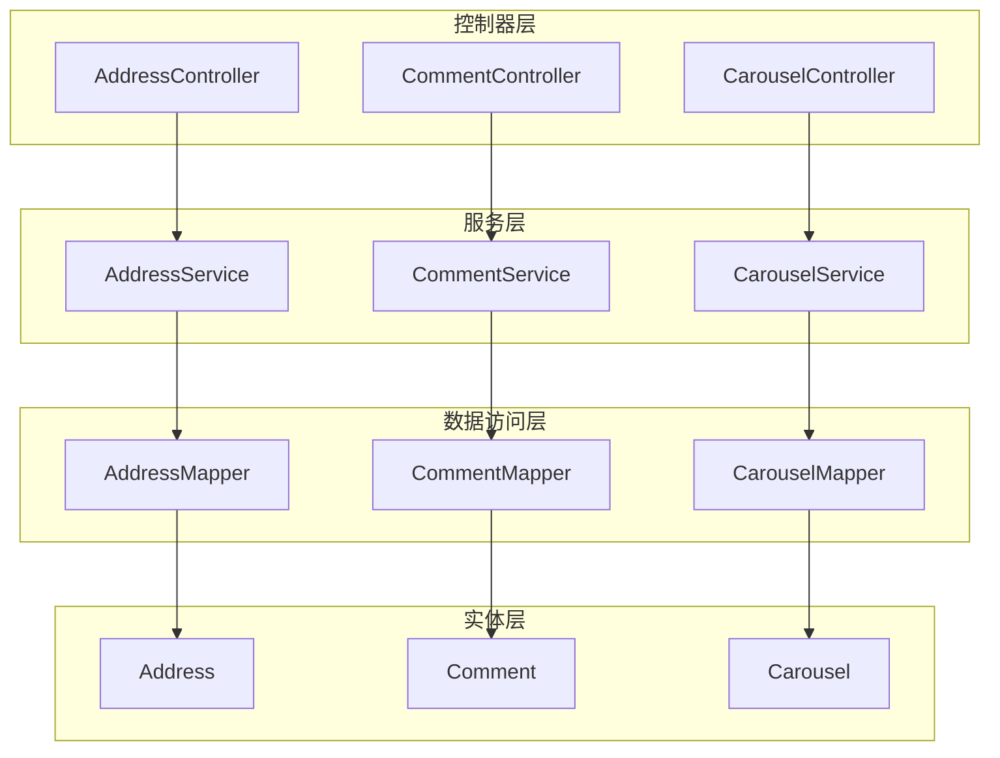
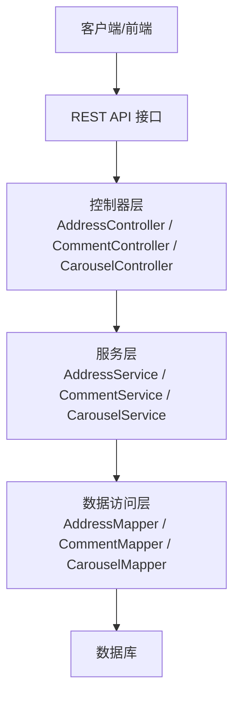
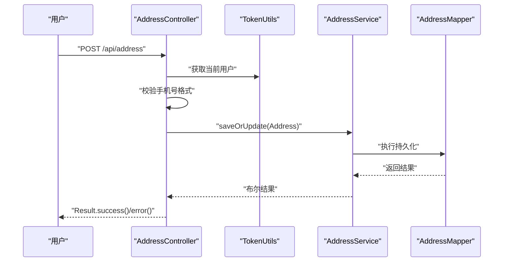
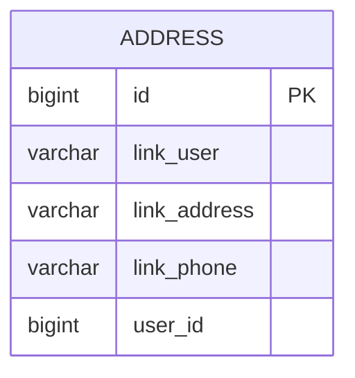
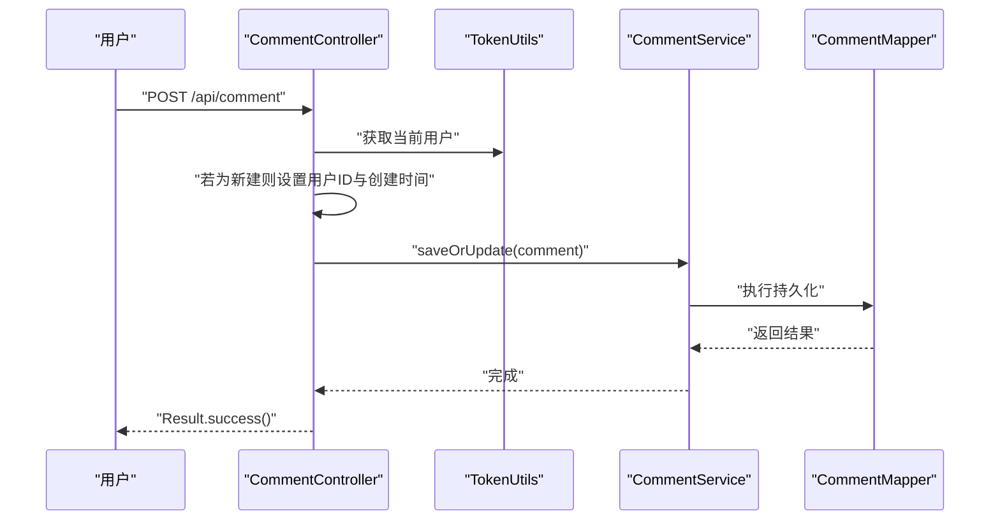
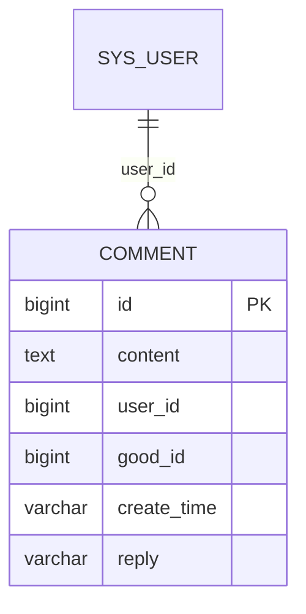
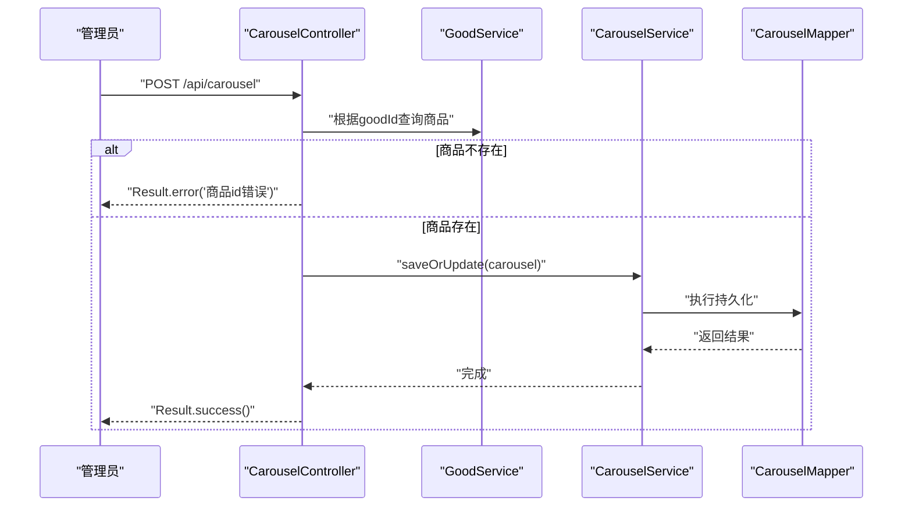
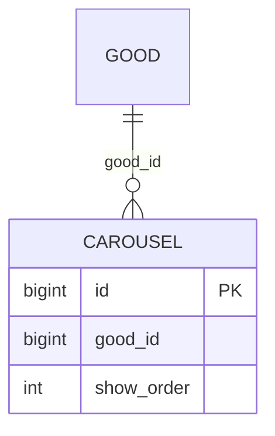
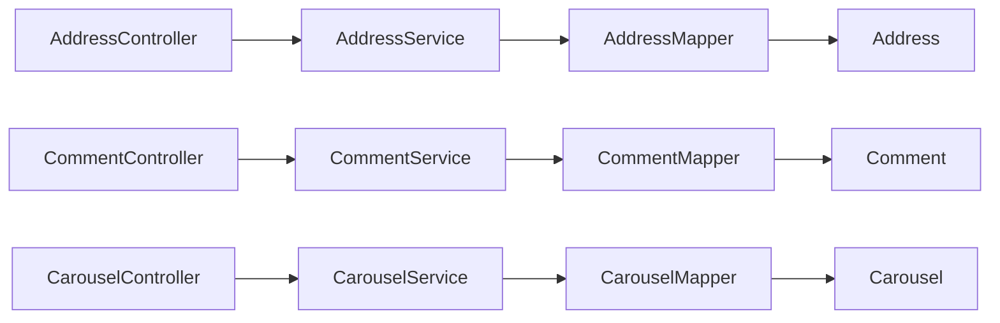

# 地址、评论、轮播图模块

<cite>
**本文引用的文件**
- [AddressController.java](file://mall-server/src/main/java/com/rabbiter/em/controller/AddressController.java)
- [AddressService.java](file://mall-server/src/main/java/com/rabbiter/em/service/AddressService.java)
- [AddressMapper.java](file://mall-server/src/main/java/com/rabbiter/em/mapper/AddressMapper.java)
- [Address.java](file://mall-server/src/main/java/com/rabbiter/em/entity/Address.java)
- [Address.xml](file://mall-server/src/main/resources/mapper/Address.xml)
- [CommentController.java](file://mall-server/src/main/java/com/rabbiter/em/controller/CommentController.java)
- [CommentService.java](file://mall-server/src/main/java/com/rabbiter/em/service/CommentService.java)
- [CommentMapper.java](file://mall-server/src/main/java/com/rabbiter/em/mapper/CommentMapper.java)
- [Comment.java](file://mall-server/src/main/java/com/rabbiter/em/entity/Comment.java)
- [CarouselController.java](file://mall-server/src/main/java/com/rabbiter/em/controller/CarouselController.java)
- [CarouselService.java](file://mall-server/src/main/java/com/rabbiter/em/service/CarouselService.java)
- [CarouselMapper.java](file://mall-server/src/main/java/com/rabbiter/em/mapper/CarouselMapper.java)
- [Carousel.java](file://mall-server/src/main/java/com/rabbiter/em/entity/Carousel.java)
- [Carousel.xml](file://mall-server/src/main/resources/mapper/Carousel.xml)
- [Authority.java](file://mall-server/src/main/java/com/rabbiter/em/annotation/Authority.java)
- [AuthorityType.java](file://mall-server/src/main/java/com/rabbiter/em/entity/AuthorityType.java)
- [TokenUtils.java](file://mall-server/src/main/java/com/rabbiter/em/utils/TokenUtils.java)
- [Result.java](file://mall-server/src/main/java/com/rabbiter/em/common/Result.java)
- [GlobalExceptionHandler.java](file://mall-server/src/main/java/com/rabbiter/em/config/GlobalExceptionHandler.java)
- [MybatisPlusConfig.java](file://mall-server/src/main/java/com/rabbiter/em/config/MybatisPlusConfig.java)
- [RedisConfig.java](file://mall-server/src/main/java/com/rabbiter/em/config/RedisConfig.java)
- [SwaggerConfig.java](file://mall-server/src/main/java/com/rabbiter/em/config/SwaggerConfig.java)
- [application.yml](file://mall-server/src/main/resources/application.yml)
</cite>

## 目录
1. [简介](#简介)
2. [项目结构](#项目结构)
3. [核心组件](#核心组件)
4. [架构总览](#架构总览)
5. [详细组件分析](#详细组件分析)
6. [依赖分析](#依赖分析)
7. [性能考虑](#性能考虑)
8. [故障排除指南](#故障排除指南)
9. [结论](#结论)
10. [附录](#附录)

## 简介
本文件为cosplay商城项目的“地址、评论、轮播图”模块综合技术文档。重点覆盖以下方面：
- 收货地址管理：增删改查、默认地址设置（如需）、地址验证逻辑与权限控制
- 商品评论系统：评论发布、回复字段、评论查询与删除、评论统计扩展点
- 轮播图管理：轮播项展示配置、顺序管理、与商品关联及内容更新机制
- 服务层与数据访问层实现：基于MyBatis-Plus的标准分层架构
- 控制器RESTful API设计与参数处理：鉴权注解、请求校验与统一返回
- 数据模型与业务流程图：实体关系与关键流程可视化
- 数据验证、权限控制与性能优化实践

## 项目结构
后端采用Spring Boot + MyBatis-Plus标准分层：
- controller 层：暴露REST接口，负责参数接收、鉴权与结果封装
- service 层：业务逻辑编排，调用mapper进行数据操作
- mapper 层：定义基础CRUD与自定义SQL
- entity 层：数据模型映射数据库表
- resources/mapper：XML映射文件（部分模块使用注解SQL）

图表来源
- [AddressController.java:17-86](file://mall-server/src/main/java/com/rabbiter/em/controller/AddressController.java#L17-L86)
- [CommentController.java:15-43](file://mall-server/src/main/java/com/rabbiter/em/controller/CommentController.java#L15-L43)
- [CarouselController.java:20-92](file://mall-server/src/main/java/com/rabbiter/em/controller/CarouselController.java#L20-L92)
- [AddressService.java:12-23](file://mall-server/src/main/java/com/rabbiter/em/service/AddressService.java#L12-L23)
- [CommentService.java:11-20](file://mall-server/src/main/java/com/rabbiter/em/service/CommentService.java#L11-L20)
- [CarouselService.java:11-19](file://mall-server/src/main/java/com/rabbiter/em/service/CarouselService.java#L11-L19)
- [AddressMapper.java:1-8](file://mall-server/src/main/java/com/rabbiter/em/mapper/AddressMapper.java#L1-L8)
- [CommentMapper.java:1-12](file://mall-server/src/main/java/com/rabbiter/em/mapper/CommentMapper.java#L1-L12)
- [CarouselMapper.java:1-11](file://mall-server/src/main/java/com/rabbiter/em/mapper/CarouselMapper.java#L1-L11)

章节来源
- [AddressController.java:17-86](file://mall-server/src/main/java/com/rabbiter/em/controller/AddressController.java#L17-L86)
- [CommentController.java:15-43](file://mall-server/src/main/java/com/rabbiter/em/controller/CommentController.java#L15-L43)
- [CarouselController.java:20-92](file://mall-server/src/main/java/com/rabbiter/em/controller/CarouselController.java#L20-L92)

## 核心组件
- 地址模块：基于AddressController、AddressService、AddressMapper与Address实体，提供按用户查询、保存、更新、删除地址的能力；内置手机号格式校验与鉴权控制
- 评论模块：基于CommentController、CommentService、CommentMapper与Comment实体，提供按商品查询评论列表、保存评论（含回复字段）、删除评论
- 轮播图模块：基于CarouselController、CarouselService、CarouselMapper与Carousel实体，提供轮播项查询、保存、更新、删除；通过XML映射关联商品名称与图片字段

章节来源
- [AddressService.java:12-23](file://mall-server/src/main/java/com/rabbiter/em/service/AddressService.java#L12-L23)
- [CommentService.java:11-20](file://mall-server/src/main/java/com/rabbiter/em/service/CommentService.java#L11-L20)
- [CarouselService.java:11-19](file://mall-server/src/main/java/com/rabbiter/em/service/CarouselService.java#L11-L19)

## 架构总览
三层架构清晰，控制器负责鉴权与参数处理，服务层封装业务，mapper负责数据持久化。

图表来源
- [AddressController.java:17-86](file://mall-server/src/main/java/com/rabbiter/em/controller/AddressController.java#L17-L86)
- [CommentController.java:15-43](file://mall-server/src/main/java/com/rabbiter/em/controller/CommentController.java#L15-L43)
- [CarouselController.java:20-92](file://mall-server/src/main/java/com/rabbiter/em/controller/CarouselController.java#L20-L92)
- [AddressService.java:12-23](file://mall-server/src/main/java/com/rabbiter/em/service/AddressService.java#L12-L23)
- [CommentService.java:11-20](file://mall-server/src/main/java/com/rabbiter/em/service/CommentService.java#L11-L20)
- [CarouselService.java:11-19](file://mall-server/src/main/java/com/rabbiter/em/service/CarouselService.java#L11-L19)

## 详细组件分析

### 地址模块（Address）
- 功能要点
  - 按用户ID查询地址列表
  - 新增/编辑地址（自动绑定当前登录用户ID）
  - 删除地址（仅限本人或管理员）
  - 参数校验：手机号11位数字
  - 权限控制：@Authority注解配合TokenUtils获取当前用户
- 关键流程（新增/编辑）

图表来源
- [AddressController.java:45-57](file://mall-server/src/main/java/com/rabbiter/em/controller/AddressController.java#L45-L57)
- [AddressService.java:18-22](file://mall-server/src/main/java/com/rabbiter/em/service/AddressService.java#L18-L22)
- [AddressMapper.java:1-8](file://mall-server/src/main/java/com/rabbiter/em/mapper/AddressMapper.java#L1-L8)

- 数据模型

图表来源
- [Address.java:8-34](file://mall-server/src/main/java/com/rabbiter/em/entity/Address.java#L8-L34)

- API设计与参数处理
  - GET /api/address/{userId}：按用户查询地址列表（鉴权：requireLogin）
  - GET /api/address：管理员查询全部（鉴权：requireAuthority）
  - POST /api/address：新增/编辑地址（鉴权：requireLogin），自动绑定用户ID，校验手机号
  - PUT /api/address：更新地址（鉴权：requireLogin），校验手机号，仅本人可改
  - DELETE /api/address/{id}：删除地址（鉴权：requireLogin），仅本人或管理员可删

章节来源
- [AddressController.java:29-85](file://mall-server/src/main/java/com/rabbiter/em/controller/AddressController.java#L29-L85)
- [AddressService.java:18-22](file://mall-server/src/main/java/com/rabbiter/em/service/AddressService.java#L18-L22)
- [AddressMapper.java:1-8](file://mall-server/src/main/java/com/rabbiter/em/mapper/AddressMapper.java#L1-L8)
- [Address.java:8-34](file://mall-server/src/main/java/com/rabbiter/em/entity/Address.java#L8-L34)
- [Address.xml:1-5](file://mall-server/src/main/resources/mapper/Address.xml#L1-L5)

### 评论模块（Comment）
- 功能要点
  - 按商品ID查询评论列表（带用户昵称与头像拼接）
  - 发布评论（首次创建时写入当前用户ID与创建时间）
  - 删除评论
- 关键流程（发布评论）

图表来源
- [CommentController.java:28-36](file://mall-server/src/main/java/com/rabbiter/em/controller/CommentController.java#L28-L36)
- [CommentService.java:17-19](file://mall-server/src/main/java/com/rabbiter/em/service/CommentService.java#L17-L19)
- [CommentMapper.java:10-11](file://mall-server/src/main/java/com/rabbiter/em/mapper/CommentMapper.java#L10-L11)

- 数据模型

图表来源
- [Comment.java:9-28](file://mall-server/src/main/java/com/rabbiter/em/entity/Comment.java#L9-L28)

- API设计与参数处理
  - GET /api/comment/good/{goodId}：按商品查询评论列表（鉴权：noRequire）
  - POST /api/comment：发布评论（鉴权：requireLogin），自动填充用户ID与创建时间
  - DELETE /api/comment/{id}：删除评论（鉴权：requireLogin）

章节来源
- [CommentController.java:22-42](file://mall-server/src/main/java/com/rabbiter/em/controller/CommentController.java#L22-L42)
- [CommentService.java:17-19](file://mall-server/src/main/java/com/rabbiter/em/service/CommentService.java#L17-L19)
- [CommentMapper.java:10-11](file://mall-server/src/main/java/com/rabbiter/em/mapper/CommentMapper.java#L10-L11)
- [Comment.java:9-28](file://mall-server/src/main/java/com/rabbiter/em/entity/Comment.java#L9-L28)

### 轮播图模块（Carousel）
- 功能要点
  - 查询单个轮播项与全部轮播项（带商品名称与图片字段）
  - 保存/更新轮播项（需关联有效商品ID）
  - 删除轮播项
- 关键流程（保存轮播项）

图表来源
- [CarouselController.java:57-66](file://mall-server/src/main/java/com/rabbiter/em/controller/CarouselController.java#L57-L66)
- [CarouselService.java:17-19](file://mall-server/src/main/java/com/rabbiter/em/service/CarouselService.java#L17-L19)
- [CarouselMapper.java:10-11](file://mall-server/src/main/java/com/rabbiter/em/mapper/CarouselMapper.java#L10-L11)

- 数据模型

图表来源
- [Carousel.java:9-31](file://mall-server/src/main/java/com/rabbiter/em/entity/Carousel.java#L9-L31)

- API设计与参数处理
  - GET /api/carousel/{id}：按ID查询（鉴权：noRequire）
  - GET /api/carousel：查询全部轮播项（鉴权：noRequire）
  - POST /api/carousel：保存轮播项（鉴权：requireAuthority），校验商品ID有效性
  - PUT /api/carousel：更新轮播项（鉴权：requireAuthority），校验商品ID有效性
  - DELETE /api/carousel/{id}：删除轮播项（鉴权：requireAuthority）

章节来源
- [CarouselController.java:41-86](file://mall-server/src/main/java/com/rabbiter/em/controller/CarouselController.java#L41-L86)
- [CarouselService.java:17-19](file://mall-server/src/main/java/com/rabbiter/em/service/CarouselService.java#L17-L19)
- [CarouselMapper.java:10-11](file://mall-server/src/main/java/com/rabbiter/em/mapper/CarouselMapper.java#L10-L11)
- [Carousel.java:9-31](file://mall-server/src/main/java/com/rabbiter/em/entity/Carousel.java#L9-L31)
- [Carousel.xml:5-7](file://mall-server/src/main/resources/mapper/Carousel.xml#L5-L7)

## 依赖分析
- 控制器依赖
  - AddressController：依赖AddressService、TokenUtils、Authority注解、Result封装
  - CommentController：依赖CommentService、TokenUtils、Authority注解、Result封装
  - CarouselController：依赖CarouselService、GoodService、UserService、Authority注解、Result封装
- 服务层依赖
  - AddressService：继承ServiceImpl<AddressMapper, Address>，依赖AddressMapper
  - CommentService：继承ServiceImpl<CommentMapper, Comment>，依赖CommentMapper
  - CarouselService：继承ServiceImpl<CarouselMapper, Carousel>，依赖CarouselMapper
- 数据访问层依赖
  - AddressMapper：BaseMapper<Address>
  - CommentMapper：BaseMapper<Comment> + 自定义SQL
  - CarouselMapper：BaseMapper<Carousel> + 自定义SQL
- 实体依赖
  - Address/Comment/Carousel分别映射各自表结构，部分实体包含冗余字段用于展示（如用户名、头像、商品名、图片）

图表来源
- [AddressController.java:21-22](file://mall-server/src/main/java/com/rabbiter/em/controller/AddressController.java#L21-L22)
- [CommentController.java:19-20](file://mall-server/src/main/java/com/rabbiter/em/controller/CommentController.java#L19-L20)
- [CarouselController.java:23-30](file://mall-server/src/main/java/com/rabbiter/em/controller/CarouselController.java#L23-L30)
- [AddressService.java:13-16](file://mall-server/src/main/java/com/rabbiter/em/service/AddressService.java#L13-L16)
- [CommentService.java:12-15](file://mall-server/src/main/java/com/rabbiter/em/service/CommentService.java#L12-L15)
- [CarouselService.java:12-15](file://mall-server/src/main/java/com/rabbiter/em/service/CarouselService.java#L12-L15)

章节来源
- [AddressController.java:21-22](file://mall-server/src/main/java/com/rabbiter/em/controller/AddressController.java#L21-L22)
- [CommentController.java:19-20](file://mall-server/src/main/java/com/rabbiter/em/controller/CommentController.java#L19-L20)
- [CarouselController.java:23-30](file://mall-server/src/main/java/com/rabbiter/em/controller/CarouselController.java#L23-L30)
- [AddressService.java:13-16](file://mall-server/src/main/java/com/rabbiter/em/service/AddressService.java#L13-L16)
- [CommentService.java:12-15](file://mall-server/src/main/java/com/rabbiter/em/service/CommentService.java#L12-L15)
- [CarouselService.java:12-15](file://mall-server/src/main/java/com/rabbiter/em/service/CarouselService.java#L12-L15)

## 性能考虑
- 分页与排序
  - 建议在查询列表时引入分页参数，避免一次性加载过多数据
  - 轮播查询已按show_order升序，建议在数据库层面建立索引以提升排序性能
- 缓存策略
  - 评论列表与轮播列表可引入Redis缓存，减少频繁查询数据库的压力
  - 缓存键建议包含商品ID或轮播类型标识，避免脏读
- SQL优化
  - 评论查询使用LEFT JOIN关联用户表，建议在user_id与good_id上建立索引
  - 轮播查询使用多表连接，建议对good_id建立索引
- 并发控制
  - 地址删除与评论删除建议增加乐观锁或版本号，防止并发误删
- 日志与监控
  - 对高频接口增加访问日志与慢查询记录，便于定位性能瓶颈

## 故障排除指南
- 常见错误与处理
  - 无权访问他人地址/评论/轮播项：检查Token是否正确、用户角色与资源归属
  - 保存失败：确认手机号格式、商品ID有效性、必填字段完整性
  - 查询为空：确认条件参数（如goodId、userId）是否正确
- 异常处理
  - 全局异常处理器统一拦截服务异常，返回Result.error封装的错误信息
  - 控制器内对非法参数直接返回Result.error，避免抛出未捕获异常
- 调试建议
  - 使用Swagger查看接口文档与示例
  - 在application.yml中开启相应日志级别，定位SQL与业务逻辑问题

章节来源
- [GlobalExceptionHandler.java](file://mall-server/src/main/java/com/rabbiter/em/config/GlobalExceptionHandler.java)
- [Result.java](file://mall-server/src/main/java/com/rabbiter/em/common/Result.java)
- [AddressController.java:33-34](file://mall-server/src/main/java/com/rabbiter/em/controller/AddressController.java#L33-L34)
- [CommentController.java:38-42](file://mall-server/src/main/java/com/rabbiter/em/controller/CommentController.java#L38-L42)
- [CarouselController.java:61-63](file://mall-server/src/main/java/com/rabbiter/em/controller/CarouselController.java#L61-L63)

## 结论
本模块遵循标准的分层架构，控制器负责鉴权与参数处理，服务层封装业务逻辑，mapper层承担数据持久化。地址、评论、轮播图三大功能边界清晰，具备良好的扩展性。建议后续在评论统计、轮播动态配置、缓存与分页等方面进一步完善，以提升用户体验与系统性能。

## 附录

### 鉴权与工具类
- 鉴权注解与类型
  - @Authority注解与AuthorityType枚举用于声明接口权限要求
  - requireLogin：需登录
  - requireAuthority：需管理员权限
  - noRequire：无需鉴权
- Token工具
  - TokenUtils：从上下文中获取当前用户信息，供控制器与服务层使用

章节来源
- [Authority.java](file://mall-server/src/main/java/com/rabbiter/em/annotation/Authority.java)
- [AuthorityType.java](file://mall-server/src/main/java/com/rabbiter/em/entity/AuthorityType.java)
- [TokenUtils.java](file://mall-server/src/main/java/com/rabbiter/em/utils/TokenUtils.java)

### 配置与基础设施
- MyBatis-Plus配置：分页插件等
- Redis配置：缓存相关
- Swagger配置：接口文档
- application.yml：数据库、Redis、日志等配置入口

章节来源
- [MybatisPlusConfig.java](file://mall-server/src/main/java/com/rabbiter/em/config/MybatisPlusConfig.java)
- [RedisConfig.java](file://mall-server/src/main/java/com/rabbiter/em/config/RedisConfig.java)
- [SwaggerConfig.java](file://mall-server/src/main/java/com/rabbiter/em/config/SwaggerConfig.java)
- [application.yml](file://mall-server/src/main/resources/application.yml)