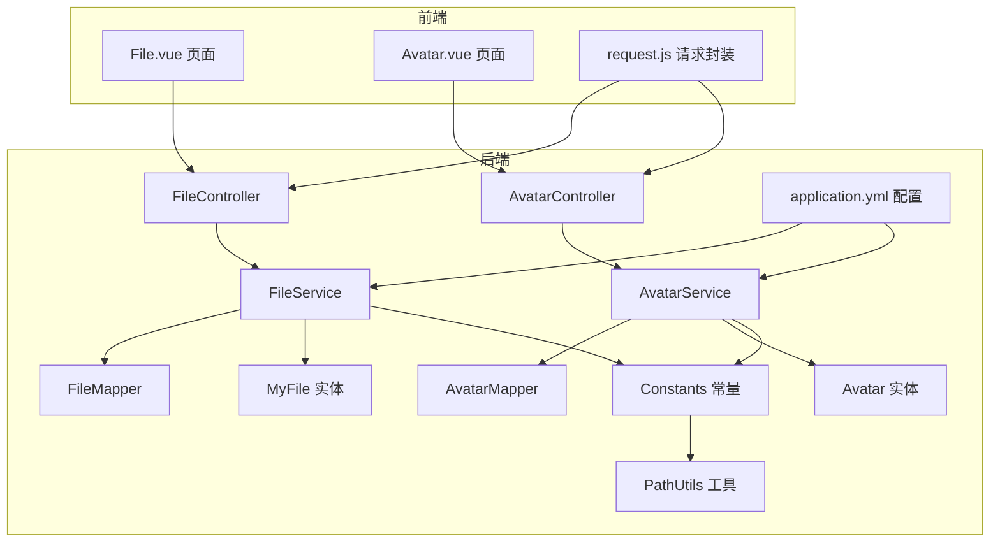
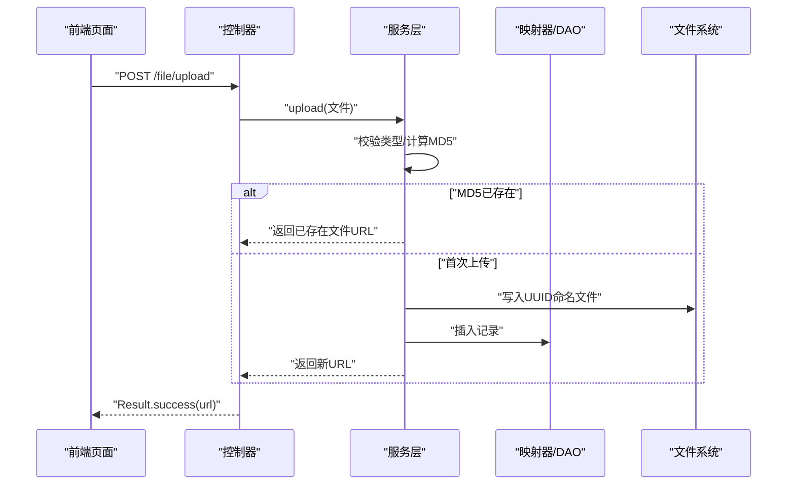
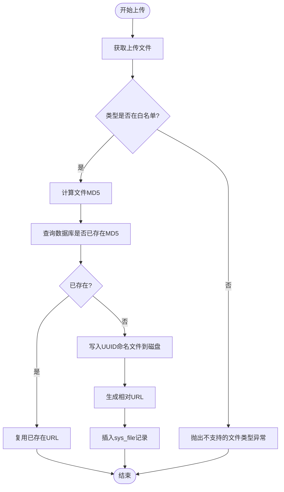
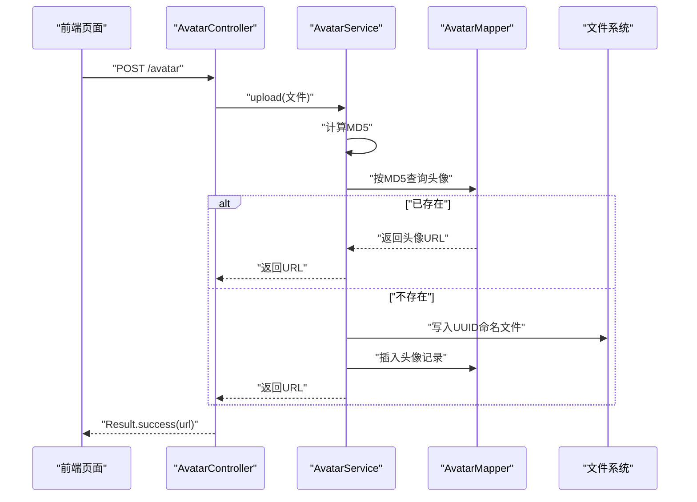
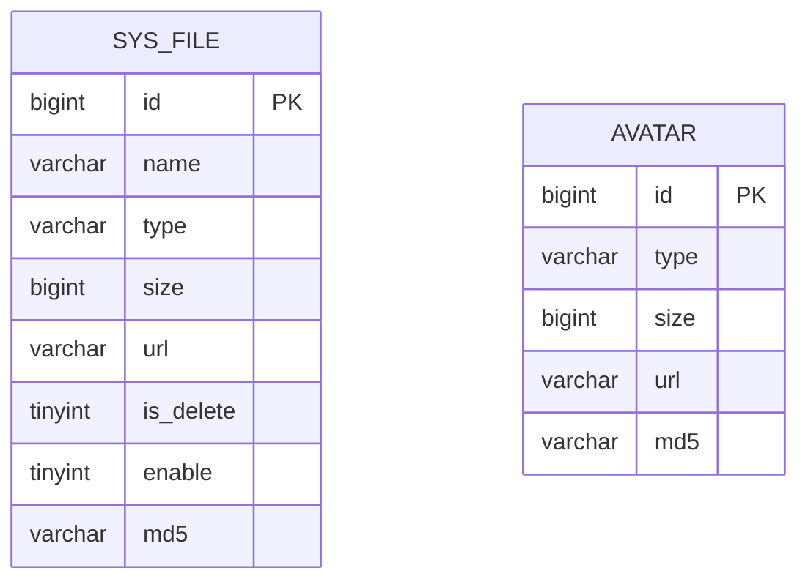
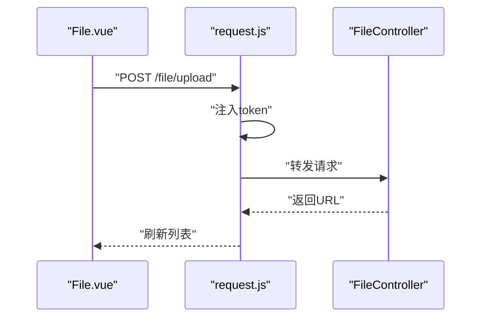
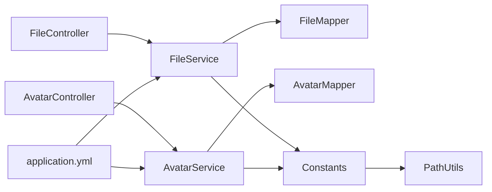

# 文件管理模块

<cite>
**本文引用的文件**
- [FileController.java](file://mall-server/src/main/java/com/rabbiter/em/controller/FileController.java)
- [AvatarController.java](file://mall-server/src/main/java/com/rabbiter/em/controller/AvatarController.java)
- [FileService.java](file://mall-server/src/main/java/com/rabbiter/em/service/FileService.java)
- [AvatarService.java](file://mall-server/src/main/java/com/rabbiter/em/service/AvatarService.java)
- [FileMapper.java](file://mall-server/src/main/java/com/rabbiter/em/mapper/FileMapper.java)
- [AvatarMapper.java](file://mall-server/src/main/java/com/rabbiter/em/mapper/AvatarMapper.java)
- [MyFile.java](file://mall-server/src/main/java/com/rabbiter/em/entity/MyFile.java)
- [Avatar.java](file://mall-server/src/main/java/com/rabbiter/em/entity/Avatar.java)
- [Constants.java](file://mall-server/src/main/java/com/rabbiter/em/constants/Constants.java)
- [PathUtils.java](file://mall-server/src/main/java/com/rabbiter/em/utils/PathUtils.java)
- [application.yml](file://mall-server/src/main/resources/application.yml)
- [s003.sql](file://s003.sql)
- [File.vue](file://mall-web/src/views/manage/file/File.vue)
- [Avatar.vue](file://mall-web/src/views/manage/file/Avatar.vue)
- [request.js](file://mall-web/src/utils/request.js)
</cite>

## 目录
1. [简介](#简介)
2. [项目结构](#项目结构)
3. [核心组件](#核心组件)
4. [架构总览](#架构总览)
5. [详细组件分析](#详细组件分析)
6. [依赖分析](#依赖分析)
7. [性能考虑](#性能考虑)
8. [故障排查指南](#故障排查指南)
9. [结论](#结论)
10. [附录](#附录)

## 简介
本文件管理模块围绕“文件上传与管理”和“头像管理”两大功能展开，提供统一的文件存储策略、类型校验、去重（基于MD5）与路径管理；同时针对头像场景提供独立的存储目录与更严格的重复利用策略。后端采用Spring Boot + MyBatis-Plus，前端使用Vue + Element Plus，通过REST接口完成文件上传、下载、分页查询、批量删除与启用/禁用等操作。

## 项目结构
- 后端模块
  - 控制层：FileController、AvatarController
  - 服务层：FileService、AvatarService
  - 数据访问层：FileMapper、AvatarMapper
  - 实体模型：MyFile、Avatar
  - 常量与工具：Constants、PathUtils
  - 配置：application.yml
- 前端模块
  - 文件管理页面：File.vue
  - 头像管理页面：Avatar.vue
  - 请求封装：request.js

**图表来源**
- [FileController.java:1-80](file://mall-server/src/main/java/com/rabbiter/em/controller/FileController.java#L1-L80)
- [AvatarController.java:1-58](file://mall-server/src/main/java/com/rabbiter/em/controller/AvatarController.java#L1-L58)
- [FileService.java:1-141](file://mall-server/src/main/java/com/rabbiter/em/service/FileService.java#L1-L141)
- [AvatarService.java:1-110](file://mall-server/src/main/java/com/rabbiter/em/service/AvatarService.java#L1-L110)
- [FileMapper.java:1-10](file://mall-server/src/main/java/com/rabbiter/em/mapper/FileMapper.java#L1-L10)
- [AvatarMapper.java:1-29](file://mall-server/src/main/java/com/rabbiter/em/mapper/AvatarMapper.java#L1-L29)
- [MyFile.java:1-113](file://mall-server/src/main/java/com/rabbiter/em/entity/MyFile.java#L1-L113)
- [Avatar.java:1-75](file://mall-server/src/main/java/com/rabbiter/em/entity/Avatar.java#L1-L75)
- [Constants.java:1-16](file://mall-server/src/main/java/com/rabbiter/em/constants/Constants.java#L1-L16)
- [PathUtils.java:1-30](file://mall-server/src/main/java/com/rabbiter/em/utils/PathUtils.java#L1-L30)
- [application.yml:1-42](file://mall-server/src/main/resources/application.yml#L1-L42)

**章节来源**
- [FileController.java:1-80](file://mall-server/src/main/java/com/rabbiter/em/controller/FileController.java#L1-L80)
- [AvatarController.java:1-58](file://mall-server/src/main/java/com/rabbiter/em/controller/AvatarController.java#L1-L58)
- [FileService.java:1-141](file://mall-server/src/main/java/com/rabbiter/em/service/FileService.java#L1-L141)
- [AvatarService.java:1-110](file://mall-server/src/main/java/com/rabbiter/em/service/AvatarService.java#L1-L110)
- [application.yml:1-42](file://mall-server/src/main/resources/application.yml#L1-L42)

## 核心组件
- 文件控制器（FileController）
  - 提供单文件上传、按文件名下载、按ID软删除、批量删除、启用/禁用、分页查询等功能。
- 头像控制器（AvatarController）
  - 提供头像上传、按文件名下载、按ID删除、分页查询等功能。
- 文件服务（FileService）
  - 负责文件类型白名单校验、MD5去重、UUID命名、物理存储、URL生成与持久化。
- 头像服务（AvatarService）
  - 负责头像MD5去重、UUID命名、物理存储、URL生成与持久化。
- 映射器（FileMapper、AvatarMapper）
  - MyBatis-Plus基础映射与自定义SQL。
- 实体（MyFile、Avatar）
  - 对应数据库表sys_file与avatar的Java模型。
- 常量与路径（Constants、PathUtils）
  - 定义文件与头像存储根路径，路径解析兼容多操作系统。
- 前端页面（File.vue、Avatar.vue）
  - 提供上传、下载、删除、分页、批量操作等交互。

**章节来源**
- [FileController.java:17-79](file://mall-server/src/main/java/com/rabbiter/em/controller/FileController.java#L17-L79)
- [AvatarController.java:17-57](file://mall-server/src/main/java/com/rabbiter/em/controller/AvatarController.java#L17-L57)
- [FileService.java:41-98](file://mall-server/src/main/java/com/rabbiter/em/service/FileService.java#L41-L98)
- [AvatarService.java:33-70](file://mall-server/src/main/java/com/rabbiter/em/service/AvatarService.java#L33-L70)
- [FileMapper.java:1-10](file://mall-server/src/main/java/com/rabbiter/em/mapper/FileMapper.java#L1-L10)
- [AvatarMapper.java:12-28](file://mall-server/src/main/java/com/rabbiter/em/mapper/AvatarMapper.java#L12-L28)
- [MyFile.java:8-19](file://mall-server/src/main/java/com/rabbiter/em/entity/MyFile.java#L8-L19)
- [Avatar.java:6-12](file://mall-server/src/main/java/com/rabbiter/em/entity/Avatar.java#L6-L12)
- [Constants.java:12-14](file://mall-server/src/main/java/com/rabbiter/em/constants/Constants.java#L12-L14)
- [PathUtils.java:7-28](file://mall-server/src/main/java/com/rabbiter/em/utils/PathUtils.java#L7-L28)
- [File.vue:18-22](file://mall-web/src/views/manage/file/File.vue#L18-L22)
- [Avatar.vue:4-37](file://mall-web/src/views/manage/file/Avatar.vue#L4-L37)

## 架构总览
后端采用经典的MVC分层：
- 控制器接收HTTP请求，进行鉴权与参数校验，调用服务层。
- 服务层负责业务逻辑（类型校验、MD5去重、存储、URL生成、分页查询、软删除）。
- 映射器负责数据库读写。
- 前端通过Axios发起请求，经拦截器统一注入Token与处理响应。

**图表来源**
- [FileController.java:25-29](file://mall-server/src/main/java/com/rabbiter/em/controller/FileController.java#L25-L29)
- [FileService.java:47-98](file://mall-server/src/main/java/com/rabbiter/em/service/FileService.java#L47-L98)
- [FileMapper.java:1-10](file://mall-server/src/main/java/com/rabbiter/em/mapper/FileMapper.java#L1-L10)

## 详细组件分析

### 文件上传与管理（FileService 与 FileController）
- 上传流程
  - 类型白名单：仅允许指定扩展名，避免恶意文件。
  - MD5去重：对文件内容计算MD5，若数据库已存在则复用URL，节省存储。
  - 命名策略：UUID命名，扩展名保留，生成相对URL。
  - 存储位置：由Constants结合PathUtils解析得到，确保跨平台兼容。
  - 持久化：将文件元信息（名称、类型、大小、URL、MD5）写入sys_file。
- 下载流程
  - 根据URL拼接物理路径，校验文件是否存在，输出二进制流。
- 管理能力
  - 分页查询：支持按文件名模糊查询、排除软删除记录。
  - 启用/禁用：通过布尔字段控制文件可用性。
  - 软删除：更新is_delete标记，不实际删除文件。

**图表来源**
- [FileService.java:41-98](file://mall-server/src/main/java/com/rabbiter/em/service/FileService.java#L41-L98)
- [Constants.java:12-14](file://mall-server/src/main/java/com/rabbiter/em/constants/Constants.java#L12-L14)
- [PathUtils.java:7-28](file://mall-server/src/main/java/com/rabbiter/em/utils/PathUtils.java#L7-L28)

**章节来源**
- [FileController.java:25-78](file://mall-server/src/main/java/com/rabbiter/em/controller/FileController.java#L25-L78)
- [FileService.java:41-139](file://mall-server/src/main/java/com/rabbiter/em/service/FileService.java#L41-L139)
- [FileMapper.java:1-10](file://mall-server/src/main/java/com/rabbiter/em/mapper/FileMapper.java#L1-L10)
- [MyFile.java:8-19](file://mall-server/src/main/java/com/rabbiter/em/entity/MyFile.java#L8-L19)
- [application.yml:20-21](file://mall-server/src/main/resources/application.yml#L20-L21)

### 头像管理（AvatarService 与 AvatarController）
- 特殊处理逻辑
  - 与文件上传类似，但头像场景更强调重复利用，直接按MD5查询头像记录。
  - 存储目录独立，URL前缀为/avatar/。
  - 删除时同步删除磁盘文件。
- API设计
  - 上传：接收multipart文件，返回URL。
  - 下载：根据文件名从avatar目录读取。
  - 删除：按ID删除记录，并清理磁盘文件。
  - 分页：自定义SQL分页查询与总数统计。

**图表来源**
- [AvatarController.java:24-28](file://mall-server/src/main/java/com/rabbiter/em/controller/AvatarController.java#L24-L28)
- [AvatarService.java:33-70](file://mall-server/src/main/java/com/rabbiter/em/service/AvatarService.java#L33-L70)
- [AvatarMapper.java:13-17](file://mall-server/src/main/java/com/rabbiter/em/mapper/AvatarMapper.java#L13-L17)

**章节来源**
- [AvatarController.java:24-56](file://mall-server/src/main/java/com/rabbiter/em/controller/AvatarController.java#L24-L56)
- [AvatarService.java:33-108](file://mall-server/src/main/java/com/rabbiter/em/service/AvatarService.java#L33-L108)
- [AvatarMapper.java:13-27](file://mall-server/src/main/java/com/rabbiter/em/mapper/AvatarMapper.java#L13-L27)
- [Avatar.java:6-12](file://mall-server/src/main/java/com/rabbiter/em/entity/Avatar.java#L6-L12)

### 数据模型与存储架构
- sys_file（系统文件表）
  - 主要字段：id、name、type、size、url、is_delete、enable、md5。
- avatar（头像表）
  - 主要字段：id、type、size、url、md5。
- 存储路径
  - fileFolderPath：/file/
  - avatarFolderPath：/avatar/

**图表来源**
- [s003.sql:248-261](file://s003.sql#L248-L261)
- [s003.sql:44-54](file://s003.sql#L44-L54)

**章节来源**
- [s003.sql:248-271](file://s003.sql#L248-L271)
- [s003.sql:44-54](file://s003.sql#L44-L54)

### 前端集成与交互
- File.vue
  - 使用Element Plus Upload组件直连后端上传接口。
  - 支持搜索、分页、批量删除、启用/禁用切换。
- Avatar.vue
  - 展示头像缩略图、下载与删除。
- request.js
  - 统一设置请求头、注入Token、处理401跳转登录。

**图表来源**
- [File.vue:18-20](file://mall-web/src/views/manage/file/File.vue#L18-L20)
- [request.js:13-19](file://mall-web/src/utils/request.js#L13-L19)
- [FileController.java:25-29](file://mall-server/src/main/java/com/rabbiter/em/controller/FileController.java#L25-L29)

**章节来源**
- [File.vue:18-22](file://mall-web/src/views/manage/file/File.vue#L18-L22)
- [Avatar.vue:4-37](file://mall-web/src/views/manage/file/Avatar.vue#L4-L37)
- [request.js:13-19](file://mall-web/src/utils/request.js#L13-L19)

## 依赖分析
- 控制器依赖服务层，服务层依赖映射器与常量配置。
- FileService与AvatarService共享路径解析与MD5去重策略。
- 前端通过统一请求封装与后端交互，遵循REST规范。

**图表来源**
- [FileController.java:22-23](file://mall-server/src/main/java/com/rabbiter/em/controller/FileController.java#L22-L23)
- [AvatarController.java:22-23](file://mall-server/src/main/java/com/rabbiter/em/controller/AvatarController.java#L22-L23)
- [FileService.java:38-39](file://mall-server/src/main/java/com/rabbiter/em/service/FileService.java#L38-L39)
- [AvatarService.java:30-31](file://mall-server/src/main/java/com/rabbiter/em/service/AvatarService.java#L30-L31)
- [Constants.java:12-14](file://mall-server/src/main/java/com/rabbiter/em/constants/Constants.java#L12-L14)
- [PathUtils.java:7-28](file://mall-server/src/main/java/com/rabbiter/em/utils/PathUtils.java#L7-L28)
- [application.yml:1-42](file://mall-server/src/main/resources/application.yml#L1-L42)

**章节来源**
- [FileController.java:17-79](file://mall-server/src/main/java/com/rabbiter/em/controller/FileController.java#L17-L79)
- [AvatarController.java:17-57](file://mall-server/src/main/java/com/rabbiter/em/controller/AvatarController.java#L17-L57)
- [FileService.java:34-98](file://mall-server/src/main/java/com/rabbiter/em/service/FileService.java#L34-L98)
- [AvatarService.java:26-70](file://mall-server/src/main/java/com/rabbiter/em/service/AvatarService.java#L26-L70)
- [application.yml:1-42](file://mall-server/src/main/resources/application.yml#L1-L42)

## 性能考虑
- 去重策略：通过MD5避免重复存储，显著降低磁盘占用与IO压力。
- 流式写入：使用transferTo进行高效文件落盘。
- 分页查询：数据库侧分页，避免一次性加载大量记录。
- 上传限制：通过配置限制单文件大小，防止内存溢出。
- 建议
  - 对大文件可引入分片上传与断点续传（当前未实现）。
  - 引入缓存层减少频繁查询MD5命中率。
  - 对热点文件可考虑CDN加速。

[本节为通用建议，无需具体文件分析]

## 故障排查指南
- 上传失败
  - 检查文件类型是否在白名单内。
  - 确认存储目录是否存在且具备写权限。
  - 查看日志定位IO异常或MD5计算失败。
- 下载失败
  - 确认URL对应的物理文件是否存在。
  - 检查响应头与字符编码设置。
- 删除异常
  - 软删除仅更新标记，磁盘文件仍保留。
  - 头像删除会同步删除磁盘文件，确认路径正确。
- 权限问题
  - 控制器方法标注了权限注解，需携带有效Token或满足权限要求。

**章节来源**
- [FileService.java:100-116](file://mall-server/src/main/java/com/rabbiter/em/service/FileService.java#L100-L116)
- [AvatarService.java:71-87](file://mall-server/src/main/java/com/rabbiter/em/service/AvatarService.java#L71-L87)
- [FileController.java:31-46](file://mall-server/src/main/java/com/rabbiter/em/controller/FileController.java#L31-L46)
- [AvatarController.java:35-44](file://mall-server/src/main/java/com/rabbiter/em/controller/AvatarController.java#L35-L44)

## 结论
文件管理模块通过清晰的分层设计与去重策略，实现了稳定高效的文件上传与管理能力；头像模块在通用策略基础上强化了重复利用与磁盘清理。当前版本未包含断点续传与进度跟踪，后续可扩展以支持大文件场景与云存储迁移。

[本节为总结，无需具体文件分析]

## 附录

### API 设计要点
- 文件上传
  - 方法：POST /file/upload
  - 参数：multipart file
  - 返回：文件URL
- 文件下载
  - 方法：GET /file/{fileName}
  - 返回：二进制流
- 文件管理
  - GET /file/{id}：下载
  - DELETE /file/{id}：软删除
  - POST /file/del/batch：批量删除
  - GET /file/enable：启用/禁用
  - GET /file/page：分页查询
- 头像上传
  - 方法：POST /avatar
  - 参数：multipart file
  - 返回：头像URL
- 头像下载
  - 方法：GET /avatar/{fileName}
  - 返回：二进制流
- 头像管理
  - DELETE /avatar/{id}：删除并清理磁盘
  - GET /avatar/page：分页查询

**章节来源**
- [FileController.java:25-78](file://mall-server/src/main/java/com/rabbiter/em/controller/FileController.java#L25-L78)
- [AvatarController.java:24-56](file://mall-server/src/main/java/com/rabbiter/em/controller/AvatarController.java#L24-L56)

### 存储策略与路径管理
- 存储根路径
  - fileFolderPath：/file/
  - avatarFolderPath：/avatar/
- 路径解析
  - 通过PathUtils解析ClassLoader根路径，兼容Windows、Linux、macOS。
- 命名与URL
  - UUID命名，扩展名保留，URL为相对路径，便于部署环境迁移。

**章节来源**
- [Constants.java:12-14](file://mall-server/src/main/java/com/rabbiter/em/constants/Constants.java#L12-L14)
- [PathUtils.java:7-28](file://mall-server/src/main/java/com/rabbiter/em/utils/PathUtils.java#L7-L28)

### 安全策略与访问控制
- 文件类型白名单：限制常见办公与静态资源类型，避免脚本或可执行文件。
- MD5去重：防止重复存储与潜在重复攻击。
- 下载校验：存在性检查与异常日志记录。
- 权限注解：部分接口要求登录或特定权限，前端需携带Token。
- 上传大小限制：通过配置限制单文件大小，降低资源消耗。

**章节来源**
- [FileService.java:41-52](file://mall-server/src/main/java/com/rabbiter/em/service/FileService.java#L41-L52)
- [application.yml:20-21](file://mall-server/src/main/resources/application.yml#L20-L21)
- [FileController.java:17-17](file://mall-server/src/main/java/com/rabbiter/em/controller/FileController.java#L17-L17)
- [AvatarController.java:35-35](file://mall-server/src/main/java/com/rabbiter/em/controller/AvatarController.java#L35-L35)

### 扩展至云存储与其它存储服务
- 抽象存储适配器
  - 新增存储接口，定义上传、下载、删除、存在性检查等方法。
  - 在服务层注入不同实现（本地/云存储），通过配置切换。
- 云存储集成建议
  - 对象存储（如OSS、Cos、S3）：使用SDK进行直传签名或服务端中转。
  - CDN加速：上传完成后返回CDN URL，下载走CDN链路。
  - 断点续传：基于分片与进度跟踪，结合服务端校验与去重。
- 迁移策略
  - 保持URL抽象与实体字段不变，仅替换底层存储实现。
  - 逐步迁移历史文件，保证URL一致性与可用性。

[本节为概念性扩展建议，无需具体文件分析]