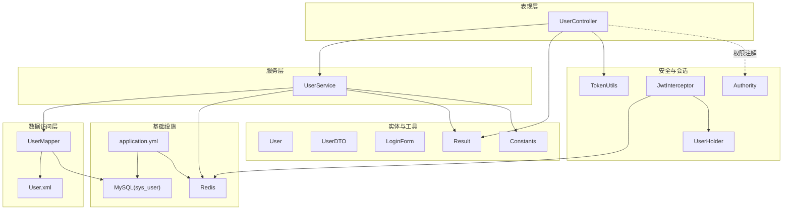
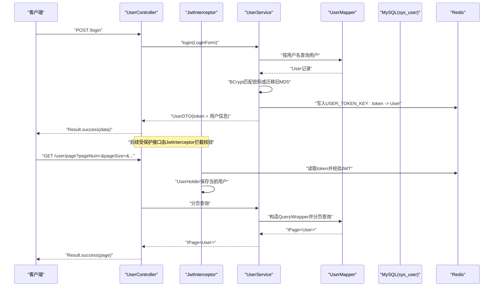
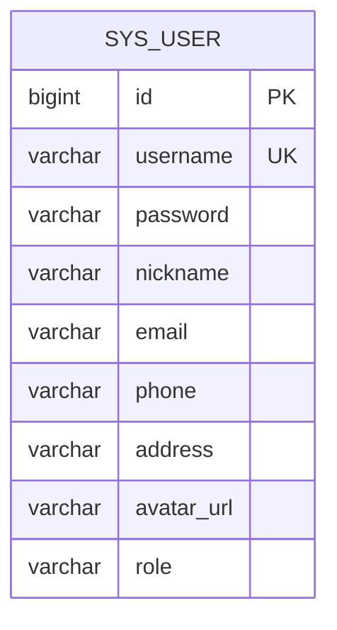
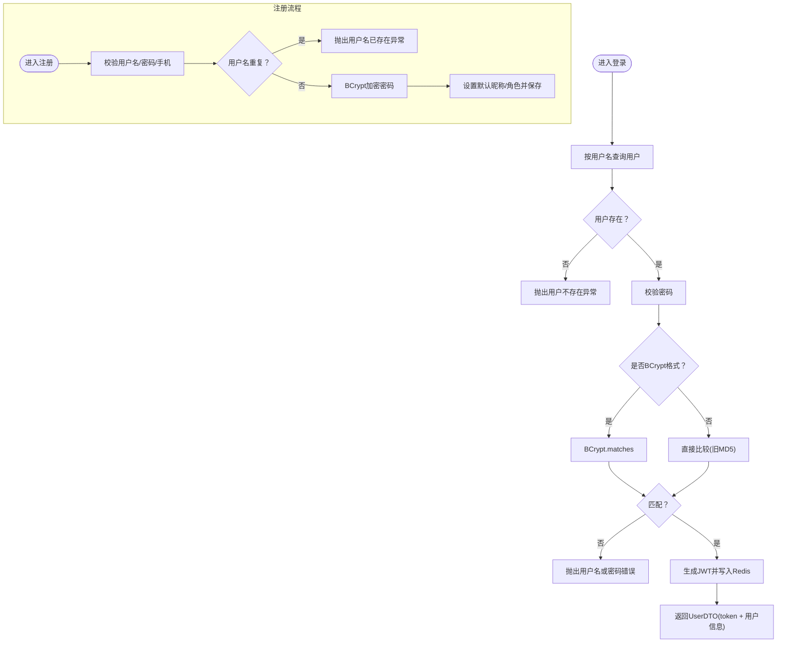
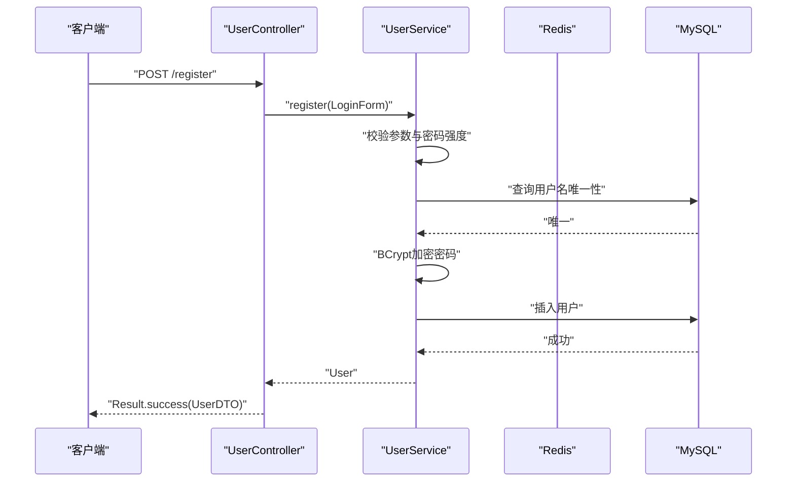
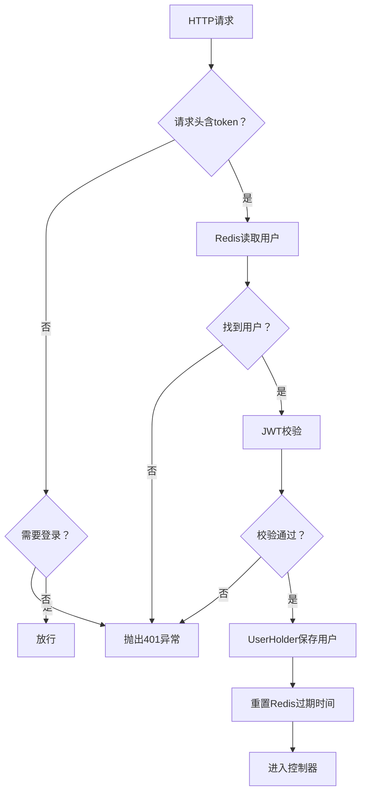
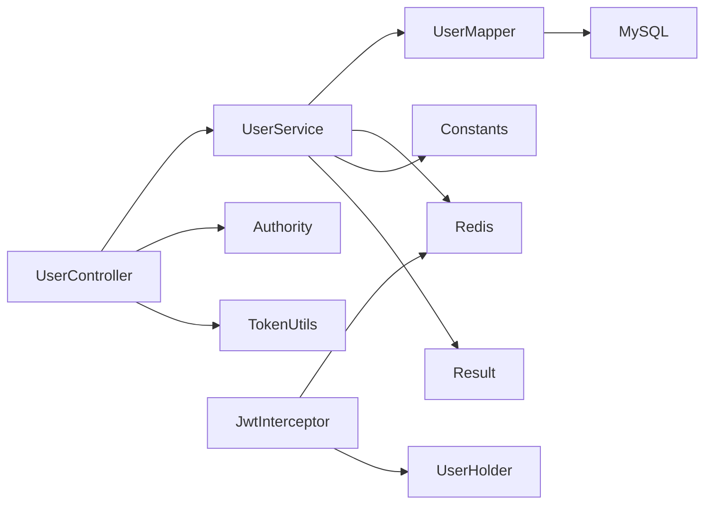
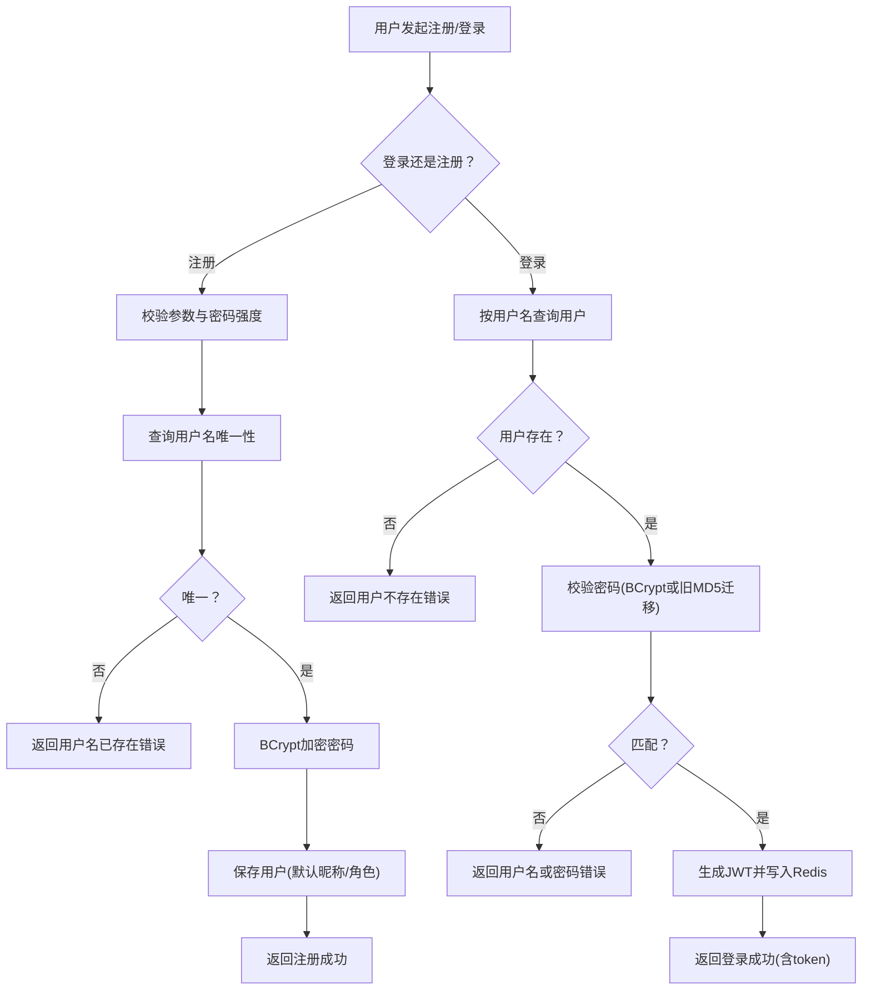
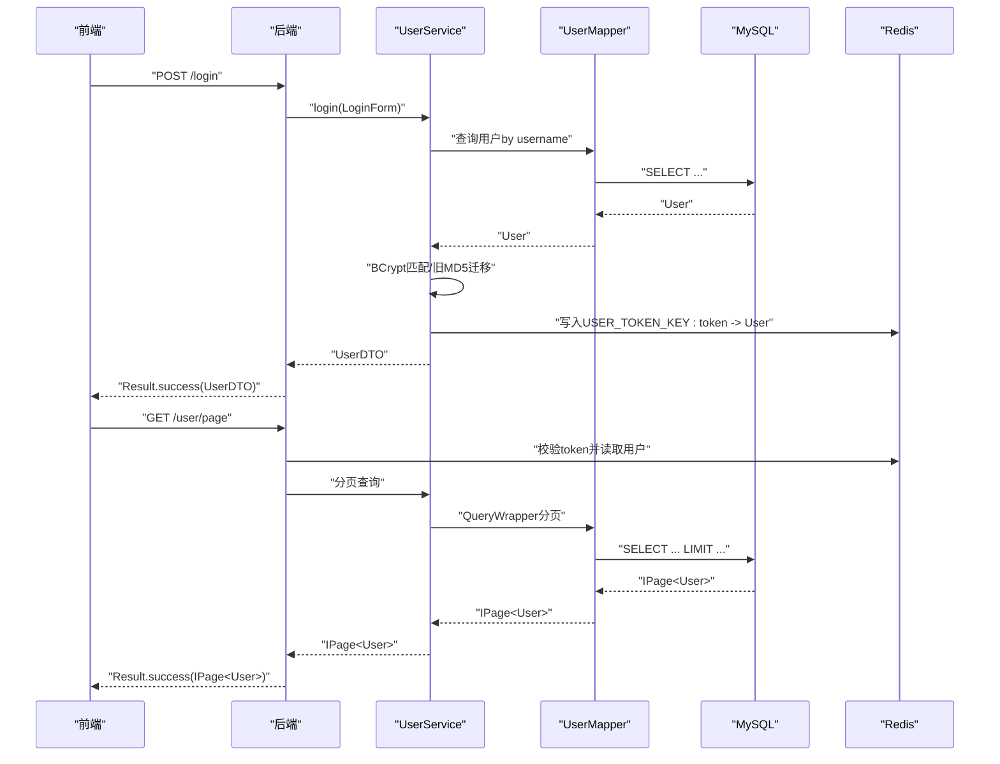

# 用户管理模块

<cite>
**本文引用的文件**
- [User.java](file://mall-server/src/main/java/com/rabbiter/em/entity/User.java)
- [UserDTO.java](file://mall-server/src/main/java/com/rabbiter/em/entity/dto/UserDTO.java)
- [LoginForm.java](file://mall-server/src/main/java/com/rabbiter/em/entity/LoginForm.java)
- [UserController.java](file://mall-server/src/main/java/com/rabbiter/em/controller/UserController.java)
- [UserService.java](file://mall-server/src/main/java/com/rabbiter/em/service/UserService.java)
- [UserMapper.java](file://mall-server/src/main/java/com/rabbiter/em/mapper/UserMapper.java)
- [User.xml](file://mall-server/src/main/resources/mapper/User.xml)
- [TokenUtils.java](file://mall-server/src/main/java/com/rabbiter/em/utils/TokenUtils.java)
- [JwtInterceptor.java](file://mall-server/src/main/java/com/rabbiter/em/interceptor/JwtInterceptor.java)
- [Authority.java](file://mall-server/src/main/java/com/rabbiter/em/annotation/Authority.java)
- [AuthorityType.java](file://mall-server/src/main/java/com/rabbiter/em/entity/AuthorityType.java)
- [UserHolder.java](file://mall-server/src/main/java/com/rabbiter/em/utils/UserHolder.java)
- [Constants.java](file://mall-server/src/main/java/com/rabbiter/em/constants/Constants.java)
- [Result.java](file://mall-server/src/main/java/com/rabbiter/em/common/Result.java)
- [application.yml](file://mall-server/src/main/resources/application.yml)
- [DATABASE_DESIGN.md](file://DATABASE_DESIGN.md)
</cite>

## 目录
1. [简介](#简介)
2. [项目结构](#项目结构)
3. [核心组件](#核心组件)
4. [架构总览](#架构总览)
5. [详细组件分析](#详细组件分析)
6. [依赖分析](#依赖分析)
7. [性能考虑](#性能考虑)
8. [故障排查指南](#故障排查指南)
9. [结论](#结论)
10. [附录](#附录)

## 简介
本文件为“用户管理模块”的综合技术文档，覆盖用户注册、登录、信息管理与密码处理的完整实现。文档从实体设计、数据库表结构、服务层业务逻辑、控制器RESTful API设计、权限控制与会话管理等方面进行深入解析，并提供用户管理流程图与数据流转图，帮助开发者快速理解与扩展用户功能。

## 项目结构
用户管理模块位于后端服务的典型分层结构中，采用Spring Boot + MyBatis-Plus + Redis + JWT的组合：
- 控制层：UserController 提供RESTful接口
- 服务层：UserService 实现业务逻辑与密码处理
- 数据访问层：UserMapper + User.xml 提供SQL映射
- 实体与DTO：User、UserDTO、LoginForm
- 安全与会话：TokenUtils、JwtInterceptor、UserHolder、Authority注解
- 统一响应：Result
- 配置：application.yml、常量与数据库设计文档

**图表来源**
- [UserController.java:1-179](file://mall-server/src/main/java/com/rabbiter/em/controller/UserController.java#L1-L179)
- [UserService.java:1-155](file://mall-server/src/main/java/com/rabbiter/em/service/UserService.java#L1-L155)
- [UserMapper.java:1-28](file://mall-server/src/main/java/com/rabbiter/em/mapper/UserMapper.java#L1-L28)
- [User.xml:1-35](file://mall-server/src/main/resources/mapper/User.xml#L1-L35)
- [TokenUtils.java:1-78](file://mall-server/src/main/java/com/rabbiter/em/utils/TokenUtils.java#L1-L78)
- [JwtInterceptor.java:1-100](file://mall-server/src/main/java/com/rabbiter/em/interceptor/JwtInterceptor.java#L1-L100)
- [UserHolder.java:1-20](file://mall-server/src/main/java/com/rabbiter/em/utils/UserHolder.java#L1-L20)
- [Authority.java:1-13](file://mall-server/src/main/java/com/rabbiter/em/annotation/Authority.java#L1-L13)
- [User.java:1-123](file://mall-server/src/main/java/com/rabbiter/em/entity/User.java#L1-L123)
- [UserDTO.java:1-71](file://mall-server/src/main/java/com/rabbiter/em/entity/dto/UserDTO.java#L1-L71)
- [LoginForm.java:1-49](file://mall-server/src/main/java/com/rabbiter/em/entity/LoginForm.java#L1-L49)
- [Result.java:1-66](file://mall-server/src/main/java/com/rabbiter/em/common/Result.java#L1-L66)
- [Constants.java:1-16](file://mall-server/src/main/java/com/rabbiter/em/constants/Constants.java#L1-L16)
- [application.yml:1-42](file://mall-server/src/main/resources/application.yml#L1-L42)

**章节来源**
- [UserController.java:1-179](file://mall-server/src/main/java/com/rabbiter/em/controller/UserController.java#L1-L179)
- [UserService.java:1-155](file://mall-server/src/main/java/com/rabbiter/em/service/UserService.java#L1-L155)
- [UserMapper.java:1-28](file://mall-server/src/main/java/com/rabbiter/em/mapper/UserMapper.java#L1-L28)
- [User.xml:1-35](file://mall-server/src/main/resources/mapper/User.xml#L1-L35)
- [application.yml:1-42](file://mall-server/src/main/resources/application.yml#L1-L42)

## 核心组件
- 用户实体(User)：封装sys_user表字段，包含用户名、密码、昵称、邮箱、电话、地址、头像URL与角色等
- 登录表单(LoginForm)：用于接收注册/登录请求参数
- 用户DTO(UserDTO)：对外返回的用户信息载体，包含token
- 用户服务(UserService)：实现登录校验、密码加密(BCrypt)、注册、信息更新、密码重置、分页查询等
- 用户控制器(UserController)：提供RESTful接口，包括登录、注册、获取用户信息、保存/更新、删除、分页查询、重置密码等
- 数据访问(UserMapper + User.xml)：基于MyBatis-Plus的通用Mapper，提供基础CRUD与历史SQL片段
- 会话与权限(TokenUtils、JwtInterceptor、UserHolder、Authority)：JWT签发与校验、Redis缓存用户、线程本地存储当前用户、基于注解的权限控制
- 统一响应(Result)：标准化接口返回格式
- 配置(application.yml)：数据库、Redis、JWT密钥、MyBatis映射路径等

**章节来源**
- [User.java:1-123](file://mall-server/src/main/java/com/rabbiter/em/entity/User.java#L1-L123)
- [LoginForm.java:1-49](file://mall-server/src/main/java/com/rabbiter/em/entity/LoginForm.java#L1-L49)
- [UserDTO.java:1-71](file://mall-server/src/main/java/com/rabbiter/em/entity/dto/UserDTO.java#L1-L71)
- [UserService.java:1-155](file://mall-server/src/main/java/com/rabbiter/em/service/UserService.java#L1-L155)
- [UserController.java:1-179](file://mall-server/src/main/java/com/rabbiter/em/controller/UserController.java#L1-L179)
- [UserMapper.java:1-28](file://mall-server/src/main/java/com/rabbiter/em/mapper/UserMapper.java#L1-L28)
- [User.xml:1-35](file://mall-server/src/main/resources/mapper/User.xml#L1-L35)
- [TokenUtils.java:1-78](file://mall-server/src/main/java/com/rabbiter/em/utils/TokenUtils.java#L1-L78)
- [JwtInterceptor.java:1-100](file://mall-server/src/main/java/com/rabbiter/em/interceptor/JwtInterceptor.java#L1-L100)
- [UserHolder.java:1-20](file://mall-server/src/main/java/com/rabbiter/em/utils/UserHolder.java#L1-L20)
- [Authority.java:1-13](file://mall-server/src/main/java/com/rabbiter/em/annotation/Authority.java#L1-L13)
- [AuthorityType.java:1-8](file://mall-server/src/main/java/com/rabbiter/em/entity/AuthorityType.java#L1-L8)
- [Result.java:1-66](file://mall-server/src/main/java/com/rabbiter/em/common/Result.java#L1-L66)
- [Constants.java:1-16](file://mall-server/src/main/java/com/rabbiter/em/constants/Constants.java#L1-L16)
- [application.yml:1-42](file://mall-server/src/main/resources/application.yml#L1-L42)

## 架构总览
用户管理模块遵循经典的MVC分层与安全拦截机制：
- 请求进入控制器，经权限注解判断是否需要登录/管理员权限
- JWT拦截器校验token并从Redis加载用户至线程本地存储
- 控制器调用服务层完成业务处理
- 服务层使用BCrypt进行密码加密/校验，必要时迁移旧密码格式
- 数据持久化通过MyBatis-Plus完成，Redis缓存用户与token

**图表来源**
- [UserController.java:37-163](file://mall-server/src/main/java/com/rabbiter/em/controller/UserController.java#L37-L163)
- [UserService.java:44-108](file://mall-server/src/main/java/com/rabbiter/em/service/UserService.java#L44-L108)
- [UserMapper.java:1-28](file://mall-server/src/main/java/com/rabbiter/em/mapper/UserMapper.java#L1-L28)
- [User.xml:1-35](file://mall-server/src/main/resources/mapper/User.xml#L1-L35)
- [JwtInterceptor.java:40-93](file://mall-server/src/main/java/com/rabbiter/em/interceptor/JwtInterceptor.java#L40-L93)
- [TokenUtils.java:31-77](file://mall-server/src/main/java/com/rabbiter/em/utils/TokenUtils.java#L31-L77)
- [application.yml:1-42](file://mall-server/src/main/resources/application.yml#L1-L42)

## 详细组件分析

### 用户实体与数据库表结构
- 实体字段映射sys_user表，包含主键、用户名、密码、昵称、邮箱、电话、地址、头像URL与角色
- 密码字段在JSON序列化时被忽略，避免泄露
- 表结构与索引策略参考数据库设计文档，建议对username建立唯一索引，对id建立主键索引

**图表来源**
- [DATABASE_DESIGN.md:87-101](file://DATABASE_DESIGN.md#L87-L101)
- [User.java:9-24](file://mall-server/src/main/java/com/rabbiter/em/entity/User.java#L9-L24)

**章节来源**
- [User.java:1-123](file://mall-server/src/main/java/com/rabbiter/em/entity/User.java#L1-L123)
- [DATABASE_DESIGN.md:87-101](file://DATABASE_DESIGN.md#L87-L101)

### 服务层业务逻辑
- 登录流程：按用户名查询用户，若不存在抛出异常；密码匹配支持BCrypt与旧MD5迁移；成功后生成JWT并写入Redis，返回UserDTO
- 注册流程：校验用户名、密码强度、手机号；检查用户名唯一性；使用BCrypt加密密码；设置默认昵称与角色；保存用户
- 信息更新：支持按ID更新用户资料；支持在新增时校验并加密新密码
- 密码重置：管理员可重置指定用户密码，先校验密码强度，再加密并更新
- 分页查询：支持按ID/用户名/昵称模糊查询，按ID倒序

**图表来源**
- [UserService.java:44-108](file://mall-server/src/main/java/com/rabbiter/em/service/UserService.java#L44-L108)
- [UserMapper.java:1-28](file://mall-server/src/main/java/com/rabbiter/em/mapper/UserMapper.java#L1-L28)

**章节来源**
- [UserService.java:1-155](file://mall-server/src/main/java/com/rabbiter/em/service/UserService.java#L1-L155)

### 控制器RESTful API设计
- 登录：POST /login，参数LoginForm，返回Result<UserDTO>
- 注册：POST /register，参数LoginForm，返回Result<UserDTO>
- 获取用户信息：GET /userinfo/{username}
- 获取当前用户ID：GET /userid
- 管理员接口：GET /user/、POST /user、DELETE /user/{id}、POST /user/del/batch、GET /user/page、POST /user/resetPassword
- 权限控制：使用@Authority注解，支持requireLogin、requireAuthority、noRequire三种类型

**图表来源**
- [UserController.java:37-57](file://mall-server/src/main/java/com/rabbiter/em/controller/UserController.java#L37-L57)
- [UserService.java:77-108](file://mall-server/src/main/java/com/rabbiter/em/service/UserService.java#L77-L108)

**章节来源**
- [UserController.java:1-179](file://mall-server/src/main/java/com/rabbiter/em/controller/UserController.java#L1-L179)
- [Authority.java:1-13](file://mall-server/src/main/java/com/rabbiter/em/annotation/Authority.java#L1-L13)
- [AuthorityType.java:1-8](file://mall-server/src/main/java/com/rabbiter/em/entity/AuthorityType.java#L1-L8)

### 权限控制与会话管理
- JWT拦截器：从请求头读取token，校验JWT有效性，从Redis读取用户并写入UserHolder，重置Redis过期时间
- 权限注解：@Authority标注方法或类，决定是否需要登录或管理员权限
- 当前用户：通过TokenUtils.getCurrentUser()从UserHolder获取
- 异常处理：拦截器与工具类在token缺失/过期/无效时抛出相应异常

**图表来源**
- [JwtInterceptor.java:40-93](file://mall-server/src/main/java/com/rabbiter/em/interceptor/JwtInterceptor.java#L40-L93)
- [TokenUtils.java:42-77](file://mall-server/src/main/java/com/rabbiter/em/utils/TokenUtils.java#L42-L77)
- [UserHolder.java:1-20](file://mall-server/src/main/java/com/rabbiter/em/utils/UserHolder.java#L1-L20)

**章节来源**
- [JwtInterceptor.java:1-100](file://mall-server/src/main/java/com/rabbiter/em/interceptor/JwtInterceptor.java#L1-L100)
- [TokenUtils.java:1-78](file://mall-server/src/main/java/com/rabbiter/em/utils/TokenUtils.java#L1-L78)
- [UserHolder.java:1-20](file://mall-server/src/main/java/com/rabbiter/em/utils/UserHolder.java#L1-L20)
- [Authority.java:1-13](file://mall-server/src/main/java/com/rabbiter/em/annotation/Authority.java#L1-L13)

### 数据访问层
- UserMapper继承MyBatis-Plus的BaseMapper，提供通用CRUD能力
- User.xml保留了历史SQL片段注释，当前分页查询由服务层构建QueryWrapper完成

**章节来源**
- [UserMapper.java:1-28](file://mall-server/src/main/java/com/rabbiter/em/mapper/UserMapper.java#L1-L28)
- [User.xml:1-35](file://mall-server/src/main/resources/mapper/User.xml#L1-L35)

### 统一响应与常量
- Result：统一封装code/msg/data，提供success/error静态工厂方法
- Constants：定义系统常用状态码与消息

**章节来源**
- [Result.java:1-66](file://mall-server/src/main/java/com/rabbiter/em/common/Result.java#L1-L66)
- [Constants.java:1-16](file://mall-server/src/main/java/com/rabbiter/em/constants/Constants.java#L1-L16)

## 依赖分析
- 控制器依赖服务层与工具类，服务层依赖数据访问层与安全工具
- 权限注解与拦截器共同作用于控制器方法
- Redis与JWT构成会话与权限基础设施

**图表来源**
- [UserController.java:1-179](file://mall-server/src/main/java/com/rabbiter/em/controller/UserController.java#L1-L179)
- [UserService.java:1-155](file://mall-server/src/main/java/com/rabbiter/em/service/UserService.java#L1-L155)
- [UserMapper.java:1-28](file://mall-server/src/main/java/com/rabbiter/em/mapper/UserMapper.java#L1-L28)
- [TokenUtils.java:1-78](file://mall-server/src/main/java/com/rabbiter/em/utils/TokenUtils.java#L1-L78)
- [JwtInterceptor.java:1-100](file://mall-server/src/main/java/com/rabbiter/em/interceptor/JwtInterceptor.java#L1-L100)
- [UserHolder.java:1-20](file://mall-server/src/main/java/com/rabbiter/em/utils/UserHolder.java#L1-L20)
- [Authority.java:1-13](file://mall-server/src/main/java/com/rabbiter/em/annotation/Authority.java#L1-L13)
- [Constants.java:1-16](file://mall-server/src/main/java/com/rabbiter/em/constants/Constants.java#L1-L16)
- [Result.java:1-66](file://mall-server/src/main/java/com/rabbiter/em/common/Result.java#L1-L66)

**章节来源**
- [UserController.java:1-179](file://mall-server/src/main/java/com/rabbiter/em/controller/UserController.java#L1-L179)
- [UserService.java:1-155](file://mall-server/src/main/java/com/rabbiter/em/service/UserService.java#L1-L155)

## 性能考虑
- 密码加密：使用BCrypt，成本因子适配生产环境，避免暴力破解
- 缓存策略：登录成功将用户信息写入Redis，减少数据库压力；结合JWT减少状态存储
- 查询优化：分页查询使用QueryWrapper，建议对username/nickname建立索引以提升模糊查询性能
- 并发控制：拦截器在每次请求重置Redis过期时间，避免频繁失效导致的重复登录

[本节为通用指导，无需特定文件引用]

## 故障排查指南
- 登录失败：检查用户名是否存在、密码格式是否正确、是否触发旧MD5迁移逻辑
- token无效：确认请求头是否携带token、JWT密钥是否一致、Redis中token是否过期
- 权限不足：确认用户角色是否为admin，接口是否标注@Authority(requireAuthority)
- 参数校验失败：检查密码强度规则、必填字段是否为空

**章节来源**
- [UserService.java:34-38](file://mall-server/src/main/java/com/rabbiter/em/service/UserService.java#L34-L38)
- [TokenUtils.java:50-77](file://mall-server/src/main/java/com/rabbiter/em/utils/TokenUtils.java#L50-L77)
- [JwtInterceptor.java:60-93](file://mall-server/src/main/java/com/rabbiter/em/interceptor/JwtInterceptor.java#L60-L93)
- [Constants.java:1-16](file://mall-server/src/main/java/com/rabbiter/em/constants/Constants.java#L1-L16)

## 结论
用户管理模块通过清晰的分层设计与完善的权限控制，实现了安全、可扩展的用户生命周期管理。服务层对密码处理与迁移提供了稳健保障，控制器以RESTful风格暴露接口，配合JWT与Redis实现高效会话管理。建议在生产环境中进一步完善索引策略、监控与日志体系，并持续演进权限模型以满足更复杂的业务需求。

[本节为总结性内容，无需特定文件引用]

## 附录

### 用户管理流程图

**图表来源**
- [UserService.java:44-108](file://mall-server/src/main/java/com/rabbiter/em/service/UserService.java#L44-L108)
- [UserController.java:37-57](file://mall-server/src/main/java/com/rabbiter/em/controller/UserController.java#L37-L57)

### 数据流转图

**图表来源**
- [UserController.java:37-163](file://mall-server/src/main/java/com/rabbiter/em/controller/UserController.java#L37-L163)
- [UserService.java:44-108](file://mall-server/src/main/java/com/rabbiter/em/service/UserService.java#L44-L108)
- [UserMapper.java:1-28](file://mall-server/src/main/java/com/rabbiter/em/mapper/UserMapper.java#L1-L28)
- [application.yml:1-42](file://mall-server/src/main/resources/application.yml#L1-L42)

### 接口规范与响应格式
- 统一响应：Result(code, msg, data)，常见code包括200(成功)、401(未认证)、403(拒绝执行)、500(系统错误)
- 登录/注册：返回UserDTO，包含id、username、nickname、avatarUrl、token、role
- 管理员接口：需携带token并通过权限校验，返回Result.success或Result.error

**章节来源**
- [Result.java:1-66](file://mall-server/src/main/java/com/rabbiter/em/common/Result.java#L1-L66)
- [UserDTO.java:1-71](file://mall-server/src/main/java/com/rabbiter/em/entity/dto/UserDTO.java#L1-L71)
- [Constants.java:1-16](file://mall-server/src/main/java/com/rabbiter/em/constants/Constants.java#L1-L16)

### 扩展建议
- 多租户与角色细化：在User实体增加tenantId与多角色支持，配合RBAC模型
- 第三方登录：集成OAuth2/OpenID Connect，复用TokenUtils与拦截器
- 审计日志：记录用户登录、密码变更、信息修改等操作
- 二次验证：为高风险操作增加短信/邮件验证码
- 速率限制：对登录/注册接口增加限流策略

[本节为概念性建议，无需特定文件引用]