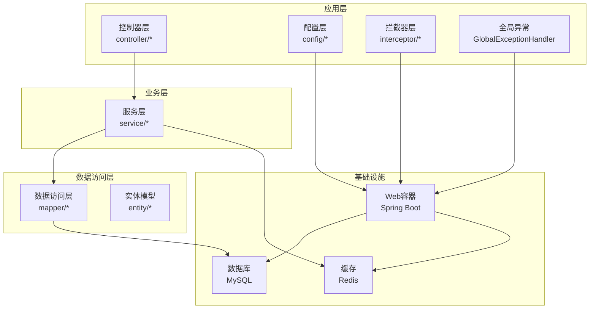
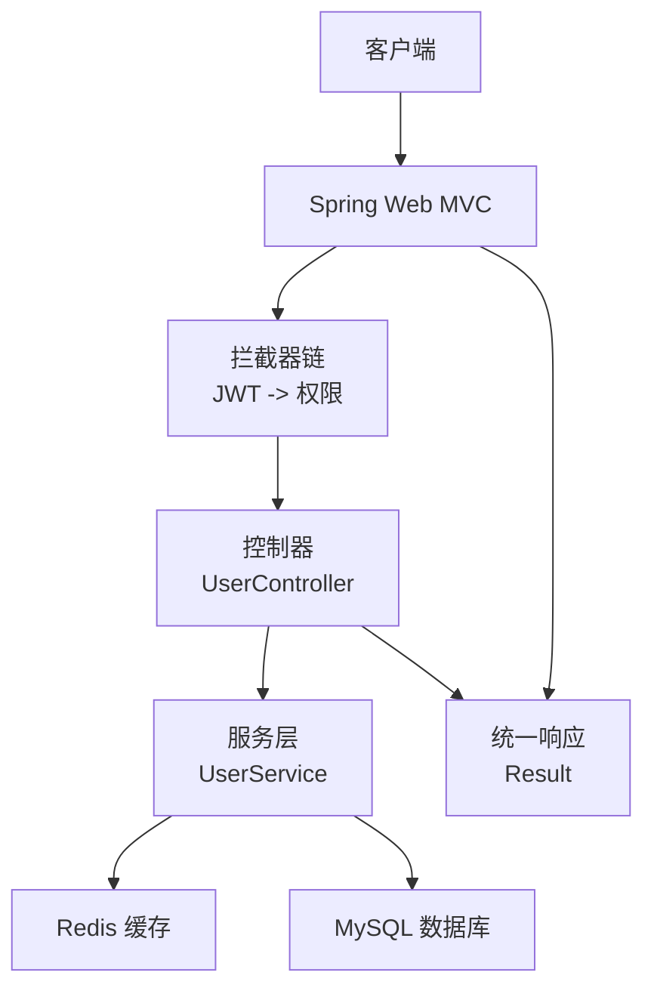
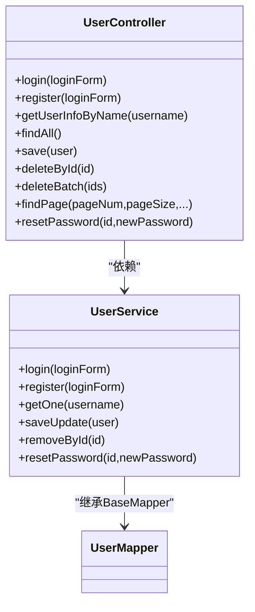
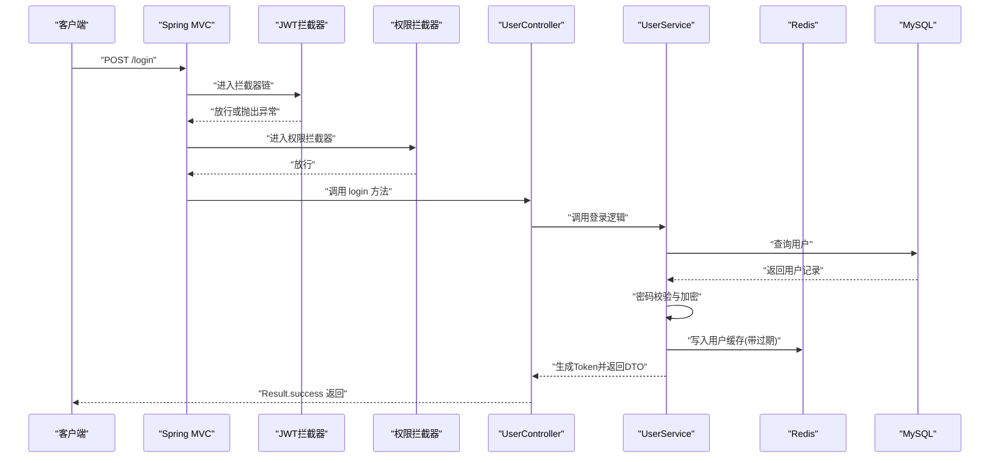
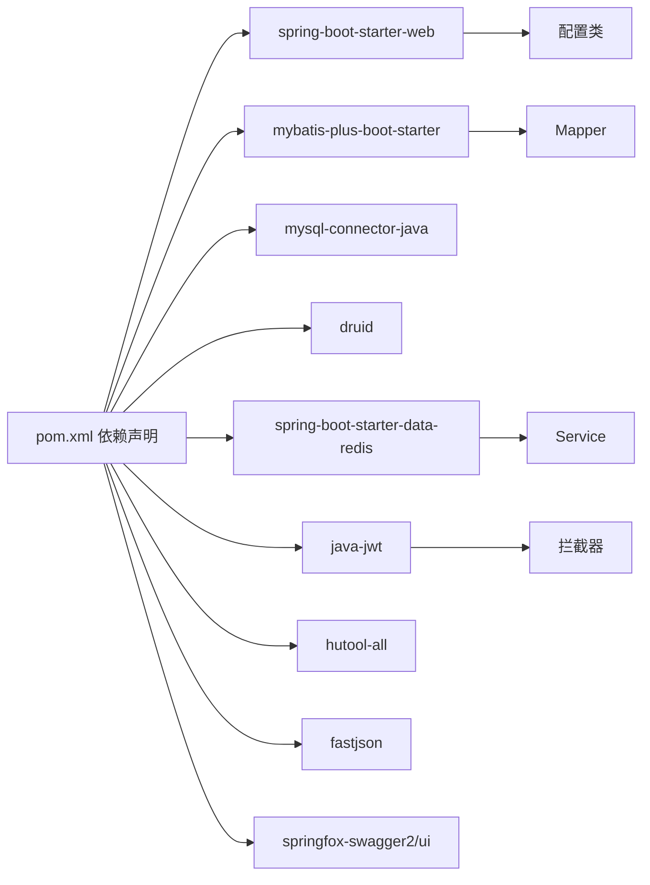
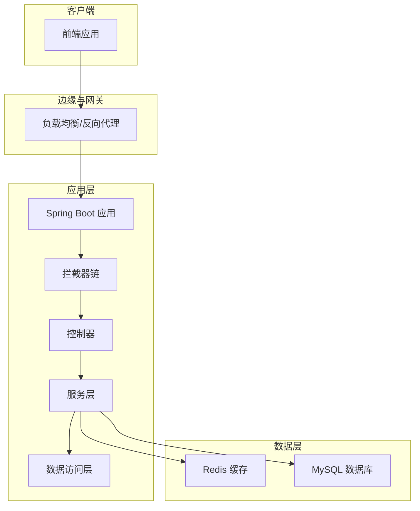

# 系统架构概览

<cite>
**本文引用的文件**
- [MallApplication.java](file://mall-server/src/main/java/com/rabbiter/em/MallApplication.java)
- [pom.xml](file://mall-server/pom.xml)
- [application.yml](file://mall-server/src/main/resources/application.yml)
- [MybatisPlusConfig.java](file://mall-server/src/main/java/com/rabbiter/em/config/MybatisPlusConfig.java)
- [RedisConfig.java](file://mall-server/src/main/java/com/rabbiter/em/config/RedisConfig.java)
- [InterceptorConfig.java](file://mall-server/src/main/java/com/rabbiter/em/config/InterceptorConfig.java)
- [CorsConfig.java](file://mall-server/src/main/java/com/rabbiter/em/config/CorsConfig.java)
- [GlobalExceptionHandler.java](file://mall-server/src/main/java/com/rabbiter/em/config/GlobalExceptionHandler.java)
- [JwtInterceptor.java](file://mall-server/src/main/java/com/rabbiter/em/interceptor/JwtInterceptor.java)
- [AuthorityInterceptor.java](file://mall-server/src/main/java/com/rabbiter/em/interceptor/AuthorityInterceptor.java)
- [UserController.java](file://mall-server/src/main/java/com/rabbiter/em/controller/UserController.java)
- [UserService.java](file://mall-server/src/main/java/com/rabbiter/em/service/UserService.java)
- [UserMapper.java](file://mall-server/src/main/java/com/rabbiter/em/mapper/UserMapper.java)
- [Result.java](file://mall-server/src/main/java/com/rabbiter/em/common/Result.java)
- [TokenUtils.java](file://mall-server/src/main/java/com/rabbiter/em/utils/TokenUtils.java)
</cite>

## 目录
1. [引言](#引言)
2. [项目结构](#项目结构)
3. [核心组件](#核心组件)
4. [架构总览](#架构总览)
5. [详细组件分析](#详细组件分析)
6. [依赖分析](#依赖分析)
7. [性能考虑](#性能考虑)
8. [故障排查指南](#故障排查指南)
9. [结论](#结论)
10. [附录](#附录)

## 引言
本文件面向后端系统架构概览，围绕基于 Spring Boot 的分层架构进行系统性梳理，重点说明 MVC 三层架构在本项目中的落地方式与职责划分；阐述技术栈选择（Spring Boot、MyBatis Plus、MySQL、Redis 等）的应用场景与优势；给出系统整体架构图与组件交互关系；解释请求处理流程与数据流向；总结设计模式在项目中的体现（如拦截器模式、工具类单例风格等）；最后提供部署架构图与运行时环境要求。

## 项目结构
后端采用标准的 Maven 多模块工程布局，核心业务位于 mall-server 子模块中，按领域模型与职责划分为 controller、service、mapper、entity、config、interceptor、utils、common 等包，遵循“分层清晰、职责单一”的组织原则。

- 应用入口与扫描配置
  - 应用启动类启用 Spring Boot 并扫描 Mapper 接口，确保 MyBatis-Plus 能自动发现 SQL 映射。
- 配置层
  - Web 层配置：跨域、编码、拦截器注册、MyBatis-Plus 分页插件、Redis 序列化策略、Swagger 文档等。
- 控制器层
  - 提供 RESTful 接口，统一返回包装类 Result，结合注解控制权限。
- 服务层
  - 基于 MyBatis-Plus ServiceImpl，封装业务逻辑、密码加密、Token 生成与校验、Redis 缓存。
- 数据访问层
  - Mapper 接口继承 BaseMapper，配合 XML 映射文件完成 CRUD。
- 工具与通用层
  - Token 工具、路径工具、线程本地用户持有者等，支撑鉴权与上下文传递。
- 异常处理
  - 全局异常处理器集中处理业务异常与系统异常，输出统一格式响应。

**图表来源**
- [MallApplication.java:1-17](file://mall-server/src/main/java/com/rabbiter/em/MallApplication.java#L1-L17)
- [CorsConfig.java:1-29](file://mall-server/src/main/java/com/rabbiter/em/config/CorsConfig.java#L1-L29)
- [InterceptorConfig.java:1-37](file://mall-server/src/main/java/com/rabbiter/em/config/InterceptorConfig.java#L1-L37)
- [MybatisPlusConfig.java:1-21](file://mall-server/src/main/java/com/rabbiter/em/config/MybatisPlusConfig.java#L1-L21)
- [RedisConfig.java:1-38](file://mall-server/src/main/java/com/rabbiter/em/config/RedisConfig.java#L1-L38)
- [UserController.java:1-179](file://mall-server/src/main/java/com/rabbiter/em/controller/UserController.java#L1-L179)
- [UserService.java:1-155](file://mall-server/src/main/java/com/rabbiter/em/service/UserService.java#L1-L155)
- [UserMapper.java:1-28](file://mall-server/src/main/java/com/rabbiter/em/mapper/UserMapper.java#L1-L28)

**章节来源**
- [MallApplication.java:1-17](file://mall-server/src/main/java/com/rabbiter/em/MallApplication.java#L1-L17)
- [pom.xml:1-185](file://mall-server/pom.xml#L1-L185)
- [application.yml:1-42](file://mall-server/src/main/resources/application.yml#L1-L42)

## 核心组件
- 应用启动类与扫描
  - 启动类负责引导 Spring Boot 应用，并通过 MapperScan 扫描 Mapper 接口，使 MyBatis-Plus 能自动识别映射。
- 配置中心
  - application.yml 统一管理端口、编码、数据库连接、Redis 连接、JWT 密钥、MyBatis 映射位置与驼峰映射开关。
- Web 配置
  - 跨域配置、拦截器链（JWT 校验优先于权限校验）、MyBatis-Plus 分页插件、RedisTemplate 序列化策略、Swagger 文档。
- 统一响应包装
  - Result 类提供 success/error 静态工厂方法，保证前后端一致的响应结构。
- 全局异常处理
  - 对业务异常与常见系统异常进行分类处理，输出标准化错误码与消息。
- 安全与鉴权
  - JWT 令牌生成与校验、Redis 中用户缓存、基于注解的权限控制（登录/管理员）。

**章节来源**
- [MallApplication.java:1-17](file://mall-server/src/main/java/com/rabbiter/em/MallApplication.java#L1-L17)
- [application.yml:1-42](file://mall-server/src/main/resources/application.yml#L1-L42)
- [CorsConfig.java:1-29](file://mall-server/src/main/java/com/rabbiter/em/config/CorsConfig.java#L1-L29)
- [InterceptorConfig.java:1-37](file://mall-server/src/main/java/com/rabbiter/em/config/InterceptorConfig.java#L1-L37)
- [MybatisPlusConfig.java:1-21](file://mall-server/src/main/java/com/rabbiter/em/config/MybatisPlusConfig.java#L1-L21)
- [RedisConfig.java:1-38](file://mall-server/src/main/java/com/rabbiter/em/config/RedisConfig.java#L1-L38)
- [Result.java:1-66](file://mall-server/src/main/java/com/rabbiter/em/common/Result.java#L1-L66)
- [GlobalExceptionHandler.java:1-45](file://mall-server/src/main/java/com/rabbiter/em/config/GlobalExceptionHandler.java#L1-L45)
- [TokenUtils.java:1-78](file://mall-server/src/main/java/com/rabbiter/em/utils/TokenUtils.java#L1-L78)

## 架构总览
系统采用经典的分层架构：
- 表现层（Controller）：接收 HTTP 请求，调用服务层，返回 Result 包装的响应。
- 业务层（Service）：编排领域逻辑、参数校验、密码加密、Token 生成与校验、Redis 缓存读写。
- 数据访问层（Mapper/MyBatis-Plus）：执行 SQL，支持分页、条件构造器等能力。
- 基础设施层（MySQL、Redis、Spring Boot Web 容器）：持久化与缓存、HTTP 服务器。

**图表来源**
- [UserController.java:1-179](file://mall-server/src/main/java/com/rabbiter/em/controller/UserController.java#L1-L179)
- [UserService.java:1-155](file://mall-server/src/main/java/com/rabbiter/em/service/UserService.java#L1-L155)
- [JwtInterceptor.java:1-100](file://mall-server/src/main/java/com/rabbiter/em/interceptor/JwtInterceptor.java#L1-L100)
- [AuthorityInterceptor.java:1-54](file://mall-server/src/main/java/com/rabbiter/em/interceptor/AuthorityInterceptor.java#L1-L54)
- [RedisConfig.java:1-38](file://mall-server/src/main/java/com/rabbiter/em/config/RedisConfig.java#L1-L38)
- [application.yml:1-42](file://mall-server/src/main/resources/application.yml#L1-L42)

## 详细组件分析

### MVC 三层架构实现与职责
- 控制器层（Controller）
  - 职责：接收请求、参数绑定、调用服务层、返回统一响应。
  - 示例：UserController 提供登录、注册、用户查询、分页、批量删除等接口，均通过 Result 包装返回。
- 服务层（Service）
  - 职责：业务编排、参数校验、密码加密（BCrypt）、Token 生成与缓存、Redis 读写、调用 Mapper。
  - 示例：UserService 实现登录校验、注册、修改、重置密码等逻辑，并与 Redis 和数据库交互。
- 数据访问层（Mapper/MyBatis-Plus）
  - 职责：基于 BaseMapper 提供 CRUD 能力，结合 QueryWrapper 实现条件查询与分页。
  - 示例：UserMapper 继承 BaseMapper，UserService 使用其父类提供的基础能力。

**图表来源**
- [UserController.java:1-179](file://mall-server/src/main/java/com/rabbiter/em/controller/UserController.java#L1-L179)
- [UserService.java:1-155](file://mall-server/src/main/java/com/rabbiter/em/service/UserService.java#L1-L155)
- [UserMapper.java:1-28](file://mall-server/src/main/java/com/rabbiter/em/mapper/UserMapper.java#L1-L28)

**章节来源**
- [UserController.java:1-179](file://mall-server/src/main/java/com/rabbiter/em/controller/UserController.java#L1-L179)
- [UserService.java:1-155](file://mall-server/src/main/java/com/rabbiter/em/service/UserService.java#L1-L155)
- [UserMapper.java:1-28](file://mall-server/src/main/java/com/rabbiter/em/mapper/UserMapper.java#L1-L28)

### 技术栈选择与优势
- Spring Boot
  - 快速搭建与自动配置，简化依赖与部署；内置 Web 容器，便于打包运行。
- MyBatis Plus
  - 在 MyBatis 基础上提供通用 CRUD、分页插件、条件构造器，减少重复 SQL 与样板代码。
- MySQL
  - 关系型存储，事务与一致性保障，适合用户、订单、商品等结构化数据。
- Redis
  - 高性能缓存与会话存储，用于 Token 缓存与用户上下文传递，降低数据库压力。
- JWT
  - 无状态鉴权，便于分布式与跨域场景，结合 Redis 可实现 Token 失效与续期。
- Swagger
  - 自动生成接口文档，提升联调效率。
- Druid
  - 连接池监控与性能优化，便于生产问题定位。

**章节来源**
- [pom.xml:1-185](file://mall-server/pom.xml#L1-L185)
- [application.yml:1-42](file://mall-server/src/main/resources/application.yml#L1-L42)
- [MybatisPlusConfig.java:1-21](file://mall-server/src/main/java/com/rabbiter/em/config/MybatisPlusConfig.java#L1-L21)
- [RedisConfig.java:1-38](file://mall-server/src/main/java/com/rabbiter/em/config/RedisConfig.java#L1-L38)

### 请求处理流程与数据流向
以登录为例，展示从客户端到数据库的完整链路：

**图表来源**
- [JwtInterceptor.java:1-100](file://mall-server/src/main/java/com/rabbiter/em/interceptor/JwtInterceptor.java#L1-L100)
- [AuthorityInterceptor.java:1-54](file://mall-server/src/main/java/com/rabbiter/em/interceptor/AuthorityInterceptor.java#L1-L54)
- [UserController.java:1-179](file://mall-server/src/main/java/com/rabbiter/em/controller/UserController.java#L1-L179)
- [UserService.java:1-155](file://mall-server/src/main/java/com/rabbiter/em/service/UserService.java#L1-L155)
- [RedisConfig.java:1-38](file://mall-server/src/main/java/com/rabbiter/em/config/RedisConfig.java#L1-L38)
- [application.yml:1-42](file://mall-server/src/main/resources/application.yml#L1-L42)

### 设计模式的应用
- 拦截器模式
  - 通过 InterceptorConfig 注册两个拦截器：JWT 校验优先，权限校验次之，分别处理 Token 解析与角色校验。
- 工具类单例风格
  - TokenUtils 以静态方法提供 JWT 生成与校验、当前用户获取、登录/权限校验等工具能力，避免重复实例化。
- 单例与线程本地上下文
  - UserHolder 与 ThreadLocal 结合，将当前用户放入线程上下文，贯穿后续业务处理。
- 组合与继承
  - Service 层继承 MyBatis-Plus 的 ServiceImpl，复用通用 CRUD 能力；Mapper 继承 BaseMapper，获得基础 SQL 能力。

**章节来源**
- [InterceptorConfig.java:1-37](file://mall-server/src/main/java/com/rabbiter/em/config/InterceptorConfig.java#L1-L37)
- [JwtInterceptor.java:1-100](file://mall-server/src/main/java/com/rabbiter/em/interceptor/JwtInterceptor.java#L1-L100)
- [AuthorityInterceptor.java:1-54](file://mall-server/src/main/java/com/rabbiter/em/interceptor/AuthorityInterceptor.java#L1-L54)
- [TokenUtils.java:1-78](file://mall-server/src/main/java/com/rabbiter/em/utils/TokenUtils.java#L1-L78)
- [UserService.java:1-155](file://mall-server/src/main/java/com/rabbiter/em/service/UserService.java#L1-L155)
- [UserMapper.java:1-28](file://mall-server/src/main/java/com/rabbiter/em/mapper/UserMapper.java#L1-L28)

### 模块化设计理念与代码组织
- 按职责分层：controller/service/mapper/entity/config/interceptor/utils/common 清晰分离。
- 按功能域聚合：每个领域（用户、商品、订单、文件等）在对应包下形成闭环。
- 配置集中化：application.yml 统一管理外部化配置；各配置类仅做装配与策略定义。
- 统一出口：Result 封装所有响应；全局异常处理器集中处理错误。

**章节来源**
- [Result.java:1-66](file://mall-server/src/main/java/com/rabbiter/em/common/Result.java#L1-L66)
- [GlobalExceptionHandler.java:1-45](file://mall-server/src/main/java/com/rabbiter/em/config/GlobalExceptionHandler.java#L1-L45)

## 依赖分析
- 外部依赖
  - Spring Boot Web、MyBatis-Plus、MySQL 驱动、Druid、Redis、JWT、Hutool、FastJSON、Swagger、BCrypt 等。
- 内部模块耦合
  - 控制器依赖服务；服务依赖 Mapper 与 Redis；拦截器依赖服务与工具类；配置类装配各组件。
- 循环依赖
  - 当前结构未见循环依赖迹象，分层清晰、接口边界明确。

**图表来源**
- [pom.xml:1-185](file://mall-server/pom.xml#L1-L185)

**章节来源**
- [pom.xml:1-185](file://mall-server/pom.xml#L1-L185)

## 性能考虑
- 缓存策略
  - 使用 Redis 缓存用户 Token 与用户对象，减少数据库与鉴权计算开销；设置合理过期时间，避免内存泄漏。
- 数据库连接
  - Druid 连接池监控与参数调优，结合慢查询日志定位性能瓶颈。
- 分页与查询
  - MyBatis-Plus 分页插件限制最大每页条数，防止大页导致内存压力；条件查询尽量命中索引。
- 序列化
  - Redis 使用 JSON 序列化，注意字段命名与大小写一致性，避免不必要的转换开销。
- 跨域与编码
  - 统一编码与跨域配置，减少前端兼容性问题带来的额外处理成本。

**章节来源**
- [RedisConfig.java:1-38](file://mall-server/src/main/java/com/rabbiter/em/config/RedisConfig.java#L1-L38)
- [MybatisPlusConfig.java:1-21](file://mall-server/src/main/java/com/rabbiter/em/config/MybatisPlusConfig.java#L1-L21)
- [application.yml:1-42](file://mall-server/src/main/resources/application.yml#L1-L42)

## 故障排查指南
- 常见异常与处理
  - 数据库连接失败：检查主机、端口、账号、密码与数据库是否存在。
  - Redis 连接失败：确认 Redis 服务状态与网络连通性。
  - SQL 语法错误：核对条件构造器与 SQL 片段。
  - 认证失败：检查 JWT 密钥、Token 是否过期、Redis 中用户是否被清理。
- 日志与监控
  - 全局异常处理器输出统一错误码与提示；建议开启业务日志与慢查询日志。
- 快速定位
  - 通过拦截器链顺序判断是鉴权阶段还是业务阶段出错；结合 Redis 与数据库状态快速定位。

**章节来源**
- [GlobalExceptionHandler.java:1-45](file://mall-server/src/main/java/com/rabbiter/em/config/GlobalExceptionHandler.java#L1-L45)
- [JwtInterceptor.java:1-100](file://mall-server/src/main/java/com/rabbiter/em/interceptor/JwtInterceptor.java#L1-L100)
- [AuthorityInterceptor.java:1-54](file://mall-server/src/main/java/com/rabbiter/em/interceptor/AuthorityInterceptor.java#L1-L54)

## 结论
本项目以 Spring Boot 为核心，结合 MyBatis-Plus、Redis、JWT 等技术，构建了职责清晰、扩展性强的分层架构。通过拦截器链实现鉴权与权限控制，通过统一响应与异常处理提升系统稳定性。整体设计兼顾开发效率与运行性能，适合中小规模电商类应用的快速迭代与稳定运行。

## 附录

### 系统部署架构图

[此图为概念性部署示意，不直接映射具体源文件]

### 运行时环境要求
- Java 版本：1.8（由 Maven 属性指定）
- 数据库：MySQL（默认端口与账号可由环境变量覆盖）
- 缓存：Redis（默认端口与密码可由环境变量覆盖）
- Web 服务器：Spring Boot 内置容器（默认端口可配置）

**章节来源**
- [pom.xml:16-18](file://mall-server/pom.xml#L16-L18)
- [application.yml:1-42](file://mall-server/src/main/resources/application.yml#L1-L42)