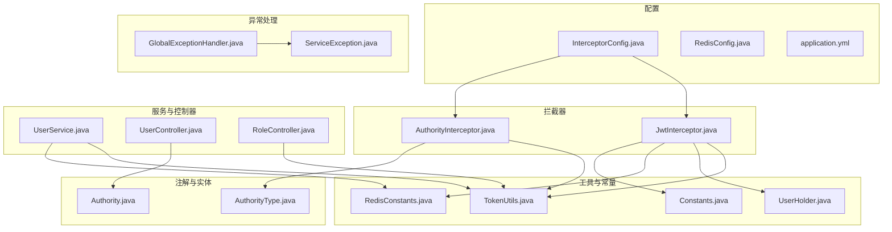
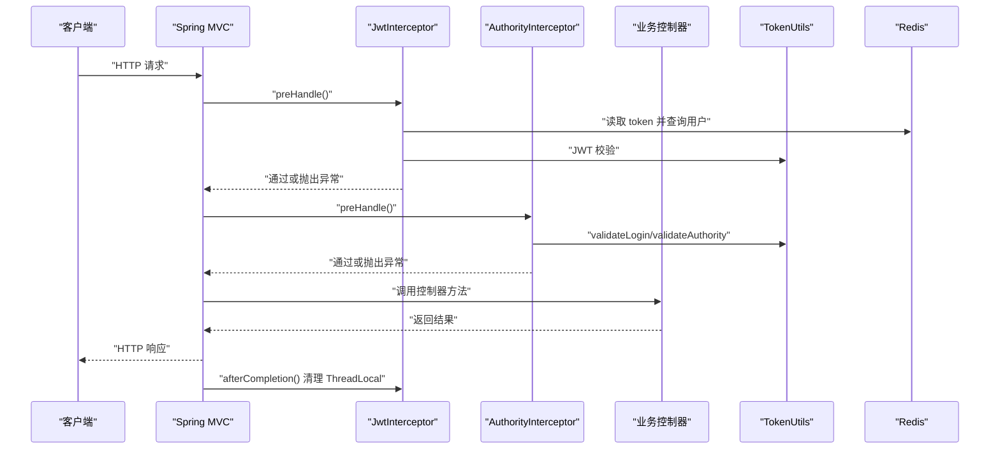
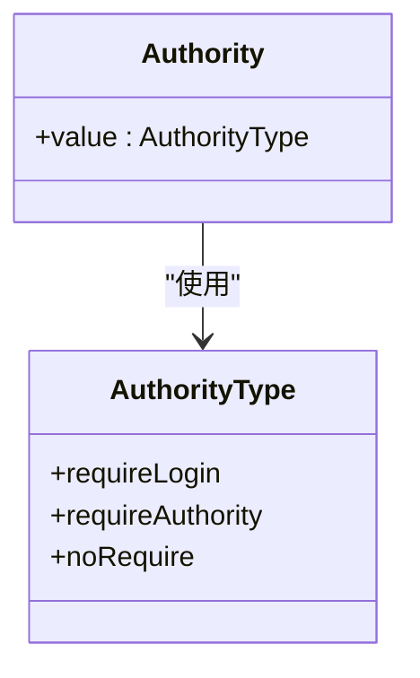
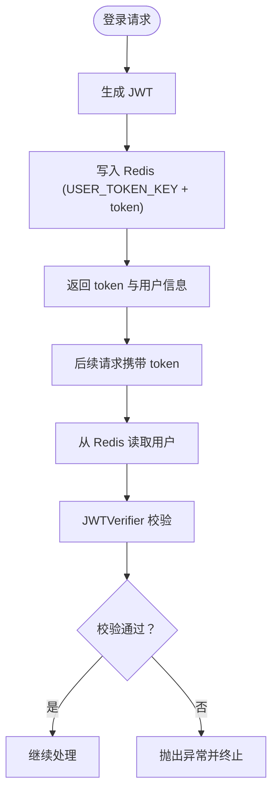
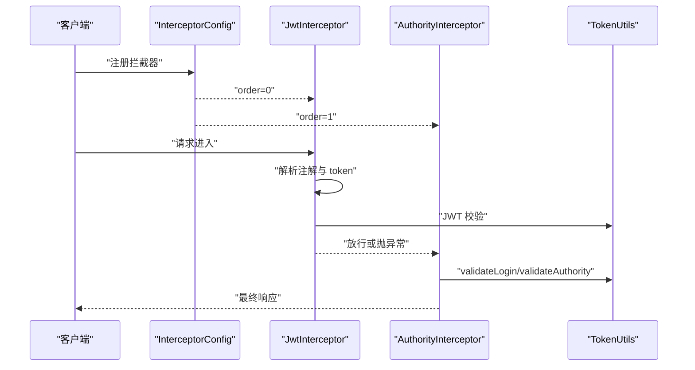
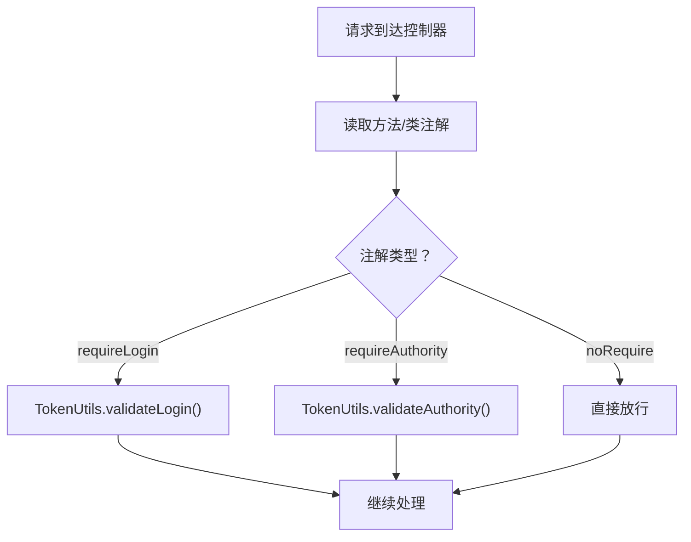
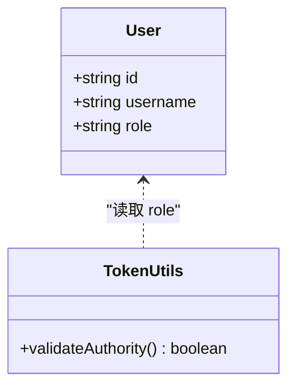
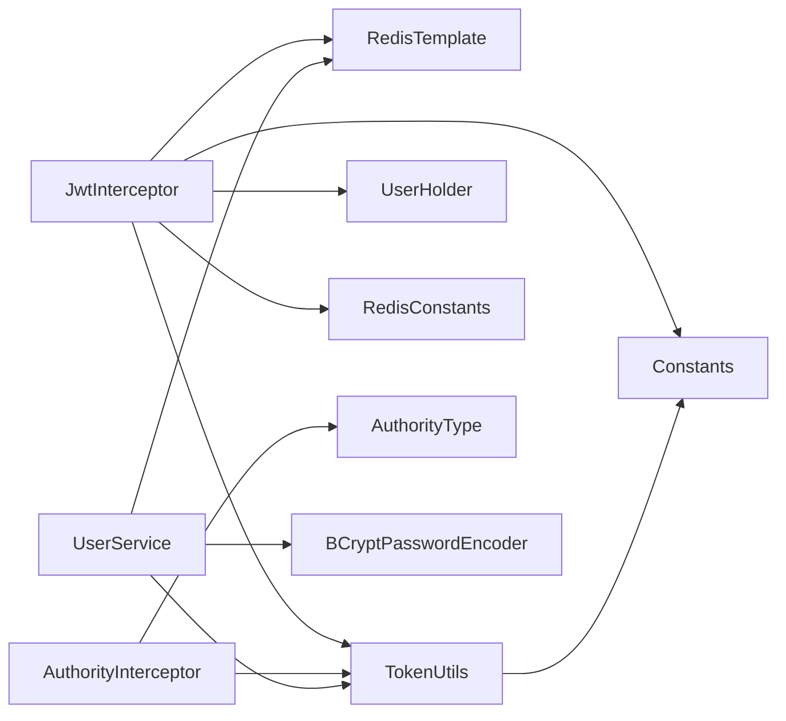
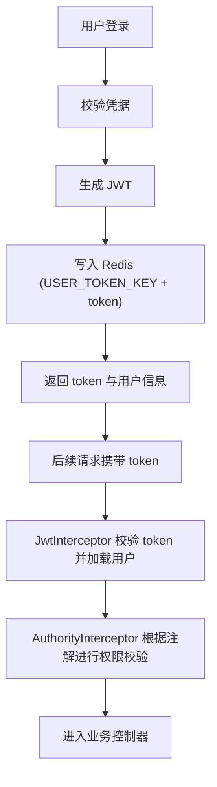
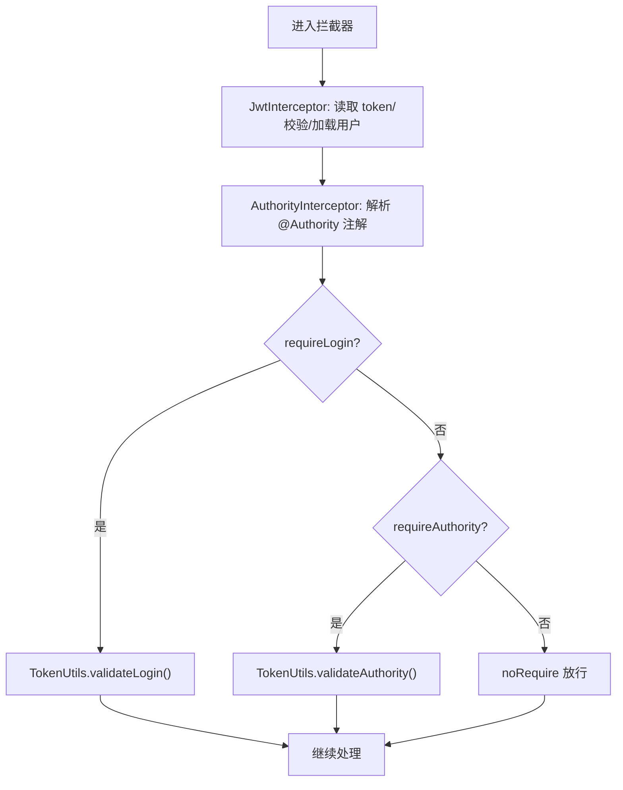

# 认证授权模块

<cite>
**本文引用的文件**
- [Authority.java](file://mall-server/src/main/java/com/rabbiter/em/annotation/Authority.java)
- [AuthorityType.java](file://mall-server/src/main/java/com/rabbiter/em/entity/AuthorityType.java)
- [JwtInterceptor.java](file://mall-server/src/main/java/com/rabbiter/em/interceptor/JwtInterceptor.java)
- [AuthorityInterceptor.java](file://mall-server/src/main/java/com/rabbiter/em/interceptor/AuthorityInterceptor.java)
- [InterceptorConfig.java](file://mall-server/src/main/java/com/rabbiter/em/config/InterceptorConfig.java)
- [TokenUtils.java](file://mall-server/src/main/java/com/rabbiter/em/utils/TokenUtils.java)
- [UserHolder.java](file://mall-server/src/main/java/com/rabbiter/em/utils/UserHolder.java)
- [Constants.java](file://mall-server/src/main/java/com/rabbiter/em/constants/Constants.java)
- [RedisConstants.java](file://mall-server/src/main/java/com/rabbiter/em/constants/RedisConstants.java)
- [UserService.java](file://mall-server/src/main/java/com/rabbiter/em/service/UserService.java)
- [UserController.java](file://mall-server/src/main/java/com/rabbiter/em/controller/UserController.java)
- [RoleController.java](file://mall-server/src/main/java/com/rabbiter/em/controller/RoleController.java)
- [application.yml](file://mall-server/src/main/resources/application.yml)
- [RedisConfig.java](file://mall-server/src/main/java/com/rabbiter/em/config/RedisConfig.java)
- [GlobalExceptionHandler.java](file://mall-server/src/main/java/com/rabbiter/em/config/GlobalExceptionHandler.java)
- [ServiceException.java](file://mall-server/src/main/java/com/rabbiter/em/exception/ServiceException.java)
</cite>

## 目录
1. [简介](#简介)
2. [项目结构](#项目结构)
3. [核心组件](#核心组件)
4. [架构总览](#架构总览)
5. [详细组件分析](#详细组件分析)
6. [依赖分析](#依赖分析)
7. [性能考量](#性能考量)
8. [故障排查指南](#故障排查指南)
9. [结论](#结论)
10. [附录](#附录)

## 简介
本文件面向认证授权模块，系统性解析基于 JWT 的认证与权限控制实现，涵盖以下要点：
- 完整的 JWT 流程：令牌生成、验证、续期与失效处理
- 自定义拦截器链：JwtInterceptor 与 AuthorityInterceptor 的职责划分与执行顺序
- 权限注解 @Authority 的使用方式与控制策略
- 用户角色体系与权限模型设计
- 认证与权限检查流程图
- 安全最佳实践与常见问题防护
- 可扩展的权限控制机制建议

## 项目结构
认证授权相关代码主要分布在以下包与文件中：
- 注解与枚举：权限声明与类型定义
- 拦截器：请求拦截与权限判定
- 工具类：令牌生成、用户上下文持有
- 配置：拦截器注册、Redis 序列化、全局异常处理
- 控制器：权限注解在接口上的实际应用
- 服务层：登录时令牌签发与 Redis 存储

**图表来源**
- [InterceptorConfig.java:11-36](file://mall-server/src/main/java/com/rabbiter/em/config/InterceptorConfig.java#L11-L36)
- [JwtInterceptor.java:34-99](file://mall-server/src/main/java/com/rabbiter/em/interceptor/JwtInterceptor.java#L34-L99)
- [AuthorityInterceptor.java:15-54](file://mall-server/src/main/java/com/rabbiter/em/interceptor/AuthorityInterceptor.java#L15-L54)
- [TokenUtils.java:18-78](file://mall-server/src/main/java/com/rabbiter/em/utils/TokenUtils.java#L18-L78)
- [UserHolder.java:5-20](file://mall-server/src/main/java/com/rabbiter/em/utils/UserHolder.java#L5-L20)
- [Constants.java:5-16](file://mall-server/src/main/java/com/rabbiter/em/constants/Constants.java#L5-L16)
- [RedisConstants.java:3-10](file://mall-server/src/main/java/com/rabbiter/em/constants/RedisConstants.java#L3-L10)
- [UserService.java:27-155](file://mall-server/src/main/java/com/rabbiter/em/service/UserService.java#L27-L155)
- [UserController.java:28-179](file://mall-server/src/main/java/com/rabbiter/em/controller/UserController.java#L28-L179)
- [RoleController.java:10-22](file://mall-server/src/main/java/com/rabbiter/em/controller/RoleController.java#L10-L22)
- [GlobalExceptionHandler.java:11-45](file://mall-server/src/main/java/com/rabbiter/em/config/GlobalExceptionHandler.java#L11-L45)
- [ServiceException.java:6-18](file://mall-server/src/main/java/com/rabbiter/em/exception/ServiceException.java#L6-L18)

**章节来源**
- [InterceptorConfig.java:11-36](file://mall-server/src/main/java/com/rabbiter/em/config/InterceptorConfig.java#L11-L36)
- [application.yml:35-36](file://mall-server/src/main/resources/application.yml#L35-L36)

## 核心组件
- 权限注解与类型
  - @Authority：用于类或方法级别声明权限要求，值来自 AuthorityType
  - AuthorityType：定义 requireLogin、requireAuthority、noRequire 三种策略
- 拦截器链
  - JwtInterceptor：第一层拦截器，负责从请求头读取 token，校验并从 Redis 加载用户，写入 ThreadLocal，并进行 JWT 校验；同时根据注解决定是否放行
  - AuthorityInterceptor：第二层拦截器，基于注解与 TokenUtils 进行登录态与权限判定
- 工具与常量
  - TokenUtils：静态工具，负责生成 JWT、获取当前用户、登录态与权限校验
  - UserHolder：线程本地存储当前用户
  - Constants：统一状态码与消息常量
  - RedisConstants：Redis 键前缀与 TTL 配置
- 服务与控制器
  - UserService：登录时签发 JWT 并写入 Redis，注册时密码加密与迁移
  - UserController/RoleController：展示 @Authority 的典型用法与角色查询

**章节来源**
- [Authority.java:7-12](file://mall-server/src/main/java/com/rabbiter/em/annotation/Authority.java#L7-L12)
- [AuthorityType.java:3-7](file://mall-server/src/main/java/com/rabbiter/em/entity/AuthorityType.java#L3-L7)
- [JwtInterceptor.java:34-99](file://mall-server/src/main/java/com/rabbiter/em/interceptor/JwtInterceptor.java#L34-L99)
- [AuthorityInterceptor.java:15-54](file://mall-server/src/main/java/com/rabbiter/em/interceptor/AuthorityInterceptor.java#L15-L54)
- [TokenUtils.java:18-78](file://mall-server/src/main/java/com/rabbiter/em/utils/TokenUtils.java#L18-L78)
- [UserHolder.java:5-20](file://mall-server/src/main/java/com/rabbiter/em/utils/UserHolder.java#L5-L20)
- [Constants.java:5-16](file://mall-server/src/main/java/com/rabbiter/em/constants/Constants.java#L5-L16)
- [RedisConstants.java:3-10](file://mall-server/src/main/java/com/rabbiter/em/constants/RedisConstants.java#L3-L10)
- [UserService.java:44-75](file://mall-server/src/main/java/com/rabbiter/em/service/UserService.java#L44-L75)
- [UserController.java:83-177](file://mall-server/src/main/java/com/rabbiter/em/controller/UserController.java#L83-L177)
- [RoleController.java:14-20](file://mall-server/src/main/java/com/rabbiter/em/controller/RoleController.java#L14-L20)

## 架构总览
认证授权采用“拦截器链 + 注解 + 工具类”的分层设计，请求处理流程如下：

**图表来源**
- [InterceptorConfig.java:17-30](file://mall-server/src/main/java/com/rabbiter/em/config/InterceptorConfig.java#L17-L30)
- [JwtInterceptor.java:40-98](file://mall-server/src/main/java/com/rabbiter/em/interceptor/JwtInterceptor.java#L40-L98)
- [AuthorityInterceptor.java:17-47](file://mall-server/src/main/java/com/rabbiter/em/interceptor/AuthorityInterceptor.java#L17-L47)
- [TokenUtils.java:50-75](file://mall-server/src/main/java/com/rabbiter/em/utils/TokenUtils.java#L50-L75)
- [RedisConfig.java:12-37](file://mall-server/src/main/java/com/rabbiter/em/config/RedisConfig.java#L12-L37)

## 详细组件分析

### 权限注解与类型
- @Authority 支持在类与方法上声明，方法注解优先于类注解
- AuthorityType 三态策略：
  - requireLogin：要求具备有效登录态
  - requireAuthority：要求管理员角色
  - noRequire：无需登录或权限校验

**图表来源**
- [Authority.java:7-12](file://mall-server/src/main/java/com/rabbiter/em/annotation/Authority.java#L7-L12)
- [AuthorityType.java:3-7](file://mall-server/src/main/java/com/rabbiter/em/entity/AuthorityType.java#L3-L7)

**章节来源**
- [Authority.java:7-12](file://mall-server/src/main/java/com/rabbiter/em/annotation/Authority.java#L7-L12)
- [AuthorityType.java:3-7](file://mall-server/src/main/java/com/rabbiter/em/entity/AuthorityType.java#L3-L7)

### JWT 令牌生成与验证
- 生成：TokenUtils 使用 HS256 算法签名，audience 字段承载用户标识
- 存储：登录成功后将用户对象写入 Redis，键由 RedisConstants.USER_TOKEN_KEY + token 组成
- 校验：JwtInterceptor 从 Redis 读取用户并进行 JWTVerifier 校验，同时按需重置过期时间

**图表来源**
- [UserService.java:69-74](file://mall-server/src/main/java/com/rabbiter/em/service/UserService.java#L69-L74)
- [RedisConstants.java:4-5](file://mall-server/src/main/java/com/rabbiter/em/constants/RedisConstants.java#L4-L5)
- [JwtInterceptor.java:69-91](file://mall-server/src/main/java/com/rabbiter/em/interceptor/JwtInterceptor.java#L69-L91)

**章节来源**
- [TokenUtils.java:31-40](file://mall-server/src/main/java/com/rabbiter/em/utils/TokenUtils.java#L31-L40)
- [UserService.java:69-74](file://mall-server/src/main/java/com/rabbiter/em/service/UserService.java#L69-L74)
- [RedisConstants.java:4-5](file://mall-server/src/main/java/com/rabbiter/em/constants/RedisConstants.java#L4-L5)
- [JwtInterceptor.java:69-91](file://mall-server/src/main/java/com/rabbiter/em/interceptor/JwtInterceptor.java#L69-L91)

### 自定义拦截器链设计与执行顺序
- 注册顺序：JwtInterceptor 先于 AuthorityInterceptor
- 路径匹配：JwtInterceptor 排除登录、注册、头像等公开接口；AuthorityInterceptor 对所有路径生效
- 执行逻辑：
  - JwtInterceptor：读取 token → 从 Redis 加载用户 → 写入 ThreadLocal → JWT 校验 → 按注解决定是否放行
  - AuthorityInterceptor：根据注解调用 TokenUtils.validateLogin 或 validateAuthority

**图表来源**
- [InterceptorConfig.java:17-30](file://mall-server/src/main/java/com/rabbiter/em/config/InterceptorConfig.java#L17-L30)
- [JwtInterceptor.java:40-98](file://mall-server/src/main/java/com/rabbiter/em/interceptor/JwtInterceptor.java#L40-L98)
- [AuthorityInterceptor.java:17-47](file://mall-server/src/main/java/com/rabbiter/em/interceptor/AuthorityInterceptor.java#L17-L47)
- [TokenUtils.java:50-75](file://mall-server/src/main/java/com/rabbiter/em/utils/TokenUtils.java#L50-L75)

**章节来源**
- [InterceptorConfig.java:17-30](file://mall-server/src/main/java/com/rabbiter/em/config/InterceptorConfig.java#L17-L30)
- [JwtInterceptor.java:40-98](file://mall-server/src/main/java/com/rabbiter/em/interceptor/JwtInterceptor.java#L40-L98)
- [AuthorityInterceptor.java:17-47](file://mall-server/src/main/java/com/rabbiter/em/interceptor/AuthorityInterceptor.java#L17-L47)

### 权限注解使用与控制策略
- 在控制器类或方法上使用 @Authority(AuthorityType.requireAuthority) 标注敏感操作
- 方法级注解优先于类级注解
- 未标注默认 requireLogin（除非显式标注 noRequire）

**图表来源**
- [AuthorityInterceptor.java:24-43](file://mall-server/src/main/java/com/rabbiter/em/interceptor/AuthorityInterceptor.java#L24-L43)
- [TokenUtils.java:50-75](file://mall-server/src/main/java/com/rabbiter/em/utils/TokenUtils.java#L50-L75)
- [UserController.java:83-177](file://mall-server/src/main/java/com/rabbiter/em/controller/UserController.java#L83-L177)

**章节来源**
- [AuthorityInterceptor.java:24-43](file://mall-server/src/main/java/com/rabbiter/em/interceptor/AuthorityInterceptor.java#L24-L43)
- [TokenUtils.java:50-75](file://mall-server/src/main/java/com/rabbiter/em/utils/TokenUtils.java#L50-L75)
- [UserController.java:83-177](file://mall-server/src/main/java/com/rabbiter/em/controller/UserController.java#L83-L177)

### 用户角色体系与权限模型
- 角色字段：User 实体包含 role 字段，默认 user；管理员为 admin
- 权限判定：validateAuthority 仅允许 role=admin 的用户访问
- 扩展建议：可在 Token 中加入多角色/权限集合，AuthorityInterceptor 中进行细粒度校验

**图表来源**
- [TokenUtils.java:65-75](file://mall-server/src/main/java/com/rabbiter/em/utils/TokenUtils.java#L65-L75)
- [RoleController.java:14-20](file://mall-server/src/main/java/com/rabbiter/em/controller/RoleController.java#L14-L20)

**章节来源**
- [TokenUtils.java:65-75](file://mall-server/src/main/java/com/rabbiter/em/utils/TokenUtils.java#L65-L75)
- [RoleController.java:14-20](file://mall-server/src/main/java/com/rabbiter/em/controller/RoleController.java#L14-L20)

## 依赖分析
- 组件耦合
  - JwtInterceptor 依赖 RedisTemplate、TokenUtils、UserHolder、Constants、RedisConstants
  - AuthorityInterceptor 依赖 TokenUtils、Authority 注解与 AuthorityType
  - TokenUtils 依赖 Spring RequestContextHolder、Constants
  - UserService 依赖 TokenUtils、RedisTemplate、BCryptPasswordEncoder
- 外部依赖
  - Redis：用户 token 缓存
  - JWT：HS256 签名与校验
  - Spring MVC：拦截器链与注解扫描

**图表来源**
- [JwtInterceptor.java:35-38](file://mall-server/src/main/java/com/rabbiter/em/interceptor/JwtInterceptor.java#L35-L38)
- [AuthorityInterceptor.java:15-16](file://mall-server/src/main/java/com/rabbiter/em/interceptor/AuthorityInterceptor.java#L15-L16)
- [TokenUtils.java:18-29](file://mall-server/src/main/java/com/rabbiter/em/utils/TokenUtils.java#L18-L29)
- [UserService.java:39-42](file://mall-server/src/main/java/com/rabbiter/em/service/UserService.java#L39-L42)

**章节来源**
- [JwtInterceptor.java:35-38](file://mall-server/src/main/java/com/rabbiter/em/interceptor/JwtInterceptor.java#L35-L38)
- [AuthorityInterceptor.java:15-16](file://mall-server/src/main/java/com/rabbiter/em/interceptor/AuthorityInterceptor.java#L15-L16)
- [TokenUtils.java:18-29](file://mall-server/src/main/java/com/rabbiter/em/utils/TokenUtils.java#L18-L29)
- [UserService.java:39-42](file://mall-server/src/main/java/com/rabbiter/em/service/UserService.java#L39-L42)

## 性能考量
- Redis 读写：用户信息缓存于 Redis，避免频繁查询数据库；注意合理设置 TTL 与内存策略
- JWT 校验：HS256 为对称算法，校验开销低；建议使用强密钥并定期轮换
- 线程本地存储：UserHolder 减少重复查询，但需确保 afterCompletion 清理，防止内存泄漏
- 拦截器顺序：先做鉴权再做权限校验，减少无效请求进入业务层

[本节为通用指导，不涉及具体文件分析]

## 故障排查指南
- 常见异常与处理
  - 令牌无效/过期：拦截器抛出 401 异常，由全局异常处理器统一返回
  - 无权限访问：抛出 403 异常，统一返回
  - 登录状态失效：validateLogin 抛出 401，提示重新登录
- 关键定位点
  - 拦截器链：确认路径排除与执行顺序
  - Redis：检查键是否存在、TTL 是否正确
  - JWT 密钥：确认 application.yml 中 jwt.secret 配置一致
  - 注解使用：确认方法级注解覆盖类级注解

**章节来源**
- [GlobalExceptionHandler.java:16-20](file://mall-server/src/main/java/com/rabbiter/em/config/GlobalExceptionHandler.java#L16-L20)
- [Constants.java:9-11](file://mall-server/src/main/java/com/rabbiter/em/constants/Constants.java#L9-L11)
- [TokenUtils.java:50-75](file://mall-server/src/main/java/com/rabbiter/em/utils/TokenUtils.java#L50-L75)
- [application.yml:35-36](file://mall-server/src/main/resources/application.yml#L35-L36)

## 结论
本认证授权模块通过注解驱动与拦截器链实现了清晰的登录态与权限控制，结合 Redis 缓存与 JWT 对称签名，具备良好的可维护性与扩展性。建议在生产环境强化密钥管理、引入刷新令牌与审计日志，并按需扩展权限模型以支持更复杂的业务场景。

[本节为总结性内容，不涉及具体文件分析]

## 附录

### 认证流程图（登录与后续请求）

**图表来源**
- [UserService.java:44-75](file://mall-server/src/main/java/com/rabbiter/em/service/UserService.java#L44-L75)
- [JwtInterceptor.java:40-98](file://mall-server/src/main/java/com/rabbiter/em/interceptor/JwtInterceptor.java#L40-L98)
- [AuthorityInterceptor.java:17-47](file://mall-server/src/main/java/com/rabbiter/em/interceptor/AuthorityInterceptor.java#L17-L47)

### 权限检查流程图

**图表来源**
- [AuthorityInterceptor.java:24-43](file://mall-server/src/main/java/com/rabbiter/em/interceptor/AuthorityInterceptor.java#L24-L43)
- [TokenUtils.java:50-75](file://mall-server/src/main/java/com/rabbiter/em/utils/TokenUtils.java#L50-L75)

### 安全最佳实践
- 密钥管理：使用强随机密钥，定期轮换；避免硬编码，通过环境变量注入
- 传输安全：启用 HTTPS，避免明文传输 token
- Redis 安全：限制访问、开启认证、网络隔离
- 令牌策略：短 TTL + 后台自动续期；必要时引入刷新令牌
- 日志与监控：记录认证事件与异常，设置告警阈值

[本节为通用指导，不涉及具体文件分析]

### 扩展权限控制机制建议
- 多角色/权限集合：在 JWT 中嵌入角色与权限数组，在 AuthorityInterceptor 中进行细粒度校验
- 动态权限：结合 RBAC 模型，从数据库动态加载用户权限并缓存
- 资源级权限：在注解中增加资源标识与操作类型，实现 CRUD 粒度控制
- 审计日志：记录每次权限决策与失败原因，便于追踪与分析

[本节为通用指导，不涉及具体文件分析]