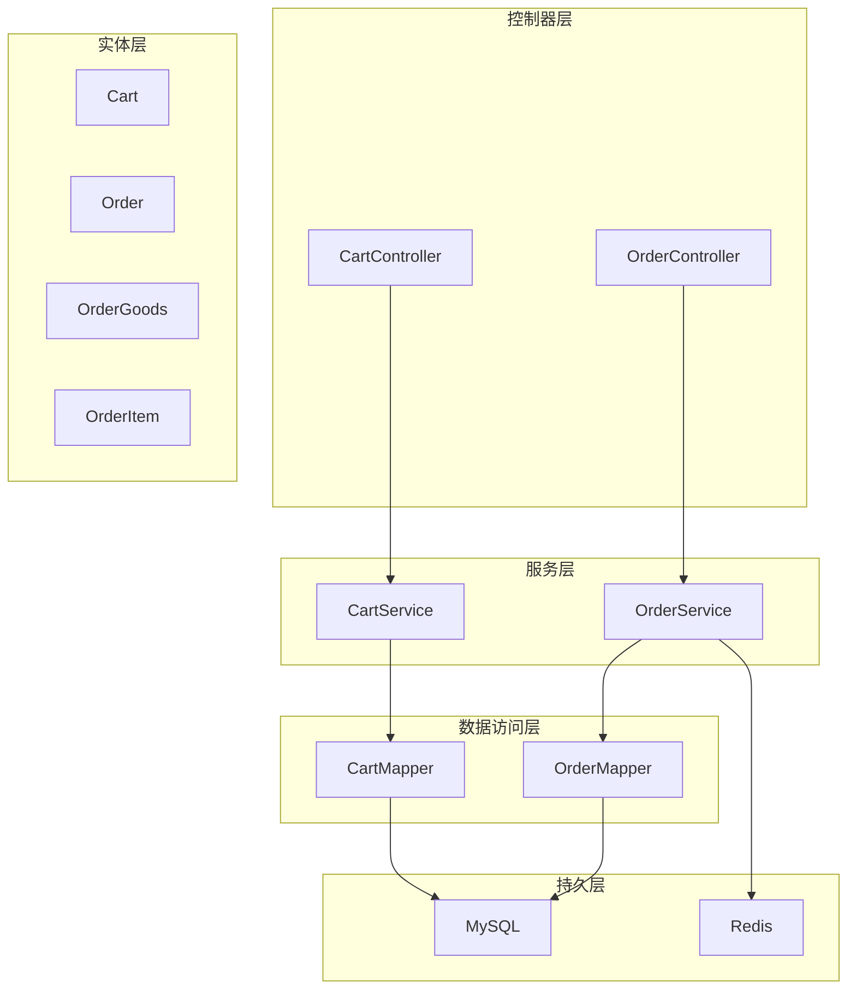
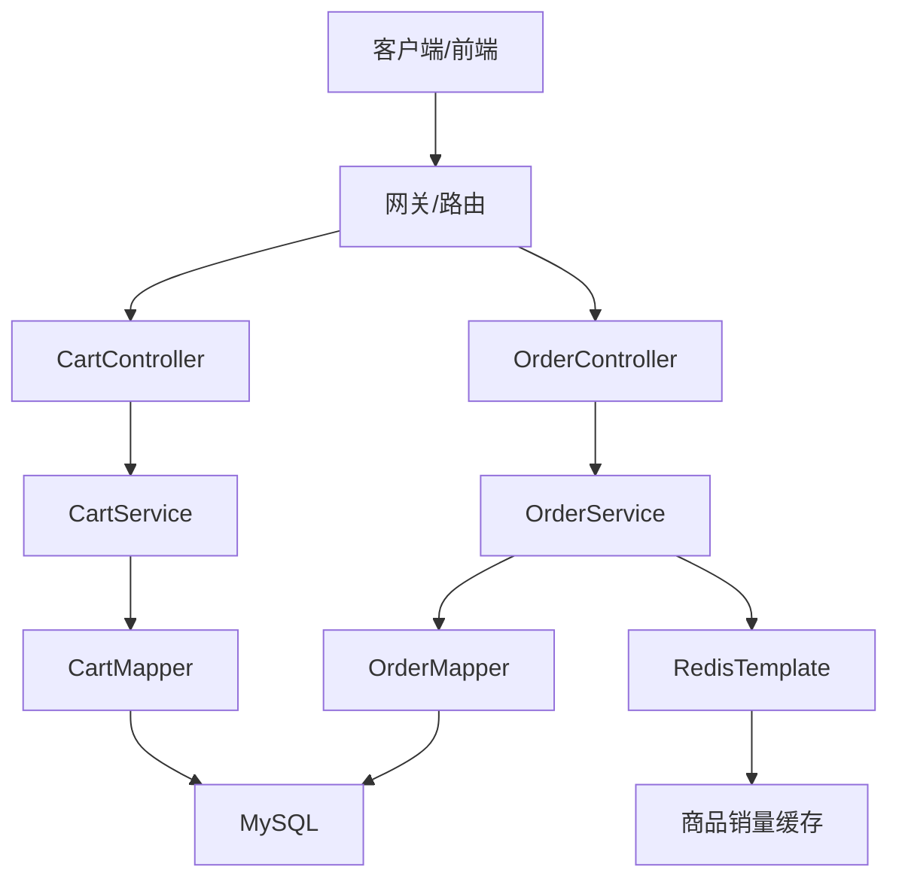
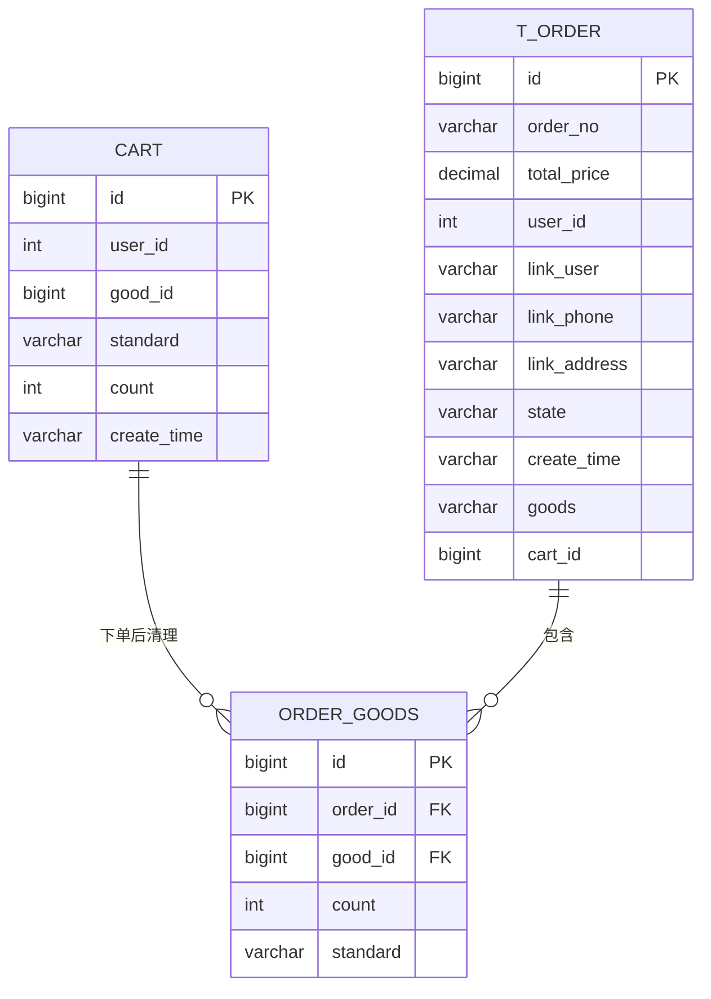
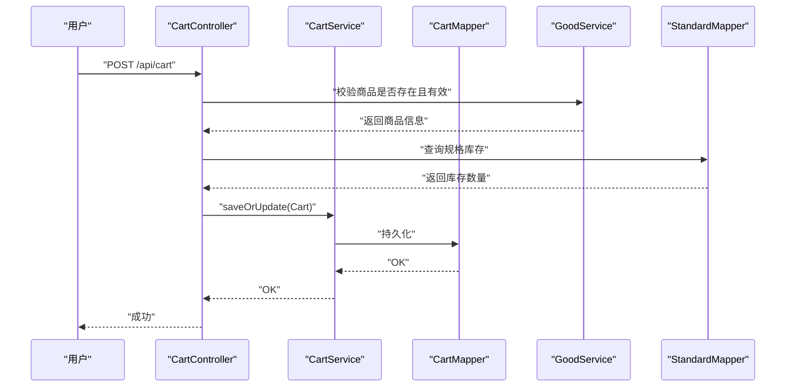
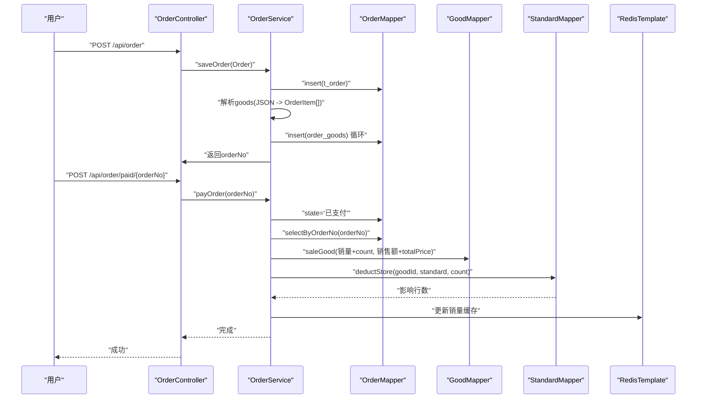
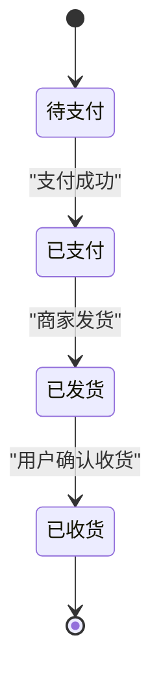
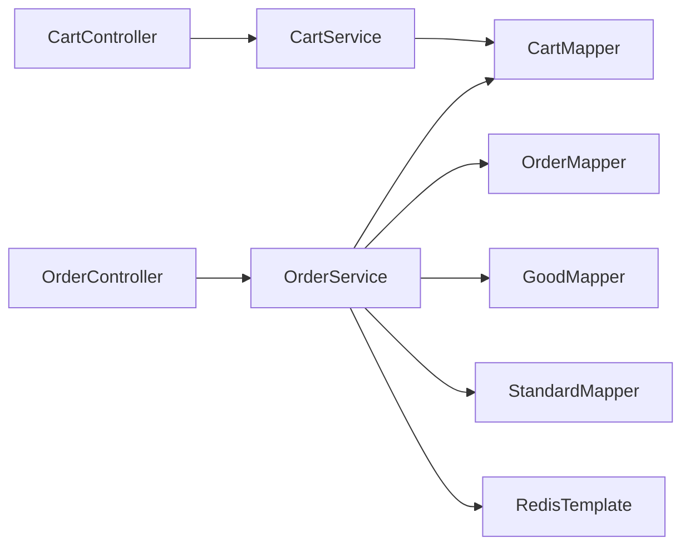

# 购物车与订单管理模块

<cite>
**本文引用的文件**
- [Cart.java](file://mall-server/src/main/java/com/rabbiter/em/entity/Cart.java)
- [Order.java](file://mall-server/src/main/java/com/rabbiter/em/entity/Order.java)
- [OrderItem.java](file://mall-server/src/main/java/com/rabbiter/em/entity/OrderItem.java)
- [OrderGoods.java](file://mall-server/src/main/java/com/rabbiter/em/entity/OrderGoods.java)
- [CartService.java](file://mall-server/src/main/java/com/rabbiter/em/service/CartService.java)
- [OrderService.java](file://mall-server/src/main/java/com/rabbiter/em/service/OrderService.java)
- [CartController.java](file://mall-server/src/main/java/com/rabbiter/em/controller/CartController.java)
- [OrderController.java](file://mall-server/src/main/java/com/rabbiter/em/controller/OrderController.java)
- [CartMapper.java](file://mall-server/src/main/java/com/rabbiter/em/mapper/CartMapper.java)
- [OrderMapper.java](file://mall-server/src/main/java/com/rabbiter/em/mapper/OrderMapper.java)
- [Cart.xml](file://mall-server/src/main/resources/mapper/Cart.xml)
- [Order.xml](file://mall-server/src/main/resources/mapper/Order.xml)
- [application.yml](file://mall-server/src/main/resources/application.yml)
- [Constants.java](file://mall-server/src/main/java/com/rabbiter/em/constants/Constants.java)
- [RedisConstants.java](file://mall-server/src/main/java/com/rabbiter/em/constants/RedisConstants.java)
</cite>

## 目录
1. [简介](#简介)
2. [项目结构](#项目结构)
3. [核心组件](#核心组件)
4. [架构总览](#架构总览)
5. [详细组件分析](#详细组件分析)
6. [依赖关系分析](#依赖关系分析)
7. [性能考虑](#性能考虑)
8. [故障排查指南](#故障排查指南)
9. [结论](#结论)
10. [附录](#附录)

## 简介
本文件面向“购物车与订单管理模块”的技术文档，覆盖以下目标：
- 购物车功能：添加、删除、数量修改、按用户查询等
- 订单管理：创建、支付处理、状态管理、查询与导出
- 实体设计与关联：Cart、Order、OrderGoods、OrderItem 的职责与关系
- 服务层业务规则：库存检查、价格计算（通过标准价格）、优惠处理（字段存在但未在服务中实现）
- RESTful 接口：购物车与订单管理的端点与鉴权策略
- 并发与事务：事务边界、幂等性与并发控制建议
- 流程图与状态图：业务流程与状态转换可视化

## 项目结构
后端采用 Spring Boot + MyBatis-Plus 架构，模块化清晰：
- 控制器层：CartController、OrderController 提供 REST 接口
- 服务层：CartService、OrderService 实现业务规则
- 数据访问层：CartMapper、OrderMapper 及 XML 映射
- 实体层：Cart、Order、OrderGoods、OrderItem
- 配置：application.yml、Redis 配置常量

图表来源
- [CartController.java:1-110](file://mall-server/src/main/java/com/rabbiter/em/controller/CartController.java#L1-L110)
- [OrderController.java:1-196](file://mall-server/src/main/java/com/rabbiter/em/controller/OrderController.java#L1-L196)
- [CartService.java:1-22](file://mall-server/src/main/java/com/rabbiter/em/service/CartService.java#L1-L22)
- [OrderService.java:1-184](file://mall-server/src/main/java/com/rabbiter/em/service/OrderService.java#L1-L184)
- [CartMapper.java:1-15](file://mall-server/src/main/java/com/rabbiter/em/mapper/CartMapper.java#L1-L15)
- [OrderMapper.java:1-26](file://mall-server/src/main/java/com/rabbiter/em/mapper/OrderMapper.java#L1-L26)
- [application.yml:1-42](file://mall-server/src/main/resources/application.yml#L1-L42)

章节来源
- [application.yml:1-42](file://mall-server/src/main/resources/application.yml#L1-L42)

## 核心组件
- 实体模型
  - Cart：用户购物车项，包含商品ID、规格、数量、加入时间
  - Order：订单主表，包含订单号、总价、联系人、地址、状态、创建时间
  - OrderGoods：订单与商品的关联表，记录每笔订单包含的具体商品及数量、规格
  - OrderItem：从前端接收的订单商品清单载体，包含商品ID、规格、数量
- 服务层
  - CartService：基于 CartMapper 提供按用户查询
  - OrderService：负责订单创建、支付处理、状态变更、销量与库存更新、Redis 同步
- 控制器层
  - CartController：鉴权、库存校验、增删改查
  - OrderController：鉴权、分页查询、导出、支付、发货、收货、删除

章节来源
- [Cart.java:1-97](file://mall-server/src/main/java/com/rabbiter/em/entity/Cart.java#L1-L97)
- [Order.java:1-171](file://mall-server/src/main/java/com/rabbiter/em/entity/Order.java#L1-L171)
- [OrderGoods.java:1-86](file://mall-server/src/main/java/com/rabbiter/em/entity/OrderGoods.java#L1-L86)
- [OrderItem.java:1-54](file://mall-server/src/main/java/com/rabbiter/em/entity/OrderItem.java#L1-L54)
- [CartService.java:1-22](file://mall-server/src/main/java/com/rabbiter/em/service/CartService.java#L1-L22)
- [OrderService.java:1-184](file://mall-server/src/main/java/com/rabbiter/em/service/OrderService.java#L1-L184)

## 架构总览
整体采用 MVC 分层与 MyBatis-Plus ORM，结合 Redis 缓存热点商品信息，保证读写分离与高并发下的性能。

图表来源
- [CartController.java:1-110](file://mall-server/src/main/java/com/rabbiter/em/controller/CartController.java#L1-L110)
- [OrderController.java:1-196](file://mall-server/src/main/java/com/rabbiter/em/controller/OrderController.java#L1-L196)
- [CartService.java:1-22](file://mall-server/src/main/java/com/rabbiter/em/service/CartService.java#L1-L22)
- [OrderService.java:1-184](file://mall-server/src/main/java/com/rabbiter/em/service/OrderService.java#L1-L184)
- [application.yml:22-33](file://mall-server/src/main/resources/application.yml#L22-L33)

## 详细组件分析

### 实体与关联关系
- 关联关系
  - Order 与 OrderGoods：一对多（一个订单包含多个订单项）
  - OrderGoods 与 Good：多对一（订单项指向具体商品）
  - Cart 与 Good：多对一（购物车项指向具体商品）
- 字段要点
  - Order.goods 作为 JSON 字符串承载订单项集合，由 OrderItem 解析
  - Order.cartId 用于下单后清理购物车
  - Order.state 表示订单状态（如“已支付”、“已发货”、“已收货”）

图表来源
- [Cart.java:1-97](file://mall-server/src/main/java/com/rabbiter/em/entity/Cart.java#L1-L97)
- [Order.java:1-171](file://mall-server/src/main/java/com/rabbiter/em/entity/Order.java#L1-L171)
- [OrderGoods.java:1-86](file://mall-server/src/main/java/com/rabbiter/em/entity/OrderGoods.java#L1-L86)

章节来源
- [Order.java:59-65](file://mall-server/src/main/java/com/rabbiter/em/entity/Order.java#L59-L65)
- [OrderItem.java:1-54](file://mall-server/src/main/java/com/rabbiter/em/entity/OrderItem.java#L1-L54)

### 购物车服务与控制器
- 业务规则
  - 新增/修改购物车前进行库存校验与商品有效性校验
  - 自动设置当前用户ID与创建时间
  - 支持按用户ID查询购物车明细（含价格、图片、折扣、库存等）
- 并发与事务
  - 购物车操作未使用事务；若需强一致可考虑在库存扣减处引入分布式锁或乐观锁
- 接口要点
  - 仅登录用户可操作
  - 管理员可查看全部购物车

图表来源
- [CartController.java:68-91](file://mall-server/src/main/java/com/rabbiter/em/controller/CartController.java#L68-L91)
- [CartService.java:18-20](file://mall-server/src/main/java/com/rabbiter/em/service/CartService.java#L18-L20)
- [CartMapper.java:12-13](file://mall-server/src/main/java/com/rabbiter/em/mapper/CartMapper.java#L12-L13)

章节来源
- [CartController.java:38-108](file://mall-server/src/main/java/com/rabbiter/em/controller/CartController.java#L38-L108)
- [CartMapper.java:1-15](file://mall-server/src/main/java/com/rabbiter/em/mapper/CartMapper.java#L1-L15)
- [Cart.xml:1-27](file://mall-server/src/main/resources/mapper/Cart.xml#L1-L27)

### 订单服务与控制器
- 订单创建
  - 生成唯一订单号（时间戳+随机数）
  - 解析 goods JSON 为 OrderItem 列表，逐条写入 order_goods
  - 清理对应购物车项
- 支付处理
  - 更新订单状态为“已支付”
  - 扣减库存（调用标准库存扣减）
  - 增加商品销量与销售额
  - 同步 Redis 中销量缓存
- 状态管理
  - 发货：管理员操作，更新状态为“已发货”
  - 收货：用户确认收货，更新状态为“已收货”
- 查询与导出
  - 按用户ID、订单号查询
  - 管理员支持分页与条件过滤导出 CSV

图表来源
- [OrderController.java:134-151](file://mall-server/src/main/java/com/rabbiter/em/controller/OrderController.java#L134-L151)
- [OrderService.java:58-88](file://mall-server/src/main/java/com/rabbiter/em/service/OrderService.java#L58-L88)
- [OrderService.java:96-149](file://mall-server/src/main/java/com/rabbiter/em/service/OrderService.java#L96-L149)
- [OrderMapper.java:13-24](file://mall-server/src/main/java/com/rabbiter/em/mapper/OrderMapper.java#L13-L24)

章节来源
- [OrderController.java:1-196](file://mall-server/src/main/java/com/rabbiter/em/controller/OrderController.java#L1-L196)
- [OrderService.java:1-184](file://mall-server/src/main/java/com/rabbiter/em/service/OrderService.java#L1-L184)
- [Order.xml:1-49](file://mall-server/src/main/resources/mapper/Order.xml#L1-L49)

### 订单状态转换图

图表来源
- [OrderService.java:176-181](file://mall-server/src/main/java/com/rabbiter/em/service/OrderService.java#L176-L181)
- [OrderMapper.java:19-20](file://mall-server/src/main/java/com/rabbiter/em/mapper/OrderMapper.java#L19-L20)

## 依赖关系分析
- 组件耦合
  - CartController 依赖 CartService、GoodService、StandardMapper
  - OrderController 依赖 OrderService、TokenUtils
  - OrderService 依赖 OrderMapper、OrderGoodsMapper、GoodMapper、StandardMapper、CartService、RedisTemplate
- 外部依赖
  - MySQL：持久化订单、购物车、商品与库存
  - Redis：商品销量缓存

图表来源
- [CartController.java:24-31](file://mall-server/src/main/java/com/rabbiter/em/controller/CartController.java#L24-L31)
- [OrderController.java:31-32](file://mall-server/src/main/java/com/rabbiter/em/controller/OrderController.java#L31-L32)
- [OrderService.java:37-48](file://mall-server/src/main/java/com/rabbiter/em/service/OrderService.java#L37-L48)

章节来源
- [application.yml:8-33](file://mall-server/src/main/resources/application.yml#L8-L33)

## 性能考虑
- 读取路径优化
  - 购物车与订单查询均通过 MyBatis XML 进行联表查询，减少 N+1 查询
  - Redis 缓存商品销量，降低写热点下的数据库压力
- 写入路径优化
  - 订单创建与支付处理使用事务，确保一致性
  - 库存扣减与销量更新在同一事务内，避免脏写
- 并发与锁
  - 当前未见显式分布式锁；建议在高并发场景下对库存扣减增加分布式锁或使用数据库悲观/乐观锁
  - 对于“清空购物车”可在事务内完成，避免中间态

## 故障排查指南
- 常见错误与定位
  - 商品已下架/不存在：服务层会抛出业务异常，检查 Good 状态与是否被删除
  - 库存不足：库存校验失败，检查 StandardMapper 的库存查询与扣减逻辑
  - 权限不足：用户尝试访问他人购物车/订单，检查 Token 与鉴权注解
  - 订单号格式：支付时需确保 orderNo 正确传递
- 日志与异常
  - 使用全局异常处理器统一返回 Result，便于前端展示
  - 服务层抛出 ServiceException 时，返回码遵循 Constants 常量

章节来源
- [CartController.java:71-87](file://mall-server/src/main/java/com/rabbiter/em/controller/CartController.java#L71-L87)
- [OrderService.java:118-132](file://mall-server/src/main/java/com/rabbiter/em/service/OrderService.java#L118-L132)
- [Constants.java:1-16](file://mall-server/src/main/java/com/rabbiter/em/constants/Constants.java#L1-L16)

## 结论
本模块以清晰的分层与实体关系实现了购物车与订单管理的核心能力。服务层在订单支付环节完成了库存扣减、销量与销售额更新，并同步 Redis 缓存，具备较好的一致性与性能表现。建议在高并发场景下补充库存扣减的分布式锁与幂等性保障，进一步提升稳定性。

## 附录

### RESTful API 设计与实现摘要
- 购物车接口
  - GET /api/cart/{id}：按ID查询（需登录）
  - GET /api/cart?...：管理员查看全部（需管理员）
  - GET /api/cart/userid/{userId}：按用户查询（需本人或管理员）
  - POST /api/cart：新增/修改（需登录，校验库存与商品有效性）
  - PUT /api/cart：修改（需登录）
  - DELETE /api/cart/{id}：删除（需登录）
- 订单接口
  - GET /api/order/userid/{userid}：按用户查询（需本人或管理员）
  - GET /api/order/orderNo/{orderNo}：按订单号查询（需本人或管理员）
  - GET /api/order?page&pageNo：管理员分页查询（需管理员）
  - GET /api/order/export：管理员导出 CSV（需管理员）
  - POST /api/order：创建订单（需登录）
  - POST /api/order/paid/{orderNo}：订单支付（需本人或管理员）
  - POST /api/order/delivery/{orderNo}：发货（需管理员）
  - POST /api/order/received/{orderNo}：确认收货（需本人）
  - PUT /api/order：更新（需管理员）
  - DELETE /api/order/{id}：删除（需本人或管理员）

章节来源
- [CartController.java:46-108](file://mall-server/src/main/java/com/rabbiter/em/controller/CartController.java#L46-L108)
- [OrderController.java:50-194](file://mall-server/src/main/java/com/rabbiter/em/controller/OrderController.java#L50-L194)

### 数据模型与复杂度分析
- 购物车查询
  - SQL：三表联查，按用户过滤，排序创建时间
  - 复杂度：O(n log n)（排序主导），n 为用户购物车项数
- 订单查询
  - 按用户：两表联查，排序创建时间
  - 按订单号：四表联查，匹配规格价格
  - 导出：三表内连接，支持条件过滤
- 订单创建
  - 复杂度：O(m)（m 为订单项数），主要为循环插入 order_goods
- 支付处理
  - 复杂度：O(1) 基本操作，涉及库存扣减与销量更新

章节来源
- [Cart.xml:18-25](file://mall-server/src/main/resources/mapper/Cart.xml#L18-L25)
- [Order.xml:13-47](file://mall-server/src/main/resources/mapper/Order.xml#L13-L47)
- [OrderService.java:74-84](file://mall-server/src/main/java/com/rabbiter/em/service/OrderService.java#L74-L84)