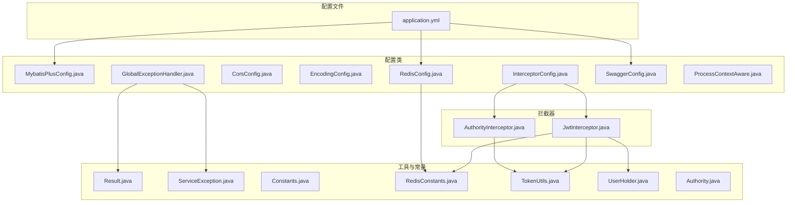
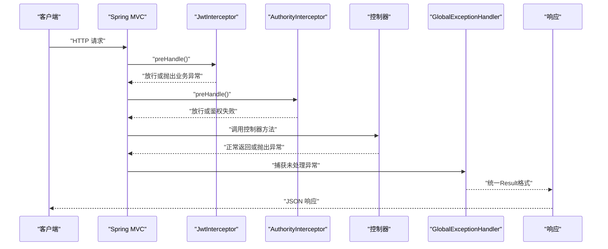
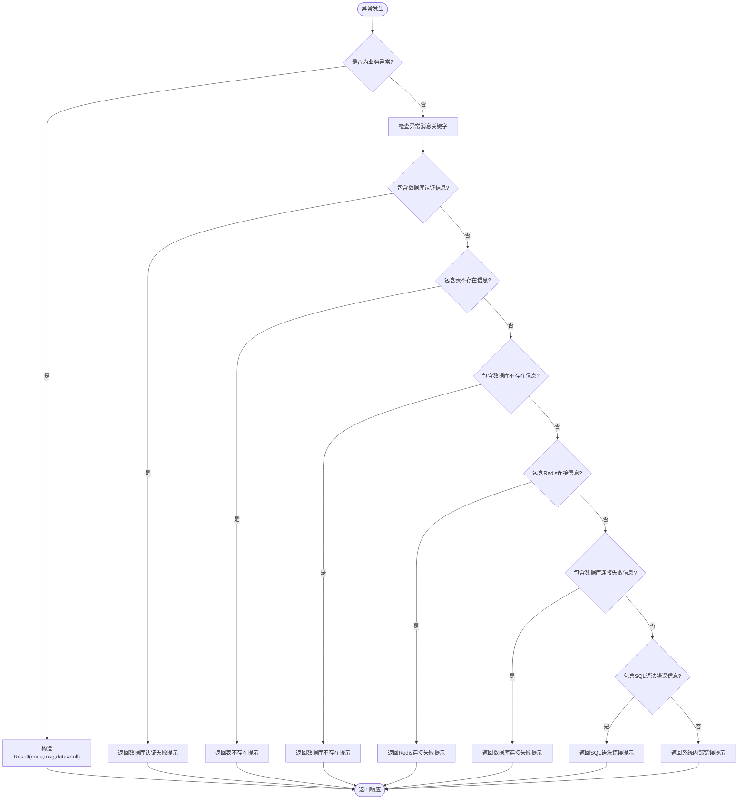
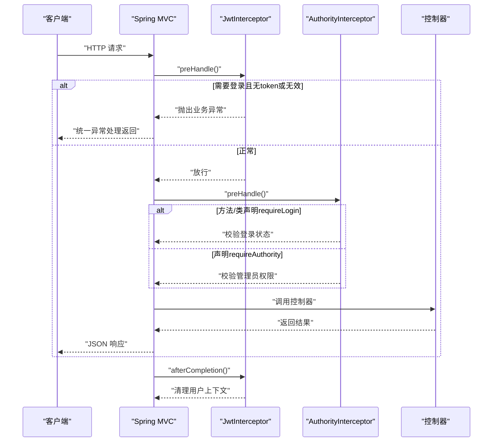
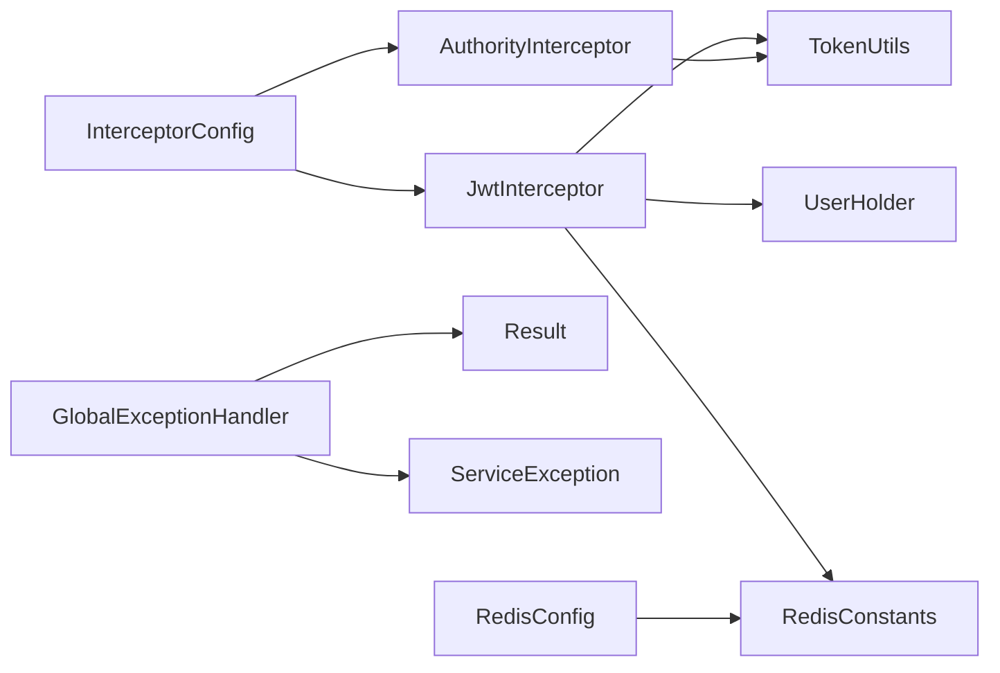

# 配置与拦截器

<cite>
**本文引用的文件**
- [MybatisPlusConfig.java](file://mall-server/src/main/java/com/rabbiter/em/config/MybatisPlusConfig.java)
- [RedisConfig.java](file://mall-server/src/main/java/com/rabbiter/em/config/RedisConfig.java)
- [CorsConfig.java](file://mall-server/src/main/java/com/rabbiter/em/config/CorsConfig.java)
- [EncodingConfig.java](file://mall-server/src/main/java/com/rabbiter/em/config/EncodingConfig.java)
- [GlobalExceptionHandler.java](file://mall-server/src/main/java/com/rabbiter/em/config/GlobalExceptionHandler.java)
- [InterceptorConfig.java](file://mall-server/src/main/java/com/rabbiter/em/config/InterceptorConfig.java)
- [SwaggerConfig.java](file://mall-server/src/main/java/com/rabbiter/em/config/SwaggerConfig.java)
- [ProcessContextAware.java](file://mall-server/src/main/java/com/rabbiter/em/config/ProcessContextAware.java)
- [JwtInterceptor.java](file://mall-server/src/main/java/com/rabbiter/em/interceptor/JwtInterceptor.java)
- [AuthorityInterceptor.java](file://mall-server/src/main/java/com/rabbiter/em/interceptor/AuthorityInterceptor.java)
- [Result.java](file://mall-server/src/main/java/com/rabbiter/em/common/Result.java)
- [ServiceException.java](file://mall-server/src/main/java/com/rabbiter/em/exception/ServiceException.java)
- [application.yml](file://mall-server/src/main/resources/application.yml)
- [Constants.java](file://mall-server/src/main/java/com/rabbiter/em/constants/Constants.java)
- [RedisConstants.java](file://mall-server/src/main/java/com/rabbiter/em/constants/RedisConstants.java)
- [TokenUtils.java](file://mall-server/src/main/java/com/rabbiter/em/utils/TokenUtils.java)
- [UserHolder.java](file://mall-server/src/main/java/com/rabbiter/em/utils/UserHolder.java)
- [Authority.java](file://mall-server/src/main/java/com/rabbiter/em/annotation/Authority.java)
</cite>

## 目录
1. [引言](#引言)
2. [项目结构](#项目结构)
3. [核心组件](#核心组件)
4. [架构总览](#架构总览)
5. [详细组件分析](#详细组件分析)
6. [依赖分析](#依赖分析)
7. [性能考虑](#性能考虑)
8. [故障排查指南](#故障排查指南)
9. [结论](#结论)
10. [附录](#附录)

## 引言
本文件聚焦于Spring Boot后端工程中的“配置与拦截器”模块，系统性梳理以下主题：
- Spring Boot配置管理：MyBatis Plus分页插件、Redis序列化与模板、跨域与字符编码配置
- 全局异常处理机制：自定义异常类、异常处理器与统一错误响应格式
- Swagger API文档配置与使用
- 拦截器体系：JWT拦截与权限拦截的注册、执行顺序与职责边界
- 配置参数详解、性能优化与安全最佳实践
- 如何扩展配置以支持更多功能模块

## 项目结构
围绕配置与拦截器的相关代码主要位于以下包与文件：
- 配置类：config 包下包含 MyBatis Plus、Redis、跨域、编码、全局异常、拦截器注册、Swagger、上下文感知等配置类
- 拦截器：interceptor 包下包含 JWT 与权限拦截器
- 工具与常量：common、exception、constants、utils、annotation 包下的通用模型、异常、常量、工具与注解
- 配置文件：application.yml 提供运行时参数与连接池、Redis、JWT等配置

图表来源
- [MybatisPlusConfig.java:1-21](file://mall-server/src/main/java/com/rabbiter/em/config/MybatisPlusConfig.java#L1-L21)
- [RedisConfig.java:1-38](file://mall-server/src/main/java/com/rabbiter/em/config/RedisConfig.java#L1-L38)
- [CorsConfig.java:1-29](file://mall-server/src/main/java/com/rabbiter/em/config/CorsConfig.java#L1-L29)
- [EncodingConfig.java:1-41](file://mall-server/src/main/java/com/rabbiter/em/config/EncodingConfig.java#L1-L41)
- [GlobalExceptionHandler.java:1-45](file://mall-server/src/main/java/com/rabbiter/em/config/GlobalExceptionHandler.java#L1-L45)
- [InterceptorConfig.java:1-37](file://mall-server/src/main/java/com/rabbiter/em/config/InterceptorConfig.java#L1-L37)
- [SwaggerConfig.java:1-33](file://mall-server/src/main/java/com/rabbiter/em/config/SwaggerConfig.java#L1-L33)
- [JwtInterceptor.java:1-100](file://mall-server/src/main/java/com/rabbiter/em/interceptor/JwtInterceptor.java#L1-L100)
- [AuthorityInterceptor.java:1-54](file://mall-server/src/main/java/com/rabbiter/em/interceptor/AuthorityInterceptor.java#L1-L54)
- [Result.java:1-66](file://mall-server/src/main/java/com/rabbiter/em/common/Result.java#L1-L66)
- [ServiceException.java:1-18](file://mall-server/src/main/java/com/rabbiter/em/exception/ServiceException.java#L1-L18)
- [application.yml:1-42](file://mall-server/src/main/resources/application.yml#L1-L42)

章节来源
- [MybatisPlusConfig.java:1-21](file://mall-server/src/main/java/com/rabbiter/em/config/MybatisPlusConfig.java#L1-L21)
- [RedisConfig.java:1-38](file://mall-server/src/main/java/com/rabbiter/em/config/RedisConfig.java#L1-L38)
- [CorsConfig.java:1-29](file://mall-server/src/main/java/com/rabbiter/em/config/CorsConfig.java#L1-L29)
- [EncodingConfig.java:1-41](file://mall-server/src/main/java/com/rabbiter/em/config/EncodingConfig.java#L1-L41)
- [GlobalExceptionHandler.java:1-45](file://mall-server/src/main/java/com/rabbiter/em/config/GlobalExceptionHandler.java#L1-L45)
- [InterceptorConfig.java:1-37](file://mall-server/src/main/java/com/rabbiter/em/config/InterceptorConfig.java#L1-L37)
- [SwaggerConfig.java:1-33](file://mall-server/src/main/java/com/rabbiter/em/config/SwaggerConfig.java#L1-L33)
- [application.yml:1-42](file://mall-server/src/main/resources/application.yml#L1-L42)

## 核心组件
- MyBatis Plus配置：启用分页插件，限制最大每页记录数，确保分页安全与性能
- Redis配置：提供通用Object模板与User专用模板，统一键与值序列化策略
- 跨域配置：开放所有路径的跨域访问，允许凭据与暴露Cookie头，设置缓存时间
- 编码配置：强制请求/响应与字符串消息转换器使用UTF-8，解决中文乱码
- 全局异常处理：捕获业务异常与系统异常，输出统一Result格式；对常见数据库/Redis连接问题进行语义化提示
- 拦截器配置：注册JWT拦截器与权限拦截器，设定执行顺序与路径匹配规则
- Swagger配置：基于Swagger2生成API文档，限定扫描包范围与基础路径映射
- 上下文感知：根据系统类型尝试释放占用端口，辅助开发环境快速重启

章节来源
- [MybatisPlusConfig.java:10-20](file://mall-server/src/main/java/com/rabbiter/em/config/MybatisPlusConfig.java#L10-L20)
- [RedisConfig.java:12-37](file://mall-server/src/main/java/com/rabbiter/em/config/RedisConfig.java#L12-L37)
- [CorsConfig.java:10-28](file://mall-server/src/main/java/com/rabbiter/em/config/CorsConfig.java#L10-L28)
- [EncodingConfig.java:16-41](file://mall-server/src/main/java/com/rabbiter/em/config/EncodingConfig.java#L16-L41)
- [GlobalExceptionHandler.java:11-45](file://mall-server/src/main/java/com/rabbiter/em/config/GlobalExceptionHandler.java#L11-L45)
- [InterceptorConfig.java:11-36](file://mall-server/src/main/java/com/rabbiter/em/config/InterceptorConfig.java#L11-L36)
- [SwaggerConfig.java:13-33](file://mall-server/src/main/java/com/rabbiter/em/config/SwaggerConfig.java#L13-L33)
- [ProcessContextAware.java:13-46](file://mall-server/src/main/java/com/rabbiter/em/config/ProcessContextAware.java#L13-L46)

## 架构总览
下图展示从客户端请求进入，经由拦截器链、控制器处理，再到统一异常处理与响应返回的整体流程。

图表来源
- [JwtInterceptor.java:39-98](file://mall-server/src/main/java/com/rabbiter/em/interceptor/JwtInterceptor.java#L39-L98)
- [AuthorityInterceptor.java:17-47](file://mall-server/src/main/java/com/rabbiter/em/interceptor/AuthorityInterceptor.java#L17-L47)
- [GlobalExceptionHandler.java:16-43](file://mall-server/src/main/java/com/rabbiter/em/config/GlobalExceptionHandler.java#L16-L43)

## 详细组件分析

### MyBatis Plus配置
- 功能要点
  - 注册MyBatis Plus拦截器，添加分页内核
  - 针对MySQL设置分页拦截器，限制单次最大查询条数，防止高风险大页
- 复杂度与性能
  - 分页插件为O(1)开销，主要影响SQL改写与分页参数注入
  - 最大限制可按业务阈值调整，避免误伤正常查询
- 安全与稳定性
  - 通过最大限制降低内存与数据库压力
  - 建议结合业务分页参数校验与超限保护

章节来源
- [MybatisPlusConfig.java:12-19](file://mall-server/src/main/java/com/rabbiter/em/config/MybatisPlusConfig.java#L12-L19)
- [application.yml:38-42](file://mall-server/src/main/resources/application.yml#L38-L42)

### Redis配置
- 功能要点
  - 提供通用RedisTemplate用于Object序列化
  - 提供User专用RedisTemplate，键与哈希键均使用字符串序列化，值使用JSON序列化
- 数据结构与复杂度
  - 键空间设计：用户token键前缀与TTL控制，保证短期有效与自动过期
  - 序列化策略：字符串键便于检索，JSON值便于跨语言与扩展字段
- 性能与可靠性
  - 连接池参数在application.yml中配置，建议根据QPS与实例规格调优
  - TTL与续期逻辑在拦截器中体现，避免频繁重建用户上下文

章节来源
- [RedisConfig.java:14-35](file://mall-server/src/main/java/com/rabbiter/em/config/RedisConfig.java#L14-L35)
- [RedisConstants.java:4-5](file://mall-server/src/main/java/com/rabbiter/em/constants/RedisConstants.java#L4-L5)
- [JwtInterceptor.java:69-80](file://mall-server/src/main/java/com/rabbiter/em/interceptor/JwtInterceptor.java#L69-L80)
- [application.yml:22-34](file://mall-server/src/main/resources/application.yml#L22-L34)

### 跨域配置
- 功能要点
  - 允许所有路径、方法与请求头
  - 支持携带Cookie（凭据）
  - 暴露SET-COOKIE头，设置预检缓存时长
- 安全建议
  - 生产环境建议收窄allowedOriginPatterns，避免通配符带来的安全风险
  - 对敏感接口配合权限拦截器使用

章节来源
- [CorsConfig.java:18-25](file://mall-server/src/main/java/com/rabbiter/em/config/CorsConfig.java#L18-L25)

### 编码配置
- 功能要点
  - 强制请求与响应编码为UTF-8
  - 设置字符串消息转换器编码，确保文本响应正确
- 适用场景
  - 解决MySQL中文乱码与前后端交互乱码问题
- 注意事项
  - 与数据库连接参数charset保持一致，避免双重编码问题

章节来源
- [EncodingConfig.java:24-39](file://mall-server/src/main/java/com/rabbiter/em/config/EncodingConfig.java#L24-L39)
- [application.yml:4-7](file://mall-server/src/main/resources/application.yml#L4-L7)

### 全局异常处理
- 设计思路
  - 使用@ControllerAdvice集中处理异常
  - 自定义业务异常ServiceException，统一返回Result
  - 对常见系统异常进行语义化提示（数据库/Redis连接、SQL语法等）
- 统一响应模型
  - Result封装code、msg、data三要素，提供静态工厂方法
- 执行流程

图表来源
- [GlobalExceptionHandler.java:16-43](file://mall-server/src/main/java/com/rabbiter/em/config/GlobalExceptionHandler.java#L16-L43)
- [Result.java:11-23](file://mall-server/src/main/java/com/rabbiter/em/common/Result.java#L11-L23)
- [ServiceException.java:6-17](file://mall-server/src/main/java/com/rabbiter/em/exception/ServiceException.java#L6-L17)

章节来源
- [GlobalExceptionHandler.java:11-45](file://mall-server/src/main/java/com/rabbiter/em/config/GlobalExceptionHandler.java#L11-L45)
- [Result.java:5-66](file://mall-server/src/main/java/com/rabbiter/em/common/Result.java#L5-L66)
- [ServiceException.java:6-17](file://mall-server/src/main/java/com/rabbiter/em/exception/ServiceException.java#L6-L17)

### 拦截器配置与执行顺序
- 注册与路径
  - JWT拦截器：对所有路径生效，排除登录、注册与头像相关路径
  - 权限拦截器：对所有路径生效，无显式排除
- 执行顺序
  - JWT拦截器优先级0，权限拦截器优先级1
  - JWT负责令牌校验与用户上下文注入，权限拦截器负责角色/登录态校验
- 关键行为
  - JWT拦截器读取请求头token，从Redis获取用户并放入线程本地存储，同时验证JWT签名并续期
  - 权限拦截器依据方法或类上的@Authority注解决定是否要求登录或管理员权限

图表来源
- [InterceptorConfig.java:18-30](file://mall-server/src/main/java/com/rabbiter/em/config/InterceptorConfig.java#L18-L30)
- [JwtInterceptor.java:40-98](file://mall-server/src/main/java/com/rabbiter/em/interceptor/JwtInterceptor.java#L40-L98)
- [AuthorityInterceptor.java:17-47](file://mall-server/src/main/java/com/rabbiter/em/interceptor/AuthorityInterceptor.java#L17-L47)
- [TokenUtils.java:50-75](file://mall-server/src/main/java/com/rabbiter/em/utils/TokenUtils.java#L50-L75)
- [UserHolder.java:5-18](file://mall-server/src/main/java/com/rabbiter/em/utils/UserHolder.java#L5-L18)
- [RedisConstants.java:4-5](file://mall-server/src/main/java/com/rabbiter/em/constants/RedisConstants.java#L4-L5)

章节来源
- [InterceptorConfig.java:11-36](file://mall-server/src/main/java/com/rabbiter/em/config/InterceptorConfig.java#L11-L36)
- [JwtInterceptor.java:34-98](file://mall-server/src/main/java/com/rabbiter/em/interceptor/JwtInterceptor.java#L34-L98)
- [AuthorityInterceptor.java:15-54](file://mall-server/src/main/java/com/rabbiter/em/interceptor/AuthorityInterceptor.java#L15-L54)
- [TokenUtils.java:18-78](file://mall-server/src/main/java/com/rabbiter/em/utils/TokenUtils.java#L18-L78)
- [UserHolder.java:5-18](file://mall-server/src/main/java/com/rabbiter/em/utils/UserHolder.java#L5-L18)
- [Authority.java:7-12](file://mall-server/src/main/java/com/rabbiter/em/annotation/Authority.java#L7-L12)

### Swagger API文档配置
- 功能要点
  - 启用Swagger2，构建Docket
  - 设置API信息（标题、描述、版本、许可证）
  - 限定扫描包为controller包，路径映射根路径
- 使用方法
  - 访问Swagger UI路径（通常为/swagger-ui.html或/doc.html，具体取决于项目配置）
  - 在控制器上使用Swagger注解完善接口文档

章节来源
- [SwaggerConfig.java:13-33](file://mall-server/src/main/java/com/rabbiter/em/config/SwaggerConfig.java#L13-L33)

### 上下文感知与端口清理
- 功能要点
  - 实现ServletContextAware，在应用启动时根据系统类型尝试清理占用端口的进程
  - Windows与Linux/Mac分别采用不同命令清理
- 注意事项
  - 仅作为开发辅助，生产环境不建议依赖此能力
  - 异常不影响应用启动

章节来源
- [ProcessContextAware.java:13-46](file://mall-server/src/main/java/com/rabbiter/em/config/ProcessContextAware.java#L13-L46)

## 依赖分析
- 组件耦合
  - 拦截器依赖工具类与常量：TokenUtils、UserHolder、RedisConstants
  - 全局异常依赖Result与ServiceException
  - Redis配置被拦截器与工具类使用
- 外部依赖
  - MyBatis Plus、Redis、JWT、Swagger2、Spring Web MVC

图表来源
- [JwtInterceptor.java:35-38](file://mall-server/src/main/java/com/rabbiter/em/interceptor/JwtInterceptor.java#L35-L38)
- [AuthorityInterceptor.java:15-16](file://mall-server/src/main/java/com/rabbiter/em/interceptor/AuthorityInterceptor.java#L15-L16)
- [GlobalExceptionHandler.java:11-12](file://mall-server/src/main/java/com/rabbiter/em/config/GlobalExceptionHandler.java#L11-L12)
- [RedisConfig.java:12-13](file://mall-server/src/main/java/com/rabbiter/em/config/RedisConfig.java#L12-L13)
- [InterceptorConfig.java:13-16](file://mall-server/src/main/java/com/rabbiter/em/config/InterceptorConfig.java#L13-L16)

## 性能考虑
- Redis连接池
  - application.yml中已配置最小空闲、最大活跃、最大空闲与最大等待
  - 建议根据并发与延迟目标调优，避免阻塞与资源浪费
- 分页与查询
  - MyBatis Plus分页限制最大条数，避免一次性拉取过多数据
  - 控制器侧建议配合条件过滤与索引优化
- 编码与跨域
  - 统一UTF-8减少编解码成本
  - 跨域预检缓存提升CORS效率
- 拦截器链
  - 顺序合理、职责清晰，避免重复校验
  - JWT续期与Redis读取需关注热点键命中率

章节来源
- [application.yml:27-34](file://mall-server/src/main/resources/application.yml#L27-L34)
- [MybatisPlusConfig.java:15-16](file://mall-server/src/main/java/com/rabbiter/em/config/MybatisPlusConfig.java#L15-L16)
- [JwtInterceptor.java:79-80](file://mall-server/src/main/java/com/rabbiter/em/interceptor/JwtInterceptor.java#L79-L80)

## 故障排查指南
- 数据库连接失败
  - 现象：全局异常返回数据库连接失败提示
  - 排查：检查数据库地址、端口、账号密码与网络连通性
- Redis连接失败
  - 现象：全局异常返回Redis连接失败提示
  - 排查：确认Redis服务状态、认证密码与网络策略
- 表不存在或SQL语法错误
  - 现象：针对特定关键字返回对应提示
  - 排查：核对DDL与SQL语法，确认数据库初始化完成
- Token失效/验证失败
  - 现象：JWT拦截器抛出业务异常
  - 排查：确认请求头token存在且未过期，服务端密钥一致
- 权限不足
  - 现象：权限拦截器抛出无权限异常
  - 排查：确认用户角色为管理员，或调整@Authority注解

章节来源
- [GlobalExceptionHandler.java:22-43](file://mall-server/src/main/java/com/rabbiter/em/config/GlobalExceptionHandler.java#L22-L43)
- [JwtInterceptor.java:61-91](file://mall-server/src/main/java/com/rabbiter/em/interceptor/JwtInterceptor.java#L61-L91)
- [AuthorityInterceptor.java:36-43](file://mall-server/src/main/java/com/rabbiter/em/interceptor/AuthorityInterceptor.java#L36-L43)
- [TokenUtils.java:50-75](file://mall-server/src/main/java/com/rabbiter/em/utils/TokenUtils.java#L50-L75)

## 结论
本模块通过标准化的配置类与拦截器体系，实现了：
- 可靠的数据访问与分页安全
- 高可用的缓存与会话管理
- 开放但可控的跨域与编码策略
- 统一的异常处理与响应格式
- 清晰的鉴权与权限控制链路
- 易用的API文档与开发辅助

建议在生产环境中进一步收紧跨域策略、强化密钥管理与连接池参数，并持续监控热点键与慢查询。

## 附录

### 配置参数详解
- 数据源与MyBatis
  - driver-class-name、url、username、password：数据库驱动与连接串
  - mapper-locations：XML映射文件位置
  - configuration.map-underscore-to-camel-case：命名策略
- HTTP与Servlet
  - server.servlet.encoding：字符集与强制策略
  - http.encoding：同上
  - servlet.multipart.max-file-size：上传文件大小上限
- Redis
  - database、host、port、password：连接参数
  - lettuce.pool.*：连接池参数
  - connect-timeout：连接超时
- JWT
  - secret：签名密钥（建议生产环境替换）

章节来源
- [application.yml:8-42](file://mall-server/src/main/resources/application.yml#L8-L42)

### 扩展配置建议
- 新增拦截器
  - 实现HandlerInterceptor接口，按需在preHandle/postHandle/afterCompletion中处理
  - 在InterceptorConfig中注册，设置路径匹配与执行顺序
- 新增异常类型
  - 定义新的业务异常类，继承RuntimeException并携带code
  - 在GlobalExceptionHandler中新增@ExceptionHandler分支
- 新增缓存模板
  - 在RedisConfig中新增模板Bean，遵循现有序列化策略
- 新增Swagger分组或增强文档
  - 在SwaggerConfig中新增Docket或调整扫描策略

章节来源
- [InterceptorConfig.java:17-33](file://mall-server/src/main/java/com/rabbiter/em/config/InterceptorConfig.java#L17-L33)
- [GlobalExceptionHandler.java:16-20](file://mall-server/src/main/java/com/rabbiter/em/config/GlobalExceptionHandler.java#L16-L20)
- [RedisConfig.java:13-23](file://mall-server/src/main/java/com/rabbiter/em/config/RedisConfig.java#L13-L23)
- [SwaggerConfig.java:16-31](file://mall-server/src/main/java/com/rabbiter/em/config/SwaggerConfig.java#L16-L31)