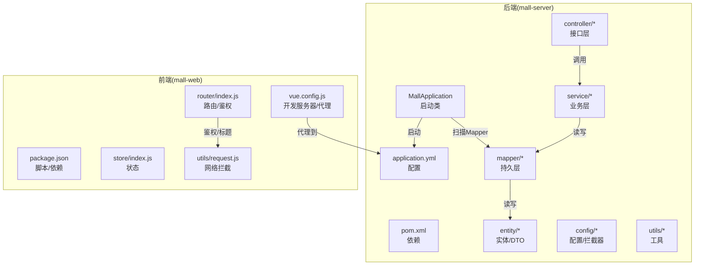
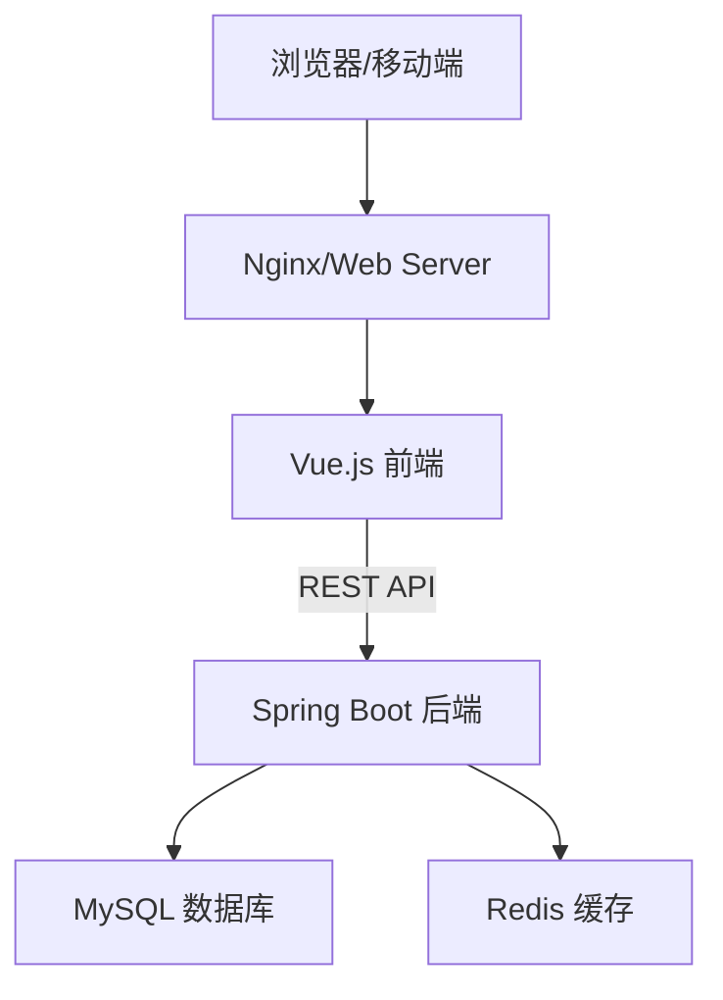
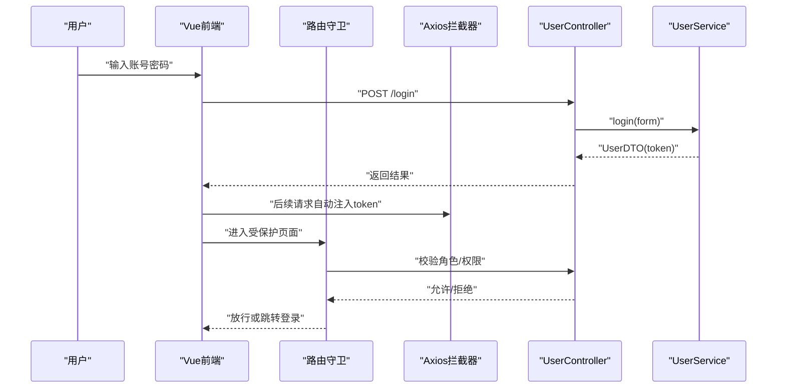
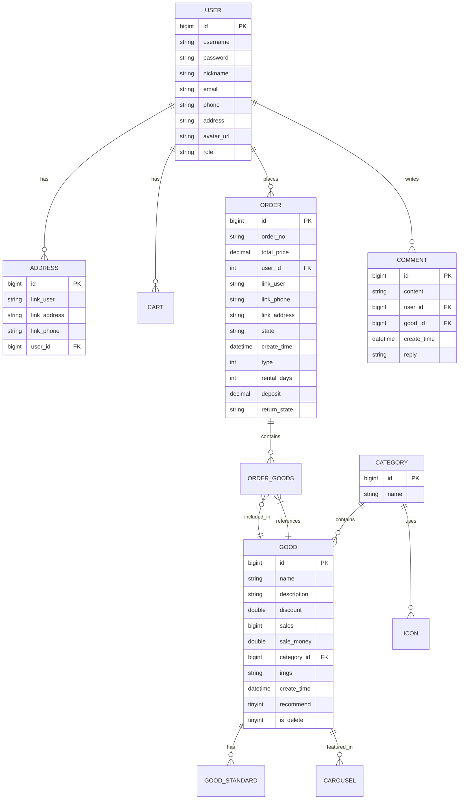
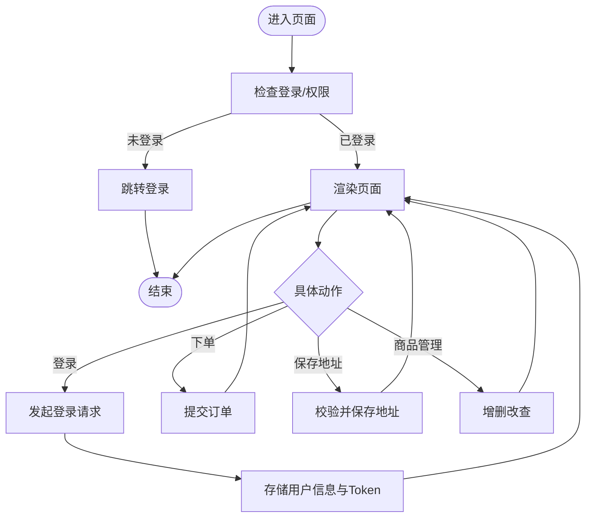
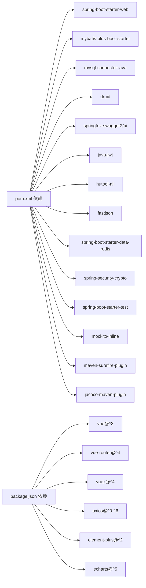

# 开发指南

<cite>
**本文引用的文件**
- [README.md](file://README.md)
- [SYSTEM_DOCUMENTATION.md](file://SYSTEM_DOCUMENTATION.md)
- [PAGE_CODE_DOCUMENTATION.md](file://PAGE_CODE_DOCUMENTATION.md)
- [DATABASE_DESIGN.md](file://DATABASE_DESIGN.md)
- [mall-server/pom.xml](file://mall-server/pom.xml)
- [mall-server/src/main/resources/application.yml](file://mall-server/src/main/resources/application.yml)
- [mall-server/src/main/java/com/rabbiter/em/MallApplication.java](file://mall-server/src/main/java/com/rabbiter/em/MallApplication.java)
- [mall-server/src/main/java/com/rabbiter/em/controller/UserController.java](file://mall-server/src/main/java/com/rabbiter/em/controller/UserController.java)
- [mall-server/src/main/java/com/rabbiter/em/service/UserService.java](file://mall-server/src/main/java/com/rabbiter/em/service/UserService.java)
- [mall-web/package.json](file://mall-web/package.json)
- [mall-web/vue.config.js](file://mall-web/vue.config.js)
- [mall-web/babel.config.js](file://mall-web/babel.config.js)
- [mall-web/src/utils/request.js](file://mall-web/src/utils/request.js)
- [mall-web/src/router/index.js](file://mall-web/src/router/index.js)
- [mall-web/src/store/index.js](file://mall-web/src/store/index.js)
</cite>

## 目录
1. [简介](#简介)
2. [项目结构](#项目结构)
3. [核心组件](#核心组件)
4. [架构总览](#架构总览)
5. [详细组件分析](#详细组件分析)
6. [依赖分析](#依赖分析)
7. [性能考虑](#性能考虑)
8. [故障排查指南](#故障排查指南)
9. [结论](#结论)
10. [附录](#附录)

## 简介
本开发指南面向新老开发者，提供从环境搭建、代码规范、开发流程、项目结构、工具配置、调试与性能分析、重构与优化、团队协作到学习资源与贡献方式的完整实践指引。项目采用前后端分离架构：后端基于 Spring Boot + MyBatis-Plus，前端基于 Vue.js 2 + Element UI，集成 JWT、Redis、Swagger 等技术栈。

## 项目结构
- 后端模块（mall-server）
  - 包结构：com.rabbiter.em.*
  - 主要分层：controller（接口层）、service（业务层）、mapper（持久层）、entity（实体与DTO）、config（配置）、interceptor（拦截器）、utils（工具）、common（通用结果封装）、exception（异常）、constants（常量）
  - 启动类：MallApplication
  - 配置：application.yml（端口、数据库、Redis、文件上传大小、MyBatis驼峰映射等）
  - 依赖：pom.xml（Spring Boot、MyBatis-Plus、MySQL驱动、Druid、Swagger、JWT、Hutool、FastJSON、Redis、BCrypt、Surefire/Jacoco 等）

- 前端模块（mall-web）
  - 源码：src 下 components、views、router、store、utils、resource 等
  - 构建与开发：vue.config.js（端口、代理、页面入口）、package.json（脚本、依赖）、babel.config.js（预设）
  - 路由：router/index.js（前台/后台双入口、鉴权守卫、动态标题）
  - 状态：store/index.js（基础状态）
  - 网络：utils/request.js（Axios 实例、请求/响应拦截、Token 注入、401 统一处理）

**图表来源**
- [mall-server/src/main/java/com/rabbiter/em/MallApplication.java:10-16](file://mall-server/src/main/java/com/rabbiter/em/MallApplication.java#L10-L16)
- [mall-server/src/main/resources/application.yml:1-42](file://mall-server/src/main/resources/application.yml#L1-L42)
- [mall-server/pom.xml:16-118](file://mall-server/pom.xml#L16-L118)
- [mall-web/vue.config.js:4-16](file://mall-web/vue.config.js#L4-L16)
- [mall-web/src/router/index.js:79-161](file://mall-web/src/router/index.js#L79-L161)
- [mall-web/src/utils/request.js:5-55](file://mall-web/src/utils/request.js#L5-L55)

**章节来源**
- [README.md:33-76](file://README.md#L33-L76)
- [SYSTEM_DOCUMENTATION.md:82-91](file://SYSTEM_DOCUMENTATION.md#L82-L91)

## 核心组件
- 后端启动与配置
  - 启动类：扫描 Mapper 包，启动 Spring Boot 应用
  - 配置要点：端口、数据库连接（支持环境变量）、Redis 连接、文件上传大小、MyBatis 驼峰映射
  - 依赖要点：Spring Web、MyBatis-Plus、MySQL 驱动、Druid、Swagger、JWT、Hutool、FastJSON、Redis、BCrypt、Surefire/Jacoco

- 前端构建与开发
  - 开发服务器：端口 9192，代理到后端 9191
  - 脚本：dev/serve/build
  - 依赖：Vue 3、Vue Router 4、Vuex 4、Element Plus、Axios、ECharts 等

- 路由与鉴权
  - 前台/后台双入口，meta 控制 requireAuth/requireLogin
  - beforeEach 钩子：本地 token 校验、后端角色校验、401 统一跳转登录

- 网络层
  - Axios 实例：统一 Content-Type、注入 token、401 统一处理、Blob 文件类型兼容

**章节来源**
- [mall-server/src/main/java/com/rabbiter/em/MallApplication.java:8-16](file://mall-server/src/main/java/com/rabbiter/em/MallApplication.java#L8-L16)
- [mall-server/src/main/resources/application.yml:1-42](file://mall-server/src/main/resources/application.yml#L1-L42)
- [mall-server/pom.xml:16-118](file://mall-server/pom.xml#L16-L118)
- [mall-web/vue.config.js:4-16](file://mall-web/vue.config.js#L4-L16)
- [mall-web/package.json:5-9](file://mall-web/package.json#L5-L9)
- [mall-web/src/router/index.js:84-150](file://mall-web/src/router/index.js#L84-L150)
- [mall-web/src/utils/request.js:13-50](file://mall-web/src/utils/request.js#L13-L50)

## 架构总览
系统采用前后端分离架构，前端通过 Axios 发起 REST 请求，经 Nginx/反向代理转发至后端 Spring Boot 服务；后端使用 MyBatis-Plus 访问 MySQL，使用 Redis 缓存热点数据与 Token；Swagger 提供接口文档能力。

**图表来源**
- [SYSTEM_DOCUMENTATION.md:13-20](file://SYSTEM_DOCUMENTATION.md#L13-L20)

## 详细组件分析

### 用户登录与鉴权流程
- 前端
  - 登录页发起登录请求，成功后将用户信息与 token 写入 localStorage
  - 请求拦截器自动注入 token 到请求头
  - 响应拦截器统一处理 401，清空本地用户信息并跳转登录
- 后端
  - UserController 提供 /login、/register、/userinfo/{username} 等接口
  - UserService 校验用户名/密码，生成 JWT 并写入 Redis，返回 DTO
  - 前端路由守卫根据 meta.requireAuth/requireLogin 控制访问

**图表来源**
- [mall-web/src/utils/request.js:13-50](file://mall-web/src/utils/request.js#L13-L50)
- [mall-web/src/router/index.js:84-150](file://mall-web/src/router/index.js#L84-L150)
- [mall-server/src/main/java/com/rabbiter/em/controller/UserController.java:37-68](file://mall-server/src/main/java/com/rabbiter/em/controller/UserController.java#L37-L68)
- [mall-server/src/main/java/com/rabbiter/em/service/UserService.java:44-75](file://mall-server/src/main/java/com/rabbiter/em/service/UserService.java#L44-L75)

**章节来源**
- [PAGE_CODE_DOCUMENTATION.md:3-23](file://PAGE_CODE_DOCUMENTATION.md#L3-L23)
- [mall-web/src/utils/request.js:13-50](file://mall-web/src/utils/request.js#L13-L50)
- [mall-web/src/router/index.js:84-150](file://mall-web/src/router/index.js#L84-L150)
- [mall-server/src/main/java/com/rabbiter/em/controller/UserController.java:37-68](file://mall-server/src/main/java/com/rabbiter/em/controller/UserController.java#L37-L68)
- [mall-server/src/main/java/com/rabbiter/em/service/UserService.java:44-75](file://mall-server/src/main/java/com/rabbiter/em/service/UserService.java#L44-L75)

### 数据模型与关系
- ER 图展示了用户、地址、商品、分类、订单、评论、购物车、轮播图等实体关系
- 表结构定义了字段、类型、约束与说明，便于前后端对接与数据库维护

**图表来源**
- [DATABASE_DESIGN.md:5-83](file://DATABASE_DESIGN.md#L5-L83)

**章节来源**
- [DATABASE_DESIGN.md:85-223](file://DATABASE_DESIGN.md#L85-L223)

### 页面关键交互与数据流
- 登录页：表单校验、登录请求、本地存储用户信息
- 商品详情页：传递商品、价格、数量、规格到下单页
- 确认订单页：提交订单，携带收货地址与商品明细
- 地址管理页：手机号校验与保存
- 后台商品管理：管理员 CRUD 操作

**图表来源**
- [PAGE_CODE_DOCUMENTATION.md:3-98](file://PAGE_CODE_DOCUMENTATION.md#L3-L98)
- [mall-web/src/router/index.js:84-150](file://mall-web/src/router/index.js#L84-L150)

**章节来源**
- [PAGE_CODE_DOCUMENTATION.md:3-98](file://PAGE_CODE_DOCUMENTATION.md#L3-L98)

## 依赖分析
- 后端依赖
  - Web：Spring MVC
  - ORM：MyBatis-Plus
  - 数据库：MySQL Connector/J
  - 连接池：Druid
  - 文档：Swagger
  - 安全：JWT、BCrypt
  - 工具：Hutool、FastJSON
  - 缓存：Redis
  - 测试：JUnit、Mockito、Surefire、Jacoco
- 前端依赖
  - Vue 3、Vue Router 4、Vuex 4、Element Plus
  - Axios、ECharts
  - CLI 插件：Babel、Router、Vuex

**图表来源**
- [mall-server/pom.xml:19-118](file://mall-server/pom.xml#L19-L118)
- [mall-web/package.json:10-25](file://mall-web/package.json#L10-L25)

**章节来源**
- [mall-server/pom.xml:19-118](file://mall-server/pom.xml#L19-L118)
- [mall-web/package.json:10-25](file://mall-web/package.json#L10-L25)

## 性能考虑
- 后端
  - 使用 MyBatis-Plus 减少重复 SQL，合理分页与条件查询
  - Redis 缓存热点数据与 Token，降低数据库压力
  - Druid 连接池监控与慢查询分析
  - 启用压缩与合理的超时配置
- 前端
  - 按需加载组件与路由懒加载
  - 合理使用缓存与防抖节流
  - 图表按需渲染，避免一次性渲染大量数据
- 测试与覆盖率
  - Surefire 跳过测试可配置，Jacoco 生成覆盖率报告，建议在 CI 中开启

**章节来源**
- [mall-server/pom.xml:144-182](file://mall-server/pom.xml#L144-L182)
- [mall-server/src/main/resources/application.yml:20-33](file://mall-server/src/main/resources/application.yml#L20-L33)

## 故障排查指南
- 端口冲突
  - 后端默认 9191，前端默认 9192，可在各自配置中调整
- 数据库连接
  - 确认 DB_HOST/DB_PORT/DB_NAME/DB_USER/DB_PASS 环境变量或 application.yml 配置
  - 检查时区 serverTimezone=Asia/Shanghai
- Redis 连接
  - 确认 REDIS_HOST/REDIS_PORT/REDIS_PASS 环境变量或 application.yml 配置
- 文件上传
  - 检查 application.yml 中 multipart.max-file-size 配置
- Token/验证码无效
  - 检查 Redis 服务状态与 Token 存储键前缀
- 前端跨域与代理
  - vue.config.js 中 devServer.proxy 配置是否指向后端 9191
- 登录状态异常
  - 响应拦截器会处理 401，检查本地 localStorage 中 user 与 token

**章节来源**
- [README.md:38-47](file://README.md#L38-L47)
- [README.md:48-52](file://README.md#L48-L52)
- [SYSTEM_DOCUMENTATION.md:95-102](file://SYSTEM_DOCUMENTATION.md#L95-L102)
- [mall-server/src/main/resources/application.yml:11-26](file://mall-server/src/main/resources/application.yml#L11-L26)
- [mall-web/vue.config.js:4-16](file://mall-web/vue.config.js#L4-L16)
- [mall-web/src/utils/request.js:37-44](file://mall-web/src/utils/request.js#L37-L44)

## 结论
本指南提供了从环境搭建到日常开发、测试、调试与协作的全流程实践建议。建议团队在开发过程中严格遵循本文的代码规范与流程规范，持续优化性能与稳定性，并通过文档与知识分享提升整体开发效率。

## 附录

### 代码规范与命名约定
- Java 后端
  - 包名：com.rabbiter.em.*
  - 类命名：PascalCase；接口以 I 开头或抽象类以 Abstract 开头
  - 方法命名：camelCase；常量：UPPER_SNAKE_CASE
  - 控制器：统一返回 Result<T>；异常：自定义 ServiceException
  - 配置类：按功能分层（CorsConfig、EncodingConfig、InterceptorConfig、MybatisPlusConfig、RedisConfig、SwaggerConfig）
  - 日志：使用统一异常处理器 GlobalExceptionHandler
- Vue.js 前端
  - 组件：PascalCase；文件名与组件名一致
  - 路由：命名与页面职责一致；meta.title 用于动态标题
  - 状态：Vuex store 简化使用，避免过度嵌套
  - 工具：request.js 统一拦截器，避免分散的请求处理
  - 命名：props、事件、方法语义化，避免缩写

### 开发流程与工作流管理
- 分支策略
  - develop：主开发分支
  - feature/*：功能开发分支
  - release/*：预发布分支
  - hotfix/*：紧急修复分支
- 提交规范
  - 类型：feat、fix、docs、style、refactor、test、chore
  - 示例：feat(user): 添加用户注册接口
- 代码审查
  - PR 必须包含需求说明、变更点、测试用例与风险评估
  - 至少一名 reviewer 通过并解决评论后再合并

### 项目结构与模块划分原则
- 后端按层次划分：controller → service → mapper → entity，清晰职责边界
- 前端按功能划分：views（页面）、components（可复用组件）、router/store/utils/resource
- 配置集中管理：application.yml、vue.config.js、babel.config.js

### 常用开发工具与插件
- 后端
  - IDE：启用 Lombok/MapStruct/MyBatis 日志
  - Postman/Thunder Client：接口测试
  - Swagger UI：接口文档
  - Redis Desktop Manager：Redis 可视化
- 前端
  - VSCode：ESLint/Prettier/Vetur/Debugger for Chrome
  - Vue Devtools：调试 Vue 组件
  - Axios Devtools：调试请求

### 调试技巧与问题排查
- 断点调试：后端使用 IDE 断点；前端使用浏览器断点与 Vue Devtools
- 日志分析：开启 Spring 日志与 Druid 监控
- 性能分析：后端使用 Micrometer/Actuator；前端使用 Performance 面板
- 网络问题：检查代理、CORS、Token 注入与 401 处理

### 重构与优化
- 时机：重复代码、复杂分支、性能瓶颈、可读性差
- 方法：提取方法、拆分类、引入策略/工厂模式、缓存热点数据
- 验证：单元测试、集成测试、性能回归测试

### 团队协作最佳实践
- 任务分配：明确 Owner 与 Reviewer
- 进度跟踪：每日站会、看板可视化、里程碑评审
- 知识分享：文档同步、Code Review、技术分享会

### 学习资源与技能提升
- 后端：Spring 官方文档、MyBatis-Plus、JWT、Redis
- 前端：Vue 3 官方文档、Element Plus、Vue Router、Vuex
- 工具：Postman、VSCode 插件生态、Git 分支管理

### 项目贡献与开源协作
- Fork 仓库，创建 feature 分支，提交 PR
- 遵循提交规范与代码风格
- 提供测试用例与变更说明

### 常见开发陷阱与避免方法
- 忽视安全：密码加密、SQL 注入防护、XSS/CSRF 防护
- 忽视异常：完善异常处理与降级策略
- 忽视性能：避免 N+1 查询、滥用全局状态、无节制渲染
- 忽视测试：单元测试、接口测试、集成测试缺一不可