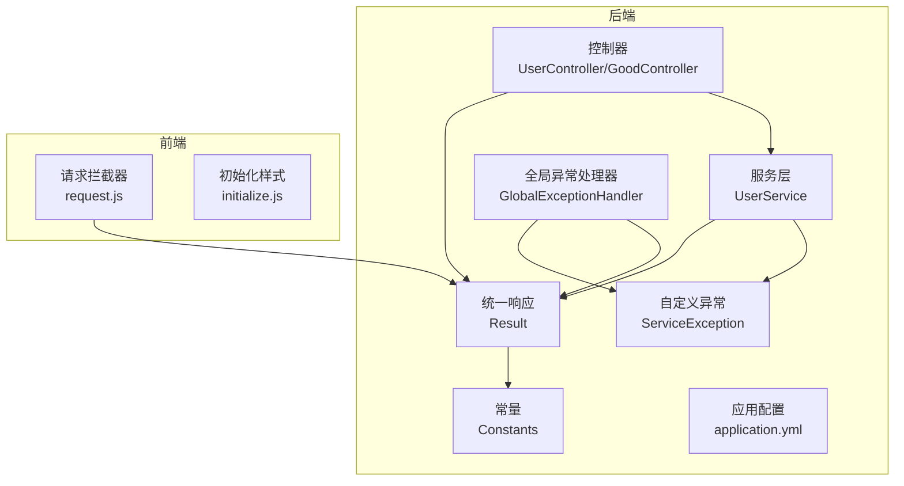
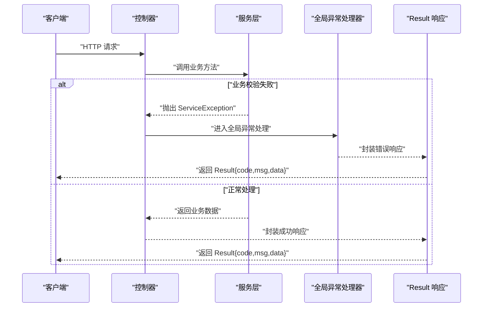
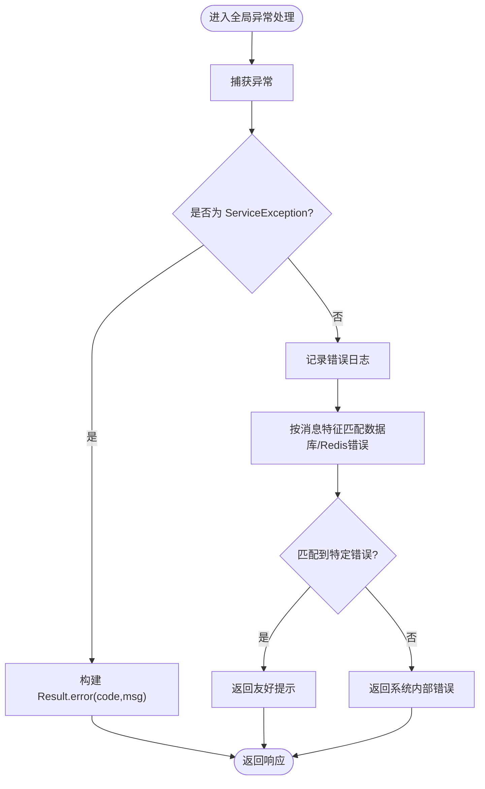
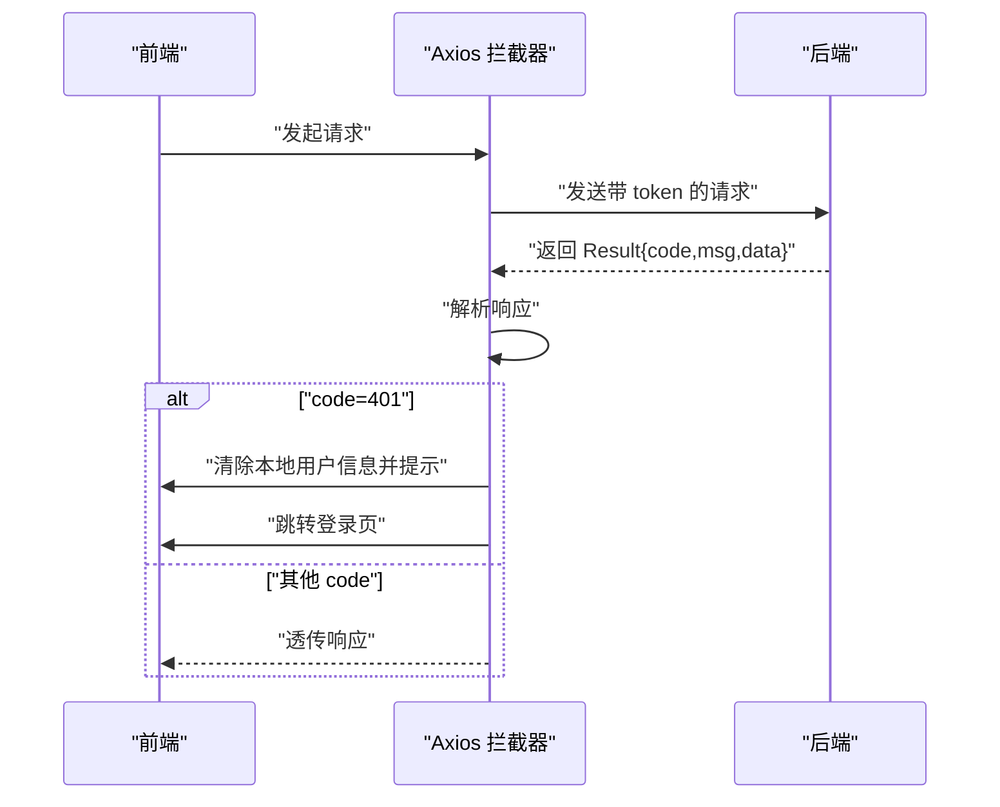
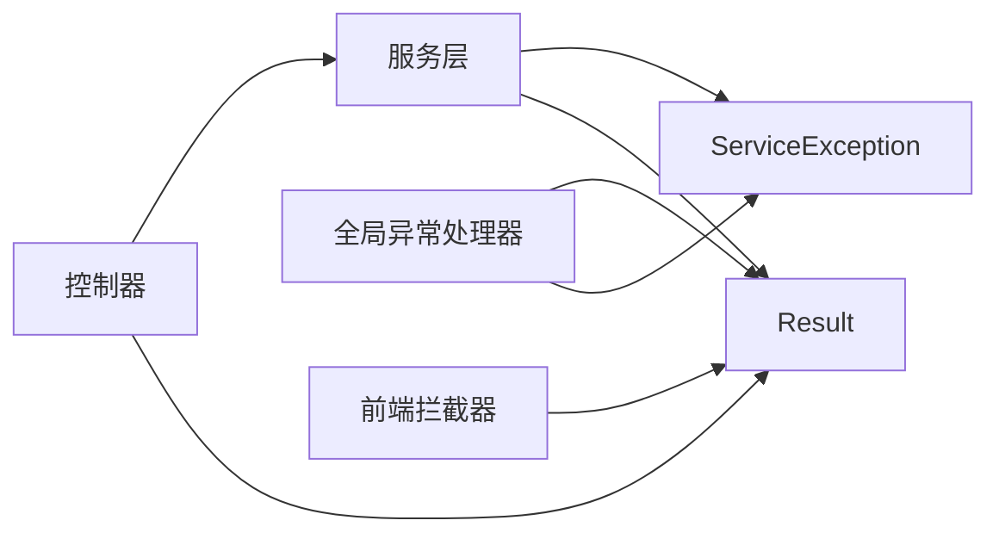

# 异常处理

<cite>
**本文引用的文件**
- [mall-server/src/main/java/com/rabbiter/em/common/Result.java](file://mall-server/src/main/java/com/rabbiter/em/common/Result.java)
- [mall-server/src/main/java/com/rabbiter/em/config/GlobalExceptionHandler.java](file://mall-server/src/main/java/com/rabbiter/em/config/GlobalExceptionHandler.java)
- [mall-server/src/main/java/com/rabbiter/em/exception/ServiceException.java](file://mall-server/src/main/java/com/rabbiter/em/exception/ServiceException.java)
- [mall-server/src/main/java/com/rabbiter/em/constants/Constants.java](file://mall-server/src/main/java/com/rabbiter/em/constants/Constants.java)
- [mall-server/src/main/java/com/rabbiter/em/controller/UserController.java](file://mall-server/src/main/java/com/rabbiter/em/controller/UserController.java)
- [mall-server/src/main/java/com/rabbiter/em/controller/GoodController.java](file://mall-server/src/main/java/com/rabbiter/em/controller/GoodController.java)
- [mall-server/src/main/java/com/rabbiter/em/service/UserService.java](file://mall-server/src/main/java/com/rabbiter/em/service/UserService.java)
- [mall-server/src/main/resources/application.yml](file://mall-server/src/main/resources/application.yml)
- [mall-web/src/utils/request.js](file://mall-web/src/utils/request.js)
- [mall-web/src/utils/initialize.js](file://mall-web/src/utils/initialize.js)
- [mall-server/src/test/java/com/rabbiter/em/controller/GoodControllerTest.java](file://mall-server/src/test/java/com/rabbiter/em/controller/GoodControllerTest.java)
- [mall-server/src/test/java/com/rabbiter/em/service/UserServiceTest.java](file://mall-server/src/test/java/com/rabbiter/em/service/UserServiceTest.java)
</cite>

## 目录
1. [简介](#简介)
2. [项目结构](#项目结构)
3. [核心组件](#核心组件)
4. [架构总览](#架构总览)
5. [详细组件分析](#详细组件分析)
6. [依赖分析](#依赖分析)
7. [性能考量](#性能考量)
8. [故障排查指南](#故障排查指南)
9. [结论](#结论)
10. [附录](#附录)

## 简介
本文件系统化梳理 cosplay 商城系统的异常处理机制与错误管理策略，覆盖以下要点：
- 全局异常处理器的实现与分类处理
- 自定义业务异常 ServiceException 的设计与使用
- 统一响应包装类 Result 的结构与使用规范
- 常见异常场景的处理方案与最佳实践
- 前端错误处理策略与用户体验优化
- 异常监控与告警建议
- 性能与资源管理注意事项
- 测试策略与验证方法

## 项目结构
围绕异常处理的关键模块分布如下：
- 后端 Spring Boot 层
  - 统一响应包装 Result
  - 全局异常处理器 GlobalExceptionHandler
  - 自定义业务异常 ServiceException
  - 常量 Constants（错误码）
  - 控制器层（UserController、GoodController）示例
  - 服务层（UserService）中抛出 ServiceException 的示例
  - 应用配置 application.yml
- 前端 Vue 层
  - 请求拦截器 request.js（统一错误处理与跳转）
  - 初始化样式 initialize.js（无关异常处理，但影响界面）

图表来源
- [mall-server/src/main/java/com/rabbiter/em/common/Result.java:1-66](file://mall-server/src/main/java/com/rabbiter/em/common/Result.java#L1-L66)
- [mall-server/src/main/java/com/rabbiter/em/config/GlobalExceptionHandler.java:1-45](file://mall-server/src/main/java/com/rabbiter/em/config/GlobalExceptionHandler.java#L1-L45)
- [mall-server/src/main/java/com/rabbiter/em/exception/ServiceException.java:1-18](file://mall-server/src/main/java/com/rabbiter/em/exception/ServiceException.java#L1-L18)
- [mall-server/src/main/java/com/rabbiter/em/constants/Constants.java:1-16](file://mall-server/src/main/java/com/rabbiter/em/constants/Constants.java#L1-L16)
- [mall-server/src/main/java/com/rabbiter/em/controller/UserController.java:1-179](file://mall-server/src/main/java/com/rabbiter/em/controller/UserController.java#L1-L179)
- [mall-server/src/main/java/com/rabbiter/em/controller/GoodController.java:1-209](file://mall-server/src/main/java/com/rabbiter/em/controller/GoodController.java#L1-L209)
- [mall-server/src/main/java/com/rabbiter/em/service/UserService.java:1-155](file://mall-server/src/main/java/com/rabbiter/em/service/UserService.java#L1-L155)
- [mall-server/src/main/resources/application.yml:1-42](file://mall-server/src/main/resources/application.yml#L1-L42)
- [mall-web/src/utils/request.js:1-55](file://mall-web/src/utils/request.js#L1-L55)
- [mall-web/src/utils/initialize.js:1-217](file://mall-web/src/utils/initialize.js#L1-L217)

章节来源
- [mall-server/src/main/java/com/rabbiter/em/common/Result.java:1-66](file://mall-server/src/main/java/com/rabbiter/em/common/Result.java#L1-L66)
- [mall-server/src/main/java/com/rabbiter/em/config/GlobalExceptionHandler.java:1-45](file://mall-server/src/main/java/com/rabbiter/em/config/GlobalExceptionHandler.java#L1-L45)
- [mall-server/src/main/java/com/rabbiter/em/exception/ServiceException.java:1-18](file://mall-server/src/main/java/com/rabbiter/em/exception/ServiceException.java#L1-L18)
- [mall-server/src/main/java/com/rabbiter/em/constants/Constants.java:1-16](file://mall-server/src/main/java/com/rabbiter/em/constants/Constants.java#L1-L16)
- [mall-server/src/main/java/com/rabbiter/em/controller/UserController.java:1-179](file://mall-server/src/main/java/com/rabbiter/em/controller/UserController.java#L1-L179)
- [mall-server/src/main/java/com/rabbiter/em/controller/GoodController.java:1-209](file://mall-server/src/main/java/com/rabbiter/em/controller/GoodController.java#L1-L209)
- [mall-server/src/main/java/com/rabbiter/em/service/UserService.java:1-155](file://mall-server/src/main/java/com/rabbiter/em/service/UserService.java#L1-L155)
- [mall-server/src/main/resources/application.yml:1-42](file://mall-server/src/main/resources/application.yml#L1-L42)
- [mall-web/src/utils/request.js:1-55](file://mall-web/src/utils/request.js#L1-L55)
- [mall-web/src/utils/initialize.js:1-217](file://mall-web/src/utils/initialize.js#L1-L217)

## 核心组件
- 统一响应包装类 Result
  - 提供成功与错误两类静态构造方法，并支持链式设置 code/message/data
  - 与 Constants 中的错误码常量配合使用
- 全局异常处理器 GlobalExceptionHandler
  - 使用 @ControllerAdvice + @ExceptionHandler 实现全局捕获
  - 对 ServiceException 进行业务异常映射；对通用 Exception 做兜底并进行部分数据库/Redis连接错误的友好提示
- 自定义业务异常 ServiceException
  - 继承 RuntimeException，携带业务错误码与消息
  - 在服务层用于表达可预期的业务失败
- 常量 Constants
  - 定义标准错误码（如 200 成功、500 系统错误、401/403 权限相关等）
- 控制器与服务层示例
  - 控制器通过 Result 返回统一格式
  - 服务层在业务校验失败时抛出 ServiceException
- 前端拦截器 request.js
  - 统一处理响应中的错误码（如 401），触发登出与跳转逻辑

章节来源
- [mall-server/src/main/java/com/rabbiter/em/common/Result.java:1-66](file://mall-server/src/main/java/com/rabbiter/em/common/Result.java#L1-L66)
- [mall-server/src/main/java/com/rabbiter/em/config/GlobalExceptionHandler.java:1-45](file://mall-server/src/main/java/com/rabbiter/em/config/GlobalExceptionHandler.java#L1-L45)
- [mall-server/src/main/java/com/rabbiter/em/exception/ServiceException.java:1-18](file://mall-server/src/main/java/com/rabbiter/em/exception/ServiceException.java#L1-L18)
- [mall-server/src/main/java/com/rabbiter/em/constants/Constants.java:1-16](file://mall-server/src/main/java/com/rabbiter/em/constants/Constants.java#L1-L16)
- [mall-server/src/main/java/com/rabbiter/em/controller/UserController.java:1-179](file://mall-server/src/main/java/com/rabbiter/em/controller/UserController.java#L1-L179)
- [mall-server/src/main/java/com/rabbiter/em/controller/GoodController.java:1-209](file://mall-server/src/main/java/com/rabbiter/em/controller/GoodController.java#L1-L209)
- [mall-server/src/main/java/com/rabbiter/em/service/UserService.java:1-155](file://mall-server/src/main/java/com/rabbiter/em/service/UserService.java#L1-L155)
- [mall-web/src/utils/request.js:1-55](file://mall-web/src/utils/request.js#L1-L55)

## 架构总览
后端采用“控制器-服务层-异常处理”的分层架构，前端通过 Axios 拦截器统一消费后端 Result 格式。

图表来源
- [mall-server/src/main/java/com/rabbiter/em/controller/UserController.java:1-179](file://mall-server/src/main/java/com/rabbiter/em/controller/UserController.java#L1-L179)
- [mall-server/src/main/java/com/rabbiter/em/service/UserService.java:1-155](file://mall-server/src/main/java/com/rabbiter/em/service/UserService.java#L1-L155)
- [mall-server/src/main/java/com/rabbiter/em/config/GlobalExceptionHandler.java:1-45](file://mall-server/src/main/java/com/rabbiter/em/config/GlobalExceptionHandler.java#L1-L45)
- [mall-server/src/main/java/com/rabbiter/em/common/Result.java:1-66](file://mall-server/src/main/java/com/rabbiter/em/common/Result.java#L1-L66)

## 详细组件分析

### 组件一：统一响应包装类 Result
- 设计目标
  - 统一前后端交互的数据结构，便于前端一致化处理
  - 支持成功与错误两种形态，错误形态可携带业务码与消息
- 关键点
  - 成功：Result.success()/success(data)
  - 错误：Result.error()/error(code,msg)
  - 与 Constants 中的错误码常量配合，确保一致性
- 使用建议
  - 控制器层优先使用 Result.success()/error() 返回
  - 服务层内部尽量抛出 ServiceException，由全局处理器统一转换为 Result

章节来源
- [mall-server/src/main/java/com/rabbiter/em/common/Result.java:1-66](file://mall-server/src/main/java/com/rabbiter/em/common/Result.java#L1-L66)
- [mall-server/src/main/java/com/rabbiter/em/constants/Constants.java:1-16](file://mall-server/src/main/java/com/rabbiter/em/constants/Constants.java#L1-L16)

### 组件二：全局异常处理器 GlobalExceptionHandler
- 职责
  - 捕获 ServiceException 并映射为 Result.error(code,msg)
  - 捕获通用异常 Exception，记录日志并返回系统错误提示
  - 对数据库/Redis连接类错误做特定友好提示
- 处理流程
  - 记录错误日志
  - 基于异常消息特征匹配，返回用户可读的提示
  - 默认兜底为“系统内部错误”

图表来源
- [mall-server/src/main/java/com/rabbiter/em/config/GlobalExceptionHandler.java:1-45](file://mall-server/src/main/java/com/rabbiter/em/config/GlobalExceptionHandler.java#L1-L45)

章节来源
- [mall-server/src/main/java/com/rabbiter/em/config/GlobalExceptionHandler.java:1-45](file://mall-server/src/main/java/com/rabbiter/em/config/GlobalExceptionHandler.java#L1-L45)

### 组件三：自定义业务异常 ServiceException
- 设计
  - 继承 RuntimeException，携带业务码与消息
  - 服务层在业务校验失败时抛出，如用户名不存在、密码强度不合法、权限不足等
- 与控制器/服务层协作
  - 控制器层不直接抛异常，而是接收服务层抛出的 ServiceException，交由全局处理器统一转换
  - 服务层内部可直接返回 Result.error(...)，也可抛出 ServiceException，视场景而定

章节来源
- [mall-server/src/main/java/com/rabbiter/em/exception/ServiceException.java:1-18](file://mall-server/src/main/java/com/rabbiter/em/exception/ServiceException.java#L1-L18)
- [mall-server/src/main/java/com/rabbiter/em/service/UserService.java:1-155](file://mall-server/src/main/java/com/rabbiter/em/service/UserService.java#L1-L155)

### 组件四：控制器与服务层中的异常处理实践
- 控制器层
  - 通过 Result.success()/error() 返回统一格式
  - 示例：UserController/GoodController 中大量使用 Result
- 服务层
  - 在业务校验失败时抛出 ServiceException
  - 示例：UserService 中多处对用户名、密码、权限等进行校验并抛出异常

章节来源
- [mall-server/src/main/java/com/rabbiter/em/controller/UserController.java:1-179](file://mall-server/src/main/java/com/rabbiter/em/controller/UserController.java#L1-L179)
- [mall-server/src/main/java/com/rabbiter/em/controller/GoodController.java:1-209](file://mall-server/src/main/java/com/rabbiter/em/controller/GoodController.java#L1-L209)
- [mall-server/src/main/java/com/rabbiter/em/service/UserService.java:1-155](file://mall-server/src/main/java/com/rabbiter/em/service/UserService.java#L1-L155)

### 组件五：前端错误处理策略与用户体验优化
- 请求拦截器 request.js
  - 统一设置 Content-Type 与 token
  - 统一解析响应，识别 code=401 时清除本地用户信息并弹框提示，随后跳转至登录页
- 初始化样式 initialize.js
  - 与异常处理无直接关系，但负责注入图标字体等基础样式

图表来源
- [mall-web/src/utils/request.js:1-55](file://mall-web/src/utils/request.js#L1-L55)

章节来源
- [mall-web/src/utils/request.js:1-55](file://mall-web/src/utils/request.js#L1-L55)
- [mall-web/src/utils/initialize.js:1-217](file://mall-web/src/utils/initialize.js#L1-L217)

## 依赖分析
- 组件耦合
  - 控制器依赖 Result 与服务层
  - 服务层依赖 ServiceException 与 Mapper/Redis 等基础设施
  - 全局异常处理器依赖 Result 与 ServiceException
  - 前端拦截器依赖后端 Result 的约定字段
- 外部依赖
  - 数据库连接、Redis 连接错误在全局处理器中有针对性提示
  - 日志记录通过 SLF4J 输出

图表来源
- [mall-server/src/main/java/com/rabbiter/em/controller/UserController.java:1-179](file://mall-server/src/main/java/com/rabbiter/em/controller/UserController.java#L1-L179)
- [mall-server/src/main/java/com/rabbiter/em/service/UserService.java:1-155](file://mall-server/src/main/java/com/rabbiter/em/service/UserService.java#L1-L155)
- [mall-server/src/main/java/com/rabbiter/em/config/GlobalExceptionHandler.java:1-45](file://mall-server/src/main/java/com/rabbiter/em/config/GlobalExceptionHandler.java#L1-L45)
- [mall-server/src/main/java/com/rabbiter/em/common/Result.java:1-66](file://mall-server/src/main/java/com/rabbiter/em/common/Result.java#L1-L66)
- [mall-web/src/utils/request.js:1-55](file://mall-web/src/utils/request.js#L1-L55)

章节来源
- [mall-server/src/main/java/com/rabbiter/em/controller/UserController.java:1-179](file://mall-server/src/main/java/com/rabbiter/em/controller/UserController.java#L1-L179)
- [mall-server/src/main/java/com/rabbiter/em/service/UserService.java:1-155](file://mall-server/src/main/java/com/rabbiter/em/service/UserService.java#L1-L155)
- [mall-server/src/main/java/com/rabbiter/em/config/GlobalExceptionHandler.java:1-45](file://mall-server/src/main/java/com/rabbiter/em/config/GlobalExceptionHandler.java#L1-L45)
- [mall-server/src/main/java/com/rabbiter/em/common/Result.java:1-66](file://mall-server/src/main/java/com/rabbiter/em/common/Result.java#L1-L66)
- [mall-web/src/utils/request.js:1-55](file://mall-web/src/utils/request.js#L1-L55)

## 性能考量
- 全局异常处理器仅做轻量级日志记录与消息拼装，避免在异常路径引入重型操作
- 对数据库/Redis连接错误进行快速短路提示，减少后续重试成本
- 建议
  - 将耗时操作（如复杂日志落库）移至异步队列
  - 对频繁发生的异常进行缓存与节流（如前端重复 401 提示）
  - 对热点接口增加限流与熔断，防止雪崩

## 故障排查指南
- 常见问题定位
  - 数据库连接失败：检查 application.yml 中的数据库连接参数与网络连通性
  - Redis 连接失败：检查 Redis 服务状态与连接参数
  - 权限相关错误：确认 token 是否有效、是否过期、是否具备所需权限
- 日志与监控
  - 全局异常处理器会记录异常堆栈，便于定位具体业务点
  - 建议接入统一日志平台与告警系统，对 500 类错误进行实时告警
- 前端体验
  - 401 时自动清空本地用户信息并跳转登录页，避免页面状态异常

章节来源
- [mall-server/src/main/resources/application.yml:1-42](file://mall-server/src/main/resources/application.yml#L1-L42)
- [mall-server/src/main/java/com/rabbiter/em/config/GlobalExceptionHandler.java:1-45](file://mall-server/src/main/java/com/rabbiter/em/config/GlobalExceptionHandler.java#L1-L45)
- [mall-web/src/utils/request.js:1-55](file://mall-web/src/utils/request.js#L1-L55)

## 结论
本系统通过统一响应包装类、全局异常处理器与自定义业务异常，实现了前后端一致化的错误处理与用户体验优化。结合前端拦截器的统一错误处理，能够快速识别并引导用户回到正确流程。建议在现有基础上完善异常监控与告警体系，并持续优化异常路径的性能与可维护性。

## 附录

### 常见异常场景与处理方案
- 用户名不存在/密码错误
  - 服务层抛出 ServiceException（携带 403），全局处理器返回 Result.error(code,msg)
  - 前端收到 403 后提示并允许重新输入
- 密码强度不合法
  - 服务层在注册/改密时校验，不满足规则抛出 ServiceException，返回对应错误码与提示
- 权限不足
  - 控制器标注权限注解，未授权时返回 403 或 401，前端统一处理
- 数据库/Redis 连接失败
  - 全局处理器根据消息特征返回友好提示，避免暴露敏感信息
- 通用系统错误
  - 捕获 Exception 并返回“系统内部错误”，同时记录日志

章节来源
- [mall-server/src/main/java/com/rabbiter/em/service/UserService.java:1-155](file://mall-server/src/main/java/com/rabbiter/em/service/UserService.java#L1-L155)
- [mall-server/src/main/java/com/rabbiter/em/config/GlobalExceptionHandler.java:1-45](file://mall-server/src/main/java/com/rabbiter/em/config/GlobalExceptionHandler.java#L1-L45)
- [mall-web/src/utils/request.js:1-55](file://mall-web/src/utils/request.js#L1-L55)

### 测试策略与验证方法
- 单元测试
  - 使用 Mockito 对控制器与服务层进行打桩，验证 Result 正确返回
  - 验证 ServiceException 抛出与被捕获后的响应结构
- 示例
  - GoodControllerTest：验证 GET /api/good 返回 Result.code=200
  - UserServiceTest：验证登录/注册场景下的异常抛出与断言
- 建议
  - 增加对全局异常处理器的集成测试，模拟真实异常路径
  - 对前端拦截器行为进行端到端测试，确保 401 场景下的跳转与提示

章节来源
- [mall-server/src/test/java/com/rabbiter/em/controller/GoodControllerTest.java:1-85](file://mall-server/src/test/java/com/rabbiter/em/controller/GoodControllerTest.java#L1-L85)
- [mall-server/src/test/java/com/rabbiter/em/service/UserServiceTest.java:1-187](file://mall-server/src/test/java/com/rabbiter/em/service/UserServiceTest.java#L1-L187)