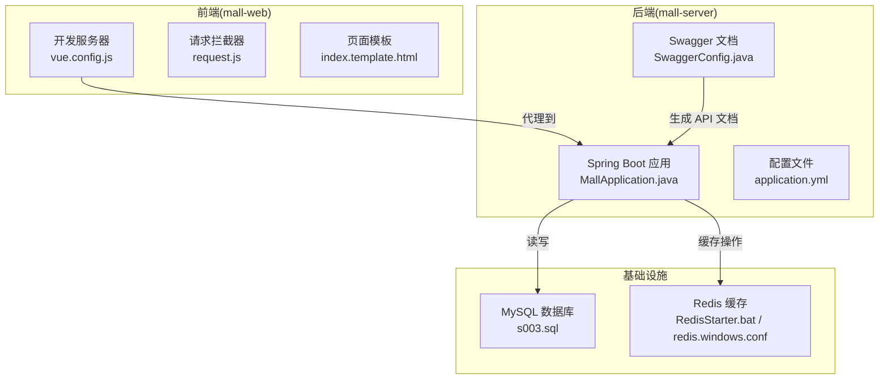
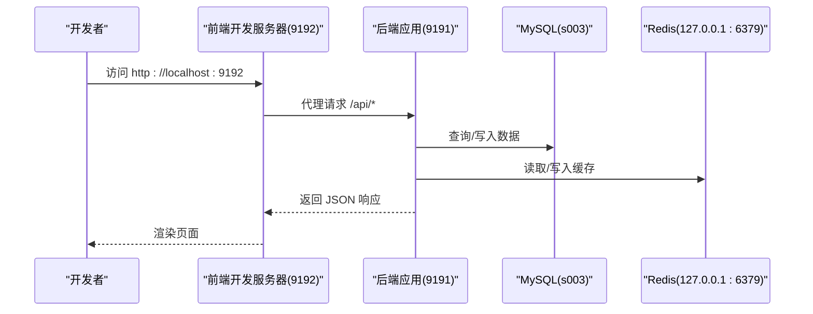
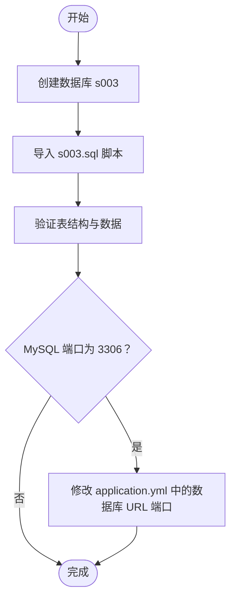
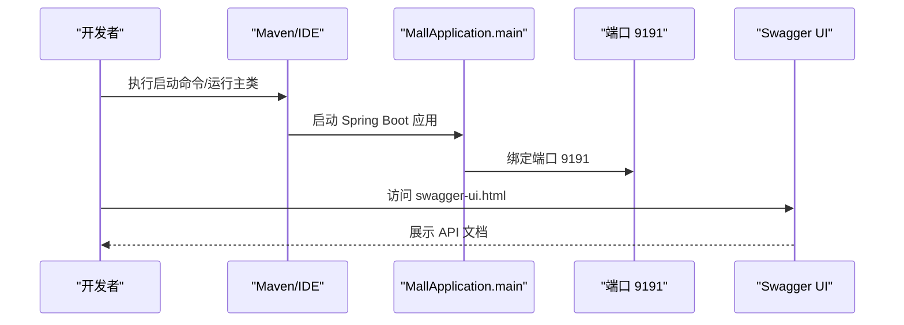
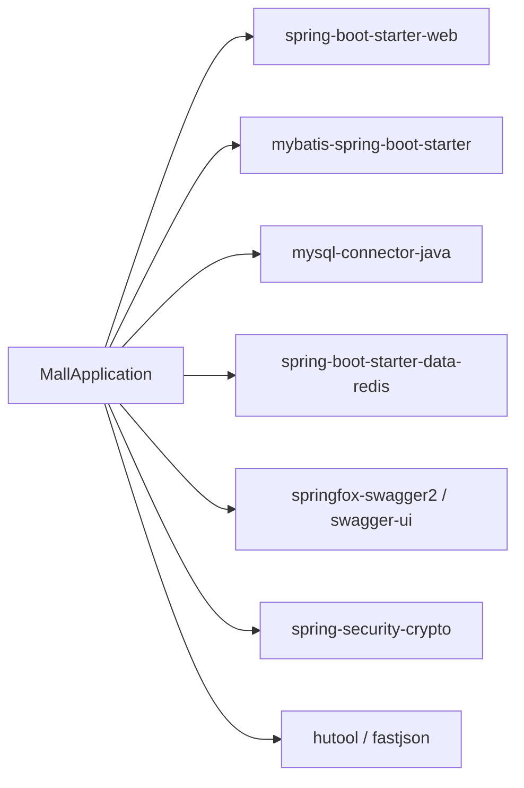

# 快速开始

<cite>
**本文引用的文件列表**
- [README.md](file://README.md)
- [pom.xml](file://mall-server/pom.xml)
- [application.yml](file://mall-server/src/main/resources/application.yml)
- [MallApplication.java](file://mall-server/src/main/java/com/rabbiter/em/MallApplication.java)
- [package.json](file://mall-web/package.json)
- [vue.config.js](file://mall-web/vue.config.js)
- [request.js](file://mall-web/src/utils/request.js)
- [index.template.html](file://mall-web/public/index.template.html)
- [SwaggerConfig.java](file://mall-server/src/main/java/com/rabbiter/em/config/SwaggerConfig.java)
- [RedisStarter.bat](file://redis/RedisStarter.bat)
- [redis.windows.conf](file://redis/redis.windows.conf)
- [s003.sql](file://s003.sql)
</cite>

## 目录
1. [简介](#简介)
2. [项目结构](#项目结构)
3. [核心组件](#核心组件)
4. [架构总览](#架构总览)
5. [详细组件分析](#详细组件分析)
6. [依赖关系分析](#依赖关系分析)
7. [性能与并发特性](#性能与并发特性)
8. [故障排查指南](#故障排查指南)
9. [结论](#结论)
10. [附录](#附录)

## 简介
本指南面向首次接触 coslay 商城系统的开发者，帮助你在约 30 分钟内完成从环境准备到系统完整运行的全流程。你将学会：
- 准备 JDK 1.8、Node.js、MySQL、Redis、Maven 等环境
- 配置数据库（创建 s003 数据库并导入脚本）
- 启动 Redis（Windows 启动脚本或本地服务）
- 启动后端 Spring Boot 应用（Maven 命令或 IDE 直接运行）
- 启动前端 Vue.js 应用
- 访问 API 文档与默认账号信息
- 处理常见环境配置问题

## 项目结构
该仓库采用前后端分离的多模块结构：
- mall-server：后端 Spring Boot 应用，提供 REST API、数据库访问、缓存、认证等能力
- mall-web：前端 Vue.js 应用，通过代理访问后端 API
- redis：Windows 版 Redis 服务脚本与配置
- s003.sql：数据库初始化脚本

**图表来源**
- [MallApplication.java:10-14](file://mall-server/src/main/java/com/rabbiter/em/MallApplication.java#L10-L14)
- [application.yml:1-42](file://mall-server/src/main/resources/application.yml#L1-L42)
- [SwaggerConfig.java:15-31](file://mall-server/src/main/java/com/rabbiter/em/config/SwaggerConfig.java#L15-L31)
- [vue.config.js:4-16](file://mall-web/vue.config.js#L4-L16)
- [request.js:1-55](file://mall-web/src/utils/request.js#L1-L55)
- [index.template.html:1-24](file://mall-web/public/index.template.html#L1-L24)
- [RedisStarter.bat:1-1](file://redis/RedisStarter.bat#L1-L1)
- [redis.windows.conf:39-41](file://redis/redis.windows.conf#L39-L41)
- [s003.sql:20-22](file://s003.sql#L20-L22)

**章节来源**
- [README.md:84-93](file://README.md#L84-L93)

## 核心组件
- 后端技术栈：Spring Boot 2.5.6、MyBatis Plus、MySQL、Redis、JWT、Swagger
- 前端技术栈：Vue.js 3、Element Plus、Axios、Vue Router、Vuex
- 开发端口：后端 9191、前端 9192
- 默认数据库：s003；默认账号：管理员 admin/123456、用户 user/123456

**章节来源**
- [README.md:5-31](file://README.md#L5-L31)
- [pom.xml:16-18](file://mall-server/pom.xml#L16-L18)
- [application.yml:1-42](file://mall-server/src/main/resources/application.yml#L1-L42)
- [package.json:10-25](file://mall-web/package.json#L10-L25)

## 架构总览
系统采用前后端分离架构，前端通过本地代理访问后端 API，后端负责业务逻辑、数据持久化与缓存交互。

**图表来源**
- [vue.config.js:4-16](file://mall-web/vue.config.js#L4-L16)
- [request.js:1-55](file://mall-web/src/utils/request.js#L1-L55)
- [application.yml:1-42](file://mall-server/src/main/resources/application.yml#L1-L42)

## 详细组件分析

### 环境准备与版本要求
- JDK 1.8：用于编译与运行 Spring Boot 应用
- Node.js：推荐 v14+，用于构建与运行 Vue.js 前端
- MySQL：支持 5.7/8.0，默认连接 3309 端口（可在配置中调整）
- Redis：默认 127.0.0.1:6379，可使用提供的 Windows 启动脚本
- Maven：用于后端打包与运行

**章节来源**
- [README.md:24-31](file://README.md#L24-L31)
- [pom.xml:16-18](file://mall-server/pom.xml#L16-L18)
- [application.yml:11-26](file://mall-server/src/main/resources/application.yml#L11-L26)

### 数据库配置（MySQL）
- 创建数据库：执行数据库初始化脚本 s003.sql，自动创建 s003 数据库并导入表结构与示例数据
- 端口与凭据：默认使用 3309 端口，用户名/密码可在 application.yml 中配置
- 端口切换：若你的 MySQL 在 3306 端口，请修改 application.yml 中的数据库 URL

**图表来源**
- [s003.sql:20-22](file://s003.sql#L20-L22)
- [application.yml:11-13](file://mall-server/src/main/resources/application.yml#L11-L13)

**章节来源**
- [README.md:35-46](file://README.md#L35-L46)
- [s003.sql:20-22](file://s003.sql#L20-L22)
- [application.yml:11-13](file://mall-server/src/main/resources/application.yml#L11-L13)

### Redis 服务启动
- Windows 启动脚本：在 redis 目录下运行 RedisStarter.bat，使用 redis.windows.conf 配置
- 本地服务：确保本地 Redis 在 127.0.0.1:6379 正常运行
- 端口与密码：可在 application.yml 中通过环境变量覆盖

**章节来源**
- [README.md:48-52](file://README.md#L48-L52)
- [RedisStarter.bat:1-1](file://redis/RedisStarter.bat#L1-L1)
- [redis.windows.conf:39-41](file://redis/redis.windows.conf#L39-L41)
- [application.yml:22-26](file://mall-server/src/main/resources/application.yml#L22-L26)

### 后端 Spring Boot 应用启动
- Maven 方式：在 mall-server 目录执行 spring-boot:run 或打包后运行
- IDE 方式：直接运行主类 MallApplication
- 端口与文档：后端默认监听 9191，可通过 Swagger 访问 API 文档

**图表来源**
- [MallApplication.java:10-14](file://mall-server/src/main/java/com/rabbiter/em/MallApplication.java#L10-L14)
- [application.yml:1-2](file://mall-server/src/main/resources/application.yml#L1-L2)
- [SwaggerConfig.java:15-31](file://mall-server/src/main/java/com/rabbiter/em/config/SwaggerConfig.java#L15-L31)

**章节来源**
- [README.md:54-63](file://README.md#L54-L63)
- [MallApplication.java:10-14](file://mall-server/src/main/java/com/rabbiter/em/MallApplication.java#L10-L14)
- [SwaggerConfig.java:15-31](file://mall-server/src/main/java/com/rabbiter/em/config/SwaggerConfig.java#L15-L31)

### 前端 Vue.js 应用安装与启动
- 安装依赖：在 mall-web 目录执行 npm install
- 启动开发服务器：npm run serve 或 npm run dev
- 代理配置：开发服务器通过 vue.config.js 将请求代理到后端 9191 端口
- 页面模板：index.template.html 提供基础 HTML 结构

**章节来源**
- [README.md:65-75](file://README.md#L65-L75)
- [package.json:5-9](file://mall-web/package.json#L5-L9)
- [vue.config.js:4-16](file://mall-web/vue.config.js#L4-L16)
- [index.template.html:1-24](file://mall-web/public/index.template.html#L1-L24)

### API 文档与默认账号
- API 文档：后端启动后访问 http://localhost:9191/swagger-ui.html（若启用）
- 默认账号：
  - 管理员：admin / 123456
  - 用户：user / 123456

**章节来源**
- [README.md:63-82](file://README.md#L63-L82)
- [SwaggerConfig.java:15-31](file://mall-server/src/main/java/com/rabbiter/em/config/SwaggerConfig.java#L15-L31)

## 依赖关系分析
后端依赖关系概览（关键依赖）：
- Web 与数据库：spring-boot-starter-web、mybatis-spring-boot-starter、mysql-connector-java
- 缓存：spring-boot-starter-data-redis
- 文档：springfox-swagger2、springfox-swagger-ui
- 加密：spring-security-crypto
- 工具：hutool、fastjson

**图表来源**
- [pom.xml:20-100](file://mall-server/pom.xml#L20-L100)
- [MallApplication.java:8-9](file://mall-server/src/main/java/com/rabbiter/em/MallApplication.java#L8-L9)

**章节来源**
- [pom.xml:16-100](file://mall-server/pom.xml#L16-L100)

## 性能与并发特性
- 前端代理：vue.config.js 的代理配置避免跨域问题，便于本地联调
- 缓存：Redis 提供高性能缓存，减少数据库压力
- 数据库连接池：Druid 连接池提升连接复用效率
- 并发：Spring MVC 默认支持高并发请求，结合 Redis 缓存可进一步优化

**章节来源**
- [vue.config.js:4-16](file://mall-web/vue.config.js#L4-L16)
- [application.yml:22-33](file://mall-server/src/main/resources/application.yml#L22-L33)
- [pom.xml:40-45](file://mall-server/pom.xml#L40-L45)

## 故障排查指南
- 数据库端口不匹配
  - 现象：后端启动报连接失败
  - 处理：确认 MySQL 端口，若为 3306，修改 application.yml 中的数据库 URL 端口
- Redis 无法连接
  - 现象：后端启动报 Redis 连接异常
  - 处理：确认 Redis 是否在 127.0.0.1:6379 运行，或使用 RedisStarter.bat 启动
- 前端无法访问后端接口
  - 现象：控制台出现跨域或 404
  - 处理：确认 vue.config.js 的代理配置指向 9191，后端已启动
- 登录状态失效
  - 现象：响应返回 401
  - 处理：前端 request.js 会自动跳转登录页，重新登录即可

**章节来源**
- [application.yml:11-26](file://mall-server/src/main/resources/application.yml#L11-L26)
- [request.js:37-44](file://mall-web/src/utils/request.js#L37-L44)
- [vue.config.js:4-16](file://mall-web/vue.config.js#L4-L16)

## 结论
按照本指南，你可以在 30 分钟内完成环境准备、数据库初始化、Redis 启动、后端与前端应用启动，并访问 API 文档与默认账号登录。遇到问题时，优先检查数据库端口、Redis 连接与前端代理配置。

## 附录

### 快速操作清单
- 安装 JDK 1.8、Node.js、MySQL、Redis、Maven
- 创建数据库 s003 并导入 s003.sql
- 启动 Redis（Windows 启动脚本或本地服务）
- 后端启动：进入 mall-server，执行 spring-boot:run 或运行主类
- 前端启动：进入 mall-web，npm install 后 npm run serve
- 访问 API 文档：http://localhost:9191/swagger-ui.html
- 默认账号：管理员 admin/123456、用户 user/123456

**章节来源**
- [README.md:24-82](file://README.md#L24-L82)