# 实体关系图

<cite>
**本文引用的文件**
- [DATABASE_DESIGN.md](file://DATABASE_DESIGN.md)
- [User.java](file://mall-server/src/main/java/com/rabbiter/em/entity/User.java)
- [Address.java](file://mall-server/src/main/java/com/rabbiter/em/entity/Address.java)
- [Good.java](file://mall-server/src/main/java/com/rabbiter/em/entity/Good.java)
- [Category.java](file://mall-server/src/main/java/com/rabbiter/em/entity/Category.java)
- [Order.java](file://mall-server/src/main/java/com/rabbiter/em/entity/Order.java)
- [Comment.java](file://mall-server/src/main/java/com/rabbiter/em/entity/Comment.java)
- [Cart.java](file://mall-server/src/main/java/com/rabbiter/em/entity/Cart.java)
- [OrderGoods.java](file://mall-server/src/main/java/com/rabbiter/em/entity/OrderGoods.java)
- [User.xml](file://mall-server/src/main/resources/mapper/User.xml)
- [GoodMapper.xml](file://mall-server/src/main/resources/mapper/GoodMapper.xml)
- [Order.xml](file://mall-server/src/main/resources/mapper/Order.xml)
- [OrderGoods.xml](file://mall-server/src/main/resources/mapper/OrderGoods.xml)
- [UserController.java](file://mall-server/src/main/java/com/rabbiter/em/controller/UserController.java)
- [OrderController.java](file://mall-server/src/main/java/com/rabbiter/em/controller/OrderController.java)
- [GoodController.java](file://mall-server/src/main/java/com/rabbiter/em/controller/GoodController.java)
</cite>

## 目录
1. [简介](#简介)
2. [项目结构](#项目结构)
3. [核心组件](#核心组件)
4. [架构总览](#架构总览)
5. [详细组件分析](#详细组件分析)
6. [依赖分析](#依赖分析)
7. [性能考虑](#性能考虑)
8. [故障排查指南](#故障排查指南)
9. [结论](#结论)
10. [附录](#附录)

## 简介
本文件基于数据库设计文档与代码实现，系统性梳理 cosplayer 商城系统中的核心实体及其关系，绘制实体关系图（ER），并解释每条关系的业务含义、基数、外键约束与参照完整性保障机制。重点覆盖以下实体：用户（User）、地址（Address）、商品（Good）、分类（Category）、订单（Order）、评论（Comment）、购物车（Cart）、订单商品明细（OrderGoods）。同时给出面向开发者的可视化说明与最佳实践建议。

## 项目结构
后端采用 Spring Boot + MyBatis-Plus 架构，实体类位于 entity 包，对应的 XML 映射文件位于 resources/mapper 目录，控制器位于 controller 包。数据库设计文档集中于 DATABASE_DESIGN.md，明确给出了实体与关系的 ER 图及表结构。

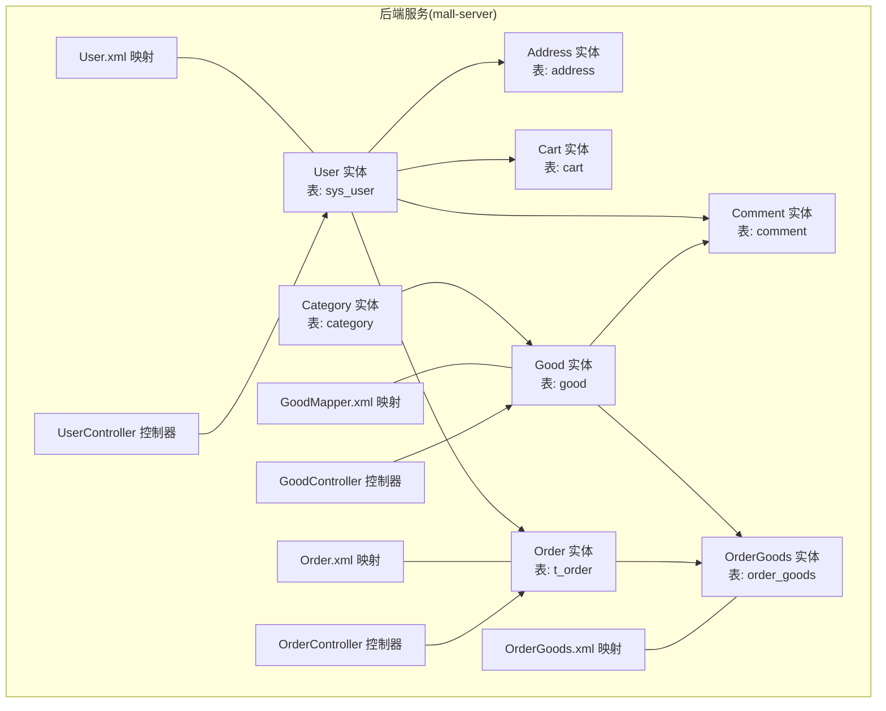

**图示来源**
- [DATABASE_DESIGN.md:5-83](file://DATABASE_DESIGN.md#L5-L83)
- [User.java:9-122](file://mall-server/src/main/java/com/rabbiter/em/entity/User.java#L9-L122)
- [Address.java:8-86](file://mall-server/src/main/java/com/rabbiter/em/entity/Address.java#L8-L86)
- [Cart.java:8-97](file://mall-server/src/main/java/com/rabbiter/em/entity/Cart.java#L8-L97)
- [Order.java:11-171](file://mall-server/src/main/java/com/rabbiter/em/entity/Order.java#L11-L171)
- [OrderGoods.java:8-86](file://mall-server/src/main/java/com/rabbiter/em/entity/OrderGoods.java#L8-L86)
- [Good.java:11-232](file://mall-server/src/main/java/com/rabbiter/em/entity/Good.java#L11-L232)
- [Category.java:9-57](file://mall-server/src/main/java/com/rabbiter/em/entity/Category.java#L9-L57)
- [Comment.java:9-94](file://mall-server/src/main/java/com/rabbiter/em/entity/Comment.java#L9-L94)
- [User.xml:1-35](file://mall-server/src/main/resources/mapper/User.xml#L1-L35)
- [GoodMapper.xml:1-33](file://mall-server/src/main/resources/mapper/GoodMapper.xml#L1-L33)
- [Order.xml:1-49](file://mall-server/src/main/resources/mapper/Order.xml#L1-L49)
- [OrderGoods.xml:1-6](file://mall-server/src/main/resources/mapper/OrderGoods.xml#L1-L6)
- [UserController.java:1-179](file://mall-server/src/main/java/com/rabbiter/em/controller/UserController.java#L1-L179)
- [OrderController.java:1-196](file://mall-server/src/main/java/com/rabbiter/em/controller/OrderController.java#L1-L196)
- [GoodController.java:1-209](file://mall-server/src/main/java/com/rabbiter/em/controller/GoodController.java#L1-L209)

**章节来源**
- [DATABASE_DESIGN.md:1-223](file://DATABASE_DESIGN.md#L1-L223)
- [User.java:1-123](file://mall-server/src/main/java/com/rabbiter/em/entity/User.java#L1-L123)
- [Address.java:1-86](file://mall-server/src/main/java/com/rabbiter/em/entity/Address.java#L1-L86)
- [Cart.java:1-97](file://mall-server/src/main/java/com/rabbiter/em/entity/Cart.java#L1-L97)
- [Order.java:1-171](file://mall-server/src/main/java/com/rabbiter/em/entity/Order.java#L1-L171)
- [OrderGoods.java:1-86](file://mall-server/src/main/java/com/rabbiter/em/entity/OrderGoods.java#L1-L86)
- [Good.java:1-232](file://mall-server/src/main/java/com/rabbiter/em/entity/Good.java#L1-L232)
- [Category.java:1-57](file://mall-server/src/main/java/com/rabbiter/em/entity/Category.java#L1-L57)
- [Comment.java:1-94](file://mall-server/src/main/java/com/rabbiter/em/entity/Comment.java#L1-L94)
- [User.xml:1-35](file://mall-server/src/main/resources/mapper/User.xml#L1-L35)
- [GoodMapper.xml:1-33](file://mall-server/src/main/resources/mapper/GoodMapper.xml#L1-L33)
- [Order.xml:1-49](file://mall-server/src/main/resources/mapper/Order.xml#L1-L49)
- [OrderGoods.xml:1-6](file://mall-server/src/main/resources/mapper/OrderGoods.xml#L1-L6)
- [UserController.java:1-179](file://mall-server/src/main/java/com/rabbiter/em/controller/UserController.java#L1-L179)
- [OrderController.java:1-196](file://mall-server/src/main/java/com/rabbiter/em/controller/OrderController.java#L1-L196)
- [GoodController.java:1-209](file://mall-server/src/main/java/com/rabbiter/em/controller/GoodController.java#L1-L209)

## 核心组件
- 用户（User）
  - 表：sys_user
  - 关系：一对多（拥有地址、购物车、订单、评论）
  - 关键字段：主键 id；角色 role；其他基础信息
- 地址（Address）
  - 表：address
  - 关系：多对一（属于用户）
  - 关键字段：主键 id；外键 user_id；联系人、电话、地址
- 商品（Good）
  - 表：good
  - 关系：一对多（被分类包含、被购物车收藏、被订单明细包含、接收评论）
  - 关键字段：主键 id；外键 category_id；折扣 discount、销量 sales、图片 imgs、推荐 recommend、逻辑删除 is_delete
- 分类（Category）
  - 表：category
  - 关系：一对多（包含商品）
  - 关键字段：主键 id；名称 name
- 订单（Order）
  - 表：t_order
  - 关系：一对多（包含订单明细）
  - 关键字段：主键 id；订单号 order_no；总价 total_price；外键 user_id；状态 state、创建时间 create_time
- 评论（Comment）
  - 表：comment
  - 关系：多对一（用户写评论、商品接收评论）
  - 关键字段：主键 id；外键 user_id、good_id；内容 content、回复 reply、创建时间 create_time
- 购物车（Cart）
  - 表：cart
  - 关系：多对一（属于用户、关联商品）
  - 关键字段：主键 id；数量 count；外键 user_id、good_id；规格 standard、加入时间 create_time
- 订单商品明细（OrderGoods）
  - 表：order_goods
  - 关系：多对一（关联订单、关联商品）
  - 关键字段：主键 id；外键 order_id、good_id；数量 count；规格 standard

**章节来源**
- [DATABASE_DESIGN.md:5-83](file://DATABASE_DESIGN.md#L5-L83)
- [User.java:9-122](file://mall-server/src/main/java/com/rabbiter/em/entity/User.java#L9-L122)
- [Address.java:8-86](file://mall-server/src/main/java/com/rabbiter/em/entity/Address.java#L8-L86)
- [Good.java:11-232](file://mall-server/src/main/java/com/rabbiter/em/entity/Good.java#L11-L232)
- [Category.java:9-57](file://mall-server/src/main/java/com/rabbiter/em/entity/Category.java#L9-L57)
- [Order.java:11-171](file://mall-server/src/main/java/com/rabbiter/em/entity/Order.java#L11-L171)
- [Comment.java:9-94](file://mall-server/src/main/java/com/rabbiter/em/entity/Comment.java#L9-L94)
- [Cart.java:8-97](file://mall-server/src/main/java/com/rabbiter/em/entity/Cart.java#L8-L97)
- [OrderGoods.java:8-86](file://mall-server/src/main/java/com/rabbiter/em/entity/OrderGoods.java#L8-L86)

## 架构总览
下图以 ER 形式直观呈现核心实体间的关系与基数约束，并标注外键位置与参照完整性策略。

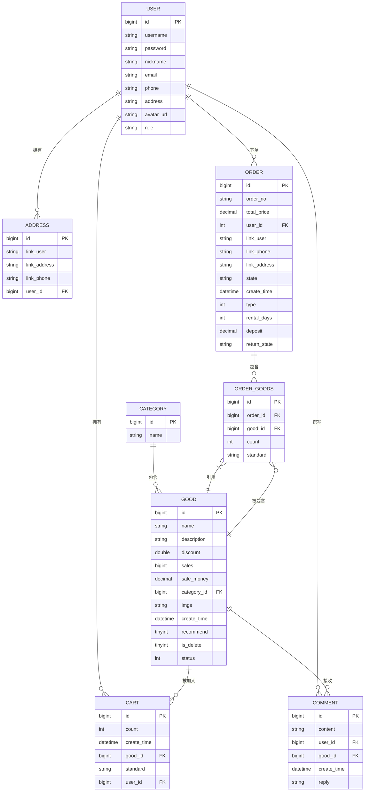

**图示来源**
- [DATABASE_DESIGN.md:5-83](file://DATABASE_DESIGN.md#L5-L83)

## 详细组件分析

### 用户（User）与地址（Address）
- 关系：一对多（一个用户可有多个收货地址）
- 外键：Address.user_id 引用 User.id
- 业务规则：
  - 用户注册时可维护默认地址，但实际使用中可新增多条地址记录
  - 地址删除不影响用户存在，仅移除该地址记录
- 参照完整性：
  - Address.user_id 为非空外键，确保地址归属有效用户
- 控制器与服务交互：
  - 用户控制器负责用户登录、注册、信息查询等
  - 地址管理由前端页面与后端接口配合完成（此处不展开具体接口实现）

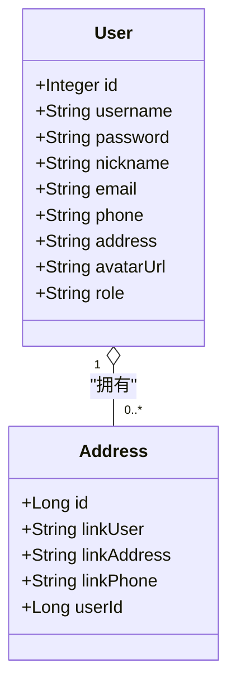

**图示来源**
- [User.java:9-122](file://mall-server/src/main/java/com/rabbiter/em/entity/User.java#L9-L122)
- [Address.java:8-86](file://mall-server/src/main/java/com/rabbiter/em/entity/Address.java#L8-L86)

**章节来源**
- [User.java:1-123](file://mall-server/src/main/java/com/rabbiter/em/entity/User.java#L1-L123)
- [Address.java:1-86](file://mall-server/src/main/java/com/rabbiter/em/entity/Address.java#L1-L86)
- [DATABASE_DESIGN.md:5-83](file://DATABASE_DESIGN.md#L5-L83)

### 用户（User）与购物车（Cart）
- 关系：一对多（一个用户可有多条购物车记录）
- 外键：Cart.user_id 引用 User.id
- 业务规则：
  - 购物车记录与商品规格绑定，便于下单结算
  - 购物车数量变更需校验商品库存与规格有效性
- 参照完整性：
  - Cart.user_id 为非空外键，确保购物车归属有效用户

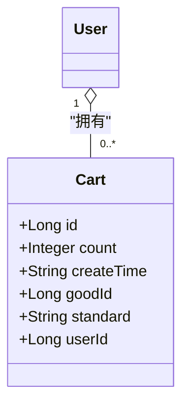

**图示来源**
- [User.java:9-122](file://mall-server/src/main/java/com/rabbiter/em/entity/User.java#L9-L122)
- [Cart.java:8-97](file://mall-server/src/main/java/com/rabbiter/em/entity/Cart.java#L8-L97)

**章节来源**
- [User.java:1-123](file://mall-server/src/main/java/com/rabbiter/em/entity/User.java#L1-L123)
- [Cart.java:1-97](file://mall-server/src/main/java/com/rabbiter/em/entity/Cart.java#L1-L97)
- [DATABASE_DESIGN.md:5-83](file://DATABASE_DESIGN.md#L5-L83)

### 用户（User）与订单（Order）
- 关系：一对多（一个用户可有多笔订单）
- 外键：Order.user_id 引用 User.id
- 业务规则：
  - 订单状态流转：待付款 → 待发货 → 已发货 → 已完成
  - 管理员可查看与导出订单，普通用户仅能查看本人订单
- 参照完整性：
  - Order.user_id 为非空外键，确保订单归属有效用户

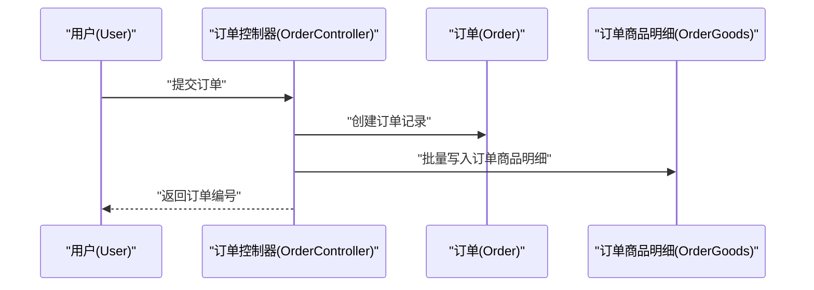

**图示来源**
- [OrderController.java:134-139](file://mall-server/src/main/java/com/rabbiter/em/controller/OrderController.java#L134-L139)
- [Order.java:11-171](file://mall-server/src/main/java/com/rabbiter/em/entity/Order.java#L11-L171)
- [OrderGoods.java:8-86](file://mall-server/src/main/java/com/rabbiter/em/entity/OrderGoods.java#L8-L86)

**章节来源**
- [OrderController.java:1-196](file://mall-server/src/main/java/com/rabbiter/em/controller/OrderController.java#L1-L196)
- [Order.java:1-171](file://mall-server/src/main/java/com/rabbiter/em/entity/Order.java#L1-L171)
- [OrderGoods.java:1-86](file://mall-server/src/main/java/com/rabbiter/em/entity/OrderGoods.java#L1-L86)
- [Order.xml:1-49](file://mall-server/src/main/resources/mapper/Order.xml#L1-L49)

### 用户（User）与评论（Comment）
- 关系：一对多（一个用户可发表多条评论）
- 外键：Comment.user_id 引用 User.id
- 业务规则：
  - 评论内容支持管理员回复
  - 评论与商品关联，用于商品评价与展示

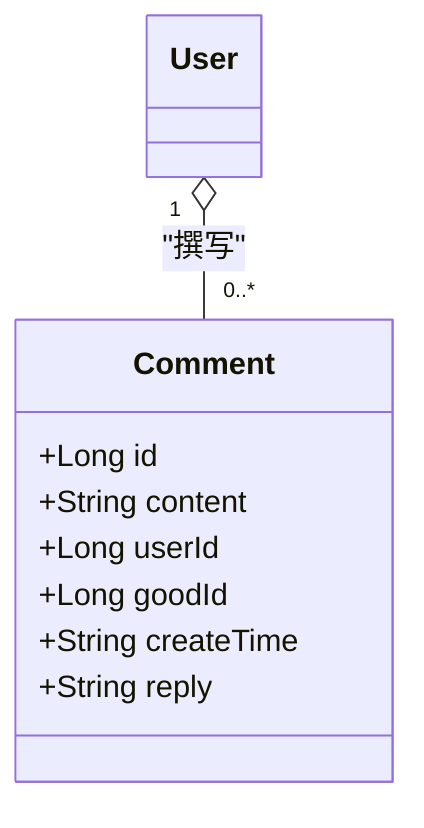

**图示来源**
- [User.java:9-122](file://mall-server/src/main/java/com/rabbiter/em/entity/User.java#L9-L122)
- [Comment.java:9-94](file://mall-server/src/main/java/com/rabbiter/em/entity/Comment.java#L9-L94)

**章节来源**
- [User.java:1-123](file://mall-server/src/main/java/com/rabbiter/em/entity/User.java#L1-L123)
- [Comment.java:1-94](file://mall-server/src/main/java/com/rabbiter/em/entity/Comment.java#L1-L94)
- [DATABASE_DESIGN.md:5-83](file://DATABASE_DESIGN.md#L5-L83)

### 分类（Category）与商品（Good）
- 关系：一对多（一个分类可包含多个商品）
- 外键：Good.category_id 引用 Category.id
- 业务规则：
  - 商品可设置推荐与上下架状态
  - 商品规格独立存储，便于价格与库存管理

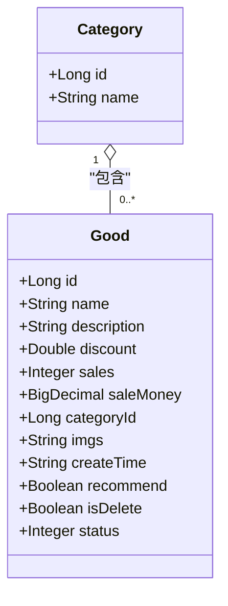

**图示来源**
- [Category.java:9-57](file://mall-server/src/main/java/com/rabbiter/em/entity/Category.java#L9-L57)
- [Good.java:11-232](file://mall-server/src/main/java/com/rabbiter/em/entity/Good.java#L11-L232)

**章节来源**
- [Category.java:1-57](file://mall-server/src/main/java/com/rabbiter/em/entity/Category.java#L1-L57)
- [Good.java:1-232](file://mall-server/src/main/java/com/rabbiter/em/entity/Good.java#L1-L232)
- [DATABASE_DESIGN.md:5-83](file://DATABASE_DESIGN.md#L5-L83)

### 商品（Good）与评论（Comment）
- 关系：一对多（一个商品可接收多条评论）
- 外键：Comment.good_id 引用 Good.id
- 业务规则：
  - 评论与商品关联，用于展示与统计

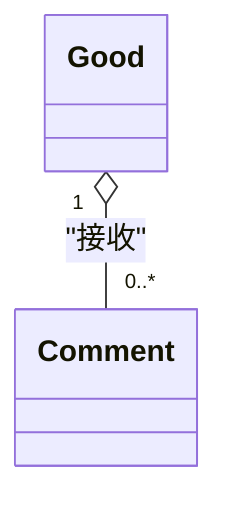

**图示来源**
- [Good.java:11-232](file://mall-server/src/main/java/com/rabbiter/em/entity/Good.java#L11-L232)
- [Comment.java:9-94](file://mall-server/src/main/java/com/rabbiter/em/entity/Comment.java#L9-L94)

**章节来源**
- [Good.java:1-232](file://mall-server/src/main/java/com/rabbiter/em/entity/Good.java#L1-L232)
- [Comment.java:1-94](file://mall-server/src/main/java/com/rabbiter/em/entity/Comment.java#L1-L94)
- [DATABASE_DESIGN.md:5-83](file://DATABASE_DESIGN.md#L5-L83)

### 商品（Good）与购物车（Cart）
- 关系：一对多（一个商品可被多人加入购物车）
- 外键：Cart.good_id 引用 Good.id
- 业务规则：
  - 购物车记录包含规格信息，便于下单时选择

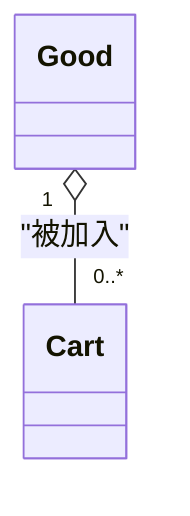

**图示来源**
- [Good.java:11-232](file://mall-server/src/main/java/com/rabbiter/em/entity/Good.java#L11-L232)
- [Cart.java:8-97](file://mall-server/src/main/java/com/rabbiter/em/entity/Cart.java#L8-L97)

**章节来源**
- [Good.java:1-232](file://mall-server/src/main/java/com/rabbiter/em/entity/Good.java#L1-L232)
- [Cart.java:1-97](file://mall-server/src/main/java/com/rabbiter/em/entity/Cart.java#L1-L97)
- [DATABASE_DESIGN.md:5-83](file://DATABASE_DESIGN.md#L5-L83)

### 订单（Order）与订单商品明细（OrderGoods）
- 关系：一对多（一个订单包含多条明细）
- 外键：OrderGoods.order_id 引用 Order.id；OrderGoods.good_id 引用 Good.id
- 业务规则：
  - 明细记录保存购买数量与所选规格
  - 订单查询时通过 OrderGoods 连接商品与规格信息

```mermaid
classDiagram
class Order
class OrderGoods {
+Long id
+Long orderId
+Long goodId
+Integer count
+String standard
}
Order "1" o-- "0..*" OrderGoods : "包含"
OrderGoods }|--|| Good : "引用"
```

**图示来源**
- [Order.java:11-171](file://mall-server/src/main/java/com/rabbiter/em/entity/Order.java#L11-L171)
- [OrderGoods.java:8-86](file://mall-server/src/main/java/com/rabbiter/em/entity/OrderGoods.java#L8-L86)

**章节来源**
- [Order.java:1-171](file://mall-server/src/main/java/com/rabbiter/em/entity/Order.java#L1-L171)
- [OrderGoods.java:1-86](file://mall-server/src/main/java/com/rabbiter/em/entity/OrderGoods.java#L1-L86)
- [Order.xml:1-49](file://mall-server/src/main/resources/mapper/Order.xml#L1-L49)
- [DATABASE_DESIGN.md:5-83](file://DATABASE_DESIGN.md#L5-L83)

### 商品（Good）与商品规格（独立概念）
- 关系：一对多（一个商品可有多种规格）
- 业务说明：
  - 商品规格独立于实体模型，通过 SQL 查询聚合计算最小价格与总库存
  - 规格表字段包括：good_id、value、price、store
- 查询要点：
  - 最小价格：按商品分组取规格价格的最小值乘以商品折扣
  - 总库存：按商品分组对规格库存求和

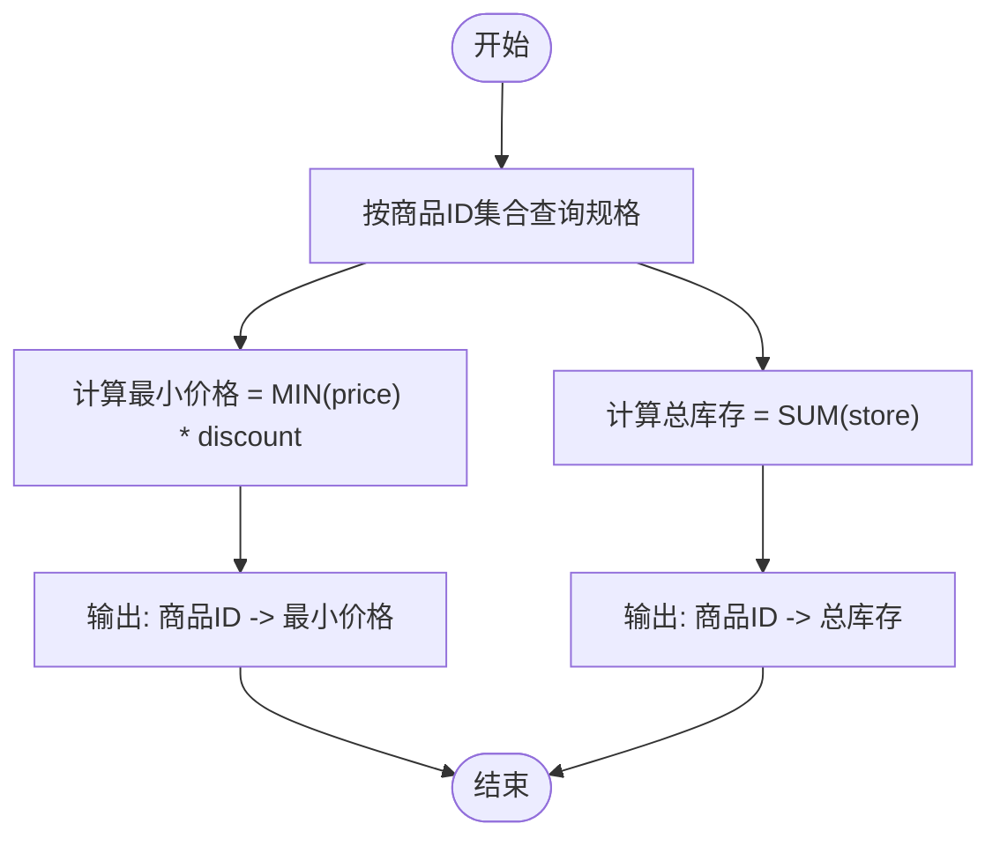

**图示来源**
- [GoodMapper.xml:16-31](file://mall-server/src/main/resources/mapper/GoodMapper.xml#L16-L31)

**章节来源**
- [GoodMapper.xml:1-33](file://mall-server/src/main/resources/mapper/GoodMapper.xml#L1-L33)
- [Good.java:1-232](file://mall-server/src/main/java/com/rabbiter/em/entity/Good.java#L1-L232)

## 依赖分析
- 控制器到实体与映射：
  - UserController 依赖 UserService 与 User 实体
  - OrderController 依赖 OrderService 与 Order 实体，内部进行权限校验与订单归属校验
  - GoodController 依赖 GoodService、StandardService 与 Good 实体
- 映射层到实体：
  - User.xml、GoodMapper.xml、Order.xml、OrderGoods.xml 定义了查询与聚合逻辑
- 外键与参照完整性：
  - 所有外键均为非空约束，确保引用数据一致性
  - 删除用户不会级联删除其订单/评论/购物车，避免误删；可通过业务逻辑在删除前迁移或清理

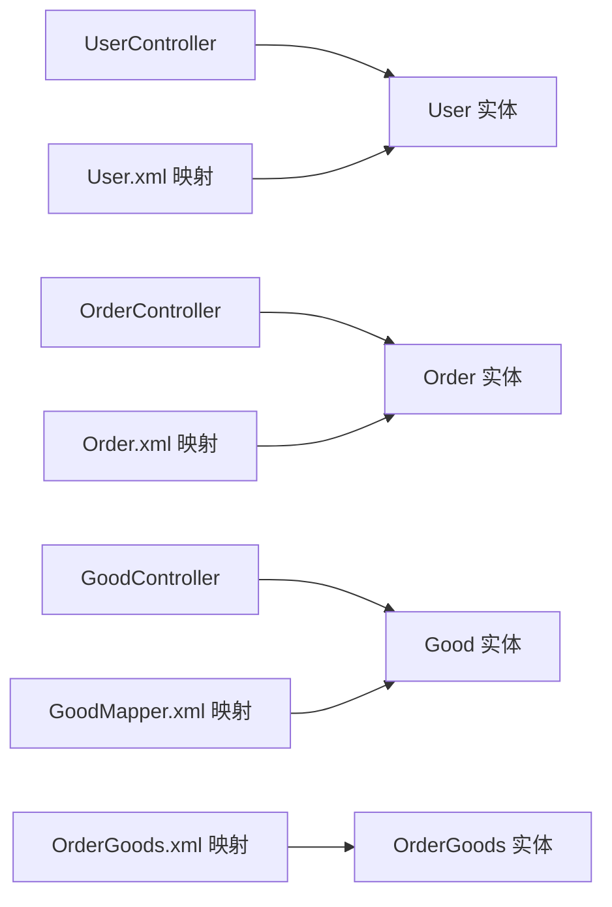

**图示来源**
- [UserController.java:1-179](file://mall-server/src/main/java/com/rabbiter/em/controller/UserController.java#L1-L179)
- [OrderController.java:1-196](file://mall-server/src/main/java/com/rabbiter/em/controller/OrderController.java#L1-L196)
- [GoodController.java:1-209](file://mall-server/src/main/java/com/rabbiter/em/controller/GoodController.java#L1-L209)
- [User.xml:1-35](file://mall-server/src/main/resources/mapper/User.xml#L1-L35)
- [GoodMapper.xml:1-33](file://mall-server/src/main/resources/mapper/GoodMapper.xml#L1-L33)
- [Order.xml:1-49](file://mall-server/src/main/resources/mapper/Order.xml#L1-L49)
- [OrderGoods.xml:1-6](file://mall-server/src/main/resources/mapper/OrderGoods.xml#L1-L6)

**章节来源**
- [UserController.java:1-179](file://mall-server/src/main/java/com/rabbiter/em/controller/UserController.java#L1-L179)
- [OrderController.java:1-196](file://mall-server/src/main/java/com/rabbiter/em/controller/OrderController.java#L1-L196)
- [GoodController.java:1-209](file://mall-server/src/main/java/com/rabbiter/em/controller/GoodController.java#L1-L209)
- [User.xml:1-35](file://mall-server/src/main/resources/mapper/User.xml#L1-L35)
- [GoodMapper.xml:1-33](file://mall-server/src/main/resources/mapper/GoodMapper.xml#L1-L33)
- [Order.xml:1-49](file://mall-server/src/main/resources/mapper/Order.xml#L1-L49)
- [OrderGoods.xml:1-6](file://mall-server/src/main/resources/mapper/OrderGoods.xml#L1-L6)

## 性能考虑
- 查询优化
  - 商品最小价格与总库存查询使用分组聚合，建议在 good_id、value 上建立索引以提升性能
  - 订单查询通过 order_goods 连接商品与规格，建议在 order_id、good_id 上建立索引
- 写入优化
  - 购物车与订单明细写入批量执行，减少事务开销
  - 商品销量与销售额更新采用原子自增，避免并发问题
- 缓存策略
  - 推荐商品与热门榜单可引入缓存，降低数据库压力

## 故障排查指南
- 订单归属校验失败
  - 现象：访问他人订单时报无权访问
  - 原因：OrderController 在读取订单时校验当前用户与订单所属用户是否一致
  - 处理：确认登录态与 Token 是否正确，或是否为管理员
- 订单导出异常
  - 现象：导出 CSV 时编码或格式问题
  - 原因：导出逻辑添加了 UTF-8 BOM 并对逗号换号等特殊字符做转义处理
  - 处理：检查浏览器下载行为与文件名编码
- 商品规格查询为空
  - 现象：最小价格或总库存为 null
  - 原因：商品尚未配置规格或规格库存为 0
  - 处理：确认规格表数据与商品状态

**章节来源**
- [OrderController.java:34-48](file://mall-server/src/main/java/com/rabbiter/em/controller/OrderController.java#L34-L48)
- [OrderController.java:92-117](file://mall-server/src/main/java/com/rabbiter/em/controller/OrderController.java#L92-L117)
- [GoodMapper.xml:16-31](file://mall-server/src/main/resources/mapper/GoodMapper.xml#L16-L31)

## 结论
本系统通过清晰的 ER 设计与严格的外键约束，实现了用户、地址、商品、分类、订单、评论、购物车与订单明细之间的稳定关系。结合控制器层的权限校验与映射层的聚合查询，能够支撑从商品浏览、购物车管理到订单支付与评价的完整业务闭环。建议在高并发场景下进一步完善索引与缓存策略，持续优化查询与写入性能。

## 附录
- 数据库设计文档与表结构详见 DATABASE_DESIGN.md
- 实体类与映射文件路径见“项目结构”与“章节来源”