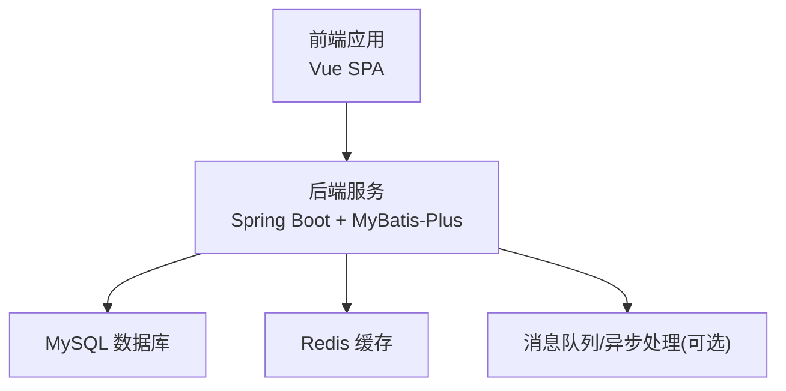
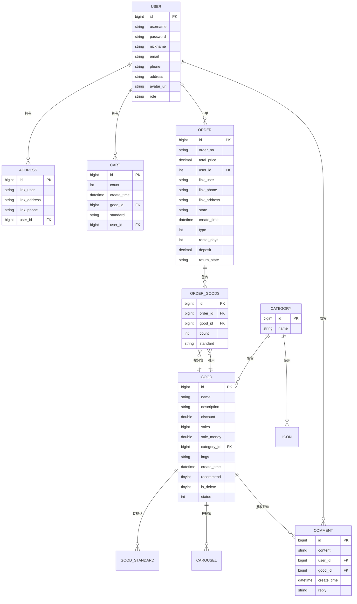
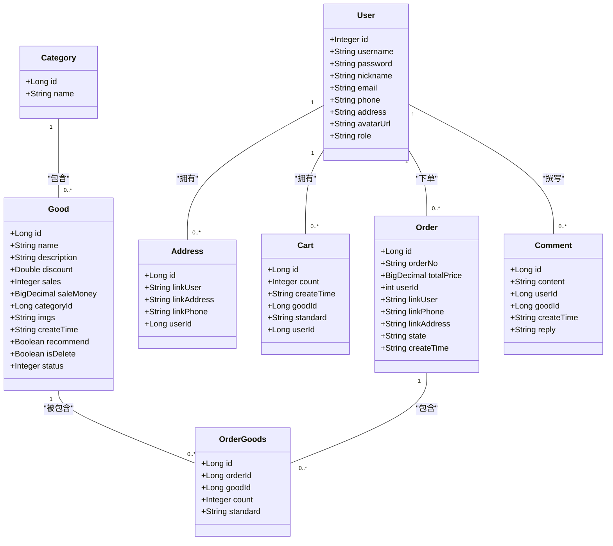

# 数据库设计

<cite>
**本文引用的文件**
- [DATABASE_DESIGN.md](file://DATABASE_DESIGN.md)
- [application.yml](file://mall-server/src/main/resources/application.yml)
- [User.java](file://mall-server/src/main/java/com/rabbiter/em/entity/User.java)
- [Good.java](file://mall-server/src/main/java/com/rabbiter/em/entity/Good.java)
- [Order.java](file://mall-server/src/main/java/com/rabbiter/em/entity/Order.java)
- [Cart.java](file://mall-server/src/main/java/com/rabbiter/em/entity/Cart.java)
- [Category.java](file://mall-server/src/main/java/com/rabbiter/em/entity/Category.java)
- [Comment.java](file://mall-server/src/main/java/com/rabbiter/em/entity/Comment.java)
- [Address.java](file://mall-server/src/main/java/com/rabbiter/em/entity/Address.java)
- [OrderGoods.java](file://mall-server/src/main/java/com/rabbiter/em/entity/OrderGoods.java)
- [User.xml](file://mall-server/src/main/resources/mapper/User.xml)
- [GoodMapper.xml](file://mall-server/src/main/resources/mapper/GoodMapper.xml)
- [Order.xml](file://mall-server/src/main/resources/mapper/Order.xml)
- [Cart.xml](file://mall-server/src/main/resources/mapper/Cart.xml)
</cite>

## 目录
1. [简介](#简介)
2. [项目结构](#项目结构)
3. [核心组件](#核心组件)
4. [架构总览](#架构总览)
5. [详细组件分析](#详细组件分析)
6. [依赖分析](#依赖分析)
7. [性能考量](#性能考量)
8. [故障排查指南](#故障排查指南)
9. [结论](#结论)
10. [附录](#附录)

## 简介
本文件面向 cosplayer 商城系统，提供完整的数据库设计文档，涵盖数据模型、表结构、字段定义、约束与索引设计、业务实体关系、外键与参照完整性、数据字典、性能优化策略、缓存配合方案、典型业务场景的数据流与查询路径，并给出数据迁移与版本管理建议。

## 项目结构
后端采用 Spring Boot + MyBatis-Plus 架构，数据库连接与 Redis 缓存通过配置文件集中管理；前端 Vue 应用负责页面交互，后端提供 REST 接口与持久层映射。

章节来源
- [application.yml:1-42](file://mall-server/src/main/resources/application.yml#L1-L42)

## 核心组件
本系统围绕以下核心业务实体展开：用户、商品、分类、订单、订单商品、购物车、地址、评论、轮播图、公告、文件与头像等。各实体在 Java 实体类与数据库表之间保持一一对应或语义一致的映射关系。

- 用户(User)：系统身份主体，支持角色区分（管理员/普通用户）
- 商品(Good)：商品基础信息，含折扣、销量、销售额、推荐、逻辑删除、上下架状态等
- 分类(Category)：商品分类
- 订单(Order)：订单主表，当前版本聚焦普通购买流程，租赁相关字段为历史兼容保留
- 订单商品(OrderGoods)：订单与具体商品的明细关联
- 购物车(Cart)：用户购物车项
- 地址(Address)：用户收货地址
- 评论(Comment)：用户对商品的评价与回复
- 轮播图(Carousel)：首页轮播位
- 公告(Notice)：系统公告
- 文件与头像：文件元数据与用户头像

章节来源
- [User.java:9-123](file://mall-server/src/main/java/com/rabbiter/em/entity/User.java#L9-L123)
- [Good.java:11-232](file://mall-server/src/main/java/com/rabbiter/em/entity/Good.java#L11-L232)
- [Order.java:11-171](file://mall-server/src/main/java/com/rabbiter/em/entity/Order.java#L11-L171)
- [Cart.java:8-97](file://mall-server/src/main/java/com/rabbiter/em/entity/Cart.java#L8-L97)
- [Category.java:9-57](file://mall-server/src/main/java/com/rabbiter/em/entity/Category.java#L9-L57)
- [Comment.java:9-94](file://mall-server/src/main/java/com/rabbiter/em/entity/Comment.java#L9-L94)
- [Address.java:8-86](file://mall-server/src/main/java/com/rabbiter/em/entity/Address.java#L8-L86)
- [OrderGoods.java:8-86](file://mall-server/src/main/java/com/rabbiter/em/entity/OrderGoods.java#L8-L86)

## 架构总览
系统数据库层采用 MyBatis-Plus 的实体类注解映射到物理表，Mapper XML 提供复杂查询与批量操作能力；应用通过 application.yml 统一配置数据源与 Redis 连接参数。

图表来源
- [DATABASE_DESIGN.md:5-83](file://DATABASE_DESIGN.md#L5-L83)

章节来源
- [DATABASE_DESIGN.md:1-223](file://DATABASE_DESIGN.md#L1-L223)

## 详细组件分析

### 用户(User)与地址(Address)
- 设计理念：用户作为系统身份主体，支持多种联系方式与角色标识；地址与用户建立一对多关系，便于维护收货地址列表。
- 业务规则：
  - 用户名唯一性由应用层控制；邮箱、手机号可为空但需符合格式校验
  - 地址必须归属某个用户
- 字段要点：id、username、password（敏感字段）、nickname、email、phone、address、avatarUrl、role
- 约束与索引：建议在 username 建唯一索引；在 email、phone 建普通索引以提升查询效率

章节来源
- [User.java:9-123](file://mall-server/src/main/java/com/rabbiter/em/entity/User.java#L9-L123)
- [Address.java:8-86](file://mall-server/src/main/java/com/rabbiter/em/entity/Address.java#L8-L86)
- [DATABASE_DESIGN.md:20-38](file://DATABASE_DESIGN.md#L20-L38)

### 商品(Good)与分类(Category)、规格(GoodStandard)
- 设计理念：商品具备基础信息、折扣、销量、销售额、推荐、逻辑删除、上下架状态；规格表承载不同属性组合（如尺码、颜色）及价格与库存
- 业务规则：
  - 商品默认折扣为 1.0；销量与销售额由销售动作累加
  - 规格与库存用于保证下单时的可用性
  - 推荐字段用于首页展示筛选
- 字段要点：id、name、description、discount、sales、saleMoney、categoryId、imgs、createTime、recommend、isDelete、status
- 约束与索限：建议在 categoryId 建索引；在 isDelete、status 组合索引以加速前台筛选

章节来源
- [Good.java:11-232](file://mall-server/src/main/java/com/rabbiter/em/entity/Good.java#L11-L232)
- [Category.java:9-57](file://mall-server/src/main/java/com/rabbiter/em/entity/Category.java#L9-L57)
- [DATABASE_DESIGN.md:40-52](file://DATABASE_DESIGN.md#L40-L52)

### 订单(Order)与订单商品(OrderGoods)
- 设计理念：订单主表记录订单号、总价、下单人、收货信息、状态与时间；订单商品明细表记录具体商品、数量与规格
- 业务规则：
  - 当前版本聚焦普通购买流程；租赁相关字段为历史兼容保留
  - 订单状态驱动业务流程（待付款/待发货/已发货/已完成等）
- 字段要点：orderNo、totalPrice、userId、linkUser、linkPhone、linkAddress、state、createTime、type、rentalDays、deposit、returnState
- 约束与索引：建议在 orderNo 建唯一索引；在 userId、state、createTime 建复合索引以支持按用户与状态检索

章节来源
- [Order.java:11-171](file://mall-server/src/main/java/com/rabbiter/em/entity/Order.java#L11-L171)
- [OrderGoods.java:8-86](file://mall-server/src/main/java/com/rabbiter/em/entity/OrderGoods.java#L8-L86)
- [DATABASE_DESIGN.md:59-73](file://DATABASE_DESIGN.md#L59-L73)

### 购物车(Cart)
- 设计理念：临时保存用户选择的商品与规格，支持数量变更与批量结算
- 业务规则：购物车项与用户、商品、规格三者绑定，便于下单时快速生成订单明细
- 字段要点：count、createTime、goodId、standard、userId
- 约束与索引：建议在 userId 建索引；在 goodId+standard 建组合索引以避免重复添加同规格商品

章节来源
- [Cart.java:8-97](file://mall-server/src/main/java/com/rabbiter/em/entity/Cart.java#L8-L97)
- [DATABASE_DESIGN.md:190-201](file://DATABASE_DESIGN.md#L190-L201)

### 评论(Comment)
- 设计理念：用户对商品进行评价，支持管理员回复
- 业务规则：content 与 reply 用于展示与互动；username、avatarUrl 为展示增强字段
- 字段要点：content、userId、goodId、createTime、reply
- 约束与索引：建议在 goodId、userId 建索引以支持按商品与用户查询

章节来源
- [Comment.java:9-94](file://mall-server/src/main/java/com/rabbiter/em/entity/Comment.java#L9-L94)
- [DATABASE_DESIGN.md:149-159](file://DATABASE_DESIGN.md#L149-L159)

### 公告(Notice)与轮播图(Carousel)
- 设计理念：公告用于系统通知；轮播图用于首页商品展示
- 业务规则：轮播图与商品建立关联，支持首页推荐位配置
- 字段要点：公告包含标题、内容、发布时间；轮播图包含商品与显示顺序
- 约束与索引：轮播图建议在 goodId 建索引；在 showOrder 建索引以保证展示顺序稳定

章节来源
- [DATABASE_DESIGN.md:202-220](file://DATABASE_DESIGN.md#L202-L220)

### 文件与头像
- 设计理念：文件表与头像表用于统一管理上传资源元数据
- 业务规则：与用户头像、商品图片等资源关联
- 字段要点：文件路径、存储信息、创建时间等
- 约束与索引：根据实际业务需求在文件名、哈希、创建时间等维度建索引

章节来源
- [DATABASE_DESIGN.md:221-223](file://DATABASE_DESIGN.md#L221-L223)

## 依赖分析
- 实体类与表映射：MyBatis-Plus 注解将 Java 实体类映射到数据库表，确保字段命名与驼峰转换策略一致
- 查询映射：Mapper XML 定义复杂查询与批量更新，如商品最小价格聚合、库存汇总、订单明细联表查询等
- 外键与参照完整性：ER 图中明确标注外键关系，建议在数据库层面设置外键约束以保证数据一致性

图表来源
- [User.java:9-123](file://mall-server/src/main/java/com/rabbiter/em/entity/User.java#L9-L123)
- [Address.java:8-86](file://mall-server/src/main/java/com/rabbiter/em/entity/Address.java#L8-L86)
- [Good.java:11-232](file://mall-server/src/main/java/com/rabbiter/em/entity/Good.java#L11-L232)
- [Category.java:9-57](file://mall-server/src/main/java/com/rabbiter/em/entity/Category.java#L9-L57)
- [Order.java:11-171](file://mall-server/src/main/java/com/rabbiter/em/entity/Order.java#L11-L171)
- [OrderGoods.java:8-86](file://mall-server/src/main/java/com/rabbiter/em/entity/OrderGoods.java#L8-L86)
- [Cart.java:8-97](file://mall-server/src/main/java/com/rabbiter/em/entity/Cart.java#L8-L97)
- [Comment.java:9-94](file://mall-server/src/main/java/com/rabbiter/em/entity/Comment.java#L9-L94)

## 性能考量
- 索引设计
  - 用户：username 唯一索引；email、phone 普通索引
  - 商品：categoryId、isDelete+status 组合索引；name（如需搜索）可考虑全文索引或模糊匹配优化
  - 订单：orderNo 唯一索引；userId、state、createTime 复合索引
  - 订单商品：orderId、goodId 单独索引；(orderId,goodId) 组合索引
  - 购物车：userId、goodId+standard 组合索引
  - 评论：goodId、userId 索引
- 查询优化
  - 使用 Mapper XML 进行联表查询与聚合统计，避免 N+1 查询
  - 利用分页查询与条件过滤，减少结果集大小
- 分表分库
  - 订单与订单商品可按时间维度分表；用户与商品可按业务域拆分
  - 引入读写分离与缓存热点数据
- 缓存策略
  - Redis 缓存热门商品详情、分类树、轮播图、用户会话
  - 使用缓存预热与失效策略，结合数据库触发器或定时任务同步
- 并发与一致性
  - 购物车与库存扣减采用乐观锁或分布式锁
  - 订单状态机与事务边界清晰划分

## 故障排查指南
- 连接与配置
  - 检查数据库连接参数（主机、端口、用户名、密码、字符集）是否正确
  - 确认 MyBatis-Plus 的下划线转驼峰映射已开启
- 常见问题
  - 字段类型不匹配：核对实体类与数据库字段类型、长度、精度
  - 外键约束失败：检查关联数据是否存在且状态合法
  - 查询性能差：确认必要索引是否缺失，SQL 是否存在隐式转换
- 日志与监控
  - 启用 SQL 日志与慢查询日志
  - 结合 APM 工具定位热点接口与慢查询

章节来源
- [application.yml:8-42](file://mall-server/src/main/resources/application.yml#L8-L42)

## 结论
本数据库设计方案以业务为中心，通过清晰的 ER 关系与合理的索引策略支撑高并发场景下的购物流程；结合 Redis 缓存与分表分库策略，可在保证数据一致性的前提下显著提升系统吞吐与响应速度。后续可根据业务增长持续迭代索引与分片策略。

## 附录

### 数据字典与字段说明
- 用户表(sys_user)
  - id: 主键
  - username: 用户名
  - password: 密码(加密)
  - nickname: 昵称
  - email: 邮箱
  - phone: 手机号
  - address: 默认地址
  - avatar_url: 头像URL
  - role: 角色(admin/user)
- 商品表(good)
  - id: 主键
  - name: 商品名称
  - description: 商品描述
  - discount: 折扣
  - sales: 销量
  - sale_money: 销售额
  - category_id: 分类ID
  - imgs: 商品图片URL
  - create_time: 创建时间
  - recommend: 是否推荐
  - is_delete: 是否逻辑删除
  - status: 上下架状态
- 订单表(t_order)
  - id: 主键
  - order_no: 订单编号
  - total_price: 订单总价
  - user_id: 下单用户ID
  - link_user: 联系人姓名
  - link_phone: 联系电话
  - link_address: 收货地址
  - state: 订单状态
  - create_time: 创建时间
  - type: 历史兼容保留字段
  - rental_days: 历史兼容保留字段
  - deposit: 历史兼容保留字段
  - return_state: 历史兼容保留字段
- 地址表(address)
  - id: 主键
  - link_user: 收货人
  - link_address: 详细地址
  - link_phone: 联系电话
  - user_id: 所属用户ID
- 评论表(comment)
  - id: 主键
  - content: 评论内容
  - user_id: 用户ID
  - good_id: 商品ID
  - create_time: 评论时间
  - reply: 管理员回复
- 订单商品表(order_goods)
  - id: 主键
  - order_id: 订单ID
  - good_id: 商品ID
  - count: 购买数量
  - standard: 选中规格
- 购物车表(cart)
  - id: 主键
  - count: 数量
  - create_time: 加入时间
  - good_id: 商品ID
  - standard: 规格
  - user_id: 用户ID
- 分类表(category)
  - id: 主键
  - name: 分类名称
- 公告表(notice)
  - id: 主键
  - title: 标题
  - content: 内容
  - create_time: 发布时间
- 轮播图表(carousel)
  - id: 主键
  - good_id: 关联商品ID
  - show_order: 显示顺序

章节来源
- [DATABASE_DESIGN.md:85-223](file://DATABASE_DESIGN.md#L85-L223)

### 典型业务场景与查询路径
- 商品列表与价格聚合
  - 路径：前端 -> GoodController -> GoodService -> GoodMapper.xml 中的聚合查询
  - 关键点：最小价格计算、推荐与上下架过滤、分组排序
- 订单详情与明细
  - 路径：前端 -> OrderController -> OrderService -> Order.xml 联表查询
  - 关键点：订单号解析、规格与单价关联、商品图片与名称回填
- 购物车列表
  - 路径：前端 -> CartController -> CartService -> Cart.xml 联表查询
  - 关键点：规格匹配、库存与折扣回显、按加入时间倒序
- 用户中心与地址管理
  - 路径：前端 -> UserController/AddressController -> UserMapper/AddressMapper
  - 关键点：用户维度查询、地址列表与默认地址标记

章节来源
- [GoodMapper.xml:12-32](file://mall-server/src/main/resources/mapper/GoodMapper.xml#L12-L32)
- [Order.xml:13-47](file://mall-server/src/main/resources/mapper/Order.xml#L13-L47)
- [Cart.xml:18-25](file://mall-server/src/main/resources/mapper/Cart.xml#L18-L25)
- [User.xml:18-33](file://mall-server/src/main/resources/mapper/User.xml#L18-L33)

### 数据迁移与版本管理
- 版本化脚本：以 s00X.sql 形式管理数据库版本演进，每次变更记录变更点与回滚方案
- 迁移策略：先新增字段/索引，再更新数据，最后删除旧字段；对大表变更采用在线DDL或灰度发布
- 兼容性：保留历史兼容字段（如订单中的租赁相关字段），逐步清理

章节来源
- [DATABASE_DESIGN.md:119-137](file://DATABASE_DESIGN.md#L119-L137)