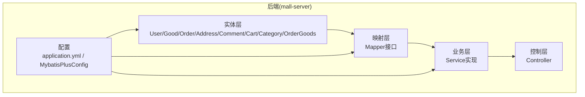
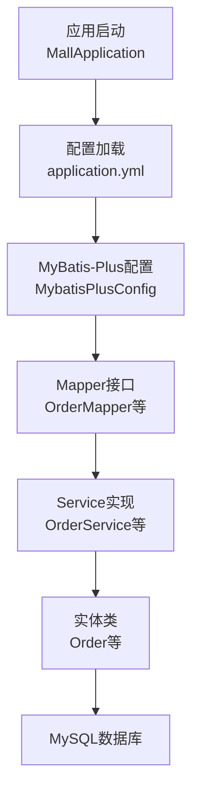
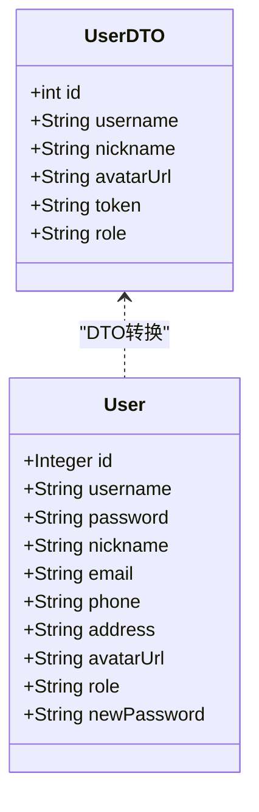
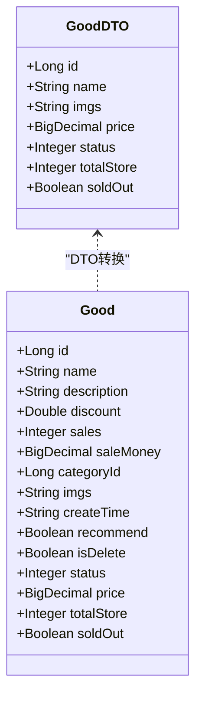
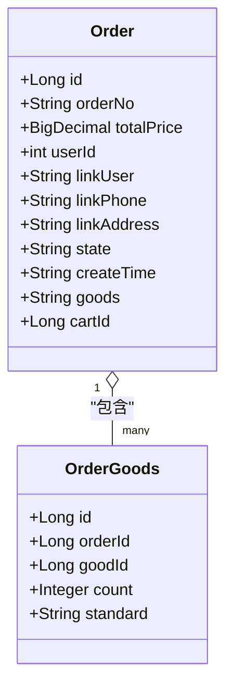
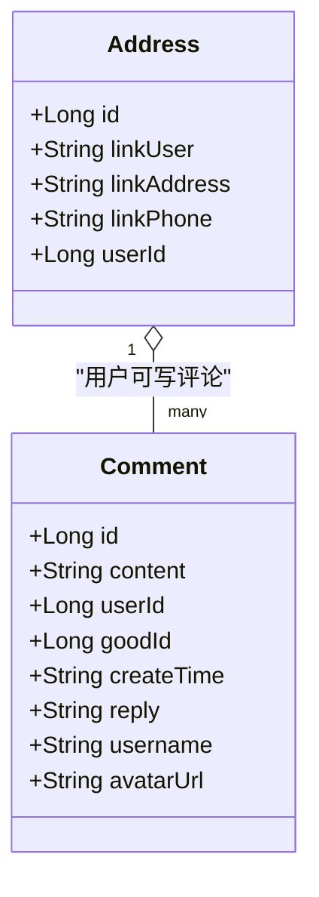
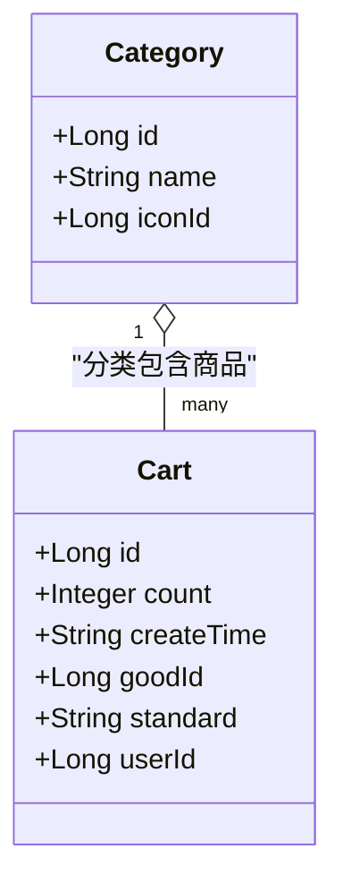
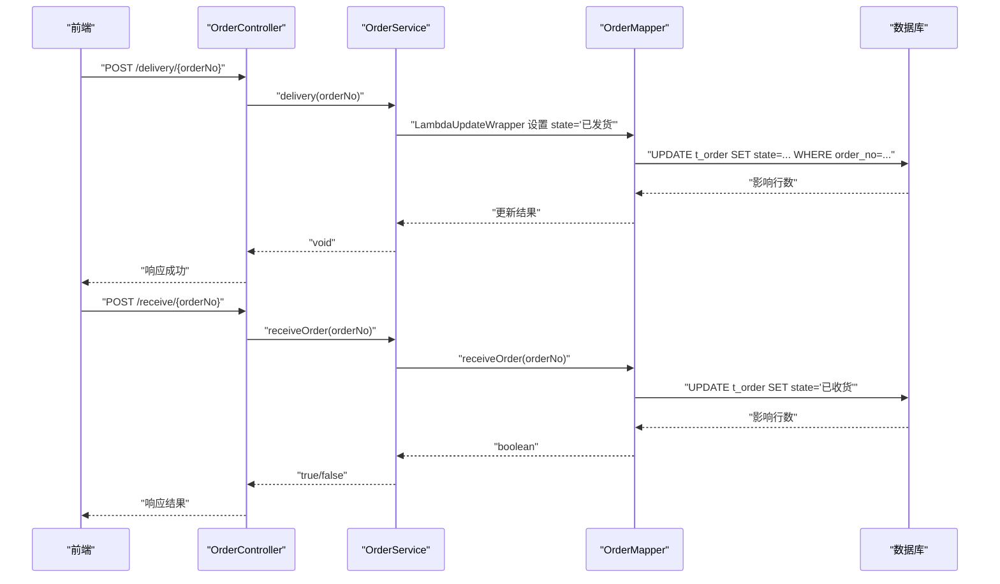
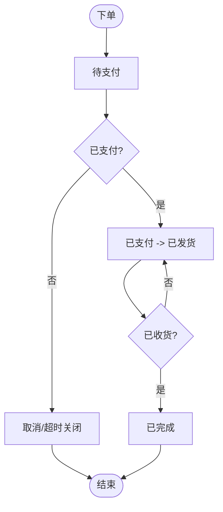
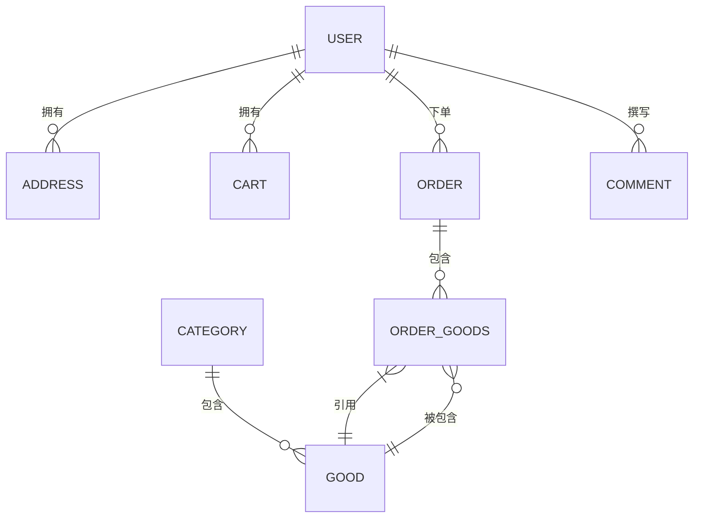

# 数据模型概念

<cite>
**本文引用的文件**
- [User.java](file://mall-server/src/main/java/com/rabbiter/em/entity/User.java)
- [Good.java](file://mall-server/src/main/java/com/rabbiter/em/entity/Good.java)
- [Order.java](file://mall-server/src/main/java/com/rabbiter/em/entity/Order.java)
- [Address.java](file://mall-server/src/main/java/com/rabbiter/em/entity/Address.java)
- [Comment.java](file://mall-server/src/main/java/com/rabbiter/em/entity/Comment.java)
- [Cart.java](file://mall-server/src/main/java/com/rabbiter/em/entity/Cart.java)
- [Category.java](file://mall-server/src/main/java/com/rabbiter/em/entity/Category.java)
- [OrderGoods.java](file://mall-server/src/main/java/com/rabbiter/em/entity/OrderGoods.java)
- [AuthorityType.java](file://mall-server/src/main/java/com/rabbiter/em/entity/AuthorityType.java)
- [GoodDTO.java](file://mall-server/src/main/java/com/rabbiter/em/entity/dto/GoodDTO.java)
- [UserDTO.java](file://mall-server/src/main/java/com/rabbiter/em/entity/dto/UserDTO.java)
- [application.yml](file://mall-server/src/main/resources/application.yml)
- [MybatisPlusConfig.java](file://mall-server/src/main/java/com/rabbiter/em/config/MybatisPlusConfig.java)
- [OrderMapper.java](file://mall-server/src/main/java/com/rabbiter/em/mapper/OrderMapper.java)
- [OrderService.java](file://mall-server/src/main/java/com/rabbiter/em/service/OrderService.java)
- [DATABASE_DESIGN.md](file://DATABASE_DESIGN.md)
</cite>

## 目录
1. [引言](#引言)
2. [项目结构](#项目结构)
3. [核心组件](#核心组件)
4. [架构总览](#架构总览)
5. [详细组件分析](#详细组件分析)
6. [依赖分析](#依赖分析)
7. [性能考虑](#性能考虑)
8. [故障排查指南](#故障排查指南)
9. [结论](#结论)
10. [附录](#附录)

## 引言
本文件面向cosplay商城系统，系统性阐述后端数据模型的概念设计与业务抽象，重点覆盖以下方面：
- 实体类与数据库表的映射关系
- ORM框架（MyBatis-Plus）的使用方式
- 业务实体设计原则（用户、商品、订单、地址、评论等）
- 数据模型的继承关系、组合关系与聚合关系
- 枚举类型的应用（如权限控制、订单状态等）
- 数据模型的序列化与反序列化，以及与前端交互的数据格式转换

## 项目结构
后端采用标准的分层架构：entity（实体）、mapper（持久层）、service（业务层）、controller（接口层），配合MyBatis-Plus实现ORM映射与分页插件。

**图表来源**
- [application.yml:1-42](file://mall-server/src/main/resources/application.yml#L1-L42)
- [MybatisPlusConfig.java:1-21](file://mall-server/src/main/java/com/rabbiter/em/config/MybatisPlusConfig.java#L1-L21)

**章节来源**
- [application.yml:1-42](file://mall-server/src/main/resources/application.yml#L1-L42)
- [MybatisPlusConfig.java:1-21](file://mall-server/src/main/java/com/rabbiter/em/config/MybatisPlusConfig.java#L1-L21)

## 核心组件
本节概述系统的核心实体及职责边界，强调与数据库表的映射关系与业务规则约束。

- 用户(User)
  - 表映射：sys_user
  - 关键属性：用户名、昵称、邮箱、手机号、头像、角色等
  - 设计要点：密码字段通过注解避免序列化泄露；新增password字段用于更新时的临时载体
- 商品(Good)
  - 表映射：good
  - 关键属性：名称、折扣、销量、销售额、分类、图片、创建时间、推荐标志、逻辑删除、状态
  - 设计要点：部分计算字段(price、totalStore、soldOut)在实体中以非持久化字段存在，便于前后端交互
- 订单(Order)
  - 表映射：t_order
  - 关键属性：订单号、总价、下单人ID、联系人、电话、地址、状态、创建时间
  - 设计要点：goods/cartId为非持久化字段，用于承载订单商品明细或购物车ID
- 地址(Address)
  - 表映射：address
  - 关键属性：联系人、地址、电话、所属用户ID
- 评论(Comment)
  - 表映射：comment
  - 关键属性：内容、用户ID、商品ID、回复、创建时间
  - 设计要点：username/avatarUrl为非持久化字段，用于返回前端展示
- 购物车(Cart)
  - 表映射：cart
  - 关键属性：数量、加入时间、商品ID、规格、用户ID
- 分类(Category)
  - 表映射：category
  - 关键属性：名称、图标ID
- 订单-商品(OrderGoods)
  - 表映射：order_goods
  - 关键属性：订单ID、商品ID、数量、规格

**章节来源**
- [User.java:1-123](file://mall-server/src/main/java/com/rabbiter/em/entity/User.java#L1-L123)
- [Good.java:1-232](file://mall-server/src/main/java/com/rabbiter/em/entity/Good.java#L1-L232)
- [Order.java:1-171](file://mall-server/src/main/java/com/rabbiter/em/entity/Order.java#L1-L171)
- [Address.java:1-86](file://mall-server/src/main/java/com/rabbiter/em/entity/Address.java#L1-L86)
- [Comment.java:1-94](file://mall-server/src/main/java/com/rabbiter/em/entity/Comment.java#L1-L94)
- [Cart.java:1-97](file://mall-server/src/main/java/com/rabbiter/em/entity/Cart.java#L1-L97)
- [Category.java:1-57](file://mall-server/src/main/java/com/rabbiter/em/entity/Category.java#L1-L57)
- [OrderGoods.java:1-86](file://mall-server/src/main/java/com/rabbiter/em/entity/OrderGoods.java#L1-L86)

## 架构总览
系统采用MyBatis-Plus作为ORM框架，结合Spring Boot自动装配与配置，实现：
- 实体类与数据库表的自动映射（@TableName/@TableId/@TableField）
- 分页插件（PaginationInnerInterceptor）统一处理分页
- 驼峰命名自动映射（map-underscore-to-camel-case）

**图表来源**
- [application.yml:38-42](file://mall-server/src/main/resources/application.yml#L38-L42)
- [MybatisPlusConfig.java:10-20](file://mall-server/src/main/java/com/rabbiter/em/config/MybatisPlusConfig.java#L10-L20)
- [OrderMapper.java:1-25](file://mall-server/src/main/java/com/rabbiter/em/mapper/OrderMapper.java#L1-L25)
- [OrderService.java:152-183](file://mall-server/src/main/java/com/rabbiter/em/service/OrderService.java#L152-L183)

**章节来源**
- [application.yml:38-42](file://mall-server/src/main/resources/application.yml#L38-L42)
- [MybatisPlusConfig.java:1-21](file://mall-server/src/main/java/com/rabbiter/em/config/MybatisPlusConfig.java#L1-L21)

## 详细组件分析

### 用户(User)实体
- ORM映射：@TableName("sys_user")，主键自增
- 安全设计：密码字段标注忽略序列化，避免敏感信息外泄
- DTO交互：UserDTO用于登录/注册后的用户信息封装与令牌传递

**图表来源**
- [User.java:9-106](file://mall-server/src/main/java/com/rabbiter/em/entity/User.java#L9-L106)
- [UserDTO.java:1-71](file://mall-server/src/main/java/com/rabbiter/em/entity/dto/UserDTO.java#L1-L71)

**章节来源**
- [User.java:1-123](file://mall-server/src/main/java/com/rabbiter/em/entity/User.java#L1-L123)
- [UserDTO.java:1-71](file://mall-server/src/main/java/com/rabbiter/em/entity/dto/UserDTO.java#L1-L71)

### 商品(Good)实体
- ORM映射：@TableName("good")，主键Long类型
- 业务字段：折扣、销量、销售额、分类、图片、创建时间、推荐、逻辑删除、状态
- 计算字段：price、totalStore、soldOut为非持久化字段，便于前端渲染与交互

**图表来源**
- [Good.java:11-229](file://mall-server/src/main/java/com/rabbiter/em/entity/Good.java#L11-L229)
- [GoodDTO.java:1-83](file://mall-server/src/main/java/com/rabbiter/em/entity/dto/GoodDTO.java#L1-L83)

**章节来源**
- [Good.java:1-232](file://mall-server/src/main/java/com/rabbiter/em/entity/Good.java#L1-L232)
- [GoodDTO.java:1-83](file://mall-server/src/main/java/com/rabbiter/em/entity/dto/GoodDTO.java#L1-L83)

### 订单(Order)实体与订单-商品(OrderGoods)关联
- 订单表：t_order，包含订单号、总价、下单人ID、联系信息、状态、创建时间
- 订单商品表：order_goods，记录订单内具体商品项（商品ID、数量、规格）
- 非持久化字段：goods/cartId用于承载订单商品明细或购物车ID

**图表来源**
- [Order.java:11-153](file://mall-server/src/main/java/com/rabbiter/em/entity/Order.java#L11-L153)
- [OrderGoods.java:8-74](file://mall-server/src/main/java/com/rabbiter/em/entity/OrderGoods.java#L8-L74)

**章节来源**
- [Order.java:1-171](file://mall-server/src/main/java/com/rabbiter/em/entity/Order.java#L1-L171)
- [OrderGoods.java:1-86](file://mall-server/src/main/java/com/rabbiter/em/entity/OrderGoods.java#L1-L86)

### 地址(Address)与评论(Comment)
- 地址：address，支持用户维护多个收货地址
- 评论：comment，支持用户对商品进行评价与回复，username/avatarUrl为非持久化字段用于前端展示

**图表来源**
- [Address.java:8-74](file://mall-server/src/main/java/com/rabbiter/em/entity/Address.java#L8-L74)
- [Comment.java:9-92](file://mall-server/src/main/java/com/rabbiter/em/entity/Comment.java#L9-L92)

**章节来源**
- [Address.java:1-86](file://mall-server/src/main/java/com/rabbiter/em/entity/Address.java#L1-L86)
- [Comment.java:1-94](file://mall-server/src/main/java/com/rabbiter/em/entity/Comment.java#L1-L94)

### 购物车(Cart)与分类(Category)
- 购物车：cart，记录用户选择的商品、规格与数量
- 分类：category，商品分类，包含图标ID

**图表来源**
- [Cart.java:8-84](file://mall-server/src/main/java/com/rabbiter/em/entity/Cart.java#L8-L84)
- [Category.java:9-47](file://mall-server/src/main/java/com/rabbiter/em/entity/Category.java#L9-L47)

**章节来源**
- [Cart.java:1-97](file://mall-server/src/main/java/com/rabbiter/em/entity/Cart.java#L1-L97)
- [Category.java:1-57](file://mall-server/src/main/java/com/rabbiter/em/entity/Category.java#L1-L57)

### 订单状态流转（序列图）
以下序列图展示“确认收货”与“发货”的典型流程，体现服务层对Mapper的调用与状态更新。

**图表来源**
- [OrderService.java:176-181](file://mall-server/src/main/java/com/rabbiter/em/service/OrderService.java#L176-L181)
- [OrderMapper.java:13-20](file://mall-server/src/main/java/com/rabbiter/em/mapper/OrderMapper.java#L13-L20)

**章节来源**
- [OrderService.java:152-183](file://mall-server/src/main/java/com/rabbiter/em/service/OrderService.java#L152-L183)
- [OrderMapper.java:1-25](file://mall-server/src/main/java/com/rabbiter/em/mapper/OrderMapper.java#L1-L25)

### 订单状态流程（流程图）
订单状态从“待支付”到“已发货”再到“已收货”，体现典型的电商订单生命周期。

[此图为概念流程，无需图表来源]

## 依赖分析
基于数据库设计文档，系统实体间存在如下关系：
- 用户与地址、购物车、订单、评论是一对多关系
- 分类与商品是一对多关系
- 商品与订单商品是多对一关系
- 订单与订单商品是多对一关系

**图表来源**
- [DATABASE_DESIGN.md:5-83](file://DATABASE_DESIGN.md#L5-L83)

**章节来源**
- [DATABASE_DESIGN.md:1-223](file://DATABASE_DESIGN.md#L1-L223)

## 性能考虑
- 分页优化：MyBatis-Plus分页拦截器限制最大每页条数，避免大页扫描导致的性能问题
- 字段映射：开启驼峰命名映射，减少手写映射配置成本
- 查询策略：针对高频查询（如按用户ID查询订单）建议在Mapper中添加索引与参数化SQL
- 缓存策略：Redis配置已提供，可在热点数据（如商品详情、分类列表）引入缓存

**章节来源**
- [MybatisPlusConfig.java:12-19](file://mall-server/src/main/java/com/rabbiter/em/config/MybatisPlusConfig.java#L12-L19)
- [application.yml:22-33](file://mall-server/src/main/resources/application.yml#L22-L33)

## 故障排查指南
- 订单状态更新失败
  - 检查OrderMapper中状态更新语句是否正确执行
  - 确认OrderService中LambdaUpdateWrapper条件是否匹配唯一订单
- DTO与实体字段不一致
  - 核对DTO与实体的字段映射关系，确保序列化/反序列化时字段名一致
- 订单导出/查询异常
  - 检查selectExport/selectByUserId等Mapper方法的SQL与参数绑定
- 数据库连接与编码
  - 确认application.yml中的数据库URL、账号、密码与字符集设置

**章节来源**
- [OrderMapper.java:1-25](file://mall-server/src/main/java/com/rabbiter/em/mapper/OrderMapper.java#L1-L25)
- [OrderService.java:159-181](file://mall-server/src/main/java/com/rabbiter/em/service/OrderService.java#L159-L181)
- [application.yml:9-13](file://mall-server/src/main/resources/application.yml#L9-L13)

## 结论
本数据模型以MyBatis-Plus为核心，围绕用户、商品、订单、地址、评论等核心实体构建，通过DTO实现前后端数据隔离与安全传输。实体与数据库表映射清晰，业务规则明确，具备良好的扩展性与可维护性。建议后续在热点数据引入缓存、完善订单状态机与审计日志，进一步提升系统稳定性与可观测性。

## 附录

### 枚举类型与权限控制
- 权限类型枚举：用于接口访问控制策略（requireLogin、requireAuthority、noRequire）
- 订单状态：由字符串表示，服务层通过状态更新方法进行流转

**章节来源**
- [AuthorityType.java:1-8](file://mall-server/src/main/java/com/rabbiter/em/entity/AuthorityType.java#L1-L8)
- [OrderService.java:176-181](file://mall-server/src/main/java/com/rabbiter/em/service/OrderService.java#L176-L181)

### 数据模型与数据库表映射对照
- sys_user ↔ User
- good ↔ Good
- t_order ↔ Order
- address ↔ Address
- comment ↔ Comment
- cart ↔ Cart
- category ↔ Category
- order_goods ↔ OrderGoods

**章节来源**
- [DATABASE_DESIGN.md:87-223](file://DATABASE_DESIGN.md#L87-L223)
- [User.java](file://mall-server/src/main/java/com/rabbiter/em/entity/User.java#L9)
- [Good.java](file://mall-server/src/main/java/com/rabbiter/em/entity/Good.java#L11)
- [Order.java](file://mall-server/src/main/java/com/rabbiter/em/entity/Order.java#L11)
- [Address.java](file://mall-server/src/main/java/com/rabbiter/em/entity/Address.java#L8)
- [Comment.java](file://mall-server/src/main/java/com/rabbiter/em/entity/Comment.java#L9)
- [Cart.java](file://mall-server/src/main/java/com/rabbiter/em/entity/Cart.java#L8)
- [Category.java](file://mall-server/src/main/java/com/rabbiter/em/entity/Category.java#L9)
- [OrderGoods.java](file://mall-server/src/main/java/com/rabbiter/em/entity/OrderGoods.java#L8)