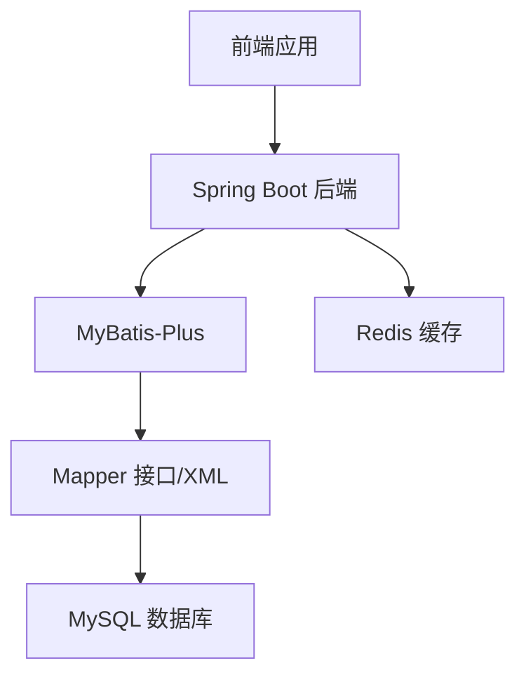
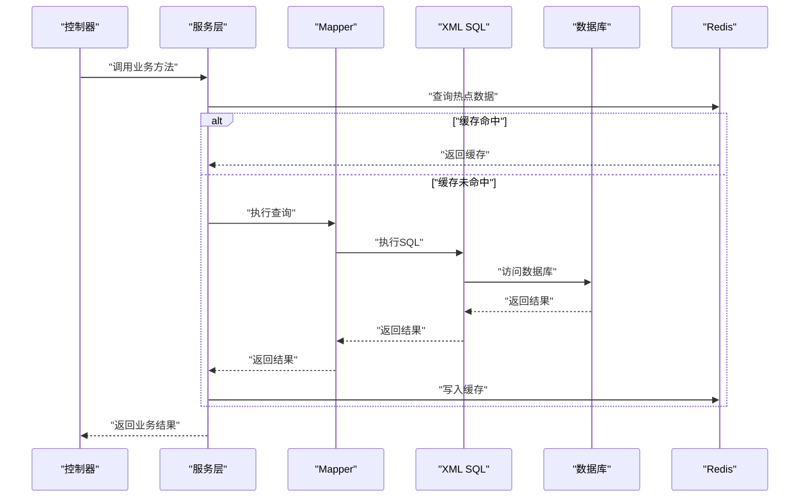
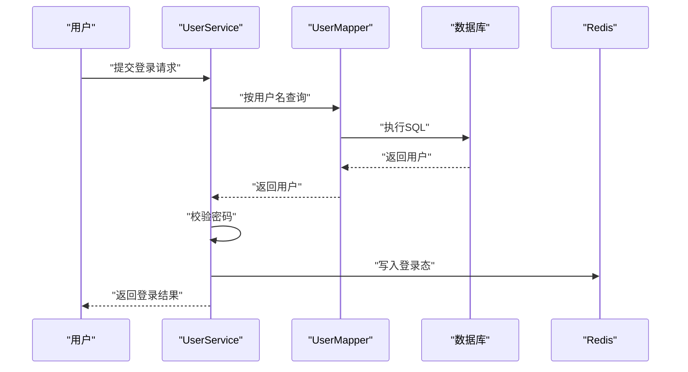
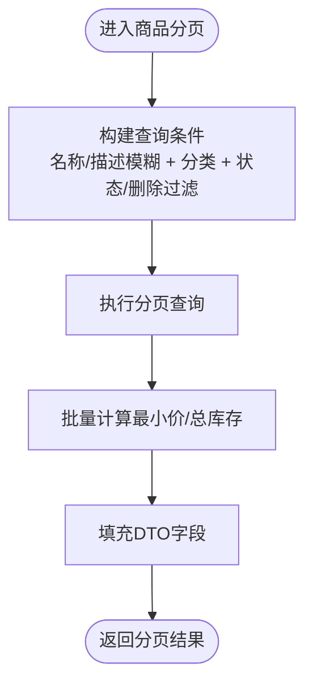
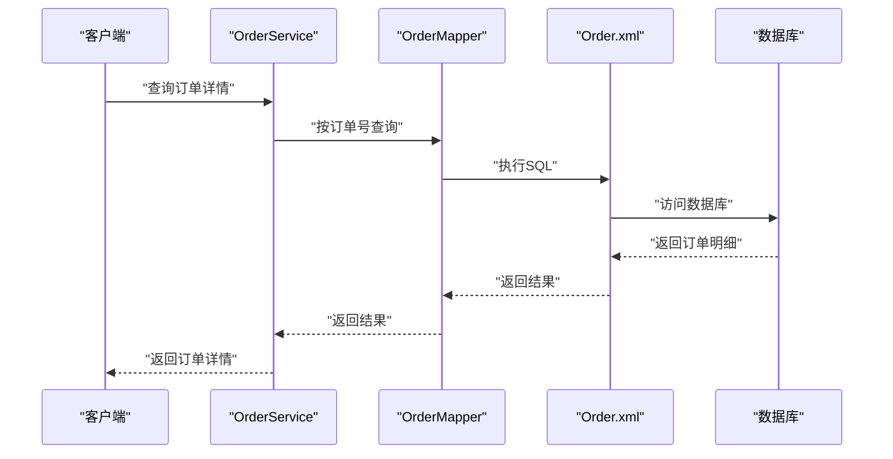
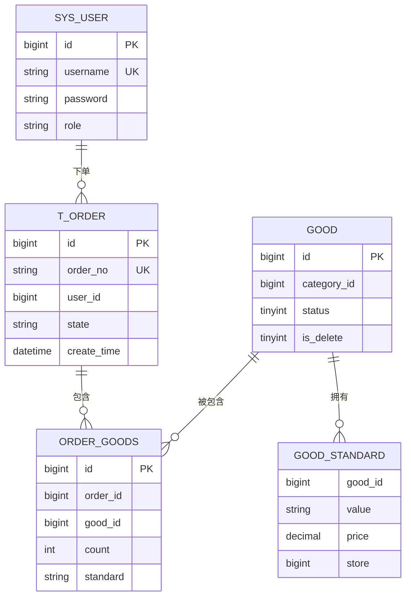
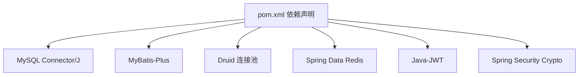

# 索引与性能优化

<cite>
**本文引用的文件**
- [DATABASE_DESIGN.md](file://DATABASE_DESIGN.md)
- [application.yml](file://mall-server/src/main/resources/application.yml)
- [MybatisPlusConfig.java](file://mall-server/src/main/java/com/rabbiter/em/config/MybatisPlusConfig.java)
- [User.java](file://mall-server/src/main/java/com/rabbiter/em/entity/User.java)
- [Good.java](file://mall-server/src/main/java/com/rabbiter/em/entity/Good.java)
- [Order.java](file://mall-server/src/main/java/com/rabbiter/em/entity/Order.java)
- [UserMapper.java](file://mall-server/src/main/java/com/rabbiter/em/mapper/UserMapper.java)
- [GoodMapper.java](file://mall-server/src/main/java/com/rabbiter/em/mapper/GoodMapper.java)
- [OrderMapper.java](file://mall-server/src/main/java/com/rabbiter/em/mapper/OrderMapper.java)
- [User.xml](file://mall-server/src/main/resources/mapper/User.xml)
- [GoodMapper.xml](file://mall-server/src/main/resources/mapper/GoodMapper.xml)
- [Order.xml](file://mall-server/src/main/resources/mapper/Order.xml)
- [UserService.java](file://mall-server/src/main/java/com/rabbiter/em/service/UserService.java)
- [GoodService.java](file://mall-server/src/main/java/com/rabbiter/em/service/GoodService.java)
- [OrderService.java](file://mall-server/src/main/java/com/rabbiter/em/service/OrderService.java)
- [pom.xml](file://mall-server/pom.xml)
</cite>

## 目录
1. [简介](#简介)
2. [项目结构](#项目结构)
3. [核心组件](#核心组件)
4. [架构总览](#架构总览)
5. [详细组件分析](#详细组件分析)
6. [依赖分析](#依赖分析)
7. [性能考量](#性能考量)
8. [故障排查指南](#故障排查指南)
9. [结论](#结论)
10. [附录](#附录)

## 简介
本文件面向cosplay商城系统的数据库索引与性能优化，结合现有代码与数据库设计文档，系统性梳理主键索引、唯一索引、普通索引与复合索引的设计原则与应用；针对高频查询字段（用户ID、商品ID、订单号、用户名等）提出索引策略；总结WHERE条件、JOIN与排序优化要点；给出慢查询日志与性能监控建议；并覆盖连接池、事务隔离与锁机制优化、分页、全文检索与模糊匹配、以及大数据量场景下的表分区与读写分离策略。

## 项目结构
系统采用Spring Boot + MyBatis-Plus + MySQL架构，核心模块包括：
- 实体层：User、Good、Order等模型映射数据库表
- Mapper层：定义SQL与XML映射，承载查询与更新
- Service层：封装业务逻辑，实现事务控制与缓存交互
- 配置层：MyBatis-Plus分页插件、数据源与Redis配置

**章节来源**
- [application.yml:1-42](file://mall-server/src/main/resources/application.yml#L1-L42)
- [MybatisPlusConfig.java:1-21](file://mall-server/src/main/java/com/rabbiter/em/config/MybatisPlusConfig.java#L1-L21)

## 核心组件
- 实体与表结构：用户、商品、订单、地址、评论、购物车、轮播图、公告等
- 查询与更新：通过Mapper接口与XML定义SQL，配合Service层执行业务逻辑
- 分页：MyBatis-Plus内置分页拦截器，限制最大每页条数
- 缓存：Redis用于热点数据缓存（如商品详情、用户登录态）

**章节来源**
- [DATABASE_DESIGN.md:87-223](file://DATABASE_DESIGN.md#L87-L223)
- [User.java:9-21](file://mall-server/src/main/java/com/rabbiter/em/entity/User.java#L9-L21)
- [Good.java:11-87](file://mall-server/src/main/java/com/rabbiter/em/entity/Good.java#L11-L87)
- [Order.java:11-66](file://mall-server/src/main/java/com/rabbiter/em/entity/Order.java#L11-L66)
- [MybatisPlusConfig.java:12-19](file://mall-server/src/main/java/com/rabbiter/em/config/MybatisPlusConfig.java#L12-L19)

## 架构总览
系统整体以“服务层驱动查询”的方式组织，查询路径通常为：Controller → Service → Mapper → SQL → DB；热点数据通过Redis缓存降低DB压力。

**图表来源**
- [UserService.java:44-75](file://mall-server/src/main/java/com/rabbiter/em/service/UserService.java#L44-L75)
- [GoodService.java:52-75](file://mall-server/src/main/java/com/rabbiter/em/service/GoodService.java#L52-L75)
- [OrderService.java:58-88](file://mall-server/src/main/java/com/rabbiter/em/service/OrderService.java#L58-L88)

## 详细组件分析

### 用户模块：登录与查询
- 登录流程：根据用户名精确匹配，随后进行密码校验，成功后写入Redis缓存
- 用户名查询：基于用户名等值查询，适合在用户名字段建立唯一索引
- 列表与分页：早期XML中存在模糊查询与分页SQL，但当前Mapper接口未使用

**图表来源**
- [UserService.java:44-75](file://mall-server/src/main/java/com/rabbiter/em/service/UserService.java#L44-L75)
- [UserMapper.java:7-27](file://mall-server/src/main/java/com/rabbiter/em/mapper/UserMapper.java#L7-L27)
- [User.xml:18-34](file://mall-server/src/main/resources/mapper/User.xml#L18-L34)

**章节来源**
- [UserService.java:44-75](file://mall-server/src/main/java/com/rabbiter/em/service/UserService.java#L44-L75)
- [UserMapper.java:7-27](file://mall-server/src/main/java/com/rabbiter/em/mapper/UserMapper.java#L7-L27)
- [User.xml:18-34](file://mall-server/src/main/resources/mapper/User.xml#L18-L34)

### 商品模块：推荐、价格与库存
- 首页推荐与价格计算：通过LEFT JOIN与聚合函数，需在good.id与good_standard.good_id建立索引
- 批量最小价与总库存：IN子句批量查询，需确保good_standard.good_id与good.id高效回表
- 分页与模糊查询：支持按名称/描述模糊查询与分类筛选，需在name、description、category_id、status、is_delete等字段设计索引

**图表来源**
- [GoodService.java:186-224](file://mall-server/src/main/java/com/rabbiter/em/service/GoodService.java#L186-L224)
- [GoodMapper.xml:12-14](file://mall-server/src/main/resources/mapper/GoodMapper.xml#L12-L14)
- [GoodMapper.xml:16-31](file://mall-server/src/main/resources/mapper/GoodMapper.xml#L16-L31)

**章节来源**
- [GoodService.java:186-224](file://mall-server/src/main/java/com/rabbiter/em/service/GoodService.java#L186-L224)
- [GoodMapper.xml:12-14](file://mall-server/src/main/resources/mapper/GoodMapper.xml#L12-L14)
- [GoodMapper.xml:16-31](file://mall-server/src/main/resources/mapper/GoodMapper.xml#L16-L31)

### 订单模块：订单号与用户订单
- 订单号查询：INNER JOIN多表获取订单详情，需在t_order.order_no与order_goods.good_id建立索引
- 用户订单查询：多表连接并按时间倒序，需在t_order.user_id与t_order.create_time建立索引
- 导出报表：LIKE模糊匹配订单号，需评估索引策略与前缀匹配可行性

**图表来源**
- [OrderService.java:155-157](file://mall-server/src/main/java/com/rabbiter/em/service/OrderService.java#L155-L157)
- [Order.xml:19-24](file://mall-server/src/main/resources/mapper/Order.xml#L19-L24)

**章节来源**
- [OrderService.java:155-157](file://mall-server/src/main/java/com/rabbiter/em/service/OrderService.java#L155-L157)
- [Order.xml:19-24](file://mall-server/src/main/resources/mapper/Order.xml#L19-L24)

### 数据模型与索引设计建议
基于ER图与查询模式，建议如下索引策略：

- 主键索引
  - 所有表主键（如sys_user.id、good.id、t_order.id等）默认已具备主键索引，无需额外设计

- 唯一索引
  - 用户名：在sys_user.username建立唯一索引，支撑登录与去重
  - 订单号：在t_order.order_no建立唯一索引，保证幂等与快速定位
  - 商品规格组合：在good_standard.good_id + value建立唯一索引，避免重复规格

- 普通索引
  - 用户：sys_user.id（主键）、username（唯一）
  - 商品：good.id（主键）、category_id、status、is_delete
  - 订单：t_order.id（主键）、user_id、order_no（唯一）、state、create_time
  - 订单商品：order_goods.order_id、order_goods.good_id
  - 地址：address.user_id
  - 评论：comment.user_id、comment.good_id

- 复合索引
  - 商品分页与筛选：(status, is_delete, category_id, id) 或 (is_delete, status, category_id, id)
  - 商品模糊查询：(is_delete, status) 组合 + LIKE字段（考虑前缀匹配或全文索引）
  - 订单用户查询：(user_id, create_time) 复合索引，满足WHERE与ORDER BY
  - 订单号详情：(order_no, good_id) 复合索引，提升多表连接效率

**图表来源**
- [DATABASE_DESIGN.md:5-83](file://DATABASE_DESIGN.md#L5-L83)
- [User.java:13-21](file://mall-server/src/main/java/com/rabbiter/em/entity/User.java#L13-L21)
- [Order.java:21-32](file://mall-server/src/main/java/com/rabbiter/em/entity/Order.java#L21-L32)
- [Good.java:49-76](file://mall-server/src/main/java/com/rabbiter/em/entity/Good.java#L49-L76)

**章节来源**
- [DATABASE_DESIGN.md:5-83](file://DATABASE_DESIGN.md#L5-L83)

### 查询优化策略
- WHERE条件优化
  - 使用等值条件优先于范围与LIKE前缀模糊；必要时使用前缀LIKE或全文索引
  - 将可选择性高的列放在WHERE前面，减少回表次数
- JOIN优化
  - 连接列建立索引；小表驱动大表；避免笛卡尔积
  - 使用EXPLAIN分析执行计划，关注是否使用索引与回表
- 排序优化
  - ORDER BY字段与WHERE字段尽量落在同一索引上，避免Using filesort
  - 对时间字段建立索引，避免函数包裹导致索引失效

**章节来源**
- [GoodService.java:186-224](file://mall-server/src/main/java/com/rabbiter/em/service/GoodService.java#L186-L224)
- [Order.xml:13-18](file://mall-server/src/main/resources/mapper/Order.xml#L13-L18)

### 慢查询日志与性能监控
- 开启慢查询日志：设置阈值（如1秒），记录超过阈值的SQL
- 结合EXPLAIN分析：查看key、rows、Extra等字段，识别索引缺失与全表扫描
- 监控指标：QPS、TPS、连接数、锁等待、缓冲池命中率、磁盘I/O
- 周期性复盘：对高频率慢SQL制定优化方案并验证

[本节为通用实践指导，不直接分析具体文件]

### 数据库连接池、事务与锁优化
- 连接池
  - 使用Druid连接池，合理配置最大活跃、最小空闲、最大等待时间
  - 避免长事务与大事务，及时释放连接
- 事务隔离级别
  - 默认READ_COMMITTED即可满足大多数场景；避免使用REPEATABLE_READ以上造成锁竞争
- 锁机制
  - 行锁：尽量走索引，避免间隙锁扩大；批量更新使用分批提交
  - 死锁预防：统一更新顺序，避免循环等待

**章节来源**
- [pom.xml:40-45](file://mall-server/pom.xml#L40-L45)
- [application.yml:9-13](file://mall-server/src/main/resources/application.yml#L9-L13)

### 分页、全文检索与模糊匹配
- 分页
  - 已启用MyBatis-Plus分页拦截器，限制最大每页条数，防止超大偏移
  - 大数据量分页建议使用“游标翻页”或“基于索引的limit优化”
- 全文检索
  - MySQL可使用全文索引（InnoDB引擎）或外部ES/Elasticsearch
- 模糊匹配
  - LIKE '%keyword%'无法使用索引，建议前缀匹配或全文索引
  - 对用户名、订单号等高选择性字段优先等值匹配

**章节来源**
- [MybatisPlusConfig.java:12-19](file://mall-server/src/main/java/com/rabbiter/em/config/MybatisPlusConfig.java#L12-L19)
- [GoodService.java:186-224](file://mall-server/src/main/java/com/rabbiter/em/service/GoodService.java#L186-L224)

### 大数据量下的表分区与读写分离
- 表分区
  - 按时间字段（如create_time）进行水平分区，降低冷数据扫描
- 读写分离
  - 主库写入（订单、库存变更），从库读取（商品列表、用户查询）
  - 结合Redis缓存热点数据，进一步降低数据库压力

[本节为通用实践指导，不直接分析具体文件]

## 依赖分析
系统主要依赖包括MySQL驱动、MyBatis-Plus、Druid连接池、Redis等。

**图表来源**
- [pom.xml:20-100](file://mall-server/pom.xml#L20-L100)

**章节来源**
- [pom.xml:20-100](file://mall-server/pom.xml#L20-L100)

## 性能考量
- 热点数据缓存：商品详情、用户登录态通过Redis缓存，显著降低DB压力
- 索引设计：围绕高频查询字段与查询模式建立唯一/普通/复合索引
- SQL优化：避免SELECT *、函数包裹索引列、减少不必要的JOIN与排序
- 连接池与事务：合理配置连接池参数，避免长事务与死锁
- 分页与全文：使用游标分页与全文索引提升查询效率

[本节为通用实践指导，不直接分析具体文件]

## 故障排查指南
- 登录失败
  - 检查用户名是否存在、密码校验逻辑、Redis写入是否成功
- 商品查询异常
  - 核对is_delete与status过滤条件、检查批量最小价/库存查询是否返回空集合
- 订单查询慢
  - 使用EXPLAIN分析order_no与good_id连接是否命中索引，确认create_time排序是否使用索引
- 分页数据异常
  - 检查分页拦截器配置与最大每页条数限制

**章节来源**
- [UserService.java:44-75](file://mall-server/src/main/java/com/rabbiter/em/service/UserService.java#L44-L75)
- [GoodService.java:257-279](file://mall-server/src/main/java/com/rabbiter/em/service/GoodService.java#L257-L279)
- [Order.xml:19-24](file://mall-server/src/main/resources/mapper/Order.xml#L19-L24)
- [MybatisPlusConfig.java:16](file://mall-server/src/main/java/com/rabbiter/em/config/MybatisPlusConfig.java#L16)

## 结论
通过对实体与查询模式的分析，建议围绕用户名、订单号、用户ID、商品ID、分类ID、状态与删除标志等高频字段建立完善的索引体系；结合Redis缓存与合理的分页策略，可在保证功能完整性的同时显著提升查询性能；配合慢查询日志与EXPLAIN分析，持续迭代优化SQL与索引设计。

## 附录
- 索引设计清单（建议）
  - sys_user(username唯一)
  - t_order(order_no唯一, user_id, create_time)
  - order_goods(order_id, good_id)
  - good(category_id, status, is_delete, id)
  - comment(user_id, good_id)
  - address(user_id)
  - good_standard(good_id, value唯一)

[本节为通用实践指导，不直接分析具体文件]