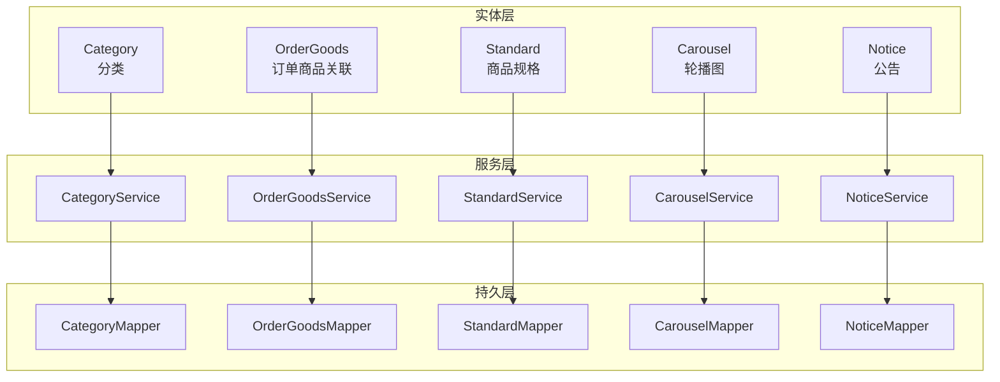
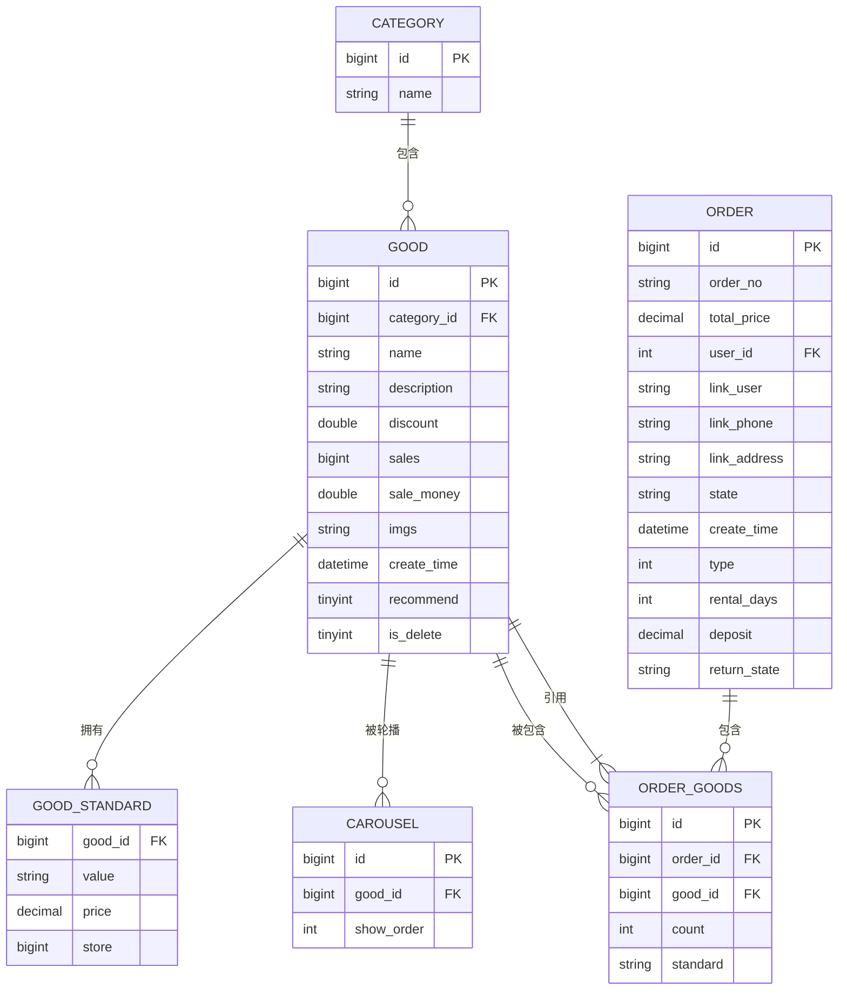
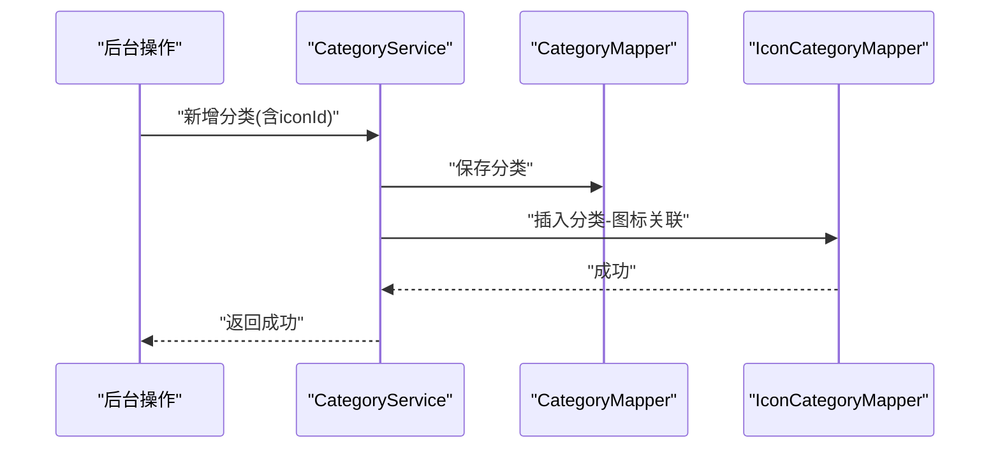
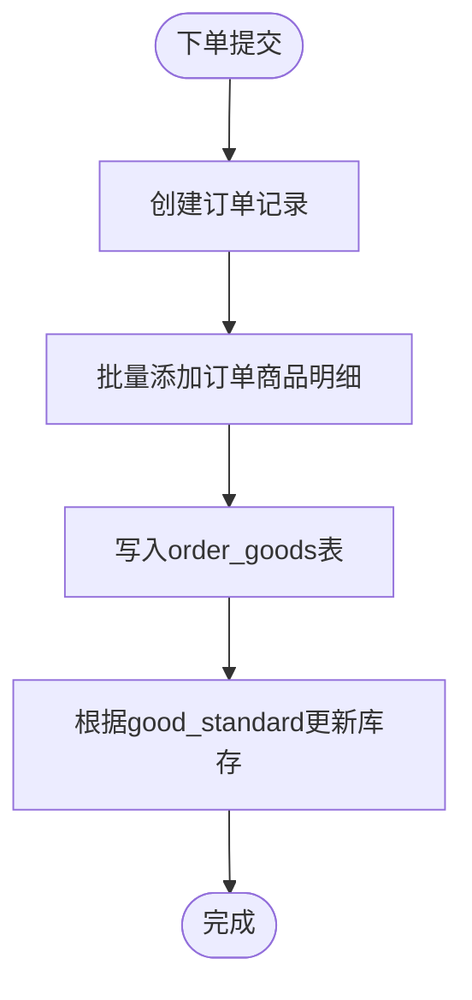
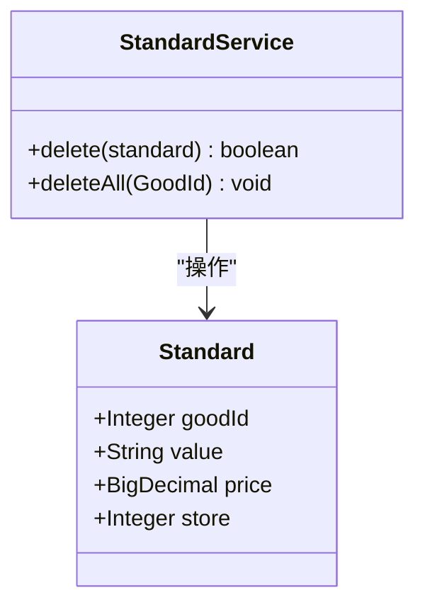
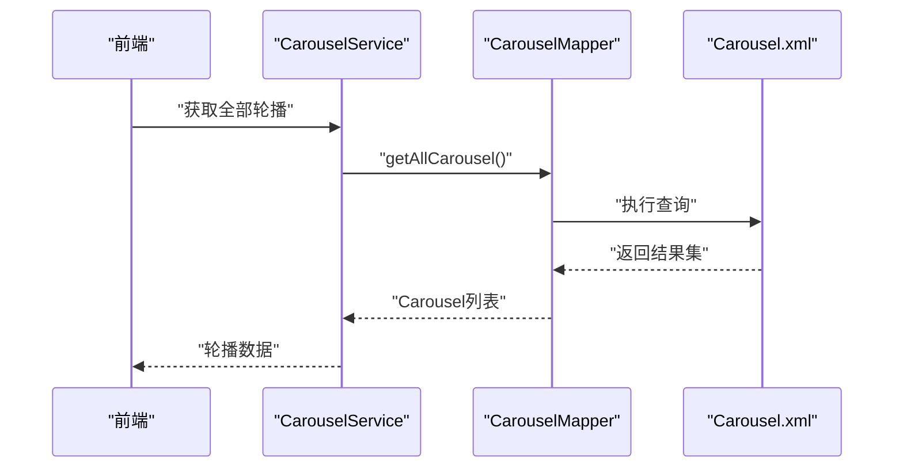
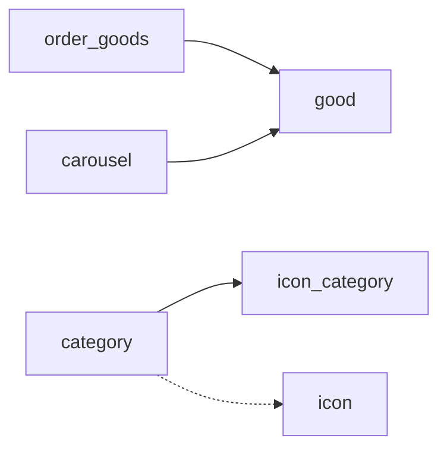

# 关联与引用表

<cite>
**本文档引用的文件**
- [Category.java](file://mall-server/src/main/java/com/rabbiter/em/entity/Category.java)
- [OrderGoods.java](file://mall-server/src/main/java/com/rabbiter/em/entity/OrderGoods.java)
- [Standard.java](file://mall-server/src/main/java/com/rabbiter/em/entity/Standard.java)
- [Carousel.java](file://mall-server/src/main/java/com/rabbiter/em/entity/Carousel.java)
- [Notice.java](file://mall-server/src/main/java/com/rabbiter/em/entity/Notice.java)
- [CategoryService.java](file://mall-server/src/main/java/com/rabbiter/em/service/CategoryService.java)
- [OrderGoodsService.java](file://mall-server/src/main/java/com/rabbiter/em/service/OrderGoodsService.java)
- [StandardService.java](file://mall-server/src/main/java/com/rabbiter/em/service/StandardService.java)
- [CarouselService.java](file://mall-server/src/main/java/com/rabbiter/em/service/CarouselService.java)
- [NoticeService.java](file://mall-server/src/main/java/com/rabbiter/em/service/NoticeService.java)
- [Category.xml](file://mall-server/src/main/resources/mapper/Category.xml)
- [OrderGoods.xml](file://mall-server/src/main/resources/mapper/OrderGoods.xml)
- [Standard.xml](file://mall-server/src/main/resources/mapper/Standard.xml)
- [Carousel.xml](file://mall-server/src/main/resources/mapper/Carousel.xml)
- [DATABASE_DESIGN.md](file://DATABASE_DESIGN.md)
</cite>

## 目录
1. [引言](#引言)
2. [项目结构](#项目结构)
3. [核心组件](#核心组件)
4. [架构总览](#架构总览)
5. [详细组件分析](#详细组件分析)
6. [依赖分析](#依赖分析)
7. [性能考虑](#性能考虑)
8. [故障排查指南](#故障排查指南)
9. [结论](#结论)
10. [附录](#附录)

## 引言
本文件聚焦于cosplay商城系统中的“关联与引用表”，围绕以下核心表展开：分类表(category)、订单商品关联表(order_goods)、商品规格表(good_standard)、轮播图表(carousel)、公告表(notice)。我们将从表结构设计、业务作用、与其他核心表的关联关系、数据一致性保障机制、多对多关系处理、引用完整性约束与更新策略等方面进行深入解析，并结合实际业务场景帮助开发者掌握复杂业务关系的数据建模方法。

## 项目结构
本项目采用前后端分离架构，后端基于Spring Boot + MyBatis-Plus实现，数据库表结构与实体类一一对应，通过Mapper XML完成复杂查询。关联与引用表主要涉及如下实体与服务：

- 实体层：Category、OrderGoods、Standard、Carousel、Notice
- 服务层：CategoryService、OrderGoodsService、StandardService、CarouselService、NoticeService
- 持久层：各Mapper接口及对应的XML映射文件

**章节来源**
- [Category.java:1-57](file://mall-server/src/main/java/com/rabbiter/em/entity/Category.java#L1-L57)
- [OrderGoods.java:1-86](file://mall-server/src/main/java/com/rabbiter/em/entity/OrderGoods.java#L1-L86)
- [Standard.java:1-72](file://mall-server/src/main/java/com/rabbiter/em/entity/Standard.java#L1-L72)
- [Carousel.java:1-83](file://mall-server/src/main/java/com/rabbiter/em/entity/Carousel.java#L1-L83)
- [Notice.java:1-50](file://mall-server/src/main/java/com/rabbiter/em/entity/Notice.java#L1-L50)
- [CategoryService.java:1-52](file://mall-server/src/main/java/com/rabbiter/em/service/CategoryService.java#L1-L52)
- [OrderGoodsService.java:1-17](file://mall-server/src/main/java/com/rabbiter/em/service/OrderGoodsService.java#L1-L17)
- [StandardService.java:1-31](file://mall-server/src/main/java/com/rabbiter/em/service/StandardService.java#L1-L31)
- [CarouselService.java:1-21](file://mall-server/src/main/java/com/rabbiter/em/service/CarouselService.java#L1-L21)
- [NoticeService.java:1-11](file://mall-server/src/main/java/com/rabbiter/em/service/NoticeService.java#L1-L11)

## 核心组件
本节对五个关联与引用表的结构、职责与交互进行概览式说明。

- 分类表(category)
  - 作用：标识商品所属类别，支持与图标建立关联。
  - 关键字段：id、name；额外存在iconId用于与图标建立关联。
  - 业务要点：新增分类时同时维护分类与图标之间的关联记录，删除分类时需清理关联。

- 订单商品关联表(order_goods)
  - 作用：记录订单中具体包含的商品项，保存购买数量与选中规格。
  - 关键字段：orderId、goodId、count、standard。
  - 业务要点：作为订单与商品之间的多对多桥接表，承载订单明细数据。

- 商品规格表(good_standard)
  - 作用：存储商品不同规格（如尺码、颜色）及其价格与库存。
  - 关键字段：goodId、value、price、store。
  - 业务要点：与商品表形成一对多关系，支撑商品的多样化销售形态。

- 轮播图表(carousel)
  - 作用：首页轮播图配置，按显示顺序展示关联商品。
  - 关键字段：goodId、showOrder；查询时通过联合查询返回商品名称与图片。
  - 业务要点：通过自定义SQL聚合商品信息，简化前端展示。

- 公告表(notice)
  - 作用：系统公告信息管理。
  - 关键字段：title、content、createTime。
  - 业务要点：独立的信息发布载体，不直接参与商品或订单的业务关联。

**章节来源**
- [Category.java:1-57](file://mall-server/src/main/java/com/rabbiter/em/entity/Category.java#L1-L57)
- [OrderGoods.java:1-86](file://mall-server/src/main/java/com/rabbiter/em/entity/OrderGoods.java#L1-L86)
- [Standard.java:1-72](file://mall-server/src/main/java/com/rabbiter/em/entity/Standard.java#L1-L72)
- [Carousel.java:1-83](file://mall-server/src/main/java/com/rabbiter/em/entity/Carousel.java#L1-L83)
- [Notice.java:1-50](file://mall-server/src/main/java/com/rabbiter/em/entity/Notice.java#L1-L50)
- [DATABASE_DESIGN.md:102-220](file://DATABASE_DESIGN.md#L102-L220)

## 架构总览
下图展示了与关联与引用表相关的实体关系与查询路径，体现多对多桥接与一对多聚合的特点。

**图示来源**
- [DATABASE_DESIGN.md:5-83](file://DATABASE_DESIGN.md#L5-L83)

## 详细组件分析

### 分类表(category)与图标关联
- 表结构与实体映射
  - 实体类包含主键id、名称name与图标关联字段iconId。
  - 服务层在新增分类时，会同步插入一条分类-图标关联记录，确保数据一致性。
  - 删除分类时，先清理关联再删除主记录，避免悬挂引用。
- 业务场景
  - 后台新增分类并绑定图标，前端展示时可直接读取分类与图标关联。
  - 删除分类前需检查是否仍有商品引用，避免破坏业务完整性。

**图示来源**
- [CategoryService.java:28-34](file://mall-server/src/main/java/com/rabbiter/em/service/CategoryService.java#L28-L34)

**章节来源**
- [Category.java:1-57](file://mall-server/src/main/java/com/rabbiter/em/entity/Category.java#L1-L57)
- [CategoryService.java:1-52](file://mall-server/src/main/java/com/rabbiter/em/service/CategoryService.java#L1-L52)
- [Category.xml:1-6](file://mall-server/src/main/resources/mapper/Category.xml#L1-L6)

### 订单商品关联表(order_goods)
- 表结构与实体映射
  - 记录订单与商品的关联，包含购买数量与选中规格字符串。
  - 作为订单与商品之间的桥接表，承载订单明细。
- 业务场景
  - 用户下单后生成订单商品明细，便于统计与售后追踪。
  - 查询订单详情时，可通过此表关联商品与规格信息。

**图示来源**
- [OrderGoods.java:1-86](file://mall-server/src/main/java/com/rabbiter/em/entity/OrderGoods.java#L1-L86)
- [OrderGoodsService.java:1-17](file://mall-server/src/main/java/com/rabbiter/em/service/OrderGoodsService.java#L1-L17)

**章节来源**
- [OrderGoods.java:1-86](file://mall-server/src/main/java/com/rabbiter/em/entity/OrderGoods.java#L1-L86)
- [OrderGoodsService.java:1-17](file://mall-server/src/main/java/com/rabbiter/em/service/OrderGoodsService.java#L1-L17)
- [OrderGoods.xml:1-6](file://mall-server/src/main/resources/mapper/OrderGoods.xml#L1-L6)

### 商品规格表(good_standard)
- 表结构与实体映射
  - 以goodId+规格值唯一标识一个规格组合，包含价格与库存。
  - 服务层提供按商品与规格值删除、按商品批量删除等能力。
- 业务场景
  - 商品上架时维护多种规格，前端选择规格后下单。
  - 销售出库时需校验库存并扣减，防止超卖。

**图示来源**
- [Standard.java:1-72](file://mall-server/src/main/java/com/rabbiter/em/entity/Standard.java#L1-L72)
- [StandardService.java:1-31](file://mall-server/src/main/java/com/rabbiter/em/service/StandardService.java#L1-L31)

**章节来源**
- [Standard.java:1-72](file://mall-server/src/main/java/com/rabbiter/em/entity/Standard.java#L1-L72)
- [StandardService.java:1-31](file://mall-server/src/main/java/com/rabbiter/em/service/StandardService.java#L1-L31)
- [Standard.xml:1-6](file://mall-server/src/main/resources/mapper/Standard.xml#L1-L6)

### 轮播图表(carousel)
- 表结构与实体映射
  - 通过goodId关联商品，showOrder控制显示顺序。
  - 自定义SQL联合查询返回商品名称与图片，供前端直接使用。
- 业务场景
  - 运营人员配置首页轮播，按序展示推荐商品。
  - 前端调用服务获取轮播列表，无需二次拼装。

**图示来源**
- [Carousel.java:1-83](file://mall-server/src/main/java/com/rabbiter/em/entity/Carousel.java#L1-L83)
- [CarouselService.java:1-21](file://mall-server/src/main/java/com/rabbiter/em/service/CarouselService.java#L1-L21)
- [Carousel.xml:5-7](file://mall-server/src/main/resources/mapper/Carousel.xml#L5-L7)

**章节来源**
- [Carousel.java:1-83](file://mall-server/src/main/java/com/rabbiter/em/entity/Carousel.java#L1-L83)
- [CarouselService.java:1-21](file://mall-server/src/main/java/com/rabbiter/em/service/CarouselService.java#L1-L21)
- [Carousel.xml:1-9](file://mall-server/src/main/resources/mapper/Carousel.xml#L1-L9)

### 公告表(notice)
- 表结构与实体映射
  - 独立的信息发布表，包含标题、内容与发布时间。
  - 服务层为基础CRUD封装，便于运营发布与管理。
- 业务场景
  - 发布系统公告，前端统一拉取展示。
  - 不参与商品或订单的业务关联，保持信息独立性。

**章节来源**
- [Notice.java:1-50](file://mall-server/src/main/java/com/rabbiter/em/entity/Notice.java#L1-L50)
- [NoticeService.java:1-11](file://mall-server/src/main/java/com/rabbiter/em/service/NoticeService.java#L1-L11)

## 依赖分析
- 多对多关系处理
  - 订单与商品：通过order_goods作为桥接表，实现一对多到多对多的转换。
  - 分类与图标：通过分类-图标关联表维护多对多关系，新增/删除时同步维护。
- 引用完整性约束
  - order_goods.good_id 引用商品主键，删除商品前需清理其规格与订单明细。
  - carousel.good_id 引用商品主键，删除商品前需清理轮播配置。
  - category.iconId 仅作为外键建议，实际约束取决于数据库DDL定义。
- 更新策略
  - 规格变更：通过good_standard维护，下单时记录standard快照，避免后续规格变化影响历史订单。
  - 轮播更新：通过show_order排序，支持运营动态调整展示顺序。

**图示来源**
- [DATABASE_DESIGN.md:11-18](file://DATABASE_DESIGN.md#L11-L18)
- [CategoryService.java:28-34](file://mall-server/src/main/java/com/rabbiter/em/service/CategoryService.java#L28-L34)
- [OrderGoods.java:1-86](file://mall-server/src/main/java/com/rabbiter/em/entity/OrderGoods.java#L1-L86)
- [Carousel.java:1-83](file://mall-server/src/main/java/com/rabbiter/em/entity/Carousel.java#L1-L83)

**章节来源**
- [DATABASE_DESIGN.md:102-220](file://DATABASE_DESIGN.md#L102-L220)

## 性能考虑
- 查询优化
  - 轮播查询通过单条SQL联合查询返回所需字段，减少多次往返。
  - 建议在good_id、show_order等字段建立索引，提升查询效率。
- 写入优化
  - 批量插入订单商品明细时，尽量使用批处理以降低网络开销。
  - 规格删除与清空操作建议在事务内执行，避免部分失败导致数据不一致。
- 缓存策略
  - 公告与轮播信息可短期缓存，降低数据库压力；注意设置合理的过期时间。

## 故障排查指南
- 新增分类失败或图标未生效
  - 检查服务层是否正确插入分类-图标关联记录。
  - 确认数据库事务是否提交。
- 删除分类后仍有关联数据残留
  - 确认删除流程是否先清理关联再删除主记录。
- 订单下单后库存未扣减
  - 检查下单流程是否正确读取规格价格与库存，并执行扣减。
  - 核对good_standard与order_goods中规格值的一致性。
- 轮播图不显示或顺序异常
  - 检查show_order字段是否正确设置。
  - 确认商品是否存在且未被逻辑删除。

**章节来源**
- [CategoryService.java:42-50](file://mall-server/src/main/java/com/rabbiter/em/service/CategoryService.java#L42-L50)
- [StandardService.java:17-29](file://mall-server/src/main/java/com/rabbiter/em/service/StandardService.java#L17-L29)
- [Carousel.xml:5-7](file://mall-server/src/main/resources/mapper/Carousel.xml#L5-L7)

## 结论
本文件系统梳理了分类、订单商品关联、商品规格、轮播图与公告等关联与引用表的结构设计与业务实践。通过桥接表与聚合查询，系统实现了灵活的多对多关系与高效的前端展示；通过服务层的事务与清理策略，保障了数据一致性与引用完整性。建议在生产环境中进一步完善索引、缓存与监控，持续优化性能与稳定性。

## 附录
- 表结构参考
  - 商品规格表、订单商品关联表、轮播图表、公告表、分类表等字段与约束详见数据库设计文档。
- 相关实体与服务
  - 实体类与服务类的职责边界清晰，便于扩展与维护。

**章节来源**
- [DATABASE_DESIGN.md:161-220](file://DATABASE_DESIGN.md#L161-L220)