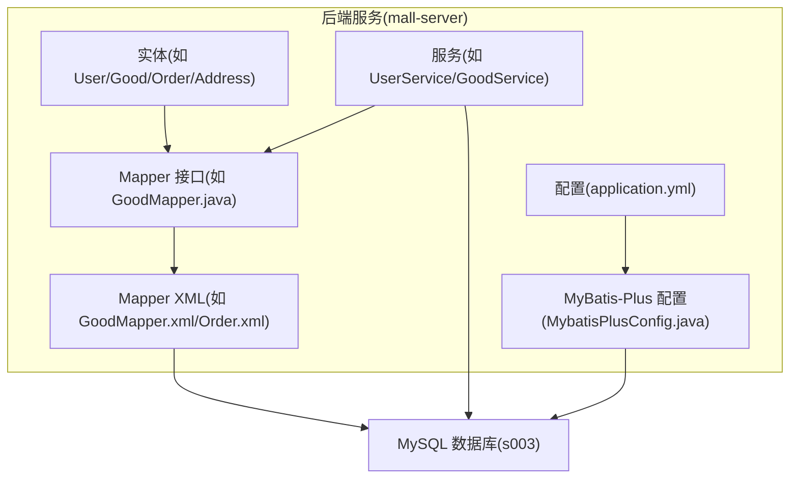
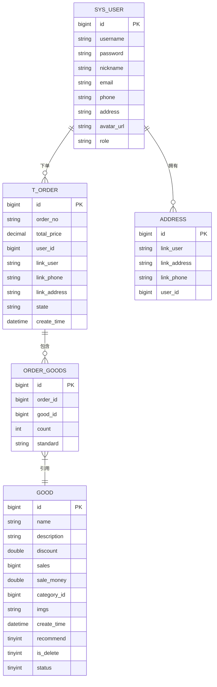
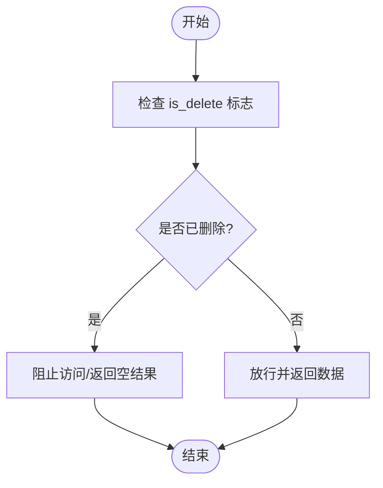
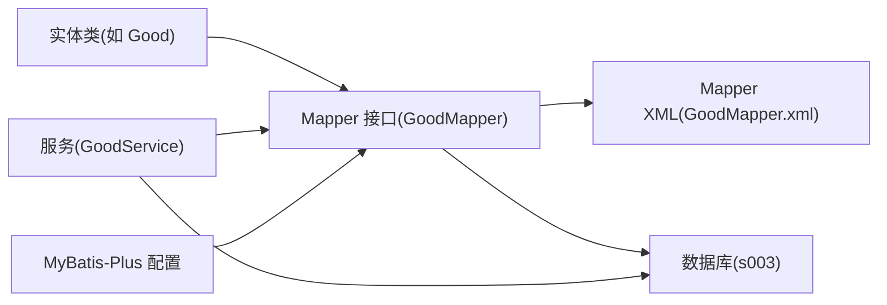

# 数据完整性约束

<cite>
**本文引用的文件**
- [DATABASE_DESIGN.md](file://DATABASE_DESIGN.md)
- [s003.sql](file://s003.sql)
- [application.yml](file://mall-server/src/main/resources/application.yml)
- [User.java](file://mall-server/src/main/java/com/rabbiter/em/entity/User.java)
- [Good.java](file://mall-server/src/main/java/com/rabbiter/em/entity/Good.java)
- [Order.java](file://mall-server/src/main/java/com/rabbiter/em/entity/Order.java)
- [Address.java](file://mall-server/src/main/java/com/rabbiter/em/entity/Address.java)
- [GoodMapper.java](file://mall-server/src/main/java/com/rabbiter/em/mapper/GoodMapper.java)
- [GoodMapper.xml](file://mall-server/src/main/resources/mapper/GoodMapper.xml)
- [Order.xml](file://mall-server/src/main/resources/mapper/Order.xml)
- [MybatisPlusConfig.java](file://mall-server/src/main/java/com/rabbiter/em/config/MybatisPlusConfig.java)
- [UserService.java](file://mall-server/src/main/java/com/rabbiter/em/service/UserService.java)
- [GoodService.java](file://mall-server/src/main/java/com/rabbiter/em/service/GoodService.java)
</cite>

## 目录
1. [引言](#引言)
2. [项目结构](#项目结构)
3. [核心组件](#核心组件)
4. [架构总览](#架构总览)
5. [详细组件分析](#详细组件分析)
6. [依赖分析](#依赖分析)
7. [性能考虑](#性能考虑)
8. [故障排查指南](#故障排查指南)
9. [结论](#结论)
10. [附录](#附录)

## 引言
本文件围绕数据库层面的数据完整性约束展开，结合代码库中的实体模型、持久化映射与业务服务层，系统阐述主键约束、外键约束、唯一性约束、非空约束与检查约束的作用机制、违反行为及解决方案；并深入解析逻辑删除字段 is_delete 的设计理念与实现方式，提供常见约束冲突场景与调试方法，帮助开发者正确理解与应用数据完整性保护机制。

## 项目结构
本项目采用前后端分离架构，后端基于 Spring Boot + MyBatis-Plus，数据库脚本与实体/映射/服务层均位于 mall-server 子工程中。数据库初始化脚本定义了各表的结构、主键与默认值，实体类通过注解映射到表字段，Mapper XML 定义查询与更新逻辑，Service 层在业务层面实现数据一致性与逻辑删除策略。

**图表来源**
- [application.yml:1-42](file://mall-server/src/main/resources/application.yml#L1-L42)
- [MybatisPlusConfig.java:1-21](file://mall-server/src/main/java/com/rabbiter/em/config/MybatisPlusConfig.java#L1-L21)
- [GoodMapper.xml:1-33](file://mall-server/src/main/resources/mapper/GoodMapper.xml#L1-L33)
- [Order.xml:1-49](file://mall-server/src/main/resources/mapper/Order.xml#L1-L49)

**章节来源**
- [application.yml:1-42](file://mall-server/src/main/resources/application.yml#L1-L42)
- [MybatisPlusConfig.java:1-21](file://mall-server/src/main/java/com/rabbiter/em/config/MybatisPlusConfig.java#L1-L21)

## 核心组件
- 实体与表映射：User、Good、Order、Address 等实体通过注解映射到数据库表，主键通常由注解声明自增。
- Mapper 接口与 XML：定义查询、插入、更新与分页等操作，部分涉及逻辑删除条件。
- 服务层：封装业务逻辑，统一处理数据一致性、缓存与逻辑删除。
- MyBatis-Plus 配置：启用分页插件，提升查询性能与可维护性。

**章节来源**
- [User.java:1-123](file://mall-server/src/main/java/com/rabbiter/em/entity/User.java#L1-L123)
- [Good.java:1-232](file://mall-server/src/main/java/com/rabbiter/em/entity/Good.java#L1-L232)
- [Order.java:1-171](file://mall-server/src/main/java/com/rabbiter/em/entity/Order.java#L1-L171)
- [Address.java:1-86](file://mall-server/src/main/java/com/rabbiter/em/entity/Address.java#L1-L86)
- [GoodMapper.java:1-43](file://mall-server/src/main/java/com/rabbiter/em/mapper/GoodMapper.java#L1-L43)
- [GoodMapper.xml:1-33](file://mall-server/src/main/resources/mapper/GoodMapper.xml#L1-L33)
- [Order.xml:1-49](file://mall-server/src/main/resources/mapper/Order.xml#L1-L49)
- [GoodService.java:1-281](file://mall-server/src/main/java/com/rabbiter/em/service/GoodService.java#L1-L281)

## 架构总览
数据库层面的完整性约束由建表脚本定义，运行期由 MyBatis-Plus 与业务服务共同保障。实体类负责字段映射，Mapper 负责 SQL 执行，Service 负责业务一致性与逻辑删除策略。

**图表来源**
- [s003.sql:24-321](file://s003.sql#L24-L321)
- [DATABASE_DESIGN.md:5-83](file://DATABASE_DESIGN.md#L5-L83)

## 详细组件分析

### 主键约束
- 设计要点：所有核心表的主键均声明为主键，且通常为自增列，确保每条记录的唯一标识。
- 违反行为：插入重复主键或为空主键将导致数据库报错，阻断事务提交。
- 解决方案：使用自增主键时无需手动赋值；若需批量导入，确保主键不冲突或使用允许自增的导入方式。
- 代码体现：
  - 用户表、商品表、订单表、地址表、订单商品关联表等均在建表脚本中定义主键。
  - 实体类通过注解声明主键与自增策略。

**章节来源**
- [s003.sql:27-34](file://s003.sql#L27-L34)
- [s003.sql:123-137](file://s003.sql#L123-L137)
- [s003.sql:299-311](file://s003.sql#L299-L311)
- [s003.sql:31-34](file://s003.sql#L31-L34)
- [Good.java:16-17](file://mall-server/src/main/java/com/rabbiter/em/entity/Good.java#L16-L17)
- [Order.java:16-17](file://mall-server/src/main/java/com/rabbiter/em/entity/Order.java#L16-L17)
- [Address.java:13-14](file://mall-server/src/main/java/com/rabbiter/em/entity/Address.java#L13-L14)

### 外键约束
- 设计要点：实体关系图中体现了外键关系，如订单表的 user_id、订单商品关联表的 order_id/good_id 等。
- 违反行为：插入或更新时引用不存在的父记录会触发外键约束错误；删除被子表引用的父记录可能被拒绝。
- 解决方案：先清理子表引用，再删除父表记录；或在业务层保证引用关系的有效性。
- 代码体现：
  - 实体类字段映射到外键列；
  - 查询语句中通过 JOIN 维持引用一致性。

**章节来源**
- [DATABASE_DESIGN.md:5-83](file://DATABASE_DESIGN.md#L5-L83)
- [Order.xml:13-18](file://mall-server/src/main/resources/mapper/Order.xml#L13-L18)
- [Order.xml:19-24](file://mall-server/src/main/resources/mapper/Order.xml#L19-L24)
- [Good.java:50-50](file://mall-server/src/main/java/com/rabbiter/em/entity/Good.java#L50-L50)
- [Order.java:32-32](file://mall-server/src/main/java/com/rabbiter/em/entity/Order.java#L32-L32)
- [Order.java:22-22](file://mall-server/src/main/java/com/rabbiter/em/entity/Order.java#L22-L22)

### 唯一性约束
- 设计要点：用户名等字段在数据库层面具备唯一性要求，避免重复注册。
- 违反行为：插入重复唯一键值将导致唯一约束冲突。
- 解决方案：在业务层进行唯一性校验，或捕获唯一约束异常并提示用户。
- 代码体现：
  - 用户登录/注册时根据用户名查询并判断是否存在；
  - 登录流程中对用户名进行精确匹配。

**章节来源**
- [UserService.java:93-98](file://mall-server/src/main/java/com/rabbiter/em/service/UserService.java#L93-L98)
- [UserService.java:110-114](file://mall-server/src/main/java/com/rabbiter/em/service/UserService.java#L110-L114)
- [UserService.java:44-50](file://mall-server/src/main/java/com/rabbiter/em/service/UserService.java#L44-L50)

### 非空约束
- 设计要点：折扣、销量、推荐标志、逻辑删除标志、状态等字段在建表脚本中声明为非空，并提供默认值。
- 违反行为：插入或更新时未提供非空字段值将导致非空约束错误。
- 解决方案：在实体类或业务层为非空字段提供默认值或必填校验；确保持久化前完成字段填充。
- 代码体现：
  - 商品表折扣默认 1.00、销量默认 0、推荐默认 0、逻辑删除默认 0、状态默认 1；
  - 实体类字段类型与默认值与建表脚本一致。

**章节来源**
- [s003.sql:127-135](file://s003.sql#L127-L135)
- [Good.java:34-45](file://mall-server/src/main/java/com/rabbiter/em/entity/Good.java#L34-L45)
- [Good.java:65-76](file://mall-server/src/main/java/com/rabbiter/em/entity/Good.java#L65-L76)

### 检查约束
- 设计要点：数据库层面未显式创建 CHECK 约束；业务层通过服务层校验与默认值保障数据有效性。
- 违反行为：不符合业务规则的数据可能导致后续计算或展示异常。
- 解决方案：在 Service 层增加输入校验与默认值填充，避免脏数据进入数据库。
- 代码体现：
  - 商品销量、销售额、折扣等字段在实体与建表脚本中均有明确类型与默认值；
  - 服务层在新增商品时填充创建时间等字段。

**章节来源**
- [Good.java:34-45](file://mall-server/src/main/java/com/rabbiter/em/entity/Good.java#L34-L45)
- [Good.java:13-17](file://mall-server/src/main/java/com/rabbiter/em/entity/Good.java#L13-L17)
- [GoodService.java:133-137](file://mall-server/src/main/java/com/rabbiter/em/service/GoodService.java#L133-L137)

### 逻辑删除字段 is_delete 的设计与实现
- 设计理念：通过 is_delete 字段替代物理删除，保留审计痕迹与数据一致性，避免级联删除带来的数据丢失风险。
- 实现方式：
  - 数据库层面：is_delete 为 tinyint，非空，默认 0（未删除），更新为 1（已删除）。
  - 业务层面：查询时默认过滤 is_delete = 0；删除时执行软删更新；缓存中读取时也遵循软删过滤。
- 代码体现：
  - 建表脚本定义 is_delete 字段与默认值；
  - Mapper 接口提供软删更新方法；
  - Service 在查询与分页时默认过滤 is_delete = 0；
  - 商品详情查询与首页推荐查询均包含 is_delete 过滤条件。

**图表来源**
- [s003.sql:134-134](file://s003.sql#L134-L134)
- [GoodMapper.java:22-23](file://mall-server/src/main/java/com/rabbiter/em/mapper/GoodMapper.java#L22-L23)
- [GoodService.java:62-74](file://mall-server/src/main/java/com/rabbiter/em/service/GoodService.java#L62-L74)
- [GoodMapper.xml:12-14](file://mall-server/src/main/resources/mapper/GoodMapper.xml#L12-L14)

**章节来源**
- [s003.sql:124-135](file://s003.sql#L124-L135)
- [GoodMapper.java:22-23](file://mall-server/src/main/java/com/rabbiter/em/mapper/GoodMapper.java#L22-L23)
- [GoodService.java:62-74](file://mall-server/src/main/java/com/rabbiter/em/service/GoodService.java#L62-L74)
- [GoodMapper.xml:12-14](file://mall-server/src/main/resources/mapper/GoodMapper.xml#L12-L14)

## 依赖分析
- 实体类依赖数据库表结构，注解声明主键与自增；
- Mapper 接口依赖 XML 中的 SQL 定义，执行查询与更新；
- Service 层依赖 Mapper 与 Redis 缓存，实现业务一致性与软删过滤；
- MyBatis-Plus 配置提供分页能力，减少全表扫描。

**图表来源**
- [Good.java:1-232](file://mall-server/src/main/java/com/rabbiter/em/entity/Good.java#L1-L232)
- [GoodMapper.java:1-43](file://mall-server/src/main/java/com/rabbiter/em/mapper/GoodMapper.java#L1-L43)
- [GoodMapper.xml:1-33](file://mall-server/src/main/resources/mapper/GoodMapper.xml#L1-L33)
- [GoodService.java:1-281](file://mall-server/src/main/java/com/rabbiter/em/service/GoodService.java#L1-L281)
- [MybatisPlusConfig.java:1-21](file://mall-server/src/main/java/com/rabbiter/em/config/MybatisPlusConfig.java#L1-L21)

**章节来源**
- [Good.java:1-232](file://mall-server/src/main/java/com/rabbiter/em/entity/Good.java#L1-L232)
- [GoodMapper.java:1-43](file://mall-server/src/main/java/com/rabbiter/em/mapper/GoodMapper.java#L1-L43)
- [GoodMapper.xml:1-33](file://mall-server/src/main/resources/mapper/GoodMapper.xml#L1-L33)
- [GoodService.java:1-281](file://mall-server/src/main/java/com/rabbiter/em/service/GoodService.java#L1-L281)
- [MybatisPlusConfig.java:1-21](file://mall-server/src/main/java/com/rabbiter/em/config/MybatisPlusConfig.java#L1-L21)

## 性能考虑
- 分页查询：通过 MyBatis-Plus 分页插件限制最大查询条数，避免超大数据集扫描。
- 缓存配合：商品详情查询优先从 Redis 读取，降低数据库压力；软删过滤在缓存层与数据库层双重生效。
- 查询优化：Mapper XML 中的查询包含必要的过滤条件（如 is_delete、status），减少无效数据传输。

**章节来源**
- [MybatisPlusConfig.java:12-19](file://mall-server/src/main/java/com/rabbiter/em/config/MybatisPlusConfig.java#L12-L19)
- [GoodService.java:52-74](file://mall-server/src/main/java/com/rabbiter/em/service/GoodService.java#L52-L74)
- [GoodMapper.xml:12-14](file://mall-server/src/main/resources/mapper/GoodMapper.xml#L12-L14)

## 故障排查指南
- 主键冲突
  - 现象：插入报错，提示主键重复。
  - 排查：确认是否手动设置了主键；检查自增序列状态。
  - 解决：移除手动主键赋值，或调整自增起始值。
- 外键冲突
  - 现象：插入/更新时报外键约束错误。
  - 排查：确认父表记录是否存在；检查关联字段是否为空。
  - 解决：先创建父记录，再创建子记录；或修正关联字段。
- 唯一性冲突
  - 现象：用户名重复导致唯一约束失败。
  - 排查：注册/登录时对用户名进行唯一性校验。
  - 解决：在业务层拦截重复用户名，提示用户更换。
- 非空约束失败
  - 现象：插入/更新时缺少必要字段导致失败。
  - 排查：核对实体类字段与建表脚本默认值；确认持久化前字段已填充。
  - 解决：在服务层补充默认值或必填校验。
- 逻辑删除误用
  - 现象：查询不到已删除数据，但业务期望看到全部。
  - 排查：确认查询是否包含 is_delete 过滤；缓存是否命中过期数据。
  - 解决：在需要查看已删除数据的场景，临时移除过滤条件或清理缓存。

**章节来源**
- [UserService.java:93-98](file://mall-server/src/main/java/com/rabbiter/em/service/UserService.java#L93-L98)
- [GoodService.java:62-74](file://mall-server/src/main/java/com/rabbiter/em/service/GoodService.java#L62-L74)
- [GoodMapper.xml:12-14](file://mall-server/src/main/resources/mapper/GoodMapper.xml#L12-L14)

## 结论
本项目通过数据库建表脚本与实体/映射/服务层协同，实现了主键、外键、唯一性、非空与检查约束的综合保护；并通过 is_delete 字段实现逻辑删除，兼顾数据安全与审计需求。建议在开发与运维过程中持续关注约束冲突的常见场景，完善前置校验与异常处理，确保系统稳定与数据一致。

## 附录
- 数据库初始化脚本位置：s003.sql
- 应用配置文件位置：application.yml
- 实体类位置：entity 包
- Mapper 接口与 XML 位置：mapper 包
- 服务层位置：service 包