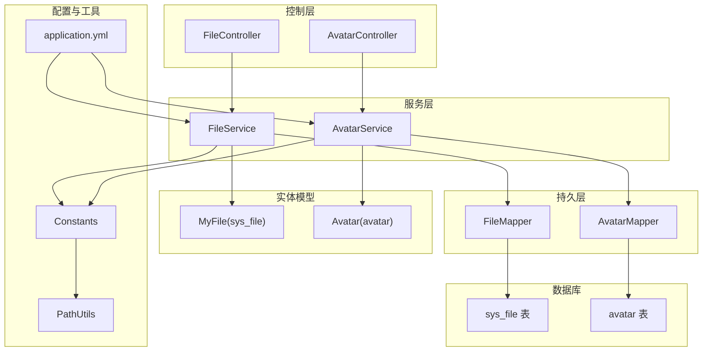
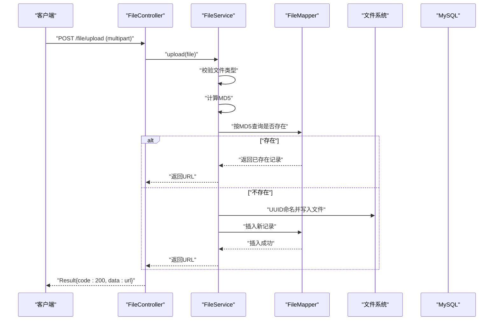
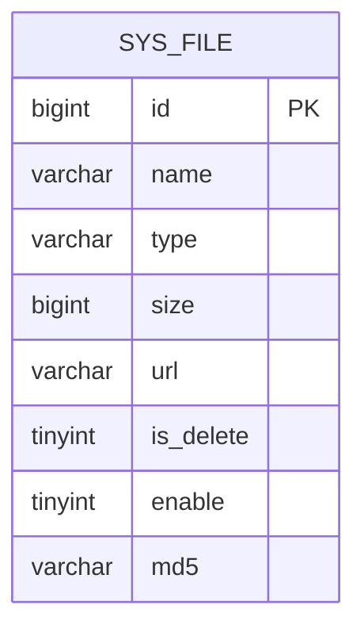
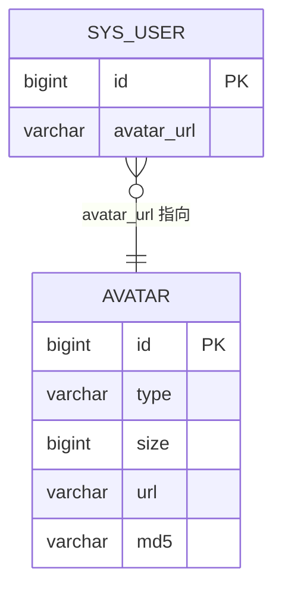
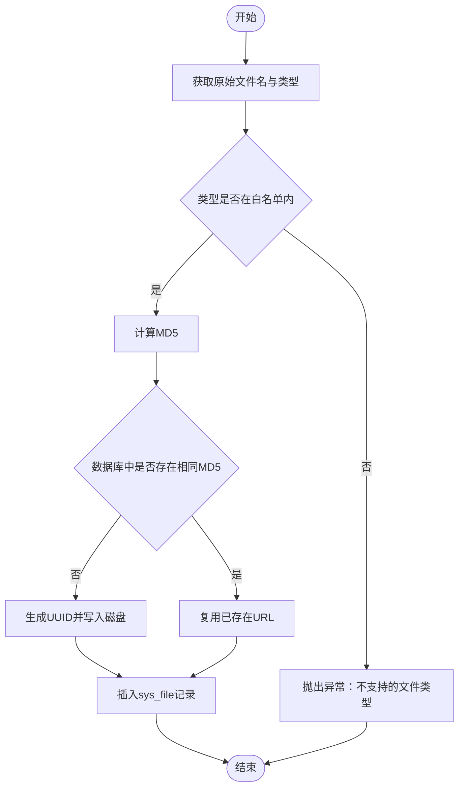
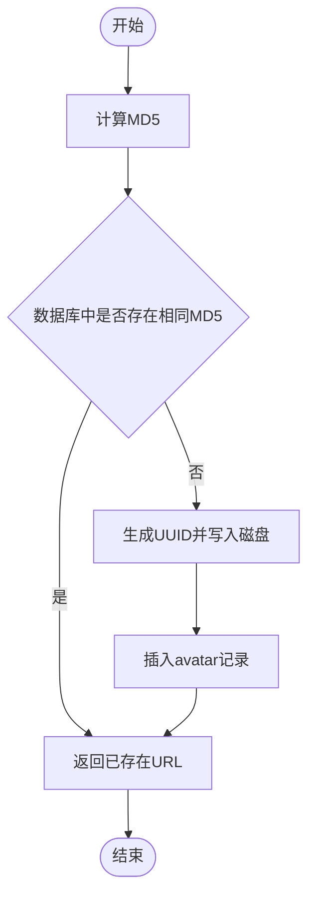
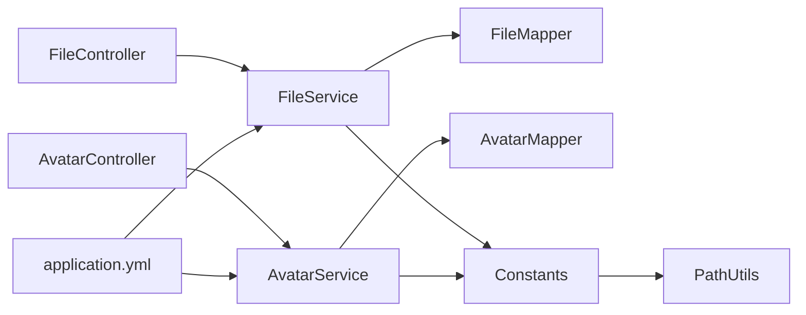

# 文件与媒体表

<cite>
**本文引用的文件**
- [MyFile.java](file://mall-server/src/main/java/com/rabbiter/em/entity/MyFile.java)
- [Avatar.java](file://mall-server/src/main/java/com/rabbiter/em/entity/Avatar.java)
- [FileController.java](file://mall-server/src/main/java/com/rabbiter/em/controller/FileController.java)
- [AvatarController.java](file://mall-server/src/main/java/com/rabbiter/em/controller/AvatarController.java)
- [FileService.java](file://mall-server/src/main/java/com/rabbiter/em/service/FileService.java)
- [AvatarService.java](file://mall-server/src/main/java/com/rabbiter/em/service/AvatarService.java)
- [FileMapper.java](file://mall-server/src/main/java/com/rabbiter/em/mapper/FileMapper.java)
- [AvatarMapper.java](file://mall-server/src/main/java/com/rabbiter/em/mapper/AvatarMapper.java)
- [Constants.java](file://mall-server/src/main/java/com/rabbiter/em/constants/Constants.java)
- [PathUtils.java](file://mall-server/src/main/java/com/rabbiter/em/utils/PathUtils.java)
- [application.yml](file://mall-server/src/main/resources/application.yml)
- [s003.sql](file://s003.sql)
- [DATABASE_DESIGN.md](file://DATABASE_DESIGN.md)
</cite>

## 目录
1. [简介](#简介)
2. [项目结构](#项目结构)
3. [核心组件](#核心组件)
4. [架构总览](#架构总览)
5. [详细组件分析](#详细组件分析)
6. [依赖分析](#依赖分析)
7. [性能考虑](#性能考虑)
8. [故障排查指南](#故障排查指南)
9. [结论](#结论)
10. [附录](#附录)

## 简介
本文件围绕系统中的“文件与媒体表”展开，重点覆盖以下内容：
- 文件表 sys_file 的结构设计与使用方式
- 头像表 avatar 的结构设计与使用方式
- 文件元数据存储、文件路径管理、文件类型分类与存储策略
- 头像管理机制、文件上传流程与文件安全控制
- 文件存储最佳实践、性能优化建议与文件清理策略
- 提供文件上传示例与数据库操作要点，帮助开发者快速实现完整的文件管理功能

## 项目结构
本项目采用前后端分离架构，文件与媒体模块位于后端 Java 工程 mall-server 中，主要涉及：
- 控制层：FileController、AvatarController
- 服务层：FileService、AvatarService
- 持久层：FileMapper、AvatarMapper
- 实体模型：MyFile、Avatar
- 常量与路径工具：Constants、PathUtils
- 配置：application.yml
- 数据库脚本：s003.sql、DATABASE_DESIGN.md

**图表来源**
- [FileController.java:17-79](file://mall-server/src/main/java/com/rabbiter/em/controller/FileController.java#L17-L79)
- [AvatarController.java:17-57](file://mall-server/src/main/java/com/rabbiter/em/controller/AvatarController.java#L17-L57)
- [FileService.java:34-140](file://mall-server/src/main/java/com/rabbiter/em/service/FileService.java#L34-L140)
- [AvatarService.java:26-109](file://mall-server/src/main/java/com/rabbiter/em/service/AvatarService.java#L26-L109)
- [FileMapper.java:7-9](file://mall-server/src/main/java/com/rabbiter/em/mapper/FileMapper.java#L7-L9)
- [AvatarMapper.java:11-28](file://mall-server/src/main/java/com/rabbiter/em/mapper/AvatarMapper.java#L11-L28)
- [MyFile.java:8-112](file://mall-server/src/main/java/com/rabbiter/em/entity/MyFile.java#L8-L112)
- [Avatar.java:6-74](file://mall-server/src/main/java/com/rabbiter/em/entity/Avatar.java#L6-L74)
- [Constants.java:5-15](file://mall-server/src/main/java/com/rabbiter/em/constants/Constants.java#L5-L15)
- [PathUtils.java:6-29](file://mall-server/src/main/java/com/rabbiter/em/utils/PathUtils.java#L6-L29)
- [application.yml:1-42](file://mall-server/src/main/resources/application.yml#L1-L42)
- [s003.sql:46-70](file://s003.sql#L46-L70)
- [s003.sql:250-261](file://s003.sql#L250-L261)

**章节来源**
- [FileController.java:17-79](file://mall-server/src/main/java/com/rabbiter/em/controller/FileController.java#L17-L79)
- [AvatarController.java:17-57](file://mall-server/src/main/java/com/rabbiter/em/controller/AvatarController.java#L17-L57)
- [FileService.java:34-140](file://mall-server/src/main/java/com/rabbiter/em/service/FileService.java#L34-L140)
- [AvatarService.java:26-109](file://mall-server/src/main/java/com/rabbiter/em/service/AvatarService.java#L26-L109)
- [FileMapper.java:7-9](file://mall-server/src/main/java/com/rabbiter/em/mapper/FileMapper.java#L7-L9)
- [AvatarMapper.java:11-28](file://mall-server/src/main/java/com/rabbiter/em/mapper/AvatarMapper.java#L11-L28)
- [MyFile.java:8-112](file://mall-server/src/main/java/com/rabbiter/em/entity/MyFile.java#L8-L112)
- [Avatar.java:6-74](file://mall-server/src/main/java/com/rabbiter/em/entity/Avatar.java#L6-L74)
- [Constants.java:5-15](file://mall-server/src/main/java/com/rabbiter/em/constants/Constants.java#L5-L15)
- [PathUtils.java:6-29](file://mall-server/src/main/java/com/rabbiter/em/utils/PathUtils.java#L6-L29)
- [application.yml:1-42](file://mall-server/src/main/resources/application.yml#L1-L42)
- [s003.sql:46-70](file://s003.sql#L46-L70)
- [s003.sql:250-261](file://s003.sql#L250-L261)

## 核心组件
- 文件实体 MyFile 对应 sys_file 表，包含文件名称、类型、大小、URL、启用状态、逻辑删除标记与 MD5 标识。
- 头像实体 Avatar 对应 avatar 表，包含类型、大小、URL、MD5 标识。
- 控制器 FileController/AvatarController 提供上传、下载、分页查询、批量删除、启用禁用等接口。
- 服务层 FileService/AvatarService 实现文件类型校验、去重（基于 MD5）、UUID 命名、物理存储与数据库记录写入。
- Mapper 层分别对接 sys_file 与 avatar 表，提供基础 CRUD 与分页查询能力。
- Constants 定义文件与头像存储根目录；PathUtils 提供跨平台路径解析；application.yml 控制文件大小限制与编码。

**章节来源**
- [MyFile.java:8-112](file://mall-server/src/main/java/com/rabbiter/em/entity/MyFile.java#L8-L112)
- [Avatar.java:6-74](file://mall-server/src/main/java/com/rabbiter/em/entity/Avatar.java#L6-L74)
- [FileController.java:17-79](file://mall-server/src/main/java/com/rabbiter/em/controller/FileController.java#L17-L79)
- [AvatarController.java:17-57](file://mall-server/src/main/java/com/rabbiter/em/controller/AvatarController.java#L17-L57)
- [FileService.java:34-140](file://mall-server/src/main/java/com/rabbiter/em/service/FileService.java#L34-L140)
- [AvatarService.java:26-109](file://mall-server/src/main/java/com/rabbiter/em/service/AvatarService.java#L26-L109)
- [FileMapper.java:7-9](file://mall-server/src/main/java/com/rabbiter/em/mapper/FileMapper.java#L7-L9)
- [AvatarMapper.java:11-28](file://mall-server/src/main/java/com/rabbiter/em/mapper/AvatarMapper.java#L11-L28)
- [Constants.java:5-15](file://mall-server/src/main/java/com/rabbiter/em/constants/Constants.java#L5-L15)
- [PathUtils.java:6-29](file://mall-server/src/main/java/com/rabbiter/em/utils/PathUtils.java#L6-L29)
- [application.yml:14-21](file://mall-server/src/main/resources/application.yml#L14-L21)

## 架构总览
文件与媒体模块遵循典型的 MVC 分层架构，请求从控制器进入，调用服务层完成业务处理，再由 Mapper 层访问数据库，最终返回响应给客户端。

**图表来源**
- [FileController.java:25-29](file://mall-server/src/main/java/com/rabbiter/em/controller/FileController.java#L25-L29)
- [FileService.java:47-98](file://mall-server/src/main/java/com/rabbiter/em/service/FileService.java#L47-L98)
- [FileMapper.java:7-9](file://mall-server/src/main/java/com/rabbiter/em/mapper/FileMapper.java#L7-L9)

**章节来源**
- [FileController.java:25-29](file://mall-server/src/main/java/com/rabbiter/em/controller/FileController.java#L25-L29)
- [FileService.java:47-98](file://mall-server/src/main/java/com/rabbiter/em/service/FileService.java#L47-L98)
- [FileMapper.java:7-9](file://mall-server/src/main/java/com/rabbiter/em/mapper/FileMapper.java#L7-L9)

## 详细组件分析

### 文件表 sys_file 结构与设计
- 表结构概览
  - 字段：id、name、type、size、url、is_delete、enable、md5
  - 主键：id
  - 存储引擎：InnoDB
  - 行格式：DYNAMIC
- 设计要点
  - 使用 tinyint(1) 存储布尔值（is_delete、enable），便于逻辑删除与开关控制
  - md5 作为去重与重复文件复用的关键索引
  - url 以相对路径形式存储，结合服务端静态资源映射进行访问
- 元数据与路径
  - name/type/size/md5 用于检索与去重
  - url 为对外访问路径，由服务端生成并写入数据库
- 类型与存储策略
  - 支持常见图片与文档类型，通过白名单限制上传类型
  - 文件以 UUID 命名，避免冲突并提升安全性
  - 物理存储位置由 Constants 统一管理，路径通过 PathUtils 解析

**图表来源**
- [s003.sql:250-261](file://s003.sql#L250-L261)

**章节来源**
- [s003.sql:250-261](file://s003.sql#L250-L261)
- [MyFile.java:8-112](file://mall-server/src/main/java/com/rabbiter/em/entity/MyFile.java#L8-L112)
- [FileService.java:41-45](file://mall-server/src/main/java/com/rabbiter/em/service/FileService.java#L41-L45)
- [FileService.java:77-98](file://mall-server/src/main/java/com/rabbiter/em/service/FileService.java#L77-L98)
- [Constants.java:12-14](file://mall-server/src/main/java/com/rabbiter/em/constants/Constants.java#L12-L14)
- [PathUtils.java:6-29](file://mall-server/src/main/java/com/rabbiter/em/utils/PathUtils.java#L6-L29)

### 头像表 avatar 结构与设计
- 表结构概览
  - 字段：id、type、size、url、md5
  - 主键：id
  - 存储引擎：InnoDB
  - 行格式：DYNAMIC
- 设计要点
  - 与 sys_file 类似，使用 md5 去重
  - url 以 /avatar/ 开头，便于前端统一访问
- 与用户头像的关系
  - 用户表 sys_user 含 avatar_url 字段，可直接指向 avatar 表记录生成的 url

**图表来源**
- [s003.sql:46-54](file://s003.sql#L46-L54)
- [s003.sql:276-287](file://s003.sql#L276-L287)

**章节来源**
- [s003.sql:46-54](file://s003.sql#L46-L54)
- [s003.sql:276-287](file://s003.sql#L276-L287)
- [Avatar.java:6-74](file://mall-server/src/main/java/com/rabbiter/em/entity/Avatar.java#L6-L74)
- [AvatarService.java:33-70](file://mall-server/src/main/java/com/rabbiter/em/service/AvatarService.java#L33-L70)

### 文件上传流程（FileService）
- 流程要点
  - 校验文件类型（白名单）
  - 计算 MD5 判断是否重复
  - 若重复则复用已有 URL，否则生成 UUID 文件名并写入磁盘
  - 写入数据库记录（sys_file）
- 安全控制
  - 仅允许白名单内的类型
  - 通过 MD5 去重，避免重复存储
  - UUID 命名降低碰撞风险
- 性能与可靠性
  - 小文件读取到内存计算 MD5，注意控制文件大小上限
  - 使用 transferTo 进行高效落盘

**图表来源**
- [FileService.java:47-98](file://mall-server/src/main/java/com/rabbiter/em/service/FileService.java#L47-L98)
- [FileService.java:68-70](file://mall-server/src/main/java/com/rabbiter/em/service/FileService.java#L68-L70)

**章节来源**
- [FileService.java:41-45](file://mall-server/src/main/java/com/rabbiter/em/service/FileService.java#L41-L45)
- [FileService.java:47-98](file://mall-server/src/main/java/com/rabbiter/em/service/FileService.java#L47-L98)

### 头像上传流程（AvatarService）
- 流程要点
  - 计算 MD5 判断是否重复
  - 不存在则生成 UUID 文件名并写入磁盘，记录到 avatar 表
  - 存在则直接返回已存在 URL
- 删除策略
  - 删除 avatar 表记录后，同步删除磁盘文件

**图表来源**
- [AvatarService.java:33-70](file://mall-server/src/main/java/com/rabbiter/em/service/AvatarService.java#L33-L70)
- [AvatarService.java:89-100](file://mall-server/src/main/java/com/rabbiter/em/service/AvatarService.java#L89-L100)

**章节来源**
- [AvatarService.java:33-70](file://mall-server/src/main/java/com/rabbiter/em/service/AvatarService.java#L33-L70)
- [AvatarService.java:89-100](file://mall-server/src/main/java/com/rabbiter/em/service/AvatarService.java#L89-L100)

### 文件下载与访问
- 文件下载
  - FileController 提供按文件名下载接口，服务端读取磁盘文件并输出到响应流
  - AvatarController 提供头像下载接口
- 访问路径
  - sys_file 的 url 以 /file/ 开头
  - avatar 的 url 以 /avatar/ 开头
- 编码与响应头
  - 设置 Content-Disposition 与 UTF-8 编码，确保文件名正确显示

**章节来源**
- [FileController.java:31-35](file://mall-server/src/main/java/com/rabbiter/em/controller/FileController.java#L31-L35)
- [AvatarController.java:29-33](file://mall-server/src/main/java/com/rabbiter/em/controller/AvatarController.java#L29-L33)
- [FileService.java:101-116](file://mall-server/src/main/java/com/rabbiter/em/service/FileService.java#L101-L116)
- [AvatarService.java:72-87](file://mall-server/src/main/java/com/rabbiter/em/service/AvatarService.java#L72-L87)

### 文件分页与管理
- 分页查询
  - FileController 提供分页查询接口，支持按文件名模糊过滤
  - FileService 使用 MyBatis-Plus Page 与 QueryWrapper 实现分页与条件查询
- 启用/禁用与逻辑删除
  - 支持按 id 修改 enable 状态
  - 支持逻辑删除（is_delete），查询时默认排除已删除记录

**章节来源**
- [FileController.java:71-78](file://mall-server/src/main/java/com/rabbiter/em/controller/FileController.java#L71-L78)
- [FileService.java:123-139](file://mall-server/src/main/java/com/rabbiter/em/service/FileService.java#L123-L139)

## 依赖分析
- 控制器依赖服务层，服务层依赖 Mapper 与常量配置
- 文件与头像存储路径由 Constants 统一管理，PathUtils 负责跨平台路径解析
- application.yml 控制文件大小限制与编码设置

**图表来源**
- [FileController.java:22-23](file://mall-server/src/main/java/com/rabbiter/em/controller/FileController.java#L22-L23)
- [AvatarController.java:21-22](file://mall-server/src/main/java/com/rabbiter/em/controller/AvatarController.java#L21-L22)
- [FileService.java:38-39](file://mall-server/src/main/java/com/rabbiter/em/service/FileService.java#L38-L39)
- [AvatarService.java:30-31](file://mall-server/src/main/java/com/rabbiter/em/service/AvatarService.java#L30-L31)
- [Constants.java:12-14](file://mall-server/src/main/java/com/rabbiter/em/constants/Constants.java#L12-L14)
- [PathUtils.java:6-29](file://mall-server/src/main/java/com/rabbiter/em/utils/PathUtils.java#L6-L29)
- [application.yml:14-21](file://mall-server/src/main/resources/application.yml#L14-L21)

**章节来源**
- [FileController.java:22-23](file://mall-server/src/main/java/com/rabbiter/em/controller/FileController.java#L22-L23)
- [AvatarController.java:21-22](file://mall-server/src/main/java/com/rabbiter/em/controller/AvatarController.java#L21-L22)
- [FileService.java:38-39](file://mall-server/src/main/java/com/rabbiter/em/service/FileService.java#L38-L39)
- [AvatarService.java:30-31](file://mall-server/src/main/java/com/rabbiter/em/service/AvatarService.java#L30-L31)
- [Constants.java:12-14](file://mall-server/src/main/java/com/rabbiter/em/constants/Constants.java#L12-L14)
- [PathUtils.java:6-29](file://mall-server/src/main/java/com/rabbiter/em/utils/PathUtils.java#L6-L29)
- [application.yml:14-21](file://mall-server/src/main/resources/application.yml#L14-L21)

## 性能考虑
- 文件类型白名单与大小限制
  - 在服务层进行类型校验，避免非法类型与超大文件
  - application.yml 中限制单文件最大大小，防止内存溢出
- 去重与复用
  - 基于 MD5 去重，减少重复存储与带宽消耗
- IO 优化
  - 使用 transferTo 进行高效落盘
  - 下载时使用流式输出，避免一次性加载到内存
- 分页与查询
  - 使用 MyBatis-Plus 分页插件，配合合理索引（如 md5、is_delete、name）提升查询性能
- 存储路径
  - 统一路径管理，便于后续迁移与 CDN 集成

**章节来源**
- [FileService.java:41-45](file://mall-server/src/main/java/com/rabbiter/em/service/FileService.java#L41-L45)
- [FileService.java:77-98](file://mall-server/src/main/java/com/rabbiter/em/service/FileService.java#L77-L98)
- [application.yml:20-21](file://mall-server/src/main/resources/application.yml#L20-L21)
- [FileService.java:123-139](file://mall-server/src/main/java/com/rabbiter/em/service/FileService.java#L123-L139)

## 故障排查指南
- 文件类型不被支持
  - 现象：上传时报错提示不支持的文件类型
  - 排查：确认文件扩展名是否在白名单中
  - 参考：[FileService.java:50-52](file://mall-server/src/main/java/com/rabbiter/em/service/FileService.java#L50-L52)
- 文件不存在或路径错误
  - 现象：下载报错或返回空内容
  - 排查：确认 url 与磁盘路径一致；检查 Constants 中的存储根路径
  - 参考：[FileService.java:101-105](file://mall-server/src/main/java/com/rabbiter/em/service/FileService.java#L101-L105)，[AvatarService.java:72-76](file://mall-server/src/main/java/com/rabbiter/em/service/AvatarService.java#L72-L76)
- 逻辑删除与查询
  - 现象：删除后仍出现在列表中
  - 排查：确认查询条件是否包含 is_delete=false
  - 参考：[FileService.java](file://mall-server/src/main/java/com/rabbiter/em/service/FileService.java#L129)
- 删除头像后磁盘残留
  - 现象：数据库记录删除但磁盘文件未清理
  - 排查：确认删除流程是否执行了磁盘文件删除
  - 参考：[AvatarService.java:89-100](file://mall-server/src/main/java/com/rabbiter/em/service/AvatarService.java#L89-L100)

**章节来源**
- [FileService.java:50-52](file://mall-server/src/main/java/com/rabbiter/em/service/FileService.java#L50-L52)
- [FileService.java:101-105](file://mall-server/src/main/java/com/rabbiter/em/service/FileService.java#L101-L105)
- [AvatarService.java:72-76](file://mall-server/src/main/java/com/rabbiter/em/service/AvatarService.java#L72-L76)
- [FileService.java](file://mall-server/src/main/java/com/rabbiter/em/service/FileService.java#L129)
- [AvatarService.java:89-100](file://mall-server/src/main/java/com/rabbiter/em/service/AvatarService.java#L89-L100)

## 结论
本文件与媒体表模块通过清晰的分层设计与严格的文件管理策略，实现了稳定高效的文件上传、去重、存储与访问能力。结合 MD5 去重、UUID 命名、白名单校验与逻辑删除等机制，既保证了系统的安全性与性能，也为后续扩展（如 CDN 集成、批量清理）提供了良好基础。

## 附录

### 数据库表结构参考
- sys_file 表
  - 字段：id、name、type、size、url、is_delete、enable、md5
  - 示例记录：包含多条测试数据，展示不同文件类型与命名方式
- avatar 表
  - 字段：id、type、size、url、md5
  - 示例记录：包含一条头像记录

**章节来源**
- [s003.sql:250-271](file://s003.sql#L250-L271)
- [s003.sql:46-59](file://s003.sql#L46-L59)

### 文件上传示例与数据库操作要点
- 上传接口
  - 文件上传：POST /file/upload
  - 头像上传：POST /avatar
- 下载接口
  - 文件下载：GET /file/{fileName}
  - 头像下载：GET /avatar/{fileName}
- 管理接口
  - 批量删除：DELETE /file/del/batch
  - 单个删除：DELETE /file/{id}
  - 启用/禁用：GET /file/enable?id={id}&enable={true|false}
  - 分页查询：GET /file/page?pageNum={n}&pageSize={m}&fileName={name}

**章节来源**
- [FileController.java:25-78](file://mall-server/src/main/java/com/rabbiter/em/controller/FileController.java#L25-L78)
- [AvatarController.java:24-56](file://mall-server/src/main/java/com/rabbiter/em/controller/AvatarController.java#L24-L56)