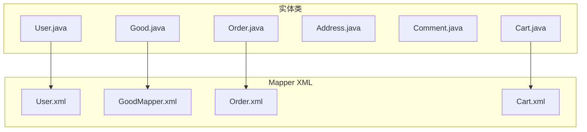
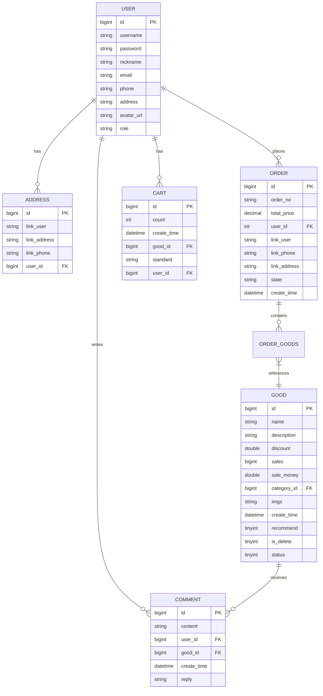
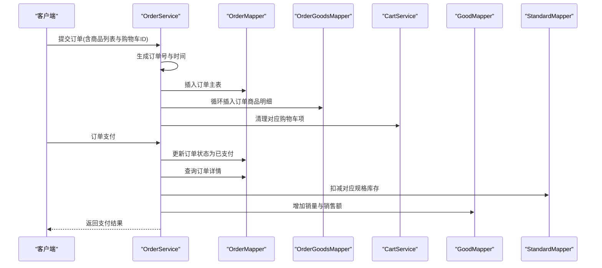
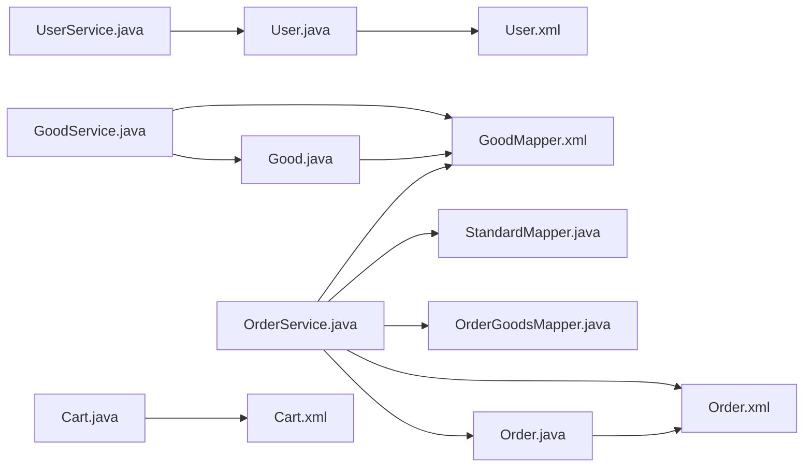

# 核心业务表

<cite>
**本文引用的文件**
- [User.java](file://mall-server/src/main/java/com/rabbiter/em/entity/User.java)
- [Good.java](file://mall-server/src/main/java/com/rabbiter/em/entity/Good.java)
- [Order.java](file://mall-server/src/main/java/com/rabbiter/em/entity/Order.java)
- [Address.java](file://mall-server/src/main/java/com/rabbiter/em/entity/Address.java)
- [Comment.java](file://mall-server/src/main/java/com/rabbiter/em/entity/Comment.java)
- [Cart.java](file://mall-server/src/main/java/com/rabbiter/em/entity/Cart.java)
- [User.xml](file://mall-server/src/main/resources/mapper/User.xml)
- [GoodMapper.xml](file://mall-server/src/main/resources/mapper/GoodMapper.xml)
- [Order.xml](file://mall-server/src/main/resources/mapper/Order.xml)
- [Cart.xml](file://mall-server/src/main/resources/mapper/Cart.xml)
- [DATABASE_DESIGN.md](file://DATABASE_DESIGN.md)
- [UserService.java](file://mall-server/src/main/java/com/rabbiter/em/service/UserService.java)
- [GoodService.java](file://mall-server/src/main/java/com/rabbiter/em/service/GoodService.java)
- [OrderService.java](file://mall-server/src/main/java/com/rabbiter/em/service/OrderService.java)
</cite>

## 目录
1. [简介](#简介)
2. [项目结构](#项目结构)
3. [核心组件](#核心组件)
4. [架构总览](#架构总览)
5. [详细组件分析](#详细组件分析)
6. [依赖分析](#依赖分析)
7. [性能考虑](#性能考虑)
8. [故障排查指南](#故障排查指南)
9. [结论](#结论)
10. [附录](#附录)

## 简介
本文件聚焦于核心业务表的结构设计与实现，覆盖用户表(sys_user)、商品表(good)、订单表(t_order)、地址表(address)、评论表(comment)与购物车表(cart)。文档从字段定义、数据类型、约束与业务含义出发，结合主键设计原则、外键关联关系与索引策略，辅以表间关系图与实际数据示例，帮助开发者理解业务数据流转与表结构设计的合理性。

## 项目结构
围绕核心业务表，后端采用 MyBatis-Plus + Mapper XML 的持久层方案，实体类通过注解映射到数据库表；服务层封装业务流程，控制器负责对外接口。核心实体与 Mapper 文件如下所示：

**图表来源**
- [User.java:9-122](file://mall-server/src/main/java/com/rabbiter/em/entity/User.java#L9-L122)
- [Good.java:11-231](file://mall-server/src/main/java/com/rabbiter/em/entity/Good.java#L11-L231)
- [Order.java:11-170](file://mall-server/src/main/java/com/rabbiter/em/entity/Order.java#L11-L170)
- [Address.java:8-85](file://mall-server/src/main/java/com/rabbiter/em/entity/Address.java#L8-L85)
- [Comment.java:9-93](file://mall-server/src/main/java/com/rabbiter/em/entity/Comment.java#L9-L93)
- [Cart.java:8-96](file://mall-server/src/main/java/com/rabbiter/em/entity/Cart.java#L8-L96)
- [User.xml:1-34](file://mall-server/src/main/resources/mapper/User.xml#L1-L34)
- [GoodMapper.xml:1-32](file://mall-server/src/main/resources/mapper/GoodMapper.xml#L1-L32)
- [Order.xml:1-48](file://mall-server/src/main/resources/mapper/Order.xml#L1-L48)
- [Cart.xml:1-26](file://mall-server/src/main/resources/mapper/Cart.xml#L1-L26)

**章节来源**
- [User.java:1-123](file://mall-server/src/main/java/com/rabbiter/em/entity/User.java#L1-L123)
- [Good.java:1-232](file://mall-server/src/main/java/com/rabbiter/em/entity/Good.java#L1-L232)
- [Order.java:1-171](file://mall-server/src/main/java/com/rabbiter/em/entity/Order.java#L1-L171)
- [Address.java:1-86](file://mall-server/src/main/java/com/rabbiter/em/entity/Address.java#L1-L86)
- [Comment.java:1-94](file://mall-server/src/main/java/com/rabbiter/em/entity/Comment.java#L1-L94)
- [Cart.java:1-97](file://mall-server/src/main/java/com/rabbiter/em/entity/Cart.java#L1-L97)
- [User.xml:1-35](file://mall-server/src/main/resources/mapper/User.xml#L1-L35)
- [GoodMapper.xml:1-33](file://mall-server/src/main/resources/mapper/GoodMapper.xml#L1-L33)
- [Order.xml:1-49](file://mall-server/src/main/resources/mapper/Order.xml#L1-L49)
- [Cart.xml:1-27](file://mall-server/src/main/resources/mapper/Cart.xml#L1-L27)

## 核心组件
- 用户表(sys_user)
  - 主键：自增整型
  - 关键字段：用户名、密码(加密)、昵称、邮箱、手机号、默认地址、头像URL、角色
  - 约束：用户名可唯一性由业务层保障；密码统一加密存储
  - 业务含义：承载系统用户身份与权限信息
- 商品表(good)
  - 主键：自增长整型
  - 关键字段：名称、描述、折扣、销量、销售额、分类ID、图片、创建时间、推荐标志、逻辑删除标志、状态
  - 约束：销量与销售额非负；折扣合理范围；逻辑删除与状态字段控制可见性
  - 业务含义：记录商品基础信息与销售统计
- 订单表(t_order)
  - 主键：自增长整型
  - 关键字段：订单号、总价、下单用户ID、收件人、电话、地址、状态、创建时间
  - 约束：订单号全局唯一；状态驱动业务流程
  - 业务含义：记录一次购买行为的聚合信息
- 地址表(address)
  - 主键：自增长整型
  - 关键字段：收件人、地址、电话、所属用户ID
  - 约束：用户ID外键关联用户表
  - 业务含义：维护用户可用的收货地址集合
- 评论表(comment)
  - 主键：自增长整型
  - 关键字段：内容、用户ID、商品ID、创建时间、回复
  - 约束：用户ID与商品ID构成外键
  - 业务含义：记录用户对商品的评价与回复
- 购物车表(cart)
  - 主键：自增长整型
  - 关键字段：数量、加入时间、商品ID、规格、用户ID
  - 约束：用户ID与商品ID外键；规格与商品标准表关联
  - 业务含义：临时持有用户意向购买的商品

**章节来源**
- [User.java:9-122](file://mall-server/src/main/java/com/rabbiter/em/entity/User.java#L9-L122)
- [Good.java:11-231](file://mall-server/src/main/java/com/rabbiter/em/entity/Good.java#L11-L231)
- [Order.java:11-170](file://mall-server/src/main/java/com/rabbiter/em/entity/Order.java#L11-L170)
- [Address.java:8-85](file://mall-server/src/main/java/com/rabbiter/em/entity/Address.java#L8-L85)
- [Comment.java:9-93](file://mall-server/src/main/java/com/rabbiter/em/entity/Comment.java#L9-L93)
- [Cart.java:8-96](file://mall-server/src/main/java/com/rabbiter/em/entity/Cart.java#L8-L96)
- [DATABASE_DESIGN.md:87-223](file://DATABASE_DESIGN.md#L87-L223)

## 架构总览
下图展示核心业务表之间的实体关系与外键约束，体现“用户-地址/购物车/订单/评论”、“商品-规格/订单项/评论”的典型电商关系。

**图表来源**
- [DATABASE_DESIGN.md:3-83](file://DATABASE_DESIGN.md#L3-L83)

## 详细组件分析

### 用户表(sys_user)
- 字段与类型
  - id: bigint, 自增主键
  - username: varchar, 登录名
  - password: varchar, 加密存储
  - nickname: varchar, 昵称
  - email: varchar, 邮箱
  - phone: varchar, 手机
  - address: varchar, 默认地址
  - avatar_url: varchar, 头像
  - role: varchar, 角色(admin/user)
- 约束与业务含义
  - 主键唯一标识用户
  - 密码统一加密存储，登录时进行匹配与必要时迁移
  - 角色字段控制访问权限
- 索引策略
  - 建议在 username 上建立唯一索引以保证登录唯一性
- 数据示例
  - id=1, username="alice", role="user", email="alice@example.com"

**章节来源**
- [User.java:9-122](file://mall-server/src/main/java/com/rabbiter/em/entity/User.java#L9-L122)
- [UserService.java:44-75](file://mall-server/src/main/java/com/rabbiter/em/service/UserService.java#L44-L75)
- [DATABASE_DESIGN.md:87-101](file://DATABASE_DESIGN.md#L87-L101)

### 商品表(good)
- 字段与类型
  - id: bigint, 自增主键
  - name: varchar, 名称
  - description: varchar, 描述
  - discount: double, 折扣
  - sales: bigint, 销量
  - sale_money: double, 销售额
  - category_id: bigint, 分类ID
  - imgs: varchar, 图片
  - create_time: datetime, 创建时间
  - recommend: tinyint, 推荐标志
  - is_delete: tinyint, 逻辑删除
  - status: tinyint, 上架/下架
- 约束与业务含义
  - 销量与销售额非负；折扣合理范围；逻辑删除与状态控制可见性
  - 与分类表多对一；与规格表一对多；与订单项/评论存在关联
- 索引策略
  - 建议在 category_id、status、is_delete 组合索引以优化查询
- 数据示例
  - id=1001, name="魔法袍", discount=0.9, sales=120, status=1, is_delete=0

**章节来源**
- [Good.java:11-231](file://mall-server/src/main/java/com/rabbiter/em/entity/Good.java#L11-L231)
- [GoodMapper.xml:4-9](file://mall-server/src/main/resources/mapper/GoodMapper.xml#L4-L9)
- [DATABASE_DESIGN.md:102-118](file://DATABASE_DESIGN.md#L102-L118)

### 订单表(t_order)
- 字段与类型
  - id: bigint, 自增主键
  - order_no: varchar, 订单号(全局唯一)
  - total_price: decimal, 总价
  - user_id: int, 下单用户ID
  - link_user: string, 收件人
  - link_phone: string, 电话
  - link_address: string, 地址
  - state: string, 订单状态
  - create_time: datetime, 创建时间
- 约束与业务含义
  - 订单号唯一；状态驱动业务流程(待付款/待发货/已发货/已完成)
  - 与用户表多对一；与订单商品关联表一对多
- 索引策略
  - 建议在 order_no、user_id、state、create_time 建立复合索引以支撑查询与导出
- 数据示例
  - id=2001, order_no="20250405123456789", total_price=299.00, state="待发货"

**章节来源**
- [Order.java:11-170](file://mall-server/src/main/java/com/rabbiter/em/entity/Order.java#L11-L170)
- [Order.xml:13-18](file://mall-server/src/main/resources/mapper/Order.xml#L13-L18)
- [OrderService.java:58-88](file://mall-server/src/main/java/com/rabbiter/em/service/OrderService.java#L58-L88)
- [DATABASE_DESIGN.md:119-137](file://DATABASE_DESIGN.md#L119-L137)

### 地址表(address)
- 字段与类型
  - id: bigint, 自增主键
  - link_user: string, 收件人
  - link_address: string, 详细地址
  - link_phone: string, 电话
  - user_id: bigint, 所属用户ID
- 约束与业务含义
  - 用户ID外键关联用户表；一个用户可维护多个地址
- 索引策略
  - 建议在 user_id 上建立索引以加速按用户查询
- 数据示例
  - id=3001, user_id=1, link_user="Alice", link_phone="13800001111"

**章节来源**
- [Address.java:8-85](file://mall-server/src/main/java/com/rabbiter/em/entity/Address.java#L8-L85)
- [DATABASE_DESIGN.md:138-148](file://DATABASE_DESIGN.md#L138-L148)

### 评论表(comment)
- 字段与类型
  - id: bigint, 自增主键
  - content: varchar, 评论内容
  - user_id: bigint, 用户ID
  - good_id: bigint, 商品ID
  - create_time: datetime, 评论时间
  - reply: varchar, 管理员回复
- 约束与业务含义
  - 用户ID与商品ID构成外键；支持回复功能
- 索引策略
  - 建议在 user_id、good_id、create_time 建立复合索引以优化查询
- 数据示例
  - id=4001, user_id=1, good_id=1001, content="质量很好"

**章节来源**
- [Comment.java:9-93](file://mall-server/src/main/java/com/rabbiter/em/entity/Comment.java#L9-L93)
- [DATABASE_DESIGN.md:149-159](file://DATABASE_DESIGN.md#L149-L159)

### 购物车表(cart)
- 字段与类型
  - id: bigint, 自增主键
  - count: int, 数量
  - create_time: datetime, 加入时间
  - good_id: bigint, 商品ID
  - standard: string, 规格
  - user_id: bigint, 用户ID
- 约束与业务含义
  - 用户ID与商品ID外键；规格与商品标准表关联
- 索引策略
  - 建议在 user_id、good_id、standard 建立复合索引以提升查询与清理效率
- 数据示例
  - id=5001, user_id=1, good_id=1001, count=2, standard="M"

**章节来源**
- [Cart.java:8-96](file://mall-server/src/main/java/com/rabbiter/em/entity/Cart.java#L8-L96)
- [Cart.xml:18-25](file://mall-server/src/main/resources/mapper/Cart.xml#L18-L25)
- [DATABASE_DESIGN.md:190-201](file://DATABASE_DESIGN.md#L190-L201)

### 表间关联关系与数据流
- 用户与地址：一对多，用户可有多个收货地址
- 用户与购物车：一对多，用户可有多条购物车记录
- 用户与订单：一对多，用户可有多笔订单
- 用户与评论：一对多，用户可有多条评论
- 商品与评论：一对多，商品可有多条评论
- 商品与订单项：一对多，订单包含多个商品项
- 订单与订单项：一对多，订单包含多个商品明细

**图表来源**
- [OrderService.java:58-149](file://mall-server/src/main/java/com/rabbiter/em/service/OrderService.java#L58-L149)
- [Order.xml:19-24](file://mall-server/src/main/resources/mapper/Order.xml#L19-L24)
- [GoodMapper.xml:7-9](file://mall-server/src/main/resources/mapper/GoodMapper.xml#L7-L9)

## 依赖分析
- 实体类与表映射
  - 实体类通过注解声明表名与主键策略，确保 ORM 与数据库一致
- Mapper XML 与 SQL
  - Mapper 文件定义了关键查询与聚合逻辑，如首页推荐商品、最小价格与总库存批量查询、订单明细查询等
- 服务层与业务流程
  - 服务层封装登录注册、商品缓存、订单支付与库存扣减等复杂流程，降低控制器负担
- 外键与一致性
  - 通过外键与业务层校验保证数据一致性，避免孤儿数据

**图表来源**
- [User.java:9-122](file://mall-server/src/main/java/com/rabbiter/em/entity/User.java#L9-L122)
- [Good.java:11-231](file://mall-server/src/main/java/com/rabbiter/em/entity/Good.java#L11-L231)
- [Order.java:11-170](file://mall-server/src/main/java/com/rabbiter/em/entity/Order.java#L11-L170)
- [Cart.java:8-96](file://mall-server/src/main/java/com/rabbiter/em/entity/Cart.java#L8-L96)
- [User.xml:1-34](file://mall-server/src/main/resources/mapper/User.xml#L1-L34)
- [GoodMapper.xml:1-32](file://mall-server/src/main/resources/mapper/GoodMapper.xml#L1-L32)
- [Order.xml:1-48](file://mall-server/src/main/resources/mapper/Order.xml#L1-L48)
- [Cart.xml:1-26](file://mall-server/src/main/resources/mapper/Cart.xml#L1-L26)
- [UserService.java:28-154](file://mall-server/src/main/java/com/rabbiter/em/service/UserService.java#L28-L154)
- [GoodService.java:37-280](file://mall-server/src/main/java/com/rabbiter/em/service/GoodService.java#L37-L280)
- [OrderService.java:34-183](file://mall-server/src/main/java/com/rabbiter/em/service/OrderService.java#L34-L183)

**章节来源**
- [UserService.java:28-154](file://mall-server/src/main/java/com/rabbiter/em/service/UserService.java#L28-L154)
- [GoodService.java:37-280](file://mall-server/src/main/java/com/rabbiter/em/service/GoodService.java#L37-L280)
- [OrderService.java:34-183](file://mall-server/src/main/java/com/rabbiter/em/service/OrderService.java#L34-L183)

## 性能考虑
- 索引策略
  - sys_user(username): 唯一索引，保障登录唯一性与快速查找
  - good(category_id, status, is_delete): 复合索引，加速商品筛选与分页
  - t_order(order_no, user_id, state, create_time): 复合索引，支撑订单查询与导出
  - address(user_id): 索引，加速地址查询
  - comment(user_id, good_id, create_time): 复合索引，优化评论查询
  - cart(user_id, good_id, standard): 复合索引，提升购物车查询与清理效率
- 缓存策略
  - 商品详情使用 Redis 缓存，减少数据库压力；更新时主动失效
- 批量查询
  - 使用批量最小价格与总库存查询，减少 N+1 查询问题
- 事务与锁
  - 订单支付与库存扣减使用事务，确保一致性；建议在高并发场景下对库存扣减加行级锁或乐观锁

[本节为通用性能建议，无需具体文件引用]

## 故障排查指南
- 登录失败
  - 检查用户名是否存在、密码是否匹配；确认是否为旧版 MD5 密码并触发迁移
  - 参考路径：[UserService.java:44-75](file://mall-server/src/main/java/com/rabbiter/em/service/UserService.java#L44-L75)
- 商品不存在或已下架
  - 订单支付前校验商品状态与逻辑删除标志
  - 参考路径：[OrderService.java:121-124](file://mall-server/src/main/java/com/rabbiter/em/service/OrderService.java#L121-L124)
- 库存不足
  - 订单支付阶段扣减库存失败会抛出异常
  - 参考路径：[OrderService.java:129-132](file://mall-server/src/main/java/com/rabbiter/em/service/OrderService.java#L129-L132)
- 订单查询异常
  - 确认订单号唯一性与状态过滤条件
  - 参考路径：[Order.xml:19-24](file://mall-server/src/main/resources/mapper/Order.xml#L19-L24)

**章节来源**
- [UserService.java:44-75](file://mall-server/src/main/java/com/rabbiter/em/service/UserService.java#L44-L75)
- [OrderService.java:121-132](file://mall-server/src/main/java/com/rabbiter/em/service/OrderService.java#L121-L132)
- [Order.xml:19-24](file://mall-server/src/main/resources/mapper/Order.xml#L19-L24)

## 结论
核心业务表设计遵循清晰的主外键关系与合理的字段语义，配合服务层的业务流程封装与缓存策略，能够有效支撑用户管理、商品管理、订单处理、地址维护、评论与购物车等关键业务。通过针对性索引与批量查询优化，可在保证数据一致性的同时提升整体性能与用户体验。

## 附录
- 关键字段与类型对照
  - sys_user: id(bi), username(v), password(v), nickname(v), email(v), phone(v), address(v), avatar_url(v), role(v)
  - good: id(bi), name(v), description(v), discount(d), sales(bi), sale_money(d), category_id(bi), imgs(v), create_time(dt), recommend(t), is_delete(t), status(t)
  - t_order: id(bi), order_no(v), total_price(d), user_id(i), link_user(v), link_phone(v), link_address(v), state(v), create_time(dt)
  - address: id(bi), link_user(v), link_address(v), link_phone(v), user_id(bi)
  - comment: id(bi), content(v), user_id(bi), good_id(bi), create_time(dt), reply(v)
  - cart: id(bi), count(i), create_time(dt), good_id(bi), standard(v), user_id(bi)

**章节来源**
- [DATABASE_DESIGN.md:87-223](file://DATABASE_DESIGN.md#L87-L223)