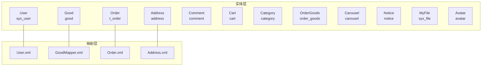
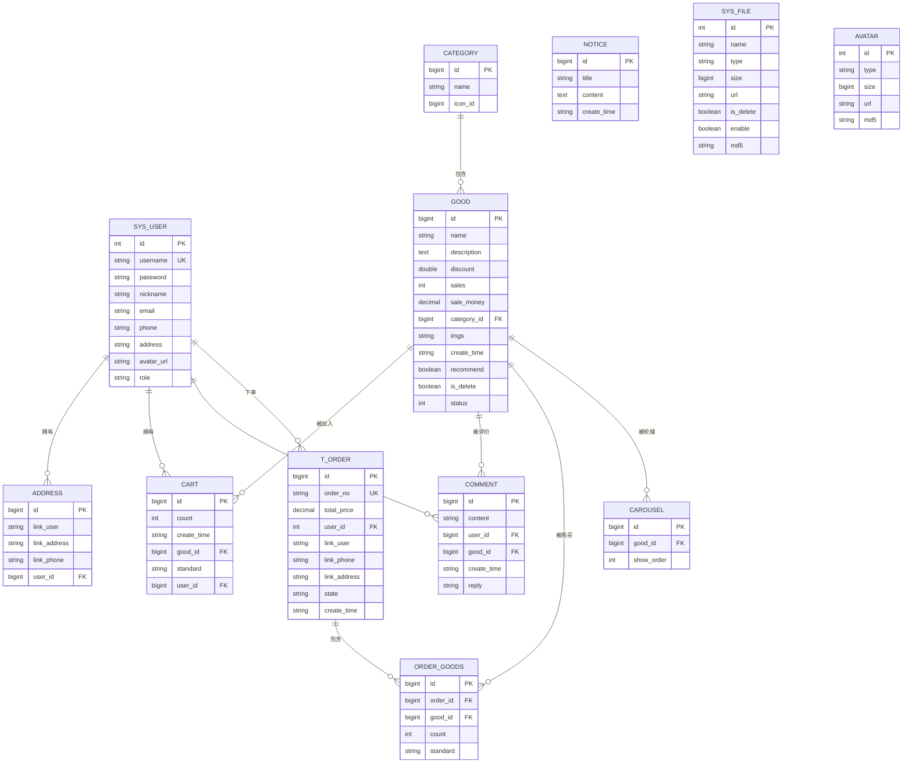
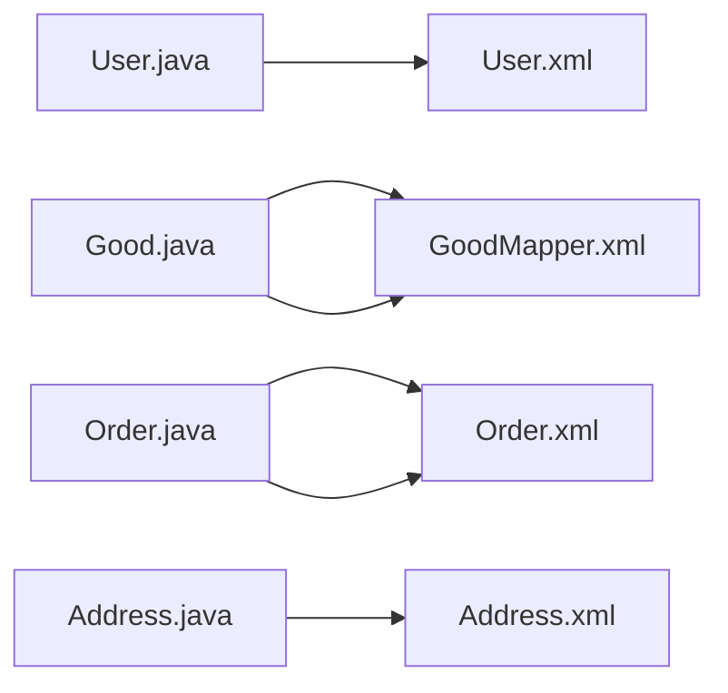

# 表结构设计

<cite>
**本文引用的文件**
- [User.java](file://mall-server/src/main/java/com/rabbiter/em/entity/User.java)
- [Good.java](file://mall-server/src/main/java/com/rabbiter/em/entity/Good.java)
- [Order.java](file://mall-server/src/main/java/com/rabbiter/em/entity/Order.java)
- [Address.java](file://mall-server/src/main/java/com/rabbiter/em/entity/Address.java)
- [Comment.java](file://mall-server/src/main/java/com/rabbiter/em/entity/Comment.java)
- [Cart.java](file://mall-server/src/main/java/com/rabbiter/em/entity/Cart.java)
- [Category.java](file://mall-server/src/main/java/com/rabbiter/em/entity/Category.java)
- [OrderGoods.java](file://mall-server/src/main/java/com/rabbiter/em/entity/OrderGoods.java)
- [Carousel.java](file://mall-server/src/main/java/com/rabbiter/em/entity/Carousel.java)
- [Notice.java](file://mall-server/src/main/java/com/rabbiter/em/entity/Notice.java)
- [MyFile.java](file://mall-server/src/main/java/com/rabbiter/em/entity/MyFile.java)
- [Avatar.java](file://mall-server/src/main/java/com/rabbiter/em/entity/Avatar.java)
- [User.xml](file://mall-server/src/main/resources/mapper/User.xml)
- [GoodMapper.xml](file://mall-server/src/main/resources/mapper/GoodMapper.xml)
- [Order.xml](file://mall-server/src/main/resources/mapper/Order.xml)
- [Address.xml](file://mall-server/src/main/resources/mapper/Address.xml)
</cite>

## 目录
1. [简介](#简介)
2. [项目结构](#项目结构)
3. [核心组件](#核心组件)
4. [架构总览](#架构总览)
5. [详细组件分析](#详细组件分析)
6. [依赖分析](#依赖分析)
7. [性能考虑](#性能考虑)
8. [故障排查指南](#故障排查指南)
9. [结论](#结论)
10. [附录](#附录)

## 简介
本文件面向cosplay商城系统的数据库表结构设计，基于后端实体类与MyBatis映射文件，系统性梳理并说明以下核心业务表的字段定义、数据类型、约束与索引设计原则，并阐述表间关联关系与外键约束策略。涉及表包括：用户表(sys_user)、商品表(good)、订单表(t_order)、地址表(address)、评论表(comment)、购物车表(cart)、分类表(category)、订单商品关联表(order_goods)、轮播图表(carousel)、公告表(notice)、文件表(sys_file)与头像表(avatar)。

## 项目结构
- 后端采用Spring Boot + MyBatis-Plus，实体类位于entity包，对应数据库表；MyBatis映射文件位于resources/mapper目录。
- 实体类通过注解标注表名与主键策略，部分字段使用@TableField(exist=false)声明为非持久化属性（用于DTO或临时计算）。
- 映射文件中包含插入、更新、查询与导出等SQL语句，体现业务逻辑与表间连接关系。

图示来源
- [User.java:9-123](file://mall-server/src/main/java/com/rabbiter/em/entity/User.java#L9-L123)
- [Good.java:11-232](file://mall-server/src/main/java/com/rabbiter/em/entity/Good.java#L11-L232)
- [Order.java:11-171](file://mall-server/src/main/java/com/rabbiter/em/entity/Order.java#L11-L171)
- [Address.java:8-86](file://mall-server/src/main/java/com/rabbiter/em/entity/Address.java#L8-L86)
- [Comment.java:9-94](file://mall-server/src/main/java/com/rabbiter/em/entity/Comment.java#L9-L94)
- [Cart.java:8-97](file://mall-server/src/main/java/com/rabbiter/em/entity/Cart.java#L8-L97)
- [Category.java:9-57](file://mall-server/src/main/java/com/rabbiter/em/entity/Category.java#L9-L57)
- [OrderGoods.java:8-86](file://mall-server/src/main/java/com/rabbiter/em/entity/OrderGoods.java#L8-L86)
- [Carousel.java:9-83](file://mall-server/src/main/java/com/rabbiter/em/entity/Carousel.java#L9-L83)
- [Notice.java:7-50](file://mall-server/src/main/java/com/rabbiter/em/entity/Notice.java#L7-L50)
- [MyFile.java:8-113](file://mall-server/src/main/java/com/rabbiter/em/entity/MyFile.java#L8-L113)
- [Avatar.java:6-75](file://mall-server/src/main/java/com/rabbiter/em/entity/Avatar.java#L6-L75)
- [User.xml:4-35](file://mall-server/src/main/resources/mapper/User.xml#L4-L35)
- [GoodMapper.xml:3-33](file://mall-server/src/main/resources/mapper/GoodMapper.xml#L3-L33)
- [Order.xml:3-49](file://mall-server/src/main/resources/mapper/Order.xml#L3-L49)
- [Address.xml:1-6](file://mall-server/src/main/resources/mapper/Address.xml#L1-L6)

章节来源
- [User.java:9-123](file://mall-server/src/main/java/com/rabbiter/em/entity/User.java#L9-L123)
- [Good.java:11-232](file://mall-server/src/main/java/com/rabbiter/em/entity/Good.java#L11-L232)
- [Order.java:11-171](file://mall-server/src/main/java/com/rabbiter/em/entity/Order.java#L11-L171)
- [Address.java:8-86](file://mall-server/src/main/java/com/rabbiter/em/entity/Address.java#L8-L86)
- [Comment.java:9-94](file://mall-server/src/main/java/com/rabbiter/em/entity/Comment.java#L9-L94)
- [Cart.java:8-97](file://mall-server/src/main/java/com/rabbiter/em/entity/Cart.java#L8-L97)
- [Category.java:9-57](file://mall-server/src/main/java/com/rabbiter/em/entity/Category.java#L9-L57)
- [OrderGoods.java:8-86](file://mall-server/src/main/java/com/rabbiter/em/entity/OrderGoods.java#L8-L86)
- [Carousel.java:9-83](file://mall-server/src/main/java/com/rabbiter/em/entity/Carousel.java#L9-L83)
- [Notice.java:7-50](file://mall-server/src/main/java/com/rabbiter/em/entity/Notice.java#L7-L50)
- [MyFile.java:8-113](file://mall-server/src/main/java/com/rabbiter/em/entity/MyFile.java#L8-L113)
- [Avatar.java:6-75](file://mall-server/src/main/java/com/rabbiter/em/entity/Avatar.java#L6-L75)
- [User.xml:4-35](file://mall-server/src/main/resources/mapper/User.xml#L4-L35)
- [GoodMapper.xml:3-33](file://mall-server/src/main/resources/mapper/GoodMapper.xml#L3-L33)
- [Order.xml:3-49](file://mall-server/src/main/resources/mapper/Order.xml#L3-L49)
- [Address.xml:1-6](file://mall-server/src/main/resources/mapper/Address.xml#L1-L6)

## 核心组件
- 用户表(sys_user)：存储用户登录与基本信息，含用户名、密码、昵称、邮箱、手机号、地址、头像URL与角色等字段。
- 商品表(good)：存储商品基础信息，含名称、描述、折扣、销量、销售额、分类ID、图片集、创建时间、推荐标志、删除标记、上下架状态等。
- 订单表(t_order)：存储订单信息，含订单号、总价、下单用户ID、收货联系人、电话、地址、状态、创建时间等。
- 地址表(address)：存储用户收货地址信息，含联系人、地址、电话与所属用户ID。
- 评论表(comment)：存储用户对商品的评价，含内容、用户ID、商品ID、创建时间与回复内容。
- 购物车表(cart)：存储用户购物车条目，含商品数量、加入时间、商品ID、规格、用户ID。
- 分类表(category)：存储商品分类信息，含分类名称与图标ID。
- 订单商品关联表(order_goods)：存储订单与商品的多对多明细，含订单ID、商品ID、购买数量与规格。
- 轮播图表(carousel)：存储首页轮播商品，含商品ID与展示顺序。
- 公告表(notice)：存储系统公告，含标题、内容与创建时间。
- 文件表(sys_file)：存储系统文件元数据，含名称、类型、大小、URL、删除标记、启用状态与MD5。
- 头像表(avatar)：存储用户头像文件元数据，含类型、大小、URL与MD5。

章节来源
- [User.java:9-123](file://mall-server/src/main/java/com/rabbiter/em/entity/User.java#L9-L123)
- [Good.java:11-232](file://mall-server/src/main/java/com/rabbiter/em/entity/Good.java#L11-L232)
- [Order.java:11-171](file://mall-server/src/main/java/com/rabbiter/em/entity/Order.java#L11-L171)
- [Address.java:8-86](file://mall-server/src/main/java/com/rabbiter/em/entity/Address.java#L8-L86)
- [Comment.java:9-94](file://mall-server/src/main/java/com/rabbiter/em/entity/Comment.java#L9-L94)
- [Cart.java:8-97](file://mall-server/src/main/java/com/rabbiter/em/entity/Cart.java#L8-L97)
- [Category.java:9-57](file://mall-server/src/main/java/com/rabbiter/em/entity/Category.java#L9-L57)
- [OrderGoods.java:8-86](file://mall-server/src/main/java/com/rabbiter/em/entity/OrderGoods.java#L8-L86)
- [Carousel.java:9-83](file://mall-server/src/main/java/com/rabbiter/em/entity/Carousel.java#L9-L83)
- [Notice.java:7-50](file://mall-server/src/main/java/com/rabbiter/em/entity/Notice.java#L7-L50)
- [MyFile.java:8-113](file://mall-server/src/main/java/com/rabbiter/em/entity/MyFile.java#L8-L113)
- [Avatar.java:6-75](file://mall-server/src/main/java/com/rabbiter/em/entity/Avatar.java#L6-L75)

## 架构总览
- 表命名与实体类一一对应，如User对应sys_user、Good对应good等。
- 主键策略统一使用自增（AUTO），除部分DTO字段使用@TableField(exist=false)避免持久化。
- 关联关系通过外键字段体现：good.category_id → category.id；t_order.user_id → sys_user.id；order_goods.order_id → t_order.id；order_goods.good_id → good.id；comment.user_id → sys_user.id；comment.good_id → good.id；cart.user_id → sys_user.id；cart.good_id → good.id；address.user_id → sys_user.id；carousel.good_id → good.id。

图示来源
- [User.java:9-123](file://mall-server/src/main/java/com/rabbiter/em/entity/User.java#L9-L123)
- [Category.java:9-57](file://mall-server/src/main/java/com/rabbiter/em/entity/Category.java#L9-L57)
- [Good.java:11-232](file://mall-server/src/main/java/com/rabbiter/em/entity/Good.java#L11-L232)
- [Cart.java:8-97](file://mall-server/src/main/java/com/rabbiter/em/entity/Cart.java#L8-L97)
- [Address.java:8-86](file://mall-server/src/main/java/com/rabbiter/em/entity/Address.java#L8-L86)
- [Comment.java:9-94](file://mall-server/src/main/java/com/rabbiter/em/entity/Comment.java#L9-L94)
- [Order.java:11-171](file://mall-server/src/main/java/com/rabbiter/em/entity/Order.java#L11-L171)
- [OrderGoods.java:8-86](file://mall-server/src/main/java/com/rabbiter/em/entity/OrderGoods.java#L8-L86)
- [Carousel.java:9-83](file://mall-server/src/main/java/com/rabbiter/em/entity/Carousel.java#L9-L83)
- [Notice.java:7-50](file://mall-server/src/main/java/com/rabbiter/em/entity/Notice.java#L7-L50)
- [MyFile.java:8-113](file://mall-server/src/main/java/com/rabbiter/em/entity/MyFile.java#L8-L113)
- [Avatar.java:6-75](file://mall-server/src/main/java/com/rabbiter/em/entity/Avatar.java#L6-L75)

## 详细组件分析

### 用户表(sys_user)
- 字段与类型
  - id: 自增整型，主键
  - username: 字符串，唯一约束（由注解与业务逻辑保证）
  - password: 字符串，敏感信息
  - nickname: 字符串
  - email: 字符串
  - phone: 字符串
  - address: 字符串
  - avatar_url: 字符串
  - role: 字符串
- 约束与索引
  - 主键：id
  - 唯一：username（业务层面唯一）
  - 非空：username/password（登录必需）
- 设计要点
  - 使用@TableId(type=IdType.AUTO)实现自增主键
  - 密码字段使用JsonIgnore避免序列化泄露
- 关联关系
  - 与address/cart/comment/t_order存在一对多关系

章节来源
- [User.java:9-123](file://mall-server/src/main/java/com/rabbiter/em/entity/User.java#L9-L123)

### 商品表(good)
- 字段与类型
  - id: 自增长整型，主键
  - name: 字符串
  - description: 文本
  - discount: 浮点数
  - sales: 整型
  - sale_money: 十进制
  - category_id: 长整型，外键
  - imgs: 字符串
  - create_time: 字符串
  - recommend: 布尔值
  - is_delete: 布尔值
  - status: 整型（上架/下架）
- 约束与索引
  - 主键：id
  - 外键：category_id → category.id
  - 建议索引：category_id、status、is_delete、recommend
- 设计要点
  - 使用@TableId(value="id", type=IdType.AUTO)
  - price/totalStore/soldOut为非持久化字段，用于DTO计算

章节来源
- [Good.java:11-232](file://mall-server/src/main/java/com/rabbiter/em/entity/Good.java#L11-L232)
- [GoodMapper.xml:3-33](file://mall-server/src/main/resources/mapper/GoodMapper.xml#L3-L33)

### 订单表(t_order)
- 字段与类型
  - id: 自增长整型，主键
  - order_no: 字符串，唯一约束
  - total_price: 十进制
  - user_id: 整型，外键
  - link_user/link_phone/link_address: 字符串
  - state: 字符串
  - create_time: 字符串
- 约束与索引
  - 主键：id
  - 唯一：order_no
  - 外键：user_id → sys_user.id
  - 建议索引：user_id、state、create_time
- 设计要点
  - goods/cartId为非持久化字段，用于前端展示与流程控制

章节来源
- [Order.java:11-171](file://mall-server/src/main/java/com/rabbiter/em/entity/Order.java#L11-L171)
- [Order.xml:3-49](file://mall-server/src/main/resources/mapper/Order.xml#L3-L49)

### 地址表(address)
- 字段与类型
  - id: 自增长整型，主键
  - link_user/link_address/link_phone: 字符串
  - user_id: 长整型，外键
- 约束与索引
  - 主键：id
  - 外键：user_id → sys_user.id
  - 建议索引：user_id
- 设计要点
  - 与用户为一对多关系

章节来源
- [Address.java:8-86](file://mall-server/src/main/java/com/rabbiter/em/entity/Address.java#L8-L86)
- [Address.xml:1-6](file://mall-server/src/main/resources/mapper/Address.xml#L1-L6)

### 评论表(comment)
- 字段与类型
  - id: 自增长整型，主键
  - content: 字符串
  - user_id/good_id: 长整型，外键
  - create_time: 字符串
  - reply: 字符串
- 约束与索引
  - 主键：id
  - 外键：user_id → sys_user.id；good_id → good.id
  - 建议索引：user_id、good_id、create_time
- 设计要点
  - username/avatarUrl为非持久化字段，用于展示

章节来源
- [Comment.java:9-94](file://mall-server/src/main/java/com/rabbiter/em/entity/Comment.java#L9-L94)

### 购物车表(cart)
- 字段与类型
  - id: 自增长整型，主键
  - count: 整型
  - create_time: 字符串
  - good_id/user_id: 长整型，外键
  - standard: 字符串
- 约束与索引
  - 主键：id
  - 外键：good_id → good.id；user_id → sys_user.id
  - 建议索引：user_id、good_id
- 设计要点
  - 与用户、商品均为多对一关系

章节来源
- [Cart.java:8-97](file://mall-server/src/main/java/com/rabbiter/em/entity/Cart.java#L8-L97)

### 分类表(category)
- 字段与类型
  - id: 自增长整型，主键
  - name: 字符串
  - icon_id: 长整型（非持久化字段，用于图标关联）
- 约束与索引
  - 主键：id
  - 建议索引：name
- 设计要点
  - 与商品为一对多关系

章节来源
- [Category.java:9-57](file://mall-server/src/main/java/com/rabbiter/em/entity/Category.java#L9-L57)

### 订单商品关联表(order_goods)
- 字段与类型
  - id: 自增长整型，主键
  - order_id/good_id: 长整型，外键
  - count: 整型
  - standard: 字符串
- 约束与索引
  - 主键：id
  - 外键：order_id → t_order.id；good_id → good.id
  - 建议索引：order_id、good_id
- 设计要点
  - 订单与商品的多对多明细表

章节来源
- [OrderGoods.java:8-86](file://mall-server/src/main/java/com/rabbiter/em/entity/OrderGoods.java#L8-L86)
- [Order.xml:3-49](file://mall-server/src/main/resources/mapper/Order.xml#L3-L49)

### 轮播图表(carousel)
- 字段与类型
  - id: 自增长整型，主键
  - good_id: 长整型，外键
  - show_order: 整型
- 约束与索引
  - 主键：id
  - 外键：good_id → good.id
  - 建议索引：show_order
- 设计要点
  - 与商品为多对一关系

章节来源
- [Carousel.java:9-83](file://mall-server/src/main/java/com/rabbiter/em/entity/Carousel.java#L9-L83)

### 公告表(notice)
- 字段与类型
  - id: 自增长整型，主键
  - title: 字符串
  - content: 文本
  - create_time: 字符串
- 约束与索引
  - 主键：id
  - 建议索引：create_time
- 设计要点
  - 系统公告信息

章节来源
- [Notice.java:7-50](file://mall-server/src/main/java/com/rabbiter/em/entity/Notice.java#L7-L50)

### 文件表(sys_file)
- 字段与类型
  - id: 自增整型，主键
  - name/type: 字符串
  - size: 长整型
  - url: 字符串
  - is_delete: 布尔值
  - enable: 布尔值
  - md5: 字符串
- 约束与索引
  - 主键：id
  - 建议索引：md5（去重与校验）
- 设计要点
  - 存储系统文件元数据

章节来源
- [MyFile.java:8-113](file://mall-server/src/main/java/com/rabbiter/em/entity/MyFile.java#L8-L113)

### 头像表(avatar)
- 字段与类型
  - id: 自增整型，主键
  - type: 字符串
  - size: 长整型
  - url: 字符串
  - md5: 字符串
- 约束与索引
  - 主键：id
  - 建议索引：md5
- 设计要点
  - 存储用户头像文件元数据

章节来源
- [Avatar.java:6-75](file://mall-server/src/main/java/com/rabbiter/em/entity/Avatar.java#L6-L75)

## 依赖分析
- 实体类与映射文件的依赖
  - User.xml与User.java对应，提供用户查询与分页能力
  - GoodMapper.xml提供商品插入、销量与价格聚合查询
  - Order.xml提供订单与订单商品明细查询、导出查询
  - Address.xml为空映射，实际逻辑在服务层或通用Mapper
- 外键与关联
  - sys_user ←→ address/cart/comment/t_order
  - category ←→ good
  - good ←→ cart/order_goods/carousel
  - t_order ←→ order_goods

图示来源
- [User.java:9-123](file://mall-server/src/main/java/com/rabbiter/em/entity/User.java#L9-L123)
- [User.xml:4-35](file://mall-server/src/main/resources/mapper/User.xml#L4-L35)
- [Good.java:11-232](file://mall-server/src/main/java/com/rabbiter/em/entity/Good.java#L11-L232)
- [GoodMapper.xml:3-33](file://mall-server/src/main/resources/mapper/GoodMapper.xml#L3-L33)
- [Order.java:11-171](file://mall-server/src/main/java/com/rabbiter/em/entity/Order.java#L11-L171)
- [Order.xml:3-49](file://mall-server/src/main/resources/mapper/Order.xml#L3-L49)
- [Address.java:8-86](file://mall-server/src/main/java/com/rabbiter/em/entity/Address.java#L8-L86)
- [Address.xml:1-6](file://mall-server/src/main/resources/mapper/Address.xml#L1-L6)

章节来源
- [User.xml:4-35](file://mall-server/src/main/resources/mapper/User.xml#L4-L35)
- [GoodMapper.xml:3-33](file://mall-server/src/main/resources/mapper/GoodMapper.xml#L3-L33)
- [Order.xml:3-49](file://mall-server/src/main/resources/mapper/Order.xml#L3-L49)
- [Address.xml:1-6](file://mall-server/src/main/resources/mapper/Address.xml#L1-L6)

## 性能考虑
- 建议索引
  - 在高频过滤字段上建立索引：good.category_id、good.status、good.is_delete、good.recommend
  - t_order.user_id、t_order.state、t_order.create_time
  - order_goods.order_id、order_goods.good_id
  - address.user_id
  - comment.user_id、comment.good_id
  - carousel.show_order
  - sys_file.md5、avatar.md5
- 查询优化
  - 使用JOIN减少多次查询
  - 对大结果集进行LIMIT与分页
  - 将非必要字段排除在SELECT之外
- 写入优化
  - 批量插入与更新
  - 控制并发写入，避免热点主键

## 故障排查指南
- 常见问题
  - 外键约束失败：检查关联字段是否正确，目标记录是否存在
  - 唯一约束冲突：username/order_no重复，需去重或提示
  - 查询性能差：确认是否缺少索引，是否使用了不必要的LIKE通配
- 排查步骤
  - 检查实体类注解与表结构一致性
  - 审核映射文件SQL语法与字段名
  - 使用数据库EXPLAIN分析慢查询
  - 核对业务流程中的插入/更新顺序

## 结论
本设计以实体类与映射文件为基础，明确了各业务表的字段、类型、约束与索引建议，并梳理了表间的外键关系。遵循“主键自增、外键明确、索引覆盖高频查询”的设计原则，可满足cosplay商城的核心业务需求。后续可根据实际访问模式进一步完善索引与查询优化。

## 附录
- 数据类型选择说明
  - 整型：id、count、sales等计数类字段
  - 长整型：外键与大数据量计数
  - 浮点数：折扣率
  - 十进制：金额类字段，确保精度
  - 文本：描述类字段
  - 布尔值：删除标记、启用状态
- 约束设计原则
  - 主键：每表一个自增主键
  - 唯一：用户名、订单号
  - 外键：严格参照实体关系
  - 非空：登录与关键业务字段
- 索引设计原则
  - 覆盖WHERE、ORDER BY、GROUP BY常用字段
  - 避免冗余索引，定期维护统计信息