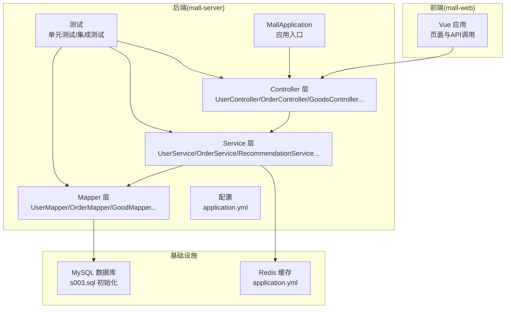
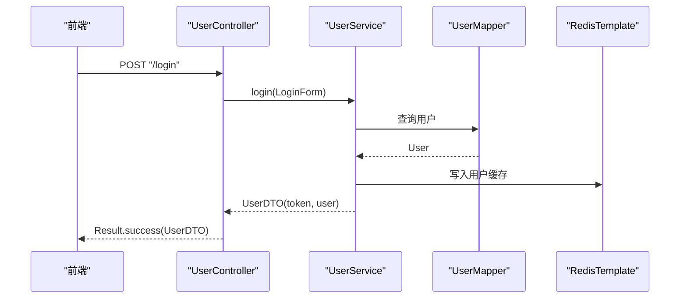
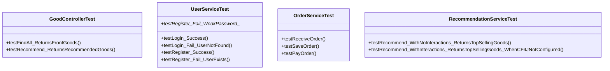
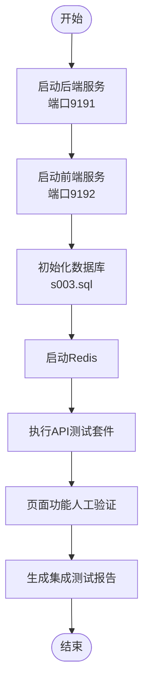
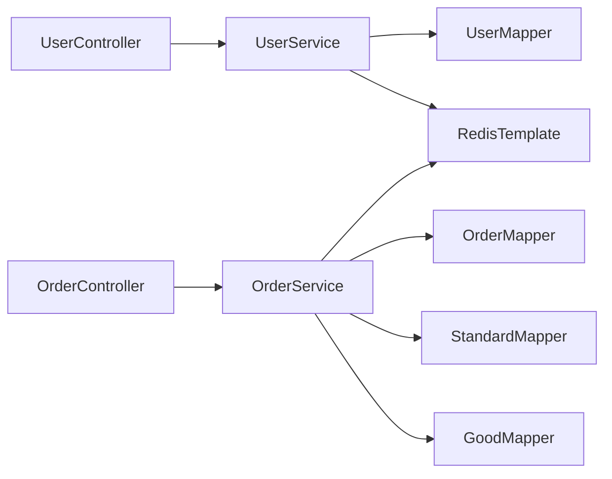
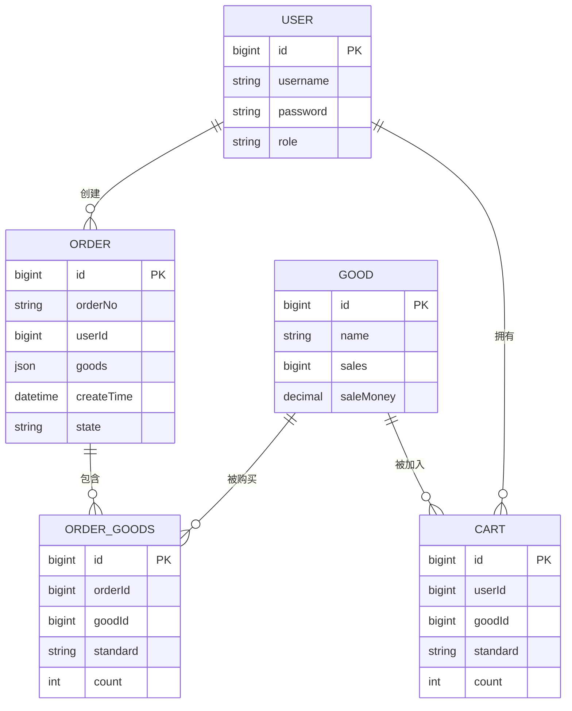

# 测试策略

<cite>
**本文引用的文件**   
- [GoodControllerTest.java](file://mall-server/src/test/java/com/rabbiter/em/controller/GoodControllerTest.java)
- [UserServiceTest.java](file://mall-server/src/test/java/com/rabbiter/em/service/UserServiceTest.java)
- [OrderServiceTest.java](file://mall-server/src/test/java/com/rabbiter/em/service/OrderServiceTest.java)
- [RecommendationServiceTest.java](file://mall-server/src/test/java/com/rabbiter/em/service/RecommendationServiceTest.java)
- [pom.xml](file://mall-server/pom.xml)
- [application.yml](file://mall-server/src/main/resources/application.yml)
- [MallApplication.java](file://mall-server/src/main/java/com/rabbiter/em/MallApplication.java)
- [UserService.java](file://mall-server/src/main/java/com/rabbiter/em/service/UserService.java)
- [OrderService.java](file://mall-server/src/main/java/com/rabbiter/em/service/OrderService.java)
- [UserController.java](file://mall-server/src/main/java/com/rabbiter/em/controller/UserController.java)
- [OrderController.java](file://mall-server/src/main/java/com/rabbiter/em/controller/OrderController.java)
- [s003.sql](file://s003.sql)
- [INTEGRATION_TEST_REPORT.md](file://INTEGRATION_TEST_REPORT.md)
- [README.md](file://README.md)
</cite>

## 目录
1. [引言](#引言)
2. [项目结构](#项目结构)
3. [核心组件](#核心组件)
4. [架构总览](#架构总览)
5. [详细组件分析](#详细组件分析)
6. [依赖分析](#依赖分析)
7. [性能考虑](#性能考虑)
8. [故障排查指南](#故障排查指南)
9. [结论](#结论)
10. [附录](#附录)

## 引言
本测试策略面向cosplay商城系统，覆盖从单元测试到集成测试、端到端测试、性能与压力测试、自动化执行与持续集成、测试数据管理与清理、测试报告与质量度量等全流程。文档旨在帮助开发与测试团队建立一致的质量保证体系，确保系统在功能、稳定性、安全性与性能方面满足预期。

## 项目结构
后端采用Spring Boot + MyBatis-Plus架构，测试位于独立的测试模块中；前端为Vue.js应用。数据库初始化脚本与集成测试报告提供了基础的环境与验证依据。

**图表来源**
- [MallApplication.java:1-17](file://mall-server/src/main/java/com/rabbiter/em/MallApplication.java#L1-L17)
- [application.yml:1-42](file://mall-server/src/main/resources/application.yml#L1-L42)
- [s003.sql:1-200](file://s003.sql#L1-L200)

**章节来源**
- [README.md:1-94](file://README.md#L1-L94)
- [INTEGRATION_TEST_REPORT.md:1-39](file://INTEGRATION_TEST_REPORT.md#L1-L39)

## 核心组件
- 控制器层：负责HTTP请求接入与鉴权控制，返回统一结果包装。
- 服务层：承载业务逻辑，包含事务、缓存与外部依赖交互。
- 数据访问层：MyBatis-Plus Mapper负责数据库操作。
- 配置与环境：数据库、Redis、JWT、编码与跨域等配置集中于application.yml。
- 测试：基于JUnit 5与Mockito的单元测试，覆盖Service与Controller关键路径。

**章节来源**
- [UserController.java:1-179](file://mall-server/src/main/java/com/rabbiter/em/controller/UserController.java#L1-L179)
- [OrderController.java:1-196](file://mall-server/src/main/java/com/rabbiter/em/controller/OrderController.java#L1-L196)
- [UserService.java:1-155](file://mall-server/src/main/java/com/rabbiter/em/service/UserService.java#L1-L155)
- [OrderService.java:1-184](file://mall-server/src/main/java/com/rabbiter/em/service/OrderService.java#L1-L184)
- [application.yml:1-42](file://mall-server/src/main/resources/application.yml#L1-L42)

## 架构总览
后端通过Controller接收请求，调用Service完成业务处理，Service通过Mapper访问数据库，并与Redis进行缓存交互。JWT用于鉴权，跨域在Controller层面开放。

**图表来源**
- [UserController.java:37-41](file://mall-server/src/main/java/com/rabbiter/em/controller/UserController.java#L37-L41)
- [UserService.java:44-75](file://mall-server/src/main/java/com/rabbiter/em/service/UserService.java#L44-L75)
- [application.yml:22-33](file://mall-server/src/main/resources/application.yml#L22-L33)

## 详细组件分析

### 单元测试设计与实现
- 测试框架与工具：JUnit 5 + Mockito，使用Mock注入Service/Controller依赖，避免真实数据库与Redis。
- 覆盖范围：
  - 控制器层：对API行为进行断言，如状态码、响应体字段。
  - 服务层：对业务逻辑分支、异常场景、外部依赖调用进行验证。
- 关键测试点：
  - 登录/注册：用户名不存在、密码强度校验、Redis写入与过期。
  - 订单流程：下单、支付（库存扣减、销量与销售额更新、缓存同步）、收货。
  - 推荐算法：无交互时回退到热销商品排序。

**图表来源**
- [GoodControllerTest.java:1-85](file://mall-server/src/test/java/com/rabbiter/em/controller/GoodControllerTest.java#L1-L85)
- [UserServiceTest.java:1-187](file://mall-server/src/test/java/com/rabbiter/em/service/UserServiceTest.java#L1-L187)
- [OrderServiceTest.java:1-152](file://mall-server/src/test/java/com/rabbiter/em/service/OrderServiceTest.java#L1-L152)
- [RecommendationServiceTest.java:1-87](file://mall-server/src/test/java/com/rabbiter/em/service/RecommendationServiceTest.java#L1-L87)

**章节来源**
- [GoodControllerTest.java:48-83](file://mall-server/src/test/java/com/rabbiter/em/controller/GoodControllerTest.java#L48-L83)
- [UserServiceTest.java:56-185](file://mall-server/src/test/java/com/rabbiter/em/service/UserServiceTest.java#L56-L185)
- [OrderServiceTest.java:78-150](file://mall-server/src/test/java/com/rabbiter/em/service/OrderServiceTest.java#L78-L150)
- [RecommendationServiceTest.java:55-85](file://mall-server/src/test/java/com/rabbiter/em/service/RecommendationServiceTest.java#L55-L85)

### 集成测试实施方案
- 目标：验证前后端连通性、核心API功能与页面交互。
- 环境：后端9191端口、前端9192端口、MySQL 8.0、Redis。
- 覆盖内容：商品分页查询、角色查询、文件上传（需人工验证）、跨域与Token传递。
- 关键修复：库存扣减SQL原子化、类加载问题修复。

**图表来源**
- [INTEGRATION_TEST_REPORT.md:1-39](file://INTEGRATION_TEST_REPORT.md#L1-L39)
- [s003.sql:1-200](file://s003.sql#L1-L200)
- [application.yml:1-42](file://mall-server/src/main/resources/application.yml#L1-L42)

**章节来源**
- [INTEGRATION_TEST_REPORT.md:1-39](file://INTEGRATION_TEST_REPORT.md#L1-L39)
- [README.md:33-76](file://README.md#L33-L76)

### 端到端测试（E2E）
- 场景建议：登录 -> 商品浏览 -> 加入购物车 -> 下单 -> 支付 -> 发货 -> 收货。
- 工具建议：Cypress或Playwright，结合后端Mock或测试数据库。
- 关键断言：订单状态流转、库存与销量一致性、缓存命中与更新。

[本节为概念性指导，无需具体文件引用]

### 测试覆盖率与测量
- 覆盖率工具：JaCoCo插件已在POM中配置，可在测试阶段生成报告。
- 要求建议：
  - 行覆盖率：≥80%
  - 分支覆盖率：≥70%
  - 关键路径（登录、下单、支付、库存扣减）覆盖率≥90%
- 报告生成：在CI中收集JaCoCo报告并上传至覆盖率平台。

**章节来源**
- [pom.xml:164-181](file://mall-server/pom.xml#L164-L181)

### 测试数据准备与管理
- 初始化脚本：使用s003.sql创建数据库与基础数据。
- 测试数据库：建议使用独立测试库或容器化MySQL/Redis，隔离测试数据。
- 数据清理：测试结束后清空或回滚，避免影响其他测试。
- 关键数据：用户、商品、规格、订单、购物车等。

**章节来源**
- [s003.sql:1-200](file://s003.sql#L1-L200)
- [application.yml:9-26](file://mall-server/src/main/resources/application.yml#L9-L26)

### 自动化测试配置与执行
- Maven插件：
  - maven-surefire-plugin：执行测试（当前配置为跳过测试，需调整）。
  - jacoco-maven-plugin：覆盖率采集与报告。
- 执行流程：本地/CI中先构建后执行测试，生成报告与覆盖率。
- 建议：将测试拆分为快速单元测试与慢集成测试，CI中分阶段执行。

**章节来源**
- [pom.xml:145-181](file://mall-server/pom.xml#L145-L181)

### 测试报告生成与分析
- 报告类型：JUnit XML、HTML报告、JaCoCo覆盖率报告。
- 分析维度：通过率、失败用例定位、热点函数/分支、回归趋势。
- CI集成：将报告归档并生成质量门禁。

[本节为通用流程说明，无需具体文件引用]

### 性能测试与压力测试
- 场景设计：
  - 并发登录/注册
  - 高并发下单与支付
  - 库存扣减与缓存读写
- 工具建议：JMeter或Gatling，结合Prometheus+Grafana监控资源。
- 指标建议：吞吐量、P95/P99延迟、错误率、CPU/内存/连接池使用率。

[本节为通用流程说明，无需具体文件引用]

### 持续集成与持续部署中的测试集成
- CI流水线建议：
  - 拉取代码 -> 安装依赖 -> 启动MySQL/Redis容器 -> 执行单元测试与覆盖率 -> 执行集成测试 -> 生成报告 -> 质量门禁 -> 构建镜像/包。
- 环境变量：通过application.yml的环境变量注入数据库与Redis配置。
- 回归策略：每次PR触发单元测试，主干合并触发集成测试。

**章节来源**
- [application.yml:9-26](file://mall-server/src/main/resources/application.yml#L9-L26)
- [pom.xml:145-181](file://mall-server/pom.xml#L145-L181)

### 测试环境搭建与维护
- 后端：按README步骤启动，确保端口、数据库与Redis可用。
- 前端：npm安装依赖后启动，确保代理指向后端9191端口。
- 数据库：使用s003.sql初始化，必要时导出测试快照。
- 维护：定期更新依赖版本，修复启动警告与兼容性问题。

**章节来源**
- [README.md:33-76](file://README.md#L33-L76)
- [s003.sql:1-200](file://s003.sql#L1-L200)

### 缺陷跟踪与回归测试管理
- 缺陷生命周期：发现 -> 分类 -> 修复 -> 验证 -> 关闭。
- 回归策略：关键缺陷修复后执行相关单元/集成测试，纳入回归套件。
- 跟踪工具：Jira/禅道等，结合CI失败通知与测试报告链接。

[本节为通用流程说明，无需具体文件引用]

### 测试最佳实践与质量度量
- 最佳实践：
  - TDD驱动：先写失败用例，再实现最小逻辑。
  - 隔离依赖：使用Mock/Stub，避免外部系统波动。
  - 参数化测试：覆盖边界值与异常场景。
  - 可重复性：固定随机种子、时间戳替换为可控值。
- 质量度量：
  - 缺陷密度、修复时间、测试执行时间、阻塞率、用户反馈缺陷分布。

[本节为通用流程说明，无需具体文件引用]

## 依赖分析
- 组件耦合：Controller依赖Service，Service依赖Mapper与Redis；测试通过Mock解耦。
- 外部依赖：MySQL、Redis、JWT、Swagger、MyBatis-Plus。
- 循环依赖：当前结构清晰，无循环依赖迹象。

**图表来源**
- [UserController.java:28-57](file://mall-server/src/main/java/com/rabbiter/em/controller/UserController.java#L28-L57)
- [OrderController.java:30-48](file://mall-server/src/main/java/com/rabbiter/em/controller/OrderController.java#L30-L48)
- [UserService.java:28-75](file://mall-server/src/main/java/com/rabbiter/em/service/UserService.java#L28-L75)
- [OrderService.java:35-48](file://mall-server/src/main/java/com/rabbiter/em/service/OrderService.java#L35-L48)

**章节来源**
- [UserService.java:1-155](file://mall-server/src/main/java/com/rabbiter/em/service/UserService.java#L1-L155)
- [OrderService.java:1-184](file://mall-server/src/main/java/com/rabbiter/em/service/OrderService.java#L1-L184)

## 性能考虑
- 事务边界：下单与支付使用@Transactional，注意锁粒度与超时。
- 缓存策略：登录态与热销商品缓存，减少数据库压力。
- 数据库优化：索引覆盖常见查询条件（用户名、订单号、商品ID）。
- 并发控制：库存扣减应使用原子操作，避免超卖。

[本节为通用指导，无需具体文件引用]

## 故障排查指南
- 启动失败：检查数据库连接参数、Redis连接、端口占用。
- 跨域问题：确认Controller已开启跨域，前端代理与后端端口一致。
- 登录失败：核对密码加密策略与Redis写入。
- 订单异常：核对库存扣减、销量与销售额更新、缓存同步。

**章节来源**
- [application.yml:9-33](file://mall-server/src/main/resources/application.yml#L9-L33)
- [UserController.java:26-26](file://mall-server/src/main/java/com/rabbiter/em/controller/UserController.java#L26-L26)
- [INTEGRATION_TEST_REPORT.md:24-27](file://INTEGRATION_TEST_REPORT.md#L24-L27)

## 结论
通过完善的单元测试、集成测试与覆盖率保障，结合自动化执行与CI集成，可有效提升cosplay商城系统的质量与稳定性。建议持续完善端到端测试、性能与压力测试，并建立规范的缺陷跟踪与回归流程。

## 附录
- 测试用例清单（示例）：
  - 用户登录/注册正反用例、弱密码校验、重复用户名。
  - 订单下单、支付、发货、收货状态机。
  - 推荐算法在无交互与有交互场景的行为。
- 数据模型概览（简化）：

**图表来源**
- [s003.sql:120-171](file://s003.sql#L120-L171)
- [OrderService.java:58-88](file://mall-server/src/main/java/com/rabbiter/em/service/OrderService.java#L58-L88)