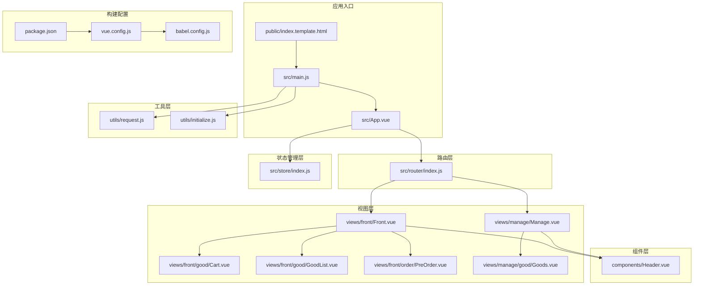
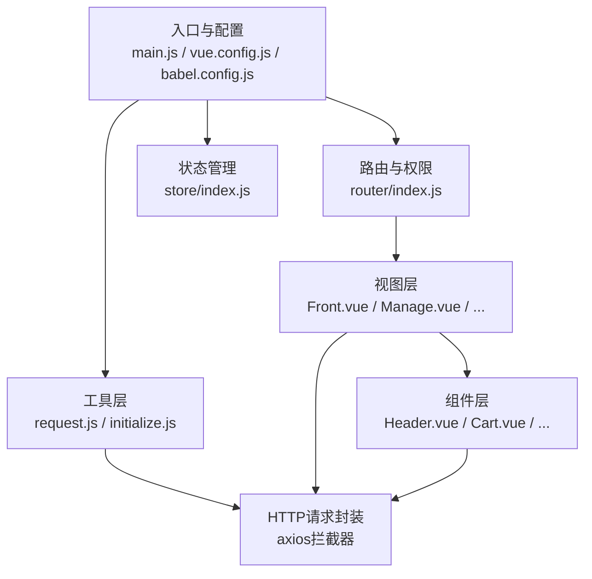
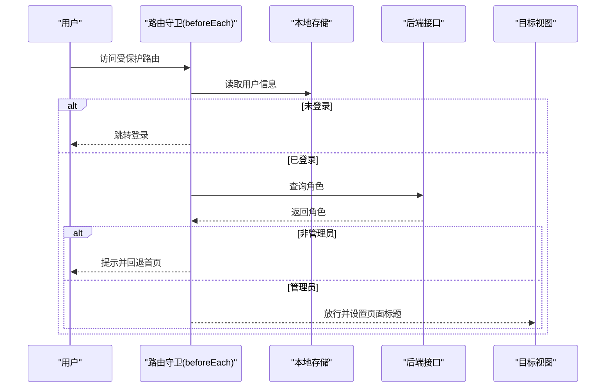
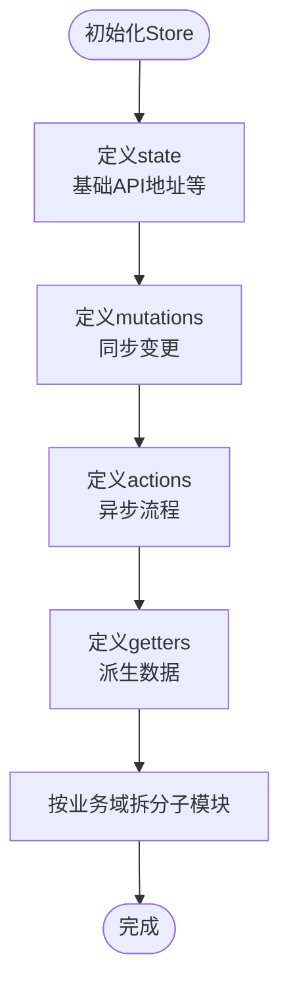
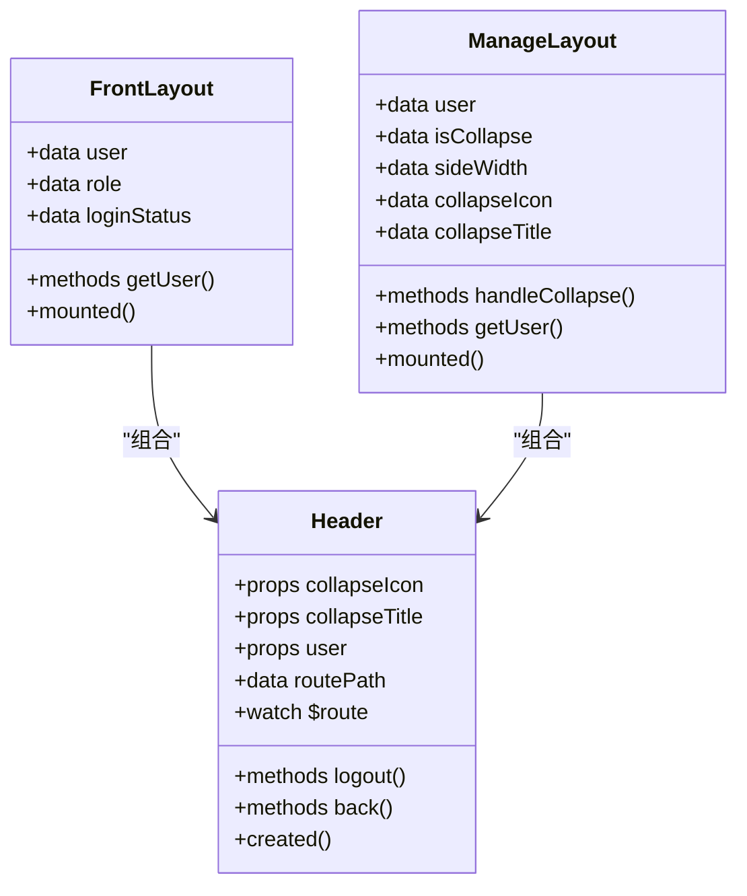
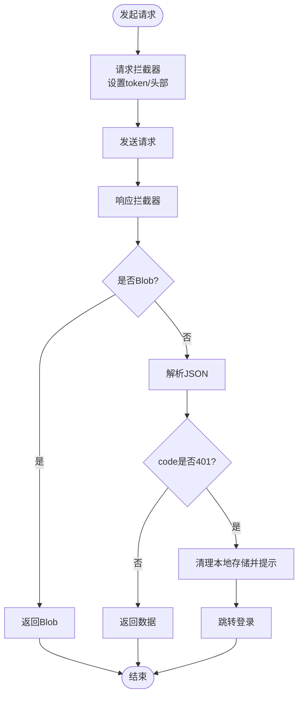
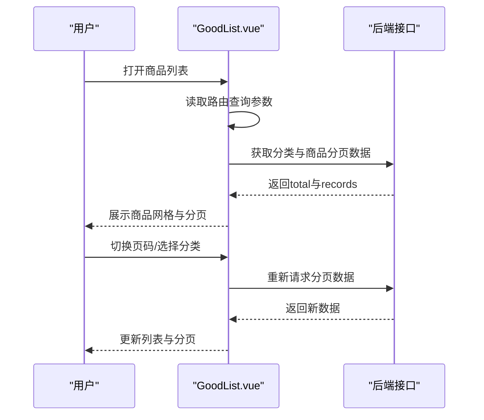
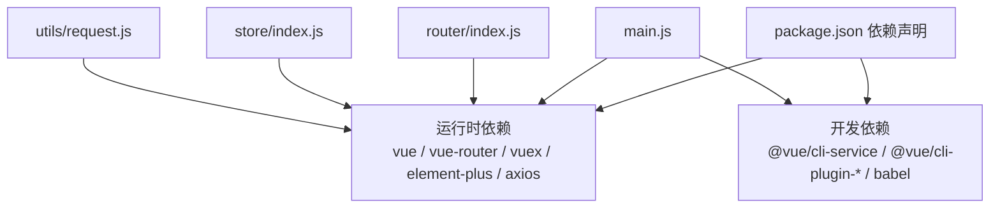

# 前端架构设计

<cite>
**本文档引用的文件**
- [package.json](file://mall-web/package.json)
- [vue.config.js](file://mall-web/vue.config.js)
- [main.js](file://mall-web/src/main.js)
- [App.vue](file://mall-web/src/App.vue)
- [router/index.js](file://mall-web/src/router/index.js)
- [store/index.js](file://mall-web/src/store/index.js)
- [utils/request.js](file://mall-web/src/utils/request.js)
- [utils/initialize.js](file://mall-web/src/utils/initialize.js)
- [components/Header.vue](file://mall-web/src/components/Header.vue)
- [views/front/Front.vue](file://mall-web/src/views/front/Front.vue)
- [views/manage/Manage.vue](file://mall-web/src/views/manage/Manage.vue)
- [views/front/good/Cart.vue](file://mall-web/src/views/front/good/Cart.vue)
- [views/front/good/GoodList.vue](file://mall-web/src/views/front/good/GoodList.vue)
- [views/front/order/PreOrder.vue](file://mall-web/src/views/front/order/PreOrder.vue)
- [views/manage/good/Goods.vue](file://mall-web/src/views/manage/good/Goods.vue)
- [public/index.template.html](file://mall-web/public/index.template.html)
- [babel.config.js](file://mall-web/babel.config.js)
</cite>

## 目录
1. [引言](#引言)
2. [项目结构](#项目结构)
3. [核心组件](#核心组件)
4. [架构总览](#架构总览)
5. [详细组件分析](#详细组件分析)
6. [依赖关系分析](#依赖关系分析)
7. [性能考虑](#性能考虑)
8. [故障排除指南](#故障排除指南)
9. [结论](#结论)
10. [附录](#附录)

## 引言
本文件面向Vue.js前端应用的架构设计，围绕组件化开发模式、状态管理、路由与权限控制、Element Plus组件库集成、构建与打包优化、前后端数据交互、组件通信与事件系统、以及性能优化与用户体验提升等方面进行系统性梳理与说明。旨在帮助开发者快速理解并高效扩展该前端工程。

## 项目结构
前端工程采用基于Vue 3的单页应用（SPA）架构，结合Vue Router进行路由管理，Vuex进行状态管理，Element Plus作为UI组件库，axios封装HTTP请求，通过Vue CLI进行构建与开发服务器配置。项目采用按功能域划分的目录组织方式，便于维护与扩展。

**图表来源**
- [main.js:1-18](file://mall-web/src/main.js#L1-L18)
- [App.vue:1-21](file://mall-web/src/App.vue#L1-L21)
- [router/index.js:1-161](file://mall-web/src/router/index.js#L1-L161)
- [store/index.js:1-21](file://mall-web/src/store/index.js#L1-L21)
- [utils/request.js:1-55](file://mall-web/src/utils/request.js#L1-L55)
- [utils/initialize.js:1-217](file://mall-web/src/utils/initialize.js#L1-L217)
- [components/Header.vue:1-93](file://mall-web/src/components/Header.vue#L1-L93)
- [views/front/Front.vue:1-79](file://mall-web/src/views/front/Front.vue#L1-L79)
- [views/manage/Manage.vue:1-111](file://mall-web/src/views/manage/Manage.vue#L1-L111)
- [views/front/good/Cart.vue:1-165](file://mall-web/src/views/front/good/Cart.vue#L1-L165)
- [views/front/good/GoodList.vue:1-485](file://mall-web/src/views/front/good/GoodList.vue#L1-L485)
- [views/front/order/PreOrder.vue:1-251](file://mall-web/src/views/front/order/PreOrder.vue#L1-L251)
- [views/manage/good/Goods.vue:1-289](file://mall-web/src/views/manage/good/Goods.vue#L1-L289)
- [public/index.template.html:1-24](file://mall-web/public/index.template.html#L1-L24)
- [vue.config.js:1-26](file://mall-web/vue.config.js#L1-L26)
- [babel.config.js:1-6](file://mall-web/babel.config.js#L1-L6)
- [package.json:1-32](file://mall-web/package.json#L1-L32)

**章节来源**
- [main.js:1-18](file://mall-web/src/main.js#L1-L18)
- [App.vue:1-21](file://mall-web/src/App.vue#L1-L21)
- [router/index.js:1-161](file://mall-web/src/router/index.js#L1-L161)
- [store/index.js:1-21](file://mall-web/src/store/index.js#L1-L21)
- [utils/request.js:1-55](file://mall-web/src/utils/request.js#L1-L55)
- [utils/initialize.js:1-217](file://mall-web/src/utils/initialize.js#L1-L217)
- [components/Header.vue:1-93](file://mall-web/src/components/Header.vue#L1-L93)
- [views/front/Front.vue:1-79](file://mall-web/src/views/front/Front.vue#L1-L79)
- [views/manage/Manage.vue:1-111](file://mall-web/src/views/manage/Manage.vue#L1-L111)
- [views/front/good/Cart.vue:1-165](file://mall-web/src/views/front/good/Cart.vue#L1-L165)
- [views/front/good/GoodList.vue:1-485](file://mall-web/src/views/front/good/GoodList.vue#L1-L485)
- [views/front/order/PreOrder.vue:1-251](file://mall-web/src/views/front/order/PreOrder.vue#L1-L251)
- [views/manage/good/Goods.vue:1-289](file://mall-web/src/views/manage/good/Goods.vue#L1-L289)
- [public/index.template.html:1-24](file://mall-web/public/index.template.html#L1-L24)
- [vue.config.js:1-26](file://mall-web/vue.config.js#L1-L26)
- [babel.config.js:1-6](file://mall-web/babel.config.js#L1-L6)
- [package.json:1-32](file://mall-web/package.json#L1-L32)

## 核心组件
- 应用入口与全局配置
  - 入口文件负责创建Vue实例、挂载Element Plus、路由与状态管理，并注入全局请求工具。
  - 构建配置通过Vue CLI提供开发服务器、代理、页面入口等能力。
- 路由与权限控制
  - 使用Vue Router 4的history模式，支持嵌套路由与动态导入，配合路由守卫实现登录态与角色权限校验。
- 状态管理
  - Vuex Store当前为空壳，可扩展为模块化状态管理，集中管理基础API地址等共享状态。
- 组件体系
  - 采用单文件组件（SFC），组件职责清晰，通过props、events、slots实现父子通信与插槽复用。
- UI组件库
  - Element Plus提供丰富的业务组件，如表格、分页、对话框、上传、标签等，配合主题与图标字体使用。
- 数据交互
  - axios封装请求拦截器与响应拦截器，统一封装token传递、错误处理与业务状态码处理。
- 初始化与兼容
  - initialize.js提供DOM元素初始化、图标注入与字体大小调整等增强逻辑，确保页面渲染一致性。

**章节来源**
- [main.js:1-18](file://mall-web/src/main.js#L1-L18)
- [router/index.js:1-161](file://mall-web/src/router/index.js#L1-L161)
- [store/index.js:1-21](file://mall-web/src/store/index.js#L1-L21)
- [utils/request.js:1-55](file://mall-web/src/utils/request.js#L1-L55)
- [utils/initialize.js:1-217](file://mall-web/src/utils/initialize.js#L1-L217)

## 架构总览
前端采用“入口配置 → 路由 → 视图/组件 → 工具/请求”的分层架构。路由层负责页面导航与权限校验；视图层承载业务页面；组件层提供可复用UI与交互；工具层提供HTTP请求与初始化逻辑；构建层提供开发与生产环境配置。

**图表来源**
- [main.js:1-18](file://mall-web/src/main.js#L1-L18)
- [router/index.js:1-161](file://mall-web/src/router/index.js#L1-L161)
- [store/index.js:1-21](file://mall-web/src/store/index.js#L1-L21)
- [utils/request.js:1-55](file://mall-web/src/utils/request.js#L1-L55)
- [utils/initialize.js:1-217](file://mall-web/src/utils/initialize.js#L1-L217)
- [views/front/Front.vue:1-79](file://mall-web/src/views/front/Front.vue#L1-L79)
- [views/manage/Manage.vue:1-111](file://mall-web/src/views/manage/Manage.vue#L1-L111)
- [components/Header.vue:1-93](file://mall-web/src/components/Header.vue#L1-L93)
- [views/front/good/Cart.vue:1-165](file://mall-web/src/views/front/good/Cart.vue#L1-L165)

## 详细组件分析

### 路由与权限控制（Vue Router）
- 路由结构
  - 前台路由：首页、个人中心、购物车、商品列表、商品详情、订单流程、地址管理、留言、售后等。
  - 后台路由：管理首页、用户管理、文件管理、轮播图管理、商品管理、订单管理、留言管理、售后管理、收入图表与排行等。
  - 动态导入：使用路由懒加载减少首屏体积。
  - 嵌套路由：前台与后台均采用children实现布局内嵌套。
- 路由守卫
  - beforeEach中根据meta字段判断是否需要登录或管理员权限。
  - 登录态校验：优先检查本地localStorage中的用户信息；若缺失则跳转登录。
  - 角色校验：调用后端接口获取角色，非管理员提示并回退首页。
  - 页面标题：根据meta.title动态设置document.title。
- 令牌与鉴权
  - 路由守卫中通过请求后端角色接口进行二次校验，避免前端伪造。

**图表来源**
- [router/index.js:84-150](file://mall-web/src/router/index.js#L84-L150)

**章节来源**
- [router/index.js:1-161](file://mall-web/src/router/index.js#L1-L161)

### 状态管理（Vuex）
- 当前状态
  - Store为空壳，仅定义基础API地址state，便于后续扩展。
- 设计建议
  - 将基础API地址、用户信息、全局配置等放入state。
  - mutations用于同步变更，actions用于异步流程与副作用。
  - getters用于派生数据，modules按业务域拆分。

**图表来源**
- [store/index.js:8-20](file://mall-web/src/store/index.js#L8-L20)

**章节来源**
- [store/index.js:1-21](file://mall-web/src/store/index.js#L1-L21)

### 组件化开发与复用（SFC）
- 单文件组件（SFC）结构
  - 模板（template）：定义结构与展示。
  - 脚本（script）：定义逻辑、props、methods、computed、生命周期等。
  - 样式（style）：作用域样式与全局样式。
- 复用策略
  - 抽象通用UI为组件（如Header、Cart、AddressBox等）。
  - 通过props传参、$emit触发事件、slots插槽实现灵活复用。
  - 在父组件中组合子组件，形成页面级组件树。

**图表来源**
- [components/Header.vue:42-80](file://mall-web/src/components/Header.vue#L42-L80)
- [views/front/Front.vue:20-69](file://mall-web/src/views/front/Front.vue#L20-L69)
- [views/manage/Manage.vue:60-109](file://mall-web/src/views/manage/Manage.vue#L60-L109)

**章节来源**
- [components/Header.vue:1-93](file://mall-web/src/components/Header.vue#L1-L93)
- [views/front/Front.vue:1-79](file://mall-web/src/views/front/Front.vue#L1-L79)
- [views/manage/Manage.vue:1-111](file://mall-web/src/views/manage/Manage.vue#L1-L111)

### Element Plus组件库集成与主题
- 集成方式
  - 在入口文件引入Element Plus并全局注册，随后在组件中直接使用其组件与图标。
- 主题与样式
  - 通过全局CSS与组件scoped样式实现视觉统一。
  - 图标字体通过资源文件引入，支持自定义图标库。
- 实战应用
  - 表格、分页、对话框、上传、标签、下拉菜单等广泛应用于商品管理、订单流程、地址管理等页面。

**章节来源**
- [main.js:5-11](file://mall-web/src/main.js#L5-L11)
- [views/front/good/GoodList.vue:197-485](file://mall-web/src/views/front/good/GoodList.vue#L197-L485)
- [views/front/order/PreOrder.vue:1-251](file://mall-web/src/views/front/order/PreOrder.vue#L1-L251)
- [views/manage/good/Goods.vue:1-289](file://mall-web/src/views/manage/good/Goods.vue#L1-L289)

### 构建配置与打包优化（Vue CLI/Webpack）
- 开发服务器与代理
  - 配置端口、跨域代理，将前端请求转发至后端服务，解决开发期跨域问题。
- 页面入口
  - 定义单页应用入口模板与标题，便于SEO与浏览器标签显示。
- Babel预设
  - 使用Vue CLI内置Babel预设，保证语法转换与兼容性。
- 生产优化建议
  - 代码分割：利用路由懒加载与动态import，按需加载模块。
  - Tree Shaking：移除未使用依赖，缩小包体。
  - CDN与静态资源：将第三方库与静态资源指向CDN，减少主包体积。
  - 压缩与缓存：开启gzip压缩与长效缓存策略。

**章节来源**
- [vue.config.js:1-26](file://mall-web/vue.config.js#L1-L26)
- [babel.config.js:1-6](file://mall-web/babel.config.js#L1-L6)
- [package.json:1-32](file://mall-web/package.json#L1-L32)
- [public/index.template.html:1-24](file://mall-web/public/index.template.html#L1-L24)

### 前后端数据交互（HTTP请求封装）
- 请求封装
  - axios实例配置baseURL与超时，统一设置Content-Type与token头。
  - 请求拦截器：注入token，统一编码与头部设置。
  - 响应拦截器：处理Blob下载、字符串解析、401错误（清理本地存储并跳转登录）。
- 错误处理
  - 对网络错误与业务错误分别处理，统一提示与跳转。
- 使用方式
  - 在main.js注入到全局属性，组件通过this.$store与this.$request访问状态与请求方法。

**图表来源**
- [utils/request.js:10-50](file://mall-web/src/utils/request.js#L10-L50)

**章节来源**
- [utils/request.js:1-55](file://mall-web/src/utils/request.js#L1-L55)
- [main.js:7-16](file://mall-web/src/main.js#L7-L16)

### 组件通信机制与事件系统
- Props与Events
  - 父组件通过props向下传递数据，子组件通过$emit向上抛出事件，实现松耦合通信。
- 插槽（Slots）
  - 通过默认插槽、具名插槽与作用域插槽，增强组件灵活性与复用性。
- 生命周期与状态
  - 在created/mounted中发起数据请求，watch监听路由变化触发刷新。
- 实例
  - Header接收用户信息与折叠状态，Manage与Front通过Header实现导航与用户信息展示。

**章节来源**
- [components/Header.vue:42-80](file://mall-web/src/components/Header.vue#L42-L80)
- [views/manage/Manage.vue:60-109](file://mall-web/src/views/manage/Manage.vue#L60-L109)
- [views/front/Front.vue:20-69](file://mall-web/src/views/front/Front.vue#L20-L69)

### 典型页面流程示例

#### 商品列表与分页
- 功能要点
  - 分类筛选与搜索条件联动，支持清空筛选查看全部。
  - 分页组件与后端分页参数对接，切换页码自动刷新数据。
  - 响应式布局适配不同屏幕尺寸。
- 关键路径
  - created中读取路由查询参数，初始化分类与数据。
  - watch监听路由变化，触发load方法。
  - load方法调用后端接口，更新total与records。

**图表来源**
- [views/front/good/GoodList.vue:123-194](file://mall-web/src/views/front/good/GoodList.vue#L123-L194)

**章节来源**
- [views/front/good/GoodList.vue:1-485](file://mall-web/src/views/front/good/GoodList.vue#L1-L485)

#### 购物车与订单提交
- 功能要点
  - 通过用户ID获取购物车列表，支持删除单项。
  - 订单确认页展示商品明细与价格计算，支持新增/编辑/删除收货地址。
  - 提交订单后跳转支付页。
- 关键路径
  - Cart.vue通过/userid与/cart/userid接口获取数据。
  - PreOrder.vue通过路由查询参数接收商品信息，计算总价与优惠，提交订单。

**章节来源**
- [views/front/good/Cart.vue:1-165](file://mall-web/src/views/front/good/Cart.vue#L1-L165)
- [views/front/order/PreOrder.vue:1-251](file://mall-web/src/views/front/order/PreOrder.vue#L1-L251)

#### 后台商品管理
- 功能要点
  - 列表展示商品信息，支持状态切换、推荐开关、分页与搜索。
  - 新增/编辑弹窗，支持图片上传与保存。
  - 删除采用二次确认，保障操作安全。
- 关键路径
  - Goods.vue通过fullPage接口获取分页数据，handleStatus与handleRecommend调用对应接口更新状态。

**章节来源**
- [views/manage/good/Goods.vue:1-289](file://mall-web/src/views/manage/good/Goods.vue#L1-L289)

## 依赖关系分析
- 运行时依赖
  - Vue 3、Vue Router 4、Vuex 4、Element Plus、axios、echarts、js-md5等。
- 开发依赖
  - @vue/cli-service及相关插件，Babel预设。
- 依赖关系图

**图表来源**
- [package.json:10-25](file://mall-web/package.json#L10-L25)
- [main.js:1-18](file://mall-web/src/main.js#L1-L18)
- [router/index.js:1-161](file://mall-web/src/router/index.js#L1-L161)
- [store/index.js:1-21](file://mall-web/src/store/index.js#L1-L21)
- [utils/request.js:1-55](file://mall-web/src/utils/request.js#L1-L55)

**章节来源**
- [package.json:1-32](file://mall-web/package.json#L1-L32)

## 性能考虑
- 代码分割与懒加载
  - 路由级懒加载与组件级按需加载，降低首屏脚本体积。
- 资源优化
  - 图片与静态资源CDN化，合理设置缓存策略。
  - 移除未使用依赖，启用Tree Shaking。
- 用户体验
  - 加载骨架屏与占位符，提升感知速度。
  - 分页与虚拟滚动（在大数据量场景）减少DOM压力。
- 开发与生产差异
  - 开发环境启用SourceMap与热更新，生产环境启用压缩与混淆。

## 故障排除指南
- 登录态失效
  - 现象：401错误或提示登录状态失效。
  - 处理：响应拦截器自动清理本地存储并跳转登录；路由守卫也会进行二次校验。
- 跨域问题
  - 现象：开发环境请求被拦截。
  - 处理：检查vue.config.js代理配置与target地址。
- 路由跳转异常
  - 现象：权限不足或未登录导致跳转。
  - 处理：检查路由meta字段与beforeEach逻辑。
- 图标与样式异常
  - 现象：图标不显示或样式错乱。
  - 处理：确认iconfont.css与全局样式引入顺序。

**章节来源**
- [utils/request.js:37-44](file://mall-web/src/utils/request.js#L37-L44)
- [router/index.js:84-150](file://mall-web/src/router/index.js#L84-L150)
- [vue.config.js:4-16](file://mall-web/vue.config.js#L4-L16)

## 结论
该前端工程以Vue 3为核心，结合Vue Router与Vuex构建了清晰的路由与状态管理框架，配合Element Plus实现丰富的业务交互。通过axios封装统一处理请求与响应，配合路由守卫实现完善的权限控制。项目采用模块化的目录结构与SFC组件化开发，具备良好的可维护性与扩展性。建议后续完善Vuex模块化、引入更细粒度的组件拆分与测试策略，并持续优化构建产物与运行时性能。

## 附录
- 快速启动
  - 安装依赖：npm install
  - 开发运行：npm run serve
  - 生产构建：npm run build
- 目录约定
  - src/components：通用组件
  - src/views：页面视图
  - src/router：路由配置
  - src/store：状态管理
  - src/utils：工具与HTTP封装
  - public：HTML模板与静态资源