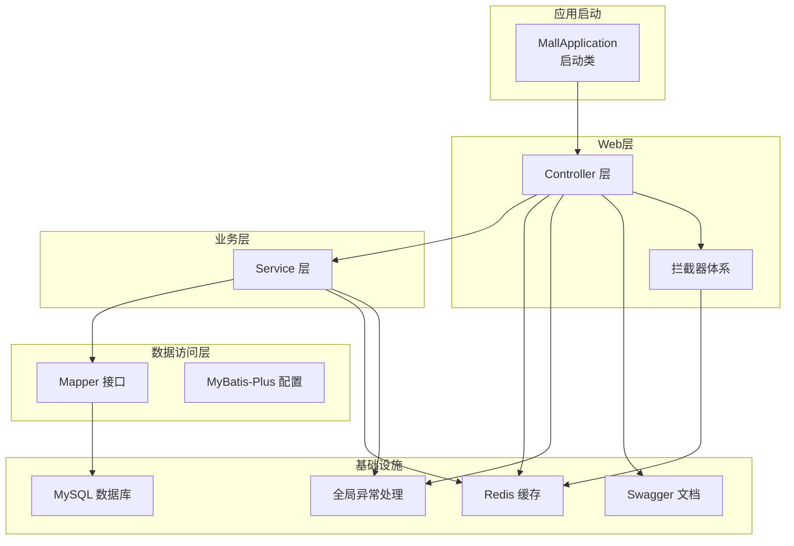
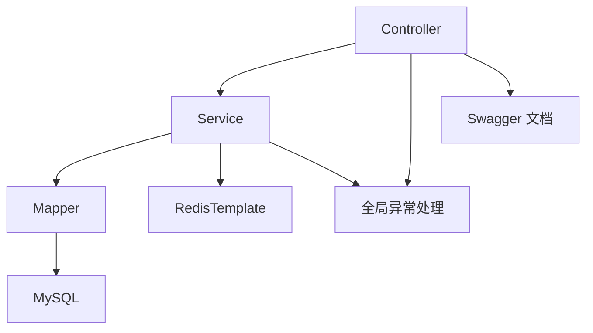
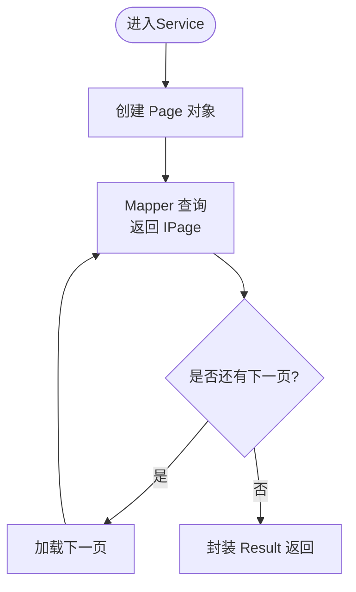
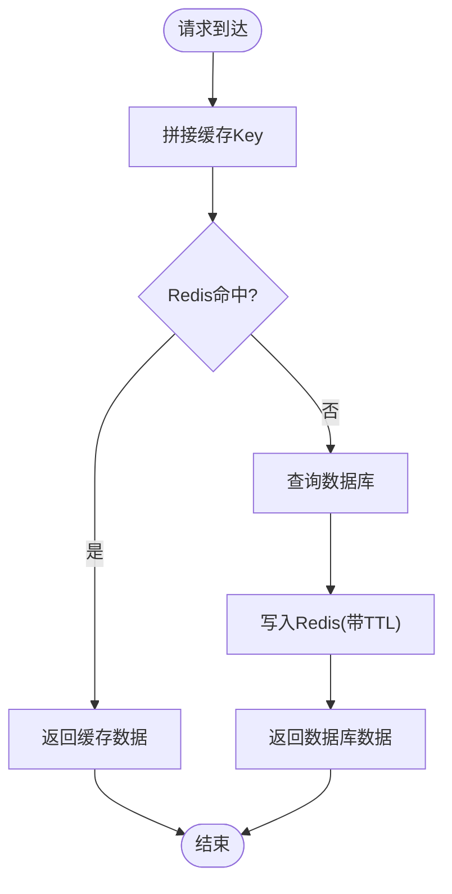
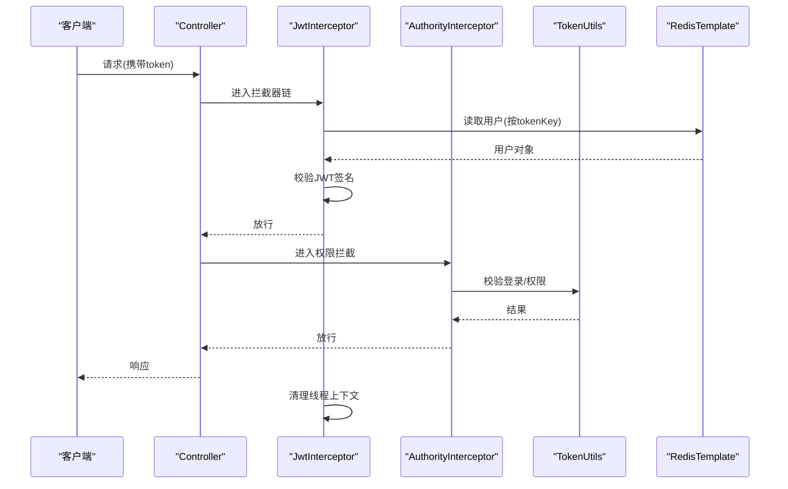
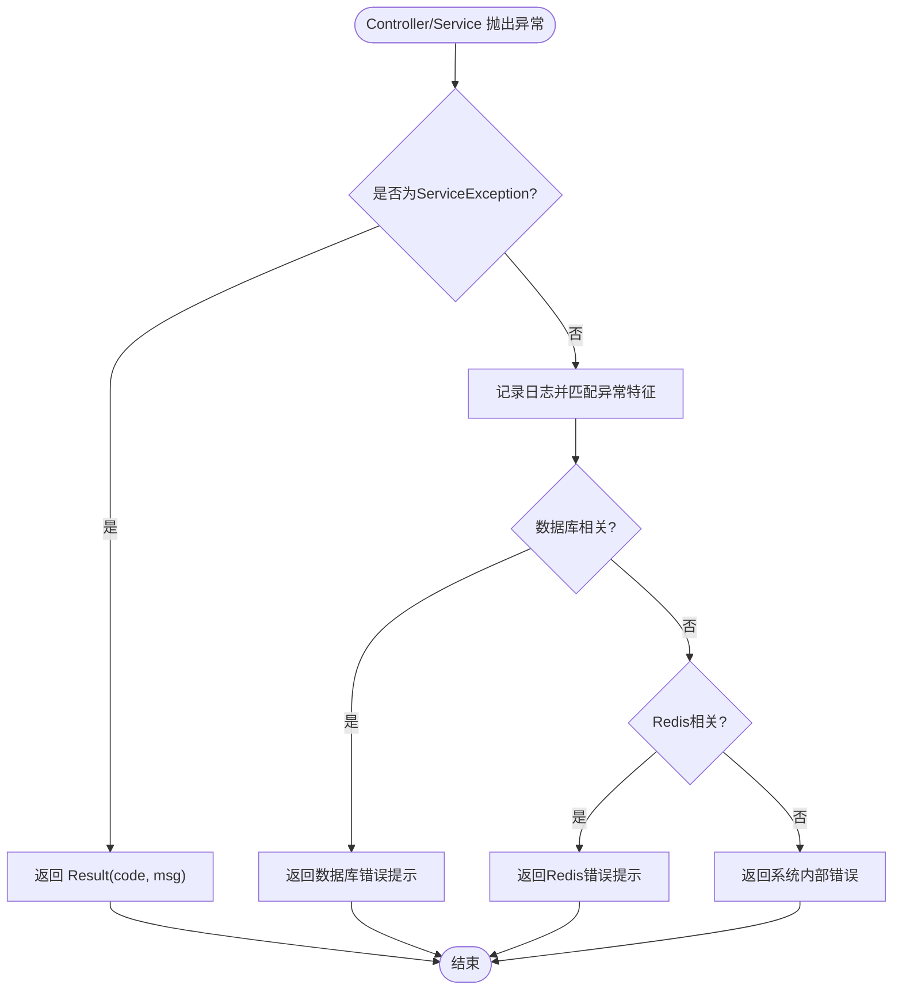
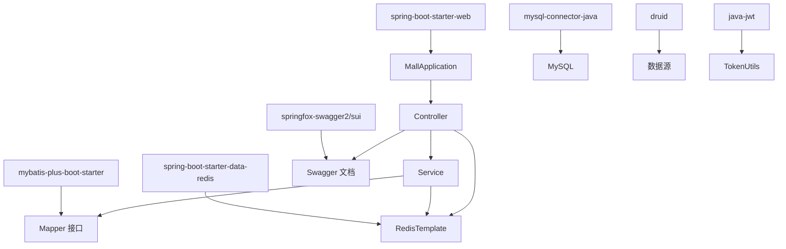

# 后端架构设计

<cite>
**本文引用的文件**
- [MallApplication.java](file://mall-server/src/main/java/com/rabbiter/em/MallApplication.java)
- [application.yml](file://mall-server/src/main/resources/application.yml)
- [pom.xml](file://mall-server/pom.xml)
- [MybatisPlusConfig.java](file://mall-server/src/main/java/com/rabbiter/em/config/MybatisPlusConfig.java)
- [RedisConfig.java](file://mall-server/src/main/java/com/rabbiter/em/config/RedisConfig.java)
- [GlobalExceptionHandler.java](file://mall-server/src/main/java/com/rabbiter/em/config/GlobalExceptionHandler.java)
- [InterceptorConfig.java](file://mall-server/src/main/java/com/rabbiter/em/config/InterceptorConfig.java)
- [SwaggerConfig.java](file://mall-server/src/main/java/com/rabbiter/em/config/SwaggerConfig.java)
- [Result.java](file://mall-server/src/main/java/com/rabbiter/em/common/Result.java)
- [ServiceException.java](file://mall-server/src/main/java/com/rabbiter/em/exception/ServiceException.java)
- [JwtInterceptor.java](file://mall-server/src/main/java/com/rabbiter/em/interceptor/JwtInterceptor.java)
- [AuthorityInterceptor.java](file://mall-server/src/main/java/com/rabbiter/em/interceptor/AuthorityInterceptor.java)
- [TokenUtils.java](file://mall-server/src/main/java/com/rabbiter/em/utils/TokenUtils.java)
- [Constants.java](file://mall-server/src/main/java/com/rabbiter/em/constants/Constants.java)
- [RedisConstants.java](file://mall-server/src/main/java/com/rabbiter/em/constants/RedisConstants.java)
</cite>

## 目录
1. [引言](#引言)
2. [项目结构](#项目结构)
3. [核心组件](#核心组件)
4. [架构总览](#架构总览)
5. [详细组件分析](#详细组件分析)
6. [依赖分析](#依赖分析)
7. [性能考虑](#性能考虑)
8. [故障排查指南](#故障排查指南)
9. [结论](#结论)
10. [附录](#附录)

## 引言
本文件面向Spring Boot后端系统，系统采用分层架构与MVC模式组织代码：Controller层负责请求接入与响应封装；Service层封装业务逻辑；Mapper层负责数据访问；配合MyBatis-Plus实现分页、条件构造与批量操作；Redis提供缓存与会话存储；拦截器体系完成JWT认证与权限控制；全局异常处理器统一返回格式与错误码；Swagger集成用于API文档与接口测试。

## 项目结构
后端工程位于 mall-server 模块，采用标准Spring Boot目录结构，按功能域划分包：
- config：应用配置（MyBatis-Plus、Redis、拦截器、Swagger、编码/CORS等）
- controller：HTTP入口，接收请求并调用Service
- service：业务逻辑封装
- mapper：数据访问接口（XML映射位于resources/mapper）
- entity：实体与DTO
- exception：自定义异常
- interceptor：拦截器（JWT、权限）
- utils：工具类（Token、用户上下文、路径等）
- common：通用返回体
- constants：常量定义
- resources：配置文件与Mapper XML

图表来源
- [MallApplication.java:10-14](file://mall-server/src/main/java/com/rabbiter/em/MallApplication.java#L10-L14)
- [MybatisPlusConfig.java:12-19](file://mall-server/src/main/java/com/rabbiter/em/config/MybatisPlusConfig.java#L12-L19)
- [RedisConfig.java:14-23](file://mall-server/src/main/java/com/rabbiter/em/config/RedisConfig.java#L14-L23)
- [GlobalExceptionHandler.java:16-20](file://mall-server/src/main/java/com/rabbiter/em/config/GlobalExceptionHandler.java#L16-L20)
- [SwaggerConfig.java:17-31](file://mall-server/src/main/java/com/rabbiter/em/config/SwaggerConfig.java#L17-L31)

章节来源
- [MallApplication.java:1-17](file://mall-server/src/main/java/com/rabbiter/em/MallApplication.java#L1-L17)
- [application.yml:1-42](file://mall-server/src/main/resources/application.yml#L1-L42)
- [pom.xml:19-100](file://mall-server/pom.xml#L19-L100)

## 核心组件
- 应用启动与扫描
  - 启动类启用Spring Boot并扫描mapper包，确保Mapper接口被注册为Bean。
- 配置中心
  - application.yml集中管理数据库、Redis、JWT密钥、MyBatis映射路径与驼峰规则。
- 分页与数据访问
  - MyBatis-Plus拦截器注入分页插件，限制最大每页条数，简化分页查询。
- 缓存与序列化
  - Redis模板配置键值序列化策略，支持Object与User类型专用模板。
- 全局异常处理
  - 统一捕获业务异常与系统异常，输出标准化Result结构。
- 拦截器体系
  - JWT拦截器：校验token、从Redis读取用户并写入线程上下文、刷新过期时间。
  - 权限拦截器：基于注解判断登录态与管理员权限。
- 工具与常量
  - TokenUtils：生成/解析JWT、校验登录与权限。
  - Constants/RedisConstants：统一错误码与缓存键前缀及TTL。

章节来源
- [MallApplication.java:8-9](file://mall-server/src/main/java/com/rabbiter/em/MallApplication.java#L8-L9)
- [application.yml:8-41](file://mall-server/src/main/resources/application.yml#L8-L41)
- [MybatisPlusConfig.java:12-19](file://mall-server/src/main/java/com/rabbiter/em/config/MybatisPlusConfig.java#L12-L19)
- [RedisConfig.java:14-35](file://mall-server/src/main/java/com/rabbiter/em/config/RedisConfig.java#L14-L35)
- [GlobalExceptionHandler.java:16-43](file://mall-server/src/main/java/com/rabbiter/em/config/GlobalExceptionHandler.java#L16-L43)
- [JwtInterceptor.java:40-98](file://mall-server/src/main/java/com/rabbiter/em/interceptor/JwtInterceptor.java#L40-L98)
- [AuthorityInterceptor.java:18-47](file://mall-server/src/main/java/com/rabbiter/em/interceptor/AuthorityInterceptor.java#L18-L47)
- [TokenUtils.java:31-77](file://mall-server/src/main/java/com/rabbiter/em/utils/TokenUtils.java#L31-L77)
- [Constants.java:5-11](file://mall-server/src/main/java/com/rabbiter/em/constants/Constants.java#L5-L11)
- [RedisConstants.java:3-9](file://mall-server/src/main/java/com/rabbiter/em/constants/RedisConstants.java#L3-L9)

## 架构总览
系统遵循经典的三层架构与MVC模式：
- 表现层（Controller）：接收HTTP请求，参数校验，调用Service，封装Result响应。
- 领域层（Service）：编排业务流程，调用Mapper与缓存，处理领域规则。
- 基础设施层（Mapper/Redis/DB）：持久化与缓存交互，提供数据能力。

图表来源
- [GlobalExceptionHandler.java:16-43](file://mall-server/src/main/java/com/rabbiter/em/config/GlobalExceptionHandler.java#L16-L43)
- [SwaggerConfig.java:17-31](file://mall-server/src/main/java/com/rabbiter/em/config/SwaggerConfig.java#L17-L31)

## 详细组件分析

### MVC架构与分层职责
- Controller层
  - 职责：路由入口、参数绑定、调用Service、返回Result。
  - 特性：结合拦截器进行鉴权与权限校验，减少重复逻辑。
- Service层
  - 职责：事务边界、业务编排、缓存命中与更新、异常向上抛出。
- Mapper层
  - 职责：SQL映射与基础CRUD，配合MyBatis-Plus实现分页、条件构造、批量操作。

章节来源
- [Result.java:11-23](file://mall-server/src/main/java/com/rabbiter/em/common/Result.java#L11-L23)
- [ServiceException.java:6-16](file://mall-server/src/main/java/com/rabbiter/em/exception/ServiceException.java#L6-L16)

### MyBatis-Plus配置与使用
- 配置要点
  - 注册MybatisPlusInterceptor，添加PaginationInnerInterceptor，限制每页最大记录数。
- 使用场景
  - 分页查询：在Service中传入Page对象，Mapper返回IPage。
  - 条件构造器：Wrapper链式拼接查询条件，提升可读性与安全性。
  - 批量操作：BatchInsert/Update等，减少往返次数。
- 复杂度与性能
  - 分页复杂度O(n)，注意设置合理最大limit避免超大页。
  - Wrapper条件查询需关注索引使用，避免全表扫描。

图表来源
- [MybatisPlusConfig.java:12-19](file://mall-server/src/main/java/com/rabbiter/em/config/MybatisPlusConfig.java#L12-L19)

章节来源
- [MybatisPlusConfig.java:12-19](file://mall-server/src/main/java/com/rabbiter/em/config/MybatisPlusConfig.java#L12-L19)

### Redis缓存配置与策略
- 配置
  - 键值序列化：StringRedisSerializer；值序列化：GenericJackson2JsonRedisSerializer。
  - 提供通用模板与User专用模板，便于类型安全。
- 策略
  - 用户会话：以token为key，存储User对象，设置TTL，访问时续期。
  - 商品详情：以商品ID为key，短期TTL，热点数据优先缓存。
- 缓存穿透
  - 解决方案：空值缓存+短TTL；或布隆过滤器预判。
- 缓存雪崩
  - 解决方案：TTL加随机抖动；热点key双写降级；多级缓存。
- 缓存一致性
  - 写操作先DB后删缓存；读操作未命中再写缓存（懒加载）。

图表来源
- [RedisConfig.java:14-23](file://mall-server/src/main/java/com/rabbiter/em/config/RedisConfig.java#L14-L23)
- [RedisConstants.java:3-9](file://mall-server/src/main/java/com/rabbiter/em/constants/RedisConstants.java#L3-L9)
- [JwtInterceptor.java:69-81](file://mall-server/src/main/java/com/rabbiter/em/interceptor/JwtInterceptor.java#L69-L81)

章节来源
- [RedisConfig.java:14-35](file://mall-server/src/main/java/com/rabbiter/em/config/RedisConfig.java#L14-L35)
- [RedisConstants.java:3-9](file://mall-server/src/main/java/com/rabbiter/em/constants/RedisConstants.java#L3-L9)
- [JwtInterceptor.java:69-81](file://mall-server/src/main/java/com/rabbiter/em/interceptor/JwtInterceptor.java#L69-L81)

### 拦截器体系：JWT认证与权限控制
- JWT拦截器
  - 作用：提取token，校验签名，从Redis读取用户并放入线程上下文，刷新过期时间。
  - 注解优先级：方法注解覆盖类注解；无注解默认要求登录。
- 权限拦截器
  - 作用：根据注解判断是否需要登录或管理员权限；通过工具类校验当前用户角色。
- 生命周期
  - preHandle：鉴权与权限校验。
  - afterCompletion：清理线程上下文，避免内存泄漏。

图表来源
- [JwtInterceptor.java:40-98](file://mall-server/src/main/java/com/rabbiter/em/interceptor/JwtInterceptor.java#L40-L98)
- [AuthorityInterceptor.java:18-47](file://mall-server/src/main/java/com/rabbiter/em/interceptor/AuthorityInterceptor.java#L18-L47)
- [TokenUtils.java:50-77](file://mall-server/src/main/java/com/rabbiter/em/utils/TokenUtils.java#L50-L77)
- [RedisConstants.java:3-5](file://mall-server/src/main/java/com/rabbiter/em/constants/RedisConstants.java#L3-L5)

章节来源
- [InterceptorConfig.java:18-30](file://mall-server/src/main/java/com/rabbiter/em/config/InterceptorConfig.java#L18-L30)
- [JwtInterceptor.java:40-98](file://mall-server/src/main/java/com/rabbiter/em/interceptor/JwtInterceptor.java#L40-L98)
- [AuthorityInterceptor.java:18-47](file://mall-server/src/main/java/com/rabbiter/em/interceptor/AuthorityInterceptor.java#L18-L47)
- [TokenUtils.java:50-77](file://mall-server/src/main/java/com/rabbiter/em/utils/TokenUtils.java#L50-L77)

### 全局异常处理与错误码规范
- 规范
  - 统一返回Result(code, msg, data)，错误码来源于Constants。
  - 自定义业务异常ServiceException，携带code与message。
- 处理策略
  - 捕获ServiceException：直接返回其code与message。
  - 捕获Exception：根据异常消息特征匹配数据库/Redis连接问题、SQL语法错误等，返回友好提示。
- 错误码
  - 成功/系统错误/未找到/401/403等，便于前端统一处理。

图表来源
- [GlobalExceptionHandler.java:16-43](file://mall-server/src/main/java/com/rabbiter/em/config/GlobalExceptionHandler.java#L16-L43)
- [ServiceException.java:6-16](file://mall-server/src/main/java/com/rabbiter/em/exception/ServiceException.java#L6-L16)
- [Constants.java:5-11](file://mall-server/src/main/java/com/rabbiter/em/constants/Constants.java#L5-L11)

章节来源
- [GlobalExceptionHandler.java:16-43](file://mall-server/src/main/java/com/rabbiter/em/config/GlobalExceptionHandler.java#L16-L43)
- [ServiceException.java:6-16](file://mall-server/src/main/java/com/rabbiter/em/exception/ServiceException.java#L6-L16)
- [Constants.java:5-11](file://mall-server/src/main/java/com/rabbiter/em/constants/Constants.java#L5-L11)

### Swagger API文档与接口测试策略
- 集成
  - SwaggerConfig启用Swagger2，扫描controller包，生成REST API文档。
- 测试策略
  - 在线调试：通过UI输入参数，快速验证接口行为。
  - 参数校验：结合全局异常处理与Result格式，定位错误原因。
  - 权限测试：通过携带不同token验证JWT与权限拦截器效果。

章节来源
- [SwaggerConfig.java:17-31](file://mall-server/src/main/java/com/rabbiter/em/config/SwaggerConfig.java#L17-L31)

### Spring Boot自动配置与依赖注入
- 自动配置
  - @SpringBootApplication启用组件扫描与自动配置。
  - @MapperScan扫描mapper包，注册Mapper接口为Bean。
  - application.yml提供外部化配置，覆盖默认行为。
- 依赖注入
  - @Component/@Service/@Repository/@Controller由容器管理。
  - @Resource/@Autowired实现字段注入与构造注入。
- 插件与构建
  - Maven插件：spring-boot-maven-plugin、Surefire、JaCoCo。

章节来源
- [MallApplication.java:8-9](file://mall-server/src/main/java/com/rabbiter/em/MallApplication.java#L8-L9)
- [application.yml:8-41](file://mall-server/src/main/resources/application.yml#L8-L41)
- [pom.xml:144-182](file://mall-server/pom.xml#L144-L182)

## 依赖分析
- 外部依赖
  - Web：spring-boot-starter-web
  - ORM：mybatis-spring-boot-starter、mybatis-plus-boot-starter
  - 数据源：druid
  - 缓存：spring-boot-starter-data-redis
  - 安全：java-jwt
  - 工具：hutool、fastjson
  - 文档：springfox-swagger2、springfox-swagger-ui
  - 加解密：spring-security-crypto
- 内部模块耦合
  - Controller依赖Service；Service依赖Mapper与Redis；异常处理与工具类被广泛复用。
  - 拦截器依赖Redis与TokenUtils，形成鉴权闭环。

图表来源
- [pom.xml:19-100](file://mall-server/pom.xml#L19-L100)
- [application.yml:8-41](file://mall-server/src/main/resources/application.yml#L8-L41)

章节来源
- [pom.xml:19-100](file://mall-server/pom.xml#L19-L100)
- [application.yml:8-41](file://mall-server/src/main/resources/application.yml#L8-L41)

## 性能考虑
- 数据访问
  - 合理设置分页大小与最大limit，避免超大页导致内存压力。
  - 使用Wrapper条件查询时确保索引命中，必要时拆分查询。
- 缓存
  - 热点key设置短TTL并开启随机抖动，避免雪崩。
  - 写操作采用“先DB后删缓存”策略，保证一致性。
- 网络与序列化
  - Redis使用JSON序列化，注意字段命名与嵌套深度，避免过大对象。
- 并发
  - 拦截器链顺序合理，避免重复鉴权；线程上下文在afterCompletion及时清理。

## 故障排查指南
- 数据库连接失败
  - 现象：异常消息包含特定关键字。
  - 排查：核对DB_HOST/PORT/NAME/USER/PASS环境变量与URL配置。
- Redis连接失败
  - 现象：异常消息包含Redis相关关键字。
  - 排查：确认Redis服务运行、密码与网络连通性。
- SQL语法错误
  - 现象：SQLSyntaxErrorException。
  - 排查：检查Mapper XML与动态SQL拼接。
- token失效/权限不足
  - 现象：401/403错误码。
  - 排查：确认token是否过期、Redis中是否存在对应用户、用户角色是否为admin。

章节来源
- [GlobalExceptionHandler.java:22-43](file://mall-server/src/main/java/com/rabbiter/em/config/GlobalExceptionHandler.java#L22-L43)
- [Constants.java:5-11](file://mall-server/src/main/java/com/rabbiter/em/constants/Constants.java#L5-L11)

## 结论
该后端系统以清晰的分层与MVC模式为基础，结合MyBatis-Plus、Redis与拦截器体系，实现了高内聚低耦合的架构。通过统一的异常处理与Result返回格式，提升了前后端协作效率。建议后续完善缓存一致性策略与接口幂等设计，并持续优化热点数据的缓存命中率与查询性能。

## 附录
- 关键配置项
  - 数据库：driver-class-name、url、username、password
  - Redis：host、port、password、pool配置、连接超时
  - JWT：secret
  - MyBatis：mapper-locations、map-underscore-to-camel-case
- 常用工具
  - TokenUtils：生成/校验JWT、获取当前用户
  - UserHolder：线程上下文持有用户
  - PathUtils：资源路径工具