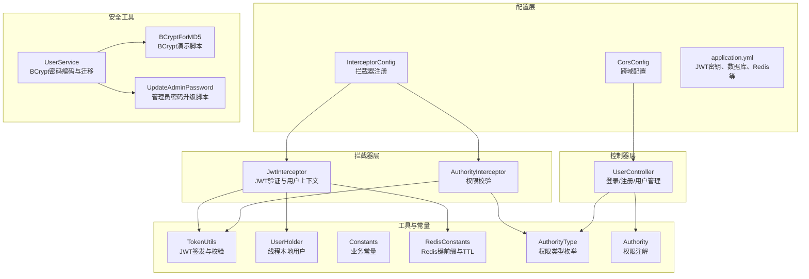
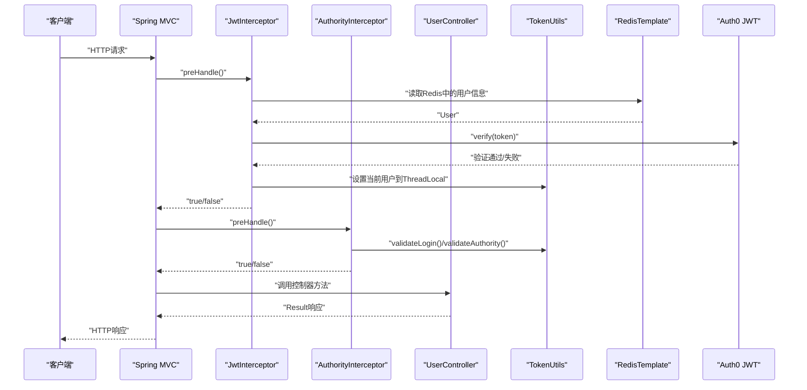
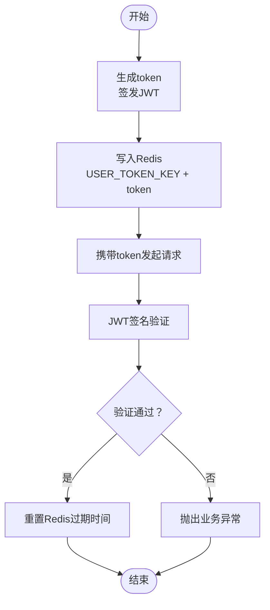
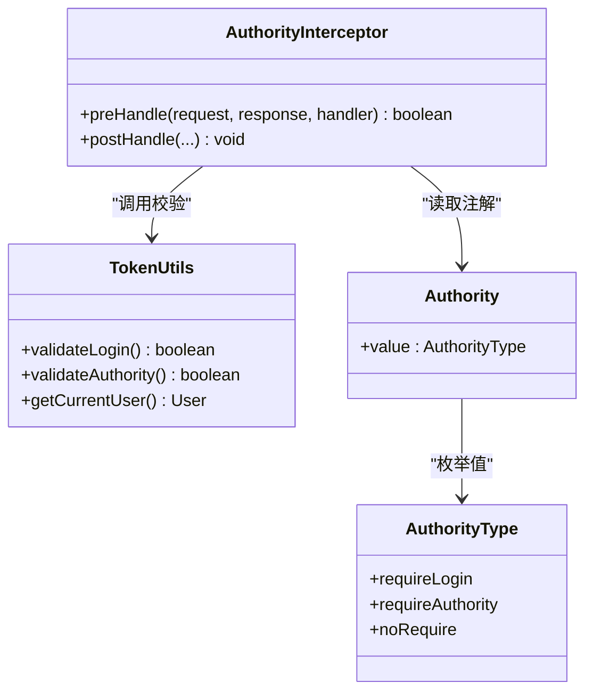
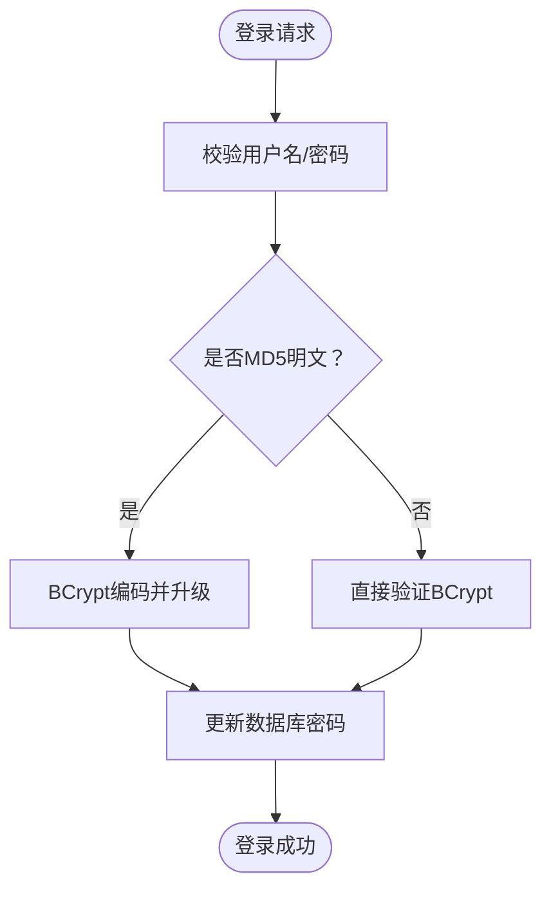
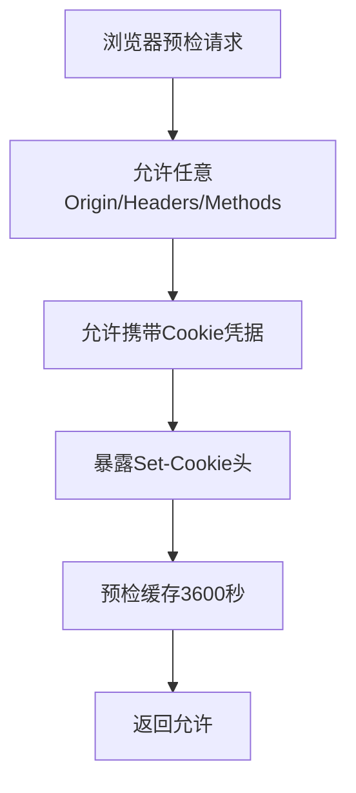
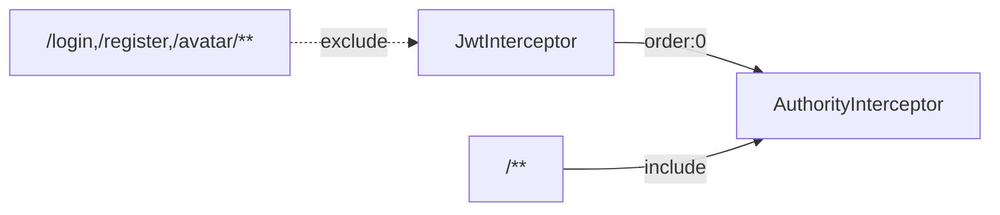

# 安全架构设计

<cite>
**本文引用的文件**
- [CorsConfig.java](file://mall-server/src/main/java/com/rabbiter/em/config/CorsConfig.java)
- [GlobalExceptionHandler.java](file://mall-server/src/main/java/com/rabbiter/em/config/GlobalExceptionHandler.java)
- [JwtInterceptor.java](file://mall-server/src/main/java/com/rabbiter/em/interceptor/JwtInterceptor.java)
- [AuthorityInterceptor.java](file://mall-server/src/main/java/com/rabbiter/em/interceptor/AuthorityInterceptor.java)
- [TokenUtils.java](file://mall-server/src/main/java/com/rabbiter/em/utils/TokenUtils.java)
- [Authority.java](file://mall-server/src/main/java/com/rabbiter/em/annotation/Authority.java)
- [Constants.java](file://mall-server/src/main/java/com/rabbiter/em/constants/Constants.java)
- [RedisConstants.java](file://mall-server/src/main/java/com/rabbiter/em/constants/RedisConstants.java)
- [AuthorityType.java](file://mall-server/src/main/java/com/rabbiter/em/entity/AuthorityType.java)
- [UserHolder.java](file://mall-server/src/main/java/com/rabbiter/em/utils/UserHolder.java)
- [UserController.java](file://mall-server/src/main/java/com/rabbiter/em/controller/UserController.java)
- [InterceptorConfig.java](file://mall-server/src/main/java/com/rabbiter/em/config/InterceptorConfig.java)
- [application.yml](file://mall-server/src/main/resources/application.yml)
- [BCryptForMD5.java](file://mall-server/BCryptForMD5.java)
- [UpdateAdminPassword.java](file://mall-server/UpdateAdminPassword.java)
- [UserService.java](file://mall-server/src/main/java/com/rabbiter/em/service/UserService.java)
</cite>

## 目录
1. [引言](#引言)
2. [项目结构](#项目结构)
3. [核心组件](#核心组件)
4. [架构总览](#架构总览)
5. [详细组件分析](#详细组件分析)
6. [依赖分析](#依赖分析)
7. [性能考量](#性能考量)
8. [故障排查指南](#故障排查指南)
9. [结论](#结论)
10. [附录](#附录)

## 引言
本文件面向cosplay商城系统的安全架构设计，围绕认证与授权、权限拦截、密码加密、跨域配置、输入与输出安全、异常处理、会话与状态管理、审计与日志、以及安全测试与扫描等方面进行全面阐述。文档以代码为依据，结合系统实际实现，帮助开发与运维人员理解并优化安全体系。

## 项目结构
后端采用Spring Boot工程，安全相关模块主要分布在以下包与配置中：
- 配置层：跨域、拦截器注册、编码、MyBatis Plus、Redis、Swagger等
- 拦截器层：JWT拦截器与权限拦截器
- 工具与常量：Token工具、用户上下文、常量定义、Redis键前缀
- 控制器层：用户相关接口（登录、注册、查询、分页、重置密码等）
- 安全工具：BCrypt密码编码与迁移脚本
- 全局异常处理：统一异常返回与敏感信息过滤

图表来源
- [CorsConfig.java:10-28](file://mall-server/src/main/java/com/rabbiter/em/config/CorsConfig.java#L10-L28)
- [InterceptorConfig.java:12-36](file://mall-server/src/main/java/com/rabbiter/em/config/InterceptorConfig.java#L12-L36)
- [JwtInterceptor.java:34-99](file://mall-server/src/main/java/com/rabbiter/em/interceptor/JwtInterceptor.java#L34-L99)
- [AuthorityInterceptor.java:15-53](file://mall-server/src/main/java/com/rabbiter/em/interceptor/AuthorityInterceptor.java#L15-L53)
- [TokenUtils.java:18-77](file://mall-server/src/main/java/com/rabbiter/em/utils/TokenUtils.java#L18-L77)
- [UserHolder.java:5-19](file://mall-server/src/main/java/com/rabbiter/em/utils/UserHolder.java#L5-L19)
- [Constants.java:5-15](file://mall-server/src/main/java/com/rabbiter/em/constants/Constants.java#L5-L15)
- [RedisConstants.java:3-9](file://mall-server/src/main/java/com/rabbiter/em/constants/RedisConstants.java#L3-L9)
- [AuthorityType.java:3-7](file://mall-server/src/main/java/com/rabbiter/em/entity/AuthorityType.java#L3-L7)
- [Authority.java:10-12](file://mall-server/src/main/java/com/rabbiter/em/annotation/Authority.java#L10-L12)
- [UserController.java:26-178](file://mall-server/src/main/java/com/rabbiter/em/controller/UserController.java#L26-L178)
- [UserService.java:16,41,54,60,100:16-16](file://mall-server/src/main/java/com/rabbiter/em/service/UserService.java#L16-L16)

章节来源
- [CorsConfig.java:10-28](file://mall-server/src/main/java/com/rabbiter/em/config/CorsConfig.java#L10-L28)
- [InterceptorConfig.java:12-36](file://mall-server/src/main/java/com/rabbiter/em/config/InterceptorConfig.java#L12-L36)
- [application.yml:35-36](file://mall-server/src/main/resources/application.yml#L35-L36)

## 核心组件
- 跨域配置：允许任意源、方法、请求头，并携带凭据，暴露Set-Cookie头，设置缓存时间。
- 全局异常处理：对数据库连接、Redis、SQL语法等常见错误进行识别与友好提示，避免泄露敏感信息。
- 拦截器链：JWT拦截器负责token解析、Redis用户读取、JWT签名验证与过期时间续期；权限拦截器基于注解判断登录态与管理员权限。
- Token工具：封装JWT签发、解码、当前用户获取、登录与权限校验逻辑。
- 权限注解与类型：通过@Authority与AuthorityType声明式控制访问级别。
- 常量与Redis常量：集中管理HTTP状态码、业务错误码、Redis键前缀与TTL。
- 用户上下文：ThreadLocal保存当前用户，确保后续业务可获取身份信息。
- 密码策略：服务端使用BCrypt编码，兼容旧MD5迁移，保证密码安全存储。

章节来源
- [CorsConfig.java:18-24](file://mall-server/src/main/java/com/rabbiter/em/config/CorsConfig.java#L18-L24)
- [GlobalExceptionHandler.java:16-43](file://mall-server/src/main/java/com/rabbiter/em/config/GlobalExceptionHandler.java#L16-L43)
- [JwtInterceptor.java:40-98](file://mall-server/src/main/java/com/rabbiter/em/interceptor/JwtInterceptor.java#L40-L98)
- [AuthorityInterceptor.java:17-47](file://mall-server/src/main/java/com/rabbiter/em/interceptor/AuthorityInterceptor.java#L17-L47)
- [TokenUtils.java:31-77](file://mall-server/src/main/java/com/rabbiter/em/utils/TokenUtils.java#L31-L77)
- [Authority.java:10-12](file://mall-server/src/main/java/com/rabbiter/em/annotation/Authority.java#L10-L12)
- [AuthorityType.java:3-7](file://mall-server/src/main/java/com/rabbiter/em/entity/AuthorityType.java#L3-L7)
- [Constants.java:5-15](file://mall-server/src/main/java/com/rabbiter/em/constants/Constants.java#L5-L15)
- [RedisConstants.java:3-9](file://mall-server/src/main/java/com/rabbiter/em/constants/RedisConstants.java#L3-L9)
- [UserHolder.java:5-19](file://mall-server/src/main/java/com/rabbiter/em/utils/UserHolder.java#L5-L19)
- [UserService.java:41,54,60,100:41-41](file://mall-server/src/main/java/com/rabbiter/em/service/UserService.java#L41-L41)

## 架构总览
系统采用“拦截器链 + 注解 + 工具类”的安全控制模式：
- 请求进入后先由JWT拦截器完成token解析与用户上下文绑定，并进行JWT签名验证与Redis续期；
- 再由权限拦截器根据@Authority注解判定是否需要登录或管理员权限；
- 控制器通过注解声明访问级别，如需管理员权限则仅admin可访问；
- 全局异常处理器统一捕获异常并屏蔽敏感信息；
- 跨域配置支持Cookie凭据，便于前后端同源策略下的会话保持。

图表来源
- [JwtInterceptor.java:40-98](file://mall-server/src/main/java/com/rabbiter/em/interceptor/JwtInterceptor.java#L40-L98)
- [AuthorityInterceptor.java:17-47](file://mall-server/src/main/java/com/rabbiter/em/interceptor/AuthorityInterceptor.java#L17-L47)
- [TokenUtils.java:50-75](file://mall-server/src/main/java/com/rabbiter/em/utils/TokenUtils.java#L50-L75)
- [UserController.java:37-57](file://mall-server/src/main/java/com/rabbiter/em/controller/UserController.java#L37-L57)

## 详细组件分析

### JWT认证机制
- token生成：使用HMAC256算法与配置中心的密钥签发，受众字段包含用户标识。
- token验证：在拦截器中使用相同密钥进行签名验证，失败时抛出业务异常。
- token续期：每次请求命中后重设Redis键过期时间，维持活跃会话。
- 当前用户获取：通过线程本地变量UserHolder获取，供业务层使用。

图表来源
- [TokenUtils.java:31-36](file://mall-server/src/main/java/com/rabbiter/em/utils/TokenUtils.java#L31-L36)
- [JwtInterceptor.java:69,82-91](file://mall-server/src/main/java/com/rabbiter/em/interceptor/JwtInterceptor.java#L69,L82-L91)
- [RedisConstants.java:4-5](file://mall-server/src/main/java/com/rabbiter/em/constants/RedisConstants.java#L4-L5)

章节来源
- [TokenUtils.java:31-36](file://mall-server/src/main/java/com/rabbiter/em/utils/TokenUtils.java#L31-L36)
- [JwtInterceptor.java:69,82-91](file://mall-server/src/main/java/com/rabbiter/em/interceptor/JwtInterceptor.java#L69,L82-L91)
- [RedisConstants.java:4-5](file://mall-server/src/main/java/com/rabbiter/em/constants/RedisConstants.java#L4-L5)

### 权限控制拦截器
- 登录态校验：validateLogin通过解码token受众判断是否已登录。
- 管理员校验：validateAuthority从当前用户上下文中获取角色，admin放行。
- 注解驱动：@Authority可标注类或方法，方法注解优先级更高；支持requireLogin、requireAuthority、noRequire三种类型。

图表来源
- [AuthorityInterceptor.java:17-47](file://mall-server/src/main/java/com/rabbiter/em/interceptor/AuthorityInterceptor.java#L17-L47)
- [TokenUtils.java:50-75](file://mall-server/src/main/java/com/rabbiter/em/utils/TokenUtils.java#L50-L75)
- [Authority.java:10-12](file://mall-server/src/main/java/com/rabbiter/em/annotation/Authority.java#L10-L12)
- [AuthorityType.java:3-7](file://mall-server/src/main/java/com/rabbiter/em/entity/AuthorityType.java#L3-L7)

章节来源
- [AuthorityInterceptor.java:17-47](file://mall-server/src/main/java/com/rabbiter/em/interceptor/AuthorityInterceptor.java#L17-L47)
- [TokenUtils.java:50-75](file://mall-server/src/main/java/com/rabbiter/em/utils/TokenUtils.java#L50-L75)
- [Authority.java:10-12](file://mall-server/src/main/java/com/rabbiter/em/annotation/Authority.java#L10-L12)
- [AuthorityType.java:3-7](file://mall-server/src/main/java/com/rabbiter/em/entity/AuthorityType.java#L3-L7)

### 密码加密策略
- 编码器：服务端使用BCryptPasswordEncoder进行密码编码。
- 迁移策略：对旧MD5密码进行透明升级，首次登录时转换为BCrypt格式并回写。
- 示例脚本：提供BCryptForMD5与UpdateAdminPassword用于演示与批量升级。

图表来源
- [UserService.java:41,54,60,100:41-41](file://mall-server/src/main/java/com/rabbiter/em/service/UserService.java#L41-L41)
- [UserService.java:54,60,100:54-54](file://mall-server/src/main/java/com/rabbiter/em/service/UserService.java#L54-L54)
- [UserService.java:60,100:60-60](file://mall-server/src/main/java/com/rabbiter/em/service/UserService.java#L60-L60)
- [UserService.java:100](file://mall-server/src/main/java/com/rabbiter/em/service/UserService.java#L100-L100)
- [BCryptForMD5.java:4-16](file://mall-server/BCryptForMD5.java#L4-L16)
- [UpdateAdminPassword.java:5,12-17,28:5-5](file://mall-server/UpdateAdminPassword.java#L5-L5)

章节来源
- [UserService.java:41,54,60,100:41-41](file://mall-server/src/main/java/com/rabbiter/em/service/UserService.java#L41-L41)
- [BCryptForMD5.java:4-16](file://mall-server/BCryptForMD5.java#L4-L16)
- [UpdateAdminPassword.java:5,12-17,28:5-5](file://mall-server/UpdateAdminPassword.java#L5-L5)

### 跨域资源共享（CORS）安全配置
- 允许任意源、方法与请求头，支持携带Cookie凭据；
- 暴露Set-Cookie头，提升会话一致性；
- 设置预检缓存时间为3600秒，减少重复预检请求。

图表来源
- [CorsConfig.java:18-24](file://mall-server/src/main/java/com/rabbiter/em/config/CorsConfig.java#L18-L24)

章节来源
- [CorsConfig.java:18-24](file://mall-server/src/main/java/com/rabbiter/em/config/CorsConfig.java#L18-L24)

### SQL注入、XSS与CSRF防护
- SQL注入：使用MyBatis-Plus的条件构造器与分页插件，避免拼接SQL；参数化查询默认生效。
- XSS：后端返回统一结构，未见对输入内容进行HTML转义的通用规则；建议在视图层或前端渲染时进行转义。
- CSRF：未发现专门的CSRF令牌机制；建议引入Spring Security CSRF或自定义令牌方案。

章节来源
- [UserController.java:150-162](file://mall-server/src/main/java/com/rabbiter/em/controller/UserController.java#L150-L150)
- [application.yml:39-41](file://mall-server/src/main/resources/application.yml#L39-L41)

### 全局异常处理与敏感信息过滤
- 对数据库连接、Redis、SQL语法等错误进行识别并返回统一错误码与提示；
- 屏蔽底层异常细节，避免泄露数据库版本、表名等敏感信息。

章节来源
- [GlobalExceptionHandler.java:16-43](file://mall-server/src/main/java/com/rabbiter/em/config/GlobalExceptionHandler.java#L16-L43)

### 会话管理与用户状态维护
- 会话载体：token存储于Redis，键前缀与TTL集中管理；
- 状态维护：通过线程本地变量UserHolder保存当前用户，拦截器结束后清理；
- 续期策略：每次请求命中后重置Redis过期时间，维持活跃会话。

章节来源
- [RedisConstants.java:4-5](file://mall-server/src/main/java/com/rabbiter/em/constants/RedisConstants.java#L4-L5)
- [JwtInterceptor.java:78-80](file://mall-server/src/main/java/com/rabbiter/em/interceptor/JwtInterceptor.java#L78-L80)
- [UserHolder.java:8-18](file://mall-server/src/main/java/com/rabbiter/em/utils/UserHolder.java#L8-L18)

### 安全审计与日志记录
- 建议：在拦截器与控制器的关键节点增加审计日志（登录、登出、权限变更、敏感操作），并记录用户IP、UA、操作详情与结果。
- 日志脱敏：对口令、token等敏感字段进行脱敏处理，避免落库泄露。

（本节为概念性建议，不直接对应具体文件）

### 安全漏洞扫描与渗透测试最佳实践
- 扫描范围：接口覆盖率、鉴权绕过、越权访问、敏感数据泄露、弱口令、不安全的CORS配置。
- 渗透测试：模拟登录态窃取、JWT伪造、权限提升、上传恶意文件、SQL注入与XSS验证。
- 工具建议：OWASP ZAP、Burp Suite、Nuclei、SQLMap等。

（本节为概念性建议，不直接对应具体文件）

## 依赖分析
拦截器注册顺序与路径匹配如下：
- JWT拦截器优先，排除登录、注册、头像等无需登录的路径；
- 权限拦截器次之，对所有路径生效，配合注解进行细粒度控制。

图表来源
- [InterceptorConfig.java:18-30](file://mall-server/src/main/java/com/rabbiter/em/config/InterceptorConfig.java#L18-L30)

章节来源
- [InterceptorConfig.java:18-30](file://mall-server/src/main/java/com/rabbiter/em/config/InterceptorConfig.java#L18-L30)

## 性能考量
- Redis命中率：合理设置TTL与键前缀，避免内存膨胀；
- JWT验证成本：HMAC256验证轻量，但需注意密钥管理与轮换；
- 跨域预检缓存：适当延长maxAge可降低预检开销；
- 异常处理：避免在异常处理器中进行复杂计算，保持快速返回。

（本节为通用指导，不直接对应具体文件）

## 故障排查指南
- token失效/验证失败：检查Redis中是否存在对应键、TTL是否过期、JWT密钥是否一致。
- 权限不足：确认当前用户角色是否为admin，控制器注解是否正确。
- 数据库/Redis连接失败：查看全局异常处理器对特定错误的识别与提示。
- 跨域问题：确认是否携带Cookie、是否允许相应Origin/Headers/Methods。

章节来源
- [JwtInterceptor.java:61-77](file://mall-server/src/main/java/com/rabbiter/em/interceptor/JwtInterceptor.java#L61-L77)
- [AuthorityInterceptor.java:36-43](file://mall-server/src/main/java/com/rabbiter/em/interceptor/AuthorityInterceptor.java#L36-L43)
- [GlobalExceptionHandler.java:22-43](file://mall-server/src/main/java/com/rabbiter/em/config/GlobalExceptionHandler.java#L22-L43)
- [CorsConfig.java:18-24](file://mall-server/src/main/java/com/rabbiter/em/config/CorsConfig.java#L18-L24)

## 结论
本系统通过拦截器链与注解实现了清晰的认证与授权控制，结合Redis会话与BCrypt密码策略，构建了基础的安全框架。建议进一步完善CSRF防护、XSS输入输出处理、审计日志与安全扫描流程，以满足生产环境的纵深防御要求。

## 附录
- 关键配置项：JWT密钥位于配置文件中，应妥善保管并定期轮换。
- 接口示例：登录、注册、用户查询、分页与重置密码等均体现权限注解的使用。

章节来源
- [application.yml:35-36](file://mall-server/src/main/resources/application.yml#L35-L36)
- [UserController.java:37-57](file://mall-server/src/main/java/com/rabbiter/em/controller/UserController.java#L37-L57)
- [UserController.java:83,106,123,143,172:83-83](file://mall-server/src/main/java/com/rabbiter/em/controller/UserController.java#L83-L83)