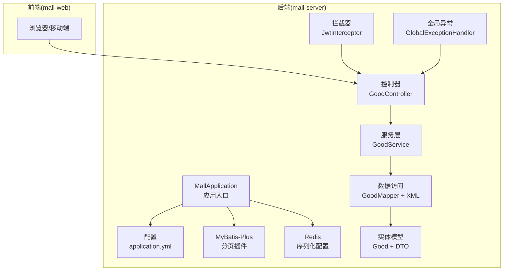
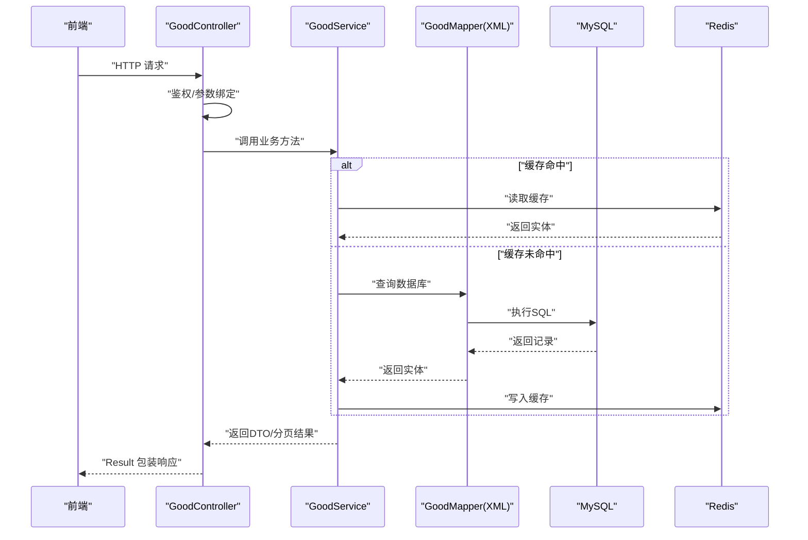
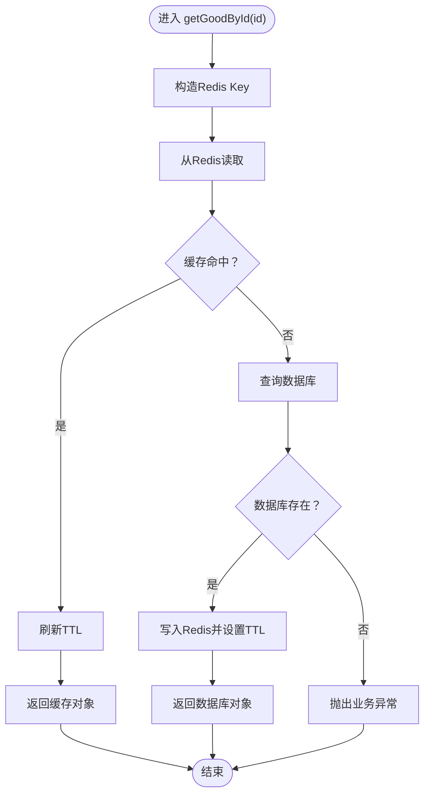
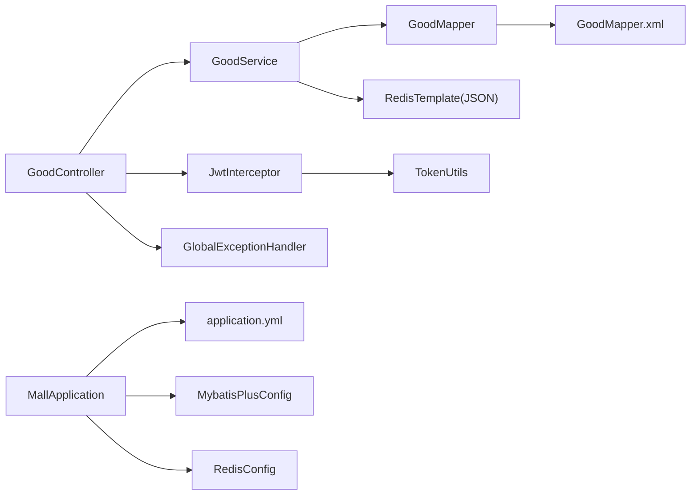

# 数据流设计

<cite>
**本文引用的文件**
- [MallApplication.java](file://mall-server/src/main/java/com/rabbiter/em/MallApplication.java)
- [application.yml](file://mall-server/src/main/resources/application.yml)
- [MybatisPlusConfig.java](file://mall-server/src/main/java/com/rabbiter/em/config/MybatisPlusConfig.java)
- [RedisConfig.java](file://mall-server/src/main/java/com/rabbiter/em/config/RedisConfig.java)
- [Result.java](file://mall-server/src/main/java/com/rabbiter/em/common/Result.java)
- [GoodController.java](file://mall-server/src/main/java/com/rabbiter/em/controller/GoodController.java)
- [GoodService.java](file://mall-server/src/main/java/com/rabbiter/em/service/GoodService.java)
- [GoodMapper.java](file://mall-server/src/main/java/com/rabbiter/em/mapper/GoodMapper.java)
- [GoodMapper.xml](file://mall-server/src/main/resources/mapper/GoodMapper.xml)
- [Good.java](file://mall-server/src/main/java/com/rabbiter/em/entity/Good.java)
- [GoodDTO.java](file://mall-server/src/main/java/com/rabbiter/em/entity/dto/GoodDTO.java)
- [JwtInterceptor.java](file://mall-server/src/main/java/com/rabbiter/em/interceptor/JwtInterceptor.java)
- [GlobalExceptionHandler.java](file://mall-server/src/main/java/com/rabbiter/em/config/GlobalExceptionHandler.java)
- [TokenUtils.java](file://mall-server/src/main/java/com/rabbiter/em/utils/TokenUtils.java)
- [RedisConstants.java](file://mall-server/src/main/java/com/rabbiter/em/constants/RedisConstants.java)
</cite>

## 目录
1. [引言](#引言)
2. [项目结构](#项目结构)
3. [核心组件](#核心组件)
4. [架构总览](#架构总览)
5. [详细组件分析](#详细组件分析)
6. [依赖分析](#依赖分析)
7. [性能考虑](#性能考虑)
8. [故障排查指南](#故障排查指南)
9. [结论](#结论)
10. [附录](#附录)

## 引言
本文件面向cosplay商城系统的数据流设计，系统采用Spring Boot + MyBatis-Plus + MySQL + Redis的技术栈，遵循MVC分层与领域模型设计。本文围绕“从前端请求到数据库”的完整数据流展开，覆盖请求解析、参数校验、业务处理、数据持久化、缓存读写一致性、事务与一致性保障、序列化与反序列化、分页与批量优化、监控与性能分析以及备份与恢复等主题。

## 项目结构
- 后端工程位于 mall-server，采用标准Spring Boot目录结构，按功能域划分controller、service、mapper、entity、config、common、utils等包。
- 资源文件位于resources，包含application.yml配置、MyBatis Mapper XML文件等。
- 前端工程位于mall-web，使用Vue生态，通过HTTP与后端交互。

图表来源
- [MallApplication.java:1-17](file://mall-server/src/main/java/com/rabbiter/em/MallApplication.java#L1-L17)
- [application.yml:1-42](file://mall-server/src/main/resources/application.yml#L1-L42)
- [MybatisPlusConfig.java:1-21](file://mall-server/src/main/java/com/rabbiter/em/config/MybatisPlusConfig.java#L1-L21)
- [RedisConfig.java:1-38](file://mall-server/src/main/java/com/rabbiter/em/config/RedisConfig.java#L1-L38)
- [GoodController.java:1-209](file://mall-server/src/main/java/com/rabbiter/em/controller/GoodController.java#L1-L209)
- [GoodService.java:1-281](file://mall-server/src/main/java/com/rabbiter/em/service/GoodService.java#L1-L281)
- [GoodMapper.java:1-43](file://mall-server/src/main/java/com/rabbiter/em/mapper/GoodMapper.java#L1-L43)
- [GoodMapper.xml:1-33](file://mall-server/src/main/resources/mapper/GoodMapper.xml#L1-L33)
- [Good.java:1-232](file://mall-server/src/main/java/com/rabbiter/em/entity/Good.java#L1-L232)
- [GoodDTO.java:1-83](file://mall-server/src/main/java/com/rabbiter/em/entity/dto/GoodDTO.java#L1-L83)
- [JwtInterceptor.java:1-100](file://mall-server/src/main/java/com/rabbiter/em/interceptor/JwtInterceptor.java#L1-L100)
- [GlobalExceptionHandler.java:1-45](file://mall-server/src/main/java/com/rabbiter/em/config/GlobalExceptionHandler.java#L1-L45)

章节来源
- [MallApplication.java:1-17](file://mall-server/src/main/java/com/rabbiter/em/MallApplication.java#L1-L17)
- [application.yml:1-42](file://mall-server/src/main/resources/application.yml#L1-L42)

## 核心组件
- 控制器层：统一返回包装Result，负责参数接收、鉴权注解、调用服务层并返回结果。
- 服务层：封装业务规则、缓存读写、批量查询、DTO转换、分页处理。
- 数据访问层：基于MyBatis-Plus与XML SQL，提供基础CRUD与聚合查询。
- 实体与DTO：Good为持久化实体，GoodDTO用于对外传输与页面渲染。
- 缓存与配置：RedisTemplate以JSON序列化存储，MyBatis-Plus启用分页插件。
- 安全与异常：JWT拦截器校验token并注入用户上下文；全局异常处理器统一返回。

章节来源
- [GoodController.java:1-209](file://mall-server/src/main/java/com/rabbiter/em/controller/GoodController.java#L1-L209)
- [GoodService.java:1-281](file://mall-server/src/main/java/com/rabbiter/em/service/GoodService.java#L1-L281)
- [GoodMapper.java:1-43](file://mall-server/src/main/java/com/rabbiter/em/mapper/GoodMapper.java#L1-L43)
- [GoodMapper.xml:1-33](file://mall-server/src/main/resources/mapper/GoodMapper.xml#L1-L33)
- [Good.java:1-232](file://mall-server/src/main/java/com/rabbiter/em/entity/Good.java#L1-L232)
- [GoodDTO.java:1-83](file://mall-server/src/main/java/com/rabbiter/em/entity/dto/GoodDTO.java#L1-L83)
- [RedisConfig.java:1-38](file://mall-server/src/main/java/com/rabbiter/em/config/RedisConfig.java#L1-L38)
- [MybatisPlusConfig.java:1-21](file://mall-server/src/main/java/com/rabbiter/em/config/MybatisPlusConfig.java#L1-L21)
- [Result.java:1-66](file://mall-server/src/main/java/com/rabbiter/em/common/Result.java#L1-L66)
- [JwtInterceptor.java:1-100](file://mall-server/src/main/java/com/rabbiter/em/interceptor/JwtInterceptor.java#L1-L100)
- [GlobalExceptionHandler.java:1-45](file://mall-server/src/main/java/com/rabbiter/em/config/GlobalExceptionHandler.java#L1-L45)

## 架构总览
系统采用经典的MVC架构，结合领域驱动设计：
- 控制器接收HTTP请求，解析参数，进行鉴权与权限控制。
- 服务层执行业务逻辑，协调缓存与数据库，完成数据转换与聚合。
- 数据访问层通过MyBatis-Plus执行SQL，支持分页与批量查询。
- 结果统一包装为Result对象返回给前端。

图表来源
- [GoodController.java:1-209](file://mall-server/src/main/java/com/rabbiter/em/controller/GoodController.java#L1-L209)
- [GoodService.java:1-281](file://mall-server/src/main/java/com/rabbiter/em/service/GoodService.java#L1-L281)
- [GoodMapper.xml:1-33](file://mall-server/src/main/resources/mapper/GoodMapper.xml#L1-L33)
- [RedisConfig.java:1-38](file://mall-server/src/main/java/com/rabbiter/em/config/RedisConfig.java#L1-L38)

## 详细组件分析

### 控制器层：GoodController
- 职责：暴露REST接口，接收参数（路径变量、查询参数、请求体），调用服务层，统一返回Result。
- 关键点：
  - 使用鉴权注解控制访问级别。
  - 提供商品推荐、分页查询、规格管理、销量排行等接口。
  - 统一返回Result.success(data)或Result.error(code,msg)。

章节来源
- [GoodController.java:1-209](file://mall-server/src/main/java/com/rabbiter/em/controller/GoodController.java#L1-L209)
- [Result.java:1-66](file://mall-server/src/main/java/com/rabbiter/em/common/Result.java#L1-L66)

### 服务层：GoodService
- 职责：业务编排、缓存读写、批量查询、DTO转换、分页处理。
- 关键点：
  - 缓存策略：以GOOD_TOKEN_KEY为前缀，TTL为30分钟；读多写少场景先读缓存，未命中再查库并回填。
  - 批量优化：对价格、库存分别进行批量查询，减少N+1问题。
  - 分页查询：支持名称/描述模糊匹配、分类筛选、状态过滤，自动填充最低价格与售罄状态。
  - 写操作：新增商品设置创建时间；更新/删除后清理对应缓存键，确保读写一致性。

图表来源
- [GoodService.java:52-74](file://mall-server/src/main/java/com/rabbiter/em/service/GoodService.java#L52-L74)
- [RedisConstants.java:7-8](file://mall-server/src/main/java/com/rabbiter/em/constants/RedisConstants.java#L7-L8)

章节来源
- [GoodService.java:1-281](file://mall-server/src/main/java/com/rabbiter/em/service/GoodService.java#L1-L281)
- [RedisConstants.java:1-10](file://mall-server/src/main/java/com/rabbiter/em/constants/RedisConstants.java#L1-L10)

### 数据访问层：GoodMapper + XML
- 职责：定义SQL与映射，提供基础CRUD与聚合查询。
- 关键点：
  - insertGood：插入商品并返回主键。
  - findFrontGoods：首页推荐商品聚合查询，含最低价格计算。
  - getMinPricesByIds / getTotalStoreByIds：批量查询价格与库存，配合服务层批量处理。
  - getMinPrice / getTotalStore：单ID查询。
  - fakeDelete：逻辑删除。
  - saleGood：销售更新（销量与销售额累加）。

章节来源
- [GoodMapper.java:1-43](file://mall-server/src/main/java/com/rabbiter/em/mapper/GoodMapper.java#L1-L43)
- [GoodMapper.xml:1-33](file://mall-server/src/main/resources/mapper/GoodMapper.xml#L1-L33)

### 实体与DTO：Good 与 GoodDTO
- Good：持久化实体，包含业务字段与扩展字段（price、totalStore、soldOut）。
- GoodDTO：对外传输对象，用于分页与列表展示，避免泄露持久化细节。

章节来源
- [Good.java:1-232](file://mall-server/src/main/java/com/rabbiter/em/entity/Good.java#L1-L232)
- [GoodDTO.java:1-83](file://mall-server/src/main/java/com/rabbiter/em/entity/dto/GoodDTO.java#L1-L83)

### 安全与鉴权：JwtInterceptor + TokenUtils
- JwtInterceptor：拦截请求，解析token，校验有效性，将用户信息写入ThreadLocal，重置Redis中用户token的TTL。
- TokenUtils：生成token、获取当前用户、校验登录与权限。
- RedisConstants：定义用户token键前缀与TTL。

章节来源
- [JwtInterceptor.java:1-100](file://mall-server/src/main/java/com/rabbiter/em/interceptor/JwtInterceptor.java#L1-L100)
- [TokenUtils.java:1-78](file://mall-server/src/main/java/com/rabbiter/em/utils/TokenUtils.java#L1-L78)
- [RedisConstants.java:1-10](file://mall-server/src/main/java/com/rabbiter/em/constants/RedisConstants.java#L1-L10)

### 异常处理与统一返回：GlobalExceptionHandler + Result
- GlobalExceptionHandler：捕获ServiceException与通用异常，根据消息特征返回友好提示。
- Result：统一响应结构（code/msg/data），控制器与服务层通过静态工厂方法快速构建。

章节来源
- [GlobalExceptionHandler.java:1-45](file://mall-server/src/main/java/com/rabbiter/em/config/GlobalExceptionHandler.java#L1-L45)
- [Result.java:1-66](file://mall-server/src/main/java/com/rabbiter/em/common/Result.java#L1-L66)

### 缓存与序列化：RedisConfig
- RedisConfig：自定义RedisTemplate，Key与HashKey使用String序列化，Value与HashValue使用Jackson JSON序列化，确保对象与集合的可读性与跨语言兼容。

章节来源
- [RedisConfig.java:1-38](file://mall-server/src/main/java/com/rabbiter/em/config/RedisConfig.java#L1-L38)

### 分页与批量优化：MybatisPlusConfig + 服务层批量查询
- MybatisPlusConfig：注册分页插件，设置最大限制为100，防止超大分页导致资源消耗。
- 服务层批量查询：对价格与库存分别进行批量查询，减少多次往返数据库的开销。

章节来源
- [MybatisPlusConfig.java:1-21](file://mall-server/src/main/java/com/rabbiter/em/config/MybatisPlusConfig.java#L1-L21)
- [GoodService.java:257-279](file://mall-server/src/main/java/com/rabbiter/em/service/GoodService.java#L257-L279)

## 依赖分析
- 控制器依赖服务层；服务层依赖Mapper与RedisTemplate；Mapper依赖MyBatis-Plus与数据库。
- 安全拦截器在控制器之前执行，异常处理器对控制器与服务层抛出的异常进行统一处理。
- 应用入口扫描Mapper包，加载配置与插件。

图表来源
- [GoodController.java:1-209](file://mall-server/src/main/java/com/rabbiter/em/controller/GoodController.java#L1-L209)
- [GoodService.java:1-281](file://mall-server/src/main/java/com/rabbiter/em/service/GoodService.java#L1-L281)
- [GoodMapper.java:1-43](file://mall-server/src/main/java/com/rabbiter/em/mapper/GoodMapper.java#L1-L43)
- [GoodMapper.xml:1-33](file://mall-server/src/main/resources/mapper/GoodMapper.xml#L1-L33)
- [JwtInterceptor.java:1-100](file://mall-server/src/main/java/com/rabbiter/em/interceptor/JwtInterceptor.java#L1-L100)
- [TokenUtils.java:1-78](file://mall-server/src/main/java/com/rabbiter/em/utils/TokenUtils.java#L1-L78)
- [GlobalExceptionHandler.java:1-45](file://mall-server/src/main/java/com/rabbiter/em/config/GlobalExceptionHandler.java#L1-L45)
- [MallApplication.java:1-17](file://mall-server/src/main/java/com/rabbiter/em/MallApplication.java#L1-L17)
- [application.yml:1-42](file://mall-server/src/main/resources/application.yml#L1-L42)
- [MybatisPlusConfig.java:1-21](file://mall-server/src/main/java/com/rabbiter/em/config/MybatisPlusConfig.java#L1-L21)
- [RedisConfig.java:1-38](file://mall-server/src/main/java/com/rabbiter/em/config/RedisConfig.java#L1-L38)

## 性能考虑
- 缓存策略
  - 读多写少场景：优先读Redis，未命中再查库并回填；写操作主动淘汰缓存键，保证最终一致性。
  - TTL设置：商品详情30分钟，用户token 180分钟，平衡命中率与数据新鲜度。
- 批量查询
  - 服务层对价格与库存进行批量查询，减少数据库往返次数。
- 分页限制
  - 分页插件最大限制100，避免超大分页引发性能问题。
- 序列化
  - Redis使用JSON序列化，便于调试与跨语言访问；注意对象大小与字段选择。
- 并发与锁
  - 销售更新涉及并发，建议在Mapper层或事务中使用合适的锁策略（如版本号或悲观锁）以避免超卖。

章节来源
- [GoodService.java:52-74](file://mall-server/src/main/java/com/rabbiter/em/service/GoodService.java#L52-L74)
- [RedisConstants.java:7-8](file://mall-server/src/main/java/com/rabbiter/em/constants/RedisConstants.java#L7-L8)
- [MybatisPlusConfig.java:15-16](file://mall-server/src/main/java/com/rabbiter/em/config/MybatisPlusConfig.java#L15-L16)
- [GoodMapper.xml:7-9](file://mall-server/src/main/resources/mapper/GoodMapper.xml#L7-L9)

## 故障排查指南
- 常见异常与提示
  - 数据库连接失败：检查DB_HOST/DB_PORT/DB_NAME/DB_USER/DB_PASS与网络连通性。
  - Redis连接失败：检查REDIS_HOST/REDIS_PORT/REDIS_PASS与Redis服务状态。
  - 表不存在或未知数据库：确认数据库初始化脚本已执行。
  - SQL语法错误：核对Mapper XML与数据库方言。
- 统一异常处理
  - 全局异常处理器会根据异常消息特征返回特定提示，便于快速定位问题。
- 日志与监控
  - 建议在控制器与服务层增加关键链路日志，结合AOP或Filter实现埋点，采集QPS、延迟、错误率等指标。

章节来源
- [GlobalExceptionHandler.java:22-43](file://mall-server/src/main/java/com/rabbiter/em/config/GlobalExceptionHandler.java#L22-L43)

## 结论
本系统通过清晰的MVC分层、完善的缓存策略、批量查询与分页限制，实现了从前端请求到数据库的高效数据流。JWT拦截器保障了安全访问，全局异常处理器提供了统一的错误反馈。在高并发场景下，建议进一步完善销售更新的并发控制与缓存一致性策略，并引入监控与告警体系以提升可观测性。

## 附录

### MVC数据传递规范与约定
- Controller接收参数
  - 路径变量：@PathVariable
  - 查询参数：@RequestParam
  - 请求体：@RequestBody
  - 鉴权注解：@Authority控制访问级别
- Service层数据转换
  - 使用BeanUtil复制属性至DTO，避免直接暴露持久化实体字段。
  - 对批量查询结果进行Map映射，统一空值处理。
- Mapper层SQL执行
  - XML中使用动态SQL与IN子句，配合MyBatis-Plus分页插件。
  - 聚合查询（如最低价格、总库存）在Mapper层完成，减少Java侧计算。

章节来源
- [GoodController.java:181-187](file://mall-server/src/main/java/com/rabbiter/em/controller/GoodController.java#L181-L187)
- [GoodService.java:206-223](file://mall-server/src/main/java/com/rabbiter/em/service/GoodService.java#L206-L223)
- [GoodMapper.xml:16-31](file://mall-server/src/main/resources/mapper/GoodMapper.xml#L16-L31)

### 异步数据处理与缓存更新策略
- 异步策略
  - 对于非关键路径的统计更新（如浏览量、收藏数）可考虑异步队列或事件发布，降低请求延迟。
- 缓存一致性
  - 写操作后立即删除缓存键，读操作未命中再回填，结合TTL实现最终一致。
  - 对热点数据可引入双写或读写分离策略，但需评估复杂度与一致性成本。

章节来源
- [GoodService.java:122-142](file://mall-server/src/main/java/com/rabbiter/em/service/GoodService.java#L122-L142)
- [RedisConstants.java:7-8](file://mall-server/src/main/java/com/rabbiter/em/constants/RedisConstants.java#L7-L8)

### 事务管理与数据一致性
- 建议
  - 在Service层对涉及多表或跨模块的业务使用@Transactional，确保原子性。
  - 对销售更新（销量、金额、库存）应使用悲观锁或版本号控制，避免超卖与数据竞争。
- 当前实现
  - Mapper层提供saleGood用于销量与金额更新，建议在Service层包裹事务并配合锁策略。

章节来源
- [GoodMapper.xml:7-9](file://mall-server/src/main/resources/mapper/GoodMapper.xml#L7-L9)

### 序列化与反序列化
- Redis使用JSON序列化，对象字段以键值形式存储，便于调试与跨语言访问。
- 建议
  - DTO字段精简，避免冗余字段影响序列化体积。
  - 对大对象采用懒加载或分页策略，减少一次传输的数据量。

章节来源
- [RedisConfig.java:17-20](file://mall-server/src/main/java/com/rabbiter/em/config/RedisConfig.java#L17-L20)

### 大数据量处理与分页查询优化
- 分页限制：最大每页100条，防止超大分页。
- 批量查询：对价格与库存进行批量查询，减少往返次数。
- 索引与SQL：在高频查询字段（如名称、描述、分类ID、状态）建立索引，优化模糊匹配与分组聚合。

章节来源
- [MybatisPlusConfig.java:15-16](file://mall-server/src/main/java/com/rabbiter/em/config/MybatisPlusConfig.java#L15-L16)
- [GoodService.java:257-279](file://mall-server/src/main/java/com/rabbiter/em/service/GoodService.java#L257-L279)

### 数据流监控与性能分析
- 建议
  - 在Controller与Service层埋点，采集请求耗时、缓存命中率、数据库慢查询、异常分布。
  - 使用分布式追踪（如Zipkin/SkyWalking）串联请求链路，定位瓶颈。
  - 对Redis与MySQL设置性能指标监控，关注连接池使用率、QPS、错误率。

[本节为通用指导，无需具体文件引用]

### 数据备份与恢复
- MySQL备份
  - 建议定期执行逻辑备份（mysqldump）与物理备份（xtrabackup），并验证恢复流程。
- Redis备份
  - 使用RDB快照与AOF持久化，定期将RDB文件归档至安全位置。
- 恢复演练
  - 定期进行恢复演练，验证备份文件完整性与恢复时间目标（RTO/RPO）。

[本节为通用指导，无需具体文件引用]