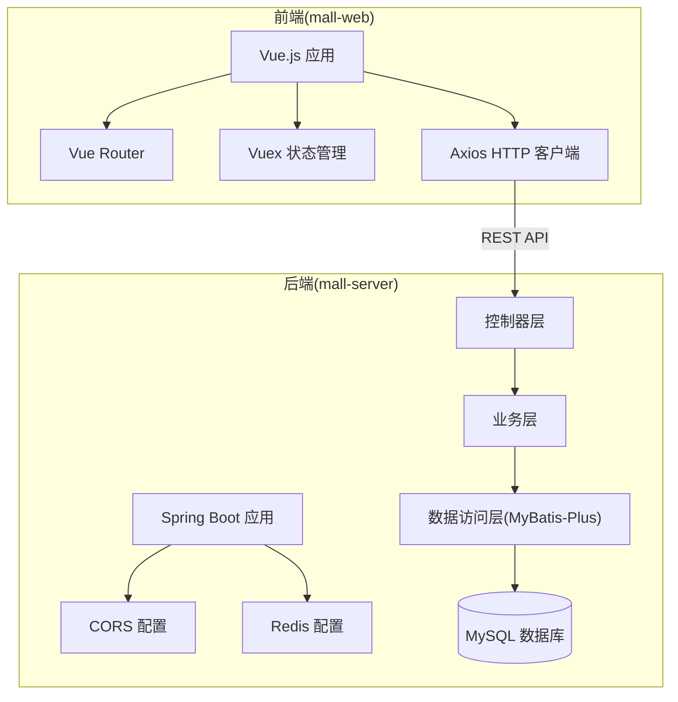
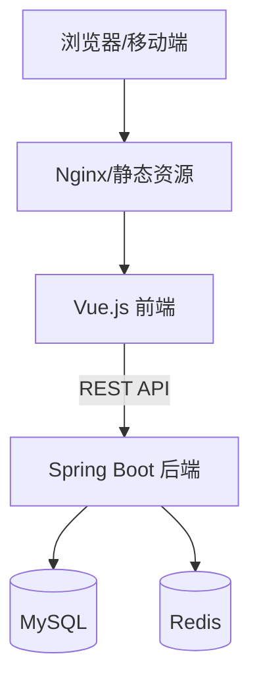
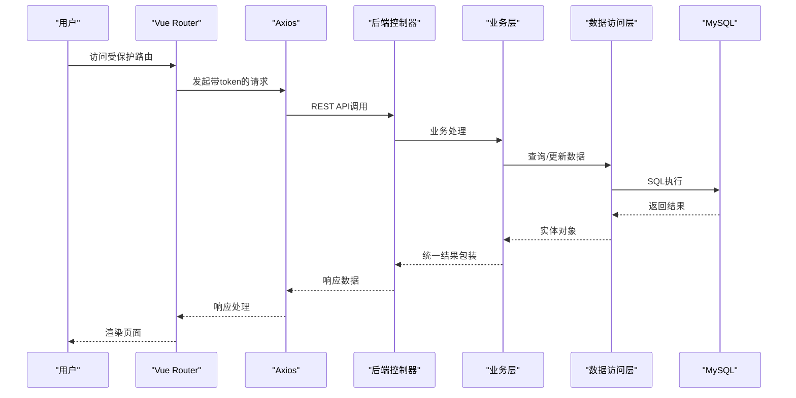
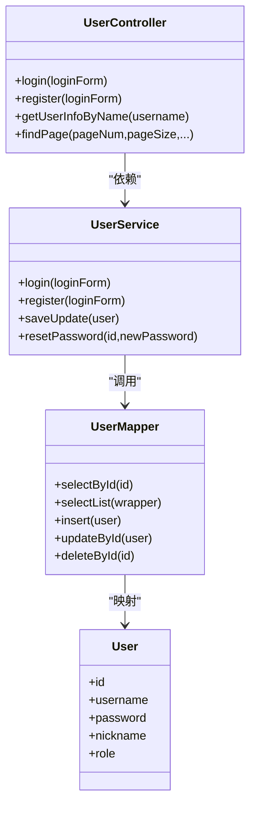
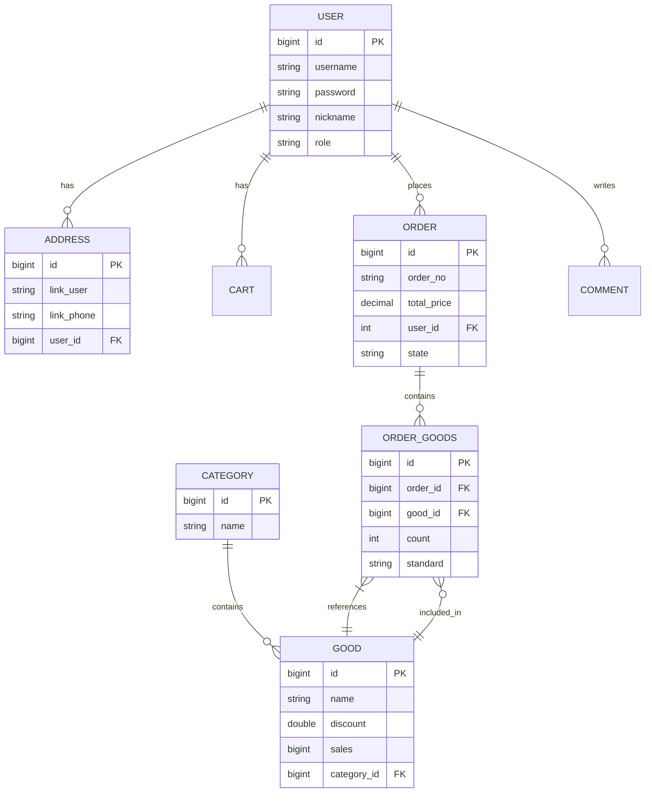
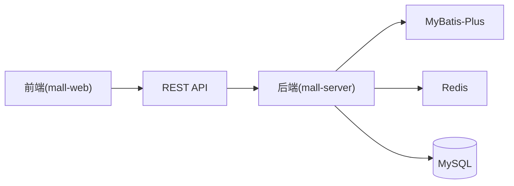

# 整体架构概述

<cite>
**本文引用的文件**
- [README.md](file://README.md)
- [SYSTEM_DOCUMENTATION.md](file://SYSTEM_DOCUMENTATION.md)
- [DATABASE_DESIGN.md](file://DATABASE_DESIGN.md)
- [mall-server/pom.xml](file://mall-server/pom.xml)
- [mall-server/src/main/resources/application.yml](file://mall-server/src/main/resources/application.yml)
- [mall-server/src/main/java/com/rabbiter/em/MallApplication.java](file://mall-server/src/main/java/com/rabbiter/em/MallApplication.java)
- [mall-server/src/main/java/com/rabbiter/em/config/CorsConfig.java](file://mall-server/src/main/java/com/rabbiter/em/config/CorsConfig.java)
- [mall-server/src/main/java/com/rabbiter/em/config/RedisConfig.java](file://mall-server/src/main/java/com/rabbiter/em/config/RedisConfig.java)
- [mall-server/src/main/java/com/rabbiter/em/controller/UserController.java](file://mall-server/src/main/java/com/rabbiter/em/controller/UserController.java)
- [mall-server/src/main/java/com/rabbiter/em/service/UserService.java](file://mall-server/src/main/java/com/rabbiter/em/service/UserService.java)
- [mall-server/src/main/java/com/rabbiter/em/mapper/UserMapper.java](file://mall-server/src/main/java/com/rabbiter/em/mapper/UserMapper.java)
- [mall-server/src/main/java/com/rabbiter/em/entity/User.java](file://mall-server/src/main/java/com/rabbiter/em/entity/User.java)
- [mall-web/package.json](file://mall-web/package.json)
- [mall-web/vue.config.js](file://mall-web/vue.config.js)
- [mall-web/src/utils/request.js](file://mall-web/src/utils/request.js)
- [mall-web/src/router/index.js](file://mall-web/src/router/index.js)
- [mall-web/src/store/index.js](file://mall-web/src/store/index.js)
</cite>

## 目录
1. [引言](#引言)
2. [项目结构](#项目结构)
3. [核心组件](#核心组件)
4. [架构总览](#架构总览)
5. [详细组件分析](#详细组件分析)
6. [依赖分析](#依赖分析)
7. [性能考虑](#性能考虑)
8. [故障排查指南](#故障排查指南)
9. [结论](#结论)
10. [附录](#附录)

## 引言
本项目是一个基于前后端分离理念构建的Cosplay服装商城系统，采用“Vue.js前端 + Spring Boot后端 + MySQL数据库”的经典三层架构。系统通过REST API进行通信，前端负责用户交互与视图渲染，后端提供业务能力与数据持久化，数据库承载业务数据。系统强调模块化设计与解耦，便于扩展与维护；同时结合Redis实现缓存与会话状态管理，提升性能与用户体验。

## 项目结构
项目采用多模块组织方式：
- mall-server：后端服务，基于Spring Boot，提供REST API、业务逻辑与数据访问。
- mall-web：前端应用，基于Vue.js 2，使用Element UI、Vuex、Vue Router等技术栈。
- redis：本地Redis服务启动脚本与配置（Windows环境）。
- s003.sql：数据库初始化脚本。
- 文档：README.md、SYSTEM_DOCUMENTATION.md、DATABASE_DESIGN.md等。

**图表来源**
- [mall-web/package.json:1-32](file://mall-web/package.json#L1-L32)
- [mall-web/vue.config.js:1-26](file://mall-web/vue.config.js#L1-L26)
- [mall-server/pom.xml:1-185](file://mall-server/pom.xml#L1-L185)
- [mall-server/src/main/resources/application.yml:1-42](file://mall-server/src/main/resources/application.yml#L1-L42)

**章节来源**
- [README.md:1-94](file://README.md#L1-L94)
- [SYSTEM_DOCUMENTATION.md:84-93](file://SYSTEM_DOCUMENTATION.md#L84-L93)

## 核心组件
- 前端组件
  - Vue.js 2：构建用户界面与交互。
  - Element UI：提供UI组件库。
  - Vue Router：前端路由与导航。
  - Vuex：集中式状态管理。
  - Axios：HTTP客户端，封装请求与响应拦截。
- 后端组件
  - Spring Boot：应用启动与Web容器。
  - MyBatis-Plus：简化数据访问与分页。
  - Spring MVC：REST控制器。
  - Redis：缓存与Token存储。
  - JWT：鉴权令牌生成与校验。
  - Swagger：API文档。
- 数据库
  - MySQL：持久化业务数据。
- 缓存与安全
  - Redis：热点数据与Token管理。
  - CORS：跨域支持。
  - JWT：无状态鉴权。

**章节来源**
- [README.md:5-23](file://README.md#L5-L23)
- [SYSTEM_DOCUMENTATION.md:5-11](file://SYSTEM_DOCUMENTATION.md#L5-L11)
- [mall-server/pom.xml:19-118](file://mall-server/pom.xml#L19-L118)
- [mall-server/src/main/resources/application.yml:1-42](file://mall-server/src/main/resources/application.yml#L1-L42)

## 架构总览
系统采用前后端分离架构，前端通过Axios调用后端REST API，后端通过MyBatis-Plus访问MySQL，Redis用于缓存与Token管理。系统通过CORS解决跨域问题，JWT实现无状态鉴权。

**图表来源**
- [SYSTEM_DOCUMENTATION.md:12-20](file://SYSTEM_DOCUMENTATION.md#L12-L20)

## 详细组件分析

### 前端路由与鉴权
- 路由规则：区分前台与后台两套路由，支持登录态校验与角色权限校验。
- 鉴权流程：登录成功后将Token存入localStorage，后续请求自动携带token；若后端返回401，前端清空本地存储并跳转登录页。
- 开发代理：前端devServer将请求代理至后端9191端口，避免跨域问题。

**图表来源**
- [mall-web/src/router/index.js:84-150](file://mall-web/src/router/index.js#L84-L150)
- [mall-web/src/utils/request.js:13-50](file://mall-web/src/utils/request.js#L13-L50)
- [mall-server/src/main/java/com/rabbiter/em/controller/UserController.java:37-57](file://mall-server/src/main/java/com/rabbiter/em/controller/UserController.java#L37-L57)

**章节来源**
- [mall-web/src/router/index.js:1-161](file://mall-web/src/router/index.js#L1-L161)
- [mall-web/src/utils/request.js:1-55](file://mall-web/src/utils/request.js#L1-L55)
- [mall-web/vue.config.js:4-16](file://mall-web/vue.config.js#L4-L16)

### 后端控制器与业务层
- 控制器层：提供用户登录、注册、查询、分页等接口，统一返回Result包装。
- 业务层：实现登录密码校验（BCrypt与MD5兼容迁移）、注册密码加密、Token生成与Redis存储、用户信息更新等。
- 数据访问层：基于MyBatis-Plus的BaseMapper，简化CRUD与分页查询。

**图表来源**
- [mall-server/src/main/java/com/rabbiter/em/controller/UserController.java:26-179](file://mall-server/src/main/java/com/rabbiter/em/controller/UserController.java#L26-L179)
- [mall-server/src/main/java/com/rabbiter/em/service/UserService.java:27-155](file://mall-server/src/main/java/com/rabbiter/em/service/UserService.java#L27-L155)
- [mall-server/src/main/java/com/rabbiter/em/mapper/UserMapper.java:1-28](file://mall-server/src/main/java/com/rabbiter/em/mapper/UserMapper.java#L1-L28)
- [mall-server/src/main/java/com/rabbiter/em/entity/User.java:1-123](file://mall-server/src/main/java/com/rabbiter/em/entity/User.java#L1-L123)

**章节来源**
- [mall-server/src/main/java/com/rabbiter/em/controller/UserController.java:1-179](file://mall-server/src/main/java/com/rabbiter/em/controller/UserController.java#L1-L179)
- [mall-server/src/main/java/com/rabbiter/em/service/UserService.java:1-155](file://mall-server/src/main/java/com/rabbiter/em/service/UserService.java#L1-L155)
- [mall-server/src/main/java/com/rabbiter/em/mapper/UserMapper.java:1-28](file://mall-server/src/main/java/com/rabbiter/em/mapper/UserMapper.java#L1-L28)
- [mall-server/src/main/java/com/rabbiter/em/entity/User.java:1-123](file://mall-server/src/main/java/com/rabbiter/em/entity/User.java#L1-L123)

### 数据模型与关系
系统核心实体围绕用户、商品、订单、地址、评论、分类、购物车、轮播图等展开，通过外键建立关联。ER图展示了主要实体间的一对多/一对一关系。

**图表来源**
- [DATABASE_DESIGN.md:5-83](file://DATABASE_DESIGN.md#L5-L83)

**章节来源**
- [DATABASE_DESIGN.md:1-223](file://DATABASE_DESIGN.md#L1-L223)

### 配置与部署要点
- 后端配置
  - 端口：9191
  - 数据源：MySQL（支持环境变量覆盖）
  - Redis：连接池与序列化配置
  - CORS：全局跨域支持
  - JWT：密钥配置
- 前端配置
  - 端口：9192
  - 开发代理：将请求转发至后端9191
  - 依赖：Vue 3、Element Plus、Axios、Vue Router、Vuex
- 部署建议
  - 后端：打包为可执行JAR，独立运行
  - 前端：构建后部署至Nginx或静态服务器
  - 数据库：初始化s003.sql
  - 缓存：确保Redis服务可用

**章节来源**
- [mall-server/src/main/resources/application.yml:1-42](file://mall-server/src/main/resources/application.yml#L1-L42)
- [mall-server/src/main/java/com/rabbiter/em/config/CorsConfig.java:1-29](file://mall-server/src/main/java/com/rabbiter/em/config/CorsConfig.java#L1-L29)
- [mall-server/src/main/java/com/rabbiter/em/config/RedisConfig.java:1-38](file://mall-server/src/main/java/com/rabbiter/em/config/RedisConfig.java#L1-L38)
- [mall-web/vue.config.js:1-26](file://mall-web/vue.config.js#L1-L26)
- [mall-web/package.json:1-32](file://mall-web/package.json#L1-L32)
- [README.md:24-93](file://README.md#L24-L93)
- [SYSTEM_DOCUMENTATION.md:74-92](file://SYSTEM_DOCUMENTATION.md#L74-L92)

## 依赖分析
- 技术栈依赖
  - 前端：Vue生态（Vue 3、Element Plus、Axios、Vue Router、Vuex）
  - 后端：Spring Boot、MyBatis-Plus、Redis、JWT、Swagger、Druid、Hutool、FastJSON
- 组件耦合
  - 前端通过Axios与后端REST API松耦合通信
  - 后端控制器仅依赖服务层接口，服务层依赖数据访问层，降低耦合
  - Redis与业务层解耦，仅承担缓存职责
- 外部依赖
  - MySQL：业务数据存储
  - Redis：Token与热点数据缓存
  - Nginx：生产环境可选的反向代理与静态资源服务

**图表来源**
- [mall-web/package.json:10-25](file://mall-web/package.json#L10-L25)
- [mall-server/pom.xml:19-118](file://mall-server/pom.xml#L19-L118)

**章节来源**
- [mall-web/package.json:1-32](file://mall-web/package.json#L1-L32)
- [mall-server/pom.xml:1-185](file://mall-server/pom.xml#L1-L185)

## 性能考虑
- 前端
  - 使用Axios统一拦截器，减少重复逻辑，提升一致性与可维护性。
  - 开发代理避免跨域，提高调试效率。
- 后端
  - MyBatis-Plus提供分页与条件构造器，降低SQL复杂度与出错率。
  - Redis缓存Token与热点数据，减少数据库压力。
  - CORS全局配置，避免逐接口重复配置。
- 数据库
  - ER图体现的规范化设计有助于减少冗余与提升查询效率。
- 可扩展性
  - 模块化控制器与服务，易于按功能拆分与团队协作。
  - Spring Boot自动装配与依赖注入，便于引入新模块。

[本节为通用性能讨论，无需列出具体文件来源]

## 故障排查指南
- 上传图片失败
  - 检查后端配置中的文件存储路径与权限。
- Token/验证码无效
  - 确认Redis服务运行正常，Token默认存储于Redis。
- 数据库连接报错
  - 确认MySQL版本兼容（推荐8.0），检查连接串时区参数（Asia/Shanghai）。

**章节来源**
- [SYSTEM_DOCUMENTATION.md:95-103](file://SYSTEM_DOCUMENTATION.md#L95-L103)

## 结论
本系统通过前后端分离与三层架构实现了清晰的职责划分与良好的可扩展性。前端以Vue.js为核心，后端以Spring Boot与MyBatis-Plus为基础，配合Redis与JWT实现高性能与高可用。数据库采用规范化的ER设计，支撑核心业务流程。通过模块化与解耦策略，系统具备较强的可维护性与演进空间。

[本节为总结性内容，无需列出具体文件来源]

## 附录
- 快速开始
  - 后端：运行Spring Boot应用，默认端口9191。
  - 前端：安装依赖后启动开发服务器，默认端口9192。
  - 数据库：导入s003.sql，按需调整application.yml中的数据库连接。
  - 缓存：启动Redis服务，确保连接配置正确。
- 默认账号
  - 管理员：admin/123456
  - 用户：user/123456

**章节来源**
- [README.md:33-83](file://README.md#L33-L83)
- [SYSTEM_DOCUMENTATION.md:74-92](file://SYSTEM_DOCUMENTATION.md#L74-L92)