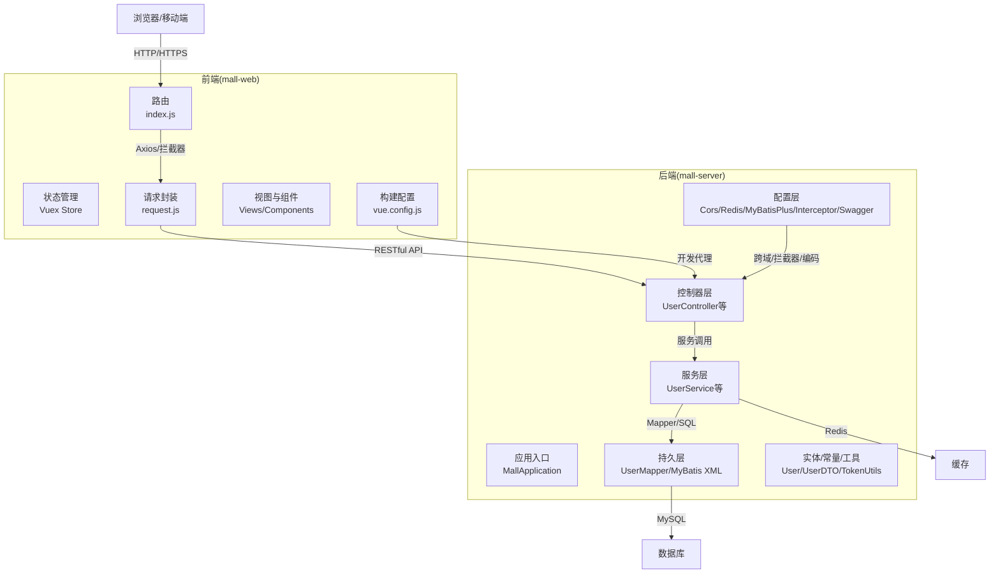
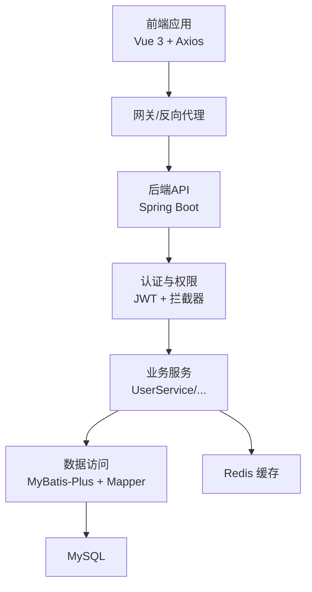
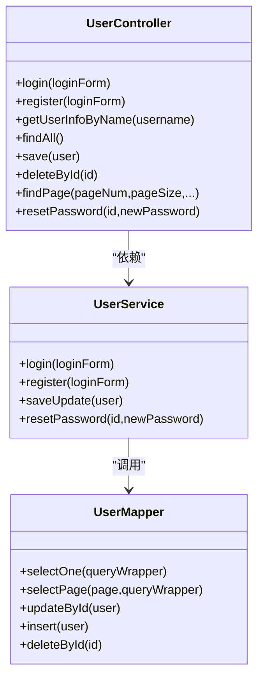
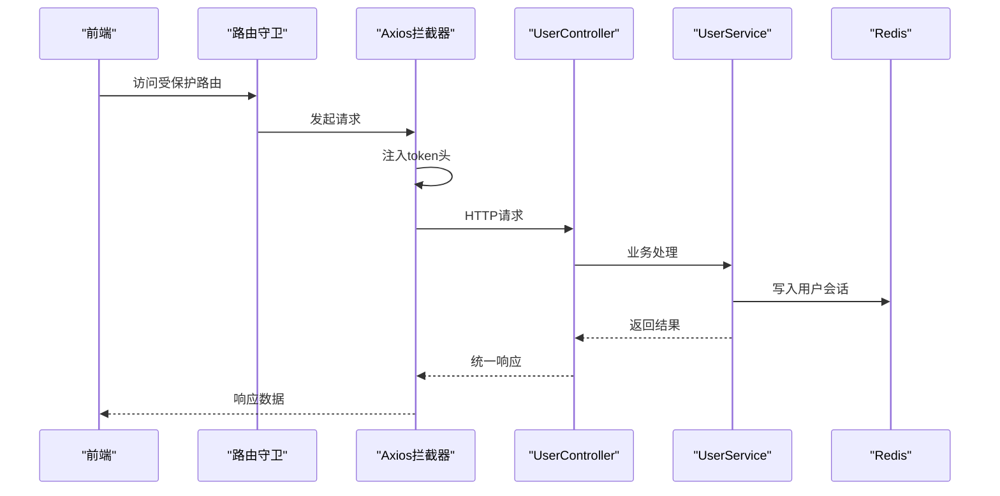
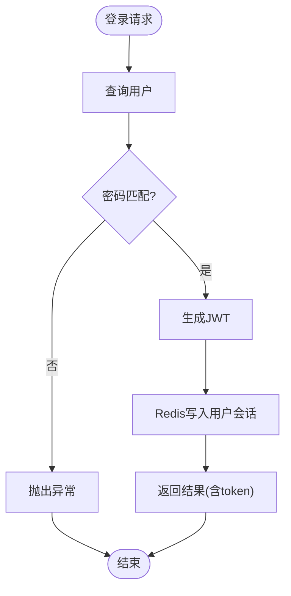
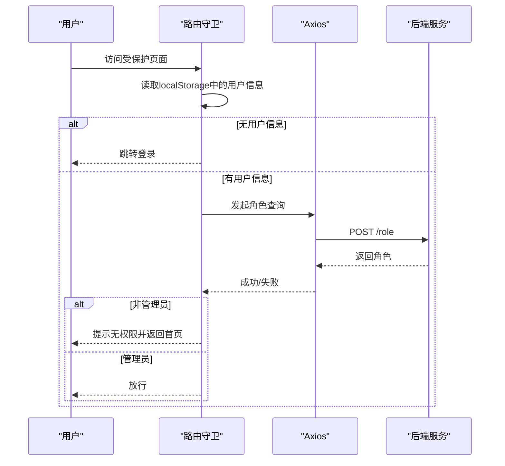
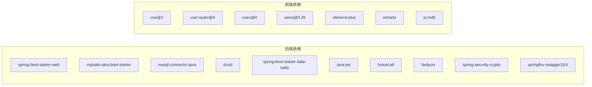

# 系统架构设计

<cite>
**本文引用的文件**
- [MallApplication.java](file://mall-server/src/main/java/com/rabbiter/em/MallApplication.java)
- [pom.xml](file://mall-server/pom.xml)
- [application.yml](file://mall-server/src/main/resources/application.yml)
- [CorsConfig.java](file://mall-server/src/main/java/com/rabbiter/em/config/CorsConfig.java)
- [RedisConfig.java](file://mall-server/src/main/java/com/rabbiter/em/config/RedisConfig.java)
- [MybatisPlusConfig.java](file://mall-server/src/main/java/com/rabbiter/em/config/MybatisPlusConfig.java)
- [InterceptorConfig.java](file://mall-server/src/main/java/com/rabbiter/em/config/InterceptorConfig.java)
- [UserController.java](file://mall-server/src/main/java/com/rabbiter/em/controller/UserController.java)
- [UserService.java](file://mall-server/src/main/java/com/rabbiter/em/service/UserService.java)
- [TokenUtils.java](file://mall-server/src/main/java/com/rabbiter/em/utils/TokenUtils.java)
- [package.json](file://mall-web/package.json)
- [vue.config.js](file://mall-web/vue.config.js)
- [index.js（前端路由）](file://mall-web/src/router/index.js)
- [index.js（前端状态）](file://mall-web/src/store/index.js)
- [request.js（前端请求封装）](file://mall-web/src/utils/request.js)
</cite>

## 目录
1. [引言](#引言)
2. [项目结构](#项目结构)
3. [核心组件](#核心组件)
4. [架构总览](#架构总览)
5. [详细组件分析](#详细组件分析)
6. [依赖分析](#依赖分析)
7. [性能考虑](#性能考虑)
8. [故障排查指南](#故障排查指南)
9. [结论](#结论)
10. [附录](#附录)

## 引言
本系统为一个面向Cosplay爱好者的电商商城，采用前后端分离架构：后端基于Spring Boot + MyBatis-Plus + MySQL + Redis，前端基于Vue 3 + Vue Router + Vuex + Axios。系统遵循RESTful API设计原则，通过JWT进行认证与授权，结合拦截器与跨域配置保障安全与可用性；数据库访问层采用MyBatis-Plus分页插件提升查询性能；前端通过代理解决开发期跨域问题，并在路由中实现鉴权与页面标题动态设置。

## 项目结构
- 后端模块（mall-server）
  - 应用入口与扫描配置：MallApplication、MyBatis Mapper扫描
  - 配置层：跨域、编码、全局异常、拦截器、Redis、Swagger、MyBatis-Plus分页
  - 控制器层：按业务域划分的REST接口（用户、商品、订单、文件等）
  - 服务层：业务逻辑封装与数据校验
  - 持久层：Mapper接口与XML映射
  - 实体与常量：DTO、实体、权限类型、Redis键常量、通用返回包装
  - 工具类：Token生成与校验、路径工具、线程上下文持有者
- 前端模块（mall-web）
  - 路由：前台/后台双入口，嵌套路由与鉴权元信息
  - 状态：Vuex Store（基础API占位）
  - 请求：Axios封装与拦截器（统一注入token、错误处理）
  - 视图与组件：页面视图、通用组件
  - 构建：Vue CLI配置，开发代理指向后端

**图表来源**
- [MallApplication.java:1-17](file://mall-server/src/main/java/com/rabbiter/em/MallApplication.java#L1-L17)
- [CorsConfig.java:1-29](file://mall-server/src/main/java/com/rabbiter/em/config/CorsConfig.java#L1-L29)
- [RedisConfig.java:1-38](file://mall-server/src/main/java/com/rabbiter/em/config/RedisConfig.java#L1-L38)
- [MybatisPlusConfig.java:1-21](file://mall-server/src/main/java/com/rabbiter/em/config/MybatisPlusConfig.java#L1-L21)
- [InterceptorConfig.java:1-37](file://mall-server/src/main/java/com/rabbiter/em/config/InterceptorConfig.java#L1-L37)
- [UserController.java:1-179](file://mall-server/src/main/java/com/rabbiter/em/controller/UserController.java#L1-L179)
- [UserService.java:1-155](file://mall-server/src/main/java/com/rabbiter/em/service/UserService.java#L1-L155)
- [TokenUtils.java:1-78](file://mall-server/src/main/java/com/rabbiter/em/utils/TokenUtils.java#L1-L78)
- [index.js（前端路由）:1-161](file://mall-web/src/router/index.js#L1-L161)
- [index.js（前端状态）:1-21](file://mall-web/src/store/index.js#L1-L21)
- [request.js（前端请求封装）:1-55](file://mall-web/src/utils/request.js#L1-L55)
- [vue.config.js:1-26](file://mall-web/vue.config.js#L1-L26)

**章节来源**
- [MallApplication.java:1-17](file://mall-server/src/main/java/com/rabbiter/em/MallApplication.java#L1-L17)
- [pom.xml:1-185](file://mall-server/pom.xml#L1-L185)
- [application.yml:1-42](file://mall-server/src/main/resources/application.yml#L1-L42)
- [package.json:1-32](file://mall-web/package.json#L1-L32)
- [vue.config.js:1-26](file://mall-web/vue.config.js#L1-L26)

## 核心组件
- 后端核心
  - 应用入口与扫描：启动类启用Spring Boot并扫描Mapper包
  - 配置体系：跨域、编码、全局异常、拦截器链、Redis序列化、MyBatis-Plus分页
  - 安全与认证：JWT工具、拦截器链（JWT校验、权限校验）、权限注解
  - 数据访问：MyBatis-Plus分页、Redis模板、Mapper XML
- 前端核心
  - 路由与鉴权：嵌套路由、meta元信息、前置守卫、本地存储token
  - 请求封装：统一headers注入token、错误处理与跳转
  - 构建与代理：开发服务器代理到后端，避免跨域

**章节来源**
- [CorsConfig.java:1-29](file://mall-server/src/main/java/com/rabbiter/em/config/CorsConfig.java#L1-L29)
- [RedisConfig.java:1-38](file://mall-server/src/main/java/com/rabbiter/em/config/RedisConfig.java#L1-L38)
- [MybatisPlusConfig.java:1-21](file://mall-server/src/main/java/com/rabbiter/em/config/MybatisPlusConfig.java#L1-L21)
- [InterceptorConfig.java:1-37](file://mall-server/src/main/java/com/rabbiter/em/config/InterceptorConfig.java#L1-L37)
- [TokenUtils.java:1-78](file://mall-server/src/main/java/com/rabbiter/em/utils/TokenUtils.java#L1-L78)
- [UserController.java:1-179](file://mall-server/src/main/java/com/rabbiter/em/controller/UserController.java#L1-L179)
- [UserService.java:1-155](file://mall-server/src/main/java/com/rabbiter/em/service/UserService.java#L1-L155)
- [index.js（前端路由）:1-161](file://mall-web/src/router/index.js#L1-L161)
- [request.js（前端请求封装）:1-55](file://mall-web/src/utils/request.js#L1-L55)

## 架构总览
系统采用前后端分离的三层架构：
- 前端：Vue 3 SPA，通过Axios向后端发起REST请求，开发时经Vue CLI代理转发
- 后端：Spring Boot Web MVC，提供REST API，集成MyBatis-Plus、Redis、JWT、拦截器
- 数据层：MySQL存储业务数据，Redis缓存用户会话与令牌

**图表来源**
- [pom.xml:19-105](file://mall-server/pom.xml#L19-L105)
- [application.yml:1-42](file://mall-server/src/main/resources/application.yml#L1-L42)
- [index.js（前端路由）:1-161](file://mall-web/src/router/index.js#L1-L161)
- [request.js（前端请求封装）:1-55](file://mall-web/src/utils/request.js#L1-L55)

## 详细组件分析

### 后端分层架构（Controller/Service/Mapper）
- 控制器层
  - 统一返回包装：Result工具类封装响应结构
  - 权限注解：@Authority标注需要管理员权限的接口
  - 跨域支持：@CrossOrigin或全局CORS配置
  - 示例：UserController提供登录、注册、用户列表、分页查询、重置密码等REST接口
- 服务层
  - 业务编排：参数校验、密码加密（BCrypt）、Redis缓存写入
  - 事务边界：基于Service层的业务操作
  - 示例：UserService实现登录校验、注册、更新、重置密码
- 持久层
  - MyBatis-Plus：自动分页、条件构造器、物理分页上限
  - Mapper XML：复杂SQL与批量操作
  - 示例：UserMapper对应用户表CRUD

**图表来源**
- [UserController.java:1-179](file://mall-server/src/main/java/com/rabbiter/em/controller/UserController.java#L1-L179)
- [UserService.java:1-155](file://mall-server/src/main/java/com/rabbiter/em/service/UserService.java#L1-L155)
- [UserMapper.java](file://mall-server/src/main/java/com/rabbiter/em/mapper/UserMapper.java)

**章节来源**
- [UserController.java:1-179](file://mall-server/src/main/java/com/rabbiter/em/controller/UserController.java#L1-L179)
- [UserService.java:1-155](file://mall-server/src/main/java/com/rabbiter/em/service/UserService.java#L1-L155)

### RESTful API 设计与跨域处理
- 设计原则
  - 资源命名：复数名词（如/user、/user/page）
  - 动作语义：GET/POST/DELETE/PUT 对应读取/创建/删除/更新
  - 统一响应：Result包装code/msg/data
  - 权限控制：受保护接口需携带token并通过拦截器校验
- 跨域策略
  - 全局CORS：允许任意来源、方法、头，支持凭证，暴露SET_COOKIE头，缓存预检结果
  - 开发代理：前端通过vue.config.js代理到后端，避免浏览器同源限制

**图表来源**
- [index.js（前端路由）:84-150](file://mall-web/src/router/index.js#L84-L150)
- [request.js（前端请求封装）:13-22](file://mall-web/src/utils/request.js#L13-L22)
- [UserController.java:37-57](file://mall-server/src/main/java/com/rabbiter/em/controller/UserController.java#L37-L57)
- [UserService.java:44-75](file://mall-server/src/main/java/com/rabbiter/em/service/UserService.java#L44-L75)
- [RedisConfig.java:1-38](file://mall-server/src/main/java/com/rabbiter/em/config/RedisConfig.java#L1-L38)

**章节来源**
- [CorsConfig.java:1-29](file://mall-server/src/main/java/com/rabbiter/em/config/CorsConfig.java#L1-L29)
- [vue.config.js:4-16](file://mall-web/vue.config.js#L4-L16)

### 安全架构（JWT、权限控制、数据加密）
- 认证机制
  - 登录签发：后端根据用户名查询用户，校验密码（BCrypt或兼容旧MD5），生成JWT并写入Redis
  - 请求校验：拦截器从请求头读取token，解析并放入线程上下文，供业务使用
  - 会话缓存：Redis以token为key存储用户对象，设置TTL
- 权限控制
  - 注解驱动：@Authority标注需要管理员权限的接口
  - 拦截器链：JWT拦截器优先于权限拦截器执行
  - 前端路由：meta.requireAuth与本地token配合，未登录或权限不足跳转登录或提示
- 数据加密
  - 密码策略：强口令规则，注册与重置均通过BCrypt加密
  - 透明迁移：检测到旧MD5格式时自动升级为BCrypt

**图表来源**
- [UserService.java:44-75](file://mall-server/src/main/java/com/rabbiter/em/service/UserService.java#L44-L75)
- [TokenUtils.java:31-36](file://mall-server/src/main/java/com/rabbiter/em/utils/TokenUtils.java#L31-L36)
- [RedisConfig.java:1-38](file://mall-server/src/main/java/com/rabbiter/em/config/RedisConfig.java#L1-L38)

**章节来源**
- [TokenUtils.java:1-78](file://mall-server/src/main/java/com/rabbiter/em/utils/TokenUtils.java#L1-L78)
- [InterceptorConfig.java:1-37](file://mall-server/src/main/java/com/rabbiter/em/config/InterceptorConfig.java#L1-L37)
- [UserService.java:30-38](file://mall-server/src/main/java/com/rabbiter/em/service/UserService.java#L30-L38)

### 前端应用架构（组件化、状态管理、路由）
- 组件化设计
  - 页面视图：按功能拆分组件（头部、导航、商品列表、订单、管理面板等）
  - 通用组件：Header、Aside、Search等复用性强的UI
- 状态管理
  - Vuex Store：当前仅定义基础状态，后续可扩展模块化管理
- 路由配置
  - 前台/后台双入口，嵌套路由清晰划分功能域
  - 鉴权元信息：requireAuth、requireLogin控制访问
  - 前置守卫：检查本地token与后端角色，未登录或权限不足跳转登录页
- 请求封装
  - Axios实例：统一超时、Content-Type
  - 请求拦截：自动注入token头
  - 响应拦截：统一错误处理（如401），弹窗提示并跳转登录

**图表来源**
- [index.js（前端路由）:84-150](file://mall-web/src/router/index.js#L84-L150)
- [request.js（前端请求封装）:26-46](file://mall-web/src/utils/request.js#L26-L46)

**章节来源**
- [index.js（前端路由）:1-161](file://mall-web/src/router/index.js#L1-L161)
- [index.js（前端状态）:1-21](file://mall-web/src/store/index.js#L1-L21)
- [request.js（前端请求封装）:1-55](file://mall-web/src/utils/request.js#L1-L55)

### 技术选型决策
- Spring Boot + MyBatis-Plus + MySQL
  - 快速开发与生态完善，MyBatis-Plus提供便捷的分页与条件构造器
- Redis
  - 缓存用户会话与令牌，降低数据库压力，提升登录与鉴权效率
- Vue 3 + Vue Router + Vuex + Axios
  - 前端现代化框架，组件化与状态管理成熟，Axios提供统一请求封装
- JWT
  - 无状态认证，适合分布式与微服务场景，结合拦截器实现统一校验
- Swagger
  - 在开发阶段提供API文档能力，便于联调与测试

**章节来源**
- [pom.xml:19-105](file://mall-server/pom.xml#L19-L105)
- [application.yml:1-42](file://mall-server/src/main/resources/application.yml#L1-L42)
- [package.json:10-25](file://mall-web/package.json#L10-L25)

## 依赖分析
- 后端依赖
  - Web、MyBatis-Plus、MySQL驱动、Druid连接池、Redis、JWT、Hutool、FastJSON、BCrypt、Swagger
- 前端依赖
  - Vue 3、Vue Router、Vuex、Axios、Element Plus、ECharts、js-md5

**图表来源**
- [pom.xml:19-105](file://mall-server/pom.xml#L19-L105)
- [package.json:10-25](file://mall-web/package.json#L10-L25)

**章节来源**
- [pom.xml:1-185](file://mall-server/pom.xml#L1-L185)
- [package.json:1-32](file://mall-web/package.json#L1-L32)

## 性能考虑
- 数据库层
  - MyBatis-Plus分页插件限制每页最大记录数，避免超大分页导致性能问题
  - Druid连接池配置合理，建议结合压测调整连接数
- 缓存层
  - Redis缓存用户会话与令牌，减少数据库查询与密码比对次数
  - 注意过期时间与内存占用，定期清理无效会话
- 接口层
  - 统一响应包装减少前端重复判断
  - 合理设置请求超时与重试策略
- 前端层
  - 路由懒加载与组件拆分，减少首屏体积
  - Axios拦截器集中处理错误，避免重复代码

**章节来源**
- [MybatisPlusConfig.java:14-17](file://mall-server/src/main/java/com/rabbiter/em/config/MybatisPlusConfig.java#L14-L17)
- [RedisConfig.java:1-38](file://mall-server/src/main/java/com/rabbiter/em/config/RedisConfig.java#L1-L38)
- [request.js（前端请求封装）:5-8](file://mall-web/src/utils/request.js#L5-L8)

## 故障排查指南
- 登录失败/401
  - 检查JWT密钥配置与拦截器是否正确注入token头
  - 前端响应拦截器会将401视为登录失效并清空本地存储
- 跨域问题
  - 确认CORS配置允许来源、方法、头与凭证
  - 开发环境确保vue.config.js代理已启用
- 权限不足
  - 前端路由守卫会根据后端返回的角色决定放行与否
  - 后端拦截器链会校验管理员权限注解
- 数据库连接
  - 检查application.yml中的数据库URL、账号、密码与端口
  - Druid连接池参数需结合实际负载调整

**章节来源**
- [CorsConfig.java:18-25](file://mall-server/src/main/java/com/rabbiter/em/config/CorsConfig.java#L18-L25)
- [vue.config.js:4-16](file://mall-web/vue.config.js#L4-L16)
- [request.js（前端请求封装）:38-44](file://mall-web/src/utils/request.js#L38-L44)
- [application.yml:9-13](file://mall-server/src/main/resources/application.yml#L9-L13)
- [InterceptorConfig.java:18-30](file://mall-server/src/main/java/com/rabbiter/em/config/InterceptorConfig.java#L18-L30)

## 结论
本系统通过Spring Boot与Vue 3实现了高内聚、低耦合的前后端分离架构。后端以分层设计与拦截器链保障安全与可维护性，前端以路由守卫与Axios拦截器提升用户体验与健壮性。结合Redis与MyBatis-Plus在性能与开发效率上取得平衡。未来可考虑引入网关、消息队列与缓存策略进一步增强可扩展性与稳定性。

## 附录
- 部署建议
  - 后端：打包为可执行JAR，配置环境变量覆盖数据库与Redis连接信息
  - 前端：构建产物部署至Nginx，配置静态资源与反向代理
- 微服务演进
  - 当业务增长时，可按领域拆分为独立服务（用户、商品、订单、支付），引入API网关与服务发现
  - 限制因素：当前代码未见注册中心与网关组件，演进需引入相应基础设施