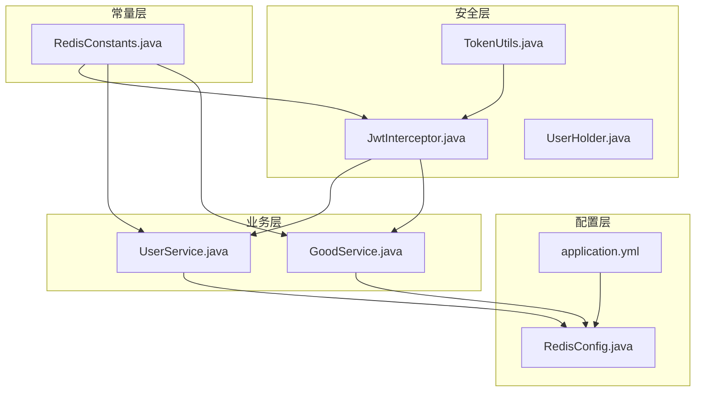
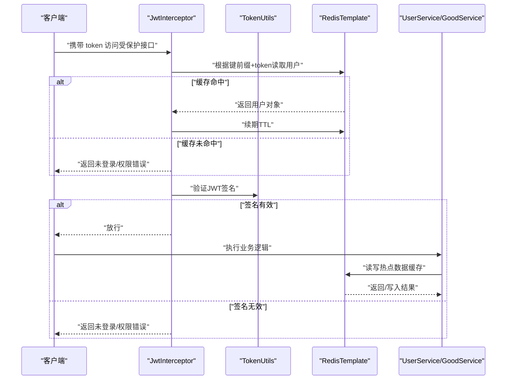
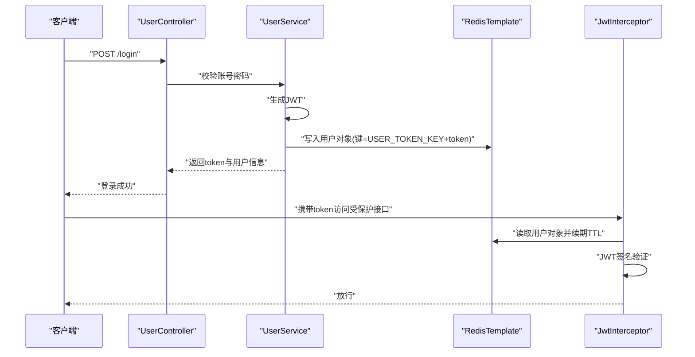
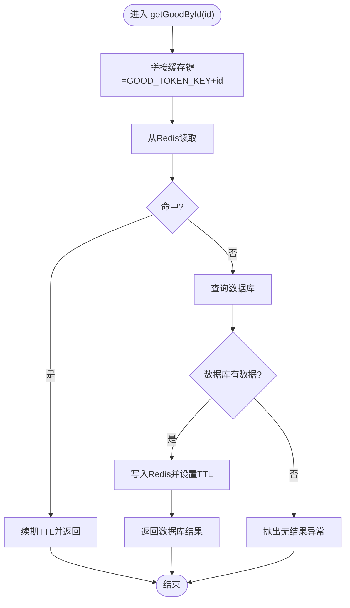
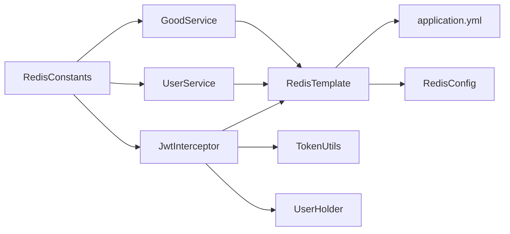

# 缓存设计

<cite>
**本文引用的文件**
- [RedisConstants.java](file://mall-server/src/main/java/com/rabbiter/em/constants/RedisConstants.java)
- [RedisConfig.java](file://mall-server/src/main/java/com/rabbiter/em/config/RedisConfig.java)
- [JwtInterceptor.java](file://mall-server/src/main/java/com/rabbiter/em/interceptor/JwtInterceptor.java)
- [UserService.java](file://mall-server/src/main/java/com/rabbiter/em/service/UserService.java)
- [GoodService.java](file://mall-server/src/main/java/com/rabbiter/em/service/GoodService.java)
- [TokenUtils.java](file://mall-server/src/main/java/com/rabbiter/em/utils/TokenUtils.java)
- [UserHolder.java](file://mall-server/src/main/java/com/rabbiter/em/utils/UserHolder.java)
- [application.yml](file://mall-server/src/main/resources/application.yml)
</cite>

## 目录
1. [简介](#简介)
2. [项目结构](#项目结构)
3. [核心组件](#核心组件)
4. [架构总览](#架构总览)
5. [详细组件分析](#详细组件分析)
6. [依赖分析](#依赖分析)
7. [性能考虑](#性能考虑)
8. [故障排查指南](#故障排查指南)
9. [结论](#结论)
10. [附录](#附录)

## 简介
本文件系统性梳理 cosplay 商城系统的缓存设计与实现，重点覆盖 Redis 在系统中的应用，包括：
- 用户会话缓存与 JWT 令牌缓存
- 热点数据缓存（商品详情）
- 缓存配置（RedisTemplate、序列化策略、连接池）
- 缓存键设计原则与命名规范
- 缓存策略与防护（穿透、击穿、雪崩）
- 分布式锁与一致性保障
- 性能优化与监控、故障处理
- 配置最佳实践与调优建议

## 项目结构
围绕缓存的关键模块与文件如下：
- 配置层：RedisTemplate 配置、连接参数
- 常量层：缓存键与 TTL 常量
- 业务层：用户登录/会话、商品详情缓存
- 安全层：JWT 校验与拦截器
- 工具层：线程本地用户持有与令牌工具

图表来源
- [RedisConfig.java:1-38](file://mall-server/src/main/java/com/rabbiter/em/config/RedisConfig.java#L1-L38)
- [application.yml:22-34](file://mall-server/src/main/resources/application.yml#L22-L34)
- [RedisConstants.java:3-9](file://mall-server/src/main/java/com/rabbiter/em/constants/RedisConstants.java#L3-L9)
- [JwtInterceptor.java:34-99](file://mall-server/src/main/java/com/rabbiter/em/interceptor/JwtInterceptor.java#L34-L99)
- [TokenUtils.java:18-78](file://mall-server/src/main/java/com/rabbiter/em/utils/TokenUtils.java#L18-L78)
- [UserHolder.java:5-20](file://mall-server/src/main/java/com/rabbiter/em/utils/UserHolder.java#L5-L20)
- [UserService.java:27-75](file://mall-server/src/main/java/com/rabbiter/em/service/UserService.java#L27-L75)
- [GoodService.java:37-75](file://mall-server/src/main/java/com/rabbiter/em/service/GoodService.java#L37-L75)

章节来源
- [RedisConfig.java:1-38](file://mall-server/src/main/java/com/rabbiter/em/config/RedisConfig.java#L1-L38)
- [application.yml:22-34](file://mall-server/src/main/resources/application.yml#L22-L34)
- [RedisConstants.java:3-9](file://mall-server/src/main/java/com/rabbiter/em/constants/RedisConstants.java#L3-L9)
- [JwtInterceptor.java:34-99](file://mall-server/src/main/java/com/rabbiter/em/interceptor/JwtInterceptor.java#L34-L99)
- [UserService.java:27-75](file://mall-server/src/main/java/com/rabbiter/em/service/UserService.java#L27-L75)
- [GoodService.java:37-75](file://mall-server/src/main/java/com/rabbiter/em/service/GoodService.java#L37-L75)

## 核心组件
- Redis 配置与模板
  - 提供通用与专用的 RedisTemplate，采用字符串键与 JSON 序列化，确保跨语言与类型安全。
  - 连接池参数在 application.yml 中集中配置，便于运维与调优。
- 缓存键与 TTL 常量
  - 统一定义用户令牌键前缀与 TTL、商品详情键前缀与 TTL，避免魔法值与命名不一致。
- 用户会话与 JWT 缓存
  - 登录成功后将用户对象写入 Redis，并以令牌为键、TTL 控制有效期；拦截器读取并续期。
  - JWT 由 TokenUtils 生成与校验，拦截器负责验证与过期续期。
- 商品详情缓存
  - 商品详情优先从 Redis 读取，未命中则落库并回填缓存；更新/删除时主动清理缓存，保证一致性。

章节来源
- [RedisConfig.java:13-35](file://mall-server/src/main/java/com/rabbiter/em/config/RedisConfig.java#L13-L35)
- [application.yml:22-34](file://mall-server/src/main/resources/application.yml#L22-L34)
- [RedisConstants.java:4-8](file://mall-server/src/main/java/com/rabbiter/em/constants/RedisConstants.java#L4-L8)
- [UserService.java:69-71](file://mall-server/src/main/java/com/rabbiter/em/service/UserService.java#L69-L71)
- [JwtInterceptor.java:69-80](file://mall-server/src/main/java/com/rabbiter/em/interceptor/JwtInterceptor.java#L69-L80)
- [GoodService.java:52-74](file://mall-server/src/main/java/com/rabbiter/em/service/GoodService.java#L52-L74)

## 架构总览
系统通过拦截器在请求链路早期完成 JWT 校验与用户上下文注入，同时对会话缓存进行续期；业务层在热点数据路径上实现“先缓存后数据库”的读策略与“变更即删”的写策略。

图表来源
- [JwtInterceptor.java:40-93](file://mall-server/src/main/java/com/rabbiter/em/interceptor/JwtInterceptor.java#L40-L93)
- [TokenUtils.java:31-40](file://mall-server/src/main/java/com/rabbiter/em/utils/TokenUtils.java#L31-L40)
- [UserService.java:69-71](file://mall-server/src/main/java/com/rabbiter/em/service/UserService.java#L69-L71)
- [GoodService.java:52-74](file://mall-server/src/main/java/com/rabbiter/em/service/GoodService.java#L52-L74)

## 详细组件分析

### Redis 配置与模板
- RedisTemplate
  - 键/哈希键采用字符串序列化，值与哈希值采用 JSON 序列化，便于跨语言读取与调试。
  - 提供通用模板与专用模板（如 userRedisTemplate），用于强类型对象的读写。
- 连接池与超时
  - 连接池最小空闲、最大活跃、最大空闲、最大等待等参数集中配置，便于压测与生产调优。
  - 连接超时时间可配置，降低慢请求对线程资源的占用。

章节来源
- [RedisConfig.java:13-35](file://mall-server/src/main/java/com/rabbiter/em/config/RedisConfig.java#L13-L35)
- [application.yml:27-33](file://mall-server/src/main/resources/application.yml#L27-L33)

### 缓存键设计与命名规范
- 用户令牌键
  - 前缀：统一常量定义，值包含用户标识与令牌内容，避免冲突。
  - TTL：分钟级，结合登录态续期策略使用。
- 商品详情键
  - 前缀：统一常量定义，值包含商品 ID。
  - TTL：分钟级，热点数据短 TTL，降低陈旧风险。
- 命名规范
  - 使用冒号分层，体现业务域与实体维度。
  - 保持前缀稳定，避免频繁变更导致缓存雪崩。

章节来源
- [RedisConstants.java:4-8](file://mall-server/src/main/java/com/rabbiter/em/constants/RedisConstants.java#L4-L8)

### 用户会话与 JWT 缓存
- 登录流程
  - 生成 JWT 后，将用户对象写入 Redis，键为“用户令牌键前缀+token”，并设置 TTL。
- 请求拦截
  - 从 Redis 读取用户对象，注入线程本地上下文；同时续期 TTL。
  - 使用 JWTVerifier 校验签名，保证令牌有效性。
- 退出/失效
  - 可在登出时删除对应键，或依赖 TTL 自动过期。

图表来源
- [UserService.java:69-71](file://mall-server/src/main/java/com/rabbiter/em/service/UserService.java#L69-L71)
- [JwtInterceptor.java:69-80](file://mall-server/src/main/java/com/rabbiter/em/interceptor/JwtInterceptor.java#L69-L80)
- [TokenUtils.java:31-40](file://mall-server/src/main/java/com/rabbiter/em/utils/TokenUtils.java#L31-L40)

章节来源
- [UserService.java:27-75](file://mall-server/src/main/java/com/rabbiter/em/service/UserService.java#L27-L75)
- [JwtInterceptor.java:34-99](file://mall-server/src/main/java/com/rabbiter/em/interceptor/JwtInterceptor.java#L34-L99)
- [TokenUtils.java:18-78](file://mall-server/src/main/java/com/rabbiter/em/utils/TokenUtils.java#L18-L78)
- [UserHolder.java:5-20](file://mall-server/src/main/java/com/rabbiter/em/utils/UserHolder.java#L5-L20)

### 商品详情缓存
- 读路径
  - 先从 Redis 读取，命中则续期 TTL 并返回。
  - 未命中则查询数据库，回填缓存并设置 TTL。
- 写/删路径
  - 更新或删除商品时，主动删除对应键，避免脏读。
- 一致性
  - 写操作删除缓存，读路径懒加载回填，降低写放大与一致性成本。

图表来源
- [GoodService.java:52-74](file://mall-server/src/main/java/com/rabbiter/em/service/GoodService.java#L52-L74)
- [RedisConstants.java:7-8](file://mall-server/src/main/java/com/rabbiter/em/constants/RedisConstants.java#L7-L8)

章节来源
- [GoodService.java:37-143](file://mall-server/src/main/java/com/rabbiter/em/service/GoodService.java#L37-L143)

### 缓存策略与防护
- 缓存穿透
  - 现状：未见显式空值缓存或布隆过滤器。
  - 建议：对不存在的查询键写入短 TTL 的空值占位，或引入布隆过滤器拦截非法键。
- 缓存击穿
  - 现状：热点键命中后续期 TTL，降低击穿概率。
  - 建议：热点键设置互斥锁（如基于 Redis SET NX EX）或热点预热。
- 缓存雪崩
  - 现状：TTL 采用分钟级，未见随机抖动。
  - 建议：为不同键增加随机偏移（如 ±5 分钟），避免同时过期。

章节来源
- [JwtInterceptor.java:79-80](file://mall-server/src/main/java/com/rabbiter/em/interceptor/JwtInterceptor.java#L79-L80)
- [GoodService.java:57-58](file://mall-server/src/main/java/com/rabbiter/em/service/GoodService.java#L57-L58)
- [RedisConstants.java:5-8](file://mall-server/src/main/java/com/rabbiter/em/constants/RedisConstants.java#L5-L8)

### 分布式锁与一致性
- 分布式锁
  - 现状：未发现显式的分布式锁实现。
  - 建议：在高并发写场景（如库存扣减、价格更新）使用 Redis SET NX EX 实现轻量分布式锁。
- 一致性保障
  - 写路径删除缓存，读路径懒加载回填，减少写放大与不一致窗口。
  - 对关键业务（如订单、支付）建议引入最终一致性方案（消息队列、补偿任务）。

章节来源
- [GoodService.java:123-142](file://mall-server/src/main/java/com/rabbiter/em/service/GoodService.java#L123-L142)

### 性能优化策略
- 内存管理
  - 合理设置 TTL，避免长期驻留大对象；对热点小对象可适当缩短 TTL。
- 过期策略
  - 为不同业务设置差异化 TTL；对冷数据采用更短 TTL。
- 清理机制
  - 定期扫描与清理过期键；对异常键（格式错误、长度异常）进行隔离与告警。
- 读写分离
  - 读多写少场景优先走缓存；写后立即删除对应键，避免脏读。
- 连接池优化
  - 根据 QPS 调整最大活跃连接数与等待时间；监控阻塞与超时指标。

章节来源
- [application.yml:27-33](file://mall-server/src/main/resources/application.yml#L27-L33)
- [RedisConfig.java:13-35](file://mall-server/src/main/java/com/rabbiter/em/config/RedisConfig.java#L13-L35)

### 监控与故障处理
- 监控指标
  - 缓存命中率、未命中率、过期率、淘汰率、连接池使用率、命令耗时分布。
- 故障处理
  - 降级：缓存不可用时快速失败或直连数据库；设置熔断阈值。
  - 限流：对热点键增加限流策略，防止瞬时洪峰。
  - 告警：对异常键、超时、连接池耗尽等事件触发告警。

章节来源
- [application.yml:22-34](file://mall-server/src/main/resources/application.yml#L22-L34)

## 依赖分析
- 组件耦合
  - 拦截器依赖 RedisTemplate 与常量；服务层依赖 RedisTemplate 与 Mapper。
  - TokenUtils 与 UserHolder 提供横切能力，降低业务侵入。
- 外部依赖
  - Spring Data Redis、Lettuce 连接池、JWT 校验库。
- 潜在风险
  - 常量集中管理良好，但需避免频繁变更；TTL 设计应结合业务峰值与恢复时间目标。

图表来源
- [JwtInterceptor.java:34-99](file://mall-server/src/main/java/com/rabbiter/em/interceptor/JwtInterceptor.java#L34-L99)
- [UserService.java:27-75](file://mall-server/src/main/java/com/rabbiter/em/service/UserService.java#L27-L75)
- [GoodService.java:37-75](file://mall-server/src/main/java/com/rabbiter/em/service/GoodService.java#L37-L75)
- [RedisConfig.java:13-35](file://mall-server/src/main/java/com/rabbiter/em/config/RedisConfig.java#L13-L35)
- [application.yml:22-34](file://mall-server/src/main/resources/application.yml#L22-L34)
- [RedisConstants.java:3-9](file://mall-server/src/main/java/com/rabbiter/em/constants/RedisConstants.java#L3-L9)

## 性能考虑
- 读路径优化
  - 使用 ValueOperations 直接读写对象，减少序列化开销。
  - 对热点键设置合理的 TTL 与续期策略，避免频繁重建。
- 写路径优化
  - 写后删除缓存，降低写放大；批量写时合并删除操作。
- 连接池与序列化
  - JSON 序列化便于调试，但注意字段变更兼容；必要时引入版本控制或 Schema 管理。
- 压测与调优
  - 基于实际 QPS 调整连接池参数；观察 GC 与内存占用，避免长尾延迟。

章节来源
- [RedisConfig.java:13-35](file://mall-server/src/main/java/com/rabbiter/em/config/RedisConfig.java#L13-L35)
- [application.yml:27-33](file://mall-server/src/main/resources/application.yml#L27-L33)
- [GoodService.java:123-142](file://mall-server/src/main/java/com/rabbiter/em/service/GoodService.java#L123-L142)

## 故障排查指南
- 登录后无法访问受保护接口
  - 检查拦截器是否正确读取 Redis 中的用户对象与 TTL 续期。
  - 核对 JWT 秘钥与签名是否一致。
- 商品详情缓存未命中
  - 确认缓存键拼接规则与 TTL 设置；检查数据库查询是否正常。
- 连接池耗尽或超时
  - 检查最大活跃连接数与等待时间配置；观察慢查询与阻塞情况。
- 缓存一致性问题
  - 确认写路径是否删除了对应键；读路径是否正确回填缓存。

章节来源
- [JwtInterceptor.java:69-91](file://mall-server/src/main/java/com/rabbiter/em/interceptor/JwtInterceptor.java#L69-L91)
- [UserService.java:69-71](file://mall-server/src/main/java/com/rabbiter/em/service/UserService.java#L69-L71)
- [GoodService.java:52-74](file://mall-server/src/main/java/com/rabbiter/em/service/GoodService.java#L52-L74)
- [application.yml:27-33](file://mall-server/src/main/resources/application.yml#L27-L33)

## 结论
系统在用户会话与热点数据缓存方面实现了清晰的职责划分：拦截器负责认证与续期，服务层负责读写策略与一致性控制。建议在现有基础上补充分布式锁、布隆过滤器与随机 TTL 抖动，进一步提升缓存稳定性与抗风险能力。

## 附录
- 配置最佳实践
  - 连接池：根据峰值 QPS 与 P99 延迟调整最大活跃连接与等待时间。
  - TTL：热点键短 TTL + 续期，冷数据长 TTL；避免统一全局 TTL。
  - 序列化：JSON 便于调试，注意字段演进与兼容。
  - 监控：建立命中率、过期率、连接池使用率与命令耗时的监控体系。
- 调优建议
  - 对热点键增加互斥锁或预热；对冷数据定期清理。
  - 引入缓存预热与灰度发布策略，逐步扩大缓存命中范围。