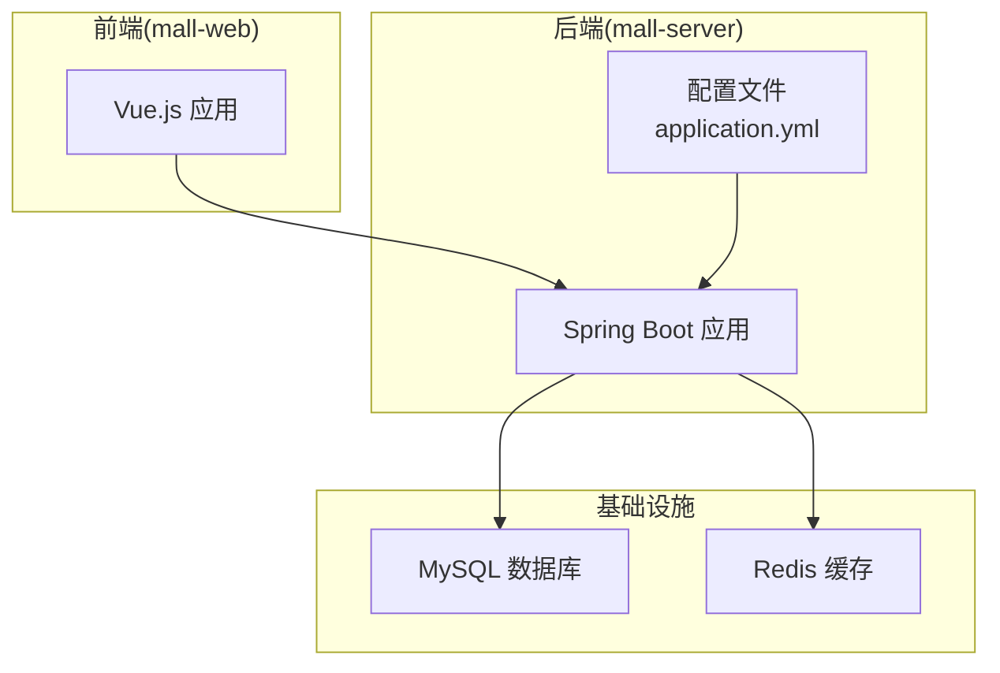
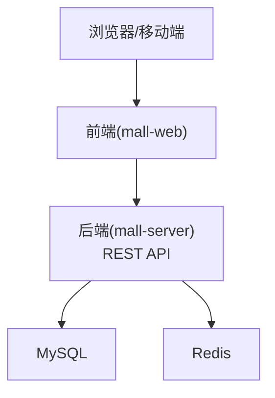
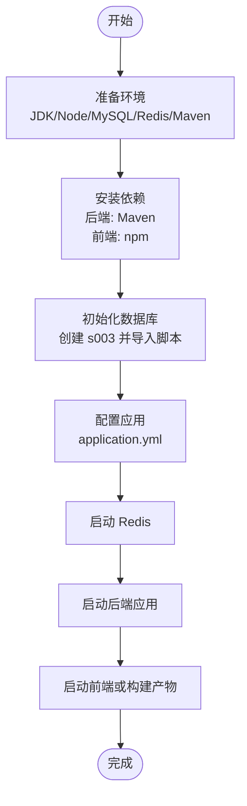
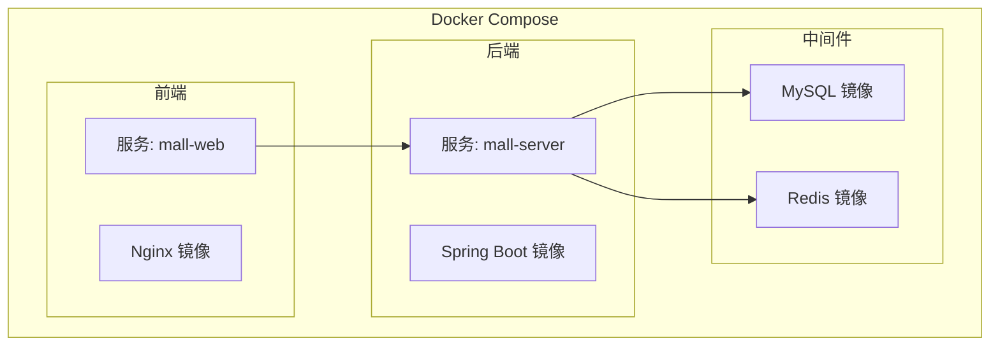
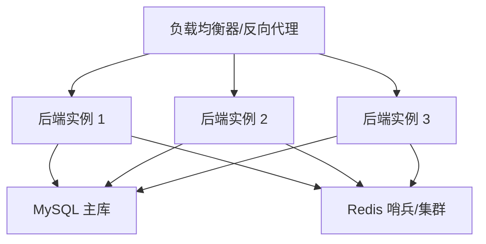
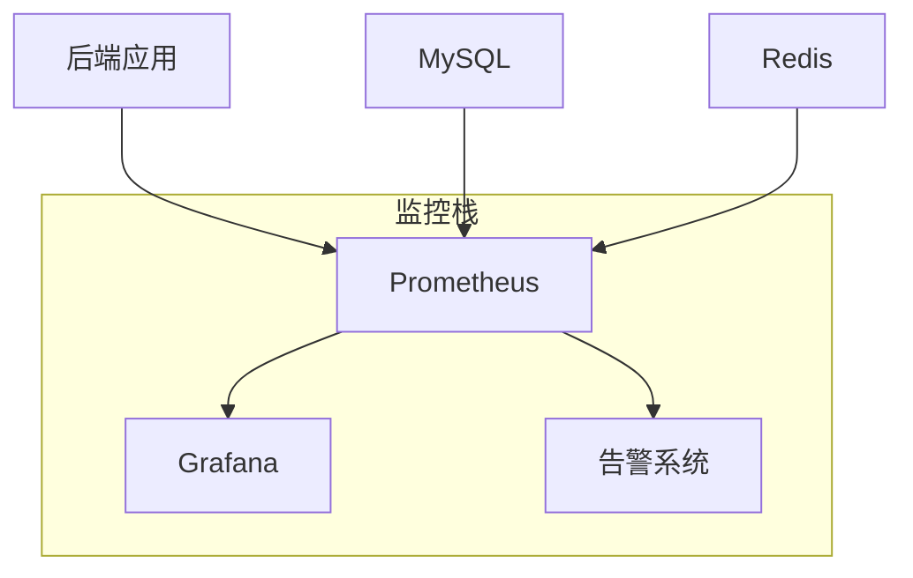
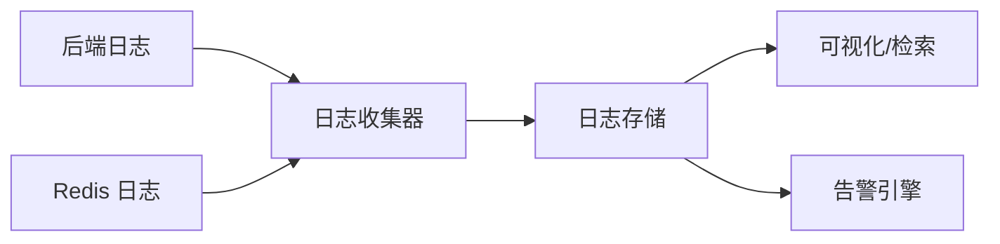
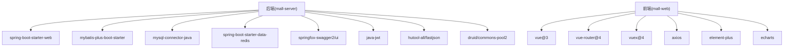

# 部署运维

<cite>
**本文引用的文件**
- [application.yml](file://mall-server/src/main/resources/application.yml)
- [pom.xml](file://mall-server/pom.xml)
- [MallApplication.java](file://mall-server/src/main/java/com/rabbiter/em/MallApplication.java)
- [README.md](file://README.md)
- [DATABASE_DESIGN.md](file://DATABASE_DESIGN.md)
- [s003.sql](file://s003.sql)
- [redis.windows.conf](file://redis/redis.windows.conf)
- [redis.windows-service.conf](file://redis/redis.windows-service.conf)
- [RedisStarter.bat](file://redis/RedisStarter.bat)
- [run_db_update_v3.bat](file://run_db_update_v3.bat)
- [package.json](file://mall-web/package.json)
</cite>

## 目录
1. [简介](#简介)
2. [项目结构](#项目结构)
3. [核心组件](#核心组件)
4. [架构总览](#架构总览)
5. [详细组件分析](#详细组件分析)
6. [依赖分析](#依赖分析)
7. [性能考虑](#性能考虑)
8. [故障排查指南](#故障排查指南)
9. [结论](#结论)
10. [附录](#附录)

## 简介
本文件面向生产环境的部署与运维，围绕 Cosplay 商城系统提供从环境准备、依赖安装、数据库初始化、应用启动，到容器化部署、高可用与负载均衡、监控与日志、备份与恢复、性能优化、安全加固、自动化与 CI/CD、以及故障排查与应急响应的完整方案。系统后端采用 Spring Boot + MyBatis Plus，前端采用 Vue.js，数据库为 MySQL，缓存为 Redis。

## 项目结构
- 后端服务：mall-server（Spring Boot 应用）
- 前端应用：mall-web（Vue.js 应用）
- 缓存服务：redis（Windows 版本）
- 数据库：MySQL（初始脚本与设计文档）

**图表来源**
- [application.yml:1-42](file://mall-server/src/main/resources/application.yml#L1-L42)
- [MallApplication.java:1-17](file://mall-server/src/main/java/com/rabbiter/em/MallApplication.java#L1-L17)

**章节来源**
- [README.md:1-94](file://README.md#L1-L94)
- [DATABASE_DESIGN.md:1-223](file://DATABASE_DESIGN.md#L1-L223)

## 核心组件
- 应用入口与扫描路径
  - 后端入口类负责启动 Spring Boot 应用，并通过 MapperScan 指定 Mapper 包扫描路径。
- 配置中心
  - application.yml 提供端口、编码、数据库、Redis、JWT、MyBatis 等关键配置项，支持通过环境变量覆盖。
- 依赖与构建
  - pom.xml 管理后端依赖（Spring Web、MyBatis Plus、MySQL 驱动、Redis、Swagger、JWT、Hutool、FastJSON、Druid 等），并配置 Maven 插件与仓库镜像。
- 数据库与缓存
  - s003.sql 提供初始化脚本；Redis 提供 Windows 配置与启动脚本。
- 前端构建
  - mall-web/package.json 定义前端脚本与依赖，用于开发与打包。

**章节来源**
- [MallApplication.java:1-17](file://mall-server/src/main/java/com/rabbiter/em/MallApplication.java#L1-L17)
- [application.yml:1-42](file://mall-server/src/main/resources/application.yml#L1-L42)
- [pom.xml:1-185](file://mall-server/pom.xml#L1-L185)
- [s003.sql:1-200](file://s003.sql#L1-L200)
- [redis.windows.conf:1-120](file://redis/redis.windows.conf#L1-L120)
- [RedisStarter.bat:1-1](file://redis/RedisStarter.bat#L1-L1)
- [package.json:1-32](file://mall-web/package.json#L1-L32)

## 架构总览
系统采用前后端分离架构，后端提供 REST API，前端通过 HTTP 客户端访问后端接口；数据库与 Redis 作为后端依赖，分别承担持久化与缓存职责。

**图表来源**
- [README.md:33-76](file://README.md#L33-L76)
- [application.yml:8-36](file://mall-server/src/main/resources/application.yml#L8-L36)

## 详细组件分析

### 生产环境部署流程
- 环境准备
  - JDK 1.8、Node.js、MySQL、Redis、Maven 已就绪。
- 依赖安装
  - 后端：使用 Maven 构建；前端：使用 npm 安装依赖。
- 数据库初始化
  - 创建数据库 s003 并执行 s003.sql 初始化表结构与基础数据。
  - 若数据库端口或凭据非默认，需在 application.yml 中调整。
- 应用启动
  - 启动 Redis（Windows 可使用 RedisStarter.bat）。
  - 启动后端 Spring Boot 应用（可通过 Maven 或直接运行入口类）。
  - 启动前端开发服务器或构建产物至静态资源目录。

**图表来源**
- [README.md:24-76](file://README.md#L24-L76)
- [s003.sql:20-22](file://s003.sql#L20-L22)
- [application.yml:9-26](file://mall-server/src/main/resources/application.yml#L9-L26)
- [RedisStarter.bat:1-1](file://redis/RedisStarter.bat#L1-L1)

**章节来源**
- [README.md:24-76](file://README.md#L24-L76)
- [s003.sql:20-22](file://s003.sql#L20-L22)
- [application.yml:9-26](file://mall-server/src/main/resources/application.yml#L9-L26)
- [RedisStarter.bat:1-1](file://redis/RedisStarter.bat#L1-L1)

### Docker 容器化部署与镜像构建
- 镜像构建策略
  - 后端：基于 Maven 构建产物，选择最小化运行时（如 OpenJDK Alpine）以减小镜像体积。
  - 前端：使用多阶段构建，先构建再复制静态资源至 Nginx 镜像。
  - 缓存：Redis 使用官方镜像，挂载持久化目录。
  - 数据库：MySQL 使用官方镜像，挂载数据卷与初始化脚本。
- 容器编排
  - 使用 Docker Compose 统一编排后端、前端、Redis、MySQL 四个服务，定义网络与卷。
- 环境变量
  - 通过环境变量注入数据库与 Redis 连接参数、JWT 密钥等敏感配置，避免硬编码。

**图表来源**
- [pom.xml:144-182](file://mall-server/pom.xml#L144-L182)
- [package.json:5-8](file://mall-web/package.json#L5-L8)
- [redis.windows.conf:39-41](file://redis/redis.windows.conf#L39-L41)

**章节来源**
- [pom.xml:144-182](file://mall-server/pom.xml#L144-L182)
- [package.json:5-8](file://mall-web/package.json#L5-L8)

### 负载均衡与高可用架构
- 多实例部署
  - 后端应用可横向扩展，结合反向代理实现请求分发。
- 故障转移
  - Redis 可采用哨兵或集群模式（按需启用），MySQL 可配置主从复制与自动切换。
- 会话与状态
  - 使用 Redis 存储会话与分布式缓存，避免粘性会话问题。
- 配置与健康检查
  - 通过环境变量与配置文件统一管理，结合健康检查端点进行探活。

**图表来源**
- [application.yml:22-36](file://mall-server/src/main/resources/application.yml#L22-L36)
- [redis.windows-service.conf:373-406](file://redis/redis.windows-service.conf#L373-L406)

**章节来源**
- [application.yml:22-36](file://mall-server/src/main/resources/application.yml#L22-L36)
- [redis.windows-service.conf:373-406](file://redis/redis.windows-service.conf#L373-L406)

### 监控系统集成与配置
- 应用监控
  - 启用 Actuator（若引入）暴露指标端点，结合 Prometheus/Grafana 进行采集与可视化。
- 数据库监控
  - MySQL 提供慢查询日志、连接数、缓冲池等指标，结合外部监控平台采集。
- Redis 监控
  - 使用 INFO/STATS 命令与慢日志功能，关注内存、命中率、延迟与客户端连接数。
- 告警策略
  - 设定阈值（如连接数上限、内存使用率、慢查询条数、错误率）触发告警。

**图表来源**
- [application.yml:35-42](file://mall-server/src/main/resources/application.yml#L35-L42)
- [redis.windows.conf:743-766](file://redis/redis.windows.conf#L743-L766)

**章节来源**
- [application.yml:35-42](file://mall-server/src/main/resources/application.yml#L35-L42)
- [redis.windows.conf:743-766](file://redis/redis.windows.conf#L743-L766)

### 日志收集与分析策略
- 日志输出
  - 后端：控制台与文件输出，建议集中化（如 ELK/EFK）收集。
  - Redis：Windows 事件日志与自定义日志文件。
- 日志聚合
  - 使用 Filebeat/Fluent Bit 收集日志，写入 Elasticsearch/Kibana。
- 告警配置
  - 对错误日志与异常堆栈设置实时告警。

**图表来源**
- [redis.windows-service.conf:97-109](file://redis/redis.windows-service.conf#L97-L109)
- [redis.windows.conf:97-99](file://redis/redis.windows.conf#L97-L99)

**章节来源**
- [redis.windows-service.conf:97-109](file://redis/redis.windows-service.conf#L97-L109)
- [redis.windows.conf:97-99](file://redis/redis.windows.conf#L97-L99)

### 备份与恢复策略
- 数据库备份
  - MySQL：定期逻辑备份（mysqldump）与物理备份（xtrabackup），并验证恢复流程。
- 文件备份
  - 上传文件与静态资源定期归档与异地备份。
- 配置备份
  - application.yml、Redis 配置、数据库初始化脚本纳入版本管理与快照。
- 恢复演练
  - 定期进行恢复演练，验证备份完整性与时效性。

**章节来源**
- [s003.sql:1-20](file://s003.sql#L1-L20)
- [run_db_update_v3.bat:1-1](file://run_db_update_v3.bat#L1-L1)

### 性能监控与调优
- 应用性能
  - 关注接口响应时间、吞吐量、错误率；结合 APM 工具定位瓶颈。
- 数据库优化
  - 索引优化、慢查询分析、连接池参数调优、读写分离与分库分表规划。
- 缓存优化
  - Redis 命中率、内存使用、过期策略与淘汰策略优化。
- 前端性能
  - 资源压缩、CDN、懒加载与缓存策略。

**章节来源**
- [application.yml:38-42](file://mall-server/src/main/resources/application.yml#L38-L42)
- [redis.windows.conf:430-492](file://redis/redis.windows.conf#L430-L492)

### 安全加固与漏洞扫描
- 网络与访问控制
  - 限制数据库与 Redis 的访问白名单，仅允许内网或受信网段。
- 配置安全
  - 敏感信息（数据库密码、Redis 密码、JWT 密钥）使用密钥管理服务或环境变量注入。
- 传输安全
  - 启用 TLS/HTTPS，强制 HTTPS 访问。
- 漏洞扫描
  - 定期对依赖库进行漏洞扫描（如 OWASP Dependency-Check），修复高危漏洞。
- 审计与合规
  - 开启审计日志，满足合规要求。

**章节来源**
- [application.yml:9-26](file://mall-server/src/main/resources/application.yml#L9-L26)
- [redis.windows-service.conf:373-406](file://redis/redis.windows-service.conf#L373-L406)

### 运维自动化与 CI/CD
- 自动化脚本
  - 数据库初始化与升级脚本、Redis 启停脚本、应用打包与发布脚本。
- CI/CD 流水线
  - 触发条件：提交代码 → 单元测试 → 代码扫描 → 构建镜像 → 部署预发布 → 自动化测试 → 发布到生产。
- 配置管理
  - 使用配置中心或环境变量，避免硬编码。

**章节来源**
- [run_db_update_v3.bat:1-1](file://run_db_update_v3.bat#L1-L1)
- [RedisStarter.bat:1-1](file://redis/RedisStarter.bat#L1-L1)
- [pom.xml:144-182](file://mall-server/pom.xml#L144-L182)

### 故障排查与应急响应
- 常见问题
  - 数据库连接失败：检查主机、端口、凭据与防火墙。
  - Redis 连接失败：确认服务状态、端口与密码。
  - 应用启动失败：查看日志、检查 JVM 参数与依赖冲突。
- 应急响应
  - 快速回滚至上一稳定版本，隔离故障节点，恢复备份。
- 事后复盘
  - 输出故障报告，完善监控与告警策略。

**章节来源**
- [README.md:24-76](file://README.md#L24-L76)
- [application.yml:9-26](file://mall-server/src/main/resources/application.yml#L9-L26)
- [redis.windows.conf:39-41](file://redis/redis.windows.conf#L39-L41)

## 依赖分析
- 后端依赖
  - Web、MyBatis Plus、MySQL 驱动、Redis、Swagger、JWT、Hutool、FastJSON、Druid、测试与构建插件。
- 前端依赖
  - Vue 3、Vue Router、Vuex、Axios、Element Plus、ECharts 等。

**图表来源**
- [pom.xml:19-118](file://mall-server/pom.xml#L19-L118)
- [package.json:10-25](file://mall-web/package.json#L10-L25)

**章节来源**
- [pom.xml:19-118](file://mall-server/pom.xml#L19-L118)
- [package.json:10-25](file://mall-web/package.json#L10-L25)

## 性能考虑
- 连接池与超时
  - 合理配置数据库连接池大小与超时时间，避免连接泄漏。
- 缓存策略
  - 利用 Redis 缓存热点数据，设置合理的过期策略与淘汰策略。
- 数据库索引
  - 针对高频查询字段建立索引，避免全表扫描。
- 前端资源
  - 启用 Gzip/Brotli 压缩，CDN 分发静态资源。

**章节来源**
- [application.yml:38-42](file://mall-server/src/main/resources/application.yml#L38-L42)
- [redis.windows.conf:430-492](file://redis/redis.windows.conf#L430-L492)

## 故障排查指南
- 启动失败
  - 检查端口占用、JVM 参数、依赖冲突与配置文件语法。
- 数据库异常
  - 核对连接串、用户名与密码、字符集与时区设置。
- 缓存异常
  - 检查 Redis 服务状态、密码与网络连通性。
- 接口异常
  - 查看后端日志与数据库慢查询日志，定位问题接口与 SQL。

**章节来源**
- [README.md:24-76](file://README.md#L24-L76)
- [application.yml:9-26](file://mall-server/src/main/resources/application.yml#L9-L26)
- [redis.windows.conf:39-41](file://redis/redis.windows.conf#L39-L41)

## 结论
通过标准化的环境准备、清晰的部署流程、完善的容器化与高可用设计、健全的监控与日志体系、严格的备份与安全策略，以及自动化与应急响应机制，Cosplay 商城系统可在生产环境中实现稳定、高效与安全的运行。建议持续优化性能与安全，完善自动化与可观测性能力。

## 附录
- 数据库 ER 图与表结构参考
  - 参考 DATABASE_DESIGN.md 中的实体关系图与各表字段说明。
- 初始化脚本
  - 使用 s003.sql 初始化数据库；必要时使用 run_db_update_v3.bat 执行结构变更。

**章节来源**
- [DATABASE_DESIGN.md:1-223](file://DATABASE_DESIGN.md#L1-L223)
- [s003.sql:1-200](file://s003.sql#L1-L200)
- [run_db_update_v3.bat:1-1](file://run_db_update_v3.bat#L1-L1)