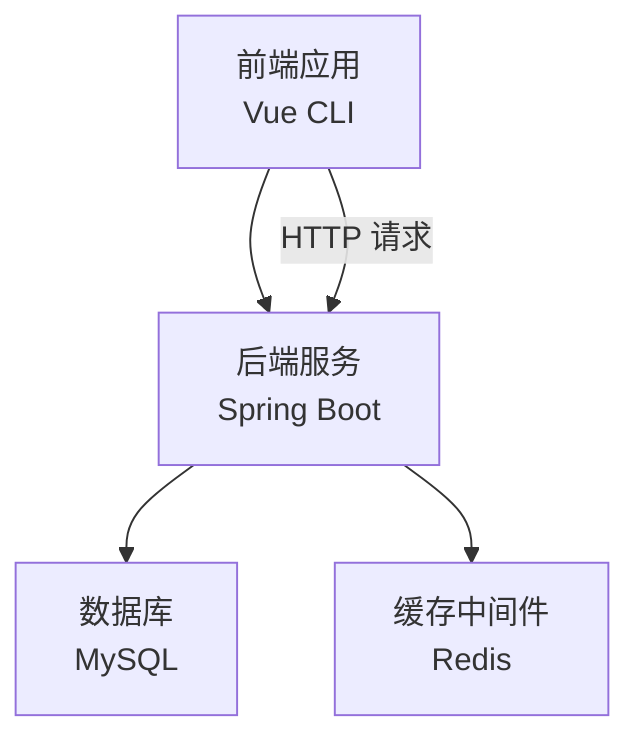
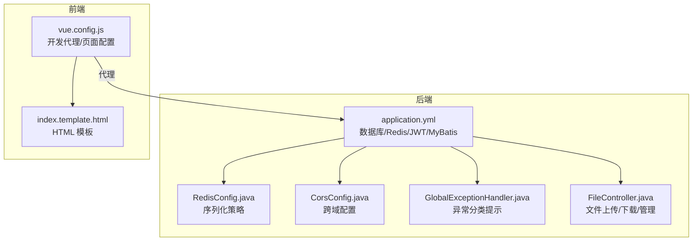
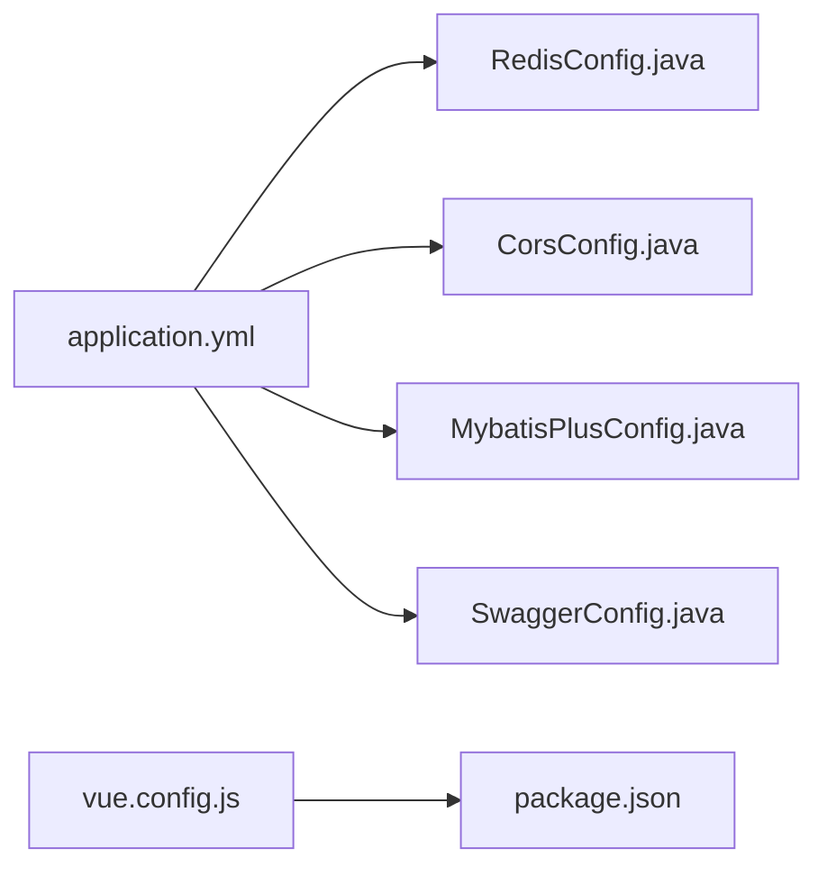

# 配置管理

<cite>
**本文引用的文件**
- [application.yml](file://mall-server/src/main/resources/application.yml)
- [vue.config.js](file://mall-web/vue.config.js)
- [pom.xml](file://mall-server/pom.xml)
- [package.json](file://mall-web/package.json)
- [RedisConfig.java](file://mall-server/src/main/java/com/rabbiter/em/config/RedisConfig.java)
- [SwaggerConfig.java](file://mall-server/src/main/java/com/rabbiter/em/config/SwaggerConfig.java)
- [MybatisPlusConfig.java](file://mall-server/src/main/java/com/rabbiter/em/config/MybatisPlusConfig.java)
- [CorsConfig.java](file://mall-server/src/main/java/com/rabbiter/em/config/CorsConfig.java)
- [GlobalExceptionHandler.java](file://mall-server/src/main/java/com/rabbiter/em/config/GlobalExceptionHandler.java)
- [PathUtils.java](file://mall-server/src/main/java/com/rabbiter/em/utils/PathUtils.java)
- [FileController.java](file://mall-server/src/main/java/com/rabbiter/em/controller/FileController.java)
- [index.template.html](file://mall-web/public/index.template.html)
- [redis.windows.conf](file://redis/redis.windows.conf)
- [redis.windows-service.conf](file://redis/redis.windows-service.conf)
</cite>

## 目录
1. [简介](#简介)
2. [项目结构](#项目结构)
3. [核心组件](#核心组件)
4. [架构总览](#架构总览)
5. [详细组件分析](#详细组件分析)
6. [依赖分析](#依赖分析)
7. [性能考量](#性能考量)
8. [故障排查指南](#故障排查指南)
9. [结论](#结论)
10. [附录](#附录)

## 简介
本文件系统化梳理 cosplay 商城系统的配置管理，覆盖后端 Spring Boot 的 application.yml 配置、前端 Vue.js 构建配置 vue.config.js、环境变量与多环境差异、日志与异常处理、静态资源与 CDN 策略、配置热更新与动态管理、安全与敏感信息保护、版本管理与协作规范，以及配置验证与故障排查方法。目标是帮助开发者与运维人员快速理解并正确维护系统配置。

## 项目结构
- 后端服务：基于 Spring Boot，配置集中在 resources 下的 application.yml；通过 Maven 管理依赖与插件。
- 前端应用：基于 Vue CLI，构建配置位于 mall-web/vue.config.js；页面模板位于 public/index.template.html。
- 缓存中间件：Redis 提供会话与缓存支持，Windows 环境下提供 redis.windows.conf 与 redis.windows-service.conf 作为参考。

**图表来源**
- [application.yml:1-42](file://mall-server/src/main/resources/application.yml#L1-L42)
- [vue.config.js:1-26](file://mall-web/vue.config.js#L1-L26)

**章节来源**
- [application.yml:1-42](file://mall-server/src/main/resources/application.yml#L1-L42)
- [vue.config.js:1-26](file://mall-web/vue.config.js#L1-L26)

## 核心组件
- Spring Boot 应用配置：服务器端口、字符集、文件上传大小限制、数据库连接、Redis 连接、JWT 密钥、MyBatis Mapper 扫描与驼峰映射。
- Vue CLI 构建配置：开发服务器端口、代理到后端、单页应用入口与模板、页面配置。
- Redis 序列化与模板：键值序列化策略与用户对象专用模板。
- 跨域与全局异常：统一 CORS 映射与异常分类提示。
- 文件上传与下载：控制器层对上传、下载、批量删除与状态变更的接口封装。
- 日志与异常：全局异常处理器对数据库、Redis、SQL 等常见问题进行识别与友好提示。

**章节来源**
- [application.yml:1-42](file://mall-server/src/main/resources/application.yml#L1-L42)
- [vue.config.js:1-26](file://mall-web/vue.config.js#L1-L26)
- [RedisConfig.java:1-38](file://mall-server/src/main/java/com/rabbiter/em/config/RedisConfig.java#L1-L38)
- [CorsConfig.java:1-29](file://mall-server/src/main/java/com/rabbiter/em/config/CorsConfig.java#L1-L29)
- [GlobalExceptionHandler.java:1-45](file://mall-server/src/main/java/com/rabbiter/em/config/GlobalExceptionHandler.java#L1-L45)
- [FileController.java:1-80](file://mall-server/src/main/java/com/rabbiter/em/controller/FileController.java#L1-L80)

## 架构总览
后端通过 application.yml 统一管理数据源、Redis、JWT、MyBatis 等配置；前端通过 vue.config.js 将开发期请求代理至后端，构建产物由 Nginx 或静态托管提供访问。全局异常处理器在运行期对典型错误进行归类与提示，提升可观测性与可维护性。

**图表来源**
- [application.yml:1-42](file://mall-server/src/main/resources/application.yml#L1-L42)
- [RedisConfig.java:1-38](file://mall-server/src/main/java/com/rabbiter/em/config/RedisConfig.java#L1-L38)
- [CorsConfig.java:1-29](file://mall-server/src/main/java/com/rabbiter/em/config/CorsConfig.java#L1-L29)
- [GlobalExceptionHandler.java:1-45](file://mall-server/src/main/java/com/rabbiter/em/config/GlobalExceptionHandler.java#L1-L45)
- [FileController.java:1-80](file://mall-server/src/main/java/com/rabbiter/em/controller/FileController.java#L1-L80)
- [vue.config.js:1-26](file://mall-web/vue.config.js#L1-L26)
- [index.template.html:1-24](file://mall-web/public/index.template.html#L1-L24)

## 详细组件分析

### Spring Boot 配置(application.yml)
- 服务器与编码
  - 服务器端口与 Servlet 编码（UTF-8 强制）。
  - HTTP 层编码同样强制 UTF-8。
- 文件上传
  - 单文件最大大小为 30MB。
- 数据库连接
  - 使用 MySQL 驱动与 JDBC URL，支持主机、端口、库名、用户名、密码的环境变量注入。
  - URL 参数包含时区、SSL、字符集与排序规则等。
- Redis 连接
  - 支持主机、端口、密码的环境变量注入。
  - Lettuce 连接池参数与连接超时。
- JWT 密钥
  - 通过环境变量注入，默认值用于开发，生产需替换。
- MyBatis
  - Mapper XML 扫描路径与下划线转驼峰映射。

建议
- 生产环境务必通过环境变量覆盖默认值，避免硬编码。
- 对数据库与 Redis 的连接参数进行最小权限与网络隔离。

**章节来源**
- [application.yml:1-42](file://mall-server/src/main/resources/application.yml#L1-L42)

### Vue CLI 构建配置(vue.config.js)
- 开发服务器
  - 端口 9192。
  - 代理到后端 9191，开启跨域与请求头字符集。
- 页面配置
  - 单页入口、模板、标题。
- 其他
  - 依赖 transpileDependencies，便于兼容现代浏览器。

建议
- 在 CI/CD 中通过环境变量或构建参数控制代理目标，适配不同环境。
- 生产构建后，结合 CDN 与静态资源路径优化加载。

**章节来源**
- [vue.config.js:1-26](file://mall-web/vue.config.js#L1-L26)

### 环境变量与多环境管理
- 后端
  - DB_HOST/DB_PORT/DB_NAME/DB_USER/DB_PASS：数据库连接。
  - REDIS_HOST/REDIS_PORT/REDIS_PASS：Redis 连接。
  - JWT_SECRET：JWT 密钥。
- 前端
  - 可通过构建脚本或 CI 注入环境变量，以控制代理目标与运行时行为。
- 最佳实践
  - 使用 .env.* 文件区分开发/测试/生产，配合 CI/CD 注入。
  - 敏感信息不进入代码仓库，使用密钥管理服务或平台提供的机密存储。

**章节来源**
- [application.yml:9-36](file://mall-server/src/main/resources/application.yml#L9-L36)
- [vue.config.js:4-16](file://mall-web/vue.config.js#L4-L16)
- [package.json:5-8](file://mall-web/package.json#L5-L8)

### 日志配置与异常处理
- 全局异常处理
  - 对数据库连接失败、表不存在、未知数据库、Redis 连接失败、JDBC 获取失败、SQL 语法错误等进行识别与友好提示。
- 日志级别
  - 建议在 application.yml 中通过 logging.level.* 设置业务与框架日志级别，生产环境默认 INFO 或 WARN。
- 建议
  - 结合集中式日志（如 ELK/云日志）采集后端日志，前端错误可通过 SDK 上报。

**章节来源**
- [GlobalExceptionHandler.java:16-43](file://mall-server/src/main/java/com/rabbiter/em/config/GlobalExceptionHandler.java#L16-L43)

### 静态资源与 CDN 集成
- HTML 模板
  - 使用 public/index.template.html 作为构建模板，确保 title、meta 等基础标签一致。
- 构建产物
  - Vue CLI 默认输出至 dist，可配置为相对路径或 CDN 前缀。
- CDN 策略
  - 将静态资源（JS/CSS/图片）指向 CDN，减少主站带宽压力。
  - 版本化资源名与缓存策略（强缓存/协商缓存）配合，保证更新与回滚可控。

**章节来源**
- [index.template.html:1-24](file://mall-web/public/index.template.html#L1-L24)

### 文件上传与存储路径
- 控制器接口
  - 上传：接收 MultipartFile 并返回访问 URL。
  - 下载：根据文件名读取并写入响应。
  - 管理：按 ID 删除、批量删除、启用/禁用、分页查询。
- 存储路径
  - 通过工具类获取类加载根路径，结合业务实现本地或对象存储保存策略。
- 建议
  - 生产环境优先使用对象存储（OSS/MinIO），并开启鉴权与防盗链。

**章节来源**
- [FileController.java:25-78](file://mall-server/src/main/java/com/rabbiter/em/controller/FileController.java#L25-L78)
- [PathUtils.java:7-28](file://mall-server/src/main/java/com/rabbiter/em/utils/PathUtils.java#L7-L28)

### Redis 配置与序列化
- 连接与池化
  - 通过 application.yml 配置 host/port/password 与连接池参数。
- 序列化策略
  - RedisConfig 定义了通用 JSON 序列化与用户对象专用模板，确保键值序列化一致性。
- 建议
  - 生产环境开启 Redis 认证与网络隔离；合理设置过期时间与内存上限。

**章节来源**
- [application.yml:22-34](file://mall-server/src/main/resources/application.yml#L22-L34)
- [RedisConfig.java:14-35](file://mall-server/src/main/java/com/rabbiter/em/config/RedisConfig.java#L14-L35)

### 跨域与安全拦截
- 跨域
  - CorsConfig 提供通配符允许来源、方法、头与凭证，暴露 SET_COOKIE 头并设置缓存时间。
- 安全拦截
  - 结合 JWT 与自定义拦截器实现登录与权限校验（在项目中存在拦截器与注解，具体实现未在本节展开）。

**章节来源**
- [CorsConfig.java:18-25](file://mall-server/src/main/java/com/rabbiter/em/config/CorsConfig.java#L18-L25)

### Swagger 文档
- SwaggerConfig 启用 Swagger2 并扫描控制器包，提供 API 文档能力，便于联调与测试。

**章节来源**
- [SwaggerConfig.java:16-31](file://mall-server/src/main/java/com/rabbiter/em/config/SwaggerConfig.java#L16-L31)

### 分页与 MyBatis Plus
- MybatisPlusConfig 配置分页插件与最大记录限制，确保高并发下的分页安全与性能。

**章节来源**
- [MybatisPlusConfig.java:12-19](file://mall-server/src/main/java/com/rabbiter/em/config/MybatisPlusConfig.java#L12-L19)

### Maven 依赖与构建
- 依赖
  - Web、MyBatis/MyBatis-Plus、MySQL 驱动、Druid 连接池、Swagger、JWT、Redis、BCrypt、FastJSON、Hutool 等。
- 插件
  - spring-boot-maven-plugin、maven-surefire-plugin、jacoco-maven-plugin。
- 建议
  - 锁定版本，定期审计依赖安全漏洞；测试阶段可调整 surefire 跳过策略。

**章节来源**
- [pom.xml:19-118](file://mall-server/pom.xml#L19-L118)
- [pom.xml:144-182](file://mall-server/pom.xml#L144-L182)

## 依赖分析
- 后端配置依赖
  - application.yml 是所有运行期配置的根，RedisConfig、CorsConfig、MybatisPlusConfig、SwaggerConfig 等均围绕其生效。
- 前端构建依赖
  - vue.config.js 依赖 package.json 中的脚本与依赖，决定开发与生产行为。
- 外部依赖
  - MySQL、Redis、JWT、Swagger、日志与测试工具等。

**图表来源**
- [application.yml:1-42](file://mall-server/src/main/resources/application.yml#L1-L42)
- [RedisConfig.java:1-38](file://mall-server/src/main/java/com/rabbiter/em/config/RedisConfig.java#L1-L38)
- [CorsConfig.java:1-29](file://mall-server/src/main/java/com/rabbiter/em/config/CorsConfig.java#L1-L29)
- [MybatisPlusConfig.java:1-21](file://mall-server/src/main/java/com/rabbiter/em/config/MybatisPlusConfig.java#L1-L21)
- [SwaggerConfig.java:1-33](file://mall-server/src/main/java/com/rabbiter/em/config/SwaggerConfig.java#L1-L33)
- [vue.config.js:1-26](file://mall-web/vue.config.js#L1-L26)
- [package.json:1-32](file://mall-web/package.json#L1-L32)

**章节来源**
- [application.yml:1-42](file://mall-server/src/main/resources/application.yml#L1-L42)
- [vue.config.js:1-26](file://mall-web/vue.config.js#L1-L26)

## 性能考量
- 数据库
  - 合理设置连接池大小与超时；生产环境启用 SSL 与只读副本。
- Redis
  - 优化连接池参数、设置合理的过期策略与内存上限；必要时开启持久化。
- 文件上传
  - 控制单文件大小与并发；上传到对象存储并开启 CDN 加速。
- 前端
  - 构建时启用压缩与 Tree Shaking；静态资源走 CDN；按需加载模块。

[本节为通用指导，无需特定文件引用]

## 故障排查指南
- 数据库连接失败
  - 检查 DB_HOST/DB_PORT/DB_NAME/DB_USER/DB_PASS 是否正确；确认网络连通与防火墙；查看异常处理器中的错误提示。
- Redis 连接失败
  - 检查 REDIS_HOST/REDIS_PORT/REDIS_PASS；确认 Redis 服务状态与认证；核对连接池参数。
- 文件上传异常
  - 检查文件大小限制、存储路径权限、对象存储凭据；查看控制器返回的错误信息。
- 跨域问题
  - 核对 CorsConfig 的允许来源、方法、头与凭证设置。
- Swagger 文档不可用
  - 确认 SwaggerConfig 已启用并扫描到控制器包。

**章节来源**
- [GlobalExceptionHandler.java:22-43](file://mall-server/src/main/java/com/rabbiter/em/config/GlobalExceptionHandler.java#L22-L43)
- [application.yml:9-36](file://mall-server/src/main/resources/application.yml#L9-L36)
- [CorsConfig.java:18-25](file://mall-server/src/main/java/com/rabbiter/em/config/CorsConfig.java#L18-L25)
- [FileController.java:25-78](file://mall-server/src/main/java/com/rabbiter/em/controller/FileController.java#L25-L78)

## 结论
本配置体系以 application.yml 为核心，结合 Vue CLI 构建配置与 Redis、MyBatis Plus、Swagger 等组件，形成前后端协同的配置闭环。通过环境变量、异常处理与日志策略，提升了系统的可观测性与可维护性。建议在生产环境中强化安全与性能配置，并建立完善的版本管理与协作流程。

[本节为总结，无需特定文件引用]

## 附录

### 配置热更新与动态管理
- Spring Cloud Config/Bus：集中管理配置并支持刷新。
- Apollo/Nacos：提供配置中心与动态推送。
- 前端：通过构建参数或运行时配置接口切换环境与功能开关。

[本节为概念性建议，无需特定文件引用]

### 配置安全性与敏感信息保护
- 使用环境变量或密钥管理服务注入敏感信息。
- 生产环境关闭 Swagger 或限制访问。
- 严格控制数据库与 Redis 的访问权限与网络隔离。
- 定期轮换 JWT 密钥与数据库账号密码。

[本节为通用指导，无需特定文件引用]

### 配置版本管理与团队协作
- 使用 Git 管理配置文件，区分分支与 PR 审批。
- 采用“环境变量 + 默认值”的策略，避免在仓库中提交真实密钥。
- 建立配置变更审批与回滚机制。

[本节为通用指导，无需特定文件引用]

### 配置验证与故障排查方法
- 启动日志：观察数据库与 Redis 连接是否成功。
- 接口测试：使用 Swagger 或 Postman 验证上传、下载、分页等功能。
- 前端代理：确认 vue.config.js 代理是否正确转发到后端。
- Redis：使用客户端命令检查连接与键空间。

**章节来源**
- [vue.config.js:4-16](file://mall-web/vue.config.js#L4-L16)
- [SwaggerConfig.java:16-31](file://mall-server/src/main/java/com/rabbiter/em/config/SwaggerConfig.java#L16-L31)