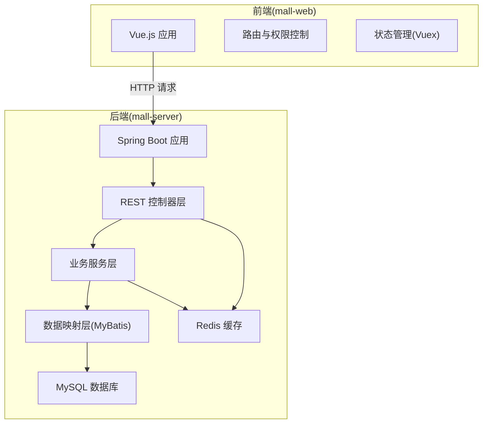
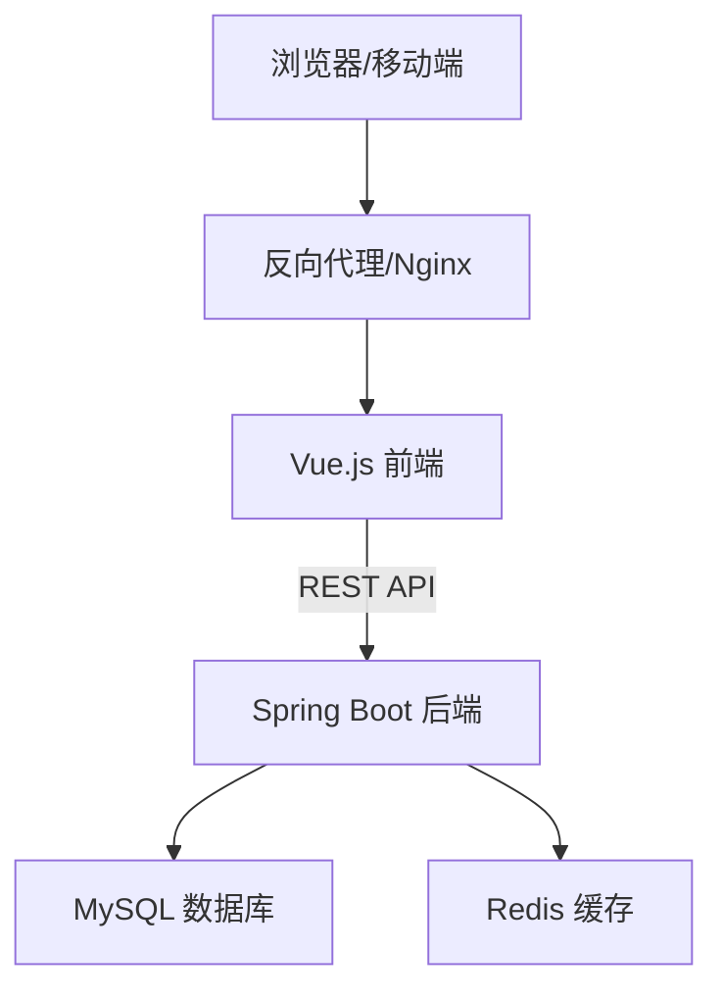
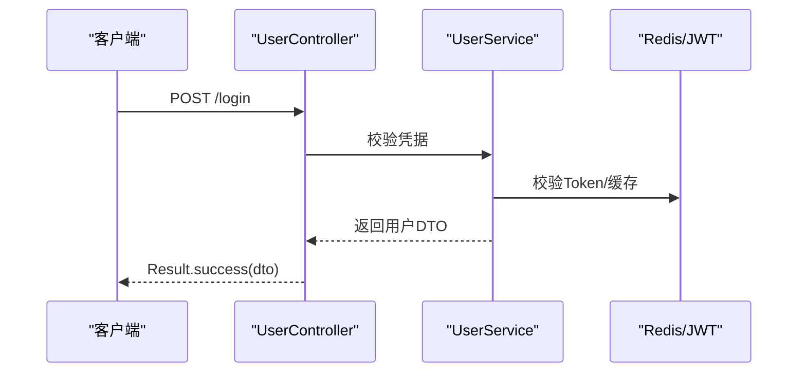
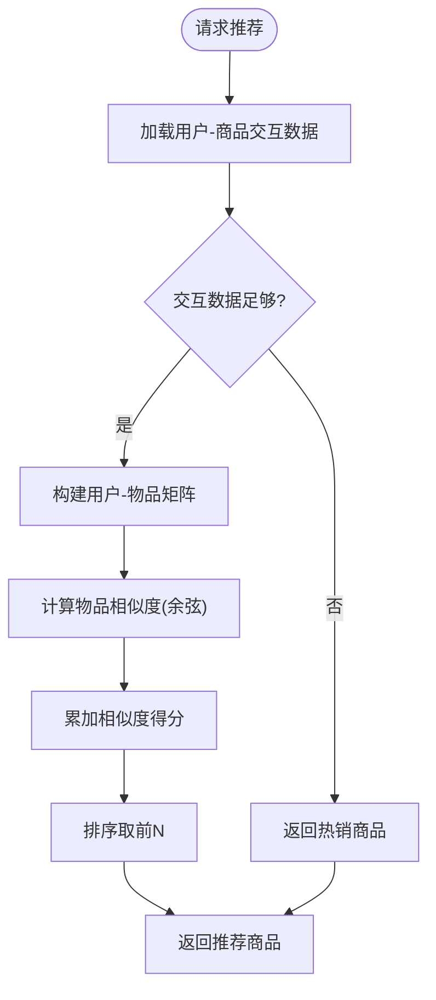
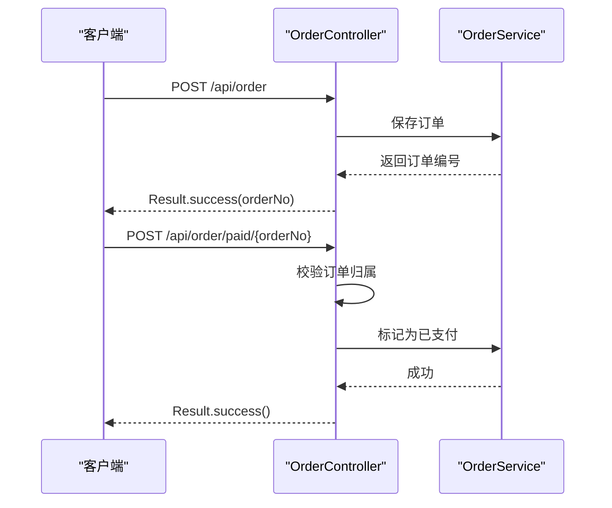
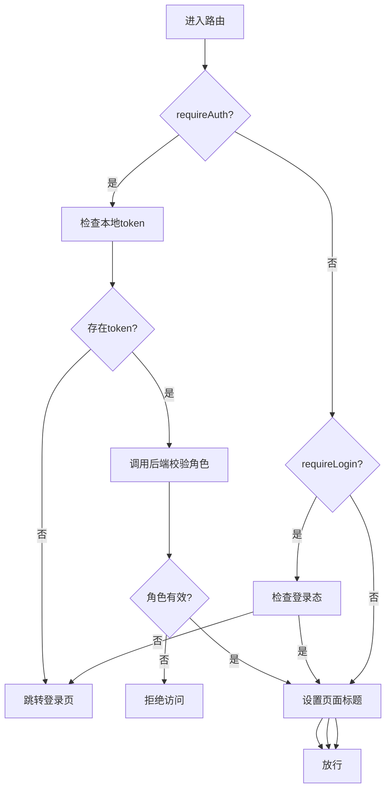
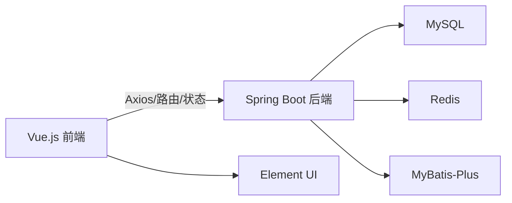

# 项目概述

<cite>
**本文引用的文件**
- [README.md](file://README.md)
- [SYSTEM_DOCUMENTATION.md](file://SYSTEM_DOCUMENTATION.md)
- [DATABASE_DESIGN.md](file://DATABASE_DESIGN.md)
- [MallApplication.java](file://mall-server/src/main/java/com/rabbiter/em/MallApplication.java)
- [application.yml](file://mall-server/src/main/resources/application.yml)
- [RedisConfig.java](file://mall-server/src/main/java/com/rabbiter/em/config/RedisConfig.java)
- [UserController.java](file://mall-server/src/main/java/com/rabbiter/em/controller/UserController.java)
- [GoodController.java](file://mall-server/src/main/java/com/rabbiter/em/controller/GoodController.java)
- [OrderController.java](file://mall-server/src/main/java/com/rabbiter/em/controller/OrderController.java)
- [RecommendationService.java](file://mall-server/src/main/java/com/rabbiter/em/service/RecommendationService.java)
- [index.js](file://mall-web/src/router/index.js)
- [main.js](file://mall-web/src/main.js)
- [GoodList.vue](file://mall-web/src/views/front/good/GoodList.vue)
- [Goods.vue](file://mall-web/src/views/manage/good/Goods.vue)
- [package.json](file://mall-web/package.json)
</cite>

## 目录
1. [引言](#引言)
2. [项目结构](#项目结构)
3. [核心组件](#核心组件)
4. [架构总览](#架构总览)
5. [详细组件分析](#详细组件分析)
6. [依赖分析](#依赖分析)
7. [性能考虑](#性能考虑)
8. [故障排查指南](#故障排查指南)
9. [结论](#结论)
10. [附录](#附录)

## 引言
本项目是一个面向Cosplay爱好者的服装电商系统，采用前后端分离架构：后端基于Spring Boot与MyBatis-Plus，提供REST API；前端基于Vue.js 2与Element UI，构建用户端与管理端双入口应用。系统围绕“商品浏览—购物车—下单支付—订单管理—售后评价”的核心业务闭环展开，同时提供个性化推荐、轮播图、公告、评论等运营与互动能力。项目强调可扩展性与易维护性，适合初学者快速上手，也为有经验的开发者提供了清晰的分层与职责边界。

## 项目结构
项目分为三个主要部分：
- mall-server：后端服务，负责业务逻辑、数据持久化、鉴权与缓存集成
- mall-web：前端应用，包含用户端与管理端两套界面
- redis：本地Redis服务（Windows）

**图表来源**
- [main.js:1-18](file://mall-web/src/main.js#L1-L18)
- [index.js:1-161](file://mall-web/src/router/index.js#L1-L161)
- [MallApplication.java:1-17](file://mall-server/src/main/java/com/rabbiter/em/MallApplication.java#L1-L17)
- [application.yml:1-42](file://mall-server/src/main/resources/application.yml#L1-L42)

**章节来源**
- [README.md:84-94](file://README.md#L84-L94)
- [SYSTEM_DOCUMENTATION.md:12-21](file://SYSTEM_DOCUMENTATION.md#L12-L21)

## 核心组件
- 后端核心入口：Spring Boot引导类扫描Mapper包并启动应用
- 配置中心：application.yml集中管理端口、数据库、Redis、JWT与MyBatis参数
- 缓存配置：RedisTemplate序列化策略统一，支持通用Object与特定User类型
- 控制器层：用户、商品、订单三大领域控制器，统一返回Result包装
- 业务服务：包含个性化推荐服务，基于协同过滤算法实现商品推荐兜底
- 前端入口：Vue应用挂载路由与状态管理，Element UI提供组件基础

**章节来源**
- [MallApplication.java:1-17](file://mall-server/src/main/java/com/rabbiter/em/MallApplication.java#L1-L17)
- [application.yml:1-42](file://mall-server/src/main/resources/application.yml#L1-L42)
- [RedisConfig.java:1-38](file://mall-server/src/main/java/com/rabbiter/em/config/RedisConfig.java#L1-L38)
- [UserController.java:1-179](file://mall-server/src/main/java/com/rabbiter/em/controller/UserController.java#L1-L179)
- [GoodController.java:1-209](file://mall-server/src/main/java/com/rabbiter/em/controller/GoodController.java#L1-L209)
- [OrderController.java:1-196](file://mall-server/src/main/java/com/rabbiter/em/controller/OrderController.java#L1-L196)
- [RecommendationService.java:1-113](file://mall-server/src/main/java/com/rabbiter/em/service/RecommendationService.java#L1-L113)
- [main.js:1-18](file://mall-web/src/main.js#L1-L18)

## 架构总览
系统采用前后端分离架构，前端通过Axios调用后端REST接口，后端使用JWT进行无状态鉴权，Redis承担热点数据与Token缓存，MySQL承载业务数据。路由层面，前端区分用户端与管理端，分别受登录与角色权限控制。

**图表来源**
- [SYSTEM_DOCUMENTATION.md:12-21](file://SYSTEM_DOCUMENTATION.md#L12-L21)
- [index.js:1-161](file://mall-web/src/router/index.js#L1-L161)
- [application.yml:1-42](file://mall-server/src/main/resources/application.yml#L1-L42)

## 详细组件分析

### 用户模块（登录/注册/权限）
- 接口覆盖：登录、注册、获取用户信息、按条件分页查询、批量删除、重置密码等
- 权限控制：通过自定义注解与拦截器实现登录态与角色校验
- 统一响应：Result封装返回结构，便于前端统一处理

**图表来源**
- [UserController.java:37-57](file://mall-server/src/main/java/com/rabbiter/em/controller/UserController.java#L37-L57)
- [application.yml:35-36](file://mall-server/src/main/resources/application.yml#L35-L36)

**章节来源**
- [UserController.java:1-179](file://mall-server/src/main/java/com/rabbiter/em/controller/UserController.java#L1-L179)

### 商品模块（浏览/推荐/规格/分页）
- 接口覆盖：商品分页、详情、销量排行、规格管理、推荐接口
- 推荐机制：基于用户-商品交互的物品协同过滤，冷启动时回退热销商品
- 管理端能力：全量分页、推荐开关、上下架切换、图片上传

**图表来源**
- [RecommendationService.java:29-101](file://mall-server/src/main/java/com/rabbiter/em/service/RecommendationService.java#L29-L101)

**章节来源**
- [GoodController.java:1-209](file://mall-server/src/main/java/com/rabbiter/em/controller/GoodController.java#L1-L209)
- [RecommendationService.java:1-113](file://mall-server/src/main/java/com/rabbiter/em/service/RecommendationService.java#L1-L113)

### 订单模块（创建/支付/发货/收货）
- 接口覆盖：创建订单、按用户/订单号查询、分页与导出、发货、确认收货、删除
- 权限校验：非管理员仅能操作本人订单
- 导出CSV：支持订单导出并自动命名

**图表来源**
- [OrderController.java:134-151](file://mall-server/src/main/java/com/rabbiter/em/controller/OrderController.java#L134-L151)

**章节来源**
- [OrderController.java:1-196](file://mall-server/src/main/java/com/rabbiter/em/controller/OrderController.java#L1-L196)

### 前端路由与权限控制
- 用户端与管理端路由分离，管理端需登录且具备管理员角色
- 登录态校验：路由守卫读取本地存储并调用后端角色接口
- 页面标题动态设置，提升用户体验

**图表来源**
- [index.js:84-150](file://mall-web/src/router/index.js#L84-L150)

**章节来源**
- [index.js:1-161](file://mall-web/src/router/index.js#L1-L161)

### 前端页面与交互（用户端示例）
- 商品列表页：支持分类筛选、关键词搜索、分页展示、售罄标记
- 图片懒加载与响应式布局，适配多终端
- 与后端接口协作，实现分页与筛选联动

**章节来源**
- [GoodList.vue:1-485](file://mall-web/src/views/front/good/GoodList.vue#L1-L485)

### 前端页面与交互（管理端示例）
- 商品管理页：表格展示、状态切换、推荐开关、分页与搜索
- 图片上传与表单提交，统一消息提示
- 路由跳转至详情编辑页

**章节来源**
- [Goods.vue:1-289](file://mall-web/src/views/manage/good/Goods.vue#L1-L289)

## 依赖分析
- 技术栈选择理由
  - Spring Boot：快速搭建与自动配置，结合MyBatis-Plus简化CRUD
  - Vue.js 2：生态成熟、组件化开发体验良好，配合Element UI与Vuex
  - MySQL：关系型数据库，事务与一致性保障强
  - Redis：热点数据与Token缓存，降低数据库压力
  - JWT：无状态鉴权，利于水平扩展
- 依赖关系可视化

**图表来源**
- [README.md:5-23](file://README.md#L5-L23)
- [SYSTEM_DOCUMENTATION.md:5-11](file://SYSTEM_DOCUMENTATION.md#L5-L11)
- [package.json:10-25](file://mall-web/package.json#L10-L25)

**章节来源**
- [README.md:5-23](file://README.md#L5-L23)
- [SYSTEM_DOCUMENTATION.md:5-11](file://SYSTEM_DOCUMENTATION.md#L5-L11)
- [package.json:1-32](file://mall-web/package.json#L1-L32)

## 性能考虑
- 前后端分离：静态资源可由Nginx或CDN分发，减轻后端压力
- Redis缓存：热点数据与Token缓存减少数据库访问
- 分页查询：后端分页避免一次性传输大量数据
- 推荐算法：协同过滤在数据稀疏时回退热销，保证稳定性
- 建议优化
  - 对高频接口增加缓存层（如商品详情、分类列表）
  - 使用连接池与慢查询日志监控数据库性能
  - 前端图片懒加载与CDN加速
  - 对订单导出等大体量操作异步化

## 故障排查指南
- 上传图片失败：检查文件存储路径配置与写入权限
- Token/验证码无效：确认Redis服务运行状态与连接配置
- 数据库连接报错：核对MySQL版本、时区与时区参数(serverTimezone=Asia/Shanghai)
- 跨域问题：后端已开启全局跨域，若仍异常检查浏览器网络与CORS配置
- 登录状态失效：前端路由守卫会清理本地存储并跳转登录页

**章节来源**
- [SYSTEM_DOCUMENTATION.md:95-103](file://SYSTEM_DOCUMENTATION.md#L95-L103)

## 结论
本项目以清晰的前后端分离架构为基础，结合Spring Boot与Vue.js的技术组合，实现了Cosplay服装电商的核心业务能力。通过JWT鉴权、Redis缓存与MyBatis-Plus，系统在可维护性与性能之间取得平衡。个性化推荐与管理端运营能力进一步增强了平台的竞争力。建议后续在缓存策略、异步任务与监控体系方面持续优化，以支撑更大规模的业务增长。

## 附录
- 业务场景与目标用户
  - 用户场景：浏览、搜索、下单、支付、评价与售后
  - 管理场景：商品管理、订单流转、运营配置与数据统计
- 创新点与竞争优势
  - 基于协同过滤的商品推荐，结合热销兜底策略
  - 管理端一体化运营工具链（商品、订单、公告、评论）
  - 前后端分离与路由权限控制，提升开发效率与安全性

**章节来源**
- [SYSTEM_DOCUMENTATION.md:22-37](file://SYSTEM_DOCUMENTATION.md#L22-L37)
- [DATABASE_DESIGN.md:1-223](file://DATABASE_DESIGN.md#L1-L223)