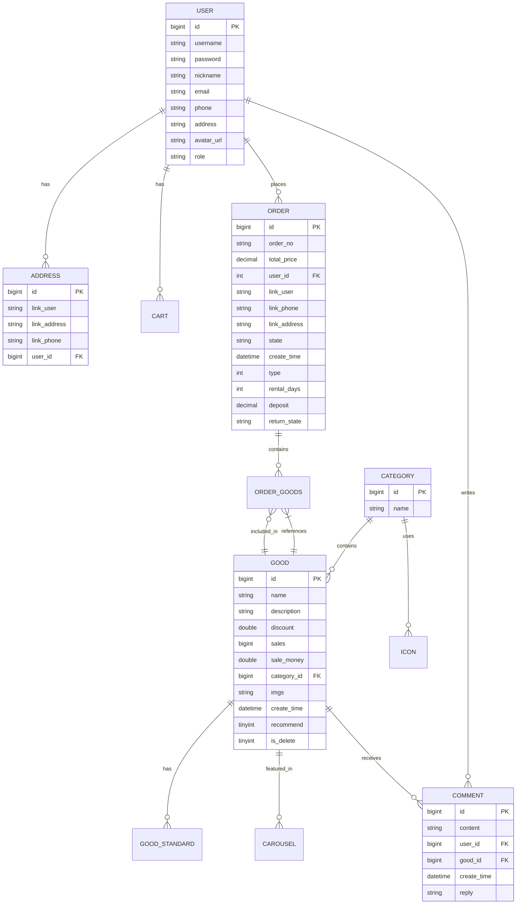

# 数据库设计文档

## 1. 实体关系图 (ER Diagram)

## 2. 数据库表结构

### 2.1 用户表 (sys_user)
存储系统用户信息，包括管理员和普通用户。

| 字段名 | 类型 | 长度 | 允许空 | 默认值 | 说明 |
| :--- | :--- | :--- | :--- | :--- | :--- |
| id | bigint | 20 | NO | AUTO_INCREMENT | 主键ID |
| username | varchar | 255 | YES | NULL | 用户名 |
| password | varchar | 255 | YES | NULL | 密码(加密) |
| nickname | varchar | 255 | YES | NULL | 昵称 |
| email | varchar | 255 | YES | NULL | 邮箱 |
| phone | varchar | 255 | YES | NULL | 手机号码 |
| address | varchar | 1600 | YES | NULL | 默认地址 |
| avatar_url | varchar | 255 | YES | NULL | 头像URL |
| role | varchar | 255 | YES | NULL | 角色(admin/user) |

### 2.2 商品表 (good)
存储商品基本信息。

| 字段名 | 类型 | 长度 | 允许空 | 默认值 | 说明 |
| :--- | :--- | :--- | :--- | :--- | :--- |
| id | bigint | 20 | NO | AUTO_INCREMENT | 主键ID |
| name | varchar | 255 | YES | NULL | 商品名称 |
| description | varchar | 1600 | YES | NULL | 商品描述 |
| discount | double | 10,2 | NO | 1.00 | 折扣 |
| sales | bigint | 20 | NO | 0 | 销量 |
| sale_money | double | 10,2 | YES | 0.00 | 销售额 |
| category_id | bigint | 20 | YES | NULL | 分类ID |
| imgs | varchar | 255 | YES | NULL | 商品图片URL |
| create_time | datetime | - | YES | NULL | 创建时间 |
| recommend | tinyint | 1 | NO | 0 | 是否推荐(0:否, 1:是) |
| is_delete | tinyint | 1 | NO | 0 | 是否逻辑删除(0:否, 1:是) |

### 2.3 订单表 (t_order)
存储用户订单信息，当前版本聚焦普通购买流程。租赁相关字段为历史兼容保留字段，当前版本未启用。

| 字段名 | 类型 | 长度 | 允许空 | 默认值 | 说明 |
| :--- | :--- | :--- | :--- | :--- | :--- |
| id | bigint | 20 | NO | AUTO_INCREMENT | 主键ID |
| order_no | varchar | 255 | YES | NULL | 订单编号 |
| total_price | decimal | 10,2 | YES | NULL | 订单总价 |
| user_id | bigint | 20 | YES | NULL | 下单用户ID |
| link_user | varchar | 255 | YES | NULL | 联系人姓名 |
| link_phone | varchar | 255 | YES | NULL | 联系电话 |
| link_address | varchar | 255 | YES | NULL | 收货地址 |
| state | varchar | 255 | YES | NULL | 订单状态(待付款/待发货/已发货/已完成等) |
| create_time | datetime | - | YES | NULL | 创建时间 |
| type | int | 11 | YES | 0 | 历史兼容保留字段，当前版本未启用（默认0：购买） |
| rental_days | int | 11 | YES | 0 | 历史兼容保留字段，当前版本未启用 |
| deposit | decimal | 10,2 | YES | 0.00 | 历史兼容保留字段，当前版本未启用 |
| return_state | varchar | 50 | YES | '未归还' | 历史兼容保留字段，当前版本未启用 |

### 2.4 地址表 (address)
存储用户的收货地址列表。

| 字段名 | 类型 | 长度 | 允许空 | 默认值 | 说明 |
| :--- | :--- | :--- | :--- | :--- | :--- |
| id | bigint | 20 | NO | AUTO_INCREMENT | 主键ID |
| link_user | varchar | 255 | YES | NULL | 收货人 |
| link_address | varchar | 255 | YES | NULL | 详细地址 |
| link_phone | varchar | 255 | YES | NULL | 联系电话 |
| user_id | bigint | 20 | YES | NULL | 所属用户ID |

### 2.5 评论表 (comment)
存储用户对商品的评价。

| 字段名 | 类型 | 长度 | 允许空 | 默认值 | 说明 |
| :--- | :--- | :--- | :--- | :--- | :--- |
| id | bigint | 20 | NO | AUTO_INCREMENT | 主键ID |
| content | varchar | 500 | YES | NULL | 评论内容 |
| user_id | bigint | 20 | YES | NULL | 用户ID |
| good_id | bigint | 20 | YES | NULL | 商品ID |
| create_time | datetime | - | YES | NULL | 评论时间 |
| reply | varchar | 500 | YES | NULL | 管理员回复 |

### 2.6 商品规格表 (good_standard)
存储商品的不同规格（如尺码、颜色）及其对应的价格和库存。

| 字段名 | 类型 | 长度 | 允许空 | 默认值 | 说明 |
| :--- | :--- | :--- | :--- | :--- | :--- |
| good_id | bigint | 20 | YES | NULL | 商品ID |
| value | varchar | 255 | YES | NULL | 规格名称 |
| price | decimal | 10,2 | YES | NULL | 价格 |
| store | bigint | 20 | YES | NULL | 库存数量 |

### 2.7 订单商品关联表 (order_goods)
存储订单中包含的具体商品项。

| 字段名 | 类型 | 长度 | 允许空 | 默认值 | 说明 |
| :--- | :--- | :--- | :--- | :--- | :--- |
| id | bigint | 20 | NO | AUTO_INCREMENT | 主键ID |
| order_id | bigint | 20 | YES | NULL | 订单ID |
| good_id | bigint | 20 | YES | NULL | 商品ID |
| count | int | 11 | YES | NULL | 购买数量 |
| standard | varchar | 1600 | YES | NULL | 选中规格 |

### 2.8 分类表 (category)
商品分类信息。

| 字段名 | 类型 | 长度 | 允许空 | 默认值 | 说明 |
| :--- | :--- | :--- | :--- | :--- | :--- |
| id | bigint | 20 | NO | AUTO_INCREMENT | 主键ID |
| name | varchar | 255 | YES | NULL | 分类名称 |

### 2.9 购物车表 (cart)
存储用户的购物车数据。

| 字段名 | 类型 | 长度 | 允许空 | 默认值 | 说明 |
| :--- | :--- | :--- | :--- | :--- | :--- |
| id | bigint | 20 | NO | AUTO_INCREMENT | 主键ID |
| count | int | 11 | YES | NULL | 数量 |
| create_time | datetime | - | YES | NULL | 加入时间 |
| good_id | bigint | 20 | YES | NULL | 商品ID |
| standard | varchar | 255 | YES | NULL | 规格 |
| user_id | bigint | 20 | YES | NULL | 用户ID |

### 2.10 公告表 (notice)
系统公告信息。

| 字段名 | 类型 | 长度 | 允许空 | 默认值 | 说明 |
| :--- | :--- | :--- | :--- | :--- | :--- |
| id | bigint | 20 | NO | AUTO_INCREMENT | 主键ID |
| title | varchar | 255 | YES | NULL | 标题 |
| content | text | - | YES | NULL | 内容 |
| create_time | datetime | - | YES | NULL | 发布时间 |

### 2.11 轮播图表 (carousel)
首页轮播图配置。

| 字段名 | 类型 | 长度 | 允许空 | 默认值 | 说明 |
| :--- | :--- | :--- | :--- | :--- | :--- |
| id | bigint | 20 | NO | AUTO_INCREMENT | 主键ID |
| good_id | bigint | 20 | YES | NULL | 关联商品ID |
| show_order | int | 11 | YES | NULL | 显示顺序 |

### 2.12 文件表 (sys_file) & 头像表 (avatar)
存储上传的文件和用户头像元数据。
