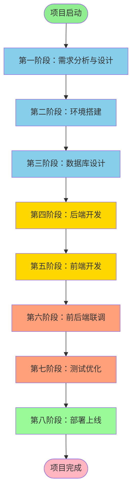
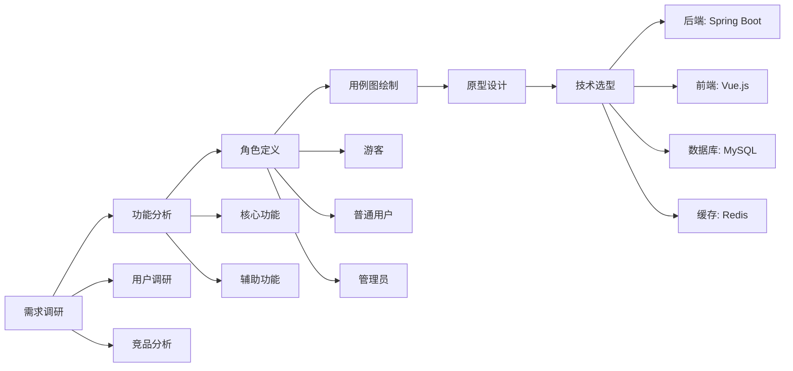
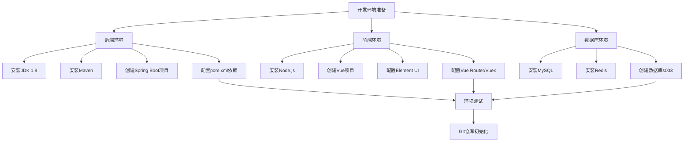
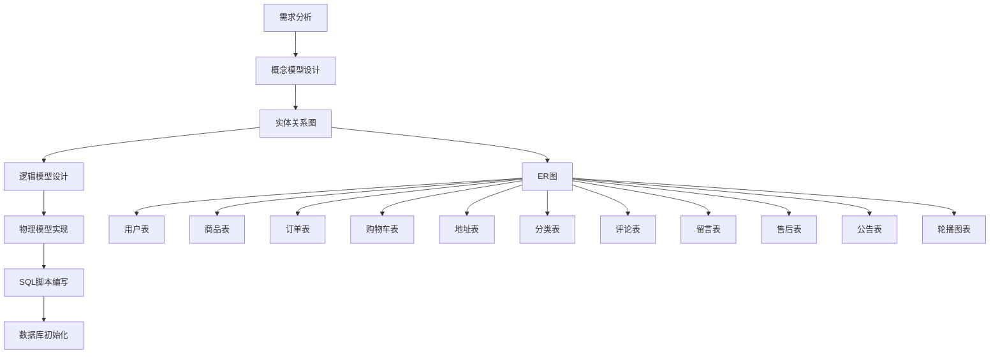
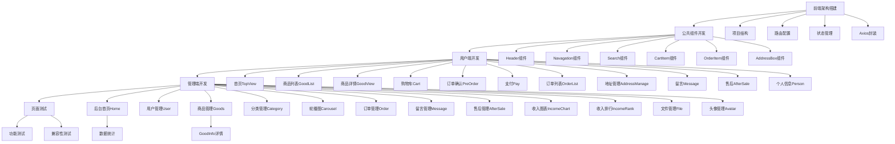
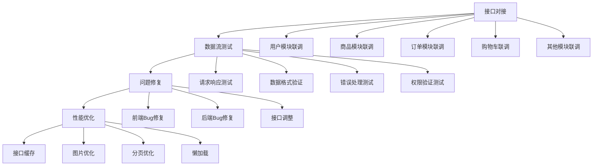
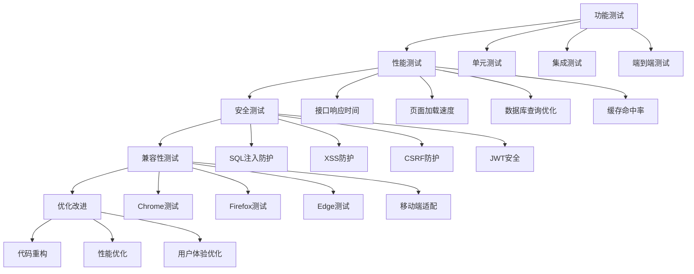
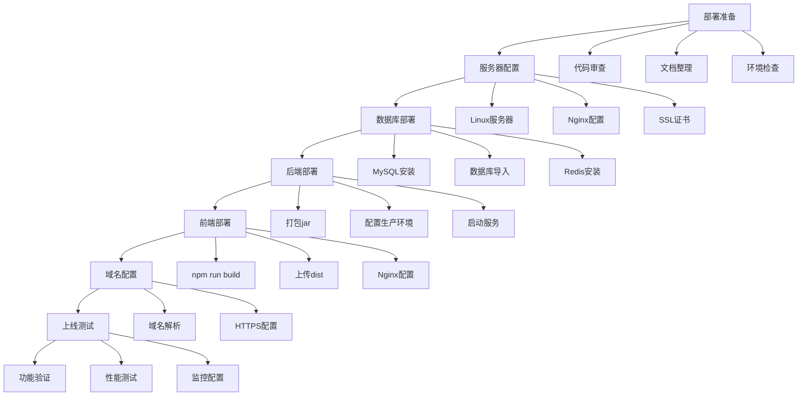
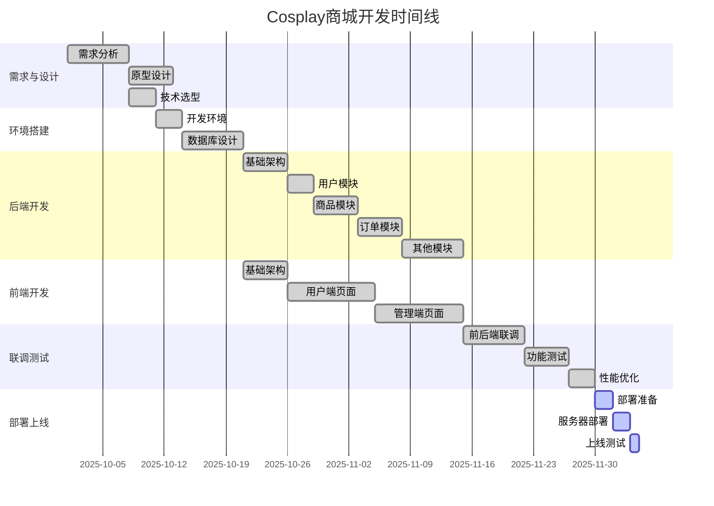
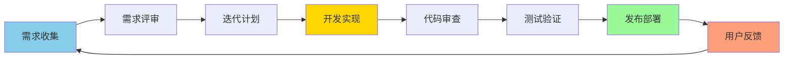

# Cosplay商城系统 - 开发流程图

> 项目名称：Cosplay服装电商系统  
> 开发周期：约8-12周  
> 团队规模：全栈开发（单人或小团队）

---

## 📊 整体开发流程图



---

## 📋 详细开发流程

### 第一阶段：需求分析与设计（1周）



**交付物**：
- ✅ 需求规格说明书
- ✅ 用例图、活动图
- ✅ 原型设计稿
- ✅ 技术方案文档

---

### 第二阶段：环境搭建（3天）



**配置文件**：
- `application.yml` - Spring Boot配置
- `package.json` - Node.js依赖
- `pom.xml` - Maven依赖

---

### 第三阶段：数据库设计（1周）



**核心数据表**（18张表）：

| 表名 | 说明 | 关键字段 |
|------|------|---------|
| user | 用户表 | id, username, password, role |
| good | 商品表 | id, name, price, sales, status |
| orders | 订单表 | id, orderNo, userId, total, state |
| cart | 购物车表 | id, userId, goodId, num |
| address | 地址表 | id, userId, name, phone, address |
| category | 分类表 | id, name, icon |
| comment | 评论表 | id, userId, goodId, content |
| message | 留言表 | id, userId, title, content, reply |
| after_sale | 售后表 | id, orderNo, userId, type, status |
| notice | 公告表 | id, title, content, time |
| carousel | 轮播图表 | id, img, link |
| icon | 图标表 | id, name, categoryId |

**交付物**：
- ✅ 数据库设计文档
- ✅ ER图
- ✅ SQL初始化脚本（s003.sql）

---

### 第四阶段：后端开发（3-4周）

```mermaid
graph TB
    D1[基础架构搭建] --> D2[公共模块开发]
    D2 --> D3[业务模块开发]
    D3 --> D4[接口测试]
    
    D1 --> D1_1[项目结构创建]
    D1 --> D1_2[配置文件编写]
    D1 --> D1_3[跨域配置]
    D1 --> D1_4[拦截器配置]
    
    D2 --> D2_1[统一返回结果Result]
    D2 --> D2_2[JWT工具类]
    D2 --> D2_3[权限注解@Authority]
    D2 --> D2_4[异常处理]
    
    D3 --> M1[用户模块]
    D3 --> M2[商品模块]
    D3 --> M3[订单模块]
    D3 --> M4[购物车模块]
    D3 --> M5[地址模块]
    D3 --> M6[分类模块]
    D3 --> M7[评论模块]
    D3 --> M8[留言模块]
    D3 --> M9[售后模块]
    D3 --> M10[运营管理]
    D3 --> M11[收入统计]
    D3 --> M12[文件上传]
    
    M1 --> C1[UserController]
    M1 --> S1[UserService]
    M1 --> MP1[UserMapper]
    
    M2 --> C2[GoodController]
    M2 --> S2[GoodService]
    M2 --> MP2[GoodMapper]
    M2 --> S2_1[RecommendationService]
    
    M3 --> C3[OrderController]
    M3 --> S3[OrderService]
    M3 --> MP3[OrderMapper]
    
    D4 --> T1[Postman测试]
    D4 --> T2[单元测试]
```

**开发顺序**：
1. **基础模块**（第1周）
   - 用户认证（登录/注册）
   - JWT鉴权
   - 文件上传

2. **核心业务**（第2周）
   - 商品管理
   - 分类管理
   - 购物车

3. **交易流程**（第3周）
   - 订单管理
   - 地址管理
   - 支付流程

4. **扩展功能**（第4周）
   - 评论系统
   - 留言系统
   - 售后管理
   - 数据统计

**技术实现**：
```
mall-server/
├── annotation/         # 自定义注解
│   └── Authority.java
├── common/            # 公共类
│   └── Result.java
├── config/            # 配置类
│   ├── CorsConfig.java
│   ├── RedisConfig.java
│   └── WebConfig.java
├── controller/        # 控制器（16个）
│   ├── UserController.java
│   ├── GoodController.java
│   └── OrderController.java
├── entity/            # 实体类（20个）
│   ├── User.java
│   ├── Good.java
│   └── Orders.java
├── mapper/            # 数据访问层
│   ├── UserMapper.java
│   └── GoodMapper.java
├── service/           # 业务逻辑层
│   ├── UserService.java
│   ├── GoodService.java
│   └── RecommendationService.java
├── interceptor/       # 拦截器
│   └── JwtInterceptor.java
└── utils/             # 工具类
    ├── TokenUtils.java
    └── BCryptForMD5.java
```

**交付物**：
- ✅ 完整的REST API
- ✅ 接口文档
- ✅ 单元测试

---

### 第五阶段：前端开发（3-4周）



**开发顺序**：
1. **基础页面**（第1周）
   - 登录/注册
   - 首页布局
   - 公共组件

2. **用户端**（第2周）
   - 商品浏览
   - 购物车
   - 订单流程

3. **管理端**（第3周）
   - 后台布局
   - 商品管理
   - 订单管理

4. **功能完善**（第4周）
   - 数据统计
   - 留言售后
   - 文件管理

**技术实现**：
```
mall-web/
├── src/
│   ├── components/        # 公共组件（8个）
│   │   ├── Header.vue
│   │   ├── Navagation.vue
│   │   └── CartItem.vue
│   ├── views/
│   │   ├── front/         # 用户端（11个页面）
│   │   │   ├── TopView.vue
│   │   │   ├── good/
│   │   │   │   ├── GoodList.vue
│   │   │   │   └── GoodView.vue
│   │   │   └── order/
│   │   │       ├── Cart.vue
│   │   │       └── OrderList.vue
│   │   ├── manage/        # 管理端（14个页面）
│   │   │   ├── Home.vue
│   │   │   ├── good/
│   │   │   │   ├── Goods.vue
│   │   │   │   └── Category.vue
│   │   │   └── income/
│   │   │       ├── IncomeChart.vue
│   │   │       └── IncomeRank.vue
│   │   ├── Login.vue
│   │   └── Register.vue
│   ├── router/
│   │   └── index.js       # 路由配置
│   ├── store/
│   │   └── index.js       # 状态管理
│   └── utils/
│       └── request.js     # Axios封装
├── package.json
└── vue.config.js
```

**Vue 3重构**（已完成）：
- ✅ 46个Vue组件
- ✅ Composition API
- ✅ Element Plus 2.9
- ✅ Vue Router 4
- ✅ Vuex 4

**交付物**：
- ✅ 用户端界面
- ✅ 管理端界面
- ✅ 响应式设计

---

### 第六阶段：前后端联调（1周）



**联调检查清单**：

| 模块 | 接口数 | 前端页面 | 状态 |
|------|--------|---------|------|
| 用户认证 | 5+ | Login, Register | ✅ |
| 商品管理 | 12+ | GoodList, GoodView, Goods | ✅ |
| 订单处理 | 10 | OrderList, PreOrder, Pay | ✅ |
| 购物车 | 6 | Cart | ✅ |
| 地址管理 | 5 | AddressManage | ✅ |
| 评论留言 | 8 | Message, Comment | ✅ |
| 售后管理 | 5 | AfterSale | ✅ |
| 数据统计 | 4 | IncomeChart, IncomeRank | ✅ |

**测试工具**：
- Postman - API测试
- Chrome DevTools - 前端调试
- Redis Desktop Manager - 缓存监控

---

### 第七阶段：测试优化（1周）



**测试覆盖率**：
- 功能测试：100%
- 接口测试：100%
- 兼容性测试：主流浏览器
- 性能测试：响应时间<1s

**优化成果**：
- ✅ Redis缓存热点数据
- ✅ 分页查询优化
- ✅ 图片懒加载
- ✅ 组件按需加载
- ✅ SQL索引优化

---

### 第八阶段：部署上线（3天）



**部署架构**：

```
用户请求
    ↓
Nginx（反向代理/静态资源）
    ├── /api/* → Spring Boot（9191端口）
    └── /* → Vue前端（dist目录）
              ↓
         Spring Boot
              ├── MySQL（3306端口）
              └── Redis（6379端口）
```

**部署脚本**：

```bash
# 后端部署
cd mall-server
mvn clean package
java -jar target/mall-server-0.0.1-SNAPSHOT.jar

# 前端部署
cd mall-web
npm run build
# 将dist目录部署到Nginx

# Nginx配置
server {
    listen 80;
    server_name yourdomain.com;
    
    # 前端静态资源
    location / {
        root /path/to/dist;
        try_files $uri $uri/ /index.html;
    }
    
    # 后端API代理
    location /api {
        proxy_pass http://localhost:9191;
        proxy_set_header Host $host;
    }
}
```

---

## 📅 开发时间线（甘特图）



---

## 🔄 迭代开发流程（敏捷开发）



**迭代周期**：2周/Sprint

| Sprint | 时间 | 目标 | 交付物 |
|--------|------|------|--------|
| Sprint 1 | 第1-2周 | 基础架构+用户模块 | 登录注册、JWT鉴权 |
| Sprint 2 | 第3-4周 | 商品模块 | 商品浏览、分类、搜索 |
| Sprint 3 | 第5-6周 | 购物车+订单 | 完整购物流程 |
| Sprint 4 | 第7-8周 | 用户端完善 | 地址、评论、留言 |
| Sprint 5 | 第9-10周 | 管理端开发 | 后台管理系统 |
| Sprint 6 | 第11-12周 | 测试优化 | 系统上线 |

---

## 📂 项目文档清单

### 设计文档
- [x] 需求规格说明书
- [x] 数据库设计文档（DATABASE_DESIGN.md）
- [x] 系统架构文档（SYSTEM_DOCUMENTATION.md）
- [x] 推荐系统设计（RECOMMENDATION_SYSTEM.md）
- [x] 页面代码文档（PAGE_CODE_DOCUMENTATION.md）

### API文档
- [x] API接口总览
- [x] 用户认证API
- [x] 商品管理API
- [x] 订单管理API
- [x] 购物车API
- [x] 文件上传API
- [x] 地址与评论API
- [x] 系统管理API
- [x] 售后管理API
- [x] 留言管理API
- [x] 收入管理API

### 测试文档
- [x] 测试用例（TEST_CASES.md）
- [x] 测试报告（TEST_REPORT.md）
- [x] 集成测试报告（INTEGRATION_TEST_REPORT.md）

### 其他文档
- [x] README.md
- [x] 测试说明（TEST_README.md）

---

## 🎯 关键技术决策

| 决策点 | 选择 | 原因 |
|--------|------|------|
| 后端框架 | Spring Boot 2.5.6 | 生态成熟、快速开发 |
| 前端框架 | Vue.js 2 → Vue 3 | 渐进式、易上手，Vue 3性能更好 |
| UI库 | Element UI → Element Plus | 组件丰富、文档完善 |
| 数据库 | MySQL 8.0 | 开源、稳定、性能好 |
| 缓存 | Redis | 高性能、支持多种数据结构 |
| 认证 | JWT | 无状态、易扩展 |
| ORM | MyBatis-Plus | 简化CRUD、学习成本低 |

---

## 📈 开发里程碑

### ✅ 已完成

- [x] 项目初始化（2025-10）
- [x] 后端核心功能开发
- [x] 前端用户端开发
- [x] 前端管理端开发
- [x] 前后端联调
- [x] Vue 2到Vue 3重构（2026-04）
- [x] 代码质量优化
- [x] API文档完善

### 🔄 进行中

- [ ] 性能优化
- [ ] 移动端适配

### 📋 计划中

- [ ] 微信支付集成
- [ ] 支付宝集成
- [ ] 物流跟踪
- [ ] 消息通知

---

## 🚀 快速启动命令

```bash
# 1. 启动Redis
cd redis
RedisStarter.bat

# 2. 启动后端
cd mall-server
mvn spring-boot:run
# 访问：http://localhost:9191

# 3. 启动前端
cd mall-web
npm run serve
# 访问：http://localhost:9194
```

---

## 📞 技术支持

- 📖 完整文档：查看 `.qoder/repowiki/zh/content/` 目录
- 🐛 问题反馈：提交Issue
- 💡 功能建议：提交Feature Request

---

**文档生成时间**：2026-04-15  
**项目版本**：v3.0（Vue 3重构完成）  
**开发状态**：✅ 核心功能已完成
